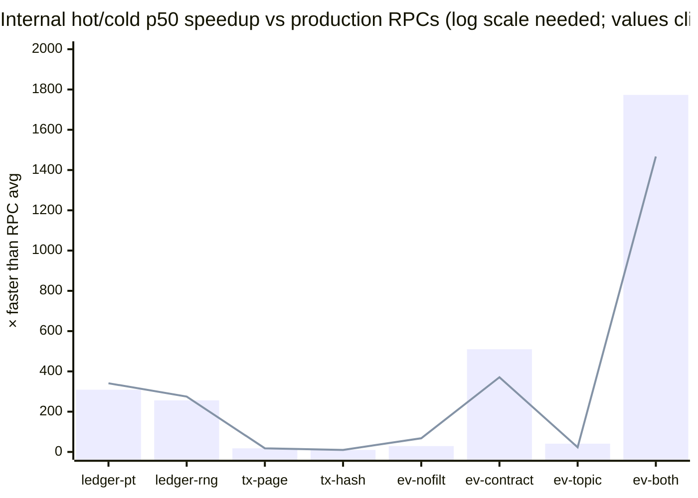
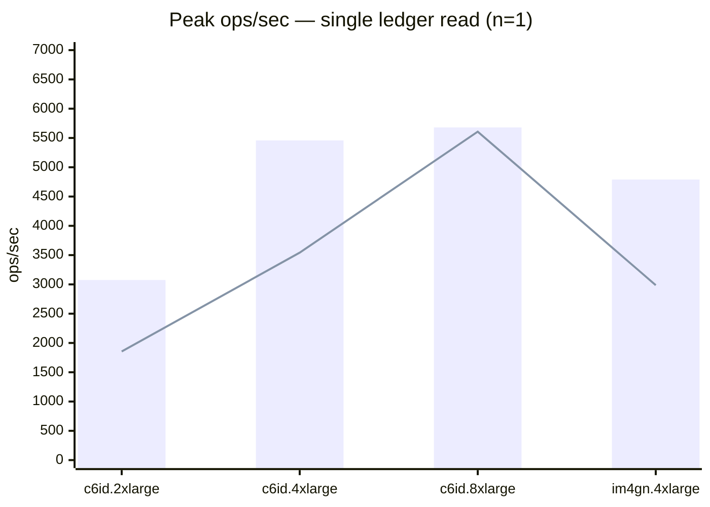
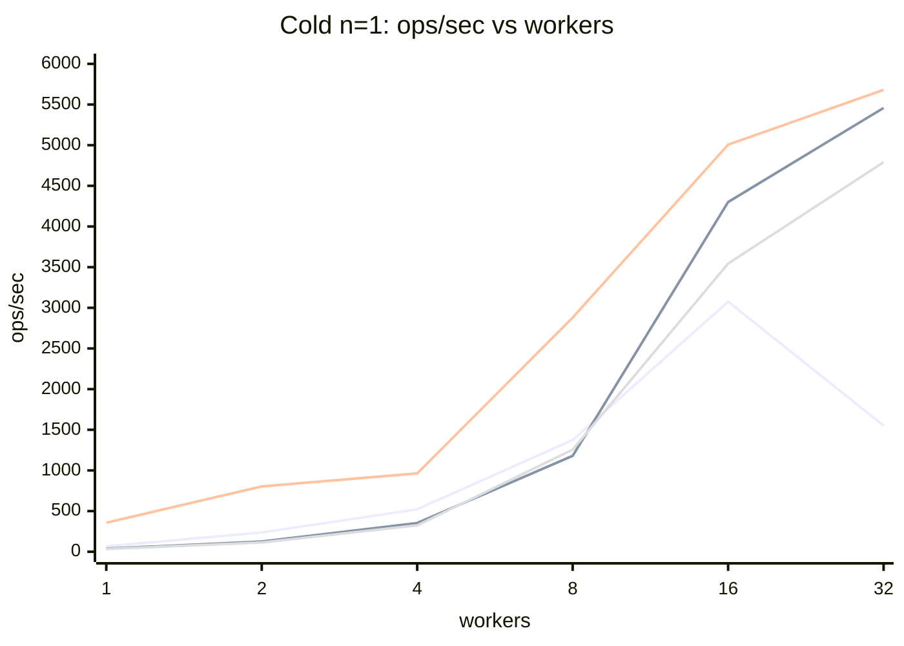
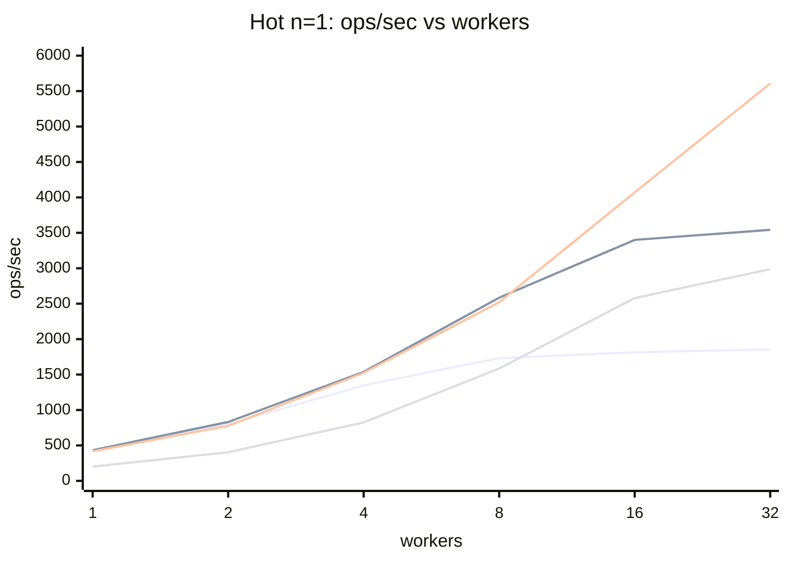
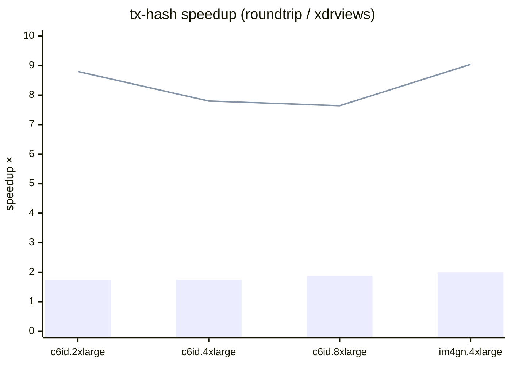
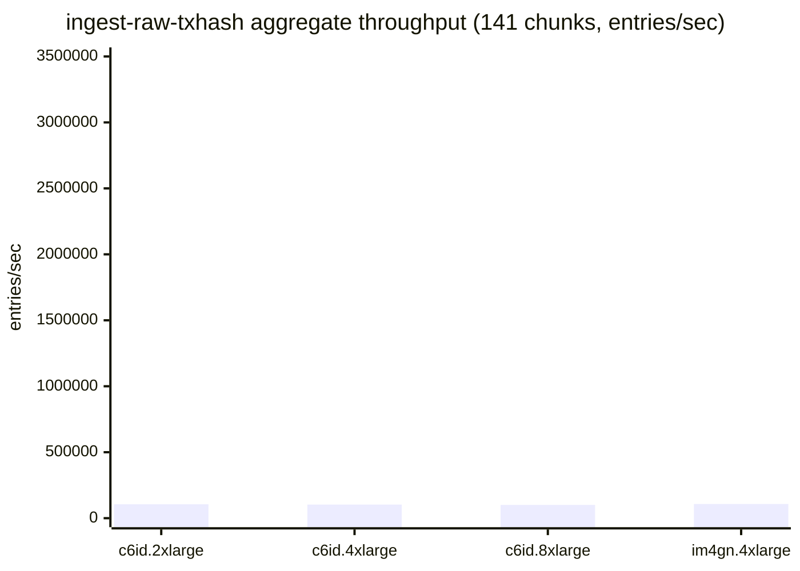

# stellar-rpc full-history bench comparison — 2026-05-21

Cross-machine summary of `cmd/stellar-rpc/scripts/bench-fullhistory` runs.
Source per-iter CSVs live at `gs://rpc-full-history/benchmarks/2026-05-21/<machine-dir>/`;
the summary CSVs that back every table here are at `gs://rpc-full-history/benchmarks/2026-05-21/_summary/`.

> **Newer run available:** a later run on the rewritten bench harness is at
> [`2026-06-03-cross-machine.md`](./2026-06-03-cross-machine.md) (condensed view:
> [`2026-06-03-summary-table.md`](./2026-06-03-summary-table.md)). The harness
> changed between these runs — several benchmarks are no longer 1:1, and `ops/s`
> is **not** comparable across the two; see the 2026-06-03 report's methodology
> section before comparing.

## 1. Test machines

| Instance | Arch | vCPUs | RAM | Local disk | CPU |
|---|---|---|---|---|---|
| c6id.2xlarge | x86_64 | 8 | 16 GB | 441 GB NVMe | Intel Xeon Platinum 8375C @ 2.90GHz |
| c6id.4xlarge | x86_64 | 16 | 30 GB | 884 GB NVMe | Intel Xeon Platinum 8375C @ 2.90GHz |
| c6id.8xlarge | x86_64 | 32 | 62 GB | 1900 GB NVMe | Intel Xeon Platinum 8375C @ 2.90GHz |
| im4gn.4xlarge | aarch64 | 16 | 61 GB | 6929 GB NVMe | AWS Graviton2 (Neoverse-N1) |

All four ran the same bench binary (Go 1.26.3, RocksDB 10.9.1, zstd 1.5.7) 
on identical data (chunks 5859–5999 cold, chunk 5000 hot, chunk 5999 for ingest).
Data lives on a local NVMe instance store on every machine, not EBS.

## 2. Internal vs production RPC providers (p50)

External-RPC-provider baseline from a prior black-box benchmark, juxtaposed with 
the internal full-history hot/cold p50 for the same workload. `rpc avg/min/max` 
aggregate over `n` providers (the `missing` column lists providers absent from a 
workload). Internal hot/cold here are from an earlier bench run snapshot — the 
current per-machine dataset is in Section 12.

| Scenario | Workload | Hot | Cold | RPC avg | RPC min | RPC max | n | vs hot | vs cold | Missing providers |
|---|---|---|---|---|---|---|---|---|---|---|
| ledger-point |  | 1.4 ms | 1.3 ms | 439.4 ms | 227.0 ms | 693.3 ms | 6 | 309× | 341× |  |
| ledger-range | n=10 | 14.4 ms | 13.4 ms | 3.70 s | 2.35 s | 7.10 s | 6 | 256× | 275× |  |
| tx-page | page=20 | 11.9 ms | 11.9 ms | 211.5 ms | 111.3 ms | 299.2 ms | 6 | 18× | 18× |  |
| tx-hash |  | 11.9 ms | 11.8 ms | 122.7 ms | 47.9 ms | 181.1 ms | 4 | 10× | 10× | onfinality, sorobanrpc |
| events | no-filter | 5.3 ms | 2.3 ms | 155.1 ms | 84.6 ms | 206.0 ms | 4 | 29× | 68× | onfinality, sorobanrpc |
| events | contract | 0.2 ms | 0.3 ms | 109.1 ms | 39.3 ms | 158.3 ms | 4 | 510× | 371× | onfinality, sorobanrpc |
| events | topic | 4.7 ms | 8.3 ms | 193.9 ms | 29.5 ms | 293.0 ms | 4 | 41× | 23× | onfinality, sorobanrpc |
| events | both | 0.1 ms | 0.1 ms | 118.8 ms | 44.4 ms | 164.0 ms | 4 | 1773× | 1467× | onfinality, sorobanrpc |

*Bar = hot tier, line = cold tier. The `events both` workload (filter on both 
contract and topic) is the most lopsided — internal lookup is essentially free 
(MPHF + bitmap intersect) while RPCs scan-and-filter. `tx-hash` is the tightest 
ratio (~10×) because all RPCs index transactions by hash too — the gap is RPC 
overhead, not algorithmic.*

## 3. Read performance: peak throughput

Best ops/sec the machine reaches across the worker sweep (1–32 workers) for 
each tier × ledgers-per-read. Cold = page-cache-evict + fresh open per iter; 
hot = shared RocksDB handle + 100-iter warmup.

| Machine | Cold n=1 | Cold n=10 | Cold n=20 | Hot n=1 | Hot n=10 | Hot n=20 |
|---|---|---|---|---|---|---|
| c6id.2xlarge | 3,075 | 451 | 221 | 1,855 | 208 | 106 |
| c6id.4xlarge | 5,458 | 868 | 460 | 3,542 | 390 | 195 |
| c6id.8xlarge | 5,680 | 1,390 | 742 | 5,608 | 608 | 299 |
| im4gn.4xlarge | 4,790 | 865 | 404 | 2,987 | 353 | 176 |

*Bar = cold tier peak, line = hot tier peak. Cold beats hot at peak across every machine — 
cold random-chunk reads parallelize across 141 different packfiles, while hot reads contend on a single RocksDB handle.*

## 4. Worker scaling (cold n=1)

How throughput scales with worker count on each machine. Cold n=1 is the most 
I/O-bound workload, so >cores often still pays off (evict + reopen per iter).

| Machine | 1w | 4w | 16w | 32w |
|---|---|---|---|---|
| c6id.2xlarge | 67 | 522 | 3,075 | 1,552 |
| c6id.4xlarge | 38 | 353 | 4,301 | 5,458 |
| c6id.8xlarge | 357 | 964 | 5,006 | 5,680 |
| im4gn.4xlarge | 34 | 325 | 3,544 | 4,790 |

*Series order: c6id.2xlarge, c6id.4xlarge, c6id.8xlarge, im4gn.4xlarge. Mermaid `xychart-beta` 
doesn't support per-line legends inline — colors map to the series order above.*

*Same series order. Hot single-ledger reads are RocksDB-block-cache hits — CPU-bound.*

## 5. tx-page: latency vs page size

Single-worker bench, p50 latency for a page of N transactions.
Hot (RocksDB, warmup) is roughly 2× faster than cold (packfile, fresh open).

| Machine | Cold p=20 | Cold p=100 | Cold p=200 | Hot p=20 | Hot p=100 | Hot p=200 |
|---|---|---|---|---|---|---|
| c6id.2xlarge | 12.7 ms | 13.6 ms | 22.5 ms | 6.9 ms | 7.8 ms | 12.2 ms |
| c6id.4xlarge | 13.4 ms | 14.8 ms | 23.3 ms | 6.9 ms | 7.8 ms | 12.3 ms |
| c6id.8xlarge | 13.6 ms | 15.1 ms | 24.0 ms | 6.8 ms | 7.6 ms | 11.8 ms |
| im4gn.4xlarge | 23.7 ms | 24.8 ms | 42.0 ms | 13.4 ms | 14.4 ms | 22.3 ms |

## 6. tx-hash: xdr-views vs round-trip path

`getTransaction(hash)` end-to-end. p50 latency for hash hits.
xdr-views slices the result/meta straight from the raw LCM; round-trip 
unmarshals the entire LCM and re-serializes each field — much more CPU.

| Machine | Cold xdrviews | Cold roundtrip | Cold speedup | Hot xdrviews | Hot roundtrip | Hot speedup |
|---|---|---|---|---|---|---|
| c6id.2xlarge | 13.2 ms | 22.9 ms | 1.73× | 1.5 ms | 13.5 ms | 8.80× |
| c6id.4xlarge | 13.1 ms | 23.0 ms | 1.75× | 1.7 ms | 13.0 ms | 7.80× |
| c6id.8xlarge | 12.3 ms | 23.1 ms | 1.88× | 1.8 ms | 13.8 ms | 7.64× |
| im4gn.4xlarge | 18.9 ms | 37.8 ms | 2.00× | 2.6 ms | 23.5 ms | 9.04× |

Hot speedup is huge (~8×) because hot fetches finish in microseconds, leaving 
the path's CPU cost dominant. Cold is fetch-bound (~2 ms packfile open + zstd 
decode), so the materialize path saves a smaller fraction of total latency.

*Bar = cold, line = hot. Speedup is consistently ~1.7–2× cold and ~8× hot across machines.*

## 7. Per-ledger ingest throughput

Synchronous single-stream ingestion: each `Add` call WAL-fsyncs before 
returning. p50 / ops-per-second from 10,000-ledger streams.

| Machine | hot-ledgers | hot-txhash (xdrviews) | hot-events (xdrviews) | hot-events (roundtrip) |
|---|---|---|---|---|
| c6id.2xlarge | 299 ops/s | 610 ops/s | 100 ops/s | 44 ops/s |
| c6id.4xlarge | 310 ops/s | 612 ops/s | 102 ops/s | 47 ops/s |
| c6id.8xlarge | 317 ops/s | 658 ops/s | 111 ops/s | 49 ops/s |
| im4gn.4xlarge | 192 ops/s | 456 ops/s | 65 ops/s | 28 ops/s |

Hot-ledgers and hot-txhash are tighter across machines because 
RocksDB WAL-fsync latency on local NVMe dominates. Events ingest is CPU-bound, 
so the spread widens — roundtrip path on Graviton2 is ~2× slower than on Ice Lake.

## 8. Bulk / one-shot ingest

Per-chunk or single-shot ingest benches.

| Machine | cold-events xdrviews (events/s) | cold-events roundtrip (events/s) | ingest-raw-txhash (entries/s) | build-txhash-index (keys/s) | cold-ledgers-ingest (ledgers/s) |
|---|---|---|---|---|---|
| c6id.2xlarge | 194,681 | 53,451 | 105,429 | 20,519,559 | 289 |
| c6id.4xlarge | 206,959 | 58,674 | 103,428 | 36,756,938 | 314 |
| c6id.8xlarge | 226,486 | 58,657 | 100,512 | 42,998,821 | 302 |
| im4gn.4xlarge | 142,329 | 33,167 | 107,704 | 39,403,849 | 291 |

`build-txhash-index` is the CPU-bound phase 2 of the cold txhash MPHF build 
(streamhash with 8 parallel block-build workers). `cold-ledgers-ingest` is 
network-bound — pulls from `sdf-ledger-close-meta` via GCS+ADC.

## 9. Cold vs Hot speedup

How much faster the hot tier is for matching workloads (workers=1).

| Machine | Ledger 1@1w | Ledger 1@1w speedup | tx-page p=20 | tx-page speedup | tx-hash xdrviews hit | tx-hash speedup |
|---|---|---|---|---|---|---|
| c6id.2xlarge | 2.2 / 0.8 ms | 2.9× | 12.7 / 6.9 ms | 1.8× | 13.2 / 1.5 ms | 8.6× |
| c6id.4xlarge | 2.4 / 0.8 ms | 3.0× | 13.4 / 6.9 ms | 1.9× | 13.1 / 1.7 ms | 7.9× |
| c6id.8xlarge | 2.4 / 0.8 ms | 2.9× | 13.6 / 6.8 ms | 2.0× | 12.3 / 1.8 ms | 6.8× |
| im4gn.4xlarge | 3.0 / 1.8 ms | 1.6× | 23.7 / 13.4 ms | 1.8× | 18.9 / 2.6 ms | 7.3× |

*Format: cold_p50 / hot_p50.*

## 10. Architecture: x86 vs ARM (same vCPU count)

c6id.4xlarge (Intel Ice Lake, 16 vCPU) vs im4gn.4xlarge (AWS Graviton2, 16 vCPU). 
Both 16 vCPU, both local NVMe — direct apples-to-apples on the ISA.

| Workload | x86 (c6id.4xlarge) | arm (im4gn.4xlarge) | arm / x86 |
|---|---|---|---|
| cold n=1 ops/s @ 1w | 38 ops/s | 34 ops/s | 0.89× |
| hot n=1 ops/s @ 1w | 433 ops/s | 201 ops/s | 0.46× |
| cold n=1 peak ops/s | 5,458 ops/s | 4,790 ops/s | 0.88× |
| hot n=1 peak ops/s | 3,542 ops/s | 2,987 ops/s | 0.84× |
| cold-tx-hash xdrviews p50 | 13.1 ms | 18.9 ms | 1.44× |
| hot-tx-hash xdrviews p50 | 1.7 ms | 2.6 ms | 1.57× |
| hot-ledgers-ingest  p50 | 3.10 ms | 5.07 ms | 1.63× |
| hot-txhash-ingest xdrviews p50 | 1.57 ms | 2.11 ms | 1.34× |
| hot-events-ingest xdrviews p50 | 9.73 ms | 15.47 ms | 1.59× |

For throughput (ops/s) higher is better → arm/x86 < 1 means arm is slower.
For latency higher is worse → arm/x86 > 1 means arm is slower.
On this workload mix, Graviton2 trails Ice Lake by ~10–60% per-operation, 
but the gap narrows on RocksDB-fsync-bound benches (hot ingest paths).

## 11. Caveats

- All 21 CSVs present on every machine — full parity. 
Events xdrviews+roundtrip ran on all four.

- **c6id.2xlarge tx-page CSVs** use the older schema (`iteration_ns` only, no per-phase 
  breakdown). Total latencies are still comparable; per-phase fetch/decode/scan 
  columns are blank for that machine.

- **Chunk selection**: cold-* benches use chunk 5999 (most recent local pack), 
  hot-ledgers/hot-tx-page use chunk 5000 (existing hot store on disk). They 
  cover different ledger ranges — cold vs hot per-iter numbers are still 
  comparable as relative tier costs but not as same-data comparisons.

- **hot-tx-hash** uses freshly-ingested chunk-5999 hot stores (because the existing 
  hot-5000 store has no matching cold pack to sample hashes from).

- **Worker sweep**: all machines ran workers=1,2,4,8,16,32. Machines with fewer 
  vCPUs (c6id.2xlarge = 8) oversubscribe at workers > vCPUs; their 32-worker numbers 
  test how the scheduler handles oversubscription, not raw scaling.

## 12. Per-machine raw results

Every bench result for each machine, in one place. Same numbers as the 
cross-machine tables above, transposed so you can see one machine's whole 
performance profile at a glance.

### c6id.2xlarge  —  8 vCPU x86_64, 16 GB RAM, 441 GB NVMe

| Bench | Config | p50 (ms) | p90 (ms) | p99 (ms) | Throughput |
|---|---|---|---|---|---|
| cold-ledgers | n=1 w=1 | 2.216 | 3.941 | 5.343 | 67 ops/s |
| cold-ledgers | n=1 w=2 | 2.118 | 3.451 | 5.338 | 237 ops/s |
| cold-ledgers | n=1 w=4 | 2.181 | 3.519 | 4.924 | 522 ops/s |
| cold-ledgers | n=1 w=8 | 2.602 | 4.455 | 7.064 | 1,374 ops/s |
| cold-ledgers | n=1 w=16 | 3.918 | 6.889 | 14.444 | 3,075 ops/s |
| cold-ledgers | n=1 w=32 | 22.381 | 31.793 | 33.169 | 1,552 ops/s |
| cold-ledgers | n=10 w=1 | 11.231 | 15.656 | 19.012 | 85 ops/s |
| cold-ledgers | n=10 w=2 | 12.722 | 16.455 | 22.134 | 149 ops/s |
| cold-ledgers | n=10 w=4 | 13.363 | 17.751 | 23.990 | 279 ops/s |
| cold-ledgers | n=10 w=8 | 16.366 | 22.095 | 30.112 | 451 ops/s |
| cold-ledgers | n=10 w=16 | 39.351 | 57.651 | 72.360 | 386 ops/s |
| cold-ledgers | n=10 w=32 | 99.329 | 118.305 | 147.150 | 317 ops/s |
| cold-ledgers | n=20 w=1 | 22.539 | 30.775 | 40.214 | 42 ops/s |
| cold-ledgers | n=20 w=2 | 25.046 | 30.803 | 39.164 | 78 ops/s |
| cold-ledgers | n=20 w=4 | 25.752 | 34.166 | 40.014 | 143 ops/s |
| cold-ledgers | n=20 w=8 | 33.383 | 43.370 | 52.029 | 221 ops/s |
| cold-ledgers | n=20 w=16 | 79.351 | 105.758 | 138.159 | 197 ops/s |
| cold-ledgers | n=20 w=32 | 173.738 | 212.313 | 261.079 | 179 ops/s |
| hot-ledgers | n=1 w=1 | 0.771 | 1.207 | 1.747 | 436 ops/s |
| hot-ledgers | n=1 w=2 | 0.859 | 1.244 | 1.595 | 798 ops/s |
| hot-ledgers | n=1 w=4 | 1.050 | 1.669 | 2.410 | 1,349 ops/s |
| hot-ledgers | n=1 w=8 | 1.513 | 2.683 | 3.632 | 1,732 ops/s |
| hot-ledgers | n=1 w=16 | 1.804 | 7.380 | 12.916 | 1,814 ops/s |
| hot-ledgers | n=1 w=32 | 2.019 | 15.404 | 33.587 | 1,855 ops/s |
| hot-ledgers | n=10 w=1 | 8.684 | 10.181 | 11.167 | 44 ops/s |
| hot-ledgers | n=10 w=2 | 9.180 | 11.085 | 13.884 | 79 ops/s |
| hot-ledgers | n=10 w=4 | 11.540 | 13.939 | 15.520 | 127 ops/s |
| hot-ledgers | n=10 w=8 | 16.788 | 20.779 | 24.816 | 173 ops/s |
| hot-ledgers | n=10 w=16 | 29.309 | 40.737 | 53.578 | 195 ops/s |
| hot-ledgers | n=10 w=32 | 49.822 | 89.770 | 134.417 | 208 ops/s |
| hot-ledgers | n=20 w=1 | 16.397 | 18.408 | 20.576 | 23 ops/s |
| hot-ledgers | n=20 w=2 | 18.930 | 21.934 | 24.315 | 40 ops/s |
| hot-ledgers | n=20 w=4 | 21.747 | 26.121 | 28.682 | 67 ops/s |
| hot-ledgers | n=20 w=8 | 34.304 | 39.800 | 44.161 | 86 ops/s |
| hot-ledgers | n=20 w=16 | 57.443 | 72.719 | 88.136 | 101 ops/s |
| hot-ledgers | n=20 w=32 | 107.561 | 161.127 | 204.395 | 106 ops/s |
| cold-tx-page | page=20 | 12.693 | 15.587 | 26.996 | 77 ops/s |
| cold-tx-page | page=100 | 13.607 | 25.673 | 29.203 | 62 ops/s |
| cold-tx-page | page=200 | 22.504 | 27.376 | 31.539 | 48 ops/s |
| hot-tx-page | page=20 | 6.916 | 9.168 | 16.665 | 139 ops/s |
| hot-tx-page | page=100 | 7.836 | 15.083 | 18.545 | 108 ops/s |
| hot-tx-page | page=200 | 12.231 | 16.938 | 23.633 | 83 ops/s |
| cold-tx-hash | xdrviews hit | 13.210 | 16.587 | 18.512 | 74 ops/s |
| cold-tx-hash | xdrviews miss | 10.016 | 13.391 | 14.567 | 95 ops/s |
| cold-tx-hash | roundtrip hit | 22.909 | 26.372 | 29.432 | 44 ops/s |
| cold-tx-hash | roundtrip miss | 9.290 | 13.223 | 13.911 | 101 ops/s |
| hot-tx-hash | xdrviews hit | 1.532 | 2.241 | 3.105 | 624 ops/s |
| hot-tx-hash | xdrviews miss | 0.027 | 0.040 | 0.046 | 38,724 ops/s |
| hot-tx-hash | roundtrip hit | 13.477 | 16.457 | 18.023 | 75 ops/s |
| hot-tx-hash | roundtrip miss | 0.063 | 0.074 | 0.096 | 17,664 ops/s |
| hot-ledgers-ingest | (per ledger) | 3.178 | 4.183 | 5.834 | 299 ops/s |
| hot-txhash-ingest | xdrviews | 1.569 | 2.143 | 2.835 | 610 ops/s (2,819,743 tx total) |
| hot-events-ingest | xdrviews | 9.740 | 12.305 | 22.520 | 100 ops/s (9,901,325 events total) |
| hot-events-ingest | roundtrip | 21.371 | 31.303 | 54.417 | 44 ops/s (9,901,325 events total) |
| cold-events-ingest | xdrviews | 50859.1 | — | — | 194,681 events/s |
| cold-events-ingest | roundtrip | 185242.9 | — | — | 53,451 events/s |
| ingest-raw-txhash | xdrviews | 25814.0 | — | — | 105,429 entries/s aggregate |
| build-txhash-index | run | 18647.8 | — | — | 20,519,559 keys/s |
| cold-ledgers-ingest | packfile | 34556.5 | — | — | 289 ledgers/s |

### c6id.4xlarge  —  16 vCPU x86_64, 30 GB RAM, 884 GB NVMe

| Bench | Config | p50 (ms) | p90 (ms) | p99 (ms) | Throughput |
|---|---|---|---|---|---|
| cold-ledgers | n=1 w=1 | 2.422 | 4.122 | 6.164 | 38 ops/s |
| cold-ledgers | n=1 w=2 | 2.071 | 2.956 | 4.891 | 127 ops/s |
| cold-ledgers | n=1 w=4 | 2.097 | 3.227 | 4.518 | 353 ops/s |
| cold-ledgers | n=1 w=8 | 2.029 | 3.305 | 5.862 | 1,180 ops/s |
| cold-ledgers | n=1 w=16 | 2.854 | 4.263 | 8.324 | 4,301 ops/s |
| cold-ledgers | n=1 w=32 | 5.185 | 7.225 | 10.706 | 5,458 ops/s |
| cold-ledgers | n=10 w=1 | 10.425 | 15.230 | 18.614 | 88 ops/s |
| cold-ledgers | n=10 w=2 | 11.545 | 14.993 | 19.754 | 164 ops/s |
| cold-ledgers | n=10 w=4 | 11.904 | 16.522 | 21.973 | 304 ops/s |
| cold-ledgers | n=10 w=8 | 12.771 | 17.380 | 25.150 | 572 ops/s |
| cold-ledgers | n=10 w=16 | 16.887 | 22.940 | 34.106 | 868 ops/s |
| cold-ledgers | n=10 w=32 | 39.187 | 56.184 | 69.842 | 779 ops/s |
| cold-ledgers | n=20 w=1 | 21.734 | 26.585 | 31.943 | 46 ops/s |
| cold-ledgers | n=20 w=2 | 23.130 | 28.666 | 34.088 | 86 ops/s |
| cold-ledgers | n=20 w=4 | 22.704 | 28.890 | 35.298 | 160 ops/s |
| cold-ledgers | n=20 w=8 | 24.779 | 31.803 | 43.649 | 304 ops/s |
| cold-ledgers | n=20 w=16 | 32.502 | 41.420 | 56.249 | 460 ops/s |
| cold-ledgers | n=20 w=32 | 81.472 | 103.987 | 134.890 | 388 ops/s |
| hot-ledgers | n=1 w=1 | 0.800 | 1.375 | 1.903 | 433 ops/s |
| hot-ledgers | n=1 w=2 | 0.752 | 1.231 | 1.648 | 831 ops/s |
| hot-ledgers | n=1 w=4 | 0.903 | 1.371 | 2.157 | 1,538 ops/s |
| hot-ledgers | n=1 w=8 | 1.069 | 1.737 | 2.232 | 2,585 ops/s |
| hot-ledgers | n=1 w=16 | 1.524 | 2.578 | 3.704 | 3,400 ops/s |
| hot-ledgers | n=1 w=32 | 2.035 | 6.968 | 12.391 | 3,542 ops/s |
| hot-ledgers | n=10 w=1 | 7.540 | 8.905 | 9.325 | 50 ops/s |
| hot-ledgers | n=10 w=2 | 8.513 | 10.408 | 12.378 | 87 ops/s |
| hot-ledgers | n=10 w=4 | 9.274 | 11.099 | 13.137 | 154 ops/s |
| hot-ledgers | n=10 w=8 | 11.039 | 13.645 | 15.345 | 266 ops/s |
| hot-ledgers | n=10 w=16 | 17.154 | 20.682 | 23.161 | 346 ops/s |
| hot-ledgers | n=10 w=32 | 29.263 | 40.988 | 53.428 | 390 ops/s |
| hot-ledgers | n=20 w=1 | 16.007 | 18.391 | 19.510 | 23 ops/s |
| hot-ledgers | n=20 w=2 | 17.543 | 20.105 | 22.710 | 42 ops/s |
| hot-ledgers | n=20 w=4 | 20.082 | 23.537 | 26.246 | 74 ops/s |
| hot-ledgers | n=20 w=8 | 25.833 | 29.948 | 33.011 | 115 ops/s |
| hot-ledgers | n=20 w=16 | 34.589 | 40.418 | 44.119 | 171 ops/s |
| hot-ledgers | n=20 w=32 | 59.888 | 76.332 | 92.407 | 195 ops/s |
| cold-tx-page | page=20 | 13.384 | 16.646 | 28.065 | 72 ops/s |
| cold-tx-page | page=100 | 14.790 | 26.951 | 29.764 | 58 ops/s |
| cold-tx-page | page=200 | 23.341 | 28.220 | 30.881 | 46 ops/s |
| hot-tx-page | page=20 | 6.943 | 8.709 | 15.445 | 140 ops/s |
| hot-tx-page | page=100 | 7.797 | 14.589 | 17.496 | 110 ops/s |
| hot-tx-page | page=200 | 12.286 | 16.440 | 21.595 | 84 ops/s |
| cold-tx-hash | xdrviews hit | 13.142 | 16.072 | 17.752 | 75 ops/s |
| cold-tx-hash | xdrviews miss | 9.582 | 11.960 | 12.839 | 102 ops/s |
| cold-tx-hash | roundtrip hit | 23.005 | 25.779 | 28.219 | 44 ops/s |
| cold-tx-hash | roundtrip miss | 9.770 | 10.485 | 11.631 | 103 ops/s |
| hot-tx-hash | xdrviews hit | 1.660 | 2.538 | 3.307 | 579 ops/s |
| hot-tx-hash | xdrviews miss | 0.027 | 0.035 | 0.040 | 40,502 ops/s |
| hot-tx-hash | roundtrip hit | 12.952 | 15.609 | 18.004 | 78 ops/s |
| hot-tx-hash | roundtrip miss | 0.059 | 0.076 | 0.085 | 17,923 ops/s |
| hot-ledgers-ingest | (per ledger) | 3.102 | 4.046 | 5.330 | 310 ops/s |
| hot-txhash-ingest | xdrviews | 1.572 | 2.108 | 2.784 | 612 ops/s (2,819,743 tx total) |
| hot-events-ingest | xdrviews | 9.735 | 12.000 | 17.770 | 102 ops/s (9,901,325 events total) |
| hot-events-ingest | roundtrip | 20.985 | 26.309 | 40.925 | 47 ops/s (9,901,325 events total) |
| cold-events-ingest | xdrviews | 47841.9 | — | — | 206,959 events/s |
| cold-events-ingest | roundtrip | 168752.7 | — | — | 58,674 events/s |
| ingest-raw-txhash | xdrviews | 26215.2 | — | — | 103,428 entries/s aggregate |
| build-txhash-index | run | 10410.1 | — | — | 36,756,938 keys/s |
| cold-ledgers-ingest | packfile | 31885.3 | — | — | 314 ledgers/s |

### c6id.8xlarge  —  32 vCPU x86_64, 62 GB RAM, 1900 GB NVMe

| Bench | Config | p50 (ms) | p90 (ms) | p99 (ms) | Throughput |
|---|---|---|---|---|---|
| cold-ledgers | n=1 w=1 | 2.373 | 3.410 | 5.443 | 357 ops/s |
| cold-ledgers | n=1 w=2 | 2.080 | 3.136 | 5.408 | 803 ops/s |
| cold-ledgers | n=1 w=4 | 2.037 | 2.930 | 4.135 | 964 ops/s |
| cold-ledgers | n=1 w=8 | 2.336 | 3.802 | 6.350 | 2,880 ops/s |
| cold-ledgers | n=1 w=16 | 2.837 | 3.796 | 5.752 | 5,006 ops/s |
| cold-ledgers | n=1 w=32 | 5.157 | 6.625 | 9.689 | 5,680 ops/s |
| cold-ledgers | n=10 w=1 | 12.104 | 17.412 | 21.553 | 78 ops/s |
| cold-ledgers | n=10 w=2 | 13.052 | 18.245 | 23.176 | 143 ops/s |
| cold-ledgers | n=10 w=4 | 12.390 | 17.349 | 24.214 | 290 ops/s |
| cold-ledgers | n=10 w=8 | 12.525 | 17.164 | 23.688 | 585 ops/s |
| cold-ledgers | n=10 w=16 | 14.028 | 19.553 | 31.471 | 1,017 ops/s |
| cold-ledgers | n=10 w=32 | 20.829 | 29.226 | 42.885 | 1,390 ops/s |
| cold-ledgers | n=20 w=1 | 22.317 | 30.372 | 36.050 | 42 ops/s |
| cold-ledgers | n=20 w=2 | 23.868 | 30.873 | 37.992 | 80 ops/s |
| cold-ledgers | n=20 w=4 | 23.362 | 30.890 | 38.558 | 158 ops/s |
| cold-ledgers | n=20 w=8 | 23.286 | 30.952 | 42.207 | 307 ops/s |
| cold-ledgers | n=20 w=16 | 27.135 | 34.862 | 50.226 | 540 ops/s |
| cold-ledgers | n=20 w=32 | 39.920 | 52.227 | 71.984 | 742 ops/s |
| hot-ledgers | n=1 w=1 | 0.820 | 1.191 | 1.950 | 418 ops/s |
| hot-ledgers | n=1 w=2 | 0.827 | 1.541 | 1.756 | 776 ops/s |
| hot-ledgers | n=1 w=4 | 0.844 | 1.301 | 1.713 | 1,524 ops/s |
| hot-ledgers | n=1 w=8 | 0.996 | 1.694 | 2.413 | 2,521 ops/s |
| hot-ledgers | n=1 w=16 | 1.363 | 2.211 | 3.036 | 4,070 ops/s |
| hot-ledgers | n=1 w=32 | 1.855 | 3.104 | 4.271 | 5,608 ops/s |
| hot-ledgers | n=10 w=1 | 8.887 | 10.087 | 11.562 | 42 ops/s |
| hot-ledgers | n=10 w=2 | 9.811 | 11.786 | 13.404 | 78 ops/s |
| hot-ledgers | n=10 w=4 | 10.556 | 12.455 | 14.559 | 141 ops/s |
| hot-ledgers | n=10 w=8 | 12.905 | 15.943 | 18.152 | 227 ops/s |
| hot-ledgers | n=10 w=16 | 13.487 | 16.221 | 18.701 | 393 ops/s |
| hot-ledgers | n=10 w=32 | 19.894 | 24.372 | 28.441 | 608 ops/s |
| hot-ledgers | n=20 w=1 | 18.150 | 20.290 | 22.031 | 21 ops/s |
| hot-ledgers | n=20 w=2 | 18.479 | 21.945 | 24.218 | 40 ops/s |
| hot-ledgers | n=20 w=4 | 19.473 | 23.271 | 26.352 | 76 ops/s |
| hot-ledgers | n=20 w=8 | 26.476 | 30.741 | 35.107 | 112 ops/s |
| hot-ledgers | n=20 w=16 | 29.700 | 36.025 | 39.600 | 208 ops/s |
| hot-ledgers | n=20 w=32 | 39.625 | 47.434 | 52.407 | 299 ops/s |
| cold-tx-page | page=20 | 13.608 | 16.479 | 29.243 | 72 ops/s |
| cold-tx-page | page=100 | 15.112 | 26.879 | 31.854 | 58 ops/s |
| cold-tx-page | page=200 | 23.968 | 28.766 | 32.156 | 45 ops/s |
| hot-tx-page | page=20 | 6.820 | 8.848 | 16.264 | 142 ops/s |
| hot-tx-page | page=100 | 7.607 | 14.136 | 16.487 | 113 ops/s |
| hot-tx-page | page=200 | 11.844 | 16.408 | 22.577 | 86 ops/s |
| cold-tx-hash | xdrviews hit | 12.283 | 13.630 | 15.247 | 81 ops/s |
| cold-tx-hash | xdrviews miss | 8.754 | 9.584 | 10.955 | 113 ops/s |
| cold-tx-hash | roundtrip hit | 23.127 | 26.421 | 28.433 | 43 ops/s |
| cold-tx-hash | roundtrip miss | 9.938 | 12.796 | 13.789 | 97 ops/s |
| hot-tx-hash | xdrviews hit | 1.800 | 2.612 | 3.714 | 540 ops/s |
| hot-tx-hash | xdrviews miss | 0.031 | 0.041 | 0.060 | 33,527 ops/s |
| hot-tx-hash | roundtrip hit | 13.750 | 16.380 | 18.897 | 74 ops/s |
| hot-tx-hash | roundtrip miss | 0.077 | 0.089 | 0.121 | 14,093 ops/s |
| hot-ledgers-ingest | (per ledger) | 2.996 | 3.905 | 5.255 | 317 ops/s |
| hot-txhash-ingest | xdrviews | 1.464 | 1.945 | 2.552 | 658 ops/s (2,819,743 tx total) |
| hot-events-ingest | xdrviews | 9.039 | 11.042 | 15.951 | 111 ops/s (9,901,325 events total) |
| hot-events-ingest | roundtrip | 20.373 | 24.632 | 33.506 | 49 ops/s (9,901,325 events total) |
| cold-events-ingest | xdrviews | 43717.1 | — | — | 226,486 events/s |
| cold-events-ingest | roundtrip | 168799.6 | — | — | 58,657 events/s |
| ingest-raw-txhash | xdrviews | 27084.4 | — | — | 100,512 entries/s aggregate |
| build-txhash-index | run | 8898.9 | — | — | 42,998,821 keys/s |
| cold-ledgers-ingest | packfile | 33158.8 | — | — | 302 ledgers/s |

### im4gn.4xlarge  —  16 vCPU aarch64, 61 GB RAM, 6929 GB NVMe

| Bench | Config | p50 (ms) | p90 (ms) | p99 (ms) | Throughput |
|---|---|---|---|---|---|
| cold-ledgers | n=1 w=1 | 2.974 | 4.698 | 6.852 | 34 ops/s |
| cold-ledgers | n=1 w=2 | 2.781 | 3.840 | 5.529 | 114 ops/s |
| cold-ledgers | n=1 w=4 | 2.839 | 4.115 | 5.710 | 325 ops/s |
| cold-ledgers | n=1 w=8 | 2.919 | 4.241 | 7.127 | 1,256 ops/s |
| cold-ledgers | n=1 w=16 | 3.601 | 4.799 | 6.993 | 3,544 ops/s |
| cold-ledgers | n=1 w=32 | 6.005 | 8.033 | 12.968 | 4,790 ops/s |
| cold-ledgers | n=10 w=1 | 17.841 | 23.707 | 29.562 | 54 ops/s |
| cold-ledgers | n=10 w=2 | 18.234 | 22.710 | 29.252 | 105 ops/s |
| cold-ledgers | n=10 w=4 | 17.432 | 22.389 | 28.361 | 210 ops/s |
| cold-ledgers | n=10 w=8 | 17.442 | 22.063 | 29.317 | 420 ops/s |
| cold-ledgers | n=10 w=16 | 19.762 | 26.004 | 34.860 | 748 ops/s |
| cold-ledgers | n=10 w=32 | 33.336 | 49.485 | 67.468 | 865 ops/s |
| cold-ledgers | n=20 w=1 | 33.456 | 42.961 | 52.199 | 29 ops/s |
| cold-ledgers | n=20 w=2 | 32.977 | 41.841 | 49.494 | 58 ops/s |
| cold-ledgers | n=20 w=4 | 33.653 | 41.595 | 48.814 | 110 ops/s |
| cold-ledgers | n=20 w=8 | 33.680 | 41.694 | 54.017 | 215 ops/s |
| cold-ledgers | n=20 w=16 | 41.344 | 53.195 | 68.686 | 354 ops/s |
| cold-ledgers | n=20 w=32 | 73.711 | 103.633 | 131.510 | 404 ops/s |
| hot-ledgers | n=1 w=1 | 1.809 | 2.439 | 3.613 | 201 ops/s |
| hot-ledgers | n=1 w=2 | 1.646 | 2.246 | 2.559 | 403 ops/s |
| hot-ledgers | n=1 w=4 | 1.502 | 2.245 | 2.808 | 825 ops/s |
| hot-ledgers | n=1 w=8 | 1.506 | 2.247 | 2.918 | 1,586 ops/s |
| hot-ledgers | n=1 w=16 | 1.782 | 2.773 | 9.279 | 2,579 ops/s |
| hot-ledgers | n=1 w=32 | 2.409 | 5.987 | 10.198 | 2,987 ops/s |
| hot-ledgers | n=10 w=1 | 16.805 | 19.143 | 20.698 | 23 ops/s |
| hot-ledgers | n=10 w=2 | 14.748 | 17.911 | 21.106 | 46 ops/s |
| hot-ledgers | n=10 w=4 | 14.396 | 17.530 | 20.204 | 95 ops/s |
| hot-ledgers | n=10 w=8 | 14.243 | 16.904 | 20.106 | 198 ops/s |
| hot-ledgers | n=10 w=16 | 19.724 | 24.202 | 27.606 | 293 ops/s |
| hot-ledgers | n=10 w=32 | 32.419 | 45.457 | 56.877 | 353 ops/s |
| hot-ledgers | n=20 w=1 | 26.810 | 30.213 | 31.765 | 14 ops/s |
| hot-ledgers | n=20 w=2 | 27.582 | 31.121 | 33.665 | 27 ops/s |
| hot-ledgers | n=20 w=4 | 28.406 | 32.568 | 34.973 | 53 ops/s |
| hot-ledgers | n=20 w=8 | 29.934 | 35.737 | 39.845 | 95 ops/s |
| hot-ledgers | n=20 w=16 | 40.659 | 46.355 | 50.502 | 147 ops/s |
| hot-ledgers | n=20 w=32 | 65.794 | 83.498 | 100.038 | 176 ops/s |
| cold-tx-page | page=20 | 23.653 | 27.490 | 48.412 | 42 ops/s |
| cold-tx-page | page=100 | 24.770 | 46.358 | 54.055 | 34 ops/s |
| cold-tx-page | page=200 | 42.033 | 48.715 | 54.122 | 26 ops/s |
| hot-tx-page | page=20 | 13.392 | 15.985 | 29.933 | 74 ops/s |
| hot-tx-page | page=100 | 14.388 | 27.451 | 31.126 | 59 ops/s |
| hot-tx-page | page=200 | 22.283 | 30.863 | 41.145 | 46 ops/s |
| cold-tx-hash | xdrviews hit | 18.944 | 22.186 | 23.582 | 52 ops/s |
| cold-tx-hash | xdrviews miss | 14.492 | 18.097 | 19.147 | 66 ops/s |
| cold-tx-hash | roundtrip hit | 37.831 | 41.851 | 45.253 | 27 ops/s |
| cold-tx-hash | roundtrip miss | 13.886 | 14.874 | 18.973 | 70 ops/s |
| hot-tx-hash | xdrviews hit | 2.605 | 3.701 | 4.626 | 374 ops/s |
| hot-tx-hash | xdrviews miss | 0.056 | 0.076 | 0.097 | 18,601 ops/s |
| hot-tx-hash | roundtrip hit | 23.546 | 26.612 | 30.802 | 43 ops/s |
| hot-tx-hash | roundtrip miss | 0.076 | 0.094 | 0.237 | 13,497 ops/s |
| hot-ledgers-ingest | (per ledger) | 5.070 | 6.370 | 8.171 | 192 ops/s |
| hot-txhash-ingest | xdrviews | 2.114 | 2.797 | 3.634 | 456 ops/s (2,819,743 tx total) |
| hot-events-ingest | xdrviews | 15.468 | 18.717 | 22.595 | 65 ops/s (9,901,325 events total) |
| hot-events-ingest | roundtrip | 36.445 | 42.651 | 50.146 | 28 ops/s (9,901,325 events total) |
| cold-events-ingest | xdrviews | 69566.7 | — | — | 142,329 events/s |
| cold-events-ingest | roundtrip | 298530.1 | — | — | 33,167 events/s |
| ingest-raw-txhash | xdrviews | 25174.0 | — | — | 107,704 entries/s aggregate |
| build-txhash-index | run | 9710.8 | — | — | 39,403,849 keys/s |
| cold-ledgers-ingest | packfile | 34371.8 | — | — | 291 ledgers/s |
