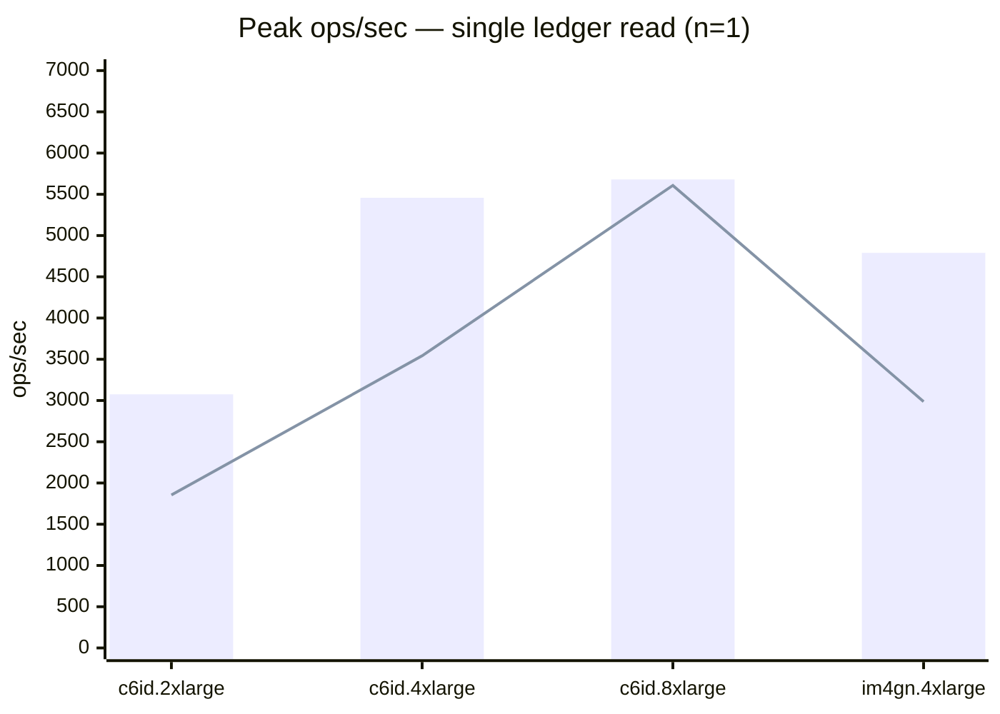
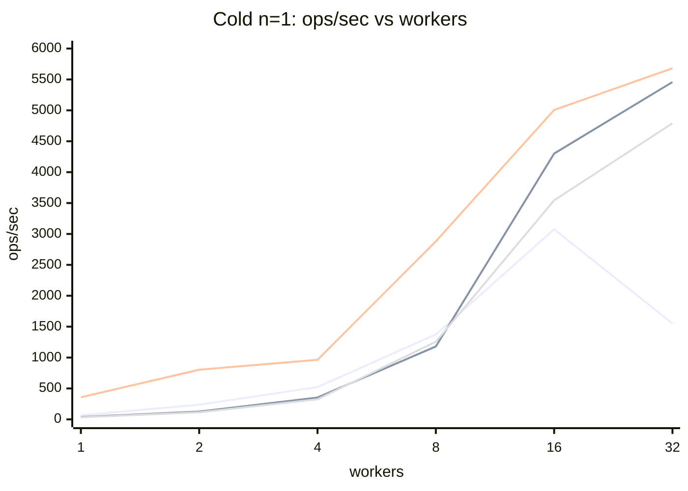
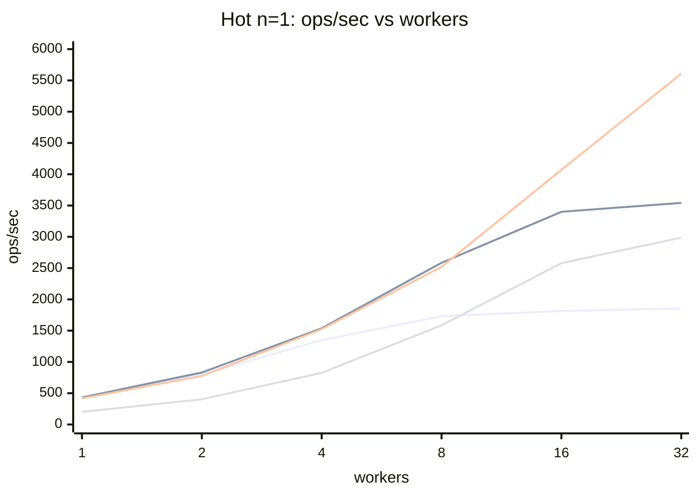
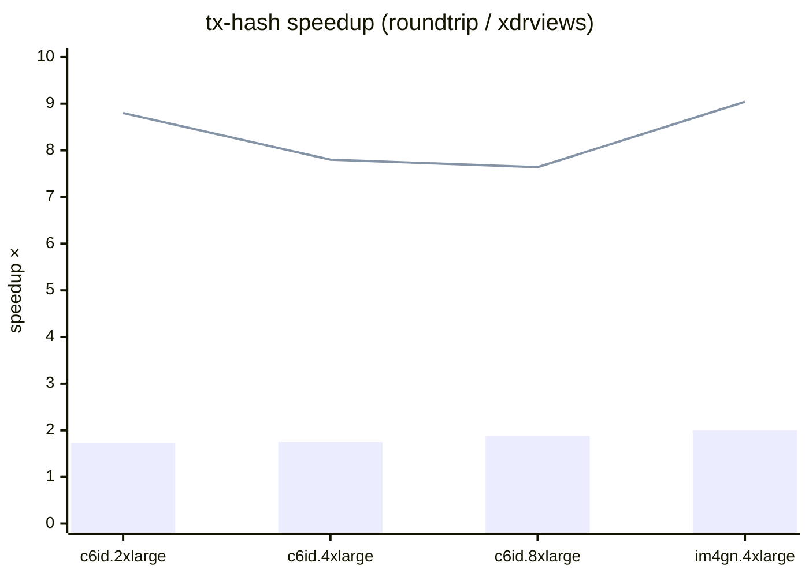
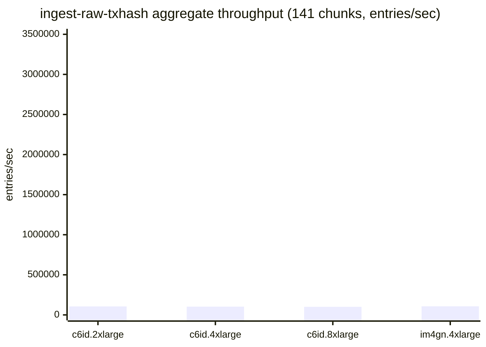

# stellar-rpc full-history bench comparison

Cross-machine summary of `cmd/stellar-rpc/scripts/bench-fullhistory` runs.
Source per-iter CSVs live at `gs://rpc-full-history/benchmarks/<machine-dir>/`;
the summary CSVs that back every table here are at `gs://rpc-full-history/benchmarks/_summary/`.

## 1. Test machines

| Instance | Arch | vCPUs | RAM | Local disk | CPU |
|---|---|---|---|---|---|
| c6id.2xlarge | x86_64 | 8 | 16 GB | 441 GB NVMe | Intel Xeon Platinum 8375C @ 2.90GHz |
| c6id.4xlarge | x86_64 | 16 | 30 GB | 884 GB NVMe | Intel Xeon Platinum 8375C @ 2.90GHz |
| c6id.8xlarge | x86_64 | 32 | 62 GB | 1900 GB NVMe | Intel Xeon Platinum 8375C @ 2.90GHz |
| im4gn.4xlarge | aarch64 | 16 | 61 GB | 6929 GB NVMe | AWS Graviton2 (Neoverse-N1) |

All four ran the same bench binary (Go 1.26.3, RocksDB 10.9.1, zstd 1.5.7) 
on identical data (chunks 5859–5999 cold, chunk 5000 hot, chunk 5999 for ingest).
Data lives on a local NVMe instance store on every machine, not EBS.

## 2. Read performance: peak throughput

Best ops/sec the machine reaches across the worker sweep (1–32 workers) for 
each tier × ledgers-per-read. Cold = page-cache-evict + fresh open per iter; 
hot = shared RocksDB handle + 100-iter warmup.

| Machine | Cold n=1 | Cold n=10 | Cold n=20 | Hot n=1 | Hot n=10 | Hot n=20 |
|---|---|---|---|---|---|---|
| c6id.2xlarge | 3,075 | 451 | 221 | 1,855 | 208 | 106 |
| c6id.4xlarge | 5,458 | 868 | 460 | 3,542 | 390 | 195 |
| c6id.8xlarge | 5,680 | 1,390 | 742 | 5,608 | 608 | 299 |
| im4gn.4xlarge | 4,790 | 865 | 404 | 2,987 | 353 | 176 |

*Bar = cold tier peak, line = hot tier peak. Cold beats hot at peak across every machine — 
cold random-chunk reads parallelize across 141 different packfiles, while hot reads contend on a single RocksDB handle.*

## 3. Worker scaling (cold n=1)

How throughput scales with worker count on each machine. Cold n=1 is the most 
I/O-bound workload, so >cores often still pays off (evict + reopen per iter).

| Machine | 1w | 4w | 16w | 32w |
|---|---|---|---|---|
| c6id.2xlarge | 67 | 522 | 3,075 | 1,552 |
| c6id.4xlarge | 38 | 353 | 4,301 | 5,458 |
| c6id.8xlarge | 357 | 964 | 5,006 | 5,680 |
| im4gn.4xlarge | 34 | 325 | 3,544 | 4,790 |

*Series order: c6id.2xlarge, c6id.4xlarge, c6id.8xlarge, im4gn.4xlarge. Mermaid `xychart-beta` 
doesn't support per-line legends inline — colors map to the series order above.*

*Same series order. Hot single-ledger reads are RocksDB-block-cache hits — CPU-bound.*

## 4. tx-page: latency vs page size

Single-worker bench, p50 latency for a page of N transactions.
Hot (RocksDB, warmup) is roughly 2× faster than cold (packfile, fresh open).

| Machine | Cold p=20 | Cold p=100 | Cold p=200 | Hot p=20 | Hot p=100 | Hot p=200 |
|---|---|---|---|---|---|---|
| c6id.2xlarge | 12.7 ms | 13.6 ms | 22.5 ms | 6.9 ms | 7.8 ms | 12.2 ms |
| c6id.4xlarge | 13.4 ms | 14.8 ms | 23.3 ms | 6.9 ms | 7.8 ms | 12.3 ms |
| c6id.8xlarge | 13.6 ms | 15.1 ms | 24.0 ms | 6.8 ms | 7.6 ms | 11.8 ms |
| im4gn.4xlarge | 23.7 ms | 24.8 ms | 42.0 ms | 13.4 ms | 14.4 ms | 22.3 ms |

## 5. tx-hash: xdr-views vs round-trip path

`getTransaction(hash)` end-to-end. p50 latency for hash hits.
xdr-views slices the result/meta straight from the raw LCM; round-trip 
unmarshals the entire LCM and re-serializes each field — much more CPU.

| Machine | Cold xdrviews | Cold roundtrip | Cold speedup | Hot xdrviews | Hot roundtrip | Hot speedup |
|---|---|---|---|---|---|---|
| c6id.2xlarge | 13.2 ms | 22.9 ms | 1.73× | 1.5 ms | 13.5 ms | 8.80× |
| c6id.4xlarge | 13.1 ms | 23.0 ms | 1.75× | 1.7 ms | 13.0 ms | 7.80× |
| c6id.8xlarge | 12.3 ms | 23.1 ms | 1.88× | 1.8 ms | 13.8 ms | 7.64× |
| im4gn.4xlarge | 18.9 ms | 37.8 ms | 2.00× | 2.6 ms | 23.5 ms | 9.04× |

Hot speedup is huge (~8×) because hot fetches finish in microseconds, leaving 
the path's CPU cost dominant. Cold is fetch-bound (~2 ms packfile open + zstd 
decode), so the materialize path saves a smaller fraction of total latency.

*Bar = cold, line = hot. Speedup is consistently ~1.7–2× cold and ~8× hot across machines.*

## 6. Per-ledger ingest throughput

Synchronous single-stream ingestion: each `Add` call WAL-fsyncs before 
returning. p50 / ops-per-second from 10,000-ledger streams.

| Machine | hot-ledgers | hot-txhash (xdrviews) | hot-events (xdrviews) | hot-events (roundtrip) |
|---|---|---|---|---|
| c6id.2xlarge | 299 ops/s | 610 ops/s | 100 ops/s | 44 ops/s |
| c6id.4xlarge | 310 ops/s | 612 ops/s | 102 ops/s | 47 ops/s |
| c6id.8xlarge | 317 ops/s | 658 ops/s | 111 ops/s | 49 ops/s |
| im4gn.4xlarge | 192 ops/s | 456 ops/s | 65 ops/s | 28 ops/s |

Hot-ledgers and hot-txhash are tighter across machines because 
RocksDB WAL-fsync latency on local NVMe dominates. Events ingest is CPU-bound, 
so the spread widens — roundtrip path on Graviton2 is ~2× slower than on Ice Lake.

## 7. Bulk / one-shot ingest

Per-chunk or single-shot ingest benches.

| Machine | cold-events xdrviews (events/s) | cold-events roundtrip (events/s) | ingest-raw-txhash (entries/s) | build-txhash-index (keys/s) | cold-ledgers-ingest (ledgers/s) |
|---|---|---|---|---|---|
| c6id.2xlarge | 194,681 | 53,451 | 105,429 | 20,519,559 | 289 |
| c6id.4xlarge | 206,959 | 58,674 | 103,428 | 36,756,938 | 314 |
| c6id.8xlarge | 226,486 | 58,657 | 100,512 | 42,998,821 | 302 |
| im4gn.4xlarge | 142,329 | 33,167 | 107,704 | 39,403,849 | 291 |

`build-txhash-index` is the CPU-bound phase 2 of the cold txhash MPHF build 
(streamhash with 8 parallel block-build workers). `cold-ledgers-ingest` is 
network-bound — pulls from `sdf-ledger-close-meta` via GCS+ADC.

## 8. Cold vs Hot speedup

How much faster the hot tier is for matching workloads (workers=1).

| Machine | Ledger 1@1w | Ledger 1@1w speedup | tx-page p=20 | tx-page speedup | tx-hash xdrviews hit | tx-hash speedup |
|---|---|---|---|---|---|---|
| c6id.2xlarge | 2.2 / 0.8 ms | 2.9× | 12.7 / 6.9 ms | 1.8× | 13.2 / 1.5 ms | 8.6× |
| c6id.4xlarge | 2.4 / 0.8 ms | 3.0× | 13.4 / 6.9 ms | 1.9× | 13.1 / 1.7 ms | 7.9× |
| c6id.8xlarge | 2.4 / 0.8 ms | 2.9× | 13.6 / 6.8 ms | 2.0× | 12.3 / 1.8 ms | 6.8× |
| im4gn.4xlarge | 3.0 / 1.8 ms | 1.6× | 23.7 / 13.4 ms | 1.8× | 18.9 / 2.6 ms | 7.3× |

*Format: cold_p50 / hot_p50.*

## 9. Architecture: x86 vs ARM (same vCPU count)

c6id.4xlarge (Intel Ice Lake, 16 vCPU) vs im4gn.4xlarge (AWS Graviton2, 16 vCPU). 
Both 16 vCPU, both local NVMe — direct apples-to-apples on the ISA.

| Workload | x86 (c6id.4xlarge) | arm (im4gn.4xlarge) | arm / x86 |
|---|---|---|---|
| cold n=1 ops/s @ 1w | 38 ops/s | 34 ops/s | 0.89× |
| hot n=1 ops/s @ 1w | 433 ops/s | 201 ops/s | 0.46× |
| cold n=1 peak ops/s | 5,458 ops/s | 4,790 ops/s | 0.88× |
| hot n=1 peak ops/s | 3,542 ops/s | 2,987 ops/s | 0.84× |
| cold-tx-hash xdrviews p50 | 13.1 ms | 18.9 ms | 1.44× |
| hot-tx-hash xdrviews p50 | 1.7 ms | 2.6 ms | 1.57× |
| hot-ledgers-ingest  p50 | 3.10 ms | 5.07 ms | 1.63× |
| hot-txhash-ingest xdrviews p50 | 1.57 ms | 2.11 ms | 1.34× |
| hot-events-ingest xdrviews p50 | 9.73 ms | 15.47 ms | 1.59× |

For throughput (ops/s) higher is better → arm/x86 < 1 means arm is slower.
For latency higher is worse → arm/x86 > 1 means arm is slower.
On this workload mix, Graviton2 trails Ice Lake by ~10–60% per-operation, 
but the gap narrows on RocksDB-fsync-bound benches (hot ingest paths).

## 10. Caveats

- All 21 CSVs present on every machine — full parity. 
Events xdrviews+roundtrip ran on all four.

- **c6id.2xlarge tx-page CSVs** use the older schema (`iteration_ns` only, no per-phase 
  breakdown). Total latencies are still comparable; per-phase fetch/decode/scan 
  columns are blank for that machine.

- **Chunk selection**: cold-* benches use chunk 5999 (most recent local pack), 
  hot-ledgers/hot-tx-page use chunk 5000 (existing hot store on disk). They 
  cover different ledger ranges — cold vs hot per-iter numbers are still 
  comparable as relative tier costs but not as same-data comparisons.

- **hot-tx-hash** uses freshly-ingested chunk-5999 hot stores (because the existing 
  hot-5000 store has no matching cold pack to sample hashes from).

- **Worker sweep**: all machines ran workers=1,2,4,8,16,32. Machines with fewer 
  vCPUs (c6id.2xlarge = 8) oversubscribe at workers > vCPUs; their 32-worker numbers 
  test how the scheduler handles oversubscription, not raw scaling.
