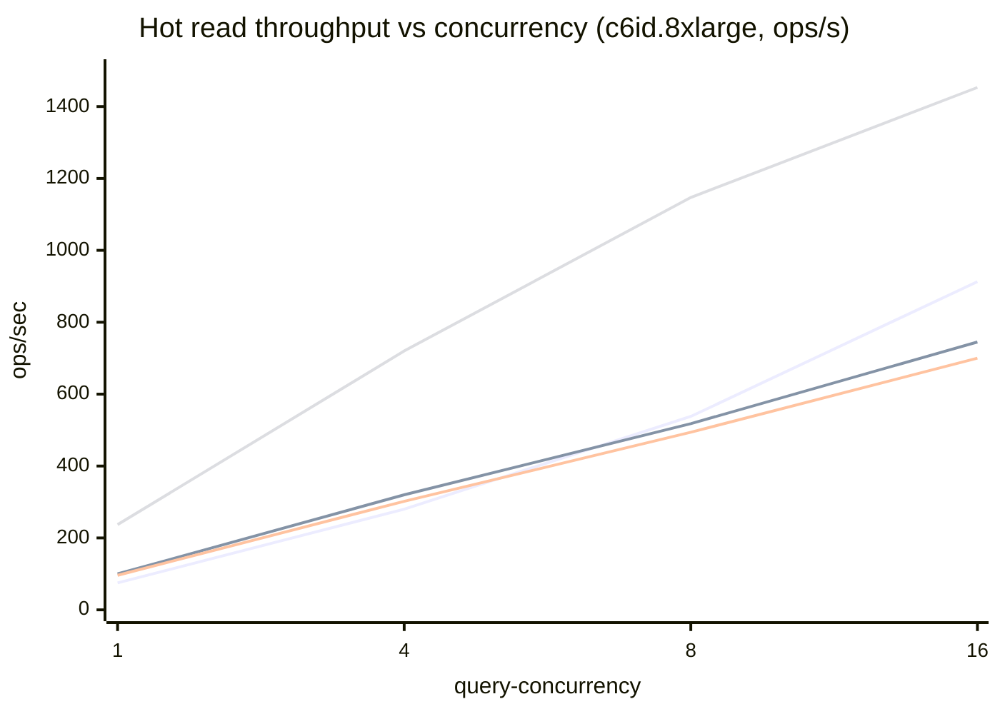

# stellar-rpc full-history bench comparison — 2026-06-03

Cross-machine summary of `cmd/stellar-rpc/scripts/bench-fullhistory` runs from
2026-06-03. Source per-iter and per-sweep CSVs live at
`gs://rpc-full-history/benchmarks/2026-06-03/<machine-dir>/`. Every number here
is recomputed directly from those CSVs.

This run uses the **rewritten bench harness** (`rpc-hack`, commit `a16dfcc6`),
which is not the same harness as the 2026-05-21 report. See
[§9 Methodology changes since 2026-05-21](#9-methodology-changes-since-2026-05-21)
before comparing the two — several axes are no longer 1:1.

## 1. Test machines

| Instance | Arch | vCPUs | RAM | Local disk | CPU | Commit |
|---|---|---|---|---|---|---|
| c6id.2xlarge | x86_64 | 8 | 15 GB | 441 GB NVMe | Intel Xeon Platinum 8375C @ 2.90GHz | a16dfcc6 |
| c6id.4xlarge | x86_64 | 16 | 31 GB | 870 GB NVMe | Intel Xeon Platinum 8375C @ 2.90GHz | a16dfcc6 |
| c6id.8xlarge | x86_64 | 32 | 62 GB | 1700 GB NVMe | Intel Xeon Platinum 8375C @ 2.90GHz | **ed4b7ced** |
| im4gn.4xlarge | aarch64 | 16 | 62 GB | 6800 GB NVMe | AWS Graviton2 (Neoverse-N1) | a16dfcc6 |

All ran the same toolchain (Go 1.26.3, RocksDB 10.9.1, zstd 1.5.7) on a local
NVMe instance store, driven by `run-all-benches.sh` with `INGEST_FIRST=1` (each
box ingests its own hot/cold/txhash stores, then reads from them).

> **Heads-up:** c6id.8xlarge ran a *different* commit (`ed4b7ced`) than the
> other three (`a16dfcc6`). `ed4b7ced` is not present in this branch's history,
> so its exact delta is unknown — treat 8xlarge as "approximately the same
> build" and don't over-read small 8xlarge-only differences.

### Data layout

- **Reads** (`cold-ledgers`, `cold-txpage`, `cold-txhash`, `cold-events`) run
  against freshly-ingested stores from this run. Cold ledger/txpage reads use
  the prebuilt 141-chunk seed (chunks 5859–5999) in `cold/`; cold-txhash uses a
  freshly-built MPHF index, and cold-events points at the bucketed events dir.
- **hot** reads use chunk 5860; **cold** ledger reads sample randomly across the
  full 141-chunk seed (page cache evicted per iter).
- **Ingest** ran 16 cold chunks (5860–5875) on the c6id boxes and **140 chunks**
  on im4gn — so absolute ingest *wall* and total-key counts differ on im4gn;
  per-item rates remain comparable.

## 2. Read latency at single in-flight (p50)

`--query-concurrency=1`, p50 milliseconds. This is the cleanest cross-run number
(one request at a time, no queueing). `cold/hot/×` = cold p50 / hot p50 / ratio.

| Machine | ledgers n=20 | tx-page p=20 | tx-hash roundtrip | events query |
|---|---|---|---|---|
| c6id.2xlarge | 14.3 / 13.6 / 1.1× | 12.3 / 10.3 / 1.2× | 12.2 / 11.5 / 1.1× | 15.8 / 5.5 / 2.8× |
| c6id.4xlarge | 15.2 / 12.9 / 1.2× | 11.9 / 10.4 / 1.1× | 12.2 / 11.0 / 1.1× | 15.5 / 5.3 / 2.9× |
| c6id.8xlarge | 14.8 / 13.2 / 1.1× | 11.5 / 9.8 / 1.2× | 11.7 / 10.6 / 1.1× | 16.0 / 5.2 / 3.1× |
| im4gn.4xlarge | 27.5 / 24.8 / 1.1× | 20.3 / 18.5 / 1.1× | 21.7 / 20.1 / 1.1× | 20.0 / 9.1 / 2.2× |

*For point reads, cold and hot are now nearly identical (~1.1×): the
decode/materialize CPU cost dominates and a cold packfile open adds only ~1 ms
on warm NVMe. **events** is the exception — cold evicts and re-opens packs per
query, so hot is 2–3× faster.*

```mermaid
xychart-beta
    title "Read p50 @ concurrency=1 (cold tier, ms)"
    x-axis [ledgers, tx-page, tx-hash, events]
    y-axis "p50 ms" 0 --> 30
    bar [14.3, 12.3, 12.2, 15.8]
    bar [15.2, 11.9, 12.2, 15.5]
    bar [14.8, 11.5, 11.7, 16.0]
    bar [27.5, 20.3, 21.7, 20.0]
```

*Series order: c6id.2xlarge, c6id.4xlarge, c6id.8xlarge, im4gn.4xlarge. The
three x86 boxes are within noise of each other; Graviton2 trails by ~1.3–1.8×.*

## 3. Concurrency scaling (1 → 16 in-flight queries)

`--query-concurrency` sweep. Cells are `p50 ms | ops/s`. `ops/s` is wall-clock
throughput (successful iters ÷ sweep wall) — it scales up with concurrency until
the box saturates, while p50 latency climbs as queries queue.

### ledgers (n=20)

| Machine | tier | c=1 | c=4 | c=8 | c=16 | peak ops/s |
|---|---|---|---|---|---|---|
| c6id.2xlarge | cold | 14.3 \| 67 | 15.7 \| 230 | 26.3 \| 250 | 88.1 \| 178 | 250 |
| c6id.2xlarge | hot | 13.6 \| 72 | 16.2 \| 235 | 22.0 \| 344 | 42.0 \| 363 | 363 |
| c6id.4xlarge | cold | 15.2 \| 64 | 15.0 \| 246 | 16.0 \| 428 | 25.8 \| 501 | 501 |
| c6id.4xlarge | hot | 12.9 \| 75 | 14.3 \| 258 | 16.4 \| 448 | 21.6 \| 702 | 702 |
| c6id.8xlarge | cold | 14.8 \| 67 | 14.6 \| 258 | 14.9 \| 483 | 17.9 \| 775 | 775 |
| c6id.8xlarge | hot | 13.2 \| 75 | 13.3 \| 280 | 14.1 \| 538 | 16.5 \| 913 | 913 |
| im4gn.4xlarge | cold | 27.5 \| 36 | 28.1 \| 138 | 27.7 \| 271 | 30.3 \| 483 | 483 |
| im4gn.4xlarge | hot | 24.8 \| 39 | 24.4 \| 160 | 24.4 \| 311 | 25.8 \| 587 | 587 |

### tx-page (page=20)

| Machine | tier | c=1 | c=4 | c=8 | c=16 | peak ops/s |
|---|---|---|---|---|---|---|
| c6id.2xlarge | cold | 12.3 \| 60 | 17.0 \| 218 | 26.0 \| 281 | 44.4 \| 289 | 289 |
| c6id.2xlarge | hot | 10.3 \| 95 | 15.6 \| 240 | 24.9 \| 294 | 38.7 \| 302 | 302 |
| c6id.4xlarge | cold | 11.9 \| 47 | 14.7 \| 256 | 17.8 \| 422 | 29.5 \| 509 | 509 |
| c6id.4xlarge | hot | 10.4 \| 94 | 13.6 \| 278 | 16.7 \| 447 | 28.2 \| 520 | 520 |
| c6id.8xlarge | cold | 11.5 \| 50 | 13.6 \| 276 | 15.7 \| 478 | 20.7 \| 717 | 717 |
| c6id.8xlarge | hot | 9.8 \| 100 | 12.1 \| 320 | 14.3 \| 518 | 20.0 \| 745 | 745 |
| im4gn.4xlarge | cold | 20.3 \| 27 | 22.0 \| 173 | 23.3 \| 329 | 31.8 \| 459 | 459 |
| im4gn.4xlarge | hot | 18.5 \| 54 | 20.4 \| 188 | 21.8 \| 348 | 29.8 \| 493 | 493 |

### tx-hash (roundtrip path)

| Machine | tier | c=1 | c=4 | c=8 | c=16 | peak ops/s |
|---|---|---|---|---|---|---|
| c6id.2xlarge | cold | 12.2 \| 81 | 17.4 \| 219 | 29.2 \| 263 | 50.3 \| 263 | 263 |
| c6id.2xlarge | hot | 11.5 \| 89 | 17.2 \| 231 | 27.7 \| 276 | 42.0 \| 285 | 285 |
| c6id.4xlarge | cold | 12.2 \| 81 | 15.1 \| 254 | 19.1 \| 404 | 32.6 \| 479 | 479 |
| c6id.4xlarge | hot | 11.0 \| 92 | 14.5 \| 278 | 18.4 \| 431 | 30.6 \| 508 | 508 |
| c6id.8xlarge | cold | 11.7 \| 84 | 14.1 \| 275 | 16.8 \| 462 | 22.6 \| 689 | 689 |
| c6id.8xlarge | hot | 10.6 \| 96 | 13.4 \| 302 | 16.1 \| 494 | 22.9 \| 700 | 700 |
| im4gn.4xlarge | cold | 21.7 \| 42 | 22.3 \| 178 | 23.4 \| 339 | 30.9 \| 506 | 506 |
| im4gn.4xlarge | hot | 20.1 \| 51 | 22.7 \| 181 | 24.1 \| 339 | 32.9 \| 471 | 471 |

### events (random K-filter query)

| Machine | tier | c=1 | c=4 | c=8 | c=16 | peak ops/s |
|---|---|---|---|---|---|---|
| c6id.2xlarge | cold | 15.8 \| 54 | 31.8 \| 104 | 63.4 \| 105 | 106.6 \| 118 | 118 |
| c6id.2xlarge | hot | 5.5 \| 199 | 6.0 \| 375 | 10.3 \| 409 | 16.9 \| 430 | 430 |
| c6id.4xlarge | cold | 15.5 \| 54 | 15.8 \| 211 | 32.0 \| 210 | 53.9 \| 239 | 239 |
| c6id.4xlarge | hot | 5.3 \| 219 | 5.8 \| 600 | 6.5 \| 764 | 12.0 \| 828 | 828 |
| c6id.8xlarge | cold | 16.0 \| 50 | 15.0 \| 228 | 17.1 \| 408 | 26.1 \| 504 | 504 |
| c6id.8xlarge | hot | 5.2 \| 237 | 5.5 \| 720 | 6.0 \| 1147 | 8.6 \| 1453 | 1453 |
| im4gn.4xlarge | cold | 20.0 \| 29 | 22.5 \| 163 | 25.8 \| 272 | 39.1 \| 327 | 327 |
| im4gn.4xlarge | hot | 9.1 \| 144 | 9.5 \| 460 | 9.7 \| 638 | 12.8 \| 738 | 738 |

*Series order: ledgers, tx-page, tx-hash, events. On the 32-vCPU box every
workload scales near-linearly to 16 in-flight queries; events scales best
because hot event queries are pure in-memory bitmap intersects.*

*On the 8-vCPU c6id.2xlarge, latency balloons past c=8 (e.g. cold-ledgers
14→88 ms at c=16) — that's query oversubscription on 8 cores, not a storage
limit. The 16- and 32-vCPU boxes hold latency roughly flat through c=16.*

## 4. Cold vs hot

At a single in-flight query the two tiers are within ~10% for ledger, tx-page,
and tx-hash reads (§2) — the read is decode-bound and a warm-NVMe packfile open
is cheap. The tiers diverge under two conditions:

- **events**: hot is 2–3× faster at c=1 and the gap widens under load (cold
  re-opens + evicts packs per query; hot keeps an in-memory term index).
- **concurrency on small boxes**: cold's per-iter page-cache eviction makes it
  more sensitive to oversubscription than hot (compare cold vs hot c=16 on
  c6id.2xlarge across every workload).

## 5. tx-hash roundtrip breakdown

`getTransaction(hash)` over the full round-trip path (MPHF lookup → packfile
fetch → decode → re-serialize each field). All sampled hashes were **hits**
(the bench samples only present hashes this run — no miss cohort). Per-iter
columns in `cold-txhash-roundtrip.csv` decompose total into
`lookup → pack_open → fetch → scan → materialize`; scan (zstd decode of the
LCM) dominates, with materialize (field re-serialization) second.

cold and hot land within ~1.1× at c=1 (§2) because, once the packfile is open on
warm NVMe, both tiers pay the same decode + materialize CPU. The MPHF lookup
itself is ~5–20 µs.

## 6. events query workload (new)

`cold-events-query` / `hot-events-query` issue randomized event-filter queries.
Each iter draws K filters (K sampled from `1,2,3,5,8,12,15`) partitioned from a
per-chunk 15-term universe (3 highest-volume contracts + 12 highest-volume
topics). Columns: `n_filters`, `n_unique_terms`, `query_ns`, `n_events`.

- **hot** is a CPU-bound bitmap intersect over an in-memory term index — p50
  ~5 ms on x86, ~9 ms on Graviton2, scaling to >1,400 ops/s on the 32-vCPU box.
- **cold** must open + evict packs and read the on-disk term index per query, so
  p50 is 3× higher and the p99 tail is heavy (87–845 ms) — cold event queries
  are the most tail-sensitive workload in the suite.

This is a *new* workload (the 2026-05-21 run measured event *ingest*, not event
*query*), so there is no like-for-like prior number.

## 7. xdr-view extraction & ingest stage costs

Ingest now runs as unified `hot-ingest` / `cold-ingest` commands that emit
per-stage timing breakdowns (`*-view.csv`). p50 per item (per ledger for
`write`/`extract`; per event-batch for event stages):

| Machine | hot ledger write | hot tx extract | hot ev extract | hot ev write | cold ev extract | cold ev term-index | cold ev append |
|---|---|---|---|---|---|---|---|
| c6id.2xlarge | 2.59 | 0.47 | 1.39 | 7.24 | 2.68 | 0.76 | 0.12 |
| c6id.4xlarge | 2.47 | 0.46 | 1.37 | 6.63 | 2.67 | 0.82 | 0.12 |
| c6id.8xlarge | 2.47 | 0.46 | 1.37 | 6.51 | 1.75 | 0.70 | 0.10 |
| im4gn.4xlarge | 4.63 | 0.71 | 2.26 | 10.24 | 2.40 | 0.83 | 0.15 |

*Hot event `write` (RocksDB put + WAL) is the single most expensive ingest
stage (~6.5–10 ms/batch). xdr-view extraction is cheap (~0.5 ms/ledger for
tx-hash, ~1.4 ms for events). Graviton2 is ~1.5–1.8× slower on the CPU-bound
extract/write stages.*

## 8. build-txhash-index & ingest driver

`build-txhash-index` is the CPU-bound phase-2 MPHF build (k-way streamhash merge
+ index construction):

| Machine | keys | feed s | finish s | keys/s | idx MB |
|---|---|---|---|---|---|
| c6id.2xlarge | 46,153,867 | 1.79 | 0.07 | 24,809,654 | 199 |
| c6id.4xlarge | 46,153,867 | 1.17 | 0.07 | 37,113,017 | 199 |
| c6id.8xlarge | 46,153,867 | 1.10 | 0.11 | 38,311,284 | 199 |
| im4gn.4xlarge | 380,286,251 | 8.86 | 0.91 | 38,906,747 | 1,638 |

*im4gn built over 140 chunks (380 M keys) vs 16 chunks (46 M keys) on the c6id
boxes — the absolute key count and index size differ, but the per-key rate
(~38 M keys/s) is comparable to the 16-/32-vCPU x86 boxes. The 8-vCPU c6id.2xlarge
is the outlier (~25 M keys/s) — fewer parallel block-build workers.*

Hot ingest sustained ~74–80 ledgers/s on the c6id boxes and ~49 ledgers/s on
im4gn (`hot-driver-view` total-per-ledger p50 of 12.5–13.5 ms x86, 20.5 ms ARM).

## 9. Methodology changes since 2026-05-21

The harness was rewritten on `rpc-hack`. Before comparing to the 2026-05-21
report, note:

- **Sweep axis renamed and re-scoped.** The old "workers" sweep (1,2,4,8,16,32)
  is now "query-concurrency" (1,4,8,16). **There is no 32-worker data**, and the
  peak ops/s ceiling is therefore lower by construction.
- **`ops/s` is computed differently and is *not* comparable across runs.** In
  this run `ops/s ≈ concurrency ÷ p50` (clean wall-clock). In the 2026-05-21 run
  the throughput wall absorbed large per-iter overhead (e.g. old cold n=1 w=1
  showed 2.2 ms p50 but only 66 ops/s). **Only single-in-flight p50 latency is a
  valid cross-run comparison.**
- **Ledger reads: only `n=20` survived.** The harness writes a fixed
  `cold-ledgers.csv` / `hot-ledgers.csv` regardless of `--n`, so the
  `--n=1`/`--n=10` invocations were overwritten by the final `--n=20` run. The
  2026-05-21 report's n=1 and n=10 ledger numbers have no counterpart here.
- **tx-page: only `page=20`** (old run also had 100 and 200).
- **tx-hash: roundtrip only, hits only.** The xdr-views read-latency variant and
  the miss cohort were not captured as separate read benches this run (xdr-view
  cost now appears as the `extract` ingest stage in §7).
- **events: query, not ingest.** §6 is a brand-new workload.
- **Different chunks/data.** Hot reads use chunk 5860 (was 5000); cold txhash/
  events use freshly-built stores. Absolute latencies reflect different ledger
  data than the prior run.

## 10. Architecture: x86 vs ARM (same vCPU count)

c6id.4xlarge (Ice Lake, 16 vCPU) vs im4gn.4xlarge (Graviton2, 16 vCPU), p50 at
c=1. >1 means ARM is slower.

| Workload | tier | x86 | arm | arm/x86 |
|---|---|---|---|---|
| ledgers n=20 | cold | 15.2 ms | 27.5 ms | 1.81× |
| ledgers n=20 | hot | 12.9 ms | 24.8 ms | 1.92× |
| tx-page p=20 | cold | 11.9 ms | 20.3 ms | 1.70× |
| tx-page p=20 | hot | 10.4 ms | 18.5 ms | 1.77× |
| tx-hash roundtrip | cold | 12.2 ms | 21.7 ms | 1.78× |
| tx-hash roundtrip | hot | 11.0 ms | 20.1 ms | 1.83× |
| events query | cold | 15.5 ms | 20.0 ms | 1.28× |
| events query | hot | 5.3 ms | 9.1 ms | 1.72× |

*Graviton2 trails Ice Lake by ~1.7–1.9× on the decode-bound read paths this run —
a wider per-operation gap than the 2026-05-21 run reported (~1.4–1.6×). The
read paths here are dominated by single-threaded zstd decode + XDR work, where
the 8375C's higher per-core throughput shows most. Cold event query is the
tightest (1.28×) because it is more I/O- than CPU-bound.*

## 11. Caveats

- **c6id.8xlarge ran commit `ed4b7ced`**, the other three ran `a16dfcc6`.
  `ed4b7ced` is not in this branch — its delta is unverified.
- **Throughput (`ops/s`) is not comparable to 2026-05-21** (see §9). Cross-run
  comparisons in chat are restricted to single-in-flight p50 latency.
- **Only one `n` / page-size / path survived per workload** (§9) — the 6/03
  dataset is narrower than 5/21 on the read side, broader on events (query) and
  ingest stage detail.
- **Oversubscription**: on the 8-vCPU c6id.2xlarge, c=16 cells measure scheduler
  behavior under 2× oversubscription, not raw scaling.
- **im4gn ingested 140 cold chunks** vs 16 on the c6id boxes; ingest wall and
  absolute key/index sizes differ accordingly (per-item rates are comparable).
- All sampled tx-hash lookups were hits; there is no miss-latency cohort.

## 12. Per-machine raw results

Every sweep cell per machine. `ops/s` is wall-clock throughput for that cell.

### c6id.2xlarge — 8 vCPU x86_64, 15 GB RAM, 441 GB NVMe

| Bench | c | p50 ms | p90 ms | p99 ms | ops/s |
|---|---|---|---|---|---|
| cold-ledgers (n=20) | 1 | 14.33 | 17.64 | 22.16 | 67 |
| cold-ledgers (n=20) | 4 | 15.73 | 21.89 | 29.50 | 230 |
| cold-ledgers (n=20) | 8 | 26.25 | 47.83 | 62.50 | 250 |
| cold-ledgers (n=20) | 16 | 88.05 | 104.07 | 131.09 | 178 |
| hot-ledgers (n=20) | 1 | 13.59 | 16.61 | 18.00 | 72 |
| hot-ledgers (n=20) | 4 | 16.16 | 22.33 | 25.86 | 235 |
| hot-ledgers (n=20) | 8 | 21.99 | 27.58 | 34.07 | 344 |
| hot-ledgers (n=20) | 16 | 41.98 | 58.17 | 77.74 | 363 |
| cold-txpage (p=20) | 1 | 12.32 | 16.33 | 30.23 | 60 |
| cold-txpage (p=20) | 4 | 16.96 | 25.53 | 39.68 | 218 |
| cold-txpage (p=20) | 8 | 26.04 | 39.41 | 64.43 | 281 |
| cold-txpage (p=20) | 16 | 44.43 | 96.26 | 161.38 | 289 |
| hot-txpage (p=20) | 1 | 10.32 | 15.13 | 21.79 | 95 |
| hot-txpage (p=20) | 4 | 15.59 | 23.06 | 42.11 | 240 |
| hot-txpage (p=20) | 8 | 24.90 | 37.90 | 63.77 | 294 |
| hot-txpage (p=20) | 16 | 38.68 | 96.32 | 184.61 | 302 |
| cold-txhash (roundtrip) | 1 | 12.20 | 16.38 | 21.63 | 81 |
| cold-txhash (roundtrip) | 4 | 17.41 | 26.07 | 33.86 | 219 |
| cold-txhash (roundtrip) | 8 | 29.24 | 41.34 | 52.94 | 263 |
| cold-txhash (roundtrip) | 16 | 50.27 | 104.41 | 170.11 | 263 |
| hot-txhash (roundtrip) | 1 | 11.49 | 14.63 | 18.44 | 89 |
| hot-txhash (roundtrip) | 4 | 17.23 | 23.82 | 30.08 | 231 |
| hot-txhash (roundtrip) | 8 | 27.65 | 39.60 | 50.13 | 276 |
| hot-txhash (roundtrip) | 16 | 42.00 | 102.24 | 176.65 | 285 |
| cold-events (query) | 1 | 15.77 | 22.47 | 87.55 | 54 |
| cold-events (query) | 4 | 31.81 | 51.86 | 236.44 | 104 |
| cold-events (query) | 8 | 63.41 | 92.74 | 465.74 | 105 |
| cold-events (query) | 16 | 106.61 | 160.96 | 843.57 | 118 |
| hot-events (query) | 1 | 5.55 | 11.97 | 16.08 | 199 |
| hot-events (query) | 4 | 6.00 | 34.03 | 45.96 | 375 |
| hot-events (query) | 8 | 10.27 | 65.78 | 107.08 | 409 |
| hot-events (query) | 16 | 16.92 | 113.25 | 182.61 | 430 |

### c6id.4xlarge — 16 vCPU x86_64, 31 GB RAM, 870 GB NVMe

| Bench | c | p50 ms | p90 ms | p99 ms | ops/s |
|---|---|---|---|---|---|
| cold-ledgers (n=20) | 1 | 15.23 | 19.42 | 27.57 | 64 |
| cold-ledgers (n=20) | 4 | 15.04 | 18.63 | 25.62 | 246 |
| cold-ledgers (n=20) | 8 | 16.01 | 22.25 | 29.08 | 428 |
| cold-ledgers (n=20) | 16 | 25.81 | 46.80 | 59.89 | 501 |
| hot-ledgers (n=20) | 1 | 12.93 | 16.71 | 19.49 | 75 |
| hot-ledgers (n=20) | 4 | 14.28 | 19.63 | 24.53 | 258 |
| hot-ledgers (n=20) | 8 | 16.41 | 21.67 | 25.63 | 448 |
| hot-ledgers (n=20) | 16 | 21.64 | 27.62 | 33.69 | 702 |
| cold-txpage (p=20) | 1 | 11.91 | 15.97 | 27.99 | 47 |
| cold-txpage (p=20) | 4 | 14.67 | 21.56 | 33.23 | 256 |
| cold-txpage (p=20) | 8 | 17.85 | 26.57 | 43.70 | 422 |
| cold-txpage (p=20) | 16 | 29.55 | 43.42 | 72.16 | 509 |
| hot-txpage (p=20) | 1 | 10.43 | 14.74 | 25.85 | 94 |
| hot-txpage (p=20) | 4 | 13.61 | 20.15 | 32.70 | 278 |
| hot-txpage (p=20) | 8 | 16.67 | 25.34 | 41.81 | 447 |
| hot-txpage (p=20) | 16 | 28.17 | 45.10 | 74.09 | 520 |
| cold-txhash (roundtrip) | 1 | 12.21 | 16.63 | 20.86 | 81 |
| cold-txhash (roundtrip) | 4 | 15.08 | 21.87 | 28.21 | 254 |
| cold-txhash (roundtrip) | 8 | 19.09 | 27.79 | 35.06 | 404 |
| cold-txhash (roundtrip) | 16 | 32.62 | 46.34 | 59.33 | 479 |
| hot-txhash (roundtrip) | 1 | 11.03 | 13.98 | 17.65 | 92 |
| hot-txhash (roundtrip) | 4 | 14.45 | 19.43 | 24.45 | 278 |
| hot-txhash (roundtrip) | 8 | 18.40 | 25.50 | 32.21 | 431 |
| hot-txhash (roundtrip) | 16 | 30.59 | 44.43 | 58.53 | 508 |
| cold-events (query) | 1 | 15.55 | 21.90 | 85.02 | 54 |
| cold-events (query) | 4 | 15.79 | 25.29 | 112.38 | 211 |
| cold-events (query) | 8 | 32.03 | 48.95 | 215.62 | 210 |
| cold-events (query) | 16 | 53.87 | 80.82 | 399.12 | 239 |
| hot-events (query) | 1 | 5.30 | 8.07 | 14.43 | 219 |
| hot-events (query) | 4 | 5.75 | 16.16 | 26.34 | 600 |
| hot-events (query) | 8 | 6.46 | 30.32 | 41.46 | 764 |
| hot-events (query) | 16 | 11.97 | 57.30 | 85.80 | 828 |

### c6id.8xlarge — 32 vCPU x86_64, 62 GB RAM, 1700 GB NVMe (commit ed4b7ced)

| Bench | c | p50 ms | p90 ms | p99 ms | ops/s |
|---|---|---|---|---|---|
| cold-ledgers (n=20) | 1 | 14.81 | 18.56 | 26.60 | 67 |
| cold-ledgers (n=20) | 4 | 14.63 | 17.93 | 21.66 | 258 |
| cold-ledgers (n=20) | 8 | 14.94 | 19.19 | 26.79 | 483 |
| cold-ledgers (n=20) | 16 | 17.91 | 25.08 | 32.28 | 775 |
| hot-ledgers (n=20) | 1 | 13.18 | 16.07 | 17.24 | 75 |
| hot-ledgers (n=20) | 4 | 13.29 | 16.88 | 20.62 | 280 |
| hot-ledgers (n=20) | 8 | 14.07 | 18.34 | 22.85 | 538 |
| hot-ledgers (n=20) | 16 | 16.51 | 21.47 | 25.91 | 913 |
| cold-txpage (p=20) | 1 | 11.48 | 15.60 | 27.68 | 50 |
| cold-txpage (p=20) | 4 | 13.63 | 19.17 | 29.98 | 276 |
| cold-txpage (p=20) | 8 | 15.68 | 22.77 | 37.21 | 478 |
| cold-txpage (p=20) | 16 | 20.67 | 31.30 | 49.72 | 717 |
| hot-txpage (p=20) | 1 | 9.85 | 13.79 | 22.03 | 100 |
| hot-txpage (p=20) | 4 | 12.09 | 17.27 | 29.26 | 320 |
| hot-txpage (p=20) | 8 | 14.34 | 21.18 | 34.78 | 518 |
| hot-txpage (p=20) | 16 | 20.05 | 30.17 | 49.32 | 745 |
| cold-txhash (roundtrip) | 1 | 11.66 | 15.87 | 20.96 | 84 |
| cold-txhash (roundtrip) | 4 | 14.12 | 19.58 | 25.86 | 275 |
| cold-txhash (roundtrip) | 8 | 16.84 | 23.56 | 30.49 | 462 |
| cold-txhash (roundtrip) | 16 | 22.57 | 32.23 | 41.31 | 689 |
| hot-txhash (roundtrip) | 1 | 10.59 | 13.63 | 16.98 | 96 |
| hot-txhash (roundtrip) | 4 | 13.39 | 17.57 | 22.32 | 302 |
| hot-txhash (roundtrip) | 8 | 16.08 | 21.98 | 27.43 | 494 |
| hot-txhash (roundtrip) | 16 | 22.86 | 31.39 | 39.15 | 700 |
| cold-events (query) | 1 | 15.99 | 21.83 | 85.55 | 50 |
| cold-events (query) | 4 | 14.97 | 22.06 | 108.68 | 228 |
| cold-events (query) | 8 | 17.09 | 25.16 | 87.11 | 408 |
| cold-events (query) | 16 | 26.14 | 41.10 | 162.38 | 504 |
| hot-events (query) | 1 | 5.17 | 7.13 | 13.96 | 237 |
| hot-events (query) | 4 | 5.52 | 12.70 | 19.35 | 720 |
| hot-events (query) | 8 | 5.96 | 15.37 | 25.25 | 1147 |
| hot-events (query) | 16 | 8.61 | 27.05 | 37.25 | 1453 |

### im4gn.4xlarge — 16 vCPU aarch64, 62 GB RAM, 6800 GB NVMe

| Bench | c | p50 ms | p90 ms | p99 ms | ops/s |
|---|---|---|---|---|---|
| cold-ledgers (n=20) | 1 | 27.50 | 32.42 | 35.49 | 36 |
| cold-ledgers (n=20) | 4 | 28.09 | 33.24 | 37.69 | 138 |
| cold-ledgers (n=20) | 8 | 27.69 | 34.44 | 43.33 | 271 |
| cold-ledgers (n=20) | 16 | 30.27 | 37.74 | 45.95 | 483 |
| hot-ledgers (n=20) | 1 | 24.79 | 30.46 | 33.49 | 39 |
| hot-ledgers (n=20) | 4 | 24.42 | 29.28 | 35.02 | 160 |
| hot-ledgers (n=20) | 8 | 24.41 | 29.09 | 34.28 | 311 |
| hot-ledgers (n=20) | 16 | 25.75 | 31.70 | 39.83 | 587 |
| cold-txpage (p=20) | 1 | 20.27 | 26.30 | 49.91 | 27 |
| cold-txpage (p=20) | 4 | 21.95 | 29.11 | 49.96 | 173 |
| cold-txpage (p=20) | 8 | 23.26 | 31.16 | 53.99 | 329 |
| cold-txpage (p=20) | 16 | 31.77 | 48.03 | 76.74 | 459 |
| hot-txpage (p=20) | 1 | 18.46 | 25.01 | 37.72 | 54 |
| hot-txpage (p=20) | 4 | 20.36 | 28.13 | 47.28 | 188 |
| hot-txpage (p=20) | 8 | 21.84 | 29.63 | 50.37 | 348 |
| hot-txpage (p=20) | 16 | 29.77 | 46.85 | 73.54 | 493 |
| cold-txhash (roundtrip) | 1 | 21.74 | 26.73 | 32.45 | 42 |
| cold-txhash (roundtrip) | 4 | 22.34 | 27.70 | 33.46 | 178 |
| cold-txhash (roundtrip) | 8 | 23.38 | 29.33 | 34.91 | 339 |
| cold-txhash (roundtrip) | 16 | 30.93 | 41.84 | 51.14 | 506 |
| hot-txhash (roundtrip) | 1 | 20.14 | 24.96 | 31.13 | 51 |
| hot-txhash (roundtrip) | 4 | 22.70 | 27.80 | 34.41 | 181 |
| hot-txhash (roundtrip) | 8 | 24.10 | 29.56 | 36.42 | 339 |
| hot-txhash (roundtrip) | 16 | 32.93 | 47.49 | 62.26 | 471 |
| cold-events (query) | 1 | 19.97 | 30.07 | 144.87 | 29 |
| cold-events (query) | 4 | 22.50 | 31.33 | 108.36 | 163 |
| cold-events (query) | 8 | 25.79 | 36.69 | 152.50 | 272 |
| cold-events (query) | 16 | 39.12 | 60.28 | 303.35 | 327 |
| hot-events (query) | 1 | 9.09 | 11.66 | 13.55 | 144 |
| hot-events (query) | 4 | 9.54 | 16.94 | 23.12 | 460 |
| hot-events (query) | 8 | 9.73 | 33.73 | 46.26 | 638 |
| hot-events (query) | 16 | 12.78 | 64.18 | 97.76 | 738 |
