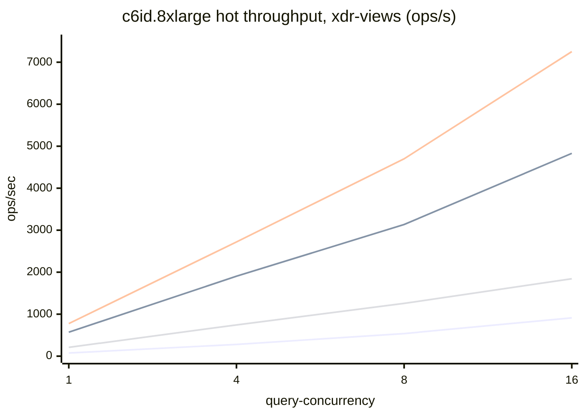

# stellar-rpc full-history bench comparison — 2026-06-03

Cross-machine summary of `cmd/stellar-rpc/scripts/bench-fullhistory` runs from
2026-06-03. Source per-iter and per-sweep CSVs live at
`gs://rpc-full-history/benchmarks/2026-06-03/<machine-dir>/`.

> ## ⚠️ Harness corrected per PR #750 — read this first
>
> PR #750 review (tamirms) found two harness bugs that invalidated the original
> query numbers, plus several execution gaps. **They are now fixed** (see
> [§5 What changed](#5-what-changed-pr-750)), and **c6id.8xlarge has been re-run
> with the fixed harness** (commit on branch `bench/cross-machine-report-2026-05-21`).
>
> - **tx-page** previously only touched the tx hash + result pair — it measured a
>   transaction *count*, not a `getTransactions` response. It now materializes a
>   full page of responses.
> - **xdr-views** (the zero-copy decode path real servers use) was disabled on
>   every query bench, so all numbers were the slow `UnmarshalBinary` +
>   `ParseTransaction` path. Query benches now run **both** modes.
> - **events** now uses the **worst-case** query (K=15 filters); **ingest** runs
>   `--parallel`, both views on and off.
>
> **The other three machines (c6id.2xlarge, c6id.4xlarge, im4gn.4xlarge) have NOT
> been re-run** — their numbers below are from the old harness (views-off,
> tx-page-as-count) and are marked **🟥 STALE — pending re-run**. Only
> [§2 c6id.8xlarge (corrected)](#2-c6id8xlarge--corrected-fixed-harness) reflects
> the fix.

## 1. Test machines

| Instance | Arch | vCPUs | RAM | Local disk | CPU | Harness |
|---|---|---|---|---|---|---|
| c6id.2xlarge | x86_64 | 8 | 15 GB | 441 GB NVMe | Intel Xeon Platinum 8375C @ 2.90GHz | 🟥 old (a16dfcc6) |
| c6id.4xlarge | x86_64 | 16 | 31 GB | 870 GB NVMe | Intel Xeon Platinum 8375C @ 2.90GHz | 🟥 old (a16dfcc6) |
| **c6id.8xlarge** | x86_64 | 32 | 62 GB | 1700 GB NVMe | Intel Xeon Platinum 8375C @ 2.90GHz | **✅ fixed (PR #750)** |
| im4gn.4xlarge | aarch64 | 16 | 62 GB | 6800 GB NVMe | AWS Graviton2 (Neoverse-N1) | 🟥 old (a16dfcc6) |

All ran the same toolchain (Go 1.26.3, RocksDB 10.9.1, zstd 1.5.7) on a local
NVMe instance store, driven by `run-all-benches.sh` with `INGEST_FIRST=1` (each
box ingests its own hot/cold/txhash stores, then reads from them).

### Data layout

- **Reads** run against the freshly-ingested stores from this run. In
  `INGEST_FIRST` mode the cold reads consume the **16-chunk** re-ingested store
  (chunks 5860–5875), **not** the 141-chunk seed — so cold-ledgers samples a
  16-chunk working set here. (The stale machines' original report read cold
  ledgers across the full 141-chunk seed; that axis is *not* 1:1 with the
  c6id.8xlarge row.)
- **hot** reads use chunk 5860; **cold** evicts the packfile from page cache per
  iter.
- **Ingest** ran 16 cold chunks (5860–5875) on the c6id boxes.

---

## 2. c6id.8xlarge — corrected (fixed harness)

32 vCPU x86_64, 62 GB RAM. All numbers recomputed from
`gs://rpc-full-history/benchmarks/2026-06-03/c6id.8xlarge-<run>/`.

### 2.1 Query latency at single in-flight (`c=1`), roundtrip vs xdr-views

`roundtrip` = production `UnmarshalBinary` + `ParseTransaction` (re-serialize
each field). `xdrviews` = zero-copy XDR views (what a tuned server uses).
ms, p50 / p99.

| Workload | tier | roundtrip p50 / p99 | xdrviews p50 / p99 | views speedup (p50) |
|---|---|---|---|---|
| tx-page (p=20) | cold | 13.22 / 29.84 | **2.99** / 6.36 | 4.4× |
| tx-page (p=20) | hot | 11.10 / 24.63 | **1.52** / 5.02 | 7.3× |
| tx-hash | cold | 11.86 / 20.31 | **2.18** / 4.23 | 5.4× |
| tx-hash | hot | 10.55 / 16.93 | **1.19** / 2.71 | 8.9× |
| events (K=15) | cold | 15.44 / 48.52 | 14.38 / 45.96 | 1.07× |
| events (K=15) | hot | 6.05 / 13.75 | **4.44** / 7.66 | 1.36× |

*tx-page and tx-hash are dominated by XDR decode + field re-serialization, so
views cut p50 by 4–9×. **events** barely moves — the query is a bitmap intersect
(hot) / on-disk term-index read + pack eviction (cold), and the per-event
post-filter decode that views accelerate is a small fraction of the total.*

> ledgers reads serve raw bytes (no XDR decode), so there is no views variant —
> see §2.2 for their scaling.

```mermaid
xychart-beta
    title "c6id.8xlarge p50 @ c=1: roundtrip vs xdr-views (ms)"
    x-axis [txpage-cold, txpage-hot, txhash-cold, txhash-hot, events-cold, events-hot]
    y-axis "p50 ms" 0 --> 16
    bar [13.22, 11.10, 11.86, 10.55, 15.44, 6.05]
    bar [2.99, 1.52, 2.18, 1.19, 14.38, 4.44]
```

*Series: roundtrip, xdr-views.*

### 2.2 Concurrency scaling (`--query-concurrency` 1→16)

Cells are `p50 ms | p99 ms | ops/s`. **xdr-views path** (the realistic server
config) unless noted; ledgers (n=20) have no views variant.

**Cold tier**

| Workload | c=1 | c=4 | c=8 | c=16 | peak ops/s |
|---|---|---|---|---|---|
| ledgers (n=20) | 14.8 \| 26.6 \| 67 | 14.6 \| 21.7 \| 258 | 14.9 \| 26.8 \| 483 | 17.9 \| 32.3 \| 775 | 775 |
| tx-page (views) | 2.99 \| 6.4 \| 85 | 2.90 \| 6.8 \| 1150 | 3.14 \| 7.5 \| 2080 | 3.79 \| 9.3 \| 3456 | **3456** |
| tx-hash (views) | 2.18 \| 4.2 \| 415 | 2.37 \| 5.4 \| 1477 | 2.57 \| 5.7 \| 2652 | 3.19 \| 6.6 \| 4170 | **4170** |
| events (views, K=15) | 14.4 \| 46.0 \| 58 | 14.3 \| 53.2 \| 243 | 16.8 \| 57.2 \| 415 | 28.5 \| 81.3 \| 512 | 512 |

**Hot tier**

| Workload | c=1 | c=4 | c=8 | c=16 | peak ops/s |
|---|---|---|---|---|---|
| ledgers (n=20) | 13.2 \| 17.2 \| 75 | 13.3 \| 20.6 \| 280 | 14.1 \| 22.9 \| 538 | 16.5 \| 25.9 \| 913 | 913 |
| tx-page (views) | 1.52 \| 5.0 \| 571 | 1.83 \| 5.2 \| 1903 | 2.17 \| 6.4 \| 3135 | 2.69 \| 8.3 \| 4830 | **4830** |
| tx-hash (views) | 1.19 \| 2.7 \| 775 | 1.36 \| 3.0 \| 2720 | 1.55 \| 3.8 \| 4700 | 1.98 \| 4.9 \| 7253 | **7253** |
| events (views, K=15) | 4.44 \| 7.7 \| 210 | 4.85 \| 10.3 \| 744 | 5.25 \| 19.4 \| 1257 | 6.95 \| 20.3 \| 1843 | 1843 |

*With views, tx-page and tx-hash sustain **4.8k–7.3k ops/s** at c=16 on the
32-vCPU box — 5–8× the roundtrip ceiling. The roundtrip equivalents (on GCS)
peak at 621 / 680 ops/s for cold tx-page / tx-hash.*

*Series: ledgers, tx-page, tx-hash, events.*

### 2.3 Ingest — hot vs cold, with vs without xdr-views

Ingest runs `--parallel` (ledgers/txhash/events ingested concurrently per
ledger). Hot ingest measured both ways; the per-ledger driver total is the
headline, decomposed into stages below. p50, ms.

**Hot ingest (single chunk, RocksDB), parsed vs view**

| Stage | parsed p50 | view p50 | note |
|---|---|---|---|
| `driver.total_per_ledger` | **18.27** | **8.54** | end-to-end per ledger |
| `driver.lcm_decode` | 8.39 | — | UnmarshalBinary; **views skip this entirely** |
| `driver.fan_out_per_ledger` | 9.47 | 7.95 | slowest enabled ingester (events) |
| `driver.read_blocked` | 0.58 | 0.57 | waiting on next raw ledger (NVMe source) |
| `ledgers.write` | 2.60 | 2.54 | RocksDB put (mode-independent) |
| `txhash.extract` | 0.02 | 0.48 | parsed reads the shared decoded struct; views walk |
| `txhash.hot_write` | 1.08 | 0.97 | |
| `events.extract` | 1.19 | 1.41 | |
| `events.hot_write` | **8.24** | **6.46** | single most expensive stage (put + WAL) |

→ **Hot ingest throughput: 52 ledgers/s parsed (3m13s wall) vs 112 ledgers/s
view (1m29s wall) — views are ~2.1× faster**, entirely from skipping the 8.4 ms
`lcm_decode`. Events `hot_write` (RocksDB put + WAL) is the dominant remaining
cost.

**Cold ingest (16 chunks, packfiles, view, `--parallel`, 8 chunk-workers)**

| Stage | p50 ms |
|---|---|
| `ledgers.write` | 0.41 |
| `txhash.extract` | 0.71 |
| `events.extract` | 2.07 |
| `events.term_index` | 0.73 |
| `events.cold_append` | 0.12 |
| `driver.fan_out_per_ledger` | 3.04 |

→ Per-chunk wall p50 ≈ 48.4 s; 16 chunks across 8 workers → **1m52s** total
(1,431 ledgers/s, 413k tx-hashes/s, 1.2M events/s end-to-end).

### 2.4 build-txhash-index

Phase-2 MPHF build (k-way streamhash merge + index construction):

| keys | feed s | finish s | keys/s | idx MB |
|---|---|---|---|---|
| 46,153,867 | 1.09 | 0.10 | **42.2 M** | 199 |

### Takeaways (c6id.8xlarge)

- **xdr-views is the headline for point/page reads**: 4–9× lower p50 and 5–8×
  higher throughput on tx-page and tx-hash. A production server should use the
  view path.
- **events is decode-insensitive** — views give only 1.1–1.4×; its cost is the
  bitmap/term-index work, not XDR.
- **Ingest**: views ~2.1× faster (skip `lcm_decode`); the events RocksDB write
  is the dominant hot-ingest stage.

---

## 3. Cross-machine comparison 🟥 STALE (old harness — pending re-run)

> These tables are from the **old** harness on c6id.2xlarge / c6id.4xlarge /
> im4gn.4xlarge: **views-off** and **tx-page measured a tx count, not a page**.
> They are kept only for the cross-machine/architecture shape and **must be
> re-run** with the fixed harness before they're trusted. The c6id.8xlarge row
> is superseded by §2.

### 3.1 Read p50 at `c=1` (ms) — stale

| Machine | ledgers n=20 | tx-page p=20¹ | tx-hash² | events query³ |
|---|---|---|---|---|
| c6id.2xlarge 🟥 | 14.3 / 13.6 | 12.3 / 10.3 | 12.2 / 11.5 | 15.8 / 5.5 |
| c6id.4xlarge 🟥 | 15.2 / 12.9 | 11.9 / 10.4 | 12.2 / 11.0 | 15.5 / 5.3 |
| im4gn.4xlarge 🟥 | 27.5 / 24.8 | 20.3 / 18.5 | 21.7 / 20.1 | 20.0 / 9.1 |
| **c6id.8xlarge ✅** | **14.8 / 13.2** | **see §2.1** | **see §2.1** | **see §2.1** |

`cold / hot`. ¹ stale tx-page = count-only, no page materialization.
² stale tx-hash = roundtrip, views-off. ³ stale events = random K (not worst-case).

### 3.2 Architecture: x86 vs ARM (same vCPU) — stale

c6id.4xlarge (Ice Lake, 16 vCPU) vs im4gn.4xlarge (Graviton2, 16 vCPU), old-harness
p50 at c=1. >1 means ARM slower.

| Workload | tier | x86 | arm | arm/x86 |
|---|---|---|---|---|
| ledgers n=20 | cold | 15.2 ms | 27.5 ms | 1.81× |
| tx-page p=20 | cold | 11.9 ms | 20.3 ms | 1.70× |
| tx-hash | cold | 12.2 ms | 21.7 ms | 1.78× |
| events query | hot | 5.3 ms | 9.1 ms | 1.72× |

*Graviton2 trailed Ice Lake by ~1.7–1.9× on the decode-bound read paths. A
fixed-harness re-run is needed to confirm the gap under the views path (where
decode cost — the 8375C's strength — is much smaller, so the ARM gap may narrow).*

Full old-harness per-machine sweeps are on GCS (`<machine-dir>/*.csv`); the raw
per-cell dump that was in this report has been dropped (it duplicated those CSVs).

---

## 4. Caveats

- **Only c6id.8xlarge ran the fixed harness.** The other three rows (§3) are
  stale and not comparable to §2.
- **c6id.8xlarge cold reads use the 16-chunk re-ingested store** (5860–5875), not
  the 141-chunk seed — a narrower cold working set than the stale machines'
  original cold-ledgers methodology.
- **`ops/s` is wall-clock throughput** (successful iters ÷ sweep wall) and is not
  comparable to the 2026-05-21 report (different formula; see that report).
- **events uses worst-case K=15** here (§2); the stale rows used random K from
  `{1,2,3,5,8,12,15}`.
- All sampled tx-hash lookups were hits; no miss cohort.

---

## 5. What changed (PR #750)

Harness + execution fixes, all on this branch:

1. **tx-page now materializes a page of responses** (`walkPageMaterialize` in
   `tx_page_helpers.go`) — builds a full `db.Transaction` per tx (envelope,
   result, meta, events, hash, application order, ledger info) instead of only
   touching `TransactionHash` + `ResultPair`.
2. **tx-page gained `--xdr-views`** (single-pass view materializer mirroring
   tx-hash); CSVs split `-roundtrip` / `-xdrviews`.
3. **Query benches run both view modes** (`QUERY_VIEW_MODES`), so every
   decode-heavy workload reports with- and without-views.
4. **events runs worst-case K=15** (`--buckets=15`).
5. **Ingest runs `--parallel`; hot ingest measured both views-on and views-off**
   (the §2.3 comparison).

Verification: all benches passed (0 errors); tx-page `got==page` enforced;
`decode_ns=0` confirms the views path skips `UnmarshalBinary`.
