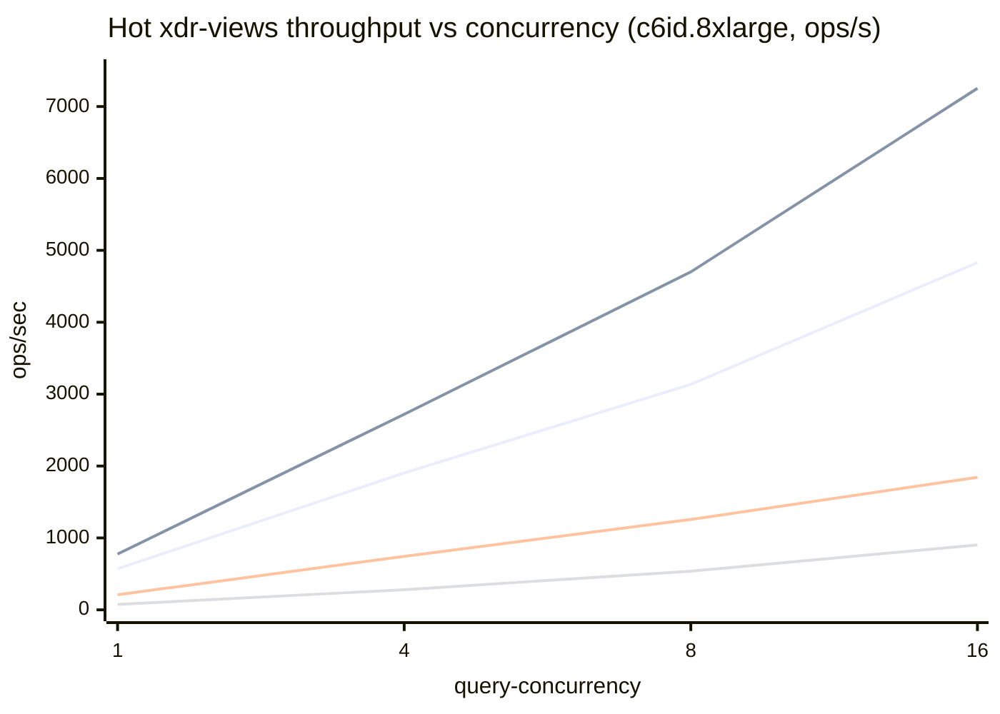

# stellar-rpc full-history bench comparison — 2026-06-03

Cross-machine summary of `cmd/stellar-rpc/scripts/bench-fullhistory` runs from
2026-06-03, on the **corrected harness** (PR #750, commit `b712b861`). Source
per-iter and per-sweep CSVs live at
`gs://rpc-full-history/benchmarks/2026-06-03/<machine-dir>/`; every number here
is recomputed from those CSVs. Raw per-iter data is on GCS, so this report keeps
only the aggregated tables.

All four machines were re-run on the fixed harness, which addresses the PR #750
review:

- **tx-page** now materializes a full page of `getTransactions` responses (it
  previously returned only a transaction *count*).
- Every query bench runs **both** decode paths — `roundtrip` (production
  `UnmarshalBinary` + `ParseTransaction`) and `xdr-views` (zero-copy) — reported
  side by side, with **p50 and p99**.
- **events** uses the **worst-case** query (`--buckets=15`, 15 filters).
- **hot ingest** runs `--parallel` in both modes (xdr-views on and off); cold
  ingest runs `--parallel --xdr-views`.
- Hot and cold are presented as **separate tables** throughout.

## 1. Test machines

| Instance | Arch | vCPUs | RAM | Local disk | CPU |
|---|---|---|---|---|---|
| c6id.2xlarge | x86_64 | 8 | 15 GB | 441 GB NVMe | Intel Xeon Platinum 8375C @ 2.90GHz |
| c6id.4xlarge | x86_64 | 16 | 31 GB | 870 GB NVMe | Intel Xeon Platinum 8375C @ 2.90GHz |
| c6id.8xlarge | x86_64 | 32 | 62 GB | 1700 GB NVMe | Intel Xeon Platinum 8375C @ 2.90GHz |
| im4gn.4xlarge | aarch64 | 16 | 62 GB | 6800 GB NVMe | AWS Graviton2 (Neoverse-N1) |

Same toolchain everywhere (Go 1.26.3, RocksDB 10.9.1, zstd 1.5.7), commit
`b712b861`, driven by `run-all-benches.sh` with `INGEST_FIRST=1`: each box
ingests its own hot + cold stores (chunk 5860 hot; 16 cold chunks 5860–5875),
then reads from them. Data is on a local NVMe instance store. `query-concurrency`
swept 1, 4, 8, 16.

## 2. Query latency & throughput

`roundtrip` = full XDR decode + field re-serialization (the slow path).
`xdr-views` = zero-copy slicing of the raw LCM (what a tuned server uses).
`views×` is the p50 roundtrip/xdr-views ratio. Peak ops/s is the best across the
1→16 concurrency sweep (at c=16 on every machine here). All query workloads
except ledgers benefit from xdr-views.

### 2.1 tx-page (page=20)

**Cold tier** — p50 / p99 ms @ c=1, peak ops/s
| Machine | rt p50 | rt p99 | xdr p50 | xdr p99 | views× | rt peak | xdr peak |
|---|---|---|---|---|---|---|---|
| c6id.2xlarge | 13.82 | 31.31 | 3.11 | 7.10 | 4.4× | 250 | 1,501 |
| c6id.4xlarge | 13.59 | 32.40 | 3.09 | 6.87 | 4.4× | 442 | 2,925 |
| c6id.8xlarge | 13.22 | 29.84 | 2.99 | 6.36 | 4.4× | 621 | 3,456 |
| im4gn.4xlarge | 23.86 | 54.35 | 4.35 | 9.51 | 5.5× | 361 | 2,662 |

**Hot tier** — p50 / p99 ms @ c=1, peak ops/s
| Machine | rt p50 | rt p99 | xdr p50 | xdr p99 | views× | rt peak | xdr peak |
|---|---|---|---|---|---|---|---|
| c6id.2xlarge | 11.99 | 27.70 | 1.59 | 5.00 | 7.5× | 261 | 2,042 |
| c6id.4xlarge | 12.00 | 25.47 | 1.60 | 4.69 | 7.5× | 458 | 3,884 |
| c6id.8xlarge | 11.10 | 24.63 | 1.52 | 5.02 | 7.3× | 637 | 4,830 |
| im4gn.4xlarge | 21.24 | 44.59 | 2.57 | 8.65 | 8.3× | 381 | 3,899 |

### 2.2 tx-hash

**Cold tier** — p50 / p99 ms @ c=1, peak ops/s
| Machine | rt p50 | rt p99 | xdr p50 | xdr p99 | views× | rt peak | xdr peak |
|---|---|---|---|---|---|---|---|
| c6id.2xlarge | 12.35 | 21.36 | 2.23 | 4.45 | 5.5× | 267 | 1,329 |
| c6id.4xlarge | 12.44 | 21.54 | 2.22 | 4.49 | 5.6× | 470 | 2,439 |
| c6id.8xlarge | 11.86 | 20.31 | 2.18 | 4.22 | 5.4× | 680 | 4,170 |
| im4gn.4xlarge | 22.13 | 37.84 | 4.12 | 8.10 | 5.4× | 411 | 3,186 |

**Hot tier** — p50 / p99 ms @ c=1, peak ops/s
| Machine | rt p50 | rt p99 | xdr p50 | xdr p99 | views× | rt peak | xdr peak |
|---|---|---|---|---|---|---|---|
| c6id.2xlarge | 11.38 | 17.58 | 1.18 | 2.55 | 9.6× | 286 | 3,054 |
| c6id.4xlarge | 11.24 | 18.09 | 1.23 | 2.78 | 9.1× | 503 | 5,749 |
| c6id.8xlarge | 10.55 | 16.93 | 1.19 | 2.71 | 8.8× | 706 | 7,253 |
| im4gn.4xlarge | 19.92 | 30.58 | 2.08 | 3.91 | 9.6× | 424 | 5,688 |

### 2.3 events (worst-case, 15 filters)

**Cold tier** — p50 / p99 ms @ c=1, peak ops/s
| Machine | rt p50 | rt p99 | xdr p50 | xdr p99 | views× | rt peak | xdr peak |
|---|---|---|---|---|---|---|---|
| c6id.2xlarge | 15.94 | 49.81 | 14.48 | 45.68 | 1.1× | 126 | 127 |
| c6id.4xlarge | 16.46 | 48.99 | 14.87 | 50.17 | 1.1× | 246 | 251 |
| c6id.8xlarge | 15.44 | 48.52 | 14.38 | 45.96 | 1.1× | 500 | 512 |
| im4gn.4xlarge | 21.40 | 69.13 | 18.67 | 64.72 | 1.1× | 391 | 412 |

**Hot tier** — p50 / p99 ms @ c=1, peak ops/s
| Machine | rt p50 | rt p99 | xdr p50 | xdr p99 | views× | rt peak | xdr peak |
|---|---|---|---|---|---|---|---|
| c6id.2xlarge | 6.62 | 14.69 | 4.74 | 9.42 | 1.4× | 312 | 523 |
| c6id.4xlarge | 6.63 | 14.72 | 4.83 | 8.95 | 1.4× | 589 | 1,055 |
| c6id.8xlarge | 6.05 | 13.75 | 4.44 | 7.66 | 1.4× | 1,081 | 1,843 |
| im4gn.4xlarge | 10.69 | 16.55 | 7.04 | 8.75 | 1.5× | 492 | 901 |

*tx-page and tx-hash are dominated by XDR decode + field re-serialization, so
xdr-views cuts p50 by **4–9×** and lifts peak throughput **5–8×**. **events**
barely moves (~1.1× cold, ~1.4–1.5× hot): xdr-views skip the per-event decode
for matched events — a fixed slice of work (≈2–3 ms here) regardless of tier.
That's a small share of cold's I/O-dominated total (term-index read + packfile
eviction) but a meaningful ~25–30% of hot's I/O-free bitmap-intersect total,
which is why hot's speedup is the bigger one.*

### 2.4 ledgers (n=20)

No xdr-views variant — ledger reads serve raw bytes with no XDR decode.

**Cold tier** | **Hot tier** — p50 / p99 ms, peak ops/s
| Machine | cold c=1 p50/p99 | cold peak | hot c=1 p50/p99 | hot peak |
|---|---|---|---|---|
| c6id.2xlarge | 14.88 / 25.70 | 255 | 13.53 / 18.40 | 360 |
| c6id.4xlarge | 14.61 / 26.72 | 483 | 13.26 / 19.04 | 695 |
| c6id.8xlarge | 15.11 / 25.28 | 783 | 13.29 / 21.24 | 902 |
| im4gn.4xlarge | 27.55 / 50.02 | 456 | 25.68 / 32.97 | 510 |

*A run of 20 consecutive ledgers; cold evicts the packfile from page cache per
iteration. Throughput scales with vCPU count; on the 8-vCPU c6id.2xlarge cold
latency balloons past c=8 (oversubscription), capping peak ops/s.*

*Series: tx-page, tx-hash, events, ledgers. With views, tx-page and tx-hash
sustain 4.8k–7.3k ops/s at c=16 on the 32-vCPU box.*

## 3. Ingest

Ingest runs `--parallel` (ledgers/txhash/events ingested concurrently per
ledger). Stage glossary (per the PR #750 thread):

- **`driver.read_blocked`** — gap between finishing ledger N and receiving N+1
  (source read latency + prefetch backpressure). Cheap on local NVMe; large from GCS.
- **`driver.fan_out`** — wall time to run all enabled ingesters on one ledger;
  under `--parallel` ≈ the slowest ingester (events).
- **`driver.lcm_decode`** — one-time `UnmarshalBinary` of the raw LCM. Only in
  parsed mode; **xdr-views skips it entirely**.
- **`driver.total_per_ledger`** — full per-ledger wall (≈ read_blocked +
  lcm_decode-if-parsed + fan_out). Sums to the end-to-end ingest wall.

### 3.1 Hot ingest — per-ledger duration (xdr-views vs parsed)

Headline metric: end-to-end duration per ledger (all data types), and the
derived single-stream throughput.

| Machine | view total/ledger p50 | view p99 | parsed total/ledger p50 | parsed p99 | view ledgers/s | parsed ledgers/s |
|---|---|---|---|---|---|---|
| c6id.2xlarge | 9.66 | 29.32 | 20.24 | 62.36 | 94 | 42 |
| c6id.4xlarge | 9.41 | 23.54 | 19.71 | 49.38 | 101 | 47 |
| c6id.8xlarge | 8.54 | 20.37 | 18.27 | 39.94 | 112 | 52 |
| im4gn.4xlarge | 13.87 | 34.55 | 33.52 | 67.63 | 68 | 29 |

xdr-views ingest is **~2.1–2.4× faster** per ledger, dominated by skipping the
upfront `lcm_decode` (~80% of the saving) plus per-event `UnmarshalView` in
`fan_out` (~20% — e.g. on im4gn the ~19.7 ms/ledger saving is ~16.4 ms
`lcm_decode` + ~3.3 ms off `fan_out`):

| Machine | parsed lcm_decode p50 | parsed total/ledger | view total/ledger | views speedup |
|---|---|---|---|---|
| c6id.2xlarge | 8.85 | 20.24 | 9.66 | 2.09× |
| c6id.4xlarge | 8.70 | 19.71 | 9.41 | 2.10× |
| c6id.8xlarge | 8.39 | 18.27 | 8.54 | 2.14× |
| im4gn.4xlarge | 16.44 | 33.52 | 13.87 | 2.42× |

### 3.2 Hot ingest — per-stage breakdown

**Cross-machine overview** (p50 ms, view mode) — `events.write` (RocksDB put +
WAL) is consistently the most expensive stage; xdr-view extraction is cheap
(~0.5 ms/ledger txhash, ~1.4 ms events). Parsed-mode comparison is in §3.1.

| Machine | ledgers.write | txhash.extract | txhash.write | events.extract | events.write | read_blocked | fan_out | total/ledger |
|---|---|---|---|---|---|---|---|---|
| c6id.2xlarge | 2.85 | 0.53 | 1.13 | 1.54 | 7.27 | 0.60 | 9.01 | 9.66 |
| c6id.4xlarge | 2.69 | 0.50 | 1.10 | 1.45 | 7.23 | 0.60 | 8.79 | 9.41 |
| c6id.8xlarge | 2.54 | 0.48 | 0.97 | 1.41 | 6.45 | 0.57 | 7.95 | 8.54 |
| im4gn.4xlarge | 4.74 | 0.72 | 1.46 | 2.29 | 10.28 | 1.17 | 12.67 | 13.87 |

**Per-machine detail** (p50 / p90 / p99 / max, the layout requested in the
PR #750 review):

**c6id.2xlarge** — Run: chunk 5860 · 10,000 ledgers · `--parallel --xdr-views` · source=pack · end-to-end wall 1m46.3s  (ms)

| Stage | p50 | p90 | p99 | max |
|---|---|---|---|---|
| ledgers.write | 2.848 | 4.876 | 11.091 | 22.922 |
| txhash.extract | 0.527 | 1.059 | 1.614 | 10.531 |
| txhash.write | 1.131 | 1.987 | 7.349 | 18.203 |
| events.extract | 1.540 | 3.070 | 4.661 | 9.598 |
| events.write | 7.272 | 11.838 | 24.531 | 44.767 |
| driver.read_blocked | 0.603 | 0.961 | 1.836 | 10.178 |
| driver.fan_out | 9.006 | 14.778 | 28.045 | 50.588 |
| driver.total_per_ledger | 9.662 | 15.667 | 29.320 | 53.104 |

**c6id.4xlarge** — Run: chunk 5860 · 10,000 ledgers · `--parallel --xdr-views` · source=pack · end-to-end wall 1m39.0s  (ms)

| Stage | p50 | p90 | p99 | max |
|---|---|---|---|---|
| ledgers.write | 2.686 | 4.128 | 8.244 | 32.612 |
| txhash.extract | 0.499 | 0.854 | 1.366 | 5.483 |
| txhash.write | 1.102 | 1.718 | 5.002 | 32.471 |
| events.extract | 1.449 | 2.313 | 3.980 | 12.486 |
| events.write | 7.231 | 10.567 | 19.471 | 42.602 |
| driver.read_blocked | 0.600 | 0.830 | 1.147 | 4.611 |
| driver.fan_out | 8.793 | 12.760 | 22.611 | 45.922 |
| driver.total_per_ledger | 9.405 | 13.565 | 23.539 | 46.996 |

**c6id.8xlarge** — Run: chunk 5860 · 10,000 ledgers · `--parallel --xdr-views` · source=pack · end-to-end wall 1m29.2s  (ms)

| Stage | p50 | p90 | p99 | max |
|---|---|---|---|---|
| ledgers.write | 2.542 | 3.740 | 8.154 | 20.795 |
| txhash.extract | 0.478 | 0.662 | 1.236 | 2.587 |
| txhash.write | 0.966 | 1.450 | 4.673 | 17.001 |
| events.extract | 1.414 | 2.062 | 3.785 | 7.154 |
| events.write | 6.455 | 9.342 | 16.988 | 28.884 |
| driver.read_blocked | 0.573 | 0.780 | 1.063 | 3.811 |
| driver.fan_out | 7.945 | 11.364 | 19.710 | 33.529 |
| driver.total_per_ledger | 8.536 | 12.099 | 20.373 | 34.448 |

**im4gn.4xlarge** — Run: chunk 5860 · 10,000 ledgers · `--parallel --xdr-views` · source=pack · end-to-end wall 2m26.2s  (ms)

| Stage | p50 | p90 | p99 | max |
|---|---|---|---|---|
| ledgers.write | 4.739 | 6.956 | 20.856 | 50.173 |
| txhash.extract | 0.724 | 0.940 | 1.267 | 27.082 |
| txhash.write | 1.463 | 2.471 | 14.180 | 57.995 |
| events.extract | 2.293 | 3.138 | 4.153 | 8.729 |
| events.write | 10.280 | 15.238 | 28.965 | 60.308 |
| driver.read_blocked | 1.174 | 1.536 | 2.077 | 16.318 |
| driver.fan_out | 12.666 | 18.399 | 32.872 | 70.483 |
| driver.total_per_ledger | 13.865 | 19.898 | 34.550 | 71.598 |

### 3.3 Cold ingest — per-stage breakdown

Cold ingest is batched (no per-ledger fsync) and runs chunks in parallel
(`--chunk-workers=8`), sustaining far higher ledger rates than hot.

**Cross-machine overview** (p50 ms, view mode):

| Machine | ledgers.write | txhash.extract | events.extract | events.term_index | events.cold_append | read_blocked | fan_out |
|---|---|---|---|---|---|---|---|
| c6id.2xlarge | 0.48 | 1.01 | 3.53 | 1.03 | 0.15 | 1.87 | 9.34 |
| c6id.4xlarge | 0.46 | 0.96 | 3.00 | 0.94 | 0.15 | 0.97 | 4.44 |
| c6id.8xlarge | 0.41 | 0.71 | 2.07 | 0.73 | 0.12 | 0.77 | 3.04 |
| im4gn.4xlarge | 0.17 | 0.77 | 2.62 | 0.94 | 0.17 | 1.37 | 4.30 |

**Per-machine detail** (p50 / p90 / p99 / max):

**c6id.2xlarge** — Run: chunks 5860–5875 · 16×10,000 ledgers · `--parallel --xdr-views` · source=pack · `--chunk-workers=8` · effective wall ≈4m41.7s  (ms)

| Stage | p50 | p90 | p99 | max |
|---|---|---|---|---|
| ledgers.write | 0.480 | 0.836 | 3.796 | 60.045 |
| txhash.extract | 1.012 | 2.010 | 5.183 | 37.855 |
| events.extract | 3.531 | 7.364 | 14.003 | 52.728 |
| events.term_index | 1.034 | 3.242 | 8.649 | 38.146 |
| events.cold_append | 0.152 | 3.817 | 10.653 | 49.421 |
| driver.read_blocked | 1.868 | 6.778 | 14.378 | 39.646 |
| driver.fan_out | 9.341 | 15.693 | 24.185 | 470.479 |

**c6id.4xlarge** — Run: chunks 5860–5875 · 16×10,000 ledgers · `--parallel --xdr-views` · source=pack · `--chunk-workers=8` · effective wall ≈2m24.6s  (ms)

| Stage | p50 | p90 | p99 | max |
|---|---|---|---|---|
| ledgers.write | 0.456 | 0.706 | 2.876 | 85.877 |
| txhash.extract | 0.957 | 1.443 | 4.175 | 15.041 |
| events.extract | 3.000 | 5.371 | 8.664 | 25.214 |
| events.term_index | 0.940 | 1.769 | 4.777 | 19.564 |
| events.cold_append | 0.153 | 0.891 | 2.746 | 18.045 |
| driver.read_blocked | 0.974 | 3.130 | 6.308 | 46.043 |
| driver.fan_out | 4.440 | 7.912 | 12.780 | 260.548 |

**c6id.8xlarge** — Run: chunks 5860–5875 · 16×10,000 ledgers · `--parallel --xdr-views` · source=pack · `--chunk-workers=8` · effective wall ≈1m38.1s  (ms)

| Stage | p50 | p90 | p99 | max |
|---|---|---|---|---|
| ledgers.write | 0.411 | 0.679 | 1.684 | 19.792 |
| txhash.extract | 0.708 | 1.209 | 1.604 | 10.695 |
| events.extract | 2.071 | 3.646 | 5.169 | 20.169 |
| events.term_index | 0.733 | 1.322 | 2.410 | 18.663 |
| events.cold_append | 0.124 | 0.351 | 0.880 | 6.924 |
| driver.read_blocked | 0.772 | 1.372 | 2.679 | 15.383 |
| driver.fan_out | 3.042 | 5.245 | 8.064 | 64.788 |

**im4gn.4xlarge** — Run: chunks 5860–5875 · 16×10,000 ledgers · `--parallel --xdr-views` · source=pack · `--chunk-workers=8` · effective wall ≈2m37.9s  (ms)

| Stage | p50 | p90 | p99 | max |
|---|---|---|---|---|
| ledgers.write | 0.174 | 0.255 | 1.966 | 39.185 |
| txhash.extract | 0.765 | 1.147 | 4.177 | 25.312 |
| events.extract | 2.618 | 5.719 | 9.360 | 32.107 |
| events.term_index | 0.941 | 2.336 | 5.648 | 30.063 |
| events.cold_append | 0.165 | 0.870 | 3.245 | 27.998 |
| driver.read_blocked | 1.372 | 4.384 | 7.890 | 28.817 |
| driver.fan_out | 4.299 | 8.316 | 13.728 | 58.013 |

Effective cold-ingest throughput — `(16 × 10,000) ÷ (sum(chunk_wall) ÷ chunk-workers)`,
an upper-bound estimate (the harness records summed per-chunk wall, not true
end-to-end wall, so it assumes chunk workers stay busy):

| Machine | ~ledgers/s |
|---|---|
| c6id.2xlarge | ~568 |
| c6id.4xlarge | ~1,107 |
| c6id.8xlarge | ~1,630 |
| im4gn.4xlarge | ~1,013 |

### 3.4 build-txhash-index

Phase-2 cold tx-hash MPHF build (k-way streamhash merge + index construction):

| Machine | keys | feed s | finish s | keys/s | idx MB |
|---|---|---|---|---|---|
| c6id.2xlarge | 46,153,867 | 1.68 | 0.10 | 25,873,674 | 199 |
| c6id.4xlarge | 46,153,867 | 1.18 | 0.07 | 36,851,623 | 199 |
| c6id.8xlarge | 46,153,867 | 1.09 | 0.10 | 38,535,222 | 199 |
| im4gn.4xlarge | 46,153,867 | 1.04 | 0.11 | 40,080,796 | 199 |

## 4. Architecture: x86 vs ARM (same vCPU count)

c6id.4xlarge (Ice Lake, 16 vCPU) vs im4gn.4xlarge (Graviton2, 16 vCPU), p50 @ c=1.
ARM trails by ~1.5–1.9× on decode-bound paths; the gap narrows on the
fsync-bound hot `events.write`.

| Workload | path | x86 | arm | arm/x86 |
|---|---|---|---|---|
| tx-page hot | xdr-views | 1.60 ms | 2.57 ms | 1.61× |
| tx-hash hot | xdr-views | 1.23 ms | 2.08 ms | 1.69× |
| events hot | xdr-views | 4.83 ms | 7.04 ms | 1.46× |
| ledgers hot | — | 13.26 ms | 25.68 ms | 1.94× |
| hot ingest | view total/ledger | 9.41 ms | 13.87 ms | 1.47× |

## 5. Notes & caveats

- **Throughput is comparable only within this run.** `ops/s` is wall-clock
  (concurrency ÷ p50 at steady state); the 2026-05-21 report computed it
  differently, so don't compare ops/s across reports — only single-in-flight p50.
  See [`2026-05-21-cross-machine.md`](./2026-05-21-cross-machine.md).
- **Cold reads** evict the packfile from page cache per iteration; **hot** uses a
  warm RocksDB block cache. Cold reads here sample the 16-chunk re-ingested
  store (5860–5875), not a 141-chunk seed.
- **Oversubscription**: on the 8-vCPU c6id.2xlarge, c=16 measures scheduler
  behavior under 2× oversubscription, not raw scaling.
- **Per-iter raw CSVs are on GCS** (`…/2026-06-03/<machine-dir>/`); this report
  intentionally omits the per-machine raw dump.
