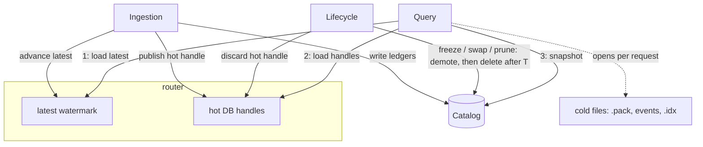
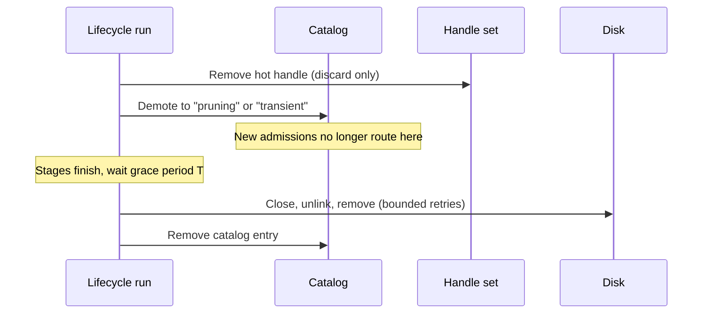

# Query Routing Design

## Overview

This document is the read-side counterpart to the [streaming workflow](./full-history-streaming-workflow.md). It describes how queries determine, for each chunk in their requested range, whether data is served from a hot database or sealed cold files. It also explains how that routing remains correct while ingestion and lifecycle workers concurrently add, replace, and remove stores.

Every query is admitted against a consistent snapshot of serving state. At admission, the query loads the current `latest` watermark, the current set of open hot database handles, and a RocksDB snapshot of the **catalog**. It uses that admitted state for its entire lifetime and releases the snapshot when the request completes. The snapshot gives the query a repeatable read of the routing metadata: which chunks are frozen, which hot databases are ready, and which index generation covers each window. There is no second copy of that metadata to maintain: queries read the same catalog the lifecycle writes, pinned at admission time.

A small in-memory **router** owns only what cannot live in the catalog: the `latest` watermark and the shared hot database handles. It changes only when a hot database opens or is discarded.

Deletion is deferred rather than reader-tracked. Every request runs under a fixed deadline. Once a resource is demoted in the catalog, no newly admitted query is routed to it, and physical destruction waits out a grace period longer than the maximum request lifetime, so queries admitted earlier can finish against it ([Deferred deletion](#deferred-deletion)).

The following terms are used throughout this document.

- **Chunk**: 10,000 consecutive ledgers, the unit of storage.
- **Window**: 1,000 chunks, or 10 million ledgers. Each window has one transaction hash `.idx` file.
- **Catalog**: The durable RocksDB record of each store and its lifecycle state, and the single source of truth for routing metadata.
- **Admission snapshot**: A RocksDB snapshot of the catalog taken when a query is admitted and released when it completes. A repeatable read of routing metadata.
- **Handle set**: The router's map of open hot database handles, published atomically. A query loads it once at admission.
- **Hot / cold**: Hot data is served from a live RocksDB database, one per hot chunk. Cold data is served from sealed files written once during freezing.
- **Retention floor**: The oldest ledger served, derived at admission from `latest` and the retention configuration. A request whose leading edge is below its admitted floor is not served (R2).
- **`latest`**: The newest fully ingested ledger visible to queries.

---

## The problem

Three kinds of workers access storage concurrently:

- **One ingestion worker** appends each new ledger to the live hot database as the network produces it. Approximately every 5 seconds it commits one atomic write batch. At each chunk boundary, it stops writing to the completed hot chunk and opens the next hot database.
- **One lifecycle worker** performs housekeeping. It freezes completed chunks into cold files, rebuilds the window's transaction hash index at each boundary, discards hot databases once cold files fully cover their data, and removes data that has fallen outside the retention window.
- **Many query workers**, one for each incoming JSON-RPC request.

Every query must observe a consistent serving state throughout its lifetime. It must not combine routing decisions from different storage states, and it must not be directed to a resource that can be destroyed before the request finishes. Without coordination, several races become possible.

|        | Problem | Example |
| ------ | ------- | ------- |
| **H1** | A query plans its reads while serving state changes. | A range query resolves chunk X to its hot database just as the discard scan removes that database because cold files now cover it. |
| **H2** | A resource is destroyed while a read is in progress. | An index rebuild replaces a superseded `.idx`, and the sweep closes and unlinks it while a `getTransaction` request is still reading it. |
| **H3** | A query reads the newest ledger while it is still being ingested. | A `getLedgers` request at the tip must either return ledger *n* completely or not at all. It must never advertise a `latestLedger` that it cannot actually serve. |
| **H4** | The retention floor advances during a query. | A prune removes the oldest chunk in a range after the query has already been admitted. |

The streaming design already establishes two read-path requirements:

- **R1. Only finished data is served.** A query must not serve a chunk or index whose catalog state is `"freezing"`, `"pruning"`, or `"transient"`.
- **R2. Data below the admitted retention floor is not served.** Even if data still exists on disk, a request whose leading edge is below its admitted floor is not served: point lookups return not found, and range requests are rejected with an error that reports the available range.

These races occur while ingestion, freezing, index replacement, discard, and pruning all proceed concurrently. Throughout every transition, the entire active retention window must remain continuously servable, with no gaps between hot and cold storage. This is the read-side view of [INV-1](./full-history-streaming-workflow.md#invariants) from the streaming workflow.

---

## Design summary

The design uses four mechanisms:

1. Every query reads routing metadata through one catalog snapshot taken at admission, so routing decisions never mix storage states (H1).
2. The router publishes the shared hot database handles; every cold file is opened by the request that reads it.
3. The lifecycle destroys retired resources only after a grace period longer than the maximum request lifetime, and every close of a shared handle drains in-flight operations, so nothing a request can reach is destroyed while it runs (H2, H4).
4. The router maintains the `latest` watermark so queries never observe partially ingested ledgers (H3).

Together, these mechanisms let ingestion, lifecycle operations, and queries proceed concurrently without requiring readers to coordinate with writers. Admission is three loads; the request's only bookkeeping obligation is releasing its snapshot when it completes.



---

## Admission

The catalog is the durable record of every store and its lifecycle state, and queries route directly from it. The router holds the two things the catalog cannot: the `latest` watermark, which advances every ledger, and the open hot database handles, which are live objects.

```go
type Router struct {
    catalog   *rocksdb.Store
    retention geometry.Retention
    latest    atomic.Uint32
    handles   atomic.Pointer[HandleSet]
    mu        sync.Mutex // serializes handle-set updates
}

type HandleSet struct {
    hot map[chunk.ID]*hotchunk.DB
}

type Admission struct {
    latest  uint32
    floor   chunk.ID
    handles *HandleSet
    snap    *rocksdb.Snapshot
    catalog *rocksdb.Store
}
```

### Design rationale

- **`latest` lives in the router.** The catalog records durability; `latest` records completeness, which includes the in-memory events apply that happens after the commit. Only the ingest loop can announce it, and it advances every few seconds, far too often for catalog reads to be the lookup path.
- **`handles` lives in the router.** The live chunk's hot database has exactly one usable handle, owned by ingestion; RocksDB is single-writer, so a query cannot open its own. An in-memory map is the only way to share it. The handle set is copy-on-write: updates clone the map under `mu` and publish it atomically, and it changes only at hot open and hot discard.
- **Everything else has no in-memory copy.** Frozen flags, hot states, index coverage, and the data needed to derive the floor are read from the catalog through the admission snapshot.

### Admitting a query

Every query performs three loads at admission, in this order:

```go
func (r *Router) Admit() (*Admission, error) {
    latest := r.latest.Load()
    handles := r.handles.Load()
    snap, err := r.catalog.NewSnapshot()
    if err != nil {
        return nil, err
    }
    // The frontier is the last complete chunk, the same anchor prune uses.
    floor := r.retention.FloorAt(geometry.LastCompleteChunkAt(latest))
    return &Admission{latest: latest, floor: floor, handles: handles, snap: snap, catalog: r.catalog}, nil
}

func (a *Admission) Release() { a.catalog.ReleaseSnapshot(a.snap) }
```

The order is important, for the same reason as in the streaming workflow's write ordering.

`latest` is loaded first. The write side publishes a chunk's serving state (catalog key and handle) before the chunk's first ledger commits, and advances `latest` last. A query's admitted range therefore only covers chunks whose serving state predates its `latest`, which predates its other two loads. Loading `latest` after the snapshot would allow a chunk boundary between them: `latest` could point into a newly opened chunk the older snapshot does not show.

The snapshot is loaded last, so the metadata is the newest of the three. Any skew between the handle set and the snapshot then resolves safely: if the snapshot shows a chunk demoted from hot after the handle set was loaded, it also shows the chunk's cold artifacts frozen, because coverage is published before discard, and routing prefers cold. A query never needs a handle for a chunk its snapshot no longer serves hot. Skew in the other direction, a hot chunk the handle set does not yet contain, cannot be reached at all: its first ledger commits only after the handle is published, so the admitted `latest` never points into it.

The floor is derived from the admitted `latest` and the retention configuration, so it is consistent with the admitted range by construction. Prune uses the same derivation at its own frontier; since `latest` is monotonic, an admitted floor is never behind a completed prune's floor, so queries are never routed below pruned data.

After admission, the query validates and clamps its requested range against `[floor, latest]`. Requests whose leading edge falls below the floor are rejected with an error carrying the available range. Requests extending beyond `latest` are truncated.

Every request must release its snapshot when it completes, including on error paths. A leaked snapshot pins catalog compaction until process exit; snapshot age is worth a metric.

### Resolution

Routing resolves each chunk independently, reading its state through the admission snapshot. All query methods share this one function, so the serving rules (R1, cold-wins) have a single implementation site.

```go
func (a *Admission) resolve(c chunk.ID, k Kind) (Store, error) {
    st, ok, _ := a.catalog.GetSnap(a.snap, geometry.ChunkKey(c, k))
    if ok && st == geometry.StateFrozen {
        return openColdReaders(c, k)
    }
    hst, ok, _ := a.catalog.GetSnap(a.snap, geometry.HotChunkKey(c))
    if ok && hst == geometry.HotReady {
        if db, ok := a.handles.hot[c]; ok {
            return db.Store(k), nil
        }
    }
    return nil, ErrUnavailable
}
```

The resolution order is deterministic. When both hot and cold copies exist, routing selects the cold artifact. States other than `"frozen"` and `"ready"` are never served, which is R1: a freezing, pruning, or transient resource is invisible to routing regardless of what is on disk.

If a chunk has no serving home, routing returns `ErrUnavailable`.

For `getTransaction`, the window index coverage is read the same way: the lookup iterates the coverage keys through the snapshot, and opens each generation-named `.idx` file it probes.

---

## Deferred deletion

Destruction of retired resources is delayed and executed by the lifecycle itself. There is no separate reaper thread.

The rule is:

> A resource that was servable may be destroyed only after it has been demoted for at least grace period **T**.

Every read handler runs under an enforced request deadline **D**, and the grace period is derived from it:

```text
T = maximum request timeout + safety margin
```

As a run's stages demote resources in the catalog, they append each demoted item to a list local to the run. When the stages finish and the list is non-empty, the run waits out the grace period once, then deletes each item: closing discarded hot databases, unlinking superseded index generations and pruned chunk files, and removing their catalog entries. An item that cannot be deleted, such as a hot database whose close is blocked by a read stuck on a slow disk, is alarmed and skipped; the next run's scans re-discover its demoted key and retry.

The catalog demotions are the durable work list: after a crash, startup re-discovers pending deletions and runs the same sweep before serving, which is safe because no query survives the process. Because deletion happens inside the run, a finished run means everything it demoted is gone or alarmed: an idle daemon is a settled catalog.

The grace period preserves availability. A query admitted before a resource was demoted may still be routed to it for the rest of its lifetime. Since **T > D**, the resource remains open and servable until every such query has passed its deadline, so lifecycle transitions do not fail requests already in flight.

The grace period alone is not sufficient for memory safety, because the deadline bounds the response, not the handler goroutine. On timeout, the request duration limiter cancels the request context and returns an error to the client without waiting for the handler. A handler blocked in a call that cannot observe cancellation, such as a RocksDB read stalled on a slow disk, keeps running past **D** and can still hold a reference after **T**.

Memory safety therefore comes from ownership and drain barriers, not from time:

- **Hot databases**: the only shared handles. `rocksdb.Store` holds a read lock across every C call; `Close` flips a closed flag, then takes the write lock, so it waits for in-flight operations to drain and every later operation fails cleanly with a closed error.
- **Cold readers and window indexes**: opened and closed by the request that uses them ([Open-handle management](#open-handle-management)). No other component ever closes them, so a close cannot race a read.

A straggler that outlives **T** is harmless: `Close` waits out its in-flight operation, and any later operation fails with a closed error. For retired files, unlink does not disturb descriptors already open: a straggler keeps reading the unlinked file, and the space is reclaimed when it exits.

Deletion follows this sequence:

1. A lifecycle run demotes the resource in the catalog (`"pruning"` or `"transient"`) and, for a hot database, removes its handle from the handle set.
2. Newly admitted queries no longer route to it: their snapshots see the demotion.
3. At the end of the run, after the grace period, the run closes handles, unlinks files, removes directories, and removes the catalog entries. Stuck items are alarmed, skipped, and retried by the next run's scans.



The tradeoff is a longer run: the grace period is waited once at the end, minutes against runs that happen hours apart. In exchange, retired resources are reclaimed within the run that demoted them, and a deletion blocked by a straggler cannot stall the run beyond its bounded retries: it is alarmed, skipped, and retried by the next run.

---

## Write-side transitions

Most lifecycle transitions need no serving-side action at all: they commit to the catalog, and newly admitted queries observe the commit through their snapshots. Only the hot database handles require explicit publication.

| Write-side transition | Serving-side action | Ordering rule |
| --- | --- | --- |
| `openHotDBForChunk` flips `hot:chunk:{c}` to `"ready"` | Publish the handle into the handle set. | After the catalog flip and before the chunk's first ledger commits, so the watermark can never enter a chunk whose serving state is unpublished. |
| Per-ledger ingest cycle: atomic `batch.Commit(sync)` plus in-memory applies | `latest.Store(seq)` | Final step of the cycle, after every serving structure contains the ledger. |
| `processChunk` flips artifact keys to `"frozen"` | None. New admissions see the frozen keys. | Commit before any hot discard is evaluated (freeze adds before discard removes). |
| Transaction index rebuild (`buildTxhashIndex`): a single atomic catalog write freezes the new coverage and demotes its predecessor to `"pruning"` | None. New admissions see the new coverage. The predecessor's file is deleted at the end of the run, after the grace period. | Coverage file names encode their `Lo-Hi` range, so an admission that read the old coverage opens its own generation of the index, never the replacement. |
| Hot database discard (`DiscardHotChunk`) | Remove the handle from the handle set. | Remove the handle and demote only after cold coverage is committed; destruction happens at the end of the run, after the grace period. |
| Retention prune | None. Demotions only; the floor is derived at admission, not published. | Gate on the derived floor, demote, and destroy at the end of the run. |
| Startup `serveReads()` | Build the handle set from `"ready"` hot keys; run the deferred-deletion sweep for leftover demotions. | Complete before the lifecycle goroutine starts and before queries are admitted. |

Three ordering notes matter:

- **`latest` advances last.** The watermark moves only after every serving structure contains the ledger. The RocksDB commit alone is not enough because the hot events store also applies in-memory indexes after commit. Advancing `latest` too early could let a query observe ledger N while its events are not yet searchable. Serving structures may run ahead of `latest`, but they must never lag it.

- **Coverage is committed before discard.** The index swap happens during `buildTxhashIndex`, and the discard scan runs later in the same lifecycle run. By the time discard is evaluated, the replacement coverage is already in the catalog, so any snapshot that no longer shows a chunk hot shows it covered cold.

- **Freeze adds before discard removes.** Freezing a chunk commits cold artifacts while the hot store remains available. During the overlap, routing chooses cold deterministically. Discard removes the hot handle only after cold coverage exists.

Together, these keep the read-side coverage property: at every catalog commit, every chunk in `[floor, lastCompleteChunk]` has a frozen artifact or a ready hot database for each data type, and the live chunk is ready before its first ledger commits.

---

## Open-handle management

The router manages two kinds of serving resources, with opposite lifetime policies.

| Resource | Policy |
| --- | --- |
| Hot databases | Always open, shared by ingestion and queries |
| Cold files (chunk packfiles, events indexes, window `.idx`) | Opened and closed by each request |

Handles are cheap to create and expensive to share: an open or mmap costs microseconds, while a shared handle needs close coordination with every reader. The policies follow.

### Hot databases

Hot databases remain open from `openHotDBForChunk` until a lifecycle run destroys them after discard. Each hot chunk has a single shared RocksDB instance owned by the router; ingestion and queries use the same handle concurrently, and its close drains in-flight operations ([Deferred deletion](#deferred-deletion)).

### Cold readers and window indexes

Every cold resource is opened by the request that needs it and closed when the request finishes with it. Only the owner closes a reader, so a close never races a read, and retirement needs no reader tracking ([Deferred deletion](#deferred-deletion)).

The MVP does no caching here. Each open re-reads and re-parses what it needs.

### Deferred: caching parsed state

An open re-reads and re-parses the reader's metadata: the events reader loads its MPHF and each packfile loads its offsets index. For a frequently hit chunk the reads are served from the OS page cache, but the parsing and allocation repeat on every open.

If this shows up in profiles, add a bounded cache of the parsed state, keyed by chunk. Only data with no close method goes in it; handles never do. Evicting data is harmless, so the cache needs nothing from the deletion path or the catalog, and it can be added later without changing this design.

### Platform assumption

Per-request opens with deferred unlink rely on POSIX unlink semantics: an unlinked file stays readable through existing descriptors and mappings, and its name is immediately reusable. Linux and macOS provide this. Windows does not provide this reliably: memory-mapped files cannot be deleted while mapped, so the deferred deletes would need retry semantics there.

---

## Query routing

All query handlers follow the same routing model. They differ only in how they consume the resolved stores.

### Common routing

Every query follows the same sequence:

1. Admit the request: load `latest` and the handle set, take the catalog snapshot, derive the floor.
2. Validate and clamp the requested ledger range.
3. Resolve each chunk to its serving store through the snapshot.
4. Execute the query against the resolved stores.
5. Release the snapshot.

The admission protocol is described in [Admission](#admission).

### Bounds

Every request validates its leading edge and clamps its trailing edge against the admitted range `[floor, latest]`.

The leading edge determines where results begin. A range request whose leading edge falls below the admitted retention floor is rejected with an error that carries the available range, matching v1's out-of-range behavior. Silently clamping would drop the first results the caller asked for.

The trailing edge determines where the scan ends. Requests extending beyond `latest` are truncated, and descending scans terminate at the retention floor.

### Cursors

Pagination cursors obey five rules:

- A cursor encodes ledger coordinates (ledger, transaction, operation, event), never a store, tier, or internal event ID, so stores can change between pages without invalidating it.
- Resume is exclusive in the scan direction: strictly after the cursor position ascending, strictly before it descending, so a retried page never duplicates results.
- The request's bounds and filters travel in the cursor; the floor does not. Each page gates against its own admitted floor, and a cursor whose position has aged below it is rejected with the available range.
- `latest` is re-read at each page's admission, so an ascending scan that catches up to the tip finds more ledgers under the same cursor later.
- A page that exhausts its scan window without matches still advances the cursor, so rare filters make progress.

Each page performs its own admission and releases its own snapshot.

### Chunk traversal

Each chunk belongs to exactly one serving store for a given query path. Multi-chunk requests therefore concatenate results rather than merge them.

Ascending requests visit chunks in ascending order. Descending requests reverse the traversal.

The following diagram illustrates the running example used throughout this section.

```text
          ◄──────────────────── retention window ────────────────────►
          floor                              last complete       live
chunks:   5100 ─────── fully cold ───── 6542 │      6543      │ 6544
                                             │ (both tiers)   │
ledgers   ─────────── {chunk}.pack ──────────┤ .pack ◄ wins   │ hot CF
events    ────── events/index packs ─────────┤ packs ◄ wins   │ hot CFs
tx-hash   ───────────── window .idx ─────────┤ hot CF until covered
```

### `getLedgers`

`getLedgers` streams ledgers in ascending ledger order. For each overlapping chunk, the router resolves the ledger store and streams the requested range. Results are concatenated until the requested limit is reached.

Example request:

- `startLedger = 65,439,995`
- `limit = 10`

The request spans chunks 6543 and 6544. Chunk 6543 resolves to the cold ledger store and returns the last five ledgers of that chunk. Chunk 6544 resolves to the live hot store and returns the remaining five. The response is the concatenation of both streams.

### `getTransactions`

`getTransactions` builds on `getLedgers`.

The router streams ledgers using the same traversal described above. Each ledger is decoded and its transactions are emitted in application order.

The cursor identifies a transaction within a ledger. The first ledger resumes after the cursor position, while subsequent ledgers begin with their first transaction.

### `getTransaction`

A transaction hash does not identify the chunk containing the transaction, so routing cannot resolve it directly.

Instead, the router probes the transaction indexes in two stages:

1. Probe the hot transaction indexes. A match is definitive.
2. Probe each window transaction index. A match identifies a candidate ledger, which is fetched and verified against the full transaction hash. Candidates below the admitted floor are skipped. This enforces R2 for by-hash lookups, which have no range to clamp, and makes it safe for a window index to keep naming ledgers that prune has already removed.

The router supplies `TxReader` with:

- the hot transaction indexes,
- the window index coverages, read from the admission snapshot, whose `.idx` files the lookup opens as it probes, and
- a ledger source backed by `resolve(chunk, Ledgers)`.

This preserves the existing lookup semantics while allowing `TxReader` to operate across both hot and cold storage.

### `getEvents`

`getEvents` searches rather than fetches data.

Each page establishes a scan window, resolves the overlapping chunks, and invokes the existing event query engine for each reader.

The event query engine operates on the common `eventstore.Reader` interface, so routing is identical for hot and cold readers.

Pages terminate when either:

- the requested number of events has been returned, or
- the scan window has been exhausted.

The cursor records the query position, while `scannedLedger` records how far the search progressed.

Example: the following shows the first page of a descending query beginning at the current `latest` ledger.

```text
 page 1

 [65,433,211 .................................. 65,443,210]
                                           ◄── scan direction

 chunk 6544 (hot)
 chunk 6543 (cold)
```

The router resolves the live chunk first, followed by the cold chunk. Results are returned in descending ledger order until the page is full or the scan window has been exhausted.

---

## Changes to the streaming workflow

This proposal introduces a small number of changes to the streaming workflow. The overall storage lifecycle is unchanged.

### Hot database ownership

The streaming workflow assumes the ingestion worker owns the hot RocksDB instances.

This proposal transfers ownership to the router. Each hot database is opened once, published in the handle set, and shared by both ingestion and queries until a lifecycle run destroys it after discard.

This change allows queries to access hot databases without opening additional RocksDB instances. It also changes the freeze source: today the backfill's `resolveHotSource` reopens the cleanly closed chunk read-only; under this proposal it is supplied the router's shared handle instead.

### Catalog snapshot support

The rocksdb wrapper gains snapshot support: acquire and release, and snapshot-pinned reads and iteration, under the same lifecycle-lock discipline as its other operations. The catalog store uses them for admission.

### `latest` watermark

The write path advances `latest` only after a ledger has become fully queryable.

Advancing the watermark is the final step of per-ledger ingestion. Queries admitted afterward may observe the new ledger.

### Deferred destruction

The streaming workflow destroys retired resources immediately after catalog demotion.

This proposal defers destruction to the end of the run, after a grace period from demotion. The catalog protocol is unchanged except for that delay.

---

## Open questions

- **Datastore fallback below the floor.** The v1 `getLedgers` handler can fall back to the remote object store for pre-retention ledgers. v2 must either preserve that behavior as an explicit exception to R2 or remove it at cutover. This decision belongs to #772.
- **Serving floor precision.** The floor derived at admission is chunk-aligned, so `oldestLedger` advances in 10,000-ledger steps. A ledger-precise floor would better match v1's sliding window, but adds another floor concept.
- **`getTransaction` probe parallelism.** The proposal uses sequential newest-first probing. If window count or tail latency becomes a problem, parallel probing can be added inside the lookup path without changing the routing model.
- **Snapshot hygiene.** A leaked admission snapshot pins catalog compaction until process exit. Whether release discipline needs a backstop (a snapshot age metric, or a watchdog) is an implementation-time decision.

---

## Alternatives considered

### Immutable in-memory View

Publish a derived, immutable View of the routing metadata on every lifecycle transition; queries load one pointer at admission instead of taking a catalog snapshot.

Not chosen because it maintains a second copy of the routing metadata, kept in sync with the catalog through per-transition publish hooks. Worth revisiting only if per-request snapshot costs ever become measurable: snapshot acquire and release contend under high concurrency, and a straggler's held snapshot pins catalog compaction, which stays harmless only while the catalog's write rate is low.

### Explicit reader tracking

Track active readers directly, either by reference-counting resources or by holding a reader lock while a query runs.

The design already tracks readers at the operation level: the hot database wrapper holds a read lock for the duration of each call, which is what makes its close a drain barrier. This alternative is per-request tracking: a count held for the request's whole lifetime, letting destruction happen the moment the count reaches zero instead of waiting out the grace period.

This was not chosen because exact reclamation timing is not needed, and per-request counts handle the failure case worse. A request stuck past its deadline holds its count indefinitely and keeps the resource alive, while under the grace period the same straggler receives a closed error and terminates.

Per-request tracking becomes necessary if a request type without an enforced deadline is ever added, such as a streaming subscription. The grace period's availability argument depends on **D** existing.

### Filesystem unlink semantics alone

Rely on the filesystem to keep already-open files readable after they are unlinked, and unlink immediately at retirement with no grace period.

The design adopts the first half: a request that opened a cold file before it was unlinked keeps reading it ([Open-handle management](#open-handle-management)). Immediate unlink was not chosen because it only protects files that are already open. A query admitted earlier may open a chunk for the first time after prune has demoted it, and would fail mid-request. Deferring the unlink by the grace period covers those late opens. Hot databases are unaffected either way: a RocksDB handle is not kept alive by unlink semantics, and its lifetime is governed by the drain barrier.

---

## Related documents

- [full-history-streaming-workflow.md](./full-history-streaming-workflow.md): the write side this design reads from: geometry, the catalog and one write protocol, the lifecycle run, the reader contract, and INV-1 through INV-4.
- [gettransaction-full-history-design.md](./gettransaction-full-history-design.md): the tx-hash tiers, `.idx` coverage semantics, and the cold-lookup verify chain that `getTransaction` routing drives.
- [getevents-full-history-design.md](./getevents-full-history-design.md): the per-chunk events engines and their measured latencies.
