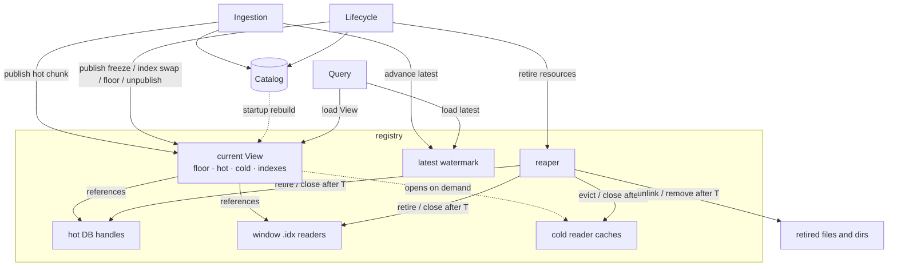
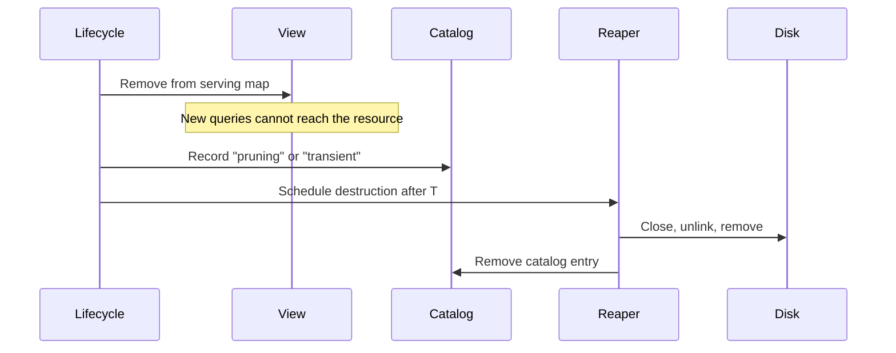

# Query Routing Design

## Overview

This document is the read-side counterpart to the [streaming workflow](./full-history-streaming-workflow.md). It describes how queries determine, for each chunk in their requested range, whether data is served from a hot database or sealed cold files. It also explains how that routing remains correct while ingestion and lifecycle workers concurrently add, replace, and remove stores.

Every query is admitted against a single immutable snapshot of the **serving map**, called a **View**. The serving map records which store serves each chunk, which transaction hash index serves each window, and the retention floor. At admission, the query loads the current `latest` watermark and one current View. It then uses that admitted state for its entire lifetime.

A small in-memory **registry** owns the serving map. When a storage operation changes what is servable, such as freezing a chunk, replacing a transaction hash index, discarding a hot database, or advancing the retention floor, the registry creates a new View, applies the change, and atomically publishes it. Queries already in flight continue using the View they admitted with, while newly admitted queries observe the updated View.

Deletion safety is time-based rather than reader-tracked. Every request runs under a fixed deadline. Once a resource is removed from the current View, no newly admitted query can reach it. Any query that can still reach it must have admitted an older View and must finish before its deadline. The lifecycle therefore delays physical destruction until a grace period longer than the maximum request lifetime has elapsed.

The following terms are used throughout this document.

- **Chunk**: 10,000 consecutive ledgers, the unit of storage.
- **Window**: 1,000 chunks, or 10 million ledgers. Each window has one transaction hash `.idx` file.
- **Serving map**: The in-memory map of chunks and windows to the stores that serve them, plus the retention floor.
- **View**: An immutable snapshot of the serving map admitted by a query.
- **Hot / cold**: Hot data is served from a live RocksDB database, one per hot chunk. Cold data is served from sealed files written once during freezing.
- **Catalog**: The durable RocksDB record of each store and its lifecycle state.
- **Retention floor**: The oldest ledger served by a View. A request whose leading edge is below its admitted View's floor is not served (R2).
- **`latest`**: The newest fully ingested ledger visible to queries.

---

## The problem

Three kinds of workers access storage concurrently:

- **One ingestion worker** appends each new ledger to the live hot database as the network produces it. Approximately every 5 seconds it commits one atomic write batch. At each chunk boundary, it stops writing to the completed hot chunk and opens the next hot database.
- **One lifecycle worker** performs housekeeping. It freezes completed chunks into cold files, rebuilds the window's transaction hash index at each boundary, discards hot databases once cold files fully cover their data, and removes data that has fallen outside the retention window.
- **Many query workers**, one for each incoming JSON-RPC request.

Every query must observe a consistent serving map throughout its lifetime. It must not combine routing decisions from different storage states, and it must not be directed to a resource that can be destroyed before the request finishes. Without coordination, several races become possible.

|        | Problem | Example |
| ------ | ------- | ------- |
| **H1** | A query plans its reads while the serving map changes. | A range query resolves chunk X to its hot database just as the discard scan removes that database because cold files now cover it. |
| **H2** | A resource is destroyed while a read is in progress. | An index rebuild replaces a superseded `.idx`, and the sweep closes and unlinks it while a `getTransaction` request is still reading it. |
| **H3** | A query reads the newest ledger while it is still being ingested. | A `getLedgers` request at the tip must either return ledger *n* completely or not at all. It must never advertise a `latestLedger` that it cannot actually serve. |
| **H4** | The retention floor advances during a query. | A prune removes the oldest chunk in a range after the query has already been admitted. |

The streaming design already establishes two read-path requirements:

- **R1. Only finished data is newly visible.** A newly published View must not introduce a chunk or index while it is in the catalog state `"freezing"`, `"pruning"`, or `"transient"`.
- **R2. Data below the admitted retention floor is not served.** Even if data still exists on disk, a request whose leading edge is below the floor recorded in its admitted View is not served: point lookups return not found, and range requests are rejected with an error that reports the available range.

These races occur while ingestion, freezing, index replacement, discard, and pruning all proceed concurrently. Throughout every transition, the entire active retention window must remain continuously servable, with no gaps between hot and cold storage. This is the read-side view of [INV-1](./full-history-streaming-workflow.md#invariants) from the streaming workflow.

---

## Design summary

The design uses four mechanisms:

1. Every query resolves against one immutable View of the serving map, so routing decisions never mix storage states (H1).
2. The registry publishes a new View whenever the serving map changes.
3. The reaper destroys retired resources only after they have been unreachable for a grace period longer than the maximum request lifetime, so nothing a request can reach is destroyed while it runs (H2, H4).
4. The registry maintains the `latest` watermark so queries never observe partially ingested ledgers (H3).

Together, these mechanisms let ingestion, lifecycle operations, and queries proceed concurrently without requiring readers to coordinate with writers. Queries perform two atomic loads during admission, then use ordinary immutable data for the rest of the request. They do not acquire locks or participate in reference counting.



---

## Registry and View

The catalog remains the durable record of every store and its lifecycle state. The registry is a disposable in-memory projection of the catalog.

A query loads one View when it is admitted and uses that same View for its entire lifetime. Later View updates affect only newly admitted queries.

Each View records:
- the retention floor used by queries admitted with that View,
- the hot stores,
- the cold artifacts available for each chunk, and
- the transaction hash indexes for each window.

The registry is rebuilt from the catalog during startup before the server begins accepting requests.

```go
type Registry struct {
    mu      sync.Mutex
    current atomic.Pointer[View]
    latest  atomic.Uint32
    reaper  *Reaper
}

type View struct {
    floor   chunk.ID
    hot     map[chunk.ID]*hotchunk.DB
    cold    map[chunk.ID]ColdChunk
    indexes []IndexCoverage
}

type ColdChunk struct {
    Ledgers bool
    Events  bool
}

type IndexCoverage struct {
    Window WindowID
    Lo, Hi chunk.ID // the frozen .idx's actual coverage, not the window bounds:
                    // Hi trails the tip while the window is current, and Lo is
                    // the retention floor at build time
    Idx    *txhash.ColdReader
}
```

### Design rationale

Each field exists for a specific reason.

- **`hot` stores shared handles.** Each hot chunk has one registry-owned `hotchunk.DB` instance used by ingestion and queries.
- **`cold` holds flags, not open readers.** A `ColdChunk` entry only says the chunk's artifact is frozen and servable. The reader object itself is opened on demand through the reader caches ([Open-handle management](#open-handle-management)): with thousands of cold chunks, holding every reader open would cost gigabytes, unlike the handful of hot databases and window indexes the View references directly.
- **`indexes` stores transaction hash readers.** Each in-retention window has one current `.idx` reader.
- **`latest` is stored outside the View.** The serving map changes only at chunk boundaries and lifecycle transitions, while `latest` advances every ledger. Keeping it separate avoids copying the View every few seconds.

### Admission

Every query performs two atomic loads during admission.

```go
latest := registry.latest.Load()
view := registry.current.Load()

floorLedger := view.floor.FirstLedger()
```

The order is important. The query reads `latest` before loading the View. A ledger less than or equal to the admitted `latest` is queryable only if it is not below the floor recorded in the subsequently loaded View. The write-side publication order guarantees that every ledger in that admitted range has a serving home in the loaded View.

Reversing the order would break that guarantee. A chunk boundary could occur between the two loads, allowing `latest` to point into a newly opened chunk that is not present in the older View. The response could then advertise a `latestLedger` that it cannot serve.

After admission, the query validates and clamps its requested range against `[floorLedger, latest]`. Requests whose leading edge falls below `floorLedger` are rejected with an error carrying the available range. Requests extending beyond `latest` are truncated.

No further synchronization is required. The View is immutable, so the query simply keeps its pointer for the lifetime of the request.

### Publishing View updates

Every change to the serving map follows the same pattern.

```go
func (r *Registry) publish(mutate func(*View) (removed []Resource)) {
    r.mu.Lock()

    next := r.current.Load().clone()
    removed := mutate(next)

    r.current.Store(next)

    r.mu.Unlock()

    r.reaper.Schedule(removed)
}
```

The registry serializes View updates with a mutex. Each update clones the current View, applies the requested changes, atomically publishes the new View, and schedules any removed resources with the reaper.

Additions are published only after the corresponding catalog state is durable and serving-ready. Removals follow the ordering rules in [View update points](#view-update-points).

View updates occur only when the serving map changes, such as chunk boundaries or lifecycle transitions. Even with full history, cloning the View copies only a few hundred kilobytes of pointers, which is negligible compared to the roughly fourteen-hour interval between chunk boundaries.

---

## The reaper

The reaper safely destroys resources that have been removed from the serving map.

Its rule is:

> A resource that was reachable from a published View may be destroyed only after it has been unreachable for at least grace period **T**.

A resource becomes **unreachable** when it has been removed from the current View and can no longer be returned by reader caches. A resource is **destroyed** when it is permanently closed or removed.

```go
type Reaper struct {
    graceT time.Duration // derived from the request timeout
    queue  []retired     // {destroy func(), notBefore time.Time}
}
```

Every read handler runs under an enforced request deadline **D**. The grace period is derived from that deadline:

```text
T = maximum request timeout + safety margin
```

This is enough because every query keeps exactly one admitted View for its entire lifetime. Once a resource is unpublished, no newly admitted query can reach it. Any query that can still reach it must have admitted an older View, and therefore must finish before its deadline **D**. Since **T > D**, the resource is not destroyed until all such queries should have completed.

The same rule covers hot databases, transaction hash index readers, and cached cold readers.

Deletion follows this sequence:

1. Remove the resource from the serving map.
2. Record the catalog demotion, such as `"pruning"` or `"transient"`.
3. Schedule the resource with the reaper.
4. After **T**, close handles, unlink files, remove directories, and remove the catalog entry.

Only physical destruction is delayed. Catalog demotions still occur during the lifecycle run.



The reaper has no persistent state. If the process exits before scheduled deletion completes, startup reconstructs pending deletion work from the catalog and runs it immediately. No new grace period is needed because demoted stores never enter the rebuilt View, so no query can reference them.

The tradeoff is delayed cleanup. Retired hot databases, superseded indexes, and pruned chunk files may remain on disk until **T** expires. Because **T** is measured in minutes while lifecycle operations occur hours apart, the extra disk usage is expected to be small.

---

## View update points

Every write-side transition that changes what is servable gets a registry hook. Additions are published after the catalog commit that makes the resource serving-ready, which is how R1 is kept: a transitional resource never enters a newly published View. Removals are unpublished before destructive work and, except for the index swap, before catalog demotion.

| Write-side transition | Registry hook | Ordering rule                                                                                                                                                                                                 |
| --- | --- |---------------------------------------------------------------------------------------------------------------------------------------------------------------------------------------------------------------|
| `openHotDBForChunk` flips `hot:chunk:{c}` to `"ready"` | Publish `hot[c] = stores` using the shared instance. | Publish after the catalog key flips to `"ready"` and before the chunk's first ledger commits, so the watermark can never enter a chunk the current View does not serve.                                       |
| Per-ledger ingest cycle: atomic `batch.Commit(sync)` plus in-memory applies | `latest.Store(seq)` | Final step of the cycle, after every serving structure contains the ledger.                                                                                                                                   |
| `processChunk` flips artifact keys to `"frozen"` | Publish `cold[c].{kind} = true` for each frozen kind. | Publish after the commit. During startup backfill this hook has no effect; the startup scan (last row) covers those chunks.                                                                                   |
| Transaction index rebuild (`buildTxhashIndex`): a single atomic catalog write freezes the new coverage and demotes its predecessor to `"pruning"` | Replace the window's `IndexCoverage` entry with the new coverage and its reader. Hand the predecessor's reader to the reaper. | Publish after the atomic write. The predecessor's file deletion, previously `buildThenSweep`'s immediate unlink, now waits out the grace period, because queries holding older Views may still be reading it. |
| `discardHotDBForChunk` | Remove `hot[c]` from the View and hand the hot database to the reaper. | Unpublish before catalog demotion and every destructive step.                                                                                                                                                 |
| Retention prune | Publish the run's new floor, which also drops below-floor `cold`, `hot`, and `indexes` entries. | Gate, unpublish, demote, then destroy. The floor update removes below-floor resources before every demotion.                                                                                                  |
| Startup `serveReads()` | Build the initial View from the catalog scan: `"ready"` hot keys, `"frozen"` chunk keys, frozen coverages, and the calculated floor. | Complete before the lifecycle goroutine starts, so no freeze can land between the scan and the hooks becoming live.                                                                                           |

Four ordering notes matter:

- **`latest` advances last.** The watermark moves only after every serving structure contains the ledger. The RocksDB commit alone is not enough because the hot events store also applies in-memory indexes after commit. Advancing `latest` too early could let a query observe ledger N while its events are not yet searchable. Serving structures may run ahead of `latest`, but they must never lag it.

- **Coverage is published before discard.** The index-swap hook runs synchronously during `buildTxhashIndex`, and the discard scan runs later in the same lifecycle run. By the time discard is evaluated, the replacement coverage is already present in both the catalog and the View. After a crash, startup rebuilds the View from the catalog before serving.

- **Freeze adds before discard removes.** Freezing a chunk adds cold artifacts to the View while the hot store remains available. During the overlap, routing chooses one serving home deterministically. Discard removes the hot store only after cold coverage exists.

- **Index replacement is the only demotion-before-removal case.** The old index is marked `"pruning"` in the same catalog write that freezes the replacement. The View is updated immediately afterward. This short interval is safe because readers use their admitted View, not catalog state, and physical destruction still waits for the grace period.

Together, these hooks maintain the read-side coverage property: at every publication, every chunk in `[floor, lastCompleteChunk]` has a cold flag or a hot handle for each data type, and the live chunk has its hot handle before its first ledger commits. Freeze adds before discard removes; the index swap replaces within one publish; prune removes only below the floor it publishes first.

---

## Open-handle management

The registry manages three kinds of serving resources. Each uses a different lifetime policy based on its access pattern and resource cost.

| Resource | Policy |
| --- | --- |
| Hot databases | Always open |
| Window transaction indexes (`txhash.ColdReader`) | Always open |
| Per-chunk cold readers (`ledger.ColdReader`, `eventstore.ColdReader`) | Open on demand through per-kind LRU caches |

### Hot databases

Hot databases remain open from `openHotDBForChunk` until the reaper destroys them after discard.

Each hot chunk has a single shared RocksDB instance owned by the registry. Ingestion and queries use the same handle concurrently. RocksDB supports concurrent reads and writes on a single database instance.

### Transaction hash indexes

Each in-retention window keeps one `txhash.ColdReader` open.

These readers maintain only the state needed to service lookups efficiently. Keeping them open also simplifies index replacement because older Views continue using the superseded reader until the reaper closes it after the grace period.

### Cold readers

Cold readers are opened on demand.

Full history contains thousands of chunks and continues to grow. Keeping readers open for every cold artifact would consume substantial memory while providing little benefit for infrequently accessed data. Instead, the registry records only whether an artifact is available, and reader objects are managed through bounded per-kind LRU caches.

Ledger and event readers use separate caches because their resource costs differ significantly. Separate caches also prevent heavy event traffic from evicting ledger readers needed by other query paths.

### Interaction with the reaper

Reader caches follow the same lifetime rules as every other serving resource.

When a chunk is removed from the serving map, its cached readers are also retired. The reaper delays closing those readers until the grace period has elapsed, ensuring that no admitted query can still be using them.

Removing cached readers when a chunk is unpublished also guarantees deterministic cleanup. Otherwise, a lightly used reader could remain in the cache indefinitely and keep an unlinked file open until it was eventually evicted.

---

## Query routing

All query handlers follow the same routing model. They differ only in how they consume the resolved stores.

### Common routing

Every query follows the same sequence:

1. Admit the request by loading `latest` and the current View.
2. Validate and clamp the requested ledger range.
3. Resolve each chunk to its serving store.
4. Execute the query against the resolved stores.

The admission protocol is described in [Admission](#admission).

### Bounds

Every request validates its leading edge and clamps its trailing edge against the admitted range `[floorLedger, latest]`.

The leading edge determines where results begin. A range request whose leading edge falls below the admitted retention floor is rejected with an error that carries the available range, matching v1's out-of-range behavior. Silently clamping would drop the first results the caller asked for.

The trailing edge determines where the scan ends. Requests extending beyond `latest` are truncated, and descending scans terminate at the retention floor.

### Cursors

Pagination cursors obey five rules:

- A cursor encodes ledger coordinates (ledger, transaction, operation, event), never a store, tier, or internal event ID, so stores can change between pages without invalidating it.
- Resume is exclusive in the scan direction: strictly after the cursor position ascending, strictly before it descending, so a retried page never duplicates results.
- The request's bounds and filters travel in the cursor; the floor does not. Each page gates against its own admitted floor, and a cursor whose position has aged below it is rejected with the available range.
- `latest` is re-read at each page's admission, so an ascending scan that catches up to the tip finds more ledgers under the same cursor later.
- A page that exhausts its scan window without matches still advances the cursor, so rare filters make progress.

### Chunk resolution

Routing resolves each chunk independently.

```go
func (v *View) resolve(c chunk.ID, k Kind) (Store, error) {
    if v.cold[c].has(k) {
        return coldReaders(c, k)
    }
    if hs, ok := v.hot[c]; ok {
        return hs.store(k)
    }
    return nil, ErrUnavailable
}
```

The resolution order is deterministic. When both hot and cold copies are available, routing selects the cold artifact.

If a chunk has no serving home, routing returns `ErrUnavailable`. This can occur during startup recovery when a required artifact has not yet reached a serving state.

### Chunk traversal

Each chunk belongs to exactly one serving store for a given query path. Multi-chunk requests therefore concatenate results rather than merge them.

Ascending requests visit chunks in ascending order. Descending requests reverse the traversal.

The following diagram illustrates the running example used throughout this section.

```text
          ◄──────────────────── retention window ────────────────────►
          floor                              last complete       live
chunks:   5100 ─────── fully cold ───── 6542 │      6543      │ 6544
                                             │ (both tiers)   │
ledgers   ─────────── {chunk}.pack ──────────┤ .pack ◄ wins   │ hot CF
events    ────── events/index packs ─────────┤ packs ◄ wins   │ hot CFs
tx-hash   ───────────── window .idx ─────────┤ hot CF until covered
```

### `getLedgers`

`getLedgers` streams ledgers in ascending ledger order. For each overlapping chunk, the router resolves the ledger store and streams the requested range. Results are concatenated until the requested limit is reached.

Example request:

- `startLedger = 65,439,500`
- `limit = 1,000`

The request spans chunks 6543 and 6544. Chunk 6543 resolves to the cold ledger store and returns the rest of that chunk. Chunk 6544 resolves to the live hot store and returns ledgers up to the remaining limit. The response is the concatenation of both streams.

### `getTransactions`

`getTransactions` builds on `getLedgers`.

The router streams ledgers using the same traversal described above. Each ledger is decoded and its transactions are emitted in application order.

The cursor identifies a transaction within a ledger. The first ledger resumes after the cursor position, while subsequent ledgers begin with their first transaction.

### `getTransaction`

A transaction hash does not identify the chunk containing the transaction, so routing cannot resolve it directly.

Instead, the router probes the transaction indexes in two stages:

1. Probe the hot transaction indexes. A match is definitive.
2. Probe each window transaction index. A match identifies a candidate ledger, which is fetched and verified against the full transaction hash. Candidates below the admitted floor are skipped. This enforces R2 for by-hash lookups, which have no range to clamp, and makes it safe for a window index to keep naming ledgers that prune has already removed.

The router supplies `TxReader` with:

- the hot transaction indexes,
- the window transaction indexes, and
- a ledger source backed by `resolve(chunk, Ledgers)`.

This preserves the existing lookup semantics while allowing `TxReader` to operate across both hot and cold storage.

### `getEvents`

`getEvents` searches rather than fetches data.

Each page establishes a scan window, resolves the overlapping chunks, and invokes the existing event query engine for each reader.

The event query engine operates on the common `eventstore.Reader` interface, so routing is identical for hot and cold readers.

Pages terminate when either:

- the requested number of events has been returned, or
- the scan window has been exhausted.

The cursor records the query position, while `scannedLedger` records how far the search progressed.

Example: the following shows the first page of a descending query beginning at the current `latest` ledger.

```text
 page 1

 [65,433,211 .................................. 65,443,210]
                                           ◄── scan direction

 chunk 6544 (hot)
 chunk 6543 (cold)
```

The router resolves the live chunk first, followed by the cold chunk. Results are returned in descending ledger order until the page is full or the scan window has been exhausted.

---

## Changes to the streaming workflow

This proposal introduces a small number of changes to the streaming workflow. The overall storage lifecycle is unchanged.

### Hot database ownership

The streaming workflow assumes the ingestion worker owns the hot RocksDB instances.

This proposal transfers ownership to the registry. Each hot database is opened once, registered in the current View, and shared by both ingestion and queries until the reaper destroys it after discard.

This change allows queries to access hot databases without opening additional RocksDB instances. It also changes the freeze source: freezing previously reopened the cleanly closed chunk read-only, and instead reads through the same shared handle, supplied via the backfill `HotProbe` seam.

### View updates

The registry publishes a new View at each storage transition that changes the serving map.

The update points are:

- opening a new hot database,
- publishing frozen chunk artifacts,
- replacing a transaction hash index,
- advancing the retention floor,
- removing a hot database during discard, and
- building the initial View from a catalog scan during startup `serveReads()`, before queries are admitted and before the lifecycle goroutine starts.

These updates occur in the order described in [View update points](#view-update-points).

### `latest` watermark

The write path advances `latest` only after a ledger has become fully queryable.

Advancing the watermark is the final step of per-ledger ingestion. Queries admitted afterward may observe the new ledger.

### Deferred destruction

The streaming workflow destroys retired resources immediately after catalog demotion.

This proposal instead schedules those resources with the reaper. Physical destruction occurs after the grace period has elapsed.

The catalog protocol is unchanged except for the delayed physical destruction of retired resources.

---

## Open questions

- **Datastore fallback below the floor.** The v1 `getLedgers` handler can fall back to the remote object store for pre-retention ledgers. v2 must either preserve that behavior as an explicit exception to R2 or remove it at cutover. This decision belongs to #772.
- **Serving floor precision.** This design currently uses a chunk-aligned floor, so `oldestLedger` advances in 10,000-ledger steps. A ledger-precise floor would better match v1’s sliding window, but adds another floor concept.
- **`getTransaction` probe parallelism.** The proposal uses sequential newest-first probing. If window count or tail latency becomes a problem, parallel probing can be added inside the lookup path without changing the routing model.
- **Cache sizing.** Ledger and event reader cache capacities are implementation-time tuning parameters.

---

## Alternatives considered

### Explicit reader tracking

Track active readers directly, either by reference-counting Views/resources or by holding a reader lock while a query runs.

This was not chosen because it adds work to every query: each request must acquire and release some reader state. This proposal avoids that by using the request deadline as the bound on reader lifetime. Queries only load `latest` and the current View at admission.

### Filesystem unlink semantics alone

Rely on the filesystem to keep already-open files readable after they are unlinked.

This was not chosen because it only applies to already-open cold files. It does not protect RocksDB handles, cache misses that open a file after unlink, or other resource types that must be closed explicitly. This proposal uses the grace period uniformly for hot databases, cold readers, and index readers.

---

## Related documents

- [full-history-streaming-workflow.md](./full-history-streaming-workflow.md): the write side this design reads from: geometry, the catalog and one write protocol, the lifecycle run, the reader contract, and INV-1 through INV-4.
- [gettransaction-full-history-design.md](./gettransaction-full-history-design.md): the tx-hash tiers, `.idx` coverage semantics, and the cold-lookup verify chain that `getTransaction` routing drives.
- [getevents-full-history-design.md](./getevents-full-history-design.md): the per-chunk events engines and their measured latencies.
