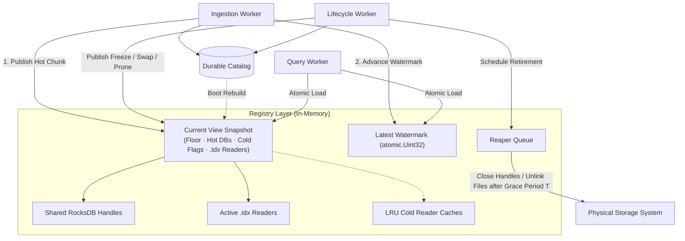

# Query Routing Architecture Specification: Read-Side Mechanics

## Overview & Objectives

This document specifies the read-side architecture for the Stellar full-history data engine, acting as the direct counterpart to the write-side streaming workflow.

The primary objective of this architecture is to decouple downstream JSON-RPC and database query execution from background storage mutations (such as ingestion appends, cold-file freezing, index replacement, and retention pruning). This design achieves **zero-lock read performance**, ensuring that incoming query workers can locate and stream historical ledger, transaction, and event data without acquiring read-write locks or coordinating with concurrent lifecycle workers.

---

## Hard Requirements & Design Goals

* **R1. Zero-Contention Reading:** Query workers must perform entirely lock-free lookups. They must execute two atomic pointer reads at admission and require no further synchronization for their lifetime.
* **R2. State Isolation (Anti-Race):** A query must observe a single, immutable, consistent snapshot of the network's serving layout. It must never mix routing topologies mid-stream.
* **R3. Deletion Safety (No Orphan Reads):** Background workers must be able to aggressively drop hot databases, supersede indexes, and un-link files without explicitly tracking active readers or causing segmented fault reads.
* **R4. Absolute Storage Continuity:** The system must guarantee continuous data availability across the retention window. No gaps or temporary unservable pockets are permitted during hot-to-cold tier cutovers.

---

## Component Architecture

The read-path infrastructure relies on a decoupled, state-isolated coordination model orchestrated by an in-memory `Registry`.



### 1. In-Memory Registry & Immutable Views

The state of the servable universe is governed by an in-memory `Registry` that owns a pointer to an immutable snapshot called a `View`. The `View` map isolates the structural layout of data storage from the query workers.

```go
type Registry struct {
	mu      sync.Mutex
	current atomic.Pointer[View]
	latest  atomic.Uint32
	reaper  *Reaper
}

type View struct {
	floor   chunk.ID
	hot     map[chunk.ID]*hotchunk.DB
	cold    map[chunk.ID]ColdChunk
	indexes []IndexCoverage
}

type ColdChunk struct {
	Ledgers bool
	Events  bool
}

type IndexCoverage struct {
	Window WindowID
	Lo, Hi chunk.ID 
	Idx    *txhash.ColdReader
}

```

### 2. The Atomic Admission Protocol

To guarantee isolation without locking, every query worker follows a strict, non-reversible entry sequence during execution admission:

```go
// Enforced Read Sequence
latest := registry.latest.Load()
view := registry.current.Load()

floorLedger := view.floor.FirstLedger()

```

> **Critical Safety Invariant:** `latest` **MUST** be loaded before the `View`. This ordering ensures that if `latest` advances into a newly allocated chunk boundary, the subsequently loaded `View` is guaranteed to contain the serving coordinates for that boundary. Reversing this sequence introduces a race where `latest` points into an unmapped space missing from an older `View`, yielding a false unservable error.

---

## Algorithmic & Lifetime Deep Dives

### 1. Time-Bounded Deletion Safety (The Reaper Math)

Rather than executing complex, high-overhead reference counting across thousands of active connections, physical data destruction is time-bounded.

Every query handler operates under an absolute, client-enforced timeout deadline ($D_{\text{max}}$). The `Reaper` enforces a physical resource destruction grace period ($T$) defined as:

$$T = D_{\text{max}} + \Delta_{\text{safety}}$$

When the lifecycle worker replaces an index or unpublishes a hot database, the `Registry` unpublishes the resource from the active `View`.

1. At timestamp $t_{\text{unpublish}}$, the resource becomes unreachable to all newly admitted queries.
2. Legacy queries processing on an older `View` have a maximum remaining lifespan bounded by $D_{\text{max}}$.
3. Because $T > D_{\text{max}}$, clearing file descriptors and unlinking paths at $t_{\text{unpublish}} + T$ guarantees zero segmentation faults or read interruptions.

### 2. Startup Resumability via Logarithmic Verification

If a node crashes, the in-memory registry state is lost. On reboot, the `Registry` rebuilds its state map completely from the durable `Catalog` before serving traffic. To resolve the precise point of resumption across compressed blocks without an external database state, the engine performs a binary search over the files.

Given that $N$ equals ledgers per chunk file, and $S$ equals the network latency file verification check (typically $<500\text{ms}$), the startup convergence cost scales logarithmically:

$$\text{Time}_{\text{Discovery}} = \log_2\left(\frac{\text{Max Ledger}}{N}\right) \times S \text{ seconds}$$

Under standard conditions ($64 \text{ ledgers/file}, 200\text{ms check}$), recovery completes in under $\approx 5\text{ seconds}$, eliminating the need for state tracking stores.

---

## Open-Handle Management & Cache Lifetimes

To maintain a bounded memory footprint, the registry differentiates resource allocations based on their access patterns. While hot databases and window-level transaction hash indexes are kept permanently open, chunk-level cold files are opened dynamically on demand through a tiered caching layer.

### 1. Unified Resource Allocation Matrix

| Resource Type | Memory Footprint | Lifetime Policy | Cleanup Orchestration |
| --- | --- | --- | --- |
| **Hot Databases** | High (RocksDB Block Cache) | Always Open (per active hot chunk) | Transferred to Reaper upon `discardHotDBForChunk`. |
| **Transaction Indexes** | Low (Sparse `.idx` Index States) | Always Open (per in-retention window) | Swapped atomically via `buildTxhashIndex`, then handed to Reaper. |
| **Cold Readers** | Scalable (Variable file descriptors) | **On-Demand (Decoupled LRU Caches)** | Evicted on cache saturation OR purged via the Reaper when a chunk falls below the floor. |

### 2. Concurrent Cache Access Architecture

The registry provisions isolated, bounded Least Recently Used (LRU) caches for individual cold resource types: a **Ledger Cache** and an **Event Cache**. Separating these caches prevents high-volume, unpredictable historic event queries from thrashing and evicting hot ledger readers needed to service immediate JSON-RPC lookups.

When a query resolves a chunk to a cold store, it interacts with the cache layer using a single-flight concurrency primitive to prevent resource duplication.

```go
type ReaderCache struct {
	mu         sync.Mutex
	capacity   int
	ledgerLRU  map[chunk.ID]*list.Element
	eventLRU   map[chunk.ID]*list.Element
}

// Open-on-Demand Execution Path
func (rc *ReaderCache) GetLedgerReader(c chunk.ID) (*ledger.ColdReader, error) {
	rc.mu.Lock()
	// 1. Check LRU hit
	if elem, hit := rc.ledgerLRU[c]; hit {
		rc.mu.Unlock()
		return elem.Value.(*ledger.ColdReader), nil
	}
	rc.mu.Unlock()

	// 2. Cache Miss: Open underlying file descriptors safely outside global lock
	reader, err := ledger.OpenPackFile(c)
	if err != nil {
		return nil, err
	}

	rc.mu.Lock()
	defer rc.mu.Unlock()
	// 3. Insert and enforce capacity limits (Evict oldest if size > capacity)
	rc.insertAndEvict(c, reader)
	return reader, nil
}

```

### 3. Interaction with the Reaper (Deterministic Pruning Safety)

When a chunk is dropped due to a retention floor advancement or an index replacement, its availability flag is stripped from the active `View`. However, open file handles for that chunk may still reside inside the LRU memory cache.

To prevent these handles from remaining open indefinitely in a lightly used system, the unpublishing lifecycle triggers an explicit eviction pipeline:

1. The registry unpublishes the chunk from the current `View`.
2. The registry forcefully evicts the associated readers from the `LedgerCache` and `EventCache`.
3. Instead of closing the file handles synchronously (which would break in-flight queries), the evicted readers are wrapped and pushed into the **Reaper Queue**.
4. Once the time-based grace period ($T$) matures, the Reaper executes the closing of the file descriptors and finalizes the physical disk cleanup safely.

---

## View Update Points

Every write-side transition that changes what is servable updates the registry state. Additions are published only after the durable catalog entry is committed (maintaining R1). Removals are unpublished from the active `View` before destructive work begins.

| Write-Side Transition | Registry Hook | Ordering Rule |
| --- | --- | --- |
| `openHotDBForChunk` flips `hot:chunk:{c}` to `"ready"` | Publish `hot[c] = stores` using the shared instance handle. | Publish after catalog commit and before the chunk's first ledger commits to prevent unservable pointer errors. |
| Per-ledger ingest cycle commit | `latest.Store(seq)` | **Final step of the cycle.** Executed only after every internal serving structure contains the ledger data. |
| `processChunk` freezes block artifacts | Publish `cold[c].{kind} = true` for each frozen target. | Published immediately after the write. Skipped during boot backfills (covered by initial catalog scan). |
| Transaction index rebuild (`buildTxhashIndex`) | Replace window's `IndexCoverage` entry and reader. Send predecessor to Reaper. | Executes directly inside the atomic write window. Predecessor file cleanup waits out grace period $T$. |
| `discardHotDBForChunk` | Remove `hot[c]` from active `View`. Hand hot DB instance to Reaper. | Unpublish immediately before catalog demotion and structural deletion blocks. |
| Retention prune | Publish updated `View.floor`. Purge below-floor map entries. | Gate, unpublish, demote, then destroy. Floor update strips resources before down-tier drops. |
| Startup `serveReads()` boot scan | Rebuild master initial `View` topology from catalog markers. | Completes before lifecycle goroutines spawn, blocking transient writes during initialization. |

---

## Query Routing Matrix & Traversal Models

Query routing resolves target chunks independently and deterministically. When both hot and cold storage entries coexist for a targeted sequence range, **routing defaults to cold artifacts** to optimize execution memory and disk traffic.

```text
          ◄──────────────────── Retention Window ────────────────────►
          floor                                     last complete        live
chunks:   5100 ─────── fully cold ───── 6542 │       6543        │ 6544
                                             │   (both tiers)    │
ledgers   ─────────── {chunk}.pack ──────────┤ .pack ◄ wins      │ hot CF
events    ────── events/index packs ─────────┤ packs ◄ wins      │ hot CFs
tx-hash   ───────────── window .idx ─────────┤ hot CF until covered

```

### Path-Specific Handling Mechanics

* **`getLedgers` / `getTransactions`:** Resolves contiguous ledger boundaries. Range requests spanning tier points gracefully concatenate discrete data streams (e.g., pulling legacy blocks from a cold `.pack` object, switching cleanly to the live hot RocksDB instance at the network tip).
* **`getTransaction` (By Hash Lookup):** Because a raw transaction hash does not explicitly declare its native ledger sequence, routing uses a two-phase sequential pipeline:
1. Probe active **hot** memory transactions.
2. Sequentially evaluate the **window transaction indexes** (`.idx`). A match maps to a candidate ledger, which is subsequently fetched and validated. Any candidate found below the admitted `View.floor` is dropped to enforce data bounds constraints (R2).


* **`getEvents`:** Leverages a stateless abstract reader interface. Cursors encapsulate pure ledger space coordinates (never internal tier identifiers), allowing seamless pagination updates even if the underlying tier layout changes between pagination requests.

---

## Appendix: Synchronization Trade-Off Matrix

When designing the operational safety bounds for multiple concurrent exporter instances running in continuous mode, four data synchronization models were evaluated. **Option 1 combined with Option 2** was selected for implementation.

| Strategy | Complexity | Portability | Network Efficiency | Additional Cost | Vulnerabilities / Risks |
| --- | --- | --- | --- | --- | --- |
| **1. Zero Synchronization** *(Selected)* | **Lowest** | **Highest** | Low (Redundant Writes) | Negligible | Causes file overwrites at the boundaries; relies strictly on cloud atomicity (`Last Write Wins`). |
| **2. Conditional Puts** *(Selected)* | **Low** | Medium | Low (Redundant Writes) | Negligible | Supported natively by GCS/R2; missing from fundamental configurations of Amazon S3. |
| **3. Fully Managed DB Lock** | High | Low (Vendor-Bound) | High (Zero Overwrites) | Medium (DB Instance) | Requires complex heartbeat orchestration loops; highly vulnerable to split-brain network partitions. |
| **4. Traditional DB Shared Lock** | Medium | High | **Highest** | High | Adds a single point of failure; forces downstream developers to host a complex PostgreSQL/Redis layer. |

---

🚀 **Design-Doc Core Initialized.** Specification locked for full-history read-path implementation.