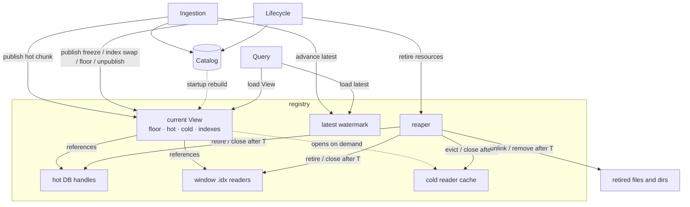
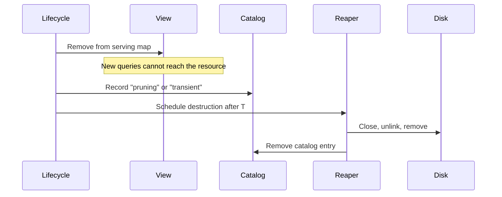

# Query Routing Design

## Overview

This document is the read-side counterpart to the [streaming workflow](./full-history-streaming-workflow.md). It describes how queries determine, for each chunk in their requested range, whether data is served from a hot database or sealed cold files. It also explains how that routing remains correct while ingestion and lifecycle workers concurrently add, replace, and remove stores.

Every query is admitted against a single immutable snapshot of the **serving map**, called a **View**. The serving map records which store serves each chunk and which transaction hash index serves each window. At admission, the query loads the current `latest` watermark and one current View. It then uses that admitted state for its entire lifetime.

A small in-memory **registry** owns the serving map. When a storage operation changes what is servable, such as freezing a chunk, replacing a transaction hash index, discarding a hot database, or advancing the retention floor, the registry creates a new View, applies the change, and atomically publishes it. Queries already in flight continue using the View they admitted with, while newly admitted queries observe the updated View.

Deletion safety is time-based rather than reader-tracked. Every request runs under a fixed deadline. Once a resource is removed from the current View, no newly admitted query can reach it. Any query that can still reach it must have admitted an older View and must finish before its deadline. The lifecycle therefore delays physical destruction until a grace period longer than the maximum request lifetime has elapsed.

The following terms are used throughout this document.

- **Chunk**: 10,000 consecutive ledgers, the unit of storage.
- **Window**: 1,000 chunks, or 10 million ledgers. Each window has one transaction hash `.idx` file.
- **Serving map**: The in-memory map from chunks and windows to the stores that serve them.
- **View**: An immutable snapshot of the serving map admitted by a query.
- **Hot / cold**: Hot data is served from live RocksDB databases. Cold data is served from sealed files written once during freezing.
- **Catalog**: The durable RocksDB record of each store and its lifecycle state.
- **Retention floor**: The oldest ledger served by a View. A request whose leading edge is below its admitted View's floor returns not found.
- **`latest`**: The newest fully ingested ledger visible to queries.

---

## The problem

Three kinds of workers access storage concurrently:

- **One ingestion worker** appends each new ledger to the live hot database as the network produces it. Approximately every five seconds it commits one atomic write batch. At each chunk boundary, it stops writing to the completed hot chunk and opens the next hot database.
- **One lifecycle worker** performs housekeeping. It freezes completed chunks into cold files, rebuilds the window's transaction hash index at each boundary, discards hot databases once cold files fully cover their data, and removes data that has fallen outside the retention window.
- **Many query workers**, one for each incoming JSON-RPC request.

Every query must observe a consistent serving map throughout its lifetime. It must not combine routing decisions from different storage states, and it must not be directed to a resource that can be destroyed before the request finishes. Without coordination, several races become possible.

|        | Problem | Example |
| ------ | ------- | ------- |
| **H1** | A query plans its reads while the serving map changes. | A range query resolves chunk X to its hot database just as the discard scan removes that database because cold files now cover it. |
| **H2** | A resource is destroyed while a read is in progress. | An index rebuild replaces a superseded `.idx`, and the sweep closes and unlinks it while a `getTransaction` request is still reading it. |
| **H3** | A query reads the newest ledger while it is still being ingested. | A `getLedgers` request at the tip must either return ledger *n* completely or not at all. It must never advertise a `latestLedger` that it cannot actually serve. |
| **H4** | The retention floor advances during a query. | A prune removes the oldest chunk in a range after the query has already been admitted. |

The storage design already establishes two read-path requirements:

- **R1. Only finished data is newly visible.** A newly published View must not introduce a chunk or index while it is in the catalog state `"freezing"`, `"pruning"`, or `"transient"`. In-flight queries may continue using resources from an older View until their request deadline expires.
- **R2. Data below the admitted retention floor is not found.** Even if data still exists on disk, a request whose leading edge is below the floor recorded in its admitted View returns not found.

These races occur while ingestion, freezing, index replacement, discard, and pruning all proceed concurrently. Throughout every transition, the entire active retention window must remain continuously servable, with no gaps between hot and cold storage. This is the read-side view of [INV-1](./full-history-streaming-workflow.md#invariants) from the streaming workflow.

---

## Design summary

The design uses four mechanisms:

1. Every query resolves against one immutable View of the serving map.
2. The registry publishes a new View whenever the serving map changes.
3. The reaper destroys retired resources only after they have been unreachable for a grace period longer than the maximum request lifetime.
4. The registry maintains the `latest` watermark so queries never observe partially ingested ledgers.

Together, these mechanisms let ingestion, lifecycle operations, and queries proceed concurrently without requiring readers to coordinate with writers. Queries perform two atomic loads during admission, then use ordinary immutable data for the rest of the request. They do not acquire locks or participate in reference counting.



---

## Registry and View

The catalog remains the durable record of every store and its lifecycle state. The registry is a disposable in-memory projection of the catalog. It owns the current View, the `latest` watermark, hot database handles, open transaction hash index readers, and the cold reader caches.

The registry is rebuilt from the catalog during startup before the server begins accepting requests.

```go
type Registry struct {
    mu      sync.Mutex
    current atomic.Pointer[View]
    latest  atomic.Uint32
    reaper  *Reaper
}

type View struct {
    floor   chunk.ID
    hot     map[chunk.ID]*HotStores
    cold    map[chunk.ID]ColdChunk
    indexes []IndexCoverage
}

type ColdChunk struct {
    Ledgers bool
    Events  bool
}

type IndexCoverage struct {
    Window WindowID
    Lo, Hi chunk.ID
    Idx    *txhash.ColdReader
}
```

Once published, a View never changes. Each View records:

- the retention floor used by queries admitted with that View,
- the hot stores,
- the cold artifacts available for each chunk, and
- the transaction hash indexes for each window.

A query loads one View when it is admitted and uses that same View for its entire lifetime. Later View updates affect only newly admitted queries.

### Design rationale

Each field exists for a specific reason.

- **`hot` stores shared handles.** Each hot chunk has one registry-owned `HotStores` handle used by ingestion and queries.
- **`cold` records availability rather than readers.** Cold artifacts are opened through the reader caches described in [Open-handle management](#open-handle-management).
- **`indexes` stores transaction hash readers.** Each in-retention window has one current `.idx` reader.
- **`latest` is stored outside the View.** The serving map changes only at chunk boundaries and lifecycle transitions, while `latest` advances every ledger. Keeping it separate avoids copying the View every few seconds.

### Admission

Every query performs two atomic loads during admission.

```go
latest := registry.latest.Load()
view := registry.current.Load()

floorLedger := view.floor.FirstLedger()
```

The order is important. The query reads `latest` before loading the View. A ledger less than or equal to the admitted `latest` is queryable only if it is not below the floor recorded in the subsequently loaded View. The write-side publication order guarantees that every ledger in that admitted range has a serving home in the loaded View.

Reversing the order would break that guarantee. A chunk boundary could occur between the two loads, allowing `latest` to point into a newly opened chunk that is not present in the older View. The response could then advertise a `latestLedger` that it cannot serve.

After admission, the query validates and clamps its requested range against `[floorLedger, latest]`. Requests whose leading edge falls below `floorLedger` return not found. Requests extending beyond `latest` are truncated.

No further synchronization is required. The View is immutable, so the query simply keeps its pointer for the lifetime of the request.

### Publishing View updates

Every change to the serving map follows the same pattern.

```go
func (r *Registry) publish(mutate func(*View) (removed []Resource)) {
    r.mu.Lock()

    next := r.current.Load().clone()
    removed := mutate(next)

    r.current.Store(next)

    r.mu.Unlock()

    r.reaper.Schedule(removed)
}
```

The registry serializes View updates with a mutex. Each update clones the current View, applies the requested changes, atomically publishes the new View, and schedules any removed resources with the reaper.

Additions are published only after the corresponding catalog state is durable and serving-ready. Removals are unpublished before physical destruction and, except for the transaction-index swap noted below, before catalog demotion. This keeps newly admitted Views aligned with durable catalog truth while ensuring readers never race a destructive lifecycle step.

View updates occur only when the serving map changes, such as chunk boundaries or lifecycle transitions. Even with full history, cloning the View copies only a few hundred kilobytes of pointers, which is negligible compared to the roughly fourteen-hour interval between chunk boundaries.

---

## Reaper

The reaper safely destroys resources after they have been removed from the serving map.

Its rule is:

> Anything that was reachable from a published View may be destroyed only after it has been unreachable for at least the grace period T.

A resource becomes **unreachable** when it has been removed from the current View and can no longer be returned by the reader caches. A resource is **destroyed** when it is permanently closed or removed, such as closing a RocksDB instance, closing a reader, unlinking files, or removing directories.

```go
type Reaper struct {
    graceT time.Duration // derived from the request timeout
    queue  []retired     // {destroy func(), notBefore time.Time}
}
```

### Why the rule is correct

The correctness argument depends on one assumption: every read handler executes under an enforced request deadline **D**.

The grace period is derived rather than configured independently:

```text
T = maximum request timeout + safety margin
```

Only the safety margin is configurable. Deriving **T** from the request timeout prevents configuration errors. Startup rejects any configuration that would produce **T ≤ D**.

Every query resolves against exactly one View, which it keeps for its entire lifetime. Once a resource has been removed from the current View, no newly admitted query can reach it. Any query that can still reach the resource must have admitted an older View and therefore completes within **D**.

Choosing **T > D** guarantees that every query which could reference the resource has completed before it is destroyed.

The same argument applies to the reader caches. Readers are opened only while serving a query whose View contains the corresponding chunk. Once the chunk has been removed from the serving map, no future query can reopen its readers. Waiting for the grace period guarantees that cached readers are no longer in use before they are closed.

The safety margin absorbs clock skew, cancellation latency, and handlers that check their context between batches of work. Since request deadlines are measured in seconds while lifecycle operations occur hours apart, a margin of several minutes has negligible operational cost.

A handler that ignores its deadline is a bug. The grace period makes that bug observable rather than allowing it to silently violate the synchronization model.

### Destruction

When the registry removes resources from the serving map, it schedules them with the reaper. The reaper delays physical destruction until the grace period has elapsed.

For ordinary removals, deletion follows this lifecycle:

1. Remove the resource from the serving map.
2. Record the catalog demotion, such as `"pruning"` or `"transient"`.
3. Wait for the grace period.
4. Close handles, unlink files, remove directories, and remove the catalog entry.

Only physical destruction is delayed. Catalog demotions still occur during the lifecycle run.



The transaction-index swap is the one exception to the demotion order. Its predecessor coverage is demoted in the same atomic catalog commit that freezes the new coverage. The registry then publishes the index swap synchronously in the same lifecycle goroutine. Readers do not consult catalog state after admission, so the short interval between catalog demotion and View unpublish is harmless. Physical destruction still waits out **T** after unpublish.

### Crash recovery

The reaper maintains no persistent state.

If the process exits before a scheduled deletion occurs, the catalog already records that deletion is pending. On startup, the lifecycle reconstructs the pending work from the catalog and continues where it left off.

Deletion is idempotent. A lifecycle run may rediscover a resource that is already waiting in the reaper's queue and schedule it again. Duplicate scheduling can only delay destruction. It cannot produce incorrect behavior.

### Cost

The only cost of this design is delayed deletion.

Retired hot databases, superseded indexes, and pruned chunk files remain on disk until the grace period expires. Since the grace period is measured in minutes while lifecycle operations occur roughly every fourteen hours, the additional disk usage is negligible.

---

## View update points

Every write-side transition that changes what is servable gets a registry hook. Additions are published after the catalog commit that makes the resource serving-ready. Removals are unpublished before destructive work, with the transaction-index swap exception described above.

This keeps newly admitted Views consistent with catalog truth while preserving the read-side invariant: at every publication, every chunk in `[floor, lastCompleteChunk]` has a cold flag or a hot handle for each data type, and the live chunk has its hot handle before its first ledger commits.

| Write-side transition | Registry hook | Ordering rule |
| --- | --- | --- |
| `openHotDBForChunk` flips `hot:chunk:{c}` to `"ready"` | Publish `hot[c] = stores` using the shared instance. | After the key write, before ingestion writes ledger 1 of the chunk. |
| Per-ledger ingest cycle: atomic `batch.Commit(sync)` plus in-memory applies | `latest.Store(seq)` | Final step of the cycle, after every serving structure contains the ledger. |
| `processChunk` flips artifact keys to `"frozen"` | Publish `cold[c].{kind} = true` for each frozen kind. | After the commit batch. This is a no-op before serving starts during startup backfill. |
| `buildTxhashIndex` commit batch: new coverage `"frozen"`, predecessor `"pruning"` | Publish index swap: replace the window's `IndexCoverage` entry; schedule the predecessor's reader with the reaper. | After the commit batch. The predecessor's unlink from `buildThenSweep` moves to the reaper. |
| `discardHotDBForChunk` | Remove `hot[c]` from the View and schedule the hot database with the reaper. | Unpublish before catalog demotion and every destructive step. |
| Retention prune | Publish the run's new floor, which also drops below-floor `cold`, `hot`, and `indexes` entries. | Gate, unpublish, demote, then destroy. The floor update removes below-floor resources before every demotion. |
| Startup `serveReads()` | Build the initial View from the catalog scan: `"ready"` hot keys, `"frozen"` chunk keys, frozen coverages, and the calculated floor. | Complete before accepting the first request. |

Four ordering notes matter:

- **`latest` advances last.** It moves only once every serving structure contains the ledger. The atomic batch commit is necessary but not sufficient: the hot events store also applies in-memory state after its commit, including the bitmap mirror and ledger offset array. A watermark stored before those applies would let a query see `latest = N` while the events index does not yet contain ledger N's entries, producing silent misses with no error surface. A hot serving structure may run ahead of `latest`, because admission clamps the query range, but it must never lag it. The existing `eventstore.HotStore.IngestLedgerEvents` already applies mirror and offsets synchronously before returning; the watermark hook joins the end of that chain after the ingest fan-out's per-ledger join.

- **Coverage-before-discard needs no new machinery.** The discard scan's eligibility check, `indexCovers`, reads the catalog. The index-swap hook is synchronous inside `buildTxhashIndex`'s commit step, and the discard scan runs later in the same lifecycle run on the same goroutine. Program order makes catalog-covered imply View-covered before any discard is evaluated. Across a crash, startup rebuilds the View from the catalog before serving.

- **Freeze publishes an addition, not a swap.** After `processChunk` freezes a chunk from its hot database, both tiers serve it with byte-identical data until discard retires the hot side. Resolution during the overlap picks one deterministically. Correctness does not depend on which tier wins.

- **The index swap is the only demotion-before-unpublish case.** The predecessor coverage's `"pruning"` demotion rides in the same atomic commit batch that freezes the new coverage. The swap publish follows synchronously in the same goroutine. The interval between demotion and unpublish is harmless because readers use their admitted View, not catalog state, and the predecessor's destruction still waits out **T** from unpublish.

Together, these hooks maintain the read-side coverage property: at every publication, every chunk in `[floor, lastCompleteChunk]` has a cold flag or a hot handle for each data type, and the live chunk has its hot handle before its first ledger commits. Freeze adds before discard removes; the index swap replaces within one publish; prune removes only below the floor it publishes first. The transient exception already tolerated by INV-1, surgical recovery's rewound floor, surfaces as `ErrUnavailable` on a still-healing range: a soft failure, never wrong data.

---

## Open-handle management

The registry manages three kinds of serving resources. Each uses a different lifetime policy based on its access pattern and resource cost.

| Resource | Policy |
| --- | --- |
| Hot databases | Always open |
| Window transaction indexes (`txhash.ColdReader`) | Always open |
| Per-chunk cold readers (`ledger.ColdReader`, `eventstore.ColdReader`) | Open on demand through per-kind LRU caches |

### Hot databases

Hot databases remain open from `openHotDBForChunk` until the reaper destroys them after discard.

Each hot chunk has a single shared RocksDB instance owned by the registry. Ingestion and queries use the same handle concurrently. RocksDB supports concurrent reads and writes on a single database instance.

### Transaction hash indexes

Each in-retention window keeps one `txhash.ColdReader` open.

These readers maintain only the state needed to service lookups efficiently. Keeping them open also simplifies index replacement because older Views continue using the superseded reader until the reaper closes it after the grace period.

### Cold readers

Cold readers are opened on demand.

Full history contains thousands of chunks and continues to grow. Keeping readers open for every cold artifact would consume substantial memory while providing little benefit for infrequently accessed data. Instead, the registry records only whether an artifact is available, and reader objects are managed through bounded per-kind LRU caches.

Ledger and event readers use separate caches because their resource costs differ significantly. Separate caches also prevent heavy event traffic from evicting ledger readers needed by other query paths.

### Interaction with the reaper

Reader caches follow the same lifetime rules as every other serving resource.

When a chunk is removed from the serving map, its cached readers are also retired. The reaper delays closing those readers until the grace period has elapsed, ensuring that no admitted query can still be using them.

Removing cached readers when a chunk is unpublished also guarantees deterministic cleanup. Otherwise, a lightly used reader could remain in the cache indefinitely and keep an unlinked file open until it was eventually evicted.

---

## Query routing

All query handlers follow the same routing model. They differ only in how they consume the resolved stores.

### Common routing

Every query follows the same sequence:

1. Admit the request by loading `latest` and the current View.
2. Validate and clamp the requested ledger range.
3. Resolve each chunk to its serving store.
4. Execute the query against the resolved stores.

The admission protocol is described in [Admission](#admission).

### Bounds

Every request validates its leading edge and clamps its trailing edge against the admitted range `[floorLedger, latest]`.

The leading edge determines where results begin. A request whose leading edge falls below the admitted retention floor returns not found.

The trailing edge determines where the scan ends. Requests extending beyond `latest` are truncated, and descending scans terminate at the retention floor.

### Chunk resolution

Routing resolves each chunk independently.

```go
func (v *View) resolve(c chunk.ID, k Kind) (Store, error) {
    if v.cold[c].has(k) {
        return coldReaders(c, k)
    }
    if hs, ok := v.hot[c]; ok {
        return hs.store(k)
    }
    return nil, ErrUnavailable
}
```

The resolution order is deterministic. When both hot and cold copies are available, routing selects the cold artifact.

If a chunk has no serving home, routing returns `ErrUnavailable`. This can occur during startup recovery when a required artifact has not yet reached a serving state.

### Chunk traversal

Each chunk belongs to exactly one serving store for a given query path. Multi-chunk requests therefore concatenate results rather than merge them.

Ascending requests visit chunks in ascending order. Descending requests reverse the traversal.

The following diagram illustrates the running example used throughout this section.

```text
          ◄──────────────────── retention window ────────────────────►
          floor                              last complete       live
chunks:   5100 ─────── fully cold ───── 6542 │      6543      │ 6544
                                             │ (both tiers)   │
ledgers   ─────────── {chunk}.pack ──────────┤ .pack ◄ wins   │ hot CF
events    ────── events/index packs ─────────┤ packs ◄ wins   │ hot CFs
tx-hash   ───────────── window .idx ─────────┤ hot CF until covered
```

### `getLedgers`

`getLedgers` streams ledgers in ascending ledger order. For each overlapping chunk, the router resolves the ledger store and streams the requested range. Results are concatenated until the requested limit is reached.

Example request:

- `startLedger = 65,439,500`
- `limit = 1,000`

The request spans chunks 6543 and 6544. Chunk 6543 resolves to the cold ledger store and returns the remaining ledgers in that chunk. Chunk 6544 resolves to the live hot store and returns the remaining ledgers. The response is the concatenation of both streams.

### `getTransactions`

`getTransactions` builds on `getLedgers`.

The router streams ledgers using the same traversal described above. Each ledger is decoded and its transactions are emitted in application order.

The cursor identifies a transaction within a ledger. The first ledger resumes after the cursor position, while subsequent ledgers begin with their first transaction.

### `getTransaction`

A transaction hash does not identify the chunk containing the transaction, so routing cannot resolve it directly.

Instead, the router probes the transaction indexes in two stages:

1. Probe the hot transaction indexes. A match is definitive.
2. Probe each window transaction index. A match identifies a candidate ledger, which is fetched and verified against the full transaction hash.

The router supplies `TxReader` with:

- the hot transaction indexes,
- the window transaction indexes, and
- a ledger source backed by `resolve(chunk, Ledgers)`.

This preserves the existing lookup semantics while allowing `TxReader` to operate across both hot and cold storage.

### `getEvents`

`getEvents` searches rather than fetches data.

Each page establishes a scan window, resolves the overlapping chunks, and invokes the existing event query engine for each reader.

The event query engine operates on the common `eventstore.Reader` interface, so routing is identical for hot and cold readers.

Pages terminate when either:

- the requested number of events has been returned, or
- the scan window has been exhausted.

The cursor records the query position, while `scannedLedger` records how far the search progressed.

Example: the following shows the first page of a descending query beginning at the current `latest` ledger.

```text
 page 1

 [65,433,211 .................................. 65,443,210]
                                           ◄── scan direction

 chunk 6544 (hot)
 chunk 6543 (cold)
```

The router resolves the live chunk first, followed by the cold chunk. Results are returned in descending ledger order until the page is full or the scan window has been exhausted.

---

## Changes to the streaming workflow

This proposal introduces a small number of changes to the streaming workflow. The overall storage lifecycle is unchanged.

### Hot database ownership

The streaming workflow assumes the ingestion worker owns the hot RocksDB instances.

This proposal transfers ownership to the registry. Each hot database is opened once, registered in the current View, and shared by both ingestion and queries until the reaper destroys it after discard.

This change allows queries to access hot databases without opening additional RocksDB instances.

### View updates

The registry publishes a new View at each storage transition that changes the serving map.

The update points are:

- opening a new hot database,
- publishing frozen chunk artifacts,
- replacing a transaction hash index,
- advancing the retention floor, and
- removing a hot database during discard.

These updates occur in the order described in [View update points](#view-update-points).

### `latest` watermark

The write path advances `latest` only after a ledger has become fully queryable.

Advancing the watermark is the final step of per-ledger ingestion. Queries admitted afterward may observe the new ledger.

### Deferred destruction

The streaming workflow destroys retired resources immediately after catalog demotion.

This proposal instead schedules those resources with the reaper. Physical destruction occurs after the grace period has elapsed.

The catalog protocol is unchanged except for the delayed physical destruction of retired resources.

---

## Open questions

- **Datastore fallback below the floor.** The v1 `getLedgers` handler can fall back to the remote object store for pre-retention ledgers. v2 must either preserve that behavior as an explicit exception to R2 or remove it at cutover. This decision belongs to #772.
- **`getTransaction` probe parallelism.** The proposal uses sequential newest-first probing. If window count or tail latency becomes a problem, parallel probing can be added inside the lookup path without changing the routing model.
- **Cache sizing.** Ledger and event reader cache capacities are implementation-time tuning parameters.

---

## Alternatives considered

### Explicit reader tracking

Track active readers directly, either by reference-counting Views/resources or by holding a reader lock while a query runs.

This was not chosen because it adds work to every query: each request must acquire and release some reader state. This proposal avoids that by using the request deadline as the bound on reader lifetime. Queries only load `latest` and the current View at admission.

### Filesystem unlink semantics alone

Rely on the filesystem to keep already-open files readable after they are unlinked.

This was not chosen because it only applies to already-open cold files. It does not protect RocksDB handles, cache misses that open a file after unlink, or other resource types that must be closed explicitly. This proposal uses the grace period uniformly for hot databases, cold readers, and index readers.

---

## Related documents

- [full-history-streaming-workflow.md](./full-history-streaming-workflow.md): the write side this design reads from: geometry, the catalog and one write protocol, the lifecycle run, the reader contract, and INV-1 through INV-4.
- [gettransaction-full-history-design.md](./gettransaction-full-history-design.md): the tx-hash tiers, `.idx` coverage semantics, and the cold-lookup verify chain that `getTransaction` routing drives.
- [getevents-full-history-design.md](./getevents-full-history-design.md): the per-chunk events engines and their measured latencies.
- [getEvents v2 API proposal](https://github.com/orgs/stellar/discussions/1872): the request modes, ordering, and cursor model the `getEvents` walkthrough routes for.
- [packfile-library.md](./packfile-library.md): open cost, offset-index memory, and concurrent-read guarantees that the reader caches and range scans rely on.
- PR #794, `TxReader`: the by-hash fan-out over `HashIndex` sets that this design supplies with stores.
- Issue #770: the design ask this document answers; #765: the ingestion counterpart.

