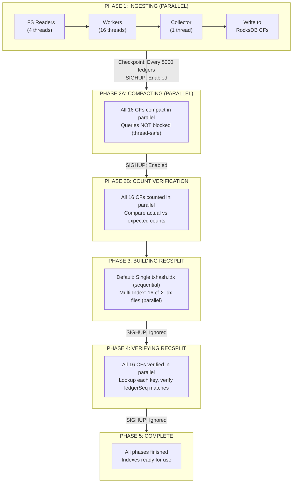
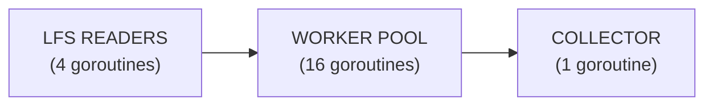

# txhash-ingestion-workflow

A unified tool that performs the complete txHash ingestion pipeline for Stellar ledger data:

```
LFS (Ledger Store) → RocksDB (16 Column Families) → Compact → RecSplit Index → Verify
```

This tool ingests transaction hashes from Stellar ledgers stored in LFS format, builds a RocksDB database partitioned by the first hex character of each txHash, compacts the database, builds RecSplit minimal perfect hash indexes for fast lookups, and verifies the indexes against the source data.

## Features

- **Full Pipeline**: Ingestion, compaction, RecSplit indexing, and verification in one tool
- **Crash Recovery**: Checkpoints progress every 5000 ledgers (parallel mode) or 1000 ledgers (sequential mode); automatically resumes from last checkpoint
- **16-way Partitioning**: Distributes txHashes across 16 column families by first hex character (0-f)
- **RecSplit Index Modes**: 
  - **Default (Single Index)**: Builds one combined `txhash.idx` file from all 16 CFs
  - **Multi-Index** (`--multi-index-enabled`): Builds 16 separate `cf-X.idx` files in parallel
- **Live Query Support**: Send SIGHUP during ingestion/compaction to benchmark lookups
- **Comprehensive Metrics**: Latency percentiles (p50/p90/p95/p99), throughput, memory usage
- **Dual Logging**: Separate log and error files with timestamps

## Prerequisites

### System Requirements

- **Go**: 1.21 or later
- **RocksDB**: 8.0 or later (with development headers)
- **Memory**: Minimum 16 GB recommended (8 GB MemTables + 8 GB block cache)
- **Disk**: SSD strongly recommended; space depends on ledger range

### macOS Installation

```bash
# Install RocksDB via Homebrew
brew install rocksdb

# Set CGO flags (add to ~/.zshrc or ~/.bashrc)
export CGO_CFLAGS="-I$(brew --prefix rocksdb)/include"
export CGO_LDFLAGS="-L$(brew --prefix rocksdb)/lib -lrocksdb -lstdc++ -lm -lz -lsnappy -llz4 -lzstd"
```

### Linux Installation

```bash
# Ubuntu/Debian
sudo apt-get install librocksdb-dev

# Or build from source for optimal performance
git clone https://github.com/facebook/rocksdb.git
cd rocksdb
make shared_lib
sudo make install-shared
```

## Building

```bash
cd txhash-ingestion-workflow
go build -o txhash-ingestion-workflow .
```

## Usage

### Command Line Flags

| Flag | Required | Default | Description |
|------|----------|---------|-------------|
| `--lfs-store` | Yes | - | Path to LFS ledger store directory |
| `--start-ledger` | Yes | - | First ledger sequence to ingest |
| `--end-ledger` | Yes | - | Last ledger sequence to ingest |
| `--output-dir` | Yes | - | Base directory for all output |
| `--log-file` | Yes | - | Path to main log file |
| `--error-file` | Yes | - | Path to error log file |
| `--query-file` | Yes | - | Path to query input file (txHashes, one per line) |
| `--query-output` | Yes | - | Path to query results CSV |
| `--query-log` | Yes | - | Path to query statistics log |
| `--query-error` | Yes | - | Path to query error log |
| `--multi-index-enabled` | No | false | Build 16 separate cf-X.idx files instead of single txhash.idx |
| `--block-cache-mb` | No | 8192 | RocksDB block cache size in MB |
| `--dry-run` | No | false | Validate configuration and exit |

### Basic Example

```bash
./txhash-ingestion-workflow \
  --lfs-store /data/stellar-lfs \
  --start-ledger 10000001 \
  --end-ledger 20000000 \
  --output-dir /data/txhash-index \
  --log-file /var/log/txhash/ingestion.log \
  --error-file /var/log/txhash/ingestion.err \
  --query-file /tmp/queries.txt \
  --query-output /tmp/query-results.csv \
  --query-log /var/log/txhash/query.log \
  --query-error /var/log/txhash/query.err
```

### With Multi-Index Mode (16 Separate Index Files)

```bash
./txhash-ingestion-workflow \
  --lfs-store /data/stellar-lfs \
  --start-ledger 1 \
  --end-ledger 50000000 \
  --output-dir /data/txhash-index \
  --log-file /var/log/txhash/ingestion.log \
  --error-file /var/log/txhash/ingestion.err \
  --query-file /tmp/queries.txt \
  --query-output /tmp/query-results.csv \
  --query-log /var/log/txhash/query.log \
  --query-error /var/log/txhash/query.err \
  --multi-index-enabled \
  --block-cache-mb 16384
```

### Dry Run (Validate Configuration)

```bash
./txhash-ingestion-workflow \
  --lfs-store /data/stellar-lfs \
  --start-ledger 10000001 \
  --end-ledger 20000000 \
  --output-dir /data/txhash-index \
  --log-file /var/log/txhash/ingestion.log \
  --error-file /var/log/txhash/ingestion.err \
  --query-file /tmp/queries.txt \
  --query-output /tmp/query-results.csv \
  --query-log /var/log/txhash/query.log \
  --query-error /var/log/txhash/query.err \
  --dry-run
```

## Output Directory Structure

```
<output-dir>/
└── txHash-ledgerSeq/
    ├── rocksdb/                    # RocksDB store with 16 column families
    │   ├── 000001.sst              # SST files
    │   ├── CURRENT
    │   ├── MANIFEST-*
    │   └── ...
    ├── recsplit/
    │   ├── index/                  # RecSplit index files
    │   │   ├── txhash.idx          # Single combined index (default mode)
    │   │   # OR (with --multi-index-enabled):
    │   │   ├── cf-0.idx
    │   │   ├── cf-1.idx
    │   │   ├── ...
    │   │   └── cf-f.idx
    │   └── tmp/                    # Temporary files (deleted after build)
    └── meta/                       # Checkpoint metadata store
```

## Pipeline Phases

The workflow progresses through 5 logical phases (4 operational + completion):



<details>
<summary>ASCII Diagram (for terminals)</summary>

```
┌─────────────────────────────────────────────────────────────────────────────────┐
│                           WORKFLOW PIPELINE DIAGRAM                              │
├─────────────────────────────────────────────────────────────────────────────────┤
│  PHASE 1: INGESTING (PARALLEL)                                                  │
│  LFS Readers (4) → Workers (16) → Collector (1) → RocksDB CFs                   │
│  Checkpoint: Every 5000 ledgers | SIGHUP: Enabled                               │
├─────────────────────────────────────────────────────────────────────────────────┤
│  PHASE 2A: COMPACTING (16 CFs in parallel) | SIGHUP: Enabled                    │
├─────────────────────────────────────────────────────────────────────────────────┤
│  PHASE 2B: COUNT VERIFICATION (16 CFs in parallel)                              │
├─────────────────────────────────────────────────────────────────────────────────┤
│  PHASE 3: BUILDING RECSPLIT | SIGHUP: Ignored                                   │
│  Default: Single txhash.idx | Multi-Index: 16 cf-X.idx files                    │
├─────────────────────────────────────────────────────────────────────────────────┤
│  PHASE 4: VERIFYING RECSPLIT (16 CFs in parallel) | SIGHUP: Ignored             │
├─────────────────────────────────────────────────────────────────────────────────┤
│  PHASE 5: COMPLETE - Indexes ready for use                                      │
└─────────────────────────────────────────────────────────────────────────────────┘
```

</details>

### Phase Summary Table

| Phase | State Name | Description | Parallel | Checkpoint | SIGHUP |
|-------|------------|-------------|----------|------------|--------|
| 1 | `INGESTING` | Read LFS ledgers, extract txHashes, write to 16 RocksDB CFs | Yes (16 workers + 4 readers) | Every 5000 ledgers | Enabled |
| 2A | `COMPACTING` | Run full compaction on all 16 CFs | Yes (16 goroutines) | None (idempotent) | Enabled |
| 2B | (sub-phase) | Count verification after compaction | Yes (16 goroutines) | None | N/A |
| 3 | `BUILDING_RECSPLIT` | Build RecSplit perfect hash indexes | Default: single index; `--multi-index-enabled`: 16 parallel | None | Ignored |
| 4 | `VERIFYING_RECSPLIT` | Verify RecSplit indexes against RocksDB | Yes (16 goroutines) | None (idempotent) | Ignored |
| 5 | `COMPLETE` | All phases finished successfully | N/A | Final state | N/A |

---

## Phase Details with Implementation Specifics

### Phase 1: Ingestion

**Input**: LFS ledger store (ledgers in chunk format)  
**Output**: RocksDB with 16 column families (0-f), each containing txHash→ledgerSeq mappings

#### Parallel Pipeline Architecture

Ingestion uses a 3-stage parallel pipeline:



| Stage | Goroutines | Responsibility |
|-------|------------|----------------|
| **LFS Readers** | 4 | Read raw compressed ledger data from LFS |
| **Workers** | 16 | Decompress, unmarshal XDR, extract txHashes |
| **Collector** | 1 | Accumulate entries by CF, track completion |

#### Key Configuration Constants

| Constant | Value | Description |
|----------|-------|-------------|
| `DefaultParallelBatchSize` | 5000 ledgers | Checkpoint frequency |
| `DefaultParallelWorkers` | 16 | Number of worker goroutines |
| `DefaultParallelReaders` | 4 | Number of LFS reader goroutines |
| Work channel buffer | 200 items | ~30 MB memory |
| Entry channel buffer | 100 items | ~2 MB memory |

#### RocksDB Write Optimizations

During ingestion, RocksDB is configured for **write-optimized** performance:

```go
opts.SetDisableAutoCompactions(true)  // No compaction during ingestion
writeOpts.SetSync(false)              // Async writes (WAL handles durability)
opts.SetMinWriteBufferNumberToMerge(1) // Flush MemTables immediately when full
```

#### Checkpoint Mechanism

Every 5000 ledgers (configurable), the system performs an **atomic checkpoint**:

1. Write batch to RocksDB (all 16 CFs)
2. Update in-memory `cfCounts` (per-CF entry counts)
3. Atomically checkpoint to meta store using WriteBatch:
   - `last_committed_ledger`
   - `cf_counts` map

**Key insight**: Counts are checkpointed WITH progress, not computed from RocksDB. On resume, counts are restored from checkpoint, ensuring accuracy even with re-ingested duplicates.

#### Crash Recovery

On restart during ingestion:
1. Load `last_committed_ledger` and `cf_counts` from meta store
2. Resume from `last_committed_ledger + 1`
3. Up to 4999 ledgers may be re-ingested (duplicates handled by compaction)
4. Re-ingested data creates duplicates in RocksDB (same key → same value)
5. Compaction phase deduplicates them

---

### Phase 2A: Compaction

**Input**: RocksDB with potentially duplicate entries  
**Output**: Compacted RocksDB with unique entries only

#### Parallel Compaction Implementation

All 16 column families are compacted **simultaneously** using goroutines:

```go
var wg sync.WaitGroup
for i, cfName := range cf.Names {
    wg.Add(1)
    go func(idx int, name string) {
        defer wg.Done()
        
        // Allow concurrent manual compactions
        opts := grocksdb.NewCompactRangeOptions()
        opts.SetExclusiveManualCompaction(false)
        
        s.db.CompactRangeCFOpt(cfHandles[idx], grocksdb.Range{}, opts)
    }(i, cfName)
}
wg.Wait()
```

#### How Queries Continue During Compaction

**Critical design decision**: Compaction does NOT block queries.

```go
func (s *RocksDBTxHashStore) CompactCF(cfName string) time.Duration {
    // Only hold read lock briefly to get CF handle (~microseconds)
    s.mu.RLock()
    cfHandle := s.getCFHandleByName(cfName)
    s.mu.RUnlock()

    // Compaction runs WITHOUT any lock - RocksDB is thread-safe
    opts := grocksdb.NewCompactRangeOptions()
    opts.SetExclusiveManualCompaction(false)
    s.db.CompactRangeCFOpt(cfHandle, grocksdb.Range{}, opts)
}
```

**Why this works**:
1. RocksDB is internally thread-safe
2. `SetExclusiveManualCompaction(false)` allows concurrent manual compactions
3. The mutex is only held for CF handle lookup (~1 microsecond)
4. SIGHUP queries use `RLock` and work concurrently

#### Performance Improvement

| Mode | Time for 16 CFs |
|------|-----------------|
| Sequential (old) | ~50-60 minutes |
| Parallel (new) | ~4-5 minutes |

---

### Phase 2B: Count Verification

**Input**: Compacted RocksDB + `cfCounts` from meta store  
**Output**: Verification report (pass/fail per CF)

#### Parallel Verification Implementation

All 16 CFs are verified **in parallel**:

```go
var wg sync.WaitGroup
for i, cfName := range cf.Names {
    wg.Add(1)
    go func(idx int, name string) {
        defer wg.Done()
        
        // Use scan-optimized iterator
        iter := s.NewScanIteratorCF(name)
        for iter.SeekToFirst(); iter.Valid(); iter.Next() {
            actualCount++
        }
        
        // Compare with expected
        match := expectedCounts[name] == actualCount
    }(i, cfName)
}
wg.Wait()
```

#### Scan-Optimized Iterator

Count verification uses a **scan-optimized iterator** for better performance:

```go
scanOpts := grocksdb.NewDefaultReadOptions()
scanOpts.SetReadaheadSize(2 * 1024 * 1024)  // 2MB readahead prefetch
scanOpts.SetFillCache(false)                 // Don't pollute block cache
```

| Optimization | Benefit |
|--------------|---------|
| 2MB readahead | Prefetches sequential data, reduces I/O latency |
| `SetFillCache(false)` | Prevents scan data from evicting hot data from block cache |

#### Performance Improvement

| Mode | Time for 16 CFs (~3.5B entries) |
|------|--------------------------------|
| Sequential | ~70 minutes |
| Parallel | ~4-5 minutes |
| Parallel + scan iterator | ~1-2 minutes |

---

### Phase 3: RecSplit Building

**Input**: Compacted RocksDB with verified counts  
**Output**: RecSplit index file(s)
  - Default mode: Single `txhash.idx` file (all CFs combined)
  - Multi-index mode: 16 separate `cf-0.idx` through `cf-f.idx` files

#### Single-Index vs Multi-Index Mode

| Mode | Flag | Output | Memory Required | Build Time |
|------|------|--------|-----------------|------------|
| Single Index | (default) | `txhash.idx` | ~9 GB | ~2-3 hours |
| Multi-Index | `--multi-index-enabled` | 16 `cf-X.idx` files | ~144 GB (16 × 9 GB) | ~15-20 minutes |

**Single-Index Mode (Default)**:
- Builds one combined index from all 16 CFs sequentially
- Each CF is processed one at a time, adding keys to the same RecSplit builder
- Lower memory requirement (~9 GB peak)
- Verification uses a shared reader across 16 parallel goroutines

**Multi-Index Mode** (`--multi-index-enabled`):
- Builds 16 separate indexes in parallel
- Each CF gets its own `cf-X.idx` file
- Higher memory requirement (~144 GB)
- Faster build time due to parallelism

#### Multi-Index Parallel Implementation

With `--multi-index-enabled`, all 16 CFs are built simultaneously:

```go
var wg sync.WaitGroup
for i, cfName := range cf.Names {
    wg.Add(1)
    go func(idx int, cfn string) {
        defer wg.Done()
        stats, err := b.buildCFIndex(cfn, keyCount)
        // Store result at index for ordered output
        results[idx] = stats
    }(i, cfName)
}
wg.Wait()
```

#### RecSplit Parameters

| Parameter | Value | Description |
|-----------|-------|-------------|
| Bucket size | 2000 | Keys per bucket during construction |
| Leaf size | 8 | Minimum keys for leaf node |
| Data version | 1 | Index file format version |

#### Build Process Per CF

1. Create temp directory for CF
2. Create RecSplit builder with **exact** key count from meta store
3. Iterate RocksDB CF using **scan-optimized iterator** (2MB readahead, no cache fill)
4. Add each key with its ledgerSeq value to RecSplit
5. **Verify**: `keysAdded == expectedCount` (definitive check - build fails if mismatch)
6. Finalize perfect hash function
7. Write index file
8. Clean up temp directory

#### Crash Recovery

On restart during RecSplit building:
1. Delete ALL partial index files and temp directories
2. Rebuild all 16 indexes from scratch
3. RecSplit construction is not resumable mid-CF

---

### Phase 4: RecSplit Verification

**Input**: RocksDB + RecSplit index(es)  
**Output**: Verification report (pass/fail counts)

#### Verification Modes

Verification automatically adapts to the index mode used during build:

| Index Mode | Verification Behavior |
|------------|----------------------|
| Single Index | Opens `txhash.idx` once, shares reader across 16 parallel goroutines |
| Multi-Index | Each goroutine opens its own `cf-X.idx` file |

Both modes verify all 16 CFs in parallel using 16 goroutines.

#### Parallel Verification Implementation (Multi-Index Mode)

With multi-index mode, each goroutine opens its own index:

```go
var wg sync.WaitGroup
for i, cfName := range cf.Names {
    wg.Add(1)
    go func(idx int, name string) {
        defer wg.Done()
        
        // Open RecSplit index for this CF
        idx, _ := recsplit.OpenIndex(indexPath)
        reader := recsplit.NewIndexReader(idx)
        
        // Use scan-optimized iterator for RocksDB
        iter := store.NewScanIteratorCF(name)
        
        for iter.SeekToFirst(); iter.Valid(); iter.Next() {
            key := iter.Key()
            expectedLedgerSeq := types.ParseLedgerSeq(iter.Value())
            
            // Lookup in RecSplit
            offset, found := reader.Lookup(key)
            
            if !found || uint32(offset) != expectedLedgerSeq {
                failures++
            }
            keysVerified++
        }
    }(i, cfName)
}
wg.Wait()
```

#### Single-Index Verification

With single-index mode, the index is opened once and the reader is shared (RecSplit readers are thread-safe):

```go
// Open combined index once
idx, _ := recsplit.OpenIndex("txhash.idx")
reader := recsplit.NewIndexReader(idx)  // Thread-safe

var wg sync.WaitGroup
for i, cfName := range cf.Names {
    wg.Add(1)
    go func(idx int, name string) {
        defer wg.Done()
        // Use shared reader for lookups
        // Each goroutine iterates its own CF in RocksDB
    }(i, cfName)
}
wg.Wait()
```

#### Verification Process

For each key in RocksDB:
1. Look up in RecSplit index
2. Verify key is found
3. Verify returned ledgerSeq matches RocksDB value
4. Log any failures to error file

#### Crash Recovery

Verification is **idempotent** (read-only). On crash:
1. Simply re-run verification for all 16 CFs
2. No per-CF checkpointing needed
3. Takes ~2-3 minutes with parallel execution

#### Performance

| Mode | Time for 16 CFs (~3.5B entries) |
|------|--------------------------------|
| Sequential (old) | ~70 minutes |
| Parallel (new) | ~4-5 minutes |

---

### Performance Summary

All phases leverage parallelism for maximum performance:

| Phase | Parallelism | Before Optimization | After Optimization |
|-------|-------------|---------------------|-------------------|
| **Ingestion** | 4 readers + 16 workers | N/A | ~2-3 hours for 56M ledgers |
| **Compaction** | 16 goroutines | ~50-60 min | ~4-5 min |
| **Count Verification** | 16 goroutines + scan iterator | ~70 min | ~1-2 min |
| **RecSplit Build** | Optional 16 goroutines + scan iterator | ~2-3 hours | ~15-20 min (parallel) |
| **RecSplit Verify** | 16 goroutines + scan iterator | ~70 min | ~4-5 min |

**Total pipeline time (with parallel RecSplit)**: ~3-4 hours for 56M ledgers / 3.5B txHashes

### Scan-Optimized Iterator Usage

All full-scan operations use `NewScanIteratorCF()` with optimized read options:

```go
scanOpts.SetReadaheadSize(2 * 1024 * 1024)  // 2MB readahead prefetch
scanOpts.SetFillCache(false)                 // Don't pollute block cache
```

| Operation | File | Why Scan Iterator |
|-----------|------|-------------------|
| Count Verification | `pkg/compact/compact.go` | Iterates all entries to count |
| RecSplit Building | `pkg/recsplit/recsplit.go` | Iterates all entries to add keys |
| RecSplit Verification | `pkg/verify/verify.go` | Iterates all entries to verify |

Point lookups (e.g., SIGHUP queries) use the standard `NewIteratorCF()` which fills the block cache for repeated access.

### Final Summary Output

At workflow completion, a comprehensive summary is logged:

```
                    WORKFLOW COMPLETE
================================================================================

OVERALL STATISTICS:
  Start Time:        2024-01-15 10:00:00
  End Time:          2024-01-15 14:30:00
  Total Duration:    4h30m0s

PHASE DURATIONS:
  Ingestion:         2h15m30s
  Compaction:        45m20s
  Count Verify:      5m15s
  RecSplit Build:    1h10m45s
  Verification:      14m10s

DATA STATISTICS:
  Keys Ingested:     50,000,000
  Keys Verified:     50,000,000
  Verify Failures:   0

MEMORY PEAK:
  RSS:               14.2 GB

OUTPUT LOCATIONS:
  RocksDB:           /data/txhash-index/txHash-ledgerSeq/rocksdb
  RecSplit Indexes:  /data/txhash-index/txHash-ledgerSeq/recsplit/index
  Meta Store:        /data/txhash-index/txHash-ledgerSeq/meta
```

### Post-Compaction Count Verification

After compaction completes, the tool performs a **count verification step** that:

1. Iterates through each of the 16 column families in RocksDB
2. Counts the actual number of entries per CF
3. Compares against the expected counts from meta store (cfCounts)
4. Logs any mismatches as errors

This verification catches count mismatches early, before the RecSplit build phase which would fail if counts don't match. Example output:

```
                POST-COMPACTION COUNT VERIFICATION

Verifying RocksDB entry counts match checkpointed counts...

Expected total entries: 50,000,000

CF          Expected          Actual    Match         Time
----  ---------------  ---------------  --------  ------------
0           3,125,000        3,125,000       OK         2.3s
1           3,124,500        3,124,500       OK         2.1s
...
f           3,125,200        3,125,200       OK         2.4s
----  ---------------  ---------------  --------  ------------
TOT        50,000,000       50,000,000       OK        38.2s

Count verification PASSED: All 16 CFs match expected counts
```

If mismatches are found, the tool logs detailed error information but continues to the RecSplit build phase (which will definitively fail if counts don't match).

## Crash Recovery

The tool implements robust crash recovery with **accurate txHash counts** even when portions of data are re-ingested after a crash.

### Overview

The key insight is that **counts are checkpointed atomically with ledger progress**, and on resume, **counts are restored from the checkpoint** (not recomputed from RocksDB). This guarantees accuracy regardless of how many times a ledger is re-ingested.

### Checkpoint Mechanism

1. **Checkpoint Frequency**: Every 5000 ledgers during ingestion (parallel mode) or 1000 ledgers (sequential mode)
2. **Atomic Checkpoint**: RocksDB batch write completes, THEN meta store update
3. **Meta Store Contents**:
   - `phase`: Current pipeline phase (INGESTING, COMPACTING, etc.)
   - `last_committed_ledger`: Last fully committed ledger sequence
   - `cf_counts`: Per-column-family entry counts (updated with each checkpoint)
   - `verify_cf`: Last verified column family (for verification resume)

### Crash Scenarios and Recovery

#### Scenario 1: Crash During Ingestion (Mid-Batch)

```
Timeline:
  Ledgers 1-5000 committed (checkpoint at 5000)
  Ledgers 5001-5500 written to RocksDB
  CRASH at ledger 5500
  
Recovery:
  Meta store shows: last_committed_ledger = 5000
  Resume from: ledger 5001
  Re-ingest: ledgers 5001-5500 (already in RocksDB, will be duplicates)
```

**What happens to duplicates?**

RocksDB handles duplicate keys by keeping the **latest value** for each key. Since txHash→ledgerSeq is a deterministic mapping (same txHash always maps to same ledgerSeq), re-ingesting produces identical key-value pairs. During compaction, RocksDB merges these duplicates into a single entry.

```
Before compaction (LSM tree):
  Level 0: txHash_A → 5001 (from first write)
  Level 0: txHash_A → 5001 (from re-ingestion)  <- duplicate
  
After compaction:
  Level 1: txHash_A → 5001  <- single entry
```

#### Scenario 2: Crash After Batch Write, Before Checkpoint

```
Timeline:
  Ledgers 5001-6000 written to RocksDB (batch complete)
  CRASH before meta store checkpoint
  
Recovery:
  Meta store shows: last_committed_ledger = 5000
  Resume from: ledger 5001
  Re-ingest: entire batch 5001-6000
```

Same outcome: duplicates are created in RocksDB, compaction deduplicates them.

#### Scenario 3: Crash During Compaction

```
Timeline:
  Ingestion complete, phase = COMPACTING
  Compacting CF 0-7 complete
  CRASH during CF 8 compaction
  
Recovery:
  Meta store shows: phase = COMPACTING
  Restart compaction from CF 0 (full compaction is idempotent)
```

Compaction is idempotent - running it multiple times produces the same result.

#### Scenario 4: Crash During RecSplit Build

```
Timeline:
  Compaction complete, phase = BUILDING_RECSPLIT
  RecSplit for CF 0-5 complete
  CRASH during CF 6
  
Recovery:
  Meta store shows: phase = BUILDING_RECSPLIT
  Rebuild all RecSplit indexes from scratch
  (Partial index files are deleted on startup)
```

RecSplit build reads from compacted RocksDB and produces deterministic indexes.

### Why Counts Are Always Accurate

Counts remain accurate through crashes because of **atomic checkpointing** and **count restoration on resume**.

#### The Mechanism

```
Batch Processing (every 5000 ledgers in parallel mode, 1000 in sequential):
  1. Accumulate txHashes for ledgers N to N+4999 (or N+999 in sequential mode)
  2. Write batch to RocksDB
  3. Update in-memory cfCounts: cfCounts[cf] += batchCounts[cf]
  4. Checkpoint to meta store: (last_committed_ledger=N+4999, cfCounts) <- ATOMIC
  
On Resume After Crash:
  1. Load cfCounts from meta store       <- Restored to last checkpoint
  2. Load last_committed_ledger          <- e.g., 5000
  3. Resume ingestion from ledger 5001
  4. Any ledgers 5001+ that were already in RocksDB become duplicates
  5. BUT cfCounts starts from checkpoint value, not zero
  6. New batches ADD to the restored counts
```

#### Why This Works

The counts in meta store represent entries from ledgers `[start_ledger, last_committed_ledger]` only. When we resume:

1. **RocksDB may contain extra data** (from uncommitted batches before crash)
2. **But cfCounts does NOT include those extras** (restored from checkpoint)
3. **Re-ingestion writes duplicates to RocksDB** (same key-value pairs)
4. **cfCounts only increments for NEW batches** (ledgers after checkpoint)

After compaction, RocksDB deduplicates the data, and the final count in RocksDB matches cfCounts exactly.

#### Two-Stage Count Verification

The tool verifies counts at two points:

**1. After Compaction (Early Detection)**

Immediately after compaction, we iterate through each CF and verify counts match meta store:

```
POST-COMPACTION COUNT VERIFICATION
CF          Expected          Actual    Match
0           3,125,000        3,125,000       OK
...
Count verification PASSED: All 16 CFs match expected counts
```

This catches mismatches early but does NOT abort (RecSplit is the definitive check).

**2. During RecSplit Build (Definitive Check)**

While building each RecSplit index, we verify the iterated count matches expected:

```go
// recsplit.go:416-420
if uint64(keysAdded) != keyCount {
    return nil, fmt.Errorf("key count mismatch: expected %d, got %d", keyCount, keysAdded)
}
```

This is the definitive check - if counts don't match, RecSplit build fails (cannot build index with wrong key count).

### Detailed Example

```
Initial run:
  Ingest ledgers 1-5000 (25,000 txHashes)
  Checkpoint: last_committed=5000, cfCounts={total: 25,000}
  
  Ingest ledgers 5001-5500 (2,500 txHashes)
  Update in-memory cfCounts to 27,500
  Write batch to RocksDB (succeeds)
  CRASH before checkpoint
  
  State after crash:
    RocksDB: 27,500 txHashes (5001-5500 persisted but not checkpointed)
    Meta store: last_committed=5000, cfCounts={total: 25,000}

Recovery run:
  Load from meta store:
    last_committed_ledger = 5000
    cfCounts = {total: 25,000}           <- NOT 27,500!
  
  Resume from ledger 5001
  
  Re-ingest ledgers 5001-5500 (2,500 txHashes)
    -> Written to RocksDB again (duplicates of existing data)
    -> cfCounts updated: 25,000 + 2,500 = 27,500
  Checkpoint: last_committed=5500, cfCounts={total: 27,500}
  
  Continue ingesting ledgers 5501-10000 (22,500 txHashes)
  Final cfCounts = 50,000
  
  After compaction:
    - RocksDB deduplicates the 5001-5500 entries
    - Final RocksDB count: 50,000 unique txHashes
    - cfCounts from meta store: 50,000
    - MATCH!

During RecSplit build:
  Iterate each CF, count entries
  Verify: iterated count == cfCounts from meta store
  Build index with exact count
```

### Why Duplicates Don't Corrupt Counts

The key insight is that **cfCounts tracks what we've CHECKPOINTED, not what's in RocksDB**.

| State | RocksDB | cfCounts (meta) | Notes |
|-------|---------|-----------------|-------|
| After batch 1-5000 committed | 25,000 | 25,000 | In sync |
| After 5001-5500 written, before checkpoint | 27,500 | 25,000 | RocksDB ahead |
| CRASH | 27,500 | 25,000 | Meta store is authoritative |
| Resume, reload cfCounts | 27,500 | 25,000 | Start from checkpoint |
| Re-ingest 5001-5500 | 30,000 (dups) | 27,500 | RocksDB has duplicates |
| After compaction | 27,500 | 27,500 | Duplicates removed, in sync |

The duplicates in RocksDB are harmless because:
1. Same key → same value (deterministic mapping)
2. Compaction merges duplicates into one entry
3. cfCounts was never incremented for the duplicate batch (restored from checkpoint)

### Meta Store Persistence

The meta store uses RocksDB with WAL (Write-Ahead Log) enabled:

```go
// Checkpoint is atomic: if it completes, all data is persisted
// If crash occurs mid-checkpoint, RocksDB WAL ensures consistency
metaStore.SetLastCommittedLedger(batchEndLedger)  // Persisted atomically
```

### Summary

| Scenario | Duplicate Data? | Count Impact | Resolution |
|----------|-----------------|--------------|------------|
| Crash mid-batch | Yes (partial batch) | None | Compaction deduplicates |
| Crash after batch, before checkpoint | Yes (full batch) | None | Compaction deduplicates |
| Crash during compaction | No | None | Compaction is idempotent |
| Crash during RecSplit | No | None | Rebuild from compacted data |
| Crash during verification | No | None | Restart verification |

**Key invariant**: The authoritative txHash count comes from iterating compacted RocksDB, never from ingestion-time counters. This makes the system resilient to any crash scenario.

## Live Query Support (SIGHUP)

During `INGESTING` and `COMPACTING` phases, you can benchmark lookups by sending SIGHUP:

### Query File Format

Create a file with one txHash per line (64-character hex strings):

```
a1b2c3d4e5f6...  (64 chars)
b2c3d4e5f6a1...  (64 chars)
...
```

### Triggering Queries

```bash
# Find the process ID
pgrep -f txhash-ingestion-workflow

# Send SIGHUP
kill -HUP <pid>
```

### Query Output Format

The `--query-output` file is a CSV with columns:

```
txHash,ledgerSeq,queryTimeUs
a1b2c3d4e5f6...,12345678,45
b2c3d4e5f6a1...,12345679,38
c3d4e5f6a1b2...,NOT_FOUND,52
```

### Query Statistics

The `--query-log` file contains aggregate statistics:

```
[2024-01-15T10:30:00Z] Query batch completed
  Total queries: 1000
  Found: 985 (98.50%)
  Not found: 15 (1.50%)
  Total time: 52.3ms
  Avg latency: 52.3us
  P50: 45us
  P90: 78us
  P95: 95us
  P99: 142us
```

### When SIGHUP is Ignored

- During `BUILDING_RECSPLIT` phase (RecSplit library is not interruptible)
- During `VERIFYING_RECSPLIT` phase (verification must complete without side effects)
- During `COMPLETE` phase (nothing to query)

## Memory Configuration

### Default Memory Budget (~16 GB)

| Component | Size | Notes |
|-----------|------|-------|
| MemTables | 8 GB | 512 MB per CF x 16 CFs |
| Block Cache | 8 GB | Configurable via `--block-cache-mb` |
| RecSplit Build | Variable | ~2 bytes per entry during build |

### Tuning for Limited Memory

```bash
# Reduce block cache for systems with less RAM
./txhash-ingestion-workflow \
  ... \
  --block-cache-mb 2048  # 2 GB block cache
```

### Memory Monitoring

The tool logs memory usage periodically:

```
[INFO] Memory: RSS=12.5GB, estimated RecSplit=1.2GB
```

## Performance Expectations

Performance varies based on hardware and data characteristics:

### Ingestion Phase

| Metric | Typical Range |
|--------|---------------|
| Ledgers/second | 500-2000 |
| TxHashes/second | 5000-20000 |
| RocksDB write latency | 0.5-5ms per batch |

### Compaction Phase

| Metric | Typical Range |
|--------|---------------|
| Time per CF | 30s-5min |
| Total time (sequential) | 8-80 min |
| Size reduction | 10-40% |

### RecSplit Build Phase

| Metric | Sequential | Parallel |
|--------|------------|----------|
| Time (10M entries) | 15-30 min | 5-10 min |
| Memory per CF | ~1 GB | ~16 GB total |

### Verification Phase

| Metric | Typical Range |
|--------|---------------|
| Entries/second | 50000-200000 |
| Total time | Proportional to entry count |

## Error Handling

### Fatal Errors (Process Aborts)

- LFS store not accessible
- Ledger file missing or corrupted
- RocksDB open/write failures
- Invalid configuration

### Non-Fatal Errors (Logged and Continued)

- Verification mismatches (logged to error file)
- Query file read errors (logged, query skipped)
- Individual txHash lookup failures during query

### Error Log Format

```
[2024-01-15T10:30:00Z] [ERROR] Verification mismatch: cf=5, key=a1b2..., expected=12345678, got=12345679
```

## Signal Handling

| Signal | Behavior |
|--------|----------|
| SIGHUP | Trigger query from `--query-file` (only during INGESTING/COMPACTING) |
| SIGINT (Ctrl+C) | Graceful shutdown, flush pending writes, exit code 130 |
| SIGTERM | Graceful shutdown, flush pending writes, exit code 143 |

## Troubleshooting

### "LFS store directory does not exist"

Ensure the `--lfs-store` path exists and contains ledger files in the expected structure.

### "RocksDB: no such column family"

The database may be corrupted. Delete the `rocksdb/` directory and restart ingestion.

### "RecSplit build failed: too many keys"

The RecSplit library has limits on bucket sizes. This is rare with txHash distribution. Contact maintainers if this occurs.

### High Memory Usage

1. Reduce `--block-cache-mb`
2. Use single-index mode (default) instead of `--multi-index-enabled`
3. Monitor with `htop` or `top` during operation

### Slow Ingestion

1. Ensure LFS is on SSD
2. Check for I/O contention from other processes
3. Consider increasing `--block-cache-mb` if RAM is available

### Verification Failures

Some verification failures are expected if:
- Ledgers contain duplicate txHashes (rare but possible)
- Process crashed during a write batch

Check the error log for patterns. Isolated failures are usually safe to ignore.

## Architecture

### Column Family Partitioning

TxHashes are partitioned into 16 column families based on their first hex character:

```
txHash "a1b2c3d4..." → CF "a" (index 10)
txHash "0123abcd..." → CF "0" (index 0)
txHash "f9e8d7c6..." → CF "f" (index 15)
```

This provides:
- Natural parallelism for RecSplit building
- Reduced lock contention during writes
- Efficient range scans within partitions

### RecSplit Index

Each column family gets its own RecSplit index file (`cf-X.idx`). RecSplit provides:
- O(1) lookup time
- Minimal space overhead (~2-3 bits per key)
- No false positives (unlike Bloom filters)

The index maps txHash → offset, and verification confirms the offset retrieves the correct ledger sequence.

## Development

### Running Tests

```bash
go test ./...
```

### Code Architecture

This codebase follows strict architectural principles to maintain clarity, eliminate duplication, and ensure composability.

#### Core Tenets

**1. No Wrappers, No Indirection**
- Delete duplicate code rather than creating wrapper/re-export files
- Consumers import directly from the canonical source package
- If code exists in `pkg/`, delete local copies and update imports
- Prefer simplicity over backward compatibility shims

**2. Single Source of Truth**
- Each type, interface, or utility exists in exactly ONE place
- When refactoring: delete the old location, update all consumers
- Never maintain two copies of the same code

**3. Config-Based Constructors**
- All major components use the `New(Config{...})` constructor pattern
- Config structs embed all dependencies (store, logger, memory monitor)
- No passing loggers as function arguments - components own their scoped logger

**4. Scoped Logging**
- Each component creates a scoped logger with a prefix (e.g., `[INGEST]`, `[COMPACT]`, `[VERIFY]`)
- Scoped loggers are created via `logger.WithScope("SCOPE")` in constructors
- Log output clearly identifies which component generated each message

#### Package Structure

```
txhash-ingestion-workflow/
├── main.go                 # Entry point, flag parsing, signal handling
├── workflow.go             # Phase orchestration with [WORKFLOW] scoped logger
├── config.go               # Configuration validation
├── meta_store.go           # Checkpoint persistence (RocksDB-based)
├── ingest.go               # Sequential ingestion with [INGEST] scoped logger
├── parallel_ingest.go      # Parallel ingestion with [PARALLEL-INGEST] scoped logger
├── query_handler.go        # SIGHUP query handling
│
├── pkg/                    # Reusable packages
│   ├── interfaces/         # Core interfaces (TxHashStore, Iterator, Logger, etc.)
│   │   └── interfaces.go
│   │
│   ├── types/              # Pure data types (no external dependencies)
│   │   └── types.go        # Entry, CFStats, RocksDBSettings, Phase, encoding utils
│   │
│   ├── store/              # RocksDB TxHash store implementation
│   │   └── store.go        # OpenRocksDBTxHashStore, read-only mode support
│   │
│   ├── cf/                 # Column family utilities
│   │   └── cf.go           # CF names, GetName(txHash), partitioning logic
│   │
│   ├── logging/            # Logging infrastructure
│   │   └── logger.go       # DualLogger (log + error files), WithScope()
│   │
│   ├── memory/             # Memory monitoring
│   │   └── memory.go       # RSS tracking, warnings, summaries
│   │
│   ├── compact/            # Compaction with [COMPACT] scoped logger
│   │   └── compact.go      # New(Config), CompactAllCFs
│   │
│   ├── recsplit/           # RecSplit index building with [RECSPLIT] scoped logger
│   │   └── recsplit.go     # New(Config), Run(), single/multi-index modes
│   │
│   └── verify/             # RecSplit verification with [VERIFY] scoped logger
│       └── verify.go       # New(Config), Run()
│
├── build-recsplit/         # Standalone RecSplit builder tool
│   └── main.go             # Uses pkg/store directly (no duplication)
│
└── query-benchmark/        # Standalone query benchmark tool
    └── main.go
```

#### Component Pattern

All major components follow this pattern:

```go
// Config embeds all dependencies
type Config struct {
    Store      interfaces.TxHashStore
    Logger     interfaces.Logger      // Parent logger (scoped logger created internally)
    Memory     interfaces.MemoryMonitor
    // ... component-specific settings
}

// Component struct with scoped logger
type Compactor struct {
    store  interfaces.TxHashStore
    log    interfaces.Logger  // Scoped with [COMPACT] prefix
    memory interfaces.MemoryMonitor
}

// Constructor creates scoped logger
func New(cfg Config) *Compactor {
    return &Compactor{
        store:  cfg.Store,
        log:    cfg.Logger.WithScope("COMPACT"),  // All logs prefixed with [COMPACT]
        memory: cfg.Memory,
    }
}

// Run executes the component's work
func (c *Compactor) Run() (Stats, error) {
    c.log.Info("Starting compaction...")  // Outputs: [COMPACT] Starting compaction...
    // ...
}
```

#### Key Interfaces

| Interface | Location | Purpose |
|-----------|----------|---------|
| `TxHashStore` | `pkg/interfaces/` | RocksDB operations (read, write, iterate, compact) |
| `Iterator` | `pkg/interfaces/` | Key-value iteration over column families |
| `Logger` | `pkg/interfaces/` | Logging with Info/Error/Debug/Warn + WithScope |
| `MemoryMonitor` | `pkg/interfaces/` | RSS tracking and memory warnings |
| `MetaStore` | `pkg/interfaces/` | Checkpoint persistence |

#### Read-Only Store Mode

The `RocksDBTxHashStore` supports read-only mode for tools that don't need writes:

```go
settings := types.DefaultRocksDBSettings()
settings.ReadOnly = true  // Open in read-only mode
settings.BlockCacheSizeMB = 8192

store, err := store.OpenRocksDBTxHashStore(path, &settings, logger)
// store.WriteBatch() would panic - read-only mode
// store.Get(), store.NewIteratorCF() work normally
```

Benefits of read-only mode:
- Multiple processes can open the same database simultaneously
- No WAL recovery overhead on open
- Write operations panic immediately (fail-fast)

## Standalone Utilities

In addition to the main workflow, this package includes two standalone utilities for working with existing RocksDB stores without running the full pipeline.

### query-benchmark

Benchmarks query performance against a compacted RocksDB store. Useful for testing lookup latency without running the full workflow.

#### Building

```bash
cd rocksdb-txhashstore-query-tool
go build .
```

#### Usage

```bash
./rocksdb-txhashstore-query-tool \
  --rocksdb-path /path/to/rocksdb \
  --query-file /path/to/queries.txt \
  --output /path/to/results.csv \
  --log /path/to/benchmark.log \
  --block-cache-mb 8192
```

#### Flags

| Flag | Required | Default | Description |
|------|----------|---------|-------------|
| `--rocksdb-path` | Yes | - | Path to existing RocksDB store |
| `--query-file` | Yes | - | Path to query file (one txHash per line, 64 hex chars) |
| `--output` | No | query-results.csv | Path to CSV output |
| `--log` | No | query-benchmark.log | Path to log file |
| `--block-cache-mb` | No | 8192 | RocksDB block cache size in MB |

#### Output

**CSV file** (`--output`):
```
txHash,ledgerSeq,queryTimeUs
a1b2c3d4e5f6...,12345678,42
b2c3d4e5f6a1...,-1,38       # -1 means not found
```

**Log file** (`--log`):
- Configuration summary
- Latency statistics: min, max, avg, stddev, p50, p90, p95, p99
- Found vs not-found breakdown
- Queries per second

### build-recsplit

Builds RecSplit minimal perfect hash indexes from a compacted RocksDB store. This is a standalone alternative to the RecSplit phase in the main workflow.

**Key Features**:
- Discovers key counts by iterating all 16 CFs **in parallel** (no meta store dependency)
- Supports two index modes: single combined index (default) or 16 separate indexes
- Optional compaction and verification

#### Building

```bash
cd rocksdb-txhashstore-build-recsplit-tool
go build .
```

#### Usage

```bash
# Default mode: Single combined txhash.idx file
./rocksdb-txhashstore-build-recsplit-tool \
  --rocksdb-path /path/to/rocksdb \
  --output-dir /path/to/indexes \
  --log /path/to/build.log \
  --error /path/to/build.err \
  --block-cache-mb 8192

# Multi-index mode: 16 separate cf-X.idx files (built in parallel)
./rocksdb-txhashstore-build-recsplit-tool \
  --rocksdb-path /path/to/rocksdb \
  --output-dir /path/to/indexes \
  --log /path/to/build.log \
  --error /path/to/build.err \
  --multi-index-enabled \
  --block-cache-mb 8192

# With compaction and verification
./rocksdb-txhashstore-build-recsplit-tool \
  --rocksdb-path /path/to/rocksdb \
  --output-dir /path/to/indexes \
  --log /path/to/build.log \
  --error /path/to/build.err \
  --compact \
  --verify \
  --block-cache-mb 8192
```

#### Flags

| Flag | Required | Default | Description |
|------|----------|---------|-------------|
| `--rocksdb-path` | Yes | - | Path to existing RocksDB store |
| `--output-dir` | Yes | - | Directory for RecSplit index files |
| `--log` | Yes | - | Path to log file |
| `--error` | Yes | - | Path to error log file |
| `--multi-index-enabled` | No | false | Build 16 separate cf-X.idx files instead of single txhash.idx |
| `--compact` | No | false | Compact RocksDB before building |
| `--verify` | No | false | Verify indexes after building |
| `--block-cache-mb` | No | 8192 | RocksDB block cache size in MB |

#### Output

```
<output-dir>/
├── index/
│   ├── txhash.idx          # Single combined index (default mode)
│   # OR (with --multi-index-enabled):
│   ├── cf-0.idx
│   ├── cf-1.idx
│   ├── ...
│   └── cf-f.idx
└── tmp/              # Cleaned up after build
```

#### Memory Requirements

| Mode | Peak Memory | Notes |
|------|-------------|-------|
| Single Index (default) | ~9 GB | Builds one combined index sequentially |
| Multi-Index | ~144 GB | All 16 CFs simultaneously |

#### Log Output

The log file includes:
- Key count discovery phase (parallel, all 16 CFs)
- Memory estimates before build
- Per-CF build progress and timing
- Final summary with total keys, build time, and index sizes

## License

See repository root for license information.
