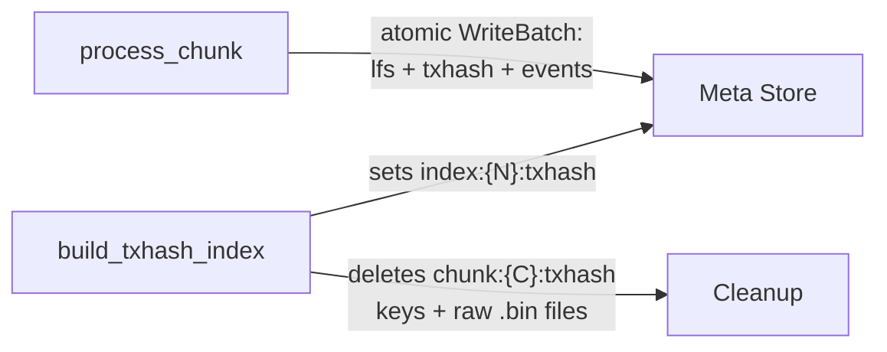
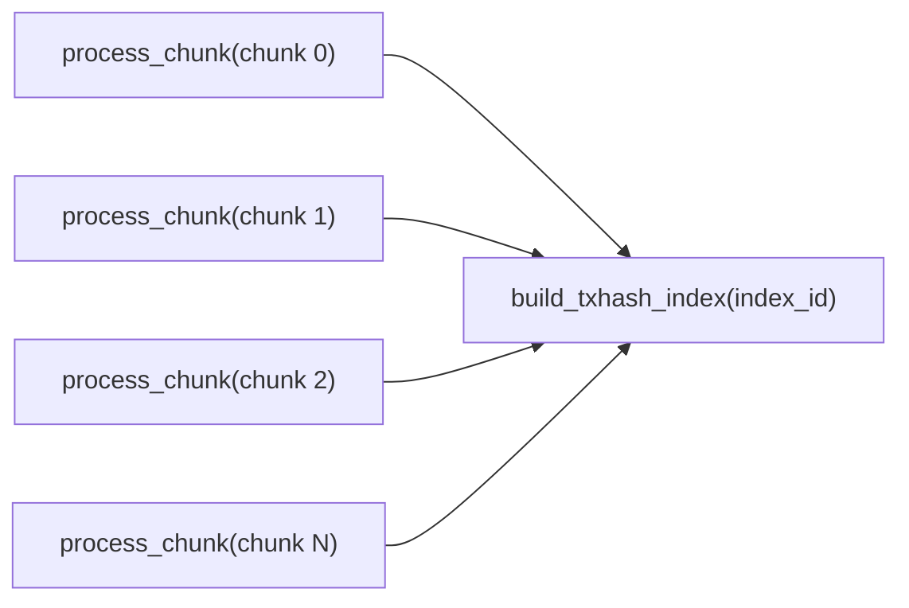
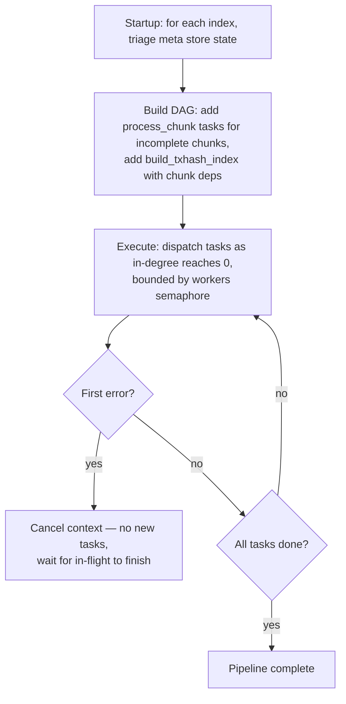
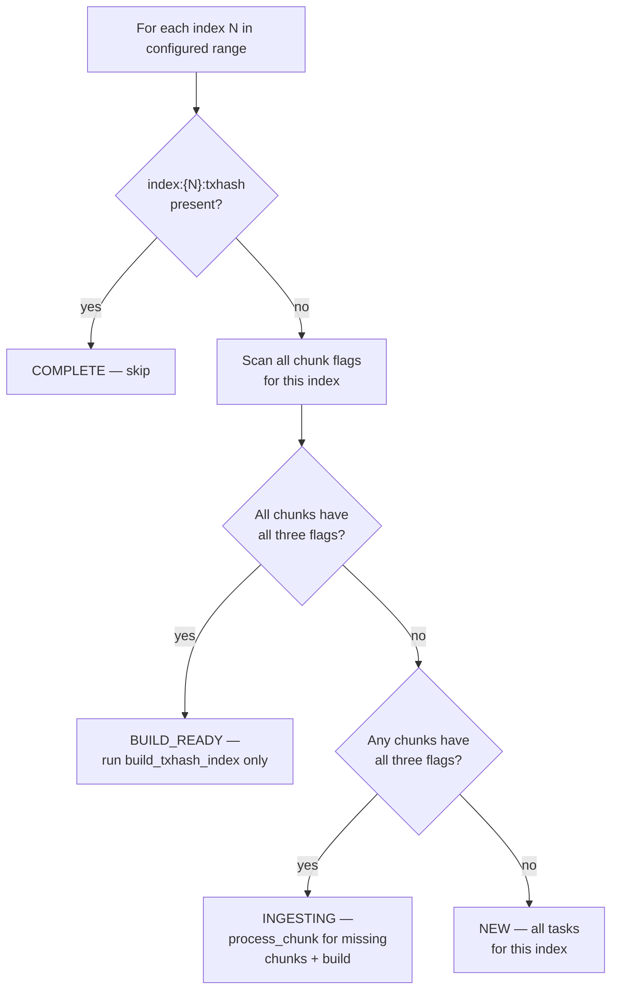

# Backfill Workflow

## Overview

Backfill populates the immutable stores for a configured ledger range `[start_ledger, end_ledger]`.

**What it does:**
- Ingests historical ledgers offline — no live queries served (only `getHealth` / `getStatus`)
- Writes directly to immutable file formats — no RocksDB active stores
- Schedules work as a DAG of idempotent tasks, dispatched via a flat worker pool (default 40 slots)
- Exits when done; on failure, re-run the same command — completed work is never repeated

**What it produces:**

| Query it enables | Immutable output | Scope |
|-----------------|-----------------|-------|
| `getLedger` | Ledger [pack file](https://github.com/stellar/stellar-rpc/pull/633) | Per chunk (10K ledgers) |
| `getTransaction` | 16 RecSplit MPH index files | Per index (default 10M ledgers) |
| `getEvents` | [Events cold segment](https://github.com/stellar/stellar-rpc/pull/635) | Per chunk |

---

## Directory Structure

All data lives under a configurable `data_dir`. Backfill writes only to `meta/` and `immutable/` — no active store directories.

```
{data_dir}/
├── meta/
│   └── rocksdb/                    ← Meta store (WAL always enabled)
│
└── immutable/
    ├── ledgers/
    │   └── chunks/
    │       ├── 0000/               ← Storage group: chunks 0–999
    │       │   ├── 000000.pack     ← Ledger pack file (packfile format, PR #633)
    │       │   ├── ...
    │       │   └── 000999.pack
    │       └── 0001/               ← Storage group: chunks 1000–1999
    │           └── ...
    │
    ├── txhash/
    │   ├── 0000/                   ← Index 0
    │   │   ├── raw/                ← TRANSIENT (deleted after RecSplit build)
    │   │   │   ├── 000000.bin
    │   │   │   └── ... (up to 1000 files)
    │   │   ├── tmp/                ← TRANSIENT (RecSplit scratch space)
    │   │   └── index/              ← PERMANENT (16 RecSplit CF files)
    │   │       ├── cf-0.idx
    │   │       └── ... cf-f.idx
    │   └── 0001/
    │       └── ...
    │
    └── events/
        ├── 0000/                   ← Chunk 0 events cold segment (PR #635)
        │   ├── events.pack         ← Compressed event blocks + ledger offset array
        │   ├── index.pack          ← Serialized roaring bitmaps (one per indexed term)
        │   └── index.hash          ← MPHF (minimal perfect hash function) for term → slot lookup
        ├── 0001/
        │   └── ...
        └── ...
```

**Grouping note:** The `chunks/XXXX/` parent directories are purely a storage convenience — each holds up to 1000 chunk files, determined by `chunkID / 1000`. This grouping is hardcoded and independent of `chunks_per_txhash_index` (a config parameter described in [Configuration](#configuration) that controls how many chunks form one txhash index). When `chunks_per_txhash_index = 1000` (the default), the directory groups happen to align 1:1 with index boundaries. With smaller values like 10 or 100, multiple indexes will share one directory.

### Path Conventions

| File Type | Pattern | Example |
|-----------|---------|---------|
| Ledger pack | `{ledgers_base}/chunks/{chunkID/1000:04d}/{chunkID:06d}.pack` | `chunks/0000/000042.pack` |
| Raw txhash | `{txhash_base}/{indexID:04d}/raw/{chunkID:06d}.bin` | `txhash/0000/raw/000042.bin` |
| RecSplit CF | `{txhash_base}/{indexID:04d}/index/cf-{nibble}.idx` | `txhash/0000/index/cf-a.idx` |
| Events data | `{events_base}/{chunkID:04d}/events.pack` | `events/0000/events.pack` |
| Events index | `{events_base}/{chunkID:04d}/index.pack` | `events/0000/index.pack` |
| Events hash | `{events_base}/{chunkID:04d}/index.hash` | `events/0000/index.hash` |

- **Nibble** = high 4 bits of `txhash[0]`, i.e., `txhash[0] >> 4`. Values `0`–`f`. Determines which of 16 CFs a txhash is routed to.
- **Raw txhash format**: 36 bytes per entry, no header: `[txhash: 32 bytes][ledgerSeq: 4 bytes big-endian]`
- **Events cold segment**: See [getEvents full-history design](https://github.com/stellar/stellar-rpc/pull/635) for the full format specification.
- Directories are created on-demand via `os.MkdirAll`. Safe for concurrent writes.

---

## Geometry

The Stellar blockchain starts at ledger 2. Backfill organizes data into two levels:

- **Chunk** — 10,000 ledgers. Atomic unit of ingestion and crash recovery. Produces: one ledger `.pack` file, one raw txhash `.bin` file, and one events cold segment (3 files).
- **Index** — `chunks_per_txhash_index` chunks (default 1000 = 10M ledgers). Grouping unit for RecSplit txhash index builds. One set of 16 RecSplit CF (column family) files per index.

### ID Formulas

```
chunk_id  = (ledger_seq - 2) / 10,000
index_id  = chunk_id / chunks_per_txhash_index
```

| Index ID | First Ledger | Last Ledger | Chunks |
|----------|-------------|------------|--------|
| 0 | 2 | 10,000,001 | 0–999 |
| 1 | 10,000,002 | 20,000,001 | 1000–1999 |
| 2 | 20,000,002 | 30,000,001 | 2000–2999 |
| N | (N × 10M) + 2 | ((N+1) × 10M) + 1 | N×1000 – (N+1)×1000 - 1 |

---

## Configuration

TOML file, passed via `backfill-workflow --config path/to/config.toml`.

### Required Sections

**[service]**

| Key | Type | Default | Description |
|-----|------|---------|-------------|
| `data_dir` | string | **required** | Base directory. All sub-paths default relative to this. |

**[backfill]**

| Key | Type | Default | Description |
|-----|------|---------|-------------|
| `start_ledger` | uint32 | **required** | First ledger (inclusive). Must be index-aligned. Valid: 2, 10000002, 20000002, … |
| `end_ledger` | uint32 | **required** | Last ledger (inclusive). Must be index-aligned. Valid: 10000001, 20000001, … |
| `chunks_per_txhash_index` | int | `1000` | Chunks per index. Valid: 1, 10, 100, 1000. |
| `workers` | int | `40` | Total concurrent DAG task slots. |
| `verify_recsplit` | bool | `true` | Run RecSplit verify phase after build. |

**Ledger backend:**

| Backend | Section | Required Keys |
|---------|---------|--------------|
| GCS | `[backfill.bsb]` | `bucket_path` (full GCS path, without `gs://` prefix) |

### Optional Sections

| Section | Key | Default | Description |
|---------|-----|---------|-------------|
| `[meta_store]` | `path` | `{data_dir}/meta/rocksdb` | Meta store RocksDB directory |
| `[immutable_stores]` | `ledgers_base` | `{data_dir}/immutable/ledgers` | Base path for ledger pack files |
| `[immutable_stores]` | `txhash_base` | `{data_dir}/immutable/txhash` | Base path for txhash files |
| `[immutable_stores]` | `events_base` | `{data_dir}/immutable/events` | Base path for events cold segments |
| `[backfill.bsb]` | `buffer_size` | `1000` | GCS prefetch buffer depth per connection |
| `[backfill.bsb]` | `num_workers` | `20` | GCS download workers per connection |
| `[logging]` | `log_file` | `{data_dir}/logs/backfill.log` | Main log file |
| `[logging]` | `error_file` | `{data_dir}/logs/backfill-error.log` | Error-only log file |
| `[logging]` | `max_scope_depth` | `0` | Max log scope nesting depth. 0=unlimited (all logs). 1=pipeline-level only. 2=+per-index. 3=+per-chunk/RecSplit. |

### Validation Rules

- `start_ledger` must satisfy: `(start_ledger - 2) % (chunks_per_txhash_index × 10,000) == 0`
- `end_ledger` must satisfy: `(end_ledger - 1) % (chunks_per_txhash_index × 10,000) == 0`

  The `10,000` is the number of ledgers per chunk. The product `chunks_per_txhash_index × 10,000` is the total ledgers per index. Start and end must align to index boundaries because backfill processes complete indexes only — partial indexes are not supported.

- `end_ledger > start_ledger`
- `[backfill.bsb]` must be present

### Example: GCS Backfill

```toml
[service]
data_dir = "/data/stellar-rpc"

[backfill]
start_ledger = 2
end_ledger   = 30000001

[backfill.bsb]
bucket_path = "sdf-ledger-close-meta/v1/ledgers/pubnet"
```

---

## Meta Store Keys

The meta store is a single RocksDB instance with WAL (Write-Ahead Log) always enabled. It is the authoritative source for crash recovery — all resume decisions derive from key presence in this store.

### Key Schema

| Key Pattern | Value | Written When |
|-------------|-------|-------------|
| `chunk:{C:010d}:lfs` | `"1"` | After ledger `.pack` file is fsynced |
| `chunk:{C:010d}:txhash` | `"1"` | After raw txhash `.bin` file is fsynced |
| `chunk:{C:010d}:events` | `"1"` | After events cold segment files (`events.pack`, `index.pack`, `index.hash`) are fsynced |
| `index:{N:010d}:txhash` | `"1"` | After all 16 RecSplit CF `.idx` files are built and fsynced |

- Values are `"1"` (retained for `ldb`/`sst_dump` readability); key presence is the signal
- Key absence means not started or incomplete — treated identically on resume
- All three chunk flags (`lfs`, `txhash`, `events`) are set in a **single atomic RocksDB WriteBatch** — there is no crash window where one is set without the others
- A chunk is only skippable on resume when **all three** flags are `"1"`
- WAL is always enabled — disabling it would invalidate all crash recovery
- `chunk:{C}:txhash` keys are deleted during cleanup after RecSplit completes (the raw `.bin` files they reference are also deleted); all other flags are permanent

**Examples:**
```
chunk:0000000000:lfs     →  "1"     chunk 0 ledger pack done
chunk:0000000000:txhash  →  "1"     chunk 0 raw txhash done
chunk:0000000000:events  →  "1"     chunk 0 events cold segment done
chunk:0000000999:events  →  "1"     last chunk of index 0
index:0000000000:txhash  →  "1"     index 0 RecSplit complete
index:0000000001:txhash  →  absent  index 1 not yet built
```

### Key Lifecycle



After a completed index, `chunk:{C}:lfs`, `chunk:{C}:events`, and `index:{N}:txhash` keys remain permanently. The `chunk:{C}:txhash` keys are deleted along with the raw `.bin` files.

---

## Tasks and Dependencies

Two task types. Each implements `Execute(ctx) error`. The DAG scheduler calls `Execute()` — tasks are opaque; the scheduler does not know what they do internally.

| Task | Cadence | Dependencies | Produces |
|------|---------|-------------|----------|
| `process_chunk(chunk_id)` | Per chunk (10K ledgers) | None | Ledger `.pack` + raw txhash `.bin` + events cold segment |
| `build_txhash_index(index_id)` | Per index | All `process_chunk` tasks for this index | 16 RecSplit `.idx` files. Cleans up raw `.bin` files + transient meta keys. |

### Dependency Diagram

For a single index with N chunks:



All `process_chunk` tasks for an index must complete before `build_txhash_index` fires. Cleanup of raw files and transient meta keys happens within `build_txhash_index` after the RecSplit build succeeds — it is not a separate DAG task.

### DAG Setup Pseudocode

```python
dag = new DAG()

for index_id in configured_indexes:
    state = triage(index_id)        # see Crash Recovery → Startup Triage

    if state == COMPLETE:
        continue                     # index done — no tasks needed

    # Collect process_chunk tasks for incomplete chunks
    chunk_deps = []
    for chunk_id in chunks_for_index(index_id):
        if all_three_flags_set(chunk_id):   # lfs + txhash + events
            continue                         # chunk done — skip
        task = process_chunk(chunk_id)
        dag.add(task, deps=[])               # no dependencies
        chunk_deps.append(task.id)

    # BUILD_READY: all chunks done, chunk_deps is empty → build fires immediately
    # INGESTING/NEW: chunk_deps is non-empty → build waits for all chunks
    build = build_txhash_index(index_id)
    dag.add(build, deps=chunk_deps)

dag.execute(max_workers=config.workers)       # default 40
```

---

## Task Details

### process_chunk(chunk_id)

Produces all chunk-level immutable outputs for a single 10K-ledger chunk. Occupies **one DAG worker slot**. How it organizes its internal work is an implementation detail — it may use goroutines, sequential processing, or any combination.

**Outputs** (all three produced in a single task):
1. **Ledger pack file** (`{chunkID}.pack`) — compressed ledger data in [packfile format](https://github.com/stellar/stellar-rpc/pull/633)
2. **Raw txhash flat file** (`{chunkID}.bin`) — 36-byte entries consumed by RecSplit builder
3. **Events cold segment** (`events.pack` + `index.pack` + `index.hash`) — per [getEvents design](https://github.com/stellar/stellar-rpc/pull/635)

**Pseudocode:**

```python
process_chunk(chunk_id):
    first_ledger = chunk_first_ledger(chunk_id)
    last_ledger  = chunk_last_ledger(chunk_id)
    index_id     = chunk_id / chunks_per_txhash_index

    # 1. Choose data source
    source = BSBFactory.create(first_ledger, last_ledger)   # GCS connection for this chunk

    # 2. Delete any partial files from a prior crash
    delete_if_exists(ledger_pack_path(chunk_id))
    delete_if_exists(raw_txhash_path(index_id, chunk_id))
    delete_if_exists(events_dir(chunk_id))

    # 3. Open writers for all three outputs
    ledger_writer = packfile.create(ledger_pack_path(chunk_id))
    txhash_writer = open(raw_txhash_path(index_id, chunk_id))
    events_writer = events_segment.create(events_dir(chunk_id))

    # 4. Process each ledger
    for seq in range(first_ledger, last_ledger + 1):
        lcm = source.get_ledger(seq)

        ledger_writer.append(compress(lcm))
        txhash_writer.append(extract_txhashes(lcm))    # 36 bytes per tx: hash[32] + seq[4]
        events_writer.append(extract_events(lcm))       # events + bitmap index updates

    # 5. Fsync all outputs (order does not matter)
    ledger_writer.fsync_and_close()
    txhash_writer.fsync_and_close()
    events_writer.finalize()          # flush, build MPHF + bitmap index, fsync

    # 6. Atomic flag write — all three flags in one WriteBatch
    meta.write_batch({
        f"chunk:{chunk_id:010d}:lfs":    "1",
        f"chunk:{chunk_id:010d}:txhash": "1",
        f"chunk:{chunk_id:010d}:events": "1",
    })

    source.close()
```

A crash before the WriteBatch leaves no meta store trace — partial files are overwritten on resume.

> **BSB** (BufferedStorageBackend): the GCS-backed ledger source. Each `process_chunk` task creates its own GCS connection with internal prefetch workers (`buffer_size` ledgers ahead, `num_workers` download goroutines).

### build_txhash_index(index_id)

Builds the RecSplit txhash index for one completed index. Occupies **one DAG worker slot** but spawns its own internal goroutines — the RecSplit pipeline is heavily parallel. The DAG guarantees all chunk `.bin` files exist before this task runs.

**4-phase RecSplit pipeline** (all internal to this single DAG task):

1. **COUNT** (100 goroutines) — scan all `.bin` files, count entries per CF
2. **ADD** (100 goroutines, mutex per CF) — re-read `.bin` files, add each `(txhash, ledgerSeq)` pair to the CF builder selected by `txhash[0] >> 4`
3. **BUILD** (16 goroutines, one per CF) — build MPH indexes in parallel; each CF produces one `.idx` file; all fsynced
4. **VERIFY** (100 goroutines, optional) — look up every key in the built indexes; skipped if `verify_recsplit = false`

**After build + verify:**
- Set `index:{N}:txhash = "1"`
- Delete raw `.bin` files for all chunks in this index
- Delete `chunk:{C}:txhash` meta keys for all chunks in this index

Internal parallelism is invisible to the DAG — it sees one task in one slot.

**Recovery**: All-or-nothing. If `index:{N}:txhash` is absent on restart, partial `.idx` files are deleted and the entire build reruns.

---

## Execution Model

### DAG Scheduler

The pipeline builds a DAG at startup, then executes it with bounded concurrency. **The DAG is the only scheduling mechanism** — no per-index coordinators, no secondary worker pools.



### Worker Pool

- Single flat pool of `workers` slots (default 40)
- Any mix of task types can occupy slots simultaneously
- `process_chunk`: 1 slot per task
- `build_txhash_index`: 1 slot per task (uses many goroutines internally)

### Parallelism Flow

All `process_chunk` tasks start with in-degree 0 — eligible immediately. The DAG fills the semaphore:

```
Time 0:   40 process_chunk tasks running (mix of index 0 and 1)
Time T:   Index 0's last chunk completes → build_txhash_index(0) dispatched
          39 process_chunk tasks + 1 build_txhash_index(0)
Time T+Δ: build_txhash_index(0) completes → index 0 fully done
          40 process_chunk tasks resume
```

`build_txhash_index` for index N runs concurrently with `process_chunk` tasks for index N+1 — overlap is automatic via DAG dependencies.

---

## Crash Recovery

All crash recovery follows from three invariants:

1. **Key implies durable file** — a meta store flag is set only after fsync
2. **Tasks are idempotent** — each checks its outputs and skips what is done
3. **Startup rebuilds the full task graph** — completed tasks are no-ops; incomplete tasks redo

Crash at any point → restart → full task graph rebuilt → completed tasks skip, incomplete tasks redo.

### Startup Triage

State is derived from key presence — no stored state machine:



The scan covers all `chunks_per_txhash_index` flag triples per index. Completed chunks form non-contiguous islands (concurrent tasks make independent progress) — the scan examines every chunk, no early exit at the first gap.

### Startup Reconciliation

Before ingestion, a reconciliation pass cleans up artifacts from prior crashes:

- **Index complete but `raw/` exists** → delete leftover `raw/` directory
- **Index in meta store but not in configured range** → log warning; multiple orphans → abort

### Concurrent Access Prevention

The meta store RocksDB uses kernel-level `flock()` on a `LOCK` file. A second process attempting to open the same meta store fails immediately. Released automatically on process exit (including `kill -9`).

### Crash Scenarios

Not exhaustive — correctness follows from the three invariants, not from this table.

| Crash point | Recovery |
|-------------|----------|
| `process_chunk` mid-stream | No flags set → task re-runs, overwrites all partial files |
| After fsync, before WriteBatch | No flags set → task re-runs, files rewritten (identical) |
| `build_txhash_index` mid-build | No index key → delete partial `.idx` files, rerun entire build |
| After index key, before cleanup | Reconciliation deletes leftover `raw/` on next startup |

### What Is Never Safe

- Setting a flag before fsync — power loss → corrupt file flagged as complete
- Disabling WAL for the meta store — flag writes not durable
- Assuming completed chunks are contiguous — concurrent tasks produce gaps
- Deleting raw `.bin` files before RecSplit completes — build cannot resume without input

---

## getStatus API Response

During backfill, `getStatus` returns progress. `active` contains only INGESTING or BUILDING indexes — bounded by worker count, not total index count.

```json
{
  "mode": "BACKFILL",
  "chunks_per_txhash_index": 1000,
  "summary": {
    "total_indexes": 6,
    "complete": 0,
    "building": 0,
    "ingesting": 2,
    "queued": 4,
    "total_chunks": 6000,
    "chunks_done": 288,
    "pct": 4.8,
    "eta_seconds": 1820
  },
  "active": [
    {"index": 0, "state": "INGESTING", "chunks_done": 147, "chunks_total": 1000, "pct": 14.7},
    {"index": 1, "state": "INGESTING", "chunks_done": 141, "chunks_total": 1000, "pct": 14.1}
  ]
}
```

---

## Error Handling

All errors exit non-zero. The operator re-runs the same command. Completed work is never repeated.

| Error | Action |
|-------|--------|
| GCS fetch error | ABORT task; operator re-runs |
| Ledger pack write / fsync failure | ABORT task; flags not set; operator re-runs |
| TxHash write / fsync failure | ABORT task; flags not set; operator re-runs |
| Events write / fsync failure | ABORT task; flags not set; operator re-runs |
| RecSplit build failure | ABORT; index key absent; operator re-runs |
| Verify phase mismatch | ABORT; data corruption — operator investigates |
| Meta store write failure | ABORT; treat as crash; operator re-runs |
