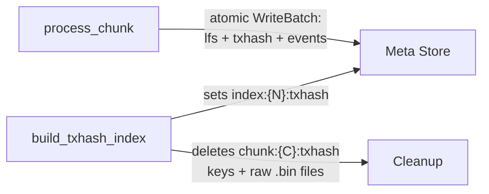
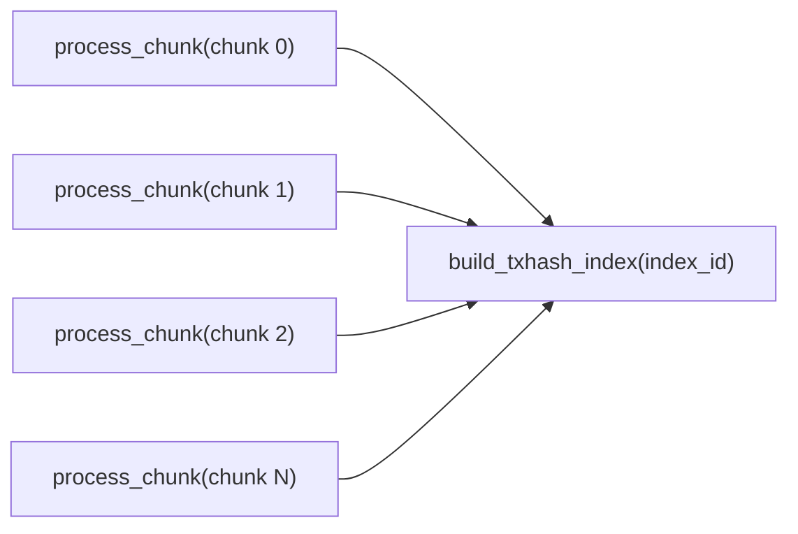
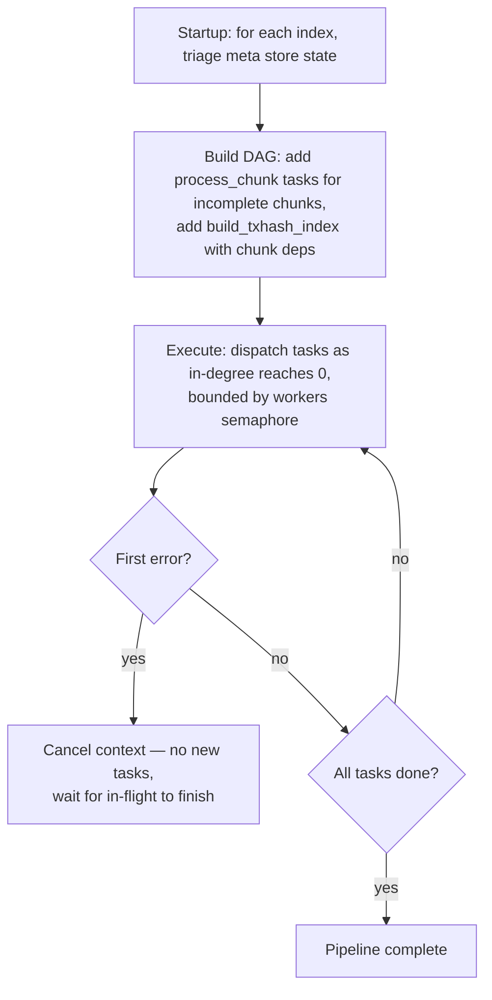
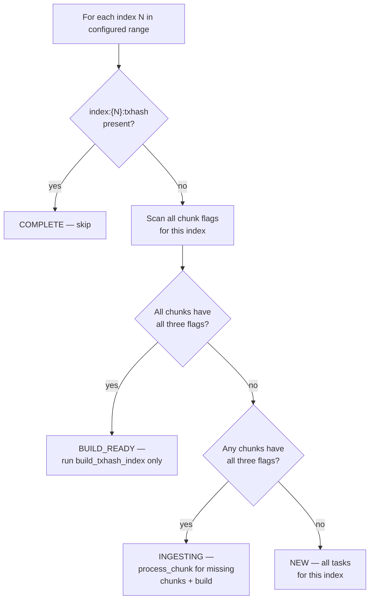

# Backfill Workflow

## Overview

Backfill populates the immutable stores for a configured ledger range `[start_ledger, end_ledger]`.

**What it does:**
- Ingests historical ledgers offline — no live queries served (only `getHealth` / `getStatus`)
- Writes directly to immutable file formats — no RocksDB active stores
- Schedules work as a DAG of idempotent tasks, dispatched via a flat worker pool (default 40 slots)
- Exits when done; on failure, re-run the same command — completed work is never repeated

**What it produces:**

| Query it enables | Immutable output | Scope |
|-----------------|-----------------|-------|
| `getLedger` | Ledger [pack file](https://github.com/stellar/stellar-rpc/pull/633) | Per chunk (10K ledgers) |
| `getTransaction` | 16 RecSplit MPH index files | Per index (default 10M ledgers) |
| `getEvents` | [Events cold segment](https://github.com/stellar/stellar-rpc/pull/635) | Per chunk |

---

## Directory Structure

All data lives under a configurable `data_dir`. Backfill writes only to `meta/` and `immutable/` — no active store directories.

**The index directory is the top-level organizational unit.** Everything produced for an index — ledgers, txhash, events — lives under one `index-{indexID:08d}/` directory. Pruning old history = `rm -rf index-NNNNNNNN/`.

All IDs use uniform `%08d` zero-padding (supports up to 99,999,999).

```
{data_dir}/
├── meta/
│   └── rocksdb/                                  ← Meta store (WAL always enabled)
│
└── immutable/
    └── index-{indexID:08d}/                       ← one directory per index
        ├── ledgers/
        │   └── {chunkID:08d}.pack                 ← ledger pack file (PR #633)
        ├── txhash/
        │   ├── raw/
        │   │   └── {chunkID:08d}.bin              ← TRANSIENT (deleted after RecSplit)
        │   ├── tmp/                               ← TRANSIENT (RecSplit scratch)
        │   └── index/
        │       └── cf-{0-f}.idx                   ← PERMANENT (16 RecSplit CF files)
        └── events/
            └── {chunkID:08d}/                     ← one subdirectory per chunk
                ├── events.pack                    ← compressed event blocks
                ├── index.pack                     ← serialized roaring bitmaps
                └── index.hash                     ← MPHF for term → slot lookup
```

### Concrete Examples

The following examples all use `start_ledger=2, end_ledger=20_000_001` (20M ledgers = 2,000 chunks).

#### `chunks_per_txhash_index = 1000` (default)

2,000 chunks ÷ 1,000 = **2 index directories**, each containing 1,000 chunks:

```
immutable/
├── index-00000000/                                ← Index 0: ledgers 2–10,000,001
│   ├── ledgers/
│   │   ├── 00000000.pack                          ← chunk 0
│   │   ├── 00000001.pack                          ← chunk 1
│   │   ├── ...
│   │   └── 00000999.pack                          ← chunk 999
│   │                                                (1,000 .pack files)
│   ├── txhash/
│   │   ├── raw/
│   │   │   ├── 00000000.bin ... 00000999.bin       (1,000 .bin files)
│   │   └── index/
│   │       └── cf-0.idx ... cf-f.idx               (16 files)
│   └── events/
│       ├── 00000000/                               ← chunk 0 events segment
│       │   ├── events.pack
│       │   ├── index.pack
│       │   └── index.hash
│       ├── ...
│       └── 00000999/                               (1,000 segment directories)
│
└── index-00000001/                                ← Index 1: ledgers 10,000,002–20,000,001
    ├── ledgers/
    │   ├── 00001000.pack ... 00001999.pack         (1,000 .pack files)
    ├── txhash/
    │   ├── raw/00001000.bin ... 00001999.bin
    │   └── index/cf-0.idx ... cf-f.idx
    └── events/
        └── 00001000/ ... 00001999/                 (1,000 segment directories)
```

**Pruning**: `rm -rf immutable/index-00000000/` removes all ledger, txhash, and events data for the first 10M ledgers.

#### `chunks_per_txhash_index = 100`

2,000 chunks ÷ 100 = **20 index directories**, each containing 100 chunks:

```
immutable/
├── index-00000000/                                ← Index 0: ledgers 2–1,000,001 (chunks 0–99)
│   ├── ledgers/
│   │   ├── 00000000.pack ... 00000099.pack         (100 .pack files)
│   ├── txhash/
│   │   ├── raw/00000000.bin ... 00000099.bin        (100 .bin files)
│   │   └── index/cf-0.idx ... cf-f.idx
│   └── events/
│       └── 00000000/ ... 00000099/                  (100 segment directories)
│
├── index-00000001/                                ← Index 1: chunks 100–199
│   ├── ledgers/00000100.pack ... 00000199.pack
│   └── ...
│
├── ...
│
└── index-00000019/                                ← Index 19: chunks 1900–1999
    ├── ledgers/00001900.pack ... 00001999.pack
    └── ...
```

**Pruning granularity**: 1M ledgers per index. `rm -rf immutable/index-00000000/` removes 1M ledgers.

#### `chunks_per_txhash_index = 1`

2,000 chunks ÷ 1 = **2,000 index directories**, each containing 1 chunk:

```
immutable/
├── index-00000000/                                ← Index 0 = chunk 0 only (ledgers 2–10,001)
│   ├── ledgers/
│   │   └── 00000000.pack                           (1 file)
│   ├── txhash/
│   │   ├── raw/00000000.bin                         (1 file)
│   │   └── index/cf-0.idx ... cf-f.idx              (16 files)
│   └── events/
│       └── 00000000/                                (1 segment directory)
│
├── index-00000001/                                ← Index 1 = chunk 1 only
│   └── ...
├── ...
└── index-00001999/                                ← Index 1999 = chunk 1999
    └── ...
```

**Pruning granularity**: 10K ledgers (one chunk). Maximum flexibility but 2,000 small directories and 2,000 tiny RecSplit builds.

### Path Conventions

| File Type | Pattern | Example |
|-----------|---------|---------|
| Ledger pack | `{immutable_base}/index-{indexID:08d}/ledgers/{chunkID:08d}.pack` | `index-00000000/ledgers/00000042.pack` |
| Raw txhash | `{immutable_base}/index-{indexID:08d}/txhash/raw/{chunkID:08d}.bin` | `index-00000000/txhash/raw/00000042.bin` |
| RecSplit CF | `{immutable_base}/index-{indexID:08d}/txhash/index/cf-{nibble}.idx` | `index-00000000/txhash/index/cf-a.idx` |
| Events data | `{immutable_base}/index-{indexID:08d}/events/{chunkID:08d}/events.pack` | `index-00000000/events/00000042/events.pack` |
| Events index | `{immutable_base}/index-{indexID:08d}/events/{chunkID:08d}/index.pack` | `index-00000000/events/00000042/index.pack` |
| Events hash | `{immutable_base}/index-{indexID:08d}/events/{chunkID:08d}/index.hash` | `index-00000000/events/00000042/index.hash` |

- **Nibble** = high 4 bits of `txhash[0]`, i.e., `txhash[0] >> 4`. Values `0`–`f`. Determines which of 16 CFs a txhash is routed to.
- **Raw txhash format**: 36 bytes per entry, no header: `[txhash: 32 bytes][ledgerSeq: 4 bytes big-endian]`
- **Events cold segment**: See [getEvents full-history design](https://github.com/stellar/stellar-rpc/pull/635) for the full format specification.
- Directories are created on-demand via `os.MkdirAll`. Safe for concurrent writes.

---

## Geometry

The Stellar blockchain starts at ledger 2. Backfill organizes data into two levels:

- **Chunk** — 10,000 ledgers. Atomic unit of ingestion and crash recovery. Produces: one ledger `.pack` file, one raw txhash `.bin` file, and one events cold segment (3 files).
- **Index** — `chunks_per_txhash_index` chunks (default 1000 = 10M ledgers). Grouping unit for RecSplit txhash index builds and pruning. One set of 16 RecSplit CF (column family) files per index.

### ID Formulas

```
chunk_id  = (ledger_seq - 2) / 10,000
index_id  = chunk_id / chunks_per_txhash_index
```

| Index ID | First Ledger | Last Ledger | Chunks |
|----------|-------------|------------|--------|
| 0 | 2 | 10,000,001 | 0–999 |
| 1 | 10,000,002 | 20,000,001 | 1000–1999 |
| 2 | 20,000,002 | 30,000,001 | 2000–2999 |
| N | (N × 10M) + 2 | ((N+1) × 10M) + 1 | N×1000 – (N+1)×1000 - 1 |

---

## Configuration

TOML file, passed via `backfill-workflow --config path/to/config.toml`.

### Required Sections

**[service]**

| Key | Type | Default | Description |
|-----|------|---------|-------------|
| `data_dir` | string | **required** | Base directory. All sub-paths default relative to this. |

**[backfill]**

| Key | Type | Default | Description |
|-----|------|---------|-------------|
| `start_ledger` | uint32 | **required** | First ledger (inclusive). Must be index-aligned. Valid: 2, 10_000_002, 20_000_002, … |
| `end_ledger` | uint32 | **required** | Last ledger (inclusive). Must be index-aligned. Valid: 10_000_001, 20_000_001, … |
| `chunks_per_txhash_index` | int | `1000` | Chunks per index. Valid: 1, 10, 100, 1000. |
| `workers` | int | `40` | Total concurrent DAG task slots. |
| `verify_recsplit` | bool | `true` | Run RecSplit verify phase after build. |

**Ledger backend:**

| Backend | Section | Required Keys |
|---------|---------|--------------|
| GCS | `[backfill.bsb]` | `bucket_path` (full GCS path, without `gs://` prefix) |

### Optional Sections

| Section | Key | Default | Description |
|---------|-----|---------|-------------|
| `[meta_store]` | `path` | `{data_dir}/meta/rocksdb` | Meta store RocksDB directory |
| `[immutable_stores]` | `immutable_base` | `{data_dir}/immutable` | Base path for all immutable data (index directories live here) |
| `[backfill.bsb]` | `buffer_size` | `1000` | GCS prefetch buffer depth per connection |
| `[backfill.bsb]` | `num_workers` | `20` | GCS download workers per connection |
| `[logging]` | `log_file` | `{data_dir}/logs/backfill.log` | Main log file |
| `[logging]` | `error_file` | `{data_dir}/logs/backfill-error.log` | Error-only log file |
| `[logging]` | `max_scope_depth` | `0` | Max log scope nesting depth. 0=unlimited (all logs). 1=pipeline-level only. 2=+per-index. 3=+per-chunk/RecSplit. |

### Validation Rules

- `start_ledger` must satisfy: `(start_ledger - 2) % (chunks_per_txhash_index × 10,000) == 0`
- `end_ledger` must satisfy: `(end_ledger - 1) % (chunks_per_txhash_index × 10,000) == 0`

  The `10,000` is the number of ledgers per chunk. The product `chunks_per_txhash_index × 10,000` is the total ledgers per index. Start and end must align to index boundaries because backfill processes complete indexes only — partial indexes are not supported.

- `end_ledger > start_ledger`
- `[backfill.bsb]` must be present

### Example: GCS Backfill

```toml
[service]
data_dir = "/data/stellar-rpc"

[backfill]
start_ledger = 2
end_ledger   = 30_000_001

[backfill.bsb]
bucket_path = "sdf-ledger-close-meta/v1/ledgers/pubnet"
```

---

## Meta Store Keys

The meta store is a single RocksDB instance with WAL (Write-Ahead Log) always enabled. It is the authoritative source for crash recovery — all resume decisions derive from key presence in this store.

### Key Schema

All IDs use uniform `%08d` zero-padding, matching the directory structure.

| Key Pattern | Value | Written When |
|-------------|-------|-------------|
| `chunk:{C:08d}:lfs` | `"1"` | After ledger `.pack` file is fsynced |
| `chunk:{C:08d}:txhash` | `"1"` | After raw txhash `.bin` file is fsynced |
| `chunk:{C:08d}:events` | `"1"` | After events cold segment files (`events.pack`, `index.pack`, `index.hash`) are fsynced |
| `index:{N:08d}:txhash` | `"1"` | After all 16 RecSplit CF `.idx` files are built and fsynced |

- Values are `"1"` (retained for `ldb`/`sst_dump` readability); key presence is the signal
- Key absence means not started or incomplete — treated identically on resume
- All three chunk flags (`lfs`, `txhash`, `events`) are set in a **single atomic RocksDB WriteBatch** — there is no crash window where one is set without the others
- A chunk is only skippable on resume when **all three** flags are `"1"`
- WAL is always enabled — disabling it would invalidate all crash recovery
- `chunk:{C}:txhash` keys are deleted during cleanup after RecSplit completes (the raw `.bin` files they reference are also deleted); all other flags are permanent

**Examples:**
```
chunk:00000000:lfs     →  "1"     chunk 0 ledger pack done
chunk:00000000:txhash  →  "1"     chunk 0 raw txhash done
chunk:00000000:events  →  "1"     chunk 0 events cold segment done
chunk:00000999:events  →  "1"     last chunk of index 0
index:00000000:txhash  →  "1"     index 0 RecSplit complete
index:00000001:txhash  →  absent  index 1 not yet built
```

### Key Lifecycle



After a completed index, `chunk:{C}:lfs`, `chunk:{C}:events`, and `index:{N}:txhash` keys remain permanently. The `chunk:{C}:txhash` keys are deleted along with the raw `.bin` files.

---

## Tasks and Dependencies

The backfill DAG has two task types:

| Task | Cadence | Dependencies | Produces |
|------|---------|-------------|----------|
| `process_chunk(chunk_id)` | Per chunk (10K ledgers) | None | Ledger `.pack` + raw txhash `.bin` + events cold segment |
| `build_txhash_index(index_id)` | Per index | All `process_chunk` tasks for this index | 16 RecSplit `.idx` files. Cleans up raw `.bin` files + transient meta keys. |

Each task is a black box to the DAG scheduler — it calls the task's `Execute()` method and waits for it to return. What happens inside (goroutines, I/O, parallelism) is up to the task.

### Dependency Diagram

For a single index with N chunks:



All `process_chunk` tasks for an index must complete before `build_txhash_index` fires. Cleanup of raw files and transient meta keys happens within `build_txhash_index` after the RecSplit build succeeds — it is not a separate DAG task.

### DAG Setup Pseudocode

```python
dag = new DAG()

for index_id in configured_indexes:
    state = triage(index_id)        # see Crash Recovery → Startup Triage

    if state == COMPLETE:
        continue                     # index done — no tasks needed

    # Collect process_chunk tasks for incomplete chunks
    chunk_deps = []
    for chunk_id in chunks_for_index(index_id):
        if all_three_flags_set(chunk_id):   # lfs + txhash + events
            continue                         # chunk done — skip
        task = process_chunk(chunk_id)
        dag.add(task, deps=[])               # no dependencies
        chunk_deps.append(task.id)

    # BUILD_READY: all chunks done, chunk_deps is empty → build fires immediately
    # INGESTING/NEW: chunk_deps is non-empty → build waits for all chunks
    build = build_txhash_index(index_id)
    dag.add(build, deps=chunk_deps)

dag.execute(max_workers=config.workers)       # default 40
```

---

## Task Details

### process_chunk(chunk_id)

- Processes a single 10K-ledger chunk end-to-end
- Occupies one DAG worker slot
- Internal concurrency is an implementation detail

**Outputs** (all produced in a single task):
- Ledger pack file (`{chunkID:08d}.pack`) — compressed ledger data in [packfile format](https://github.com/stellar/stellar-rpc/pull/633)
- Raw txhash flat file (`{chunkID:08d}.bin`) — 36-byte entries consumed by RecSplit builder
- Events cold segment (`events.pack` + `index.pack` + `index.hash`) — per [getEvents design](https://github.com/stellar/stellar-rpc/pull/635)

**Pseudocode:**

```python
process_chunk(chunk_id):
    first_ledger = chunk_first_ledger(chunk_id)
    last_ledger  = chunk_last_ledger(chunk_id)
    index_id     = chunk_id / chunks_per_txhash_index

    # 1. Choose data source
    source = BSBFactory.create(first_ledger, last_ledger)   # GCS connection for this chunk

    # 2. Delete any partial files from a prior crash
    delete_if_exists(ledger_pack_path(index_id, chunk_id))
    delete_if_exists(raw_txhash_path(index_id, chunk_id))
    delete_if_exists(events_dir(index_id, chunk_id))

    # 3. Open writers for all three outputs
    ledger_writer = packfile.create(ledger_pack_path(index_id, chunk_id))
    txhash_writer = open(raw_txhash_path(index_id, chunk_id))
    events_writer = events_segment.create(events_dir(index_id, chunk_id))

    # 4. Process each ledger
    for seq in range(first_ledger, last_ledger + 1):
        lcm = source.get_ledger(seq)

        ledger_writer.append(compress(lcm))
        txhash_writer.append(extract_txhashes(lcm))    # 36 bytes per tx: hash[32] + seq[4]
        events_writer.append(extract_events(lcm))       # events + bitmap index updates

    # 5. Fsync all outputs (order does not matter)
    ledger_writer.fsync_and_close()
    txhash_writer.fsync_and_close()
    events_writer.finalize()          # flush, build MPHF + bitmap index, fsync

    # 6. Atomic flag write — all three flags in one WriteBatch
    meta.write_batch({
        f"chunk:{chunk_id:08d}:lfs":    "1",
        f"chunk:{chunk_id:08d}:txhash": "1",
        f"chunk:{chunk_id:08d}:events": "1",
    })

    source.close()
```

A crash before the WriteBatch leaves no meta store trace — partial files are overwritten on resume.

> **BSB** (BufferedStorageBackend): the GCS-backed ledger source. Each `process_chunk` task creates its own GCS connection with internal prefetch workers (`buffer_size` ledgers ahead, `num_workers` download goroutines).

### build_txhash_index(index_id)

- Builds the RecSplit txhash index for one completed index
- Occupies one DAG worker slot, but spawns 100+ goroutines internally
- The DAG guarantees all chunk `.bin` files exist before this runs

**4-phase RecSplit pipeline** (all internal to this single task):

1. **COUNT** (100 goroutines) — scan all `.bin` files, count entries per CF
2. **ADD** (100 goroutines, mutex per CF) — re-read `.bin` files, route each `(txhash, ledgerSeq)` to the CF builder selected by `txhash[0] >> 4`
3. **BUILD** (16 goroutines, one per CF) — build MPH indexes in parallel; each CF produces one `.idx` file; all fsynced
4. **VERIFY** (100 goroutines, optional) — look up every key in the built indexes; skipped if `verify_recsplit = false`

**After build + verify:**
- Set `index:{N}:txhash = "1"`
- Delete raw `.bin` files for all chunks in this index
- Delete `chunk:{C}:txhash` meta keys for all chunks in this index

**Recovery:** All-or-nothing. If `index:{N}:txhash` is absent on restart, partial `.idx` files are deleted and the entire build reruns.

---

## Execution Model

### DAG Scheduler

- Pipeline builds a single DAG at startup, executes it with bounded concurrency
- The DAG is the only scheduling mechanism — no per-index coordinators, no secondary worker pools



### Worker Pool

- Single flat pool of `workers` slots (default 40)
- Any mix of task types can occupy slots simultaneously
- `process_chunk`: 1 slot per task
- `build_txhash_index`: 1 slot per task (uses many goroutines internally)

### How Work Flows Through the Pipeline

All `process_chunk` tasks have no dependencies, so the DAG dispatches as many as it can (up to `workers` slots) immediately at startup. Chunks from different indexes run side by side — the scheduler does not process indexes sequentially.

When the last chunk of an index completes, `build_txhash_index` for that index becomes eligible and claims a worker slot. While it builds the RecSplit index, the remaining slots continue processing chunks for other indexes. This means index building and chunk ingestion overlap naturally — no special coordination needed.

**Example with 3 indexes and `workers=6`:**

```
Worker slots: [1] [2] [3] [4] [5] [6]
              ─────────────────────────────────────────────
Startup:      C0₀ C0₁ C0₂ C1₀ C1₁ C2₀     ← chunks from all indexes mixed
              ─────────────────────────────────────────────
C0₂ done:     C0₃ C0₁ ─── C1₀ C1₁ C2₀     ← slot freed, next chunk dispatched
              ─────────────────────────────────────────────
Index 0 done: B0  C1₃ C1₄ C1₅ C2₂ C2₃     ← build_txhash_index(0) takes a slot
              ─────────────────────────────────────────────
B0 done:      C2₄ C1₃ C1₄ C1₅ C2₂ C2₃     ← slot freed, more chunks

C = process_chunk, B = build_txhash_index
Subscript = chunk number within its index
```

---

## Crash Recovery

All crash recovery follows from three invariants:

1. **Key implies durable file** — a meta store flag is set only after fsync
2. **Tasks are idempotent** — each checks its outputs and skips what is done
3. **Startup rebuilds the full task graph** — completed tasks are no-ops; incomplete tasks redo

Crash at any point → restart → full task graph rebuilt → completed tasks skip, incomplete tasks redo.

### Startup Triage

State is derived from key presence — no stored state machine:



Because chunks complete in arbitrary order (40 concurrent tasks making independent progress), the scan checks every chunk in the index — it cannot stop at the first gap.

### Startup Reconciliation

Before ingestion, a reconciliation pass cleans up artifacts from prior crashes:

- **Index complete but `raw/` exists** → delete leftover `raw/` directory
- **Index in meta store but not in configured range** → abort. This means the operator changed the config range or pointed at the wrong meta store. Changing `chunks_per_txhash_index` after the first run is also not supported — it changes index boundaries and invalidates existing state.

  > **Example:** Run 1 backfills indexes 0–5 with `start_ledger=2, end_ledger=60_000_001`. Run 2 changes config to `start_ledger=20_000_002, end_ledger=60_000_001`. On startup, reconciliation finds `index:0` and `index:1` in the meta store but outside the configured range → abort. The operator must either widen the range to include them or use a fresh meta store.

### Concurrent Access Prevention

- Meta store RocksDB uses kernel-level `flock()` on a `LOCK` file
- A second process attempting to open the same meta store fails immediately
- Released automatically on process exit (including `kill -9`)

### Crash Scenarios

Not exhaustive — correctness follows from the three invariants, not from this table.

| Crash point | Recovery |
|-------------|----------|
| `process_chunk` mid-stream | No flags set → task re-runs, overwrites all partial files |
| After fsync, before WriteBatch | No flags set → task re-runs, files rewritten (identical) |
| `build_txhash_index` mid-build | No index key → delete partial `.idx` files, rerun entire build |
| After index key, before cleanup | Reconciliation deletes leftover `raw/` on next startup |

### What Is Never Safe

- Setting a flag before fsync — power loss → corrupt file flagged as complete
- Disabling WAL for the meta store — flag writes not durable
- Assuming completed chunks are contiguous — concurrent tasks produce gaps
- Deleting raw `.bin` files before RecSplit completes — build cannot resume without input

---

## getStatus API Response

During backfill, `getStatus` returns overall progress in `summary` and per-index detail in `active`. The `active` array lists only indexes that currently have work in flight — not all configured indexes. For example, if 6 indexes are configured but only indexes 0 and 1 have chunks currently being processed, `active` contains 2 entries:

```json
{
  "mode": "BACKFILL",
  "chunks_per_txhash_index": 1000,
  "summary": {
    "total_indexes": 6,
    "complete": 0,
    "building": 0,
    "ingesting": 2,
    "queued": 4,
    "total_chunks": 6000,
    "chunks_done": 288,
    "pct": 4.8,
    "eta_seconds": 1820
  },
  "active": [
    {"index": 0, "state": "INGESTING", "chunks_done": 147, "chunks_total": 1000, "pct": 14.7},
    {"index": 1, "state": "INGESTING", "chunks_done": 141, "chunks_total": 1000, "pct": 14.1}
  ]
}
```

---

## Error Handling

All errors exit non-zero. The operator re-runs the same command. Completed work is never repeated.

| Error | Action |
|-------|--------|
| GCS fetch error | ABORT task; operator re-runs |
| Ledger pack write / fsync failure | ABORT task; flags not set; operator re-runs |
| TxHash write / fsync failure | ABORT task; flags not set; operator re-runs |
| Events write / fsync failure | ABORT task; flags not set; operator re-runs |
| RecSplit build failure | ABORT; index key absent; operator re-runs |
| Verify phase mismatch | ABORT; data corruption — operator investigates |
| Meta store write failure | ABORT; treat as crash; operator re-runs |
