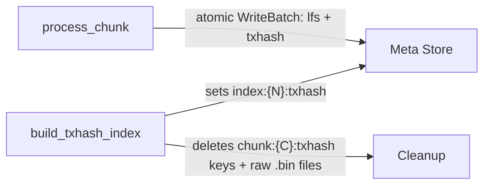
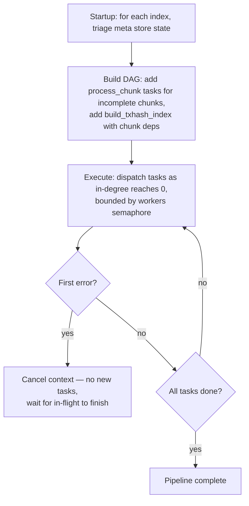
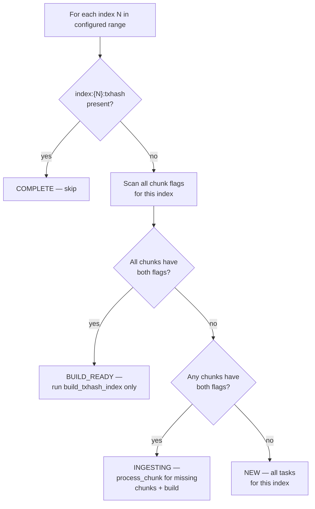

# Backfill Workflow

## Overview

Backfill ingests historical ledger data offline, writing directly to immutable formats — LFS (Ledger File Store) chunk files and raw txhash flat files — without RocksDB active stores. The process is modeled as a **DAG of idempotent tasks**: built on startup, dispatched as dependencies are satisfied via a flat worker pool, and exits when all tasks complete.

Given a ledger range `[start_ledger, end_ledger]`, the backfill produces:
- **LFS chunk files** — compressed ledger data for `getLedger` queries
- **RecSplit index files** — minimal perfect hash (MPH) indexes for `getTransaction` lookups

Then cleans up all intermediate data. No query capability during backfill — the process serves only `getHealth` and `getStatus`.

### Crash Recovery Invariants

All crash recovery follows from three properties:

1. **Key implies durable file** — a meta store flag is set only after fsync; if the flag exists, the file is complete.
2. **Tasks are idempotent** — each task checks its outputs and skips what is already done.
3. **Startup rebuilds the full task graph** — completed tasks are no-ops; incomplete tasks redo their work.

These are explained in detail in [Crash Recovery](#crash-recovery). Everything else in this doc is implementation of these three invariants.

---

## Geometry

The Stellar blockchain starts at ledger 2. Backfill organizes data into two levels:

- **Chunk** — 10,000 ledgers. Atomic unit of ingestion and crash recovery. One LFS file + one raw txhash flat file per chunk.
- **Index** — `chunks_per_txhash_index` chunks (default 1000 = 10M ledgers). Grouping unit for RecSplit index builds. One set of 16 RecSplit CF (column family) files per index.

### ID Formulas

```
chunk_id  = (ledger_seq - 2) / 10,000
index_id  = chunk_id / chunks_per_txhash_index
```

| Index ID | First Ledger | Last Ledger | Chunks |
|----------|-------------|------------|--------|
| 0 | 2 | 10,000,001 | 0–999 |
| 1 | 10,000,002 | 20,000,001 | 1000–1999 |
| 2 | 20,000,002 | 30,000,001 | 2000–2999 |
| N | (N × 10M) + 2 | ((N+1) × 10M) + 1 | N×1000 – (N+1)×1000 - 1 |

---

## Meta Store Keys

The meta store is a single RocksDB instance with WAL (Write-Ahead Log) always enabled. It is the authoritative source for crash recovery — all resume decisions derive from key presence in this store.

### Key Schema

| Key Pattern | Value | Written When |
|-------------|-------|-------------|
| `chunk:{C:010d}:lfs` | `"1"` | After LFS `.data` + `.index` files are fsynced |
| `chunk:{C:010d}:txhash` | `"1"` | After raw txhash `.bin` file is fsynced |
| `index:{N:010d}:txhash` | `"1"` | After all 16 RecSplit CF `.idx` files are built and fsynced |

- Values are `"1"` (retained for `ldb`/`sst_dump` readability); key presence is the signal
- Key absence means not started or incomplete — treated identically on resume
- Both chunk flags are set in a **single atomic RocksDB WriteBatch** — there is no crash window where one is set without the other
- WAL is always enabled — disabling it would invalidate all crash recovery
- `chunk:{C}:txhash` keys are deleted during cleanup after RecSplit completes (the raw `.bin` files they reference are also deleted); all other flags are permanent

**Examples:**
```
chunk:0000000000:lfs     →  "1"     chunk 0 LFS done
chunk:0000000000:txhash  →  "1"     chunk 0 txhash done
chunk:0000000999:txhash  →  "1"     last chunk of index 0
index:0000000000:txhash  →  "1"     index 0 RecSplit complete
index:0000000001:txhash  →  absent  index 1 not yet built
```

### Key Lifecycle



After a completed index, only `chunk:{C}:lfs` and `index:{N}:txhash` keys remain permanently.

---

## Directory Structure

All data lives under a configurable `data_dir`. Backfill writes only to `meta/` and `immutable/` — no active store directories.

```
{data_dir}/
├── meta/
│   └── rocksdb/                    ← Meta store (WAL always enabled)
│
└── immutable/
    ├── ledgers/
    │   └── chunks/
    │       ├── 0000/               ← Storage group: chunks 0–999
    │       │   ├── 000000.data
    │       │   ├── 000000.index
    │       │   ├── ...
    │       │   └── 000999.index
    │       └── 0001/               ← Storage group: chunks 1000–1999
    │           └── ...
    │
    └── txhash/
        ├── 0000/                   ← Index 0
        │   ├── raw/                ← TRANSIENT (deleted after RecSplit build)
        │   │   ├── 000000.bin
        │   │   └── ... (up to 1000 files)
        │   ├── tmp/                ← TRANSIENT (RecSplit scratch space)
        │   └── index/              ← PERMANENT (16 RecSplit CF files)
        │       ├── cf-0.idx
        │       └── ... cf-f.idx
        └── 0001/
            └── ...
```

**Note on LFS directory grouping:** The `chunks/XXXX/` directories group by `chunkID / 1000` — a fixed storage layout, not tied to the configurable `chunks_per_txhash_index`. With the default 1000, these groups align with index boundaries. With other values (1, 10, 100), they do not.

### Path Conventions

| File Type | Pattern | Example |
|-----------|---------|---------|
| LFS data | `{ledgers_base}/chunks/{chunkID/1000:04d}/{chunkID:06d}.data` | `chunks/0000/000042.data` |
| LFS index | `{ledgers_base}/chunks/{chunkID/1000:04d}/{chunkID:06d}.index` | `chunks/0000/000042.index` |
| Raw txhash | `{txhash_base}/{indexID:04d}/raw/{chunkID:06d}.bin` | `txhash/0000/raw/000042.bin` |
| RecSplit CF | `{txhash_base}/{indexID:04d}/index/cf-{nibble}.idx` | `txhash/0000/index/cf-a.idx` |

- **Nibble** = high 4 bits of `txhash[0]`, i.e., `txhash[0] >> 4`. Values `0`–`f`. Determines which of 16 CFs a txhash is routed to.
- **Raw txhash format**: 36 bytes per entry, no header: `[txhash: 32 bytes][ledgerSeq: 4 bytes big-endian]`
- Directories are created on-demand via `os.MkdirAll`. Safe for concurrent writes.

---

## Configuration

TOML file, passed via `backfill-workflow --config path/to/config.toml`.

### Required Sections

**[service]**

| Key | Type | Default | Description |
|-----|------|---------|-------------|
| `data_dir` | string | **required** | Base directory. All sub-paths default relative to this. |

**[backfill]**

| Key | Type | Default | Description |
|-----|------|---------|-------------|
| `start_ledger` | uint32 | **required** | First ledger (inclusive). Must be index-aligned. Valid: 2, 10000002, 20000002, … |
| `end_ledger` | uint32 | **required** | Last ledger (inclusive). Must be index-aligned. Valid: 10000001, 20000001, … |
| `chunks_per_txhash_index` | int | `1000` | Chunks per index. Valid: 1, 10, 100, 1000. |
| `workers` | int | `40` | Total concurrent DAG task slots. |
| `verify_recsplit` | bool | `true` | Run RecSplit verify phase after build. |

**Ledger backend** — exactly one required:

| Backend | Section | Required Keys |
|---------|---------|--------------|
| GCS (recommended) | `[backfill.bsb]` | `bucket_path` (bare path, not `gs://` prefixed) |
| CaptiveStellarCore | `[backfill.captive_core]` | `binary_path`, `config_path` |

### Optional Sections

**[meta_store]** — `path` (default: `{data_dir}/meta/rocksdb`)

**[immutable_stores]** — `ledgers_base` (default: `{data_dir}/immutable/ledgers`), `txhash_base` (default: `{data_dir}/immutable/txhash`)

**[backfill.bsb]** — `buffer_size` (default: 1000), `num_workers` (default: 20, GCS download workers per connection)

**[logging]** — `log_file`, `error_file`, `max_scope_depth` (0=all, 2=per-index, 3=per-chunk+RecSplit, 4=everything)

### Validation Rules

- `start_ledger` must satisfy `(start_ledger - 2) % (chunks_per_txhash_index × 10,000) == 0`
- `end_ledger` must satisfy `(end_ledger - 1) % (chunks_per_txhash_index × 10,000) == 0`
- `end_ledger > start_ledger`
- Exactly one of `[backfill.bsb]` or `[backfill.captive_core]` must be present
- CaptiveStellarCore: ~8 GB RAM per process; tune `workers` accordingly

### Example: GCS Backfill

```toml
[service]
data_dir = "/data/stellar-rpc"

[backfill]
start_ledger = 2
end_ledger   = 30000001

[backfill.bsb]
bucket_path = "sdf-ledger-close-meta/v1/ledgers/pubnet"
```

### Example: CaptiveStellarCore Backfill

```toml
[service]
data_dir = "/data/stellar-rpc"

[backfill]
start_ledger = 30000002
end_ledger   = 50000001
workers      = 4

[backfill.captive_core]
binary_path = "/usr/local/bin/stellar-core"
config_path = "/etc/stellar/captive-core.cfg"
```

---

## Tasks and Dependencies

Two task types. Each is a Go struct implementing `Execute(ctx) error`. The DAG scheduler calls `Execute()` — tasks are black boxes.

| Task | Cadence | Dependencies | Produces |
|------|---------|-------------|----------|
| `process_chunk(chunk_id)` | Per chunk (10K ledgers) | None | LFS chunk file + raw txhash `.bin` file |
| `build_txhash_index(index_id)` | Per index | All `process_chunk` tasks for this index | 16 RecSplit `.idx` files. Cleans up raw `.bin` files + transient meta keys. |

```
process_chunk(C+0) ─┐
process_chunk(C+1) ─┤
...                  ├──► build_txhash_index(index_id)
process_chunk(C+N) ─┘
```

`build_txhash_index` fires as soon as all its input chunks complete. Cleanup is internal to this task, not a separate DAG node.

---

## Task Details

### process_chunk(chunk_id)

Processes one 10K-ledger chunk. **One DAG slot, single-threaded.** Completed chunks are excluded from the DAG at construction time — only chunks that need work become tasks.

**Steps:**

1. **Choose data source** — create a new GCS connection (via BSBFactory) for this chunk's ledger range
2. **Delete-before-create** — remove any partial files from a prior crash
3. **Write both outputs** — for each ledger: compress → LFS file, extract txhashes → `.bin` file
4. **3-step fsync** (order is critical for crash safety):
   - Fsync LFS `.data` + `.index` → close
   - Fsync txhash `.bin` → close
   - Atomic WriteBatch: set `chunk:{C}:lfs` + `chunk:{C}:txhash`

A crash before the WriteBatch leaves no meta store trace — partial files are overwritten on resume.

> **BSB** (BufferedStorageBackend): the GCS-backed ledger source. Each `process_chunk` task creates its own GCS connection with internal prefetch workers (`buffer_size` ledgers ahead, `num_workers` download goroutines).

### build_txhash_index(index_id)

Builds the RecSplit txhash index for one completed index. **One DAG slot, but spawns 100+ internal goroutines.** The DAG guarantees all chunk `.bin` files exist before this task runs.

**4-phase RecSplit pipeline** (all internal to this single DAG task):

1. **COUNT** (100 goroutines) — scan all `.bin` files, count entries per CF
2. **ADD** (100 goroutines, mutex per CF) — re-read `.bin` files, add each `(txhash, ledgerSeq)` pair to the CF builder selected by `txhash[0] >> 4`
3. **BUILD** (16 goroutines, one per CF) — build MPH indexes in parallel; each CF produces one `.idx` file; all fsynced
4. **VERIFY** (100 goroutines, optional) — look up every key in the built indexes; skipped if `verify_recsplit = false`

**After build + verify:**
- Set `index:{N}:txhash = "1"`
- Delete raw `.bin` files for all chunks in this index
- Delete `chunk:{C}:txhash` meta keys for all chunks in this index

Internal parallelism is invisible to the DAG — it sees one task in one slot.

**Recovery**: All-or-nothing. If `index:{N}:txhash` is absent on restart, partial `.idx` files are deleted and the entire build reruns.

---

## Execution Model

### DAG Scheduler

The pipeline builds a DAG at startup, then executes it with bounded concurrency. **The DAG is the only scheduling mechanism** — no per-index coordinators, no secondary worker pools.



### Worker Pool

- Single flat pool of `workers` slots (default 40)
- Any mix of task types can occupy slots simultaneously
- `process_chunk`: 1 slot, single-threaded internally
- `build_txhash_index`: 1 slot, 100+ goroutines internally

### Parallelism Flow

All `process_chunk` tasks start with in-degree 0 — eligible immediately. The DAG fills the semaphore:

```
Time 0:   40 process_chunk tasks running (mix of index 0 and 1)
Time T:   Index 0's last chunk completes → build_txhash_index(0) dispatched
          39 process_chunk tasks + 1 build_txhash_index(0)
Time T+Δ: build_txhash_index(0) completes → index 0 fully done
          40 process_chunk tasks resume
```

`build_txhash_index` for index N runs concurrently with `process_chunk` tasks for index N+1 — overlap is automatic via DAG dependencies.

---

## Crash Recovery

Follows from the [three invariants](#crash-recovery-invariants). Crash at any point → restart → full task graph rebuilt → completed tasks skip, incomplete tasks redo.

### Startup Triage

State is derived from key presence — no stored state machine:



The scan covers all `chunks_per_txhash_index` flag pairs per index. Completed chunks form non-contiguous islands (concurrent tasks make independent progress) — the scan examines every chunk, no early exit at the first gap.

### Startup Reconciliation

Before ingestion, a reconciliation pass cleans up artifacts from prior crashes:

- **Index complete but `raw/` exists** → delete leftover `raw/` directory
- **Index in meta store but not in configured range** → log warning; multiple orphans → abort

### Concurrent Access Prevention

The meta store RocksDB uses kernel-level `flock()` on a `LOCK` file. A second process attempting to open the same meta store fails immediately. Released automatically on process exit (including `kill -9`).

### Crash Scenarios

Not exhaustive — correctness follows from the three invariants, not from this table.

| Crash point | Recovery |
|-------------|----------|
| `process_chunk` mid-stream | No meta key set → task re-runs, overwrites partial files |
| After fsync, before WriteBatch | No meta key set → task re-runs, files rewritten (identical) |
| `build_txhash_index` mid-build | No index key → delete partial `.idx` files, rerun entire build |
| After index key, before cleanup | Reconciliation deletes leftover `raw/` on next startup |

### What Is Never Safe

- Setting a flag before fsync — power loss → corrupt file flagged as complete
- Disabling WAL for the meta store — flag writes not durable
- Assuming completed chunks are contiguous — concurrent tasks produce gaps
- Re-using a partial chunk file — always delete and rewrite
- Deleting raw `.bin` files before RecSplit completes — build cannot resume without input

---

## getStatus API Response

During backfill, `getStatus` returns progress. `active` contains only INGESTING or BUILDING indexes — bounded by worker count, not total index count.

```json
{
  "mode": "BACKFILL",
  "chunks_per_txhash_index": 1000,
  "summary": {
    "total_indexes": 6,
    "complete": 0,
    "building": 0,
    "ingesting": 2,
    "queued": 4,
    "total_chunks": 6000,
    "chunks_done": 288,
    "pct": 4.8,
    "eta_seconds": 1820
  },
  "active": [
    {"index": 0, "state": "INGESTING", "chunks_done": 147, "chunks_total": 1000, "pct": 14.7},
    {"index": 1, "state": "INGESTING", "chunks_done": 141, "chunks_total": 1000, "pct": 14.1}
  ]
}
```

---

## Error Handling

All errors exit non-zero. The operator re-runs the same command. Completed work is never repeated.

| Error | Action |
|-------|--------|
| GCS fetch error | ABORT task; operator re-runs |
| LFS write / fsync failure | ABORT task; flag not set; operator re-runs |
| TxHash write / fsync failure | ABORT task; flag not set; operator re-runs |
| RecSplit build failure | ABORT; index key absent; operator re-runs |
| Verify phase mismatch | ABORT; data corruption — operator investigates |
| Meta store write failure | ABORT; treat as crash; operator re-runs |

---

## Future: getEvents Immutable Store

> **Status**: Not yet designed.

When `getEvents` support is added, `process_chunk` gains a third output (events file) tracked by a new `chunk:{C:010d}:events` flag. The task graph gains a `build_events_index` task type parallel to `build_txhash_index`. The chunk skip rule extends: a chunk is only skippable when ALL required flags are set.
