# Architecture Overview

## Overview

- The Stellar Full History RPC Service ingests and serves the complete Stellar blockchain history
- It operates in two **mutually exclusive, fully independent** modes:
  - **Backfill Mode** — offline historical ingestion. Writes directly to immutable formats (LFS chunks + raw txhash flat files) without RocksDB. No queries served. Operator re-runs the same command on failure until completion, then switches to streaming mode.
  - **Streaming Mode** — real-time ingestion via CaptiveStellarCore. Writes to an active RocksDB store, serves queries, and periodically transitions completed ranges to immutable storage.
- These two modes have **separate transition workflows** and **separate crash recovery semantics**. There is no unified transition path shared between them.

---

## Mental Model: How the Data Hierarchy Works

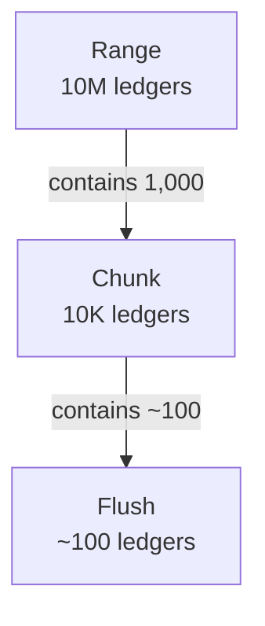

- **Range** controls the lifecycle: state machine transitions (`INGESTING → RECSPLIT_BUILDING → COMPLETE` in backfill, `ACTIVE → TRANSITIONING → COMPLETE` in streaming), RecSplit index builds, and range-level meta store state.
- **Chunk** controls file I/O and crash recovery: each chunk produces one LFS file and one raw txhash file (backfill). A chunk is the atomic unit — if either file is incomplete on crash, the whole chunk is rewritten.
- **Flush** controls memory: during backfill, accumulated data is flushed every ~100 ledgers to prevent unbounded RAM growth. Flushes are invisible to the state machine.

See the [Glossary](./README.md#glossary-of-terms) for full term definitions and [11-checkpointing-and-transitions.md](./11-checkpointing-and-transitions.md#key-constants) for the exact boundary math.

---

## System Components

The system has four components:

- Backfill and Streaming are **mutually exclusive** ingestion modes
- The Meta Store is shared by both
- The Query Layer is active only in Streaming mode

### 1. Backfill Mode

- Offline historical ingestion
- No RocksDB, no queries served
- Writes directly to immutable file formats

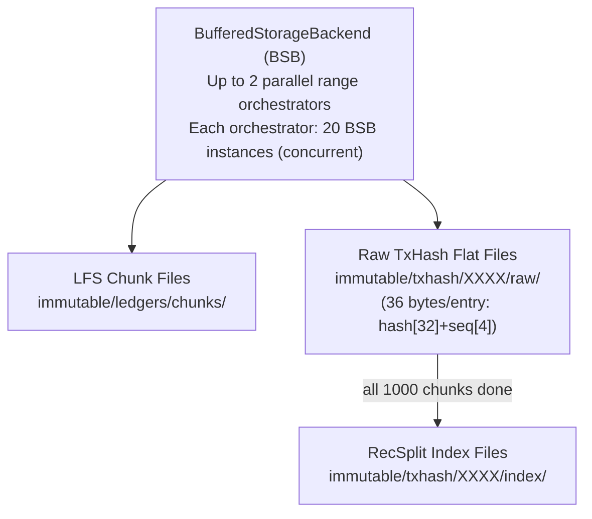

### 2. Streaming Mode

- Real-time ingestion via CaptiveStellarCore
- Writes to RocksDB, serves queries
- Transitions completed ranges to immutable storage

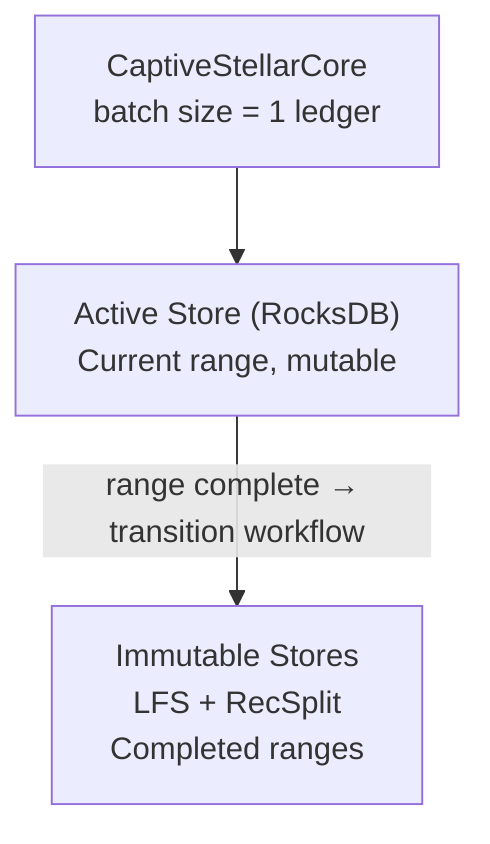

### 3. Meta Store

- Single RocksDB instance shared by both modes
- Source of truth for crash recovery

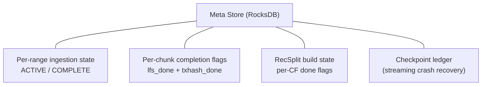

### 4. Query Layer (streaming mode only)

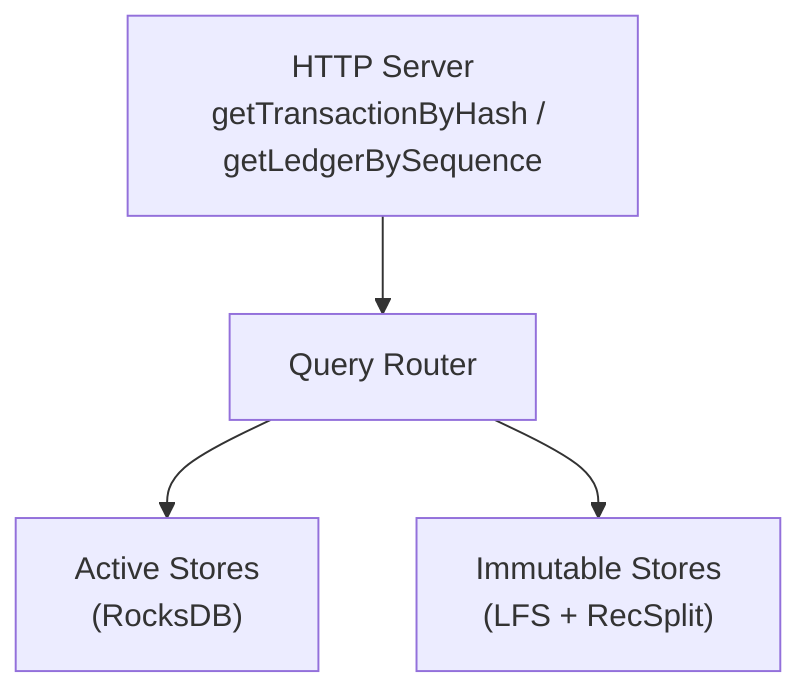

---

## Two Pipelines, Two Designs

Backfill is a bulk import job — it reads historical ledger data, writes immutable files, and exits. Streaming is a live daemon — it ingests one ledger at a time, serves queries, and runs forever. They share the output format (LFS + RecSplit) and the meta store, but no code or state.

| Dimension | Backfill | Streaming |
|-----------|----------|-----------|
| Data source | BufferedStorageBackend (GCS) or CaptiveStellarCore | CaptiveStellarCore only |
| RocksDB for ingestion | **No** — writes directly to files | **Yes** — active store per range |
| WAL concern | **None** — no RocksDB during ingestion | Required — crash recovery depends on WAL |
| Parallelism | Up to 2 range orchestrators; 20 BSB instances each (concurrent) | Single goroutine, 1 ledger/batch |
| Flush cadence | Every ~100 ledgers to file | Every ledger (checkpoint_interval = 1) |
| Queries | Not served | All endpoints available |
| Transition workflow | Direct-write (no active store to tear down) | Active RocksDB → LFS + RecSplit |
| Crash recovery | Chunk-level granularity; re-run from first incomplete chunk | Ledger-level; resume from `last_committed_ledger + 1` |
| Process lifecycle | Exits when all ranges complete | Long-running daemon |

---

## Store Types

### Active Store (streaming mode only)

**Two separate RocksDB instances** per range being ingested in streaming mode:

- **Ledger store** (`<active_stores_base_dir>/ledger-store-chunk-{chunkID:06d}/`) — default CF only. Key: `uint32BE(ledgerSeq)`, Value: `zstd(LedgerCloseMeta)`. One RocksDB instance per 10K-ledger chunk; transitions independently at every chunk boundary (active → transitioning → LFS flush → close + delete).
- **TxHash store** (`<active_stores_base_dir>/txhash-store-range-{rangeID:04d}/`) — 16 column families, one per first hex character of the txhash (`0`–`f`). Key: `txhash[32]`, Value: `uint32BE(ledgerSeq)`. CF routing: first hex char of the 64-char hash string (equivalently `txhash[0] >> 4` on raw bytes). One RocksDB instance per 10M-ledger range; transitions at range boundary.

**Each sub-flow can have at most 1 active store and 1 transitioning store at any point in time:**

| Sub-flow | Transition cadence | Max active | Max transitioning | Max total |
|----------|-------------------|------------|-------------------|-----------|
| Ledger | Every 10K ledgers (chunk boundary) | 1 | 1 | 2 |
| TxHash | Every 10M ledgers (range boundary) | 1 | 1 | 2 |

The ledger store transitions at every 10K-ledger chunk boundary: `SwapActiveLedgerStore` moves the old store to `transitioningLedgerStore`, a background goroutine flushes it to LFS, then `CompleteLedgerTransition` closes and deletes it. The txhash store transitions at every 10M-ledger range boundary via `PromoteToTransitioning`. **The ledger store has no column families** — it uses only the default CF.

### Immutable Stores (both modes)

**LFS (Ledger File Store)** — chunk files, 10K ledgers each:
- Path: `immutable/ledgers/chunks/XXXX/YYYYYY.data` + `.index`
- Data: individually zstd-compressed `LedgerCloseMeta` records
- Written per chunk (10K ledgers) during ingestion

**RecSplit Index** — minimal perfect hash, 16 column family files sharded by the first hex character of the txhash (`0`–`f`):
- Path: `immutable/txhash/XXXX/index/cf-{0..f}.idx`
- Built once per range, after all 1000 chunk raw txhash flat files are written
- Build time: ~4 hours per range
- Space efficiency: **~4.5 bytes/entry** vs 36 bytes/entry in RocksDB (~90% reduction). See [12-metrics-and-sizing.md](./12-metrics-and-sizing.md#space-efficiency-rocksdb--immutable) for full compression ratios.

> **Open question — RecSplit sharding**: The 16-shard design is a parallelism optimization (each shard builds in ~45 minutes vs ~7 hours for a single index). Research is underway to make single-index builds fast enough to eliminate sharding entirely, which would simplify file management, query routing, and crash recovery. See [14-open-questions.md — OQ-5](./14-open-questions.md#oq-5-recsplit-sharding--16-files-vs-single-index).

**Raw TxHash Flat Files** (intermediate, backfill only — never created during streaming):
- Path: `immutable/txhash/XXXX/raw/YYYYYY.bin`
- Format: `[txhash[32] || ledgerSeq[4]]` repeated, 36 bytes per entry
- Written per chunk during backfill ingestion; consumed by RecSplit builder at range completion; **deleted immediately after all 16 RecSplit CFs are built and verified**
- A range in state `COMPLETE` has no `raw/` directory

### Meta Store

Single RocksDB instance tracking state for both modes. Stores:
- Per-range ingestion state (ACTIVE / COMPLETE)
- Per-chunk sub-workflow completion flags
- RecSplit build state per range
- Checkpoint ledger for streaming crash recovery

See [02-meta-store-design.md](./02-meta-store-design.md) for full key hierarchy.

> **See also**: [09-directory-structure.md](./09-directory-structure.md) for the on-disk directory layout and path formulas. [12-metrics-and-sizing.md](./12-metrics-and-sizing.md) for storage estimates per range.

---

## Ingestion Hierarchy (Backfill)

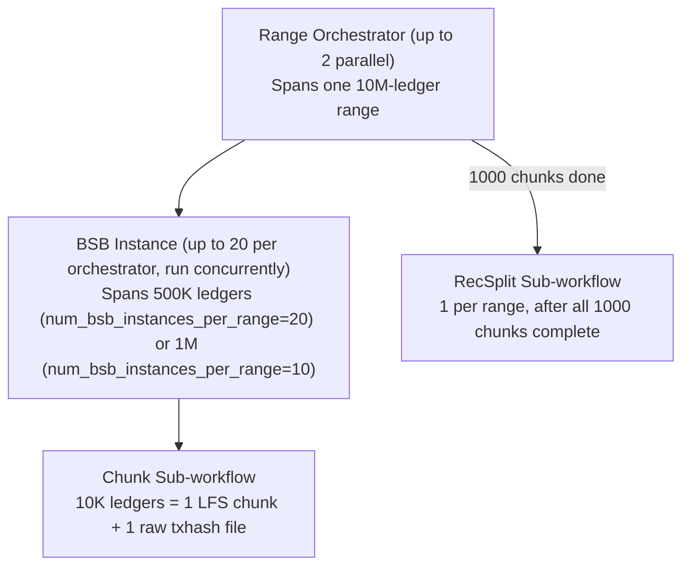

**Key numbers** (default config, 20 BSB instances per orchestrator):
- Range size: 10M ledgers
- BSB instance size: 500K ledgers (10M ÷ 20)
- Chunks per BSB instance: 50 (500K ÷ 10K)
- Chunks per range: 1,000
- Total BSBs in flight (2 orchestrators × 20): up to 40

---

## Data Flow Summary

### Backfill

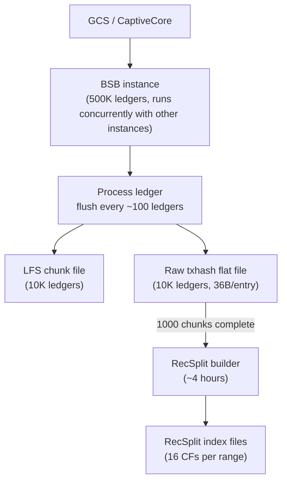

### Streaming

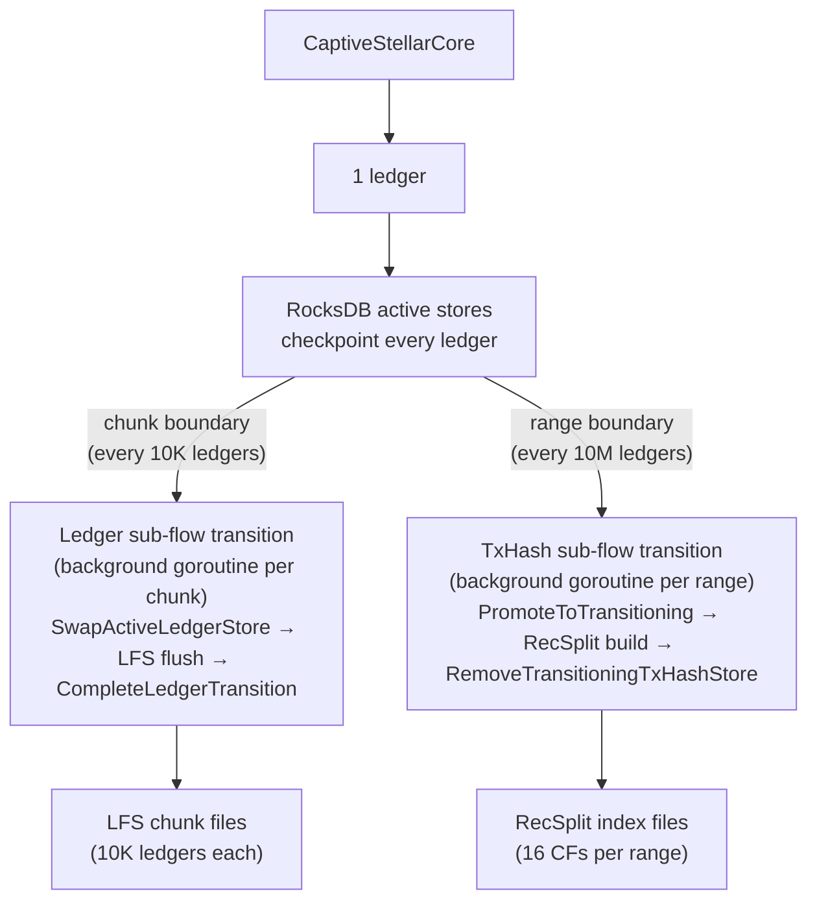

---

## Hardware Requirements

See [12-metrics-and-sizing.md](./12-metrics-and-sizing.md#hardware-requirements) for CPU, RAM, disk, and network requirements.

---

## Recommended Reading Order

1. **This document** — system-level mental model
2. [09-directory-structure.md](./09-directory-structure.md) — concrete on-disk layout
3. [10-configuration.md](./10-configuration.md) — TOML reference
4. [03-backfill-workflow.md](./03-backfill-workflow.md) — backfill ingestion details
5. [04-streaming-workflow.md](./04-streaming-workflow.md) — streaming ingestion details
6. [05-backfill-transition-workflow.md](./05-backfill-transition-workflow.md) — RecSplit build for backfill
7. [06-streaming-transition-workflow.md](./06-streaming-transition-workflow.md) — active→immutable for streaming
8. [07-crash-recovery.md](./07-crash-recovery.md) — failure scenarios
9. [08-query-routing.md](./08-query-routing.md) — query dispatch logic
10. [02-meta-store-design.md](./02-meta-store-design.md) — meta store key hierarchy (reference)
11. [11-checkpointing-and-transitions.md](./11-checkpointing-and-transitions.md) — math invariants (reference)

---

## Backfill Transition (Summary)

The backfill transition is a **RecSplit index build**, not a store conversion. There is no active RocksDB to tear down — the raw txhash flat files written per-chunk during ingestion are the sole input.

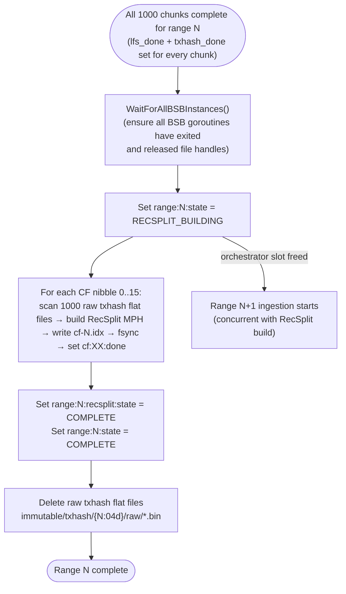

**Key facts**:
- Input: `immutable/txhash/{N:04d}/raw/{chunkID:06d}.bin` (36 bytes/entry: hash[32]+seq[4])
- Crash recovery: per-CF granularity — `cf:XX:done` flags; at most 1/16th of work re-done
- Raw files are NOT deleted until all 16 CFs are built
- Duration: ~4 hours per range

See [05-backfill-transition-workflow.md](./05-backfill-transition-workflow.md) for full details.

---

## Streaming Transition (Summary)

The streaming transition operates as **two independent sub-flow transitions at different cadences**, not a single combined workflow at the range boundary.

**Ledger sub-flow** (every 10K ledgers — chunk boundary): During ACTIVE, at each chunk boundary `SwapActiveLedgerStore` moves the old ledger store to `transitioningLedgerStore`. A background goroutine reads 10K ledgers from it, writes LFS `.data` + `.index` files, fsyncs, sets `lfs_done`, then calls `CompleteLedgerTransition` to close and delete it. By the time the range boundary is reached, all 1,000 ledger stores have been individually transitioned to LFS and deleted.

**TxHash sub-flow** (every 10M ledgers — range boundary): At the range boundary, the system waits for the last chunk's ledger transition to complete (`waitForLedgerTransitionComplete`), verifies all 1,000 `lfs_done` flags, then promotes the txhash store to `transitioningTxHashStore` via `PromoteToTransitioning`. A background goroutine builds 16 RecSplit CFs from the transitioning txhash store, verifies, sets `COMPLETE`, and calls `RemoveTransitioningTxHashStore` to close and delete it.

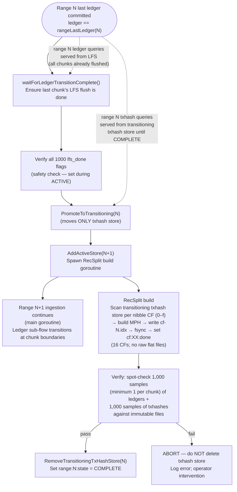

**Key facts**:
- **No "Phase 1" at range boundary** — all LFS chunk files are written at their individual chunk boundaries during ACTIVE, not at transition time
- RecSplit is built directly from the transitioning txhash store (no raw flat files produced)
- The transitioning txhash store remains open for queries throughout the RecSplit build; not deleted until verification passes
- Crash recovery: `lfs_done` flags (set during ACTIVE) + `cf:XX:done` flags; WAL ensures txhash store survives crash

See [06-streaming-transition-workflow.md](./06-streaming-transition-workflow.md) for full details.

---

## Transition Workflow Comparison

| Dimension | Backfill Transition | Streaming Transition |
|-----------|---------------------|----------------------|
| Trigger | All 1000 chunks complete (`lfs_done` + `txhash_done` set for all) | Range boundary ledger committed to active store |
| Input | Raw txhash flat files (`immutable/txhash/{N}/raw/`) | Two active RocksDB stores: ledger store (default CF) + txhash store (16 CFs) |
| Execution context | Orchestrator goroutine (sequential per range, then frees slot) | Background goroutine (concurrent with next range ingestion) |
| LFS chunks | Written by chunk sub-workflow during ingestion | Flushed individually at each chunk boundary during ACTIVE (via `SwapActiveLedgerStore` + background LFS flush + `CompleteLedgerTransition`); all 1,000 chunks complete before range boundary |
| RecSplit input | 1000 raw flat files scanned per nibble | Transitioning txhash store CF scan per nibble (no raw flat files) |
| Raw txhash flat files | Produced, consumed, then deleted post-RecSplit | Not produced |
| Active store teardown | Not applicable (no active store in backfill) | Only txhash store deleted after RecSplit verification passes (ledger stores already deleted at chunk boundaries) |
| Live queries during transition | Not applicable (no query layer in backfill) | Ledger queries → LFS; txhash queries → transitioning txhash store until `state = COMPLETE` |
| Crash recovery granularity | Per-CF (`cf:XX:done` flags) | Per-chunk + per-CF (`lfs_done` + `cf:XX:done` flags) |
| Duration | ~4 hours (RecSplit build only) | RecSplit build (~4 hours) + verification; LFS chunk writes happen during ACTIVE, not at transition time |

> **Deep dives**: [05-backfill-transition-workflow.md](./05-backfill-transition-workflow.md) covers the RecSplit build from raw flat files, per-CF tracking, and async overlap with the next range. [06-streaming-transition-workflow.md](./06-streaming-transition-workflow.md) covers the ledger and txhash sub-flow transitions, background goroutines, and store deletion.

---

## Crash & Recovery Level-Set

Both modes use the meta store as the source of truth for crash recovery. WAL is **never disabled** for meta store writes — this is a hard invariant.

### Backfill Crash Recovery

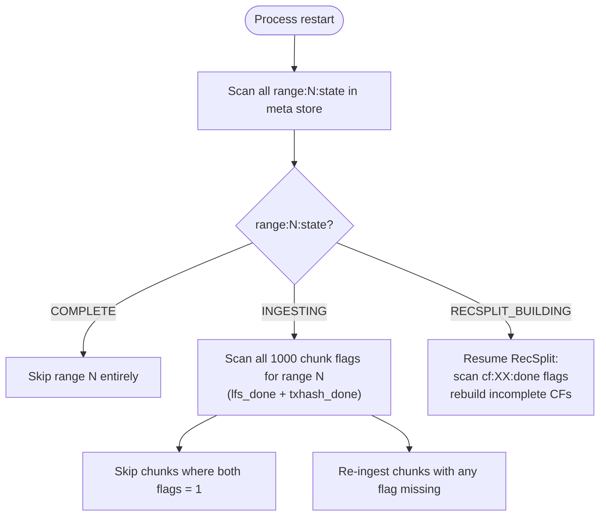

**Resume rule**: restart from first incomplete chunk. Completed chunks (both `lfs_done` and `txhash_done` set after fsync) are never re-ingested. BSB instances resume independently — non-contiguous completion is safe.

### Streaming Crash Recovery

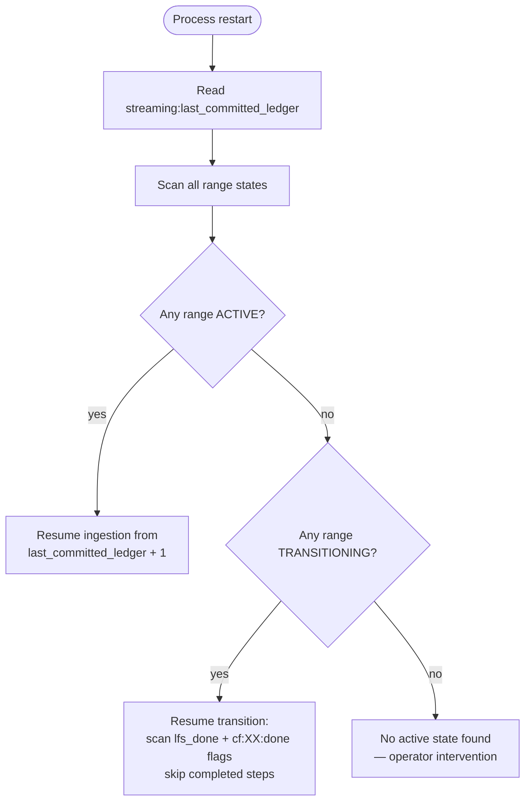

**Resume rule**: streaming always resumes from `last_committed_ledger + 1`. The active RocksDB stores are WAL-backed — all committed ledgers survive a crash. During ACTIVE, ledger stores are individually transitioned and deleted at chunk boundaries; the txhash store remains. During TRANSITIONING, only the txhash store exists (all ledger stores already deleted). The transition workflow resumes mid-flight using `lfs_done` + `cf:XX:done` flags; the transitioning txhash store is not deleted until RecSplit verification passes.

**Expectations**:
- Backfill: operator re-runs same command; idempotent by design. Expect ≤1 chunk (~100 ledgers) lost per BSB instance on crash.
- Streaming: daemon restarts; expect ≤1 ledger lost (the uncommitted ledger at crash time). No data loss for committed ledgers.

See [07-crash-recovery.md](./07-crash-recovery.md) for all 6 crash scenarios with detailed decision trees.

> **See also**: [02-meta-store-design.md](./02-meta-store-design.md#durability-guarantees) for the meta store durability guarantees and flag semantics. [11-checkpointing-and-transitions.md](./11-checkpointing-and-transitions.md) for the boundary formulas that determine when transitions trigger.

---

## getEvents — Placeholder

`getEvents` is **not yet designed**. Placeholders are maintained across all workflow documents to reserve implementation space and ensure the state machine, meta store key hierarchy, and transition diagrams are extended correctly when the feature is added.

| Document | Placeholder Location | What Will Be Added |
|----------|---------------------|-------------------|
| [03-backfill-workflow.md](./03-backfill-workflow.md) | `## getEvents Immutable Store — Placeholder` | Events flat file write per chunk during ingestion |
| [04-streaming-workflow.md](./04-streaming-workflow.md) | `## getEvents Immutable Store — Placeholder` | Per-ledger event writes to separate active events RocksDB store |
| [05-backfill-transition-workflow.md](./05-backfill-transition-workflow.md) | `## getEvents Immutable Store — Placeholder` | Phase 3: events index build from per-chunk event files |
| [06-streaming-transition-workflow.md](./06-streaming-transition-workflow.md) | `## getEvents Immutable Store — Placeholder` | Events sub-flow as independent transition at chunk cadence during ACTIVE |
| [07-crash-recovery.md](./07-crash-recovery.md) | `## getEvents Immutable Store — Placeholder` | Recovery cases for events index build |

**When `getEvents` is implemented**:
- Range state machine extends: `INGESTING → RECSPLIT_BUILDING → EVENTS_INDEX_BUILDING → COMPLETE`
- Transitioning txhash store (streaming) is NOT deleted until RecSplit + events index all complete
- Raw events files (backfill) are NOT deleted until events index is complete
- New meta store keys: `range:N:events_index:state` and per-partition done flags

---

## Future Design Considerations

### RecSplit: Single Index vs 16 Shards

The current 16-shard RecSplit design exists for build parallelism (~45 minutes per shard vs ~7 hours for a single index of ~3 billion entries). If single-index build times can be reduced below ~1 hour, the design may pivot to one RecSplit file per range. This change is isolated to the txhash sub-workflow — it does not affect the two-pipeline architecture, the data hierarchy, the LFS ledger store, or the meta store key model for ranges and chunks. See [14-open-questions.md — OQ-5](./14-open-questions.md#oq-5-recsplit-sharding--16-files-vs-single-index) for the full trade-off analysis.

### Pre-Created Archives as Alternative Backfill Source

A potential third backfill mode: download pre-built immutable archives (LFS chunks + RecSplit indexes) from S3/GCS instead of ingesting from scratch. This would skip the entire ingestion + transition pipeline, reducing backfill from days/weeks to a network-bound download + verify operation (potentially 10–100x faster).

**Nothing changes for existing backfill.** The BSB and CaptiveCore backfill paths remain identical. Archive-based backfill would be a separate code path selected by configuration (e.g., `[backfill.archive]`). Meta store changes would be **additive only** — a simpler set of per-range download tracking keys, since there is no per-chunk ingestion to track. The existing key hierarchy (range state, chunk flags, RecSplit CF flags) is unaffected.

See [14-open-questions.md — OQ-6](./14-open-questions.md#oq-6-pre-created-archives-as-alternative-backfill-source) for the full trade-off analysis.

---

## Key Invariants

1. **No RocksDB during backfill ingestion** — data is written directly to LFS chunks and raw txhash flat files.
2. **Flush every ~100 ledgers** — never accumulate more than ~100 ledgers in RAM during backfill.
3. **RecSplit built at range granularity** — triggered only after all 1,000 chunk sub-workflows for a range are complete.
4. **RecSplit runs async with next range** — while RecSplit builds (~4 hours), the orchestrator moves on to ingest the next range.
5. **Backfill and streaming transitions are separate** — no shared transition workflow exists.
6. **No queries during backfill** — process exits when all requested ranges complete.
7. **Range boundaries inclusive** — Range N = ledgers `(N×10M)+2` to `((N+1)×10M)+1` inclusive.
8. **Chunk boundaries align to ranges** — Range N spans exactly chunks `N×1000` through `(N×1000)+999`.
9. **BSB instances run in parallel** — all 20 BSB instances within a range start concurrently; completed chunks are non-contiguous at crash time; recovery scans all 1,000 chunk flag pairs.
10. **WAL is never disabled for meta store writes** — the meta store WAL is required for crash recovery; `DisableWAL(true)` is forbidden for any meta store operation in either mode.
11. **Transitioning stores are never deleted until verification passes** — the transitioning txhash store remains open for queries and as a recovery source until all `cf:XX:done` flags are set and spot-check verification succeeds. Ledger stores are deleted individually at chunk boundaries during ACTIVE after their LFS flush completes and `lfs_done` is set.
12. **`getEvents` is a placeholder everywhere** — no events indexing is implemented; all workflow docs carry an explicit placeholder section to track where implementation will hook in.
