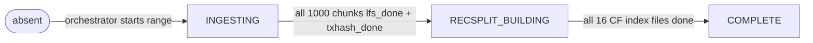
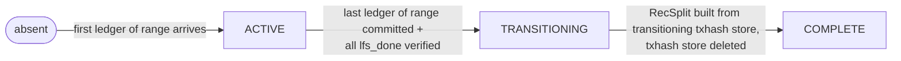

# Meta Store Design

## Overview

The meta store is a single RocksDB instance that tracks state for both backfill and streaming modes. It is the authoritative source for: which ranges exist, what state each range is in, per-chunk sub-workflow completion, RecSplit build state, and the streaming checkpoint ledger for crash recovery.

The meta store does **not** track a global operating mode. Mode is determined by startup flags (`--mode backfill` vs `--mode streaming`), not meta store contents.

**WAL invariant**: The meta store RocksDB instance **always has WAL enabled**. This is non-negotiable. All writes to the meta store — chunk flags (`lfs_done`, `txhash_done`), range state transitions, RecSplit CF done flags, and the streaming checkpoint key — are only considered durable after the WAL entry for that write has been fsynced to disk. A flag is never treated as set unless the WAL write succeeded. Disabling WAL for the meta store would invalidate the entire crash recovery model: flags that appear set in the RocksDB MemTable but not yet in WAL would be lost on a crash, causing chunks to be silently skipped on resume despite being only partially written.

---

## Durability Guarantees

| Operation | Durability Basis |
|-----------|-----------------|
| `lfs_done = "1"` | Written to meta store with WAL; only written **after** the LFS `.data` + `.index` files are fsynced to disk |
| `txhash_done = "1"` | Written to meta store with WAL; only written **after** the txhash `.bin` file is fsynced to disk |
| `recsplit:cf:XX:done = "1"` | Written to meta store with WAL; only written **after** the CF index file is fsynced |
| `range:N:state = "RECSPLIT_BUILDING"` | Written to meta store with WAL after all 1000 chunk flags confirm completion |
| `range:N:state = "COMPLETE"` | Written to meta store with WAL after all 16 CF done flags confirm completion |
| `streaming:last_committed_ledger` | Written to meta store with WAL after the ledger's RocksDB WriteBatch (also WAL-backed) succeeds |

**Consequence**: Any crash between a file fsync and the subsequent meta store WAL write leaves the file on disk with no flag set. On resume, the absent flag triggers a full rewrite of that chunk — the file may be partial and is truncated/overwritten. This is safe and correct by design.

---

## Key Hierarchy

All keys are plain strings. Values are encoded as specified per key. Keys are grouped by sub-workflow below — every key in the meta store is listed.

---

### Sub-workflow 1: Range State (Both Modes)

One key per range. Written when a range transitions between states.

| Key Pattern | Value Type | Written By | Written When |
|-------------|-----------|-----------|-------------|
| `range:{N:04d}:state` | enum string (see [Range State Enum](#range-state-enum)) | Orchestrator or streaming loop | At every state transition: absent→INGESTING, INGESTING→RECSPLIT_BUILDING, RECSPLIT_BUILDING→COMPLETE, absent→ACTIVE, ACTIVE→TRANSITIONING, TRANSITIONING→COMPLETE |

**Examples**:
```
range:0000:state  →  "INGESTING"
range:0001:state  →  "RECSPLIT_BUILDING"
range:0002:state  →  "COMPLETE"
range:0003:state  →  "ACTIVE"
range:0004:state  →  "TRANSITIONING"
```

---

### Sub-workflow 2: Chunk Completion Flags (Backfill + Streaming)

Two keys per chunk. Written independently after each respective file fsync. There are 1,000 chunks per range; for Range N, chunks are numbered `N×1000` through `(N×1000)+999`.

| Key Pattern | Value Type | Written By | Written When |
|-------------|-----------|-----------|-------------|
| `range:{N:04d}:chunk:{C:06d}:lfs_done` | `"1"` or absent | BSB instance (backfill) or per-chunk ledger transition goroutine (streaming, at each chunk boundary during ACTIVE) | After LFS `.data` + `.index` files for chunk C are fsynced to disk |
| `range:{N:04d}:chunk:{C:06d}:txhash_done` | `"1"` or absent | BSB instance (backfill only) | After txhash `.bin` flat file for chunk C is fsynced to disk |

**`txhash_done` is backfill-only.** In streaming mode, txhash data goes directly into the txhash store (RocksDB, 16 CFs) — no raw flat files are produced, and `txhash_done` is never set for streaming ranges.

**`lfs_done` in streaming mode**: at each chunk boundary (every 10K ledgers), the ledger sub-flow transitions the active ledger store: the old store moves to `transitioningLedgerStore`, a background goroutine flushes its 10K ledgers to LFS chunk files, fsyncs, sets the `lfs_done` flag, then closes and deletes the transitioning store via `CompleteLedgerTransition`. This is the mandatory transition step, not a background optimization. By the time the range transitions to TRANSITIONING, **all** 1,000 `lfs_done` flags are set (the system verifies this at the range boundary before proceeding).

**Constraints**:
- Absent means either not started or incomplete — treated identically on resume (full rewrite of both files).
- `lfs_done` and `txhash_done` are written independently; however, a chunk is only skippable on resume when **both** flags are `"1"`. If either flag is absent, both files are rewritten from scratch.
- Flags are **never deleted or reset** once set to `"1"`.
- For chunk skip on resume (backfill), **both** flags must be `"1"`. For streaming, only `lfs_done` is written; a streaming chunk is LFS-complete when `lfs_done="1"`.

**Examples** (Range 0 = chunks 000000–000999, Range 1 = chunks 001000–001999, Range 5 = chunks 005000–005999, backfill):
```
range:0000:chunk:000000:lfs_done     →  "1"
range:0000:chunk:000000:txhash_done  →  "1"
range:0000:chunk:000001:lfs_done     →  "1"
range:0000:chunk:000001:txhash_done  →  absent    ← partial; txhash write not yet done
range:0000:chunk:000999:lfs_done     →  "1"       ← last chunk of range 0 (global ID 999)
range:0000:chunk:000999:txhash_done  →  "1"
range:0001:chunk:001000:lfs_done     →  "1"       ← first chunk of range 1 (global ID 1000)
range:0001:chunk:001000:txhash_done  →  "1"
range:0001:chunk:001500:lfs_done     →  absent    ← not yet reached
range:0001:chunk:001500:txhash_done  →  absent
range:0005:chunk:005000:lfs_done     →  "1"       ← first chunk of range 5 (global ID 5000)
range:0005:chunk:005000:txhash_done  →  "1"
range:0005:chunk:005500:lfs_done     →  "1"       ← mid-range chunk of range 5 (global ID 5500)
range:0005:chunk:005500:txhash_done  →  absent    ← partial; txhash write not yet done
range:0005:chunk:005999:lfs_done     →  absent    ← last chunk of range 5 (global ID 5999), not yet reached
range:0005:chunk:005999:txhash_done  →  absent
```

**Examples** (Streaming ACTIVE phase — ledger sub-flow transitions at each chunk boundary; note: no txhash_done keys for streaming ranges):
```
range:0000:chunk:000000:lfs_done  →  "1"   ← first chunk of range 0, flushed at chunk boundary
range:0000:chunk:000234:lfs_done  →  "1"   ← mid-range, set at chunk 234's boundary
range:0000:chunk:000235:lfs_done  →  absent ← not yet transitioned (current chunk still filling)
range:0000:chunk:000999:lfs_done  →  absent ← last chunk of range 0, not yet transitioned
range:0005:chunk:005000:lfs_done  →  "1"   ← first chunk of range 5 (global ID 5000)
range:0005:chunk:005234:lfs_done  →  "1"   ← mid-range 5, set at chunk 5234's boundary
range:0005:chunk:005999:lfs_done  →  absent ← last chunk of range 5 (global ID 5999), not yet transitioned
  (no txhash_done keys exist for streaming ranges)
```

> **getEvents placeholder**: A future `events_done` flag per chunk will be added here when `getEvents` immutable store support is designed. See [getEvents Immutable Store — Placeholder](#getevents-immutable-store--placeholder).

---

### Sub-workflow 3: RecSplit Build State (Backfill + Streaming Transition)

Two key types per range: one top-level state key and one done flag per column family (16 CFs total, one per first hex character of the txhash: `0`–`f`).

| Key Pattern | Value Type | Written By | Written When |
|-------------|-----------|-----------|-------------|
| `range:{N:04d}:recsplit:state` | enum string (see [RecSplit State Enum](#recsplit-state-enum)) | RecSplit builder goroutine | Set to `BUILDING` when RecSplit build starts; set to `COMPLETE` after all 16 CF index files are built and the range transitions to COMPLETE |
| `range:{N:04d}:recsplit:cf:{XX}:done` | `"1"` or absent | RecSplit builder goroutine | After CF index file for CF `XX` is fsynced to disk |

The CF segment `{XX}` in the key uses two-char zero-padded hex (`00`–`0f`) for lexicographic sort order in RocksDB. The corresponding CF names (and index file names) use single-char hex: `0`–`f`.

There are exactly **16 CF keys per range** (CF key suffixes `00`–`0f`, corresponding to CF names `0`–`f`):

```
range:{N:04d}:recsplit:cf:00:done   ← txhashes starting with 0x0...
range:{N:04d}:recsplit:cf:01:done   ← txhashes starting with 0x1...
range:{N:04d}:recsplit:cf:02:done
range:{N:04d}:recsplit:cf:03:done
range:{N:04d}:recsplit:cf:04:done
range:{N:04d}:recsplit:cf:05:done
range:{N:04d}:recsplit:cf:06:done
range:{N:04d}:recsplit:cf:07:done
range:{N:04d}:recsplit:cf:08:done
range:{N:04d}:recsplit:cf:09:done
range:{N:04d}:recsplit:cf:0a:done
range:{N:04d}:recsplit:cf:0b:done
range:{N:04d}:recsplit:cf:0c:done
range:{N:04d}:recsplit:cf:0d:done
range:{N:04d}:recsplit:cf:0e:done
range:{N:04d}:recsplit:cf:0f:done
```

**Constraints**:
- `recsplit:state` is set to `BUILDING` before any CF is started; set to `COMPLETE` only after all 16 `cf:XX:done` flags are `"1"`.
- CF done flags are never deleted once set.
- On resume with `recsplit:state = BUILDING`, scan all 16 CF flags: built CFs are skipped; unbuilt CFs are rebuilt from raw txhash flat files.
- If all 16 CF flags are `"1"` but `recsplit:state` is still `BUILDING` (crash between last CF write and state update), the recovery logic detects the fully-set flags and completes the state transition without rebuilding.

**Examples** (range 0 mid-build, range 5 complete):
```
range:0000:recsplit:state        →  "BUILDING"
range:0000:recsplit:cf:00:done   →  "1"
range:0000:recsplit:cf:01:done   →  "1"
range:0000:recsplit:cf:02:done   →  "1"
range:0000:recsplit:cf:03:done   →  absent  ← crash before CF '3' started
range:0000:recsplit:cf:04:done   →  absent
...
range:0000:recsplit:cf:0f:done   →  absent

range:0005:recsplit:state        →  "COMPLETE"   ← range 5 fully done
range:0005:recsplit:cf:00:done   →  "1"
range:0005:recsplit:cf:01:done   →  "1"
...
range:0005:recsplit:cf:0f:done   →  "1"
```

---

### Sub-workflow 4: Streaming Checkpoint (Streaming Mode Only)

One global key, written on every ledger commit.

| Key Pattern | Value Type | Written By | Written When |
|-------------|-----------|-----------|-------------|
| `streaming:last_committed_ledger` | `uint32` big-endian 4 bytes | Streaming ingest loop | After every ledger is committed to the active RocksDB store and its WAL entry is synced |

**Constraints**:
- Never deleted; only overwritten.
- On crash, resume from `last_committed_ledger + 1`.
- If absent (process never committed a single ledger), resume from `startLedger` per config.

**Example**:
```
streaming:last_committed_ledger  →  [0x00, 0x98, 0x96, 0x81]   ← ledger 10,000,001
```

---

### Complete Key Count Per Range

For a fully-completed backfill range:

| Sub-workflow | Keys |
|-------------|------|
| Range state | 1 (`range:N:state`) |
| Chunk flags | 2,000 (`lfs_done` + `txhash_done` × 1,000 chunks) |
| RecSplit state | 1 (`recsplit:state`) |
| RecSplit CF flags | 16 (`recsplit:cf:00:done` … `recsplit:cf:0f:done`) |
| **Total per range** | **2,018** |

For a streaming range at steady state (ACTIVE):

| Sub-workflow | Keys |
|-------------|------|
| Range state | 1 (`range:N:state = "ACTIVE"`) |
| Chunk flags | 0–1,000 `lfs_done` keys (set at each chunk boundary as the ledger sub-flow transitions — this is the mandatory transition step, not a background optimization); no `txhash_done` keys in streaming |
| Streaming checkpoint | 1 (`streaming:last_committed_ledger`) |
| **Total active range** | **2 to 1,002** (grows as chunks transition at their boundaries) |

---

## Range State Enum

| State | Description | Next State |
|-------|-------------|------------|
| `INGESTING` | Ledger data being written to LFS chunks + raw txhash files | `RECSPLIT_BUILDING` (when all 1000 chunks complete) |
| `RECSPLIT_BUILDING` | RecSplit index being built from raw txhash flat files | `COMPLETE` |
| `COMPLETE` | All LFS chunks written, RecSplit index built and verified, raw txhash flat files deleted | Terminal |

**Streaming-only states** (range goes through active RocksDB):

| State | Description | Next State |
|-------|-------------|------------|
| `ACTIVE` | Range being ingested into RocksDB active stores; ledger sub-flow transitions at each chunk boundary (LFS flush + `lfs_done` set) | `TRANSITIONING` (at range boundary, after all `lfs_done` flags verified) |
| `TRANSITIONING` | All LFS chunks already written during ACTIVE; transitioning txhash store used for RecSplit build | `COMPLETE` |
| `COMPLETE` | LFS + RecSplit written; transitioning txhash store deleted via `RemoveTransitioningTxHashStore` | Terminal |

---

## RecSplit State Enum

| State | Description |
|-------|-------------|
| `PENDING` | Not started (or key absent — treat as PENDING) |
| `BUILDING` | RecSplit build in progress; per-CF `done` keys track progress |
| `COMPLETE` | All 16 CF index files built and verified |

---

## Range ID Formulas

```go
const (
    FirstLedger = 2
    RangeSize   = 10_000_000
    ChunkSize   = 10_000
)

func ledgerToRangeID(ledgerSeq uint32) uint32 {
    return (ledgerSeq - FirstLedger) / RangeSize
}

func rangeFirstLedger(rangeID uint32) uint32 {
    return (rangeID * RangeSize) + FirstLedger
}

func rangeLastLedger(rangeID uint32) uint32 {
    return ((rangeID + 1) * RangeSize) + FirstLedger - 1
}

func ledgerToChunkID(ledgerSeq uint32) uint32 {
    return (ledgerSeq - FirstLedger) / ChunkSize
}

func chunkFirstLedger(chunkID uint32) uint32 {
    return (chunkID * ChunkSize) + FirstLedger
}

func chunkLastLedger(chunkID uint32) uint32 {
    return ((chunkID + 1) * ChunkSize) + FirstLedger - 1
}

func chunkToRangeID(chunkID uint32) uint32 {
    return chunkID / (RangeSize / ChunkSize)  // chunkID / 1000
}
```

**Quick reference**:

| RangeID | First Ledger | Last Ledger | Chunks |
|---------|-------------|------------|--------|
| 0 | 2 | 10,000,001 | 0–999 |
| 1 | 10,000,002 | 20,000,001 | 1000–1999 |
| 2 | 20,000,002 | 30,000,001 | 2000–2999 |
| N | (N×10M)+2 | ((N+1)×10M)+1 | N×1000–(N×1000)+999 |

---

## State Machine Diagrams

### Backfill Range State Machine



### Streaming Range State Machine



---

## Scenario Walkthroughs

### Scenario 1: Backfill — Normal Completion (Range 0)

```
Startup:
  range:0000:state  →  absent  (range 0 not yet started)

Orchestrator starts range 0:
  range:0000:state  →  "INGESTING"

Chunk 0 completes (ledgers 2–10,001):
  range:0000:chunk:000000:lfs_done     →  "1"
  range:0000:chunk:000000:txhash_done  →  "1"

... (chunks 1–998 complete similarly) ...

Chunk 999 completes (ledgers 9,990,002–10,000,001):
  range:0000:chunk:000999:lfs_done     →  "1"
  range:0000:chunk:000999:txhash_done  →  "1"

All 1000 chunks done → trigger RecSplit:
  range:0000:state  →  "RECSPLIT_BUILDING"
  range:0000:recsplit:state  →  "BUILDING"

RecSplit CF 0 completes:
  range:0000:recsplit:cf:00:done  →  "1"

... (CFs 1–14 complete) ...

RecSplit CF 15 completes:
  range:0000:recsplit:cf:0f:done  →  "1"

All 16 CFs done:
  range:0000:recsplit:state  →  "COMPLETE"
  range:0000:state           →  "COMPLETE"
```

### Scenario 2: Backfill — Crash Mid-Range, Non-Contiguous State (Resume)

This scenario illustrates the expected crash state when 20 BSB instances run concurrently. Completed chunks are NOT contiguous — instance 3 (chunks 150–199) may have finished all 50 chunks while instance 0 (chunks 0–49) only completed 9.

```
State at crash (20 BSB instances were running concurrently):
  range:0000:state  →  "INGESTING"

  BSB instance 0 (chunks 0–49): crashed mid-way
    range:0000:chunk:000000:lfs_done     →  "1"
    range:0000:chunk:000000:txhash_done  →  "1"
    ...
    range:0000:chunk:000008:lfs_done     →  "1"
    range:0000:chunk:000008:txhash_done  →  "1"
    range:0000:chunk:000009:lfs_done     →  absent  ← crashed mid-write
    range:0000:chunk:000009:txhash_done  →  absent

  BSB instance 3 (chunks 150–199): completed all 50 chunks before crash
    range:0000:chunk:000150:lfs_done     →  "1"
    range:0000:chunk:000150:txhash_done  →  "1"
    ...
    range:0000:chunk:000199:lfs_done     →  "1"
    range:0000:chunk:000199:txhash_done  →  "1"

  BSB instance 7 (chunks 350–399): partially complete
    range:0000:chunk:000350:lfs_done     →  "1"
    range:0000:chunk:000350:txhash_done  →  "1"
    range:0000:chunk:000351:lfs_done     →  "1"
    range:0000:chunk:000351:txhash_done  →  absent  ← txhash not yet fsynced

  All other BSB instances (chunks 50–149, 200–349, 400–999): absent (not yet started)

On restart (scan ALL 1000 chunk flag pairs):
  - Chunks 0–8: both flags "1" → skip
  - Chunk 9: missing lfs_done → rewrite from scratch (both LFS + txhash)
  - Chunks 10–149: absent → write fresh
  - Chunks 150–199: both flags "1" → skip (non-contiguous island — this is normal)
  - Chunks 200–349: absent → write fresh
  - Chunk 350: both flags "1" → skip
  - Chunk 351: lfs_done "1" but txhash_done absent → full rewrite of both LFS and txhash files
  - Chunks 352–999: absent → write fresh
```

**Key insight**: The "scan all 1000 chunk flag pairs" rule exists specifically to handle this non-contiguous pattern. If recovery only scanned up to the first incomplete chunk, it would miss the completed work in chunks 150–199 and 350.

### Scenario 3: Streaming — Range Transition

```
Streaming is in range 1 (ledgers 10,000,002–20,000,001):
  range:0000:state  →  "COMPLETE"    (already transitioned)
  range:0001:state  →  "ACTIVE"
  streaming:last_committed_ledger  →  15,000,001

  Ledger sub-flow has transitioned some chunks at their boundaries during ACTIVE:
  range:0001:chunk:001000:lfs_done  →  "1"   ← chunk 0 of range 1
  range:0001:chunk:001001:lfs_done  →  "1"
  range:0001:chunk:001499:lfs_done  →  "1"
  range:0001:chunk:001500:lfs_done  →  absent ← not yet flushed (current chunk)
  (no txhash_done keys — streaming only)

Ledger 20,000,001 arrives (last ledger of range 1):
  Write to active ledger store (default CF) for range 1
  Write to active txhash store (CF for nibble) for range 1
  Update: streaming:last_committed_ledger  →  20,000,001

  Range boundary handling:
  1. waitForLedgerTransitionComplete() — wait for last chunk's LFS flush to finish
  2. Verify all 1,000 lfs_done flags for range 1 are set (safety check)
  3. Update: range:0001:state  →  "TRANSITIONING"
  4. PromoteToTransitioning(1) — moves ONLY txhash store to transitioning
  5. Create new active ledger store + txhash store for range 2
  6. Update: range:0002:state  →  "ACTIVE"
  7. Spawn background goroutine: RecSplit build from transitioning txhash store

Background goroutine completes range 1 transition:
  All 1,000 lfs_done flags were already set during ACTIVE
  (each chunk boundary triggered its own ledger sub-flow transition).
  Only RecSplit build remains: builds 16 CFs from transitioning txhash store.
  range:0001:recsplit:state  →  "BUILDING"
  ... (16 CF done flags set as each CF completes) ...
  range:0001:recsplit:state  →  "COMPLETE"
  range:0001:state  →  "COMPLETE"
  (Transitioning txhash store deleted via RemoveTransitioningTxHashStore;
   ledger stores were already deleted at their chunk boundaries during ACTIVE)
```

### Scenario 4: Streaming — Crash Recovery

```
State at crash:
  streaming:last_committed_ledger  →  14,999,001

On restart:
  Resume from ledger 14,999,002
  Range 1 active store still intact (WAL ensures durability)
  Ledgers 14,999,002 onward re-written (idempotent)
```

---

## Design Decisions

**No `global:mode` key**: Mode is determined by startup flags. The meta store never needs to know the current mode.

**No `transitioning/` directory**: Streaming transition state is tracked entirely via `range:{N}:state = "TRANSITIONING"`. The query router reads this key to decide routing. No filesystem directory is created or deleted.

**Per-chunk flags (not per-BSB-instance flags)**: All 20 BSB instances run concurrently within a range. Each instance owns 50 chunks, but instances make independent progress and crash independently. At crash time, completed chunks form non-contiguous islands — instance 3 might have all 50 of its chunks done while instance 0 only has 9. Tracking completion at the BSB-instance level would lose this per-chunk granularity. Per-chunk flags (`lfs_done`, `txhash_done`) handle every possible completion pattern regardless of which instance completed which chunks, and enable selective skip on resume (completed chunks are never rewritten). The resume rule scans all 1,000 chunk flag pairs — not just up to the first incomplete one — because gaps are expected and normal.

**Chunk flags are never deleted**: Once `lfs_done` or `txhash_done` is set to `"1"`, it is permanent. This enables idempotent resumption.

**Checkpoint data is never deleted**: `streaming:last_committed_ledger` is only overwritten, never deleted. It represents the last safely durable ledger for streaming crash recovery.

**RecSplit CF granularity**: Each of the 16 CFs is tracked independently. If RecSplit build crashes after writing CFs 0–7, resume skips those and builds only 8–15.

**No orchestrator-assignment keys**: The meta store does **not** track which orchestrator owns which range. With `parallel_ranges=2`, Orchestrator 0 processes Range N and Orchestrator 1 processes Range N+1, but this assignment is not persisted. On restart, any range in a non-`COMPLETE` state is simply assigned to a fresh orchestrator goroutine. This is safe because **the per-chunk flags are the atomic recovery unit** — not orchestrator identity. An orchestrator that crashed mid-chunk leaves the chunk flag absent; a fresh orchestrator on restart will detect the absent flag and redo the chunk regardless of which goroutine originally started it. Persisting orchestrator-to-range assignment would add state with no recovery value: the assignment is deterministic and re-derivable from range state at startup.

---

## getEvents Immutable Store — Placeholder

> **Status**: Not yet designed. This section reserves space for future work.

When `getEvents` support is added, it will require:

- A new per-chunk completion flag alongside `lfs_done` and `txhash_done`:
  ```
  range:{rangeID:04d}:chunk:{chunkID:06d}:events_done
  ```
  Value: `"1"` when the events index for this chunk is fsynced; absent otherwise.

- A new range-level events index state key, analogous to `recsplit:state`:
  ```
  range:{rangeID:04d}:events_index:state
  range:{rangeID:04d}:events_index:cf:{cfIndex:02d}:done
  ```

- Extension of the chunk skip rule: a chunk is only skippable on resume when **all** flags are set (`lfs_done = "1"` AND `txhash_done = "1"` AND `events_done = "1"`). Until then, the incomplete flag's sub-workflow is redone from scratch.

- Extension of the backfill range state machine: `INGESTING → RECSPLIT_BUILDING → EVENTS_INDEX_BUILDING → COMPLETE` (exact ordering TBD during design).

- Same fsync-before-flag invariant as existing flags: events data must be durably written before `events_done` is set.

The existing key hierarchy has been designed with this extension in mind. No schema migration to existing keys is expected.

---

## Related Documents

- [03-backfill-workflow.md](./03-backfill-workflow.md) — how the meta store is written during backfill
- [04-streaming-workflow.md](./04-streaming-workflow.md) — how `streaming:last_committed_ledger` is updated
- [05-backfill-transition-workflow.md](./05-backfill-transition-workflow.md) — RecSplit state transitions
- [06-streaming-transition-workflow.md](./06-streaming-transition-workflow.md) — ACTIVE→TRANSITIONING→COMPLETE
- [07-crash-recovery.md](./07-crash-recovery.md) — how all state keys are used for recovery
- [08-query-routing.md](./08-query-routing.md) — how range state drives query dispatch
