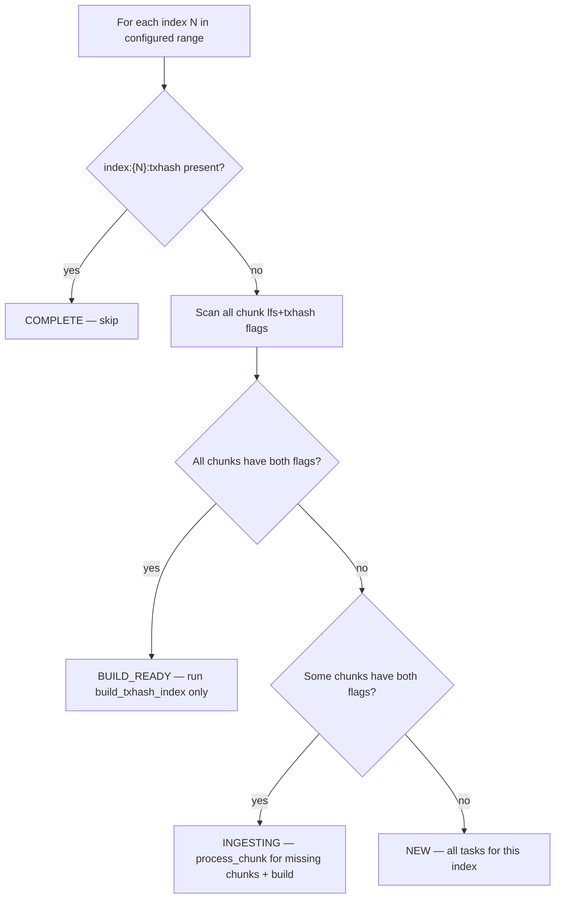

# Backfill Workflow

## Overview

Backfill ingests historical ledger data offline, writing directly to immutable formats (LFS chunk files + raw txhash flat files) without RocksDB active stores. The process is modeled as a **DAG of idempotent tasks** — built on startup, dispatched as dependencies are satisfied via a flat worker pool, and exits when all tasks complete.

Crash recovery rests on three invariants:

1. **Key implies durable file** — a meta store flag is set only after fsync; if the flag exists, the file is complete.
2. **Tasks are idempotent** — each task checks its outputs and skips what is already done.
3. **Startup rebuilds the full task graph** — completed tasks are no-ops; incomplete tasks redo their work.

Given a ledger range `[start_ledger, end_ledger]`, the backfill produces:
- **LFS chunk files** — for `getLedger` queries
- **RecSplit index files** — for `getTransaction` queries

Then cleans up all intermediate data. No query capability during backfill — the process serves only `getHealth` and `getStatus`.

---

## Geometry

The Stellar blockchain starts at ledger 2. Backfill organizes data into **chunks** (10K ledgers) grouped into **indexes** (configurable, default 1000 chunks = 10M ledgers).

| Concept | Size | Purpose |
|---------|------|---------|
| **Chunk** | 10,000 ledgers | Atomic unit of ingestion + crash recovery. One LFS file + one raw txhash flat file. |
| **Index** | `chunks_per_txhash_index` × 10K ledgers (default: 10M) | Grouping unit for RecSplit index builds. One index = one set of 16 RecSplit CF files. |

**ID formulas:**

```
chunk_id  = (ledger_seq - 2) / 10,000
index_id  = chunk_id / chunks_per_txhash_index
```

**Quick reference** (default `chunks_per_txhash_index = 1000`):

| Index ID | First Ledger | Last Ledger | Chunks |
|----------|-------------|------------|--------|
| 0 | 2 | 10,000,001 | 0–999 |
| 1 | 10,000,002 | 20,000,001 | 1000–1999 |
| 2 | 20,000,002 | 30,000,001 | 2000–2999 |
| N | (N × 10M) + 2 | ((N+1) × 10M) + 1 | N×1000 – (N×1000)+999 |

---

## Meta Store Keys

The meta store is a single RocksDB instance (WAL always enabled) that tracks completion state. It is the authoritative source for crash recovery — all resume decisions are made by reading keys from this store.

### Key Schema

There are exactly three key types for backfill:

| Key Pattern | Value | Written When |
|-------------|-------|-------------|
| `chunk:{C:010d}:lfs` | `"1"` | After LFS `.data` + `.index` files for chunk C are fsynced to disk |
| `chunk:{C:010d}:txhash` | `"1"` | After raw txhash `.bin` file for chunk C is fsynced to disk |
| `index:{N:010d}:txhash` | `"1"` | After all 16 CF RecSplit index files for index N are built and fsynced |

Values are `"1"` (retained for `ldb`/`sst_dump` readability); key presence is the signal. Key absence means not started or incomplete — treated identically on resume.

**Examples** (index 0 = chunks 0000000000–0000000999):
```
chunk:0000000000:lfs     →  "1"    ← chunk 0 LFS done
chunk:0000000000:txhash  →  "1"    ← chunk 0 txhash done
chunk:0000000001:lfs     →  "1"
chunk:0000000001:txhash  →  absent ← partial (LFS-first path on resume)
chunk:0000000999:txhash  →  "1"    ← chunk 999 done
index:0000000000:txhash  →  "1"    ← index 0 RecSplit complete
index:0000000001:txhash  →  absent ← index 1 not yet built
```

### Durability Guarantees

| Operation | Guarantee |
|-----------|-----------|
| `chunk:{C}:lfs = "1"` | Written after LFS `.data` + `.index` are fsynced |
| `chunk:{C}:txhash = "1"` | Written after txhash `.bin` is fsynced |
| Both chunk flags | Set in a single atomic RocksDB WriteBatch — no crash window where one is set without the other |
| `index:{N}:txhash = "1"` | Written after all 16 CF `.idx` files are fsynced |

**WAL invariant:** The meta store RocksDB always has WAL enabled. Disabling WAL would break the flag-after-fsync invariant and invalidate all crash recovery.

**Flags are never deleted** once set to `"1"`. Exception: `chunk:{C}:txhash` keys are deleted during cleanup after the RecSplit index is built (the raw `.bin` files they reference are also deleted).

### Key Lifecycle

```
process_chunk:        sets chunk:{C}:lfs + chunk:{C}:txhash (atomic WriteBatch)
build_txhash_index:   sets index:{N}:txhash
cleanup (within build): deletes chunk:{C}:txhash keys + raw .bin files
```

After a completed index, only `chunk:{C}:lfs` and `index:{N}:txhash` keys remain permanently.

---

## Directory Structure

All data lives under a configurable `data_dir`. Backfill writes only to `meta/` and `immutable/` — it never creates active store directories.

### Backfill File Tree

```
{data_dir}/
├── meta/
│   └── rocksdb/              ← Meta store (WAL always enabled)
│
└── immutable/
    ├── ledgers/
    │   └── chunks/
    │       ├── 0000/         ← Index 0: chunks 0–999
    │       │   ├── 000000.data
    │       │   ├── 000000.index
    │       │   ├── ...
    │       │   ├── 000999.data
    │       │   └── 000999.index
    │       └── 0001/         ← Index 1: chunks 1000–1999
    │           ├── 001000.data
    │           └── ...
    │
    └── txhash/
        ├── 0000/             ← Index 0
        │   ├── raw/          ← TRANSIENT: deleted after RecSplit build
        │   │   ├── 000000.bin
        │   │   └── ... (1000 files)
        │   ├── tmp/          ← TRANSIENT: RecSplit build scratch space
        │   └── index/        ← PERMANENT: 16 RecSplit CF files
        │       ├── cf-0.idx
        │       └── ... cf-f.idx
        └── 0001/
            └── ...
```

### Path Conventions

| File Type | Path Pattern | Example |
|-----------|-------------|---------|
| LFS data | `{ledgers_base}/chunks/{chunkID/1000:04d}/{chunkID:06d}.data` | `chunks/0000/000042.data` |
| LFS index | `{ledgers_base}/chunks/{chunkID/1000:04d}/{chunkID:06d}.index` | `chunks/0000/000042.index` |
| Raw txhash | `{txhash_base}/{indexID:04d}/raw/{chunkID:06d}.bin` | `txhash/0000/raw/000042.bin` |
| RecSplit CF | `{txhash_base}/{indexID:04d}/index/cf-{nibble}.idx` | `txhash/0000/index/cf-a.idx` |
| RecSplit tmp | `{txhash_base}/{indexID:04d}/tmp/cf-{nibble}/` | `txhash/0000/tmp/cf-a/` |

**Raw txhash format**: Fixed-width, no header. Each entry is 36 bytes: `[txhash: 32 bytes][ledgerSeq: 4 bytes big-endian]`. Files are append-only during ingestion, fsynced at chunk completion.

Directories are created on-demand via `os.MkdirAll` before the first write. This is safe for concurrent `process_chunk` tasks writing different chunk files within the same index directory.

---

## Configuration

All configuration is via a TOML file: `backfill-workflow --config path/to/config.toml`.

### [service]

| Key | Type | Required | Default | Description |
|-----|------|----------|---------|-------------|
| `data_dir` | string | **Yes** | — | Base directory for all data. All sub-paths default relative to this. |

### [meta_store]

| Key | Type | Required | Default | Description |
|-----|------|----------|---------|-------------|
| `path` | string | No | `{data_dir}/meta/rocksdb` | Path to meta store RocksDB directory. WAL always enabled. |

### [immutable_stores]

| Key | Type | Required | Default | Description |
|-----|------|----------|---------|-------------|
| `ledgers_base` | string | No | `{data_dir}/immutable/ledgers` | Base path for LFS chunk files. |
| `txhash_base` | string | No | `{data_dir}/immutable/txhash` | Base path for raw txhash flat files and RecSplit index files. |

### [backfill]

| Key | Type | Required | Default | Description |
|-----|------|----------|---------|-------------|
| `start_ledger` | uint32 | **Yes** | — | First ledger (inclusive). Must be index-aligned: `(val - 2) % range_size == 0`. Valid: 2, 10000002, 20000002, … |
| `end_ledger` | uint32 | **Yes** | — | Last ledger (inclusive). Must be index-aligned: `(val - 1) % range_size == 0`. Valid: 10000001, 20000001, … |
| `chunks_per_txhash_index` | int | No | `1000` | Chunks per index. Valid: 1, 10, 100, 1000. Controls RecSplit build cadence. |
| `workers` | int | No | `40` | Total concurrent DAG task slots. |
| `verify_recsplit` | bool | No | `true` | Run the RecSplit verify phase after build. Set `false` for faster builds without lookup verification. |

**Ledger backend**: Exactly one of `[backfill.bsb]` or `[backfill.captive_core]` must be present. Both → startup error. Neither → startup error.

### [backfill.bsb]

GCS-backed ledger source. Recommended for backfill.

| Key | Type | Required | Default | Description |
|-----|------|----------|---------|-------------|
| `bucket_path` | string | **Yes** | — | GCS bucket path (bare, not `gs://` prefixed). |
| `buffer_size` | int | No | `1000` | Prefetch buffer depth per GCS connection. |
| `num_workers` | int | No | `20` | GCS download workers per connection. |

### [backfill.captive_core]

Local stellar-core replay. For environments without GCS access.

| Key | Type | Required | Default | Description |
|-----|------|----------|---------|-------------|
| `binary_path` | string | **Yes** | — | Path to `stellar-core` binary. |
| `config_path` | string | **Yes** | — | Path to `captive-core.cfg`. |

Each CaptiveStellarCore process requires ~8 GB RAM. The `workers` setting controls how many run concurrently.

### [logging]

| Key | Type | Required | Default | Description |
|-----|------|----------|---------|-------------|
| `log_file` | string | No | `{data_dir}/logs/backfill.log` | Main log file. |
| `error_file` | string | No | `{data_dir}/logs/backfill-error.log` | Error-only log file. |
| `max_scope_depth` | int | No | `0` (all) | Log verbosity filter. 0 = all, 2 = per-index, 3 = per-chunk. |

### Example: Backfill with GCS

```toml
[service]
data_dir = "/data/stellar-rpc"

[backfill]
start_ledger = 2
end_ledger   = 30000001
workers      = 40

[backfill.bsb]
bucket_path = "sdf-ledger-close-meta/v1/ledgers/pubnet"
```

### Example: Backfill with CaptiveStellarCore

```toml
[service]
data_dir = "/data/stellar-rpc"

[backfill]
start_ledger = 30000002
end_ledger   = 50000001
workers      = 4

[backfill.captive_core]
binary_path = "/usr/local/bin/stellar-core"
config_path = "/etc/stellar/captive-core.cfg"
```

---

## Tasks and Dependencies

The backfill pipeline has two task types, each implemented as a Go struct with an `Execute(ctx) error` method. The DAG scheduler calls `Execute()` — tasks are black boxes to the scheduler.

| Task | Cadence | Dependencies | What it produces |
|------|---------|-------------|-----------------|
| `process_chunk(chunk_id)` | Per chunk (10K ledgers) | None | LFS chunk file + raw txhash `.bin` file |
| `build_txhash_index(index_id)` | Per index (default 10M ledgers) | All `process_chunk` tasks for this index | 16 RecSplit `.idx` files. Also cleans up raw `.bin` files and transient `chunk:{C}:txhash` keys. |

### Dependency Diagram

```
process_chunk(C+0) ─┐
process_chunk(C+1) ─┤
...                  ├──► build_txhash_index(index_id)
process_chunk(C+N) ─┘
```

`build_txhash_index` fires as soon as all its input chunks complete. Cleanup of raw files and transient meta keys happens within `build_txhash_index` after the RecSplit build succeeds — it is not a separate task.

`index_id = chunk_id / chunks_per_txhash_index`. With the default 1000, index 0 covers chunks 0–999, index 1 covers chunks 1000–1999, etc.

---

## Task Details

### process_chunk(chunk_id)

Processes a single 10K-ledger chunk. Occupies **one DAG worker slot**, single-threaded. Completed chunks are excluded from the DAG at construction time — only chunks that need work become tasks.

**Source selection**: If `chunk:{C}:lfs` is set but `chunk:{C}:txhash` is absent (partial prior crash), the task reads from the local LFS packfile instead of GCS — faster, cheaper, no network dependency. Otherwise, it creates a new GCS connection for this chunk's ledger range.

**Write protocol**:
1. Delete any partial files from a prior crash (delete-before-create)
2. For each ledger in the chunk: compress → append to LFS file, extract txhashes → append to `.bin` file
3. **3-step fsync sequence** (order is critical):
   - Fsync LFS `.data` + `.index` → close
   - Fsync txhash `.bin` → close
   - Atomic WriteBatch: set `chunk:{C}:lfs` + `chunk:{C}:txhash`

A crash before the WriteBatch leaves no meta store trace — partial files are overwritten on resume.

### build_txhash_index(index_id)

Builds the RecSplit txhash index for one completed index. Occupies **one DAG worker slot** but spawns 100+ internal goroutines — the RecSplit pipeline is heavily parallel. The DAG guarantees all chunk files exist before this task runs.

**4-phase RecSplit pipeline** (all internal to this single task):

1. **COUNT** (100 goroutines) — scan all `.bin` files, count entries per CF. Sizes the builders.
2. **ADD** (100 goroutines, mutex per CF) — re-read all `.bin` files, add each `(txhash, ledgerSeq)` pair to the appropriate CF builder (selected by `txhash[0] >> 4`).
3. **BUILD** (16 goroutines, one per CF) — build perfect hash indexes in parallel. Each CF produces one `.idx` file. All `.idx` files fsynced.
4. **VERIFY** (100 goroutines, optional) — look up every key in the built indexes. Skipped if `verify_recsplit = false`.

After all CFs are built and verified: set `index:{N}:txhash = "1"`, then delete raw `.bin` files and `chunk:{C}:txhash` meta keys for all chunks in the index.

**Internal parallelism is invisible to the DAG.** The DAG sees one task in one slot. Inside, 100+ goroutines do the work.

**Recovery**: All-or-nothing. If `index:{N}:txhash` is absent on restart, any partial `.idx` files are deleted and the entire build reruns from scratch.

---

## Execution Model

### DAG Scheduler

The pipeline builds a DAG at startup, then executes it with bounded concurrency. **The DAG is the only scheduling mechanism** — no per-index coordinators, no secondary worker pools.

1. **Build phase**: For each index, triage meta store state (see [Crash Recovery](#crash-recovery)). Add `process_chunk` tasks for incomplete chunks. Add `build_txhash_index` with dependencies on those chunks. Completed chunks and indexes produce no tasks.

2. **Execute phase**: Dispatch tasks whose in-degree is 0 (all dependencies satisfied). Each task acquires a slot from a bounded semaphore (`workers`, default 40). When a task completes, decrement dependents' in-degrees and dispatch any that reach 0. On first error, cancel context — no new tasks start, in-flight tasks finish.

### Worker Pool

Single flat pool of `workers` slots (default 40). Any mix of task types can occupy these slots simultaneously.

| Task | DAG slot | Internal concurrency |
|------|----------|---------------------|
| `process_chunk` | 1 slot | Single-threaded: one GCS connection, sequential ledger processing |
| `build_txhash_index` | 1 slot | 100+ goroutines for RecSplit count/add/verify, 16 parallel CF builds |

### Parallelism Flow

At startup, ALL `process_chunk` tasks across ALL indexes have in-degree 0 and are eligible immediately. The DAG dispatches them until the semaphore is full.

As chunks complete, their slots free up for more chunks. When all chunks for an index complete, `build_txhash_index` for that index reaches in-degree 0 and is dispatched. `build_txhash_index` for index N runs concurrently with `process_chunk` tasks for index N+1 — overlap is automatic.

```
Time 0:   40 process_chunk tasks running (mix of index 0 and 1 chunks)
Time T:   Index 0's last chunk finishes → build_txhash_index(0) dispatched
          39 process_chunk tasks (index 1, 2) + 1 build_txhash_index(0)
Time T+Δ: build_txhash_index(0) completes (index 0 fully done)
          40 process_chunk tasks resume
```

---

## Crash Recovery

Crash recovery requires no enumeration of failure scenarios. It follows from the three invariants in the [Overview](#overview). Crash at any point → restart → full task graph rebuilt → completed tasks skip, incomplete tasks redo their work.

### Startup Triage

State is derived from key presence — no stored state machine.



The scan covers all `chunks_per_txhash_index` chunk flag pairs for each index. Completed chunks form non-contiguous islands (concurrent tasks make independent progress). The scan examines every chunk — no early exit at the first gap.

### Startup Reconciliation

Before ingestion, a reconciliation pass compares on-disk artifacts against meta store state:

| Condition | Action |
|-----------|--------|
| Index complete (`index:{N}:txhash` present) but `raw/` directory exists | Delete leftover `raw/` directory (cleanup interrupted by prior crash) |
| Index in meta store but not in configured range | Log warning. Multiple orphans → abort (possible config error) |

### Concurrent Access Prevention

The meta store RocksDB uses kernel-level `flock()` on a `LOCK` file. Any second process attempting to open the same meta store fails immediately. The lock is released automatically on process exit (including `kill -9`).

### Illustrative Crash Scenarios

Not exhaustive — **correctness follows from the three invariants**, not from this table.

| Crash point | State on disk | Recovery |
|-------------|---------------|----------|
| `process_chunk` mid-stream | Partial file, no meta key | Task re-runs. Overwrites partial file. |
| `process_chunk` after fsync, before WriteBatch | Complete files, no meta keys | Task re-runs. Files rewritten (identical). |
| `process_chunk` with `lfs` present, `txhash` absent | LFS file complete, txhash missing | LFS-first path: reads from local LFS. |
| `build_txhash_index` mid-build | No index key, partial `.idx` files | All-or-nothing: delete stale artifacts, rerun. |
| `build_txhash_index` after index key, before cleanup | Index built, raw files remain | Reconciliation deletes leftover `raw/`. |

### What Is Never Safe

| Operation | Why |
|-----------|-----|
| Setting a flag before fsync | Power loss → corrupt file with flag claiming completion |
| Disabling WAL for the meta store | Flag writes are not durable; entire crash recovery breaks |
| Assuming completed chunks are contiguous | Concurrent tasks produce non-contiguous gaps |
| Re-using a partial chunk file | Always delete and rewrite from scratch |
| Deleting raw `.bin` files before RecSplit completes | RecSplit cannot resume without input |

---

## getStatus API Response

During backfill, `getStatus` returns progress. `active` contains only INGESTING or BUILDING indexes — bounded by worker activity, not total index count.

```json
{
  "mode": "BACKFILL",
  "chunks_per_txhash_index": 1000,
  "summary": {
    "total_indexes": 6,
    "complete": 0,
    "building": 0,
    "ingesting": 2,
    "queued": 4,
    "total_chunks": 6000,
    "chunks_done": 288,
    "pct": 4.8,
    "eta_seconds": 1820
  },
  "active": [
    {"index": 0, "state": "INGESTING", "chunks_done": 147, "chunks_total": 1000, "pct": 14.7},
    {"index": 1, "state": "INGESTING", "chunks_done": 141, "chunks_total": 1000, "pct": 14.1}
  ]
}
```

---

## Error Handling

| Error Type | Action |
|-----------|--------|
| GCS fetch error | ABORT task; operator re-runs |
| LFS write / fsync failure | ABORT task; flag not set; operator re-runs |
| TxHash write / fsync failure | ABORT task; flag not set; operator re-runs |
| RecSplit build failure | ABORT; index key absent; operator re-runs |
| Verify phase mismatch | ABORT; data corruption — operator investigates |
| Meta store write failure | ABORT; treat as crash; operator re-runs |

All errors exit non-zero. The operator re-runs the same command. Completed work is never repeated.

---

## Future: getEvents Immutable Store

> **Status**: Not yet designed.

When `getEvents` support is added, `process_chunk` gains a third output (events file) tracked by a new `chunk:{C:010d}:events` flag. The task graph gains a `build_events_index` task type parallel to `build_txhash_index`. The chunk skip rule extends: a chunk is only skippable when ALL required flags are set.
