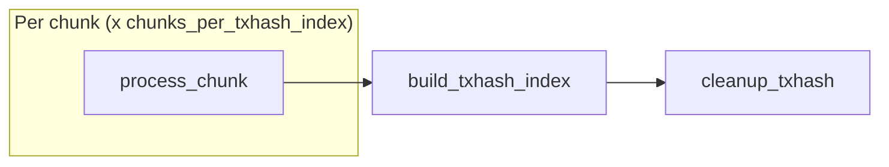
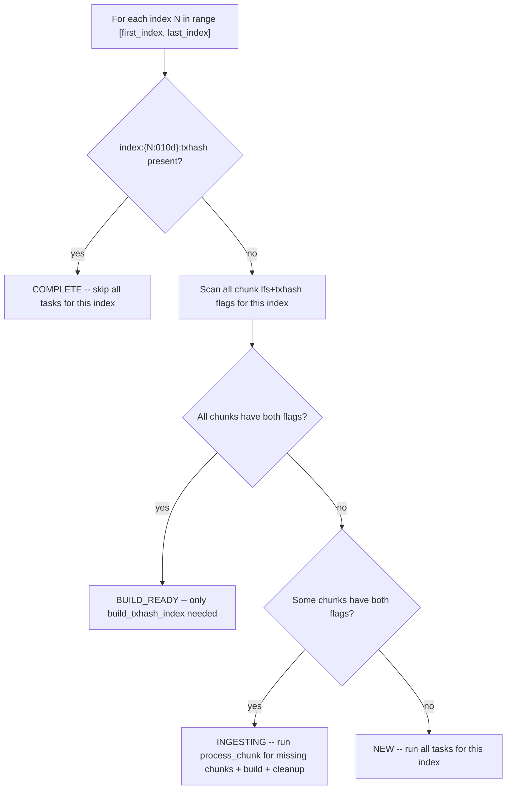

# Backfill Workflow

## Overview

Backfill ingests historical ledger data offline, writing directly to immutable formats (LFS chunks + raw txhash flat files) without RocksDB. The process is modeled as a **DAG of idempotent tasks** — built on startup, dispatched as dependencies are satisfied via a flat worker pool, and exits when all tasks complete. Crash recovery rests on three invariants:

1. **Key implies durable file** — a meta store flag is set only after fsync; if the flag exists, the file is complete.
2. **Tasks are idempotent** — each task checks its outputs and skips what is already done.
3. **Startup rebuilds the full task graph** — completed tasks are no-ops; incomplete tasks redo their work.

---

## Design Principles

- **No RocksDB during ingestion** — LFS chunks and raw txhash flat files (`hash[32] + seq[4]`, 36 bytes/entry) are written directly to disk.
- **Chunk granularity for crash recovery** — a chunk is either fully written (both `lfs` + `txhash` flags set) or rewritten from scratch.
- **Flat worker pool** — a single pool of `workers` goroutines processes all tasks. The DAG scheduler handles concurrency naturally; no per-index orchestrators.
- **RecSplit runs async** — `build_txhash_index` for index N runs concurrently with `process_chunk` tasks for index N+1. Overlap is automatic via DAG dependencies.
- **No query capability during backfill** — the process serves only `getHealth` and `getStatus`.

---

## Desired End State

Given a ledger range `[start_ledger, end_ledger]`, the backfill produces LFS chunk files (for `getLedger`) and RecSplit index files (for `getTransaction`), then cleans up all intermediate data.

Expressed as meta store keys (see [02-meta-store-design.md](./02-meta-store-design.md)):

```
PRESENT after completion:
  chunk:{C:010d}:lfs          = "1"   per chunk -- LFS file durable
  index:{N:010d}:txhash  = "1"   per index -- all 16 CF index files durable

TRANSIENT (present during ingestion, absent after cleanup):
  chunk:{C:010d}:txhash       = "1"   per chunk (deleted by cleanup_txhash)
```

---

## Tasks and Dependencies

The backfill operates at two cadences:

| Cadence | Granularity | What happens |
|---------|-------------|-------------|
| **Chunk** (10K ledgers) | `chunks_per_txhash_index` per index | Write LFS chunk file + raw txhash flat file |
| **Index** (`chunks_per_txhash_index` x 10K ledgers) | 1 per index | Build RecSplit txhash index, clean up transient raw files |

Three task types. Each is idempotent: it checks which outputs are present and only produces what is missing.

### Task Graph

```
process_chunk(chunk_id)              [chunk cadence -- 10K ledgers]
  deps:    none
  sets:    chunk:{C:010d}:lfs = "1"
           chunk:{C:010d}:txhash = "1"

build_txhash_index(index_id)         [index cadence -- chunks_per_txhash_index x 10K ledgers]
  deps:    [process_chunk(c) for c in chunksForIndex(index_id)]
  sets:    index:{N:010d}:txhash = "1"

cleanup_txhash(index_id)             [index cadence]
  deps:    [build_txhash_index(index_id)]
  deletes: raw txhash flat files for all chunks in index
           chunk:{C}:txhash meta keys for all chunks in index
```

`index_id = chunk_id / chunks_per_txhash_index`. The `chunks_per_txhash_index` config param defaults to 1000 (valid: 1, 10, 100, 1000).

```python
chunksForIndex(index_id) = [index_id * chunks_per_txhash_index .. (index_id + 1) * chunks_per_txhash_index - 1]

# Examples (chunks_per_txhash_index = 1000):
#   index 0 -> chunks 0--999      (ledgers 2--10,000,001)
#   index 1 -> chunks 1000--1999  (ledgers 10,000,002--20,000,001)
```

### Dependency Diagram



Dependencies flow naturally: `build_txhash_index` fires as soon as all its input chunks complete. `cleanup_txhash` fires after the index is built.

---

## Task Details

### process_chunk(chunk_id)

Runs once per chunk. Produces one LFS file and one raw txhash flat file. This task occupies **one DAG worker slot** and is single-threaded — one GCS connection (with its own internal prefetch workers), sequential ledger processing.

**Note on skip logic:** Chunks that are already complete (both `lfs` + `txhash` flags set) are excluded from the DAG at construction time — they never become tasks. The `process_chunk` task only runs for chunks that need work. The pseudocode below shows the full logical flow including skip for completeness.

```python
process_chunk(chunk_id):
  index_id    = chunk_id // chunks_per_txhash_index
  need_lfs    = not meta.has(f"chunk:{chunk_id:06d}:lfs")
  need_txhash = not meta.has(f"chunk:{chunk_id:06d}:txhash")

  if not need_lfs and not need_txhash:
    return  # both present — complete (in practice, DAG excludes these at build time)

  # --- Choose data source ---

  # LFS-first: if LFS flag is set but txhash flag is absent, the LFS packfile
  # is durable on disk from a prior run. Read ledgers from local disk instead
  # of re-downloading from GCS. Faster, cheaper, no network dependency.
  if not need_lfs and need_txhash:
    source = LFSPackfileReader(chunk_id)  # local disk read, no GCS
  else:
    source = BSBFactory.Create(chunk_id)  # new GCS connection for this chunk

  # --- Delete-before-create: remove any partial files from prior crash ---
  delete LFS files for chunk (if exist)
  delete txhash .bin file for chunk (if exists)

  # --- Write both outputs ---
  for each ledger in [chunk_first_ledger, chunk_last_ledger]:
    lcm = source.GetLedger(ledger_seq)
    compress lcm -> append to LFS .data + .index files
    extract txhashes -> append to raw txhash .bin file

  # --- 3-step fsync sequence (order is critical for crash safety) ---
  fsync LFS .data + .index files -> close        # Step 1
  fsync txhash .bin file -> close                 # Step 2
  atomic WriteBatch: lfs="1" + txhash="1"         # Step 3: both flags after both fsyncs

  source.Close()
```

**Key invariant**: Both flags are set in a single atomic WriteBatch only after both fsyncs complete. A crash before the WriteBatch leaves no meta store trace — partial files are overwritten on resume.

**LFS-first path**: When `chunk:{id}:lfs` is present but `chunk:{id}:txhash` is absent (partial prior crash), the task reads from the local LFS packfile instead of GCS. No BSB, no network I/O. The ChunkWriter still deletes and recreates both files as part of the crash-safe protocol, but the data comes from local disk.

---

### build_txhash_index(index_id)

Runs once per index, after all `chunks_per_txhash_index` process_chunk tasks complete (enforced by DAG dependencies — the task does not check). Reads the raw txhash flat files and builds 16 RecSplit minimal perfect hash index files — one per CF, sharded by `txhash[0] >> 4`.

This task occupies **one DAG worker slot** but spawns its own internal goroutines — the RecSplit pipeline is heavily parallel:

```python
build_txhash_index(index_id):
  if meta.has(f"index:{index_id:010d}:txhash"):
    return  # already complete

  # All-or-nothing: delete stale artifacts from any prior partial build
  delete all .idx files in index/ dir
  delete tmp/ dir

  # Phase 1: COUNT (100 goroutines)
  #   Each goroutine reads a subset of .bin files and counts entries per CF.
  #   Result: per-CF entry counts (needed to size the RecSplit builders).

  # Phase 2: ADD (100 goroutines, mutex per CF)
  #   Re-read all .bin files and add each (txhash, ledgerSeq) pair to the
  #   appropriate CF builder (selected by txhash[0] >> 4).

  # Phase 3: BUILD (16 goroutines — one per CF)
  #   Build perfect hash indexes in parallel. Each CF produces one .idx file.
  #   Wall time = slowest CF build. All .idx files fsynced.

  # Phase 4: VERIFY (100 goroutines, optional)
  #   Re-read all .bin files and look up every key in the built indexes.
  #   Confirms correctness. Skipped if verify_recsplit = false.

  meta.Put(f"index:{index_id:010d}:txhash", "1")
```

**Internal parallelism is invisible to the DAG.** The DAG sees one task occupying one slot. Inside that slot, 100+ goroutines do the real work. This is by design — the DAG controls how many indexes are built concurrently; each build controls its own I/O parallelism.

**Recovery**: All-or-nothing. If `index:{N}:txhash` is absent on restart, the entire build reruns from scratch. Raw `.bin` files are retained until `cleanup_txhash` runs.

---

### cleanup_txhash(index_id)

Runs once per index, after `build_txhash_index` completes. Frees disk space and removes meta keys for the transient raw txhash files.

```python
cleanup_txhash(index_id):
  for chunk_id in chunksForIndex(index_id):
    delete txhash raw file for chunk
    meta.Delete(f"chunk:{chunk_id:06d}:txhash")
  delete immutable/txhash/{index_id:04d}/raw/
  delete immutable/txhash/{index_id:04d}/tmp/
```

**Key presence means file exists.** After cleanup, both the raw files and the `chunk:{C}:txhash` meta keys are gone. The `chunk:{C}:lfs` keys remain permanently.

---

## Execution Model

### DAG Scheduler

The backfill pipeline builds a DAG (directed acyclic graph) of tasks at startup, then executes it with bounded concurrency.

**The DAG is the only scheduling mechanism.** There is no orchestrator, no per-index coordinator, no secondary worker pool. The DAG scheduler owns the full lifecycle:

1. **Build phase** (startup): For each index, triage its meta store state. Add `process_chunk` tasks for incomplete chunks and a `build_txhash_index` task with dependencies on those chunks. Completed chunks and indexes produce no tasks.

2. **Execute phase**: Dispatch tasks whose in-degree is 0 (all dependencies satisfied). Each dispatched task acquires a slot from a bounded semaphore (`workers`, default 40). When a task completes, decrement dependents' in-degrees and dispatch any that reach 0. On first error, cancel context — no new tasks start, in-flight tasks finish.

### Tasks Are Black Boxes

Each task implements a `Task` interface with a single method: `Execute(ctx) error`. The DAG scheduler calls `Execute()` and waits for it to return. **The scheduler does not know or care what happens inside a task.** A task may:

- Make network calls (GCS fetch)
- Read from local disk (LFS-first path)
- Spawn its own internal goroutines (RecSplit uses 100+ goroutines internally)
- Use a single goroutine (process_chunk is single-threaded)

This separation means the DAG controls **task-level concurrency** (how many tasks run at once), while each task controls its **internal concurrency** (what it does with its slot).

### Worker Pool

- Single flat pool of `workers` slots (default 40).
- Any mix of task types can occupy these slots simultaneously.
- `workers = 40` means at most 40 calls to `Execute()` are in flight at once.

### Task-Level vs Internal Concurrency

| Task | DAG slot usage | Internal concurrency |
|------|---------------|---------------------|
| `process_chunk` | 1 slot | Single-threaded: one GCS connection (with internal prefetch workers), sequential ledger processing, one ChunkWriter |
| `build_txhash_index` | 1 slot | Highly parallel: 100 goroutines for count/add/verify phases, 16 parallel CF builds. The RecSplit pipeline spawns its own workers inside the single DAG slot. |
| `cleanup_txhash` | 1 slot | Single-threaded: sequential file and key deletion |

### Parallelism Flow

At startup, ALL `process_chunk` tasks across ALL indexes have in-degree 0 (no dependencies) and are eligible to run immediately. The DAG dispatches them until the semaphore is full.

As chunks complete:
- Their slots free up for more `process_chunk` tasks from any index.
- When **all** chunks for an index complete, `build_txhash_index` for that index reaches in-degree 0 and is dispatched.
- `build_txhash_index` for index N runs concurrently with `process_chunk` tasks for index N+1 — overlap is automatic via DAG dependencies, not orchestrated.

**Example with 3 indexes, workers=40, chunks_per_txhash_index=1000:**

```
Time 0:   40 process_chunk tasks running (mix of index 0 and index 1 chunks)
Time T:   Index 0's last chunk finishes → build_txhash_index(0) dispatched
          39 process_chunk tasks (index 1, 2) + 1 build_txhash_index(0)
Time T+Δ: build_txhash_index(0) completes → cleanup_txhash(0) dispatched
          39 process_chunk tasks + 1 cleanup_txhash(0)
```


---

## Crash Recovery

Crash recovery requires no enumeration of failure scenarios. It follows from the three invariants in the [Overview](#overview). Crash at any point -> restart -> full task graph rebuilt -> completed tasks skip, incomplete tasks redo their work.

### Startup Triage

State is derived from key presence at startup — no stored state machine.



### Illustrative Crash Scenarios

Not exhaustive — **correctness follows from the three invariants**, not from this table.

| Crash point | State on disk | Recovery |
|-------------|---------------|----------|
| `process_chunk` mid-stream | Partial file, no meta key | Task re-runs. Overwrites partial file. |
| `process_chunk` after fsync, before WriteBatch | Complete files, no meta keys | Task re-runs. Files rewritten (identical content). |
| `process_chunk` after `lfs` set, before `txhash` set | Cannot happen — both flags set in single atomic WriteBatch. |
| `process_chunk` with `lfs` present, `txhash` absent (prior crash) | LFS file complete, txhash file missing | LFS-first path: reads from local LFS, writes only txhash file. |
| `build_txhash_index` mid-build | No `txhash` key, partial .idx files | All-or-nothing: delete stale artifacts, rerun full build from scratch. |
| `cleanup_txhash` mid-delete | Index built, some txhash files/keys remain | Task re-runs. Deletes remaining files and keys. |

---

## File Output Per Index

After an index completes (ingestion + index build + cleanup), the durable output on disk is:

```
immutable/
+-- ledgers/chunks/{XXXX}/{YYYYYY}.data
+-- txhash/{indexID:04d}/
    +-- index/
        +-- cf-0.idx ... cf-f.idx
```

During ingestion, `immutable/txhash/{indexID:04d}/raw/{YYYYYY}.bin` files also exist. These are the RecSplit build input, deleted by `cleanup_txhash` after the index is built.

---

## getStatus API Response

During backfill, `getStatus` returns progress information:

```json
{
  "mode": "BACKFILL",
  "chunks_per_txhash_index": 1000,
  "summary": {
    "total_indexes": 6,
    "complete": 0,
    "building": 0,
    "ingesting": 2,
    "queued": 4,
    "total_chunks": 6000,
    "chunks_done": 288,
    "pct": 4.8,
    "eta_seconds": 1820
  },
  "active": [
    {"index": 0, "state": "INGESTING", "chunks_done": 147, "chunks_total": 1000, "pct": 14.7},
    {"index": 1, "state": "INGESTING", "chunks_done": 141, "chunks_total": 1000, "pct": 14.1}
  ]
}
```

`active` contains only INGESTING or BUILDING indexes — bounded by worker activity, not an unbounded per-index array.

---

## getEvents Immutable Store -- Placeholder

> **Status**: Not yet designed. This section reserves space for future work.

The backfill workflow currently writes two outputs per chunk: an LFS chunk file (`lfs`) and a raw txhash flat file (`txhash`). When `getEvents` support is added, a third output will be required per chunk — an events flat file or index structure — tracked by a new `chunk:{C:010d}:events` flag. The `process_chunk` task gains a third output; the task graph gains a `build_events_index` task type.

---

## Error Handling

| Error Type | Action |
|-----------|--------|
| Fetch error from BSB | ABORT task; log error; operator re-runs |
| LFS write / fsync failure | ABORT task; do NOT set `lfs` flag; operator re-runs |
| TxHash write / fsync failure | ABORT task; do NOT set `txhash` flag; operator re-runs |
| RecSplit build failure | ABORT build; `txhash` key absent; operator re-runs |
| Verify phase mismatch | ABORT; indicates data corruption -- operator investigates |
| Meta store write failure | ABORT; treat as crash; operator re-runs |

All errors exit non-zero. The operator re-runs the same command. Completed work is never repeated.

---

## Related Documents

- [01-architecture-overview.md](./01-architecture-overview.md) -- two-pipeline overview
- [02-meta-store-design.md](./02-meta-store-design.md) -- meta store keys
- [07-crash-recovery.md](./07-crash-recovery.md) -- crash scenarios
- [09-directory-structure.md](./09-directory-structure.md) -- file paths
- [10-configuration.md](./10-configuration.md) -- config params
- [12-metrics-and-sizing.md](./12-metrics-and-sizing.md) -- memory budgets
