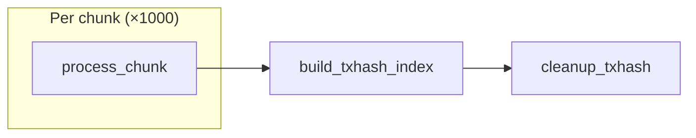
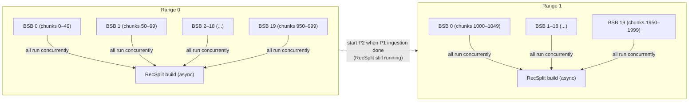
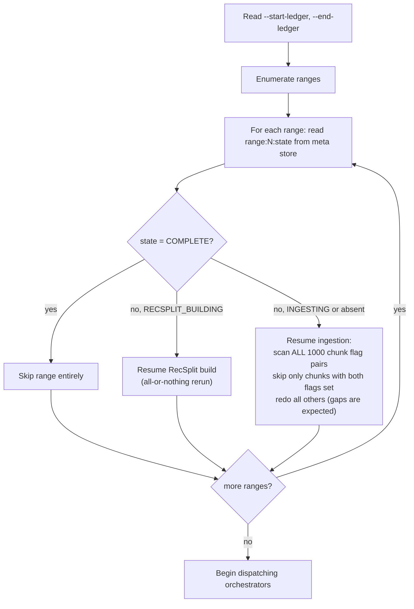

# Backfill Workflow

## Overview

Backfill mode ingests historical ledger ranges offline, writing directly to immutable formats (LFS chunks + raw txhash flat files) without RocksDB. No queries are served. The process exits when all requested ranges complete. On failure the operator re-runs the exact same command — idempotent resumption skips completed work.

The backfill is modeled as a **directed acyclic graph (DAG) of idempotent tasks**. Each task declares its inputs, outputs, and dependencies. The system builds the full task graph on startup, executes tasks as their dependencies are satisfied, and relies on three invariants for crash recovery — no per-scenario recovery logic is needed:

1. **Key implies durable file** — a meta store flag is set only after fsync; if the flag exists, the file is complete.
2. **Tasks are idempotent** — each task checks its outputs and skips what's already done.
3. **Startup rebuilds the full task graph** — completed tasks are no-ops; incomplete tasks redo their work.

---

## Design Principles

1. **No RocksDB during ingestion** — LFS chunks and raw txhash flat files (`hash[32] + seq[4]`, 36 bytes/entry; see [README glossary](./README.md#storage-components)) are written directly.
2. **Flush every ~100 ledgers** — never accumulate more than ~100 ledgers in RAM.
3. **Chunk granularity for crash recovery** — a chunk is either fully written (both `lfs_done` + `txhash_done` set) or rewritten from scratch.
4. **BSB instances run in parallel within a range** — all 20 BSB instances for a range start concurrently. Each owns a 500K-ledger slice (50 chunks). Completed chunks are NOT contiguous at crash time — gaps are expected and normal.
5. **RecSplit runs async** — while RecSplit builds for range N (~4 hours), the orchestrator moves on to ingest range N+1.
6. **No query capability** — the process serves only `getHealth` and `getStatus` during backfill.

---

## Desired End State

Given a ledger range `[start_ledger, end_ledger]`, the backfill's goal is to produce the immutable serving artifacts — LFS chunk files for ledger lookups and RecSplit index files for txhash lookups — and clean up all intermediate data. A range is complete when:

- Every chunk has an **LFS file** (compressed ledger data for `getLedger` queries)
- Every range has a **RecSplit txhash index** (16 CF files for `getTransaction` lookups)
- All **raw txhash flat files** (intermediate build input) have been deleted

Expressed as meta store keys (see [02-meta-store-design.md](./02-meta-store-design.md)):

```
PRESENT (after completion):
  range:{N:04d}:chunk:{C:06d}:lfs_done    = "1"    per chunk — LFS file durable
  range:{N:04d}:recsplit:cf:{XX}:done     = "1"    per CF (×16) — RecSplit index durable
  range:{N:04d}:recsplit:state            = "COMPLETE"
  range:{N:04d}:state                     = "COMPLETE"

TRANSIENT (present during ingestion, absent after completion):
  range:{N:04d}:chunk:{C:06d}:txhash_done = "1"    per chunk — raw txhash file durable
                                                     (file deleted after RecSplit completes;
                                                      flag remains as permanent record)
```

---

## Tasks and Dependencies

The backfill operates at two cadences:

| Cadence | Granularity | What happens |
|---------|-------------|-------------|
| **Chunk** (10K ledgers) | 1,000 per range | Write LFS chunk file + raw txhash flat file (+ events file in future) |
| **Range** (10M ledgers) | 1 per range | Build RecSplit txhash index, mark range COMPLETE, delete transient raw files |

The backfill defines three task types. Each task is idempotent: it checks which outputs are already present and only produces what is missing.

### Task Graph

```
process_chunk(chunk_id)                    [chunk cadence — 10K ledgers]
  deps:    none
  sets:    range:{N:04d}:chunk:{C:06d}:lfs_done = "1"
           range:{N:04d}:chunk:{C:06d}:txhash_done = "1"

build_txhash_index(range_id)              [range cadence — 10M ledgers]
  deps:    [process_chunk(c) for c in chunksForRange(range_id)]
  sets:    range:{N:04d}:recsplit:cf:{XX}:done = "1"  (×16 CFs)
           range:{N:04d}:recsplit:state = "COMPLETE"
           range:{N:04d}:state = "COMPLETE"

cleanup_txhash(range_id)                  [range cadence — 10M ledgers]
  deps:    [build_txhash_index(range_id)]
  deletes: raw txhash flat files for all chunks in range
```

Each range contains exactly 1,000 chunks. The chunk IDs are **global** (not per-range), so `range_id` determines the chunk ID offset:

```python
chunksForRange(range_id) = [range_id * 1000 .. (range_id + 1) * 1000 - 1]

# Examples:
#   range 0 → chunks 0–999      (ledgers 2–10,000,001)
#   range 1 → chunks 1000–1999  (ledgers 10,000,002–20,000,001)
#   range 5 → chunks 5000–5999  (ledgers 50,000,002–60,000,001)
```

### Dependency Diagram



Dependencies flow naturally: `build_txhash_index` fires as soon as all its input chunks are complete — no phase barrier is needed beyond the dependency itself. `cleanup_txhash` fires after the index is built.

---

## Task Details

### process_chunk(chunk_id) — Chunk cadence (10K ledgers)

Runs once per chunk. Produces one LFS file and one raw txhash flat file:

```python
process_chunk(chunk_id):
  range_id    = chunk_id // 1000
  need_lfs    = not meta_store.has(f"range:{range_id:04d}:chunk:{chunk_id:06d}:lfs_done")
  need_txhash = not meta_store.has(f"range:{range_id:04d}:chunk:{chunk_id:06d}:txhash_done")

  if not need_lfs and not need_txhash:
    return  # already complete — skip

  # Either flag absent → full rewrite of both files
  stream ledgers from GCS via BSB (10K ledgers)

  for each ledger:
    decompress(zstd)
    unmarshal()
    compress LCM → append to LFS file (YYYYYY.data)
    extract txhash → accumulate (txhash[32] || ledgerSeq[4], 36 bytes/entry)
    every ~100 ledgers: write() to both file handles  # page cache only, no fsync

  # Chunk boundary (10K ledgers):
  fsync LFS file (YYYYYY.data + YYYYYY.index) → close
  fsync txhash flat file (YYYYYY.bin) → close
  atomic WriteBatch: lfs_done="1" + txhash_done="1"  # both flags after both fsyncs
```

**Key invariant**: Both flags are set in a single atomic WriteBatch only after both fsyncs complete. A crash before the WriteBatch leaves no trace in the meta store — partial files are safe to overwrite on resume.

---

### build_txhash_index(range_id) — Range cadence (10M ledgers)

Runs once per range, after all 1,000 `process_chunk` tasks complete. Reads the 1,000 raw txhash flat files (`.bin`) and builds 16 RecSplit minimal perfect hash index files — one per CF, sharded by `txhash[0] >> 4`. Each index maps `txhash → ledgerSeq` with zero collisions.

```python
build_txhash_index(range_id):
  if meta_store.get(f"range:{range_id:04d}:state") == "COMPLETE":
    return  # already done

  # All-or-nothing: delete stale artifacts before starting
  delete all .idx files in index/ dir
  delete tmp/ dir
  clear all 16 per-CF done flags

  # Read all 1,000 raw .bin files → build 16 RecSplit indexes (one per CF)
  # Each CF index: count keys → add keys → build perfect hash → fsync → set cf done flag
  # Optional: verify all lookups match expected values

  set f"range:{range_id:04d}:state" = "COMPLETE"
```

**Pre-condition**: Before launching the index build, the orchestrator must wait for all BSB goroutines to fully exit and verify all raw txhash file handles are closed. Raw files must be read-only and quiescent when index workers begin scanning.

**Recovery**: All-or-nothing. On crash during the build, all partial index files and per-CF done flags are deleted, and the entire build reruns from scratch. The raw `.bin` files are retained as input until the range reaches COMPLETE.

---

### cleanup_txhash(range_id) — Range cadence (10M ledgers)

Runs once per range, after `build_txhash_index` completes. Frees disk space occupied by the transient raw txhash flat files.

```python
cleanup_txhash(range_id):
  delete immutable/txhash/{range_id:04d}/raw/ directory
  delete immutable/txhash/{range_id:04d}/tmp/ directory
```

---

## Execution Model

### BSB Configuration

BufferedStorageBackend (BSB) is the GCS-backed ledger source used during backfill.

| Parameter | Default | Description |
|-----------|---------|-------------|
| `parallel_ranges` | 2 | Number of concurrent range orchestrators |
| BSB instances per orchestrator | 20 | Number of BSB instances per range (valid: 10 or 20) |
| Ledgers per BSB instance (20 instances) | 500,000 | 10M ÷ 20 |
| Chunks per BSB instance (20 instances) | 50 | 500K ÷ 10K |
| BSB internal prefetch | 1,000 | Ledgers prefetched per BSB instance |
| BSB internal workers | 20 | Download workers per BSB instance |
| Flush interval | ~100 ledgers | Max ledgers held in RAM per chunk write |

**All 20 BSB instances within a range run concurrently.** Each owns a contiguous 500K-ledger slice and writes its 50 chunks independently. At any given time, up to 20 chunks within a range are being written simultaneously. On crash, completed chunks are scattered non-contiguously — the recovery scan handles this correctly.

**Why 20 BSB instances?** Each BSB instance must align to chunk boundaries (10K ledger multiples). With 20 instances, each spans exactly 50 chunks. Both 10 and 20 divide evenly.

**Total in-flight BSBs**: up to 2 orchestrators × 20 instances = 40 BSB instances.

### Parallelism Model



**Within each range**: all 20 BSB instances run in parallel. Each fetches and writes its 500K-ledger slice independently. Chunks within a range are written concurrently — expect non-contiguous completion on crash.

**Across ranges**: when range N's ingestion completes, the orchestrator slot is freed. Range N+1 begins ingesting immediately — RecSplit for range N runs concurrently with ingestion of range N+1.

---

## Crash Recovery

Crash recovery requires no enumeration of failure scenarios. It rests on three properties:

1. **Key implies durable file.** A meta store key (`lfs_done`, `txhash_done`, per-CF done flag) is set only after its file is fsynced. If the key exists, the file is complete.
2. **Tasks are idempotent.** Each task checks which outputs are present and only produces what is missing. Re-running a task with some outputs already present skips the completed ones.
3. **Startup rebuilds the full task graph.** Every range is re-evaluated on restart. Tasks that already completed are no-ops. No per-crash-point logic is needed.

Together: crash at any point → restart → full task graph rebuilt → tasks re-run → completed tasks skip, incomplete tasks redo their work.

### Illustrative Crash Scenarios

The table below demonstrates how the invariants apply to specific crash points. It is not exhaustive — **correctness follows from the three properties above**, not from this table.

| Crash point | State on disk | Recovery |
|-------------|---------------|----------|
| `process_chunk` mid-stream | Partial file, no meta key | Task re-runs. Overwrites partial file. |
| `process_chunk` after fsync, before meta key | Complete file, no meta key | Task re-runs. File is rewritten (identical content). |
| `process_chunk` after lfs_done, before txhash_done | lfs key set, txhash key missing | Task re-runs. Both files rewritten (either flag absent → full rewrite). |
| `build_txhash_index` mid-build | No index files or partial | All-or-nothing: delete stale artifacts, rerun full 4-phase pipeline from scratch. |
| `build_txhash_index` complete, before COMPLETE state | All 16 .idx files valid, state still RECSPLIT_BUILDING | All-or-nothing: pipeline reruns. Acceptable cost for simpler recovery. |
| `cleanup_txhash` mid-delete | Index built, some txhash files remain | Task re-runs. Deletes remaining files. |

### RecSplit All-or-Nothing Recovery

The RecSplit pipeline uses all-or-nothing recovery. Per-CF done flags are written during the build (for bookkeeping) but are not consulted on resume — the entire 4-phase flow reruns from scratch on crash. This is simpler than per-CF partial recovery and the pipeline completes in minutes.

On resume from `RECSPLIT_BUILDING`:
1. Delete all `.idx` files in `index/` dir, delete `tmp/` dir
2. Clear all 16 per-CF done flags (`ClearRecSplitCFFlags`)
3. Rerun entire 4-phase pipeline from Phase 1
4. Per-CF done flags re-set as each CF builds + fsyncs
5. Set `range:N:state = "COMPLETE"`
6. Delete `raw/` and `tmp/`

---

## Startup Resume Logic

On every startup in backfill mode:



The per-range state key (`range:N:state`) provides fast startup triage — the orchestrator immediately knows whether to skip, resume ingestion, or resume RecSplit without scanning all 1,000 chunk flags for every range.

---

## File Output Per Range

After a range completes (both ingestion and RecSplit), the durable output on disk is:

```
immutable/
├── ledgers/
│   └── chunks/
│       └── {XXXX}/              ← chunkID / 1000 (zero-padded 4 digits)
│           ├── {YYYYYY}.data    ← 10K compressed LCMs
│           └── {YYYYYY}.index   ← offset table for random access
└── txhash/
    └── {rangeID:04d}/
        └── index/               ← raw/ is DELETED once all 16 CFs are built
            ├── cf-0.idx         ← RecSplit CF 0 (txhashes starting with '0')
            ├── cf-1.idx
            ├── ...
            └── cf-f.idx         ← RecSplit CF 15 (txhashes starting with 'f')
```

During ingestion (state `INGESTING`), `immutable/txhash/{rangeID:04d}/raw/{YYYYYY}.bin` files also exist. These are the RecSplit build input, deleted after all 16 CFs are built and verified.

---

## Query at Runtime

```
nibble = txhash[0] >> 4
idx = load_recsplit(immutable/txhash/{rangeID:04d}/index/cf-{nibble}.idx)
candidate_seq = idx.lookup(txhash)
// RecSplit may return false positives; caller must verify:
actual_lcm = getLedgerBySequence(candidate_seq)
if actual_lcm.contains(txhash): return candidate_seq
else: return NOT_FOUND
```

See [08-query-routing.md](./08-query-routing.md) for false-positive handling.

---

## Memory Budget

See [12-metrics-and-sizing.md](./12-metrics-and-sizing.md#memory-budget--backfill-bsb-mode) for the full memory breakdown across all modes.

---

## getEvents Immutable Store — Placeholder

> **Status**: Not yet designed. This section reserves space for future work.

The backfill workflow currently writes two outputs per chunk: an LFS chunk file (`lfs_done`) and a raw txhash flat file (`txhash_done`). When `getEvents` support is added, a third output will be required per chunk — an events flat file or index structure — tracked by a new `events_done` flag. The `process_chunk` task gains a third output; the task graph gains a `build_events_index` task type.

---

## Error Handling

| Error Type | Action |
|-----------|--------|
| Fetch error from BSB | ABORT range; log error; operator re-runs |
| LFS write / fsync failure | ABORT range; do NOT set `lfs_done`; operator re-runs |
| TxHash write / fsync failure | ABORT range; do NOT set `txhash_done`; operator re-runs |
| RecSplit build failure | ABORT RecSplit; state remains `RECSPLIT_BUILDING`; operator re-runs |
| Verify phase mismatch | ABORT; indicates data corruption — operator investigates |
| Meta store write failure | ABORT; treat as crash; operator re-runs |

All errors result in process exit with non-zero code. The operator re-runs the same command. Completed work is never repeated.

---

## Related Documents

- [01-architecture-overview.md](./01-architecture-overview.md) — two-pipeline overview
- [02-meta-store-design.md](./02-meta-store-design.md) — meta store keys written during backfill
- [07-crash-recovery.md](./07-crash-recovery.md) — startup reconciliation, streaming crash scenarios
- [09-directory-structure.md](./09-directory-structure.md) — file paths for chunks and indexes
- [10-configuration.md](./10-configuration.md) — BSB and parallelism config
- [12-metrics-and-sizing.md](./12-metrics-and-sizing.md) — memory budgets, storage estimates, hardware requirements
