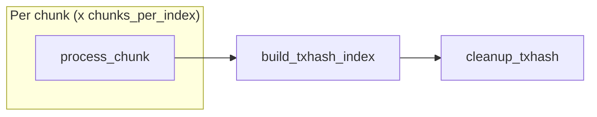

# Backfill Workflow

## Overview

Backfill ingests historical ledger data offline, writing directly to immutable formats (LFS chunks + raw txhash flat files) without RocksDB. The process is modeled as a **DAG of idempotent tasks** — built on startup, dispatched as dependencies are satisfied via a flat worker pool, and exits when all tasks complete. Crash recovery rests on three invariants:

1. **Key implies durable file** — a meta store flag is set only after fsync; if the flag exists, the file is complete.
2. **Tasks are idempotent** — each task checks its outputs and skips what is already done.
3. **Startup rebuilds the full task graph** — completed tasks are no-ops; incomplete tasks redo their work.

---

## Design Principles

- **No RocksDB during ingestion** — LFS chunks and raw txhash flat files (`hash[32] + seq[4]`, 36 bytes/entry) are written directly to disk.
- **Chunk granularity for crash recovery** — a chunk is either fully written (both `lfs` + `txhash` flags set) or rewritten from scratch.
- **Flat worker pool** — a single pool of `workers` goroutines processes all tasks. The DAG scheduler handles concurrency naturally; no per-index orchestrators.
- **RecSplit runs async** — `build_txhash_index` for index N runs concurrently with `process_chunk` tasks for index N+1. Overlap is automatic via DAG dependencies.
- **No query capability during backfill** — the process serves only `getHealth` and `getStatus`.

---

## Desired End State

Given a ledger range `[start_ledger, end_ledger]`, the backfill produces LFS chunk files (for `getLedger`) and RecSplit index files (for `getTransaction`), then cleans up all intermediate data.

Expressed as meta store keys (see [02-meta-store-design.md](./02-meta-store-design.md)):

```
PRESENT after completion:
  chunk:{C:06d}:lfs          = "1"   per chunk -- LFS file durable
  index:{N:04d}:txhashindex  = "1"   per index -- all 16 CF index files durable

TRANSIENT (present during ingestion, absent after cleanup):
  chunk:{C:06d}:txhash       = "1"   per chunk (deleted by cleanup_txhash)
```

---

## Tasks and Dependencies

The backfill operates at two cadences:

| Cadence | Granularity | What happens |
|---------|-------------|-------------|
| **Chunk** (10K ledgers) | `chunks_per_index` per index | Write LFS chunk file + raw txhash flat file |
| **Index** (`chunks_per_index` x 10K ledgers) | 1 per index | Build RecSplit txhash index, clean up transient raw files |

Three task types. Each is idempotent: it checks which outputs are present and only produces what is missing.

### Task Graph

```
process_chunk(chunk_id)              [chunk cadence -- 10K ledgers]
  deps:    none
  sets:    chunk:{C:06d}:lfs = "1"
           chunk:{C:06d}:txhash = "1"

build_txhash_index(index_id)         [index cadence -- chunks_per_index x 10K ledgers]
  deps:    [process_chunk(c) for c in chunksForIndex(index_id)]
  sets:    index:{N:04d}:txhashindex = "1"

cleanup_txhash(index_id)             [index cadence]
  deps:    [build_txhash_index(index_id)]
  deletes: raw txhash flat files for all chunks in index
           chunk:{C}:txhash meta keys for all chunks in index
```

`index_id = chunk_id / chunks_per_index`. The `chunks_per_index` config param defaults to 1000 (valid: 1, 10, 100, 1000).

```python
chunksForIndex(index_id) = [index_id * chunks_per_index .. (index_id + 1) * chunks_per_index - 1]

# Examples (chunks_per_index = 1000):
#   index 0 -> chunks 0--999      (ledgers 2--10,000,001)
#   index 1 -> chunks 1000--1999  (ledgers 10,000,002--20,000,001)
```

### Dependency Diagram



Dependencies flow naturally: `build_txhash_index` fires as soon as all its input chunks complete. `cleanup_txhash` fires after the index is built.

---

## Task Details

### process_chunk(chunk_id)

Runs once per chunk. Produces one LFS file and one raw txhash flat file.

```python
process_chunk(chunk_id):
  index_id    = chunk_id // chunks_per_index
  need_lfs    = not meta.has(f"chunk:{chunk_id:06d}:lfs")
  need_txhash = not meta.has(f"chunk:{chunk_id:06d}:txhash")

  if not need_lfs and not need_txhash:
    return  # both present -- complete, skip

  # LFS-first: if lfs present but txhash absent, read from local LFS instead of GCS
  if not need_lfs and need_txhash:
    source = LFSPackfileReader(chunk_id)  # no BSB, no GCS
  else:
    source = BSB(chunk_id)  # fetch from GCS

  for each ledger from source:
    compress LCM -> append to LFS file
    extract txhash -> accumulate in txhash flat file
    every ~100 ledgers: write() to both file handles  # flush to page cache, no fsync

  fsync LFS file (data + index) -> close
  fsync txhash flat file -> close
  atomic WriteBatch: lfs="1" + txhash="1"  # both flags after both fsyncs
```

**Key invariant**: Both flags are set in a single atomic WriteBatch only after both fsyncs complete. A crash before the WriteBatch leaves no meta store trace — partial files are overwritten on resume.

**LFS-first path**: When `chunk:{id}:lfs` is present but `chunk:{id}:txhash` is absent (partial prior crash), the task reads from the local LFS packfile instead of GCS. No BSB, no network I/O.

---

### build_txhash_index(index_id)

Runs once per index, after all `chunks_per_index` process_chunk tasks complete. Reads the raw txhash flat files and builds 16 RecSplit minimal perfect hash index files — one per CF, sharded by `txhash[0] >> 4`.

```python
build_txhash_index(index_id):
  if meta.has(f"index:{index_id:04d}:txhashindex"):
    return  # already complete

  # All-or-nothing: delete stale artifacts
  delete all .idx files in index/ dir
  delete tmp/ dir
  # No per-CF flags to clear (schema has no per-CF keys)

  # Read all chunks' raw .bin files -> build 16 RecSplit indexes
  # After all 16 CFs built and fsynced:
  meta.Put(f"index:{index_id:04d}:txhashindex", "1")
```

**Recovery**: All-or-nothing. If `index:{N}:txhashindex` is absent on restart, the entire build reruns. Raw `.bin` files are retained until `cleanup_txhash` runs.

---

### cleanup_txhash(index_id)

Runs once per index, after `build_txhash_index` completes. Frees disk space and removes meta keys for the transient raw txhash files.

```python
cleanup_txhash(index_id):
  for chunk_id in chunksForIndex(index_id):
    delete txhash raw file for chunk
    meta.Delete(f"chunk:{chunk_id:06d}:txhash")
  delete immutable/txhash/{index_id:04d}/raw/
  delete immutable/txhash/{index_id:04d}/tmp/
```

**Key presence means file exists.** After cleanup, both the raw files and the `chunk:{C}:txhash` meta keys are gone. The `chunk:{C}:lfs` keys remain permanently.

---

## Execution Model

### Worker Pool

- Single flat pool of `workers` goroutines (default 40).
- DAG scheduler dispatches tasks as their dependencies are satisfied.
- One scheduler manages all tasks globally — no per-index orchestrators.
- `workers = 40` means up to 40 concurrent `process_chunk` tasks, plus `build_txhash_index` / `cleanup_txhash` tasks fire as their dependencies complete.

### Parallelism Model

- `workers` `process_chunk` tasks run concurrently across all indexes.
- When all chunks for an index complete, `build_txhash_index` fires automatically (DAG dependency).
- `build_txhash_index` for index N runs concurrently with `process_chunk` tasks for index N+1 — overlap is natural, not orchestrated.

---

## Crash Recovery

Crash recovery requires no enumeration of failure scenarios. It follows from the three invariants in the [Overview](#overview). Crash at any point -> restart -> full task graph rebuilt -> completed tasks skip, incomplete tasks redo their work.

### Startup Triage

State is derived from key presence at startup — no stored state machine.

```mermaid
flowchart TD
  A["For each index N in range [first_index, last_index]"]
  A --> B{index:{N:04d}:txhashindex present?}
  B -->|yes| SKIP["COMPLETE -- skip all tasks for this index"]
  B -->|no| C["Scan all chunk lfs+txhash flags for this index"]
  C --> D{All chunks have both flags?}
  D -->|yes| BUILD["BUILD_READY -- only build_txhash_index needed"]
  D -->|no| E{Some chunks have both flags?}
  E -->|yes| INGEST["INGESTING -- run process_chunk for missing chunks + build + cleanup"]
  E -->|no| NEW["NEW -- run all tasks for this index"]
```

### Illustrative Crash Scenarios

Not exhaustive — **correctness follows from the three invariants**, not from this table.

| Crash point | State on disk | Recovery |
|-------------|---------------|----------|
| `process_chunk` mid-stream | Partial file, no meta key | Task re-runs. Overwrites partial file. |
| `process_chunk` after fsync, before WriteBatch | Complete files, no meta keys | Task re-runs. Files rewritten (identical content). |
| `process_chunk` after `lfs` set, before `txhash` set | Cannot happen — both flags set in single atomic WriteBatch. |
| `process_chunk` with `lfs` present, `txhash` absent (prior crash) | LFS file complete, txhash file missing | LFS-first path: reads from local LFS, writes only txhash file. |
| `build_txhash_index` mid-build | No `txhashindex` key, partial .idx files | All-or-nothing: delete stale artifacts, rerun full build from scratch. |
| `cleanup_txhash` mid-delete | Index built, some txhash files/keys remain | Task re-runs. Deletes remaining files and keys. |

---

## File Output Per Index

After an index completes (ingestion + index build + cleanup), the durable output on disk is:

```
immutable/
+-- ledgers/chunks/{XXXX}/{YYYYYY}.data
+-- txhash/{indexID:04d}/
    +-- index/
        +-- cf-0.idx ... cf-f.idx
```

During ingestion, `immutable/txhash/{indexID:04d}/raw/{YYYYYY}.bin` files also exist. These are the RecSplit build input, deleted by `cleanup_txhash` after the index is built.

---

## getStatus API Response

During backfill, `getStatus` returns progress information:

```json
{
  "mode": "BACKFILL",
  "chunks_per_index": 1000,
  "summary": {
    "total_indexes": 6,
    "complete": 0,
    "building": 0,
    "ingesting": 2,
    "queued": 4,
    "total_chunks": 6000,
    "chunks_done": 288,
    "pct": 4.8,
    "eta_seconds": 1820
  },
  "active": [
    {"index": 0, "state": "INGESTING", "chunks_done": 147, "chunks_total": 1000, "pct": 14.7},
    {"index": 1, "state": "INGESTING", "chunks_done": 141, "chunks_total": 1000, "pct": 14.1}
  ]
}
```

`active` contains only INGESTING or BUILDING indexes — bounded by worker activity, not an unbounded per-index array.

---

## getEvents Immutable Store -- Placeholder

> **Status**: Not yet designed. This section reserves space for future work.

The backfill workflow currently writes two outputs per chunk: an LFS chunk file (`lfs`) and a raw txhash flat file (`txhash`). When `getEvents` support is added, a third output will be required per chunk — an events flat file or index structure — tracked by a new `chunk:{C:06d}:events` flag. The `process_chunk` task gains a third output; the task graph gains a `build_events_index` task type.

---

## Error Handling

| Error Type | Action |
|-----------|--------|
| Fetch error from BSB | ABORT task; log error; operator re-runs |
| LFS write / fsync failure | ABORT task; do NOT set `lfs` flag; operator re-runs |
| TxHash write / fsync failure | ABORT task; do NOT set `txhash` flag; operator re-runs |
| RecSplit build failure | ABORT build; `txhashindex` key absent; operator re-runs |
| Verify phase mismatch | ABORT; indicates data corruption -- operator investigates |
| Meta store write failure | ABORT; treat as crash; operator re-runs |

All errors exit non-zero. The operator re-runs the same command. Completed work is never repeated.

---

## Related Documents

- [01-architecture-overview.md](./01-architecture-overview.md) -- two-pipeline overview
- [02-meta-store-design.md](./02-meta-store-design.md) -- meta store keys
- [07-crash-recovery.md](./07-crash-recovery.md) -- crash scenarios
- [09-directory-structure.md](./09-directory-structure.md) -- file paths
- [10-configuration.md](./10-configuration.md) -- config params
- [12-metrics-and-sizing.md](./12-metrics-and-sizing.md) -- memory budgets
