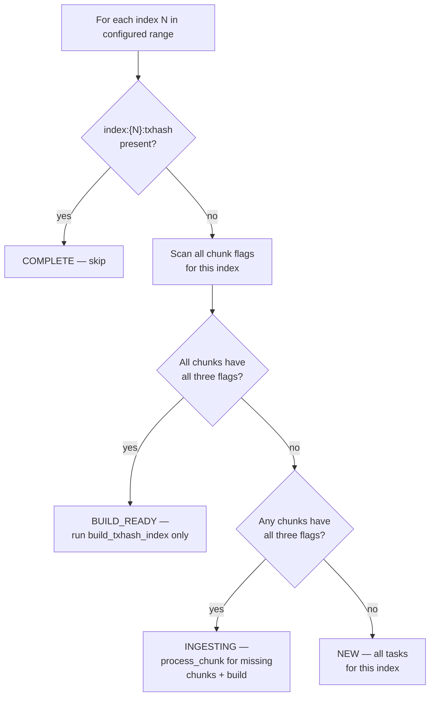

# Backfill Workflow

## Overview

Backfill populates the immutable stores for a configured ledger range `[start_ledger, end_ledger]`.

**What it does:**
- Ingests historical ledgers offline — no live queries served (only `getHealth` / `getStatus`). `getHealth` is the existing lightweight liveness check; `getStatus` is the new backfill-specific progress endpoint (see getStatus API Response section below).
- Writes directly to immutable file formats — no RocksDB active stores
- Schedules work as a DAG of idempotent tasks, dispatched via a flat worker pool (default GOMAXPROCS slots)
- Exits when done; on failure, re-run the same command — completed work is never repeated

**What it produces:**

| Query it enables | Immutable output | Scope |
|-----------------|-----------------|-------|
| `getLedger` | Ledger [pack file](https://github.com/stellar/stellar-rpc/pull/633) | Per chunk (10K ledgers) |
| `getTransaction` | 16 RecSplit MPH index files | Per index (default 10M ledgers) |
| `getEvents` | [Events cold segment](https://github.com/stellar/stellar-rpc/pull/635) | Per chunk |

---

## Directory Structure

All data lives under a configurable `data_dir`. Backfill writes only to `meta/` and the type-separated immutable directories — no active store directories.

**Data is organized by type at the top level.** Each data type (ledgers, events, txhash) has its own directory tree with independently configurable storage paths. Chunk data is bucketed into fixed subdirectories of 1,000 chunks each. Index output lives under its own type tree.

All IDs use uniform `%08d` zero-padding (supports up to 99,999,999).

```
{data_dir}/
├── meta/
│   └── rocksdb/                                  ← Meta store (WAL always enabled)
│
├── ledgers/
│   ├── 00000/                                    ← chunks 0–999
│   │   ├── 00000000.pack                         ← ledger pack file (PR #633)
│   │   ├── 00000001.pack
│   │   └── ...
│   ├── 00001/                                    ← chunks 1000–1999
│   │   └── ...
│   └── .../
│
├── events/
│   ├── 00000/                                    ← chunks 0–999
│   │   ├── 00000000-events.pack                  ← compressed event blocks
│   │   ├── 00000000-index.pack                   ← serialized roaring bitmaps
│   │   ├── 00000000-index.hash                   ← MPHF for term → slot lookup
│   │   └── ...
│   ├── 00001/
│   │   └── ...
│   └── .../
│
└── txhash/
    ├── raw/
    │   ├── 00000/                                ← chunks 0–999
    │   │   ├── 00000000.bin                      ← TRANSIENT (deleted after RecSplit)
    │   │   └── ...
    │   └── .../
    └── index/
        ├── 00000000/                             ← index 0
        │   └── cf-{0-f}.idx                      ← PERMANENT (16 RecSplit CF files)
        └── .../
```

Bucket ID formula: `bucketID = chunkID / 1000` (hardcoded, not derived from `chunks_per_txhash_index`).

The type-separated layout enables per-type storage tiering via config paths (e.g., ledgers on NVMe, txhash index on cheaper storage).

### Concrete Examples

The following examples all use `start_ledger=2, end_ledger=20_000_001` (20M ledgers = 2,000 chunks).

#### `chunks_per_txhash_index = 1000` (default)

2,000 chunks → 2 buckets (`00000`, `00001`), 2 txhash indexes:

```
ledgers/
├── 00000/                                         ← chunks 0–999
│   ├── 00000000.pack                              ← chunk 0
│   ├── 00000001.pack                              ← chunk 1
│   ├── ...
│   └── 00000999.pack                              ← chunk 999
│                                                    (1,000 .pack files)
└── 00001/                                         ← chunks 1000–1999
    ├── 00001000.pack ... 00001999.pack              (1,000 .pack files)

events/
├── 00000/
│   ├── 00000000-events.pack                       ← chunk 0 events
│   ├── 00000000-index.pack
│   ├── 00000000-index.hash
│   ├── ...
│   ├── 00000999-events.pack                       ← chunk 999 events
│   ├── 00000999-index.pack
│   └── 00000999-index.hash                          (3,000 files)
└── 00001/
    ├── 00001000-events.pack ... 00001999-events.pack
    ├── 00001000-index.pack ... 00001999-index.pack
    └── 00001000-index.hash ... 00001999-index.hash

txhash/
├── raw/
│   ├── 00000/
│   │   ├── 00000000.bin ... 00000999.bin            (1,000 .bin files)
│   └── 00001/
│       ├── 00001000.bin ... 00001999.bin
└── index/
    ├── 00000000/                                  ← index 0 (chunks 0–999)
    │   └── cf-0.idx ... cf-f.idx                    (16 files)
    └── 00000001/                                  ← index 1 (chunks 1000–1999)
        └── cf-0.idx ... cf-f.idx
```

#### `chunks_per_txhash_index = 100`

2,000 chunks → 2 buckets, 20 txhash indexes:

```
ledgers/
├── 00000/00000000.pack ... 00000999.pack            (1,000 .pack files)
└── 00001/00001000.pack ... 00001999.pack

events/
├── 00000/                                           (3,000 files: 1,000 chunks × 3 files)
└── 00001/

txhash/
├── raw/
│   ├── 00000/00000000.bin ... 00000999.bin
│   └── 00001/00001000.bin ... 00001999.bin
└── index/
    ├── 00000000/cf-0.idx ... cf-f.idx               ← index 0 (chunks 0–99)
    ├── 00000001/cf-0.idx ... cf-f.idx               ← index 1 (chunks 100–199)
    ├── ...
    └── 00000019/cf-0.idx ... cf-f.idx               ← index 19 (chunks 1900–1999)
```

Smaller index = more RecSplit builds, each covering fewer chunks. Bucket structure is the same regardless of `chunks_per_txhash_index`.

#### `chunks_per_txhash_index = 1`

2,000 chunks → 2 buckets, 2,000 txhash indexes (one per chunk):

```
ledgers/
├── 00000/00000000.pack ... 00000999.pack
└── 00001/00001000.pack ... 00001999.pack

txhash/
└── index/
    ├── 00000000/cf-0.idx ... cf-f.idx               ← index 0 = chunk 0 only
    ├── 00000001/cf-0.idx ... cf-f.idx               ← index 1 = chunk 1 only
    ├── ...
    └── 00001999/cf-0.idx ... cf-f.idx               ← index 1999
```

Maximum RecSplit granularity but 2,000 tiny builds. Bucket structure unchanged.

### Path Conventions

`process_chunk` uses only chunkID and bucketID — no indexID in any chunk-level path. `build_txhash_index` is the only task that uses indexID, and only for `txhash/index/{indexID:08d}/`.

| File Type | Pattern | Example |
|-----------|---------|---------|
| Ledger pack | `{storage.ledgers.path}/{bucketID:05d}/{chunkID:08d}.pack` | `ledgers/00000/00000042.pack` |
| Raw txhash | `{storage.txhash_raw.path}/{bucketID:05d}/{chunkID:08d}.bin` | `txhash/raw/00000/00000042.bin` |
| RecSplit CF | `{storage.txhash_index.path}/{indexID:08d}/cf-{nibble}.idx` | `txhash/index/00000000/cf-a.idx` |
| Events data | `{storage.events.path}/{bucketID:05d}/{chunkID:08d}-events.pack` | `events/00000/00000042-events.pack` |
| Events index | `{storage.events.path}/{bucketID:05d}/{chunkID:08d}-index.pack` | `events/00000/00000042-index.pack` |
| Events hash | `{storage.events.path}/{bucketID:05d}/{chunkID:08d}-index.hash` | `events/00000/00000042-index.hash` |

- **Bucket ID** = `chunkID / 1000` (hardcoded). Formatted as `%05d`.
- **Nibble** = high 4 bits of `txhash[0]`, i.e., `txhash[0] >> 4`. Values `0`–`f`. Determines which of 16 CFs a txhash is routed to.
- **Raw txhash format**: 36 bytes per entry, no header: `[txhash: 32 bytes][ledgerSeq: 4 bytes big-endian]`
- **Events cold segment**: See [getEvents full-history design](https://github.com/stellar/stellar-rpc/pull/635) for the full format specification.
- Directories are created on-demand via `os.MkdirAll`. Safe for concurrent writes.

---

## Geometry

The Stellar blockchain starts at ledger 2. Backfill organizes data into two levels:

- **Chunk** — 10,000 ledgers. Atomic unit of ingestion and crash recovery. Produces: one ledger `.pack` file, one raw txhash `.bin` file, and one events cold segment (3 files).
- **Index** — `chunks_per_txhash_index` chunks (default 1000 = 10M ledgers). Grouping unit for RecSplit txhash index builds and pruning. One set of 16 RecSplit CF (column family) files per index.

### ID Formulas

```
chunk_id  = (ledger_seq - 2) / 10,000
index_id  = chunk_id / chunks_per_txhash_index
```

| Index ID | First Ledger | Last Ledger | Chunks |
|----------|-------------|------------|--------|
| 0 | 2 | 10,000,001 | 0–999 |
| 1 | 10,000,002 | 20,000,001 | 1000–1999 |
| 2 | 20,000,002 | 30,000,001 | 2000–2999 |
| N | (N × 10M) + 2 | ((N+1) × 10M) + 1 | N×1000 – (N+1)×1000 - 1 |

---

## Configuration

TOML file, passed via `backfill-workflow --config path/to/config.toml`. Per-run parameters are CLI flags; only layout-defining settings belong in TOML.

### TOML Config

**[service]**

| Key | Type | Default | Description |
|-----|------|---------|-------------|
| `data_dir` | string | **required** | Base directory for meta store and default storage paths. |

**[backfill]**

| Key | Type | Default | Description |
|-----|------|---------|-------------|
| `chunks_per_txhash_index` | int | `1000` | Chunks per txhash index. Defines data layout — must be stable across runs. |

**[storage.ledgers]**

| Key | Type | Default | Description |
|-----|------|---------|-------------|
| `path` | string | `{data_dir}/ledgers` | Base path for ledger pack files. |

**[storage.events]**

| Key | Type | Default | Description |
|-----|------|---------|-------------|
| `path` | string | `{data_dir}/events` | Base path for events cold segments. |

**[storage.txhash_raw]**

| Key | Type | Default | Description |
|-----|------|---------|-------------|
| `path` | string | `{data_dir}/txhash/raw` | Base path for raw txhash `.bin` files (transient). |

**[storage.txhash_index]**

| Key | Type | Default | Description |
|-----|------|---------|-------------|
| `path` | string | `{data_dir}/txhash/index` | Base path for RecSplit index files (permanent). |

**Ledger backend:**

| Backend | Section | Required Keys |
|---------|---------|--------------|
| GCS | `[backfill.bsb]` | `bucket_path` (full GCS path, without `gs://` prefix) |

### CLI Flags

Per-run parameters are CLI flags, not TOML config:

| Flag | Type | Default | Description |
|------|------|---------|-------------|
| `--start-ledger` | uint32 | **required** | First ledger (inclusive). Must be ≥ 2. |
| `--end-ledger` | uint32 | **required** | Last ledger (inclusive). Must be > `start_ledger`. |
| `--workers` | int | `GOMAXPROCS` | Total concurrent DAG task slots. |
| `--verify-recsplit` | bool | `true` | Run RecSplit verify phase after build. |
| `--max-retries` | int | `3` | Max retries per task before marking it failed. |

### Optional TOML Sections

| Section | Key | Default | Description |
|---------|-----|---------|-------------|
| `[meta_store]` | `path` | `{data_dir}/meta/rocksdb` | Meta store RocksDB directory |
| `[backfill.bsb]` | `buffer_size` | `1000` | GCS prefetch buffer depth per connection |
| `[backfill.bsb]` | `num_workers` | `20` | GCS download workers per connection |
| `[logging]` | `log_file` | `{data_dir}/logs/backfill.log` | Main log file |
| `[logging]` | `error_file` | `{data_dir}/logs/backfill-error.log` | Error-only log file |
| `[logging]` | `max_scope_depth` | `0` | Max log scope nesting depth. 0=unlimited (all logs). 1=pipeline-level only. 2=+per-index. 3=+per-chunk/RecSplit. |

### Validation Rules

- `start_ledger >= 2`
- `end_ledger > start_ledger`
- System expands the range outward to the next chunk boundary (rounds UP, never clamps down)
- Validate that the expanded range does not exceed what is available in BSB (return error if it does)
- If the expanded range does not complete a full txhash index, chunks are still backfilled and serve `getLedger`/`getEvents`. `build_txhash_index` fires only when all its input chunks are ready — if that doesn't happen in this run, it happens in a future run.
- `[backfill.bsb]` must be present

### Example: GCS Backfill

```toml
[service]
data_dir = "/data/stellar-rpc"

[backfill]
chunks_per_txhash_index = 1000

[storage.ledgers]
path = "/mnt/nvme/ledgers"

[storage.events]
path = "/mnt/nvme/events"

[storage.txhash_raw]
path = "/mnt/nvme/txhash/raw"

[storage.txhash_index]
path = "/mnt/nvme/txhash/index"

[backfill.bsb]
bucket_path = "sdf-ledger-close-meta/v1/ledgers/pubnet"
```

```bash
backfill-workflow --config config.toml \
  --start-ledger 2 \
  --end-ledger 30000001 \
  --workers 40
```

---

## Meta Store Keys

The meta store is a single RocksDB instance with WAL (Write-Ahead Log) always enabled. It is the authoritative source for crash recovery — all resume decisions derive from key presence in this store.

### Key Schema

All IDs use uniform `%08d` zero-padding, matching the directory structure.

| Key Pattern | Value | Written When |
|-------------|-------|-------------|
| `chunk:{C:08d}:lfs` | `"1"` | After ledger `.pack` file is fsynced |
| `chunk:{C:08d}:txhash` | `"1"` | After raw txhash `.bin` file is fsynced |
| `chunk:{C:08d}:events` | `"1"` | After events cold segment files (`events.pack`, `index.pack`, `index.hash`) are fsynced |
| `index:{N:08d}:txhash` | `"1"` | After all 16 RecSplit CF `.idx` files are built and fsynced |

- Values are `"1"` (retained for `ldb`/`sst_dump` readability); key presence is the signal
- Key absence means not started or incomplete — treated identically on resume
- Each chunk flag is written independently after its output's fsync — a crash may leave some flags set and others absent for the same chunk
- On resume, `process_chunk` checks each flag independently and produces only the missing outputs
- WAL is always enabled — disabling it would invalidate all crash recovery
- `chunk:{C}:txhash` keys are deleted by `cleanup_txhash` after RecSplit completes (the raw `.bin` files they reference are also deleted); all other flags are permanent

**Examples:**
```
chunk:00000000:lfs     →  "1"     chunk 0 ledger pack done
chunk:00000000:txhash  →  "1"     chunk 0 raw txhash done
chunk:00000000:events  →  "1"     chunk 0 events cold segment done
chunk:00000999:events  →  "1"     last chunk of index 0
index:00000000:txhash  →  "1"     index 0 RecSplit complete
index:00000001:txhash  →  absent  index 1 not yet built
```

### Key Lifecycle

```
process_chunk          → sets chunk:{C}:lfs, chunk:{C}:txhash, chunk:{C}:events
                         (each independently, after its output's fsync)
build_txhash_index     → sets index:{N}:txhash
cleanup_txhash         → deletes chunk:{C}:txhash keys + raw .bin files
```

After a completed index, `chunk:{C}:lfs`, `chunk:{C}:events`, and `index:{N}:txhash` keys remain permanently. The `chunk:{C}:txhash` keys and raw `.bin` files are deleted by `cleanup_txhash`.

---

## Tasks and Dependencies

The backfill DAG has three task types:

| Task | Cadence | Dependencies | Produces |
|------|---------|-------------|----------|
| `process_chunk(chunk_id)` | Per chunk (10K ledgers) | None | Ledger `.pack` + raw txhash `.bin` + events cold segment |
| `build_txhash_index(index_id)` | Per index | All `process_chunk` tasks for this index | 16 RecSplit `.idx` files |
| `cleanup_txhash(index_id)` | Per index | `build_txhash_index` for this index | Deletes raw `.bin` files + `chunk:{C}:txhash` meta keys |

Each task is a black box to the DAG scheduler — it calls the task's `Execute()` method and waits for it to return. What happens inside (goroutines, I/O, parallelism) is up to the task.

### Dependency Diagram

For a single index with N chunks:

```
process_chunk(chunk 0) ─┐
process_chunk(chunk 1) ─┤
process_chunk(chunk 2) ─┼──→ build_txhash_index(index_id) ──→ cleanup_txhash(index_id)
...                     │
process_chunk(chunk N) ─┘
```

All `process_chunk` tasks for an index must complete before `build_txhash_index` fires. `cleanup_txhash` runs after `build_txhash_index` succeeds — it deletes the raw `.bin` files and their `chunk:{C}:txhash` meta keys.

### DAG Setup Pseudocode

```python
dag = new DAG()

for index_id in configured_indexes:
    state = triage(index_id)        # see Crash Recovery → Startup Triage

    if state == COMPLETE:
        continue                     # index done — no tasks needed

    # Collect process_chunk tasks for incomplete chunks
    chunk_deps = []
    for chunk_id in chunks_for_index(index_id):
        if all_three_flags_set(chunk_id):   # lfs + txhash + events
            continue                         # chunk done — skip
        task = process_chunk(chunk_id)
        dag.add(task, deps=[])               # no dependencies
        chunk_deps.append(task.id)

    # BUILD_READY: all chunks done, chunk_deps is empty → build fires immediately
    # INGESTING/NEW: chunk_deps is non-empty → build waits for all chunks
    build = build_txhash_index(index_id)
    dag.add(build, deps=chunk_deps)

    cleanup = cleanup_txhash(index_id)
    dag.add(cleanup, deps=[build.id])

dag.execute(max_workers=workers)              # default GOMAXPROCS
```

---

## Task Details

### process_chunk(chunk_id)

- Processes a single 10K-ledger chunk end-to-end
- Occupies one DAG worker slot
- Only produces missing outputs — checks each flag independently
- Internal concurrency is an implementation detail

**Outputs** (all produced in a single task, only if missing):
- Ledger pack file (`{chunkID:08d}.pack`) — compressed ledger data in [packfile format](https://github.com/stellar/stellar-rpc/pull/633)
- Raw txhash flat file (`{chunkID:08d}.bin`) — 36-byte entries consumed by RecSplit builder
- Events cold segment (`events.pack` + `index.pack` + `index.hash`) — per [getEvents design](https://github.com/stellar/stellar-rpc/pull/635)

**Pseudocode:**

```python
process_chunk(chunk_id):
    bucket_id    = chunk_id / 1000
    first_ledger = chunk_first_ledger(chunk_id)
    last_ledger  = chunk_last_ledger(chunk_id)

    # 1. Check which outputs are missing
    need_lfs    = not meta_store.has(f"chunk:{chunk_id:08d}:lfs")
    need_txhash = not meta_store.has(f"chunk:{chunk_id:08d}:txhash")
    need_events = not meta_store.has(f"chunk:{chunk_id:08d}:events")

    if not (need_lfs or need_txhash or need_events):
        return    # all outputs already present

    # 2. Choose data source
    if not need_lfs:
        source = local_packfile(ledger_pack_path(bucket_id, chunk_id))   # NVMe, no GCS
    else:
        source = BSBFactory.create(first_ledger, last_ledger)            # GCS connection

    # 3. Open writers only for missing outputs
    ledger_writer = packfile.create(ledger_pack_path(bucket_id, chunk_id),
                                    overwrite=True) if need_lfs else None
    txhash_writer = open(raw_txhash_path(bucket_id, chunk_id),
                         overwrite=True) if need_txhash else None
    events_writer = events_segment.create(events_path(bucket_id, chunk_id),
                                          overwrite=True) if need_events else None

    # 4. Process each ledger
    for seq in range(first_ledger, last_ledger + 1):
        lcm = source.get_ledger(seq)

        if need_lfs:    ledger_writer.append(compress(lcm))
        if need_txhash: txhash_writer.append(extract_txhashes(lcm))   # 36 bytes per tx
        if need_events: events_writer.append(extract_events(lcm))

    # 5. Fsync + flag each output independently
    if need_lfs:
        ledger_writer.fsync_and_close()
        meta_store.put(f"chunk:{chunk_id:08d}:lfs", "1")

    if need_txhash:
        txhash_writer.sort()              # sort by txhash for RecSplit
        txhash_writer.fsync_and_close()
        meta_store.put(f"chunk:{chunk_id:08d}:txhash", "1")

    if need_events:
        events_writer.finalize()          # flush, build MPHF + bitmap index, fsync
        meta_store.put(f"chunk:{chunk_id:08d}:events", "1")

    source.close()
```

Key properties:
- Only missing outputs are produced — a partially-completed chunk resumes from where it left off
- If LFS is already present, reads from local NVMe instead of GCS (avoids redundant download)
- Each flag is written independently after its output's fsync — no atomic WriteBatch needed
- `packfile.Create()` with `overwrite=True` handles truncation of partial files from prior crashes — no explicit `delete_if_exists()` needed
- Naturally extends to new data types (add a fourth flag)

> **BSB** (BufferedStorageBackend): the GCS-backed ledger source. Each `process_chunk` task creates its own GCS connection with internal prefetch workers (`buffer_size` ledgers ahead, `num_workers` download goroutines).

### build_txhash_index(index_id)

- Builds the RecSplit txhash index for one completed index
- Occupies one DAG worker slot, but spawns 100+ goroutines internally
- The DAG guarantees all chunk `.bin` files exist before this runs

**4-phase RecSplit pipeline** (all internal to this single task):

1. **COUNT** (100 goroutines) — scan all `.bin` files, count entries per CF
2. **ADD** (100 goroutines, mutex per CF) — re-read `.bin` files, route each `(txhash, ledgerSeq)` to the CF builder selected by `txhash[0] >> 4`
3. **BUILD** (16 goroutines, one per CF) — build MPH indexes in parallel; each CF produces one `.idx` file; all fsynced
4. **VERIFY** (100 goroutines, optional) — look up every key in the built indexes; skipped if `verify_recsplit = false`

**After build + verify:**
- Set `index:{N}:txhash = "1"`

**Recovery:** All-or-nothing. If `index:{N}:txhash` is absent on restart, partial `.idx` files are deleted and the entire build reruns.

### cleanup_txhash(index_id)

- Runs after `build_txhash_index` completes successfully
- Deletes raw `.bin` files for all chunks in this index
- Deletes `chunk:{C}:txhash` meta keys for all chunks in this index

Modeled as a separate DAG task so that crash recovery is handled by normal DAG dependency resolution: on restart, the DAG sees `build_txhash_index` complete (index key present) and `cleanup_txhash` incomplete (raw files still exist) → cleanup runs as a normal task.

---

## Execution Model

### DAG Scheduler

- Pipeline builds a single DAG at startup, executes it with bounded concurrency
- The DAG is the only scheduling mechanism — no per-index coordinators, no secondary worker pools
- Each task's `Execute()` is wrapped with a retry loop bounded by `--max-retries` (default 3). GCS transient errors are the primary retry case.

```python
scheduler(dag, workers):
    sem   = make(chan struct{}, workers)
    ready = dag.tasks_with_zero_indegree()

    while ready is not empty:
        task = ready.pop()
        sem <- struct{}{}                    # acquire worker slot
        go func(task):
            for attempt in range(1, max_retries + 1):
                err = task.Execute()
                if err == nil:
                    break
                if attempt == max_retries:
                    fail(task, err)          # mark failed, halt dependents
                    break
                log.warn("retry", task, attempt, err)
            <-sem                            # release worker slot
            for dep in dag.dependents(task):
                if dag.decrement_indegree(dep) == 0:
                    ready.push(dep)
        ()
```

### Worker Pool

- Single flat pool of `workers` slots (default `GOMAXPROCS`)
- Any mix of task types can occupy slots simultaneously
- `process_chunk`: 1 slot per task
- `build_txhash_index`: 1 slot per task (uses many goroutines internally)
- `cleanup_txhash`: 1 slot per task

### How Work Flows Through the Pipeline

All `process_chunk` tasks have no dependencies, so the DAG dispatches as many as it can (up to `workers` slots) immediately at startup. Chunks from different indexes run side by side — the scheduler does not process indexes sequentially.

When the last chunk of an index completes, `build_txhash_index` for that index becomes eligible and claims a worker slot. After it completes, `cleanup_txhash` becomes eligible. While these run, the remaining slots continue processing chunks for other indexes. This means index building, cleanup, and chunk ingestion overlap naturally — no special coordination needed.

**Example with 3 indexes and `workers=6`:**

```
Worker slots: [1] [2] [3] [4] [5] [6]
              ─────────────────────────────────────────────
Startup:      C0₀ C0₁ C0₂ C1₀ C1₁ C2₀     ← chunks from all indexes mixed
              ─────────────────────────────────────────────
C0₂ done:     C0₃ C0₁ ─── C1₀ C1₁ C2₀     ← slot freed, next chunk dispatched
              ─────────────────────────────────────────────
Index 0 done: B0  C1₃ C1₄ C1₅ C2₂ C2₃     ← build_txhash_index(0) takes a slot
              ─────────────────────────────────────────────
B0 done:      D0  C1₃ C1₄ C1₅ C2₂ C2₃     ← cleanup_txhash(0) takes the slot
              ─────────────────────────────────────────────
D0 done:      C2₄ C1₃ C1₄ C1₅ C2₂ C2₃     ← slot freed, more chunks

C = process_chunk, B = build_txhash_index, D = cleanup_txhash
Subscript = chunk number within its index
```

---

## Crash Recovery

All crash recovery follows from three invariants:

1. **Key implies durable file** — a meta store flag is set only after fsync
2. **Tasks are idempotent** — each checks its outputs and skips what is done
3. **Startup rebuilds the full task graph** — completed tasks are no-ops; incomplete tasks redo

Crash at any point → restart → full task graph rebuilt → completed tasks skip, incomplete tasks redo.

### Startup Triage

State is derived from key presence — no stored state machine:



Because chunks complete in arbitrary order (40 concurrent tasks making independent progress), the scan checks every chunk in the index — it cannot stop at the first gap.

### Startup Reconciliation

No separate pre-DAG scanning phase is needed. All recovery is handled through the DAG's normal dependency resolution:

- **Index complete but raw `.bin` files still exist** → `cleanup_txhash` is modeled as a DAG task with a dependency on `build_txhash_index`. On restart, the DAG sees the index key present (build complete) but raw files still on disk → `cleanup_txhash` runs as a normal task.
- **Index in meta store but not in configured range** → abort. This means the operator changed the config range or pointed at the wrong meta store. Changing `chunks_per_txhash_index` after the first run is also not supported — it changes index boundaries and invalidates existing state.

### Concurrent Access Prevention

- Meta store RocksDB uses kernel-level `flock()` on a `LOCK` file
- A second process attempting to open the same meta store fails immediately
- Released automatically on process exit (including `kill -9`)

### Crash Scenarios

Not exhaustive — correctness follows from the three invariants, not from this table.

| Crash point | Recovery |
|-------------|----------|
| `process_chunk` mid-stream | Some flags may be set, others absent → task re-runs, produces only missing outputs |
| After fsync, before flag write | That output's flag absent → task re-runs for that output only |
| `build_txhash_index` mid-build | No index key → delete partial `.idx` files, rerun entire build |
| After index key, before cleanup | DAG sees `cleanup_txhash` incomplete → runs cleanup as normal task on restart |

### What Is Never Safe

- Setting a flag before fsync — power loss → corrupt file flagged as complete
- Disabling WAL for the meta store — flag writes not durable
- Assuming completed chunks are contiguous — concurrent tasks produce gaps
- Deleting raw `.bin` files before RecSplit completes — build cannot resume without input

---

## getStatus API Response

During backfill, `getStatus` returns progress as task-type summaries — no per-index breakdown:

```json
{
  "mode": "BACKFILL",
  "tasks": {
    "process_chunk":        {"completed": 288, "pending": 5712, "in_progress": 40},
    "build_txhash_index":   {"completed": 0, "pending": 6, "in_progress": 0},
    "cleanup_txhash":       {"completed": 0, "pending": 6, "in_progress": 0}
  },
  "eta_seconds": 1820
}
```

---

## Error Handling

The DAG scheduler wraps each task's `Execute()` with a retry loop bounded by `--max-retries` (default 3). GCS transient errors are the primary retry case. BSB has its own internal GCS retry count (separate from this).

After max retries are exhausted, the task is marked failed and the DAG halts all dependent tasks. The process exits non-zero. The operator re-runs the same command. Completed work is never repeated.

| Error | Action |
|-------|--------|
| GCS fetch error (transient) | Retry up to `--max-retries`; then ABORT task |
| Ledger pack write / fsync failure | ABORT task; flag not set for this output |
| TxHash write / fsync failure | ABORT task; flag not set for this output |
| Events write / fsync failure | ABORT task; flag not set for this output |
| RecSplit build failure | Retry up to `--max-retries`; then ABORT; index key absent |
| Verify phase mismatch | ABORT; data corruption — operator investigates |
| Meta store write failure | ABORT; treat as crash; operator re-runs |
