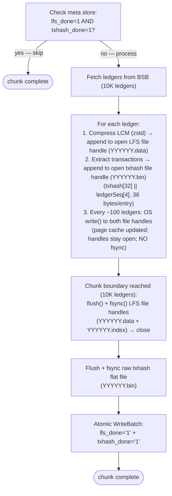
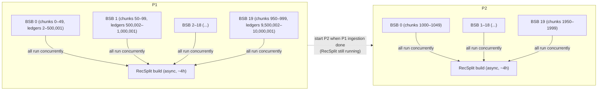

# Backfill Workflow

## Overview

Backfill mode ingests historical ledger ranges offline, writing directly to immutable formats (LFS chunks + raw txhash flat files) without RocksDB. No queries are served. The process exits when all requested ranges complete. On failure the operator re-runs the exact same command — idempotent resumption skips completed chunks.

---

## Design Principles

1. **No RocksDB during ingestion** — LFS chunks and raw txhash flat files are written directly.
2. **Flush every ~100 ledgers** — never accumulate more than ~100 ledgers in RAM.
3. **Chunk granularity for crash recovery** — a chunk is either fully written (both `lfs_done` + `txhash_done` set) or rewritten from scratch.
4. **BSB instances run in parallel within a range** — all 20 BSB instances for a range start concurrently. Each owns a 500K-ledger slice (50 chunks). This means completed chunks are NOT contiguous at crash time — gaps are expected and normal.
5. **RecSplit runs async** — while RecSplit builds for range N (~4 hours), the orchestrator moves on to ingest range N+1.
6. **No query capability** — the process serves only `getHealth` and `getStatus` during backfill.

---

## Workflow Diagram

```mermaid
flowchart TD
    START(["Start: parse --start-ledger, --end-ledger"]) --> VALIDATE["Validate range alignment<br/>start = rangeFirstLedger(N), end = rangeLastLedger(M)"]
    VALIDATE --> RANGES["Enumerate ranges to ingest<br/>(e.g., ranges 0, 1, 2 for ledgers 2–30,000,001)"]
    RANGES --> DISPATCH["Dispatch up to 2 range orchestrators in parallel"]

    subgraph ORCHESTRATOR
        INIT["Set range:N:state = INGESTING in meta store"]
        INIT --> SCAN["Scan all 1000 chunk flag pairs<br/>build skip-set: chunks where lfs_done=1 AND txhash_done=1"]
        SCAN --> BSB_INIT["Instantiate 20 BSB instances in parallel<br/>BSB instance K → chunks (rangeFirstChunk + K×50)..(rangeFirstChunk + K×50+49)<br/>where rangeFirstChunk = rangeID × 1000"]
        BSB_INIT --> BSB_PARALLEL["All 20 BSB instances run concurrently<br/>(each independently fetches + writes its 50-chunk slice)"]
        BSB_PARALLEL --> CHUNK_LOOP["Each BSB instance: for each chunk in its slice"]
        CHUNK_LOOP --> WRITE_CHUNK["Write chunk sub-workflow<br/>(skip if both flags set; see below)"]
        WRITE_CHUNK --> MORE_CHUNKS{more chunks in slice?}
        MORE_CHUNKS -->|yes| CHUNK_LOOP
        MORE_CHUNKS -->|no| BSB_DONE["BSB instance complete"]
        BSB_DONE --> ALL_DONE{all 20 BSB instances done?}
        ALL_DONE -->|no| BSB_PARALLEL
        ALL_DONE -->|yes| ALL_CHUNKS_DONE["All 1000 chunks complete"]
        ALL_CHUNKS_DONE --> WAIT_BSB["WaitForAllBSBInstances()<br/>(Pre-RecSplit Barrier — see doc 05)"]
        WAIT_BSB --> TRANSITION["Backfill transition workflow<br/>(RecSplit build — see doc 05)"]
        TRANSITION --> RANGE_DONE["Set range:N:state = COMPLETE"]
    end

    DISPATCH --> ORCHESTRATOR
    RANGE_DONE --> NEXT_RANGE{more ranges?}
    NEXT_RANGE -->|yes| DISPATCH
    NEXT_RANGE -->|no| EXIT(["Process exits"])
```



---

## Chunk Sub-workflow

Each chunk (10K ledgers) runs the following steps:



### Two-Level Write Lifecycle

Backfill uses a two-level flush model per chunk. Both levels must complete before the chunk is considered done.

**Level 1 — In-memory buffer flush (every ~100 ledgers)**

After accumulating ~100 ledgers worth of bytes in Go memory, the process calls `write()` on the two open file handles:
- `YYYYYY.data` (LFS chunk file, open for append)
- `YYYYYY.bin` (raw txhash flat file, open for append)

This copies bytes from Go heap to OS page cache. The file handles remain open. No fsync is issued. No meta store flags are set. A crash at this point leaves partial data in the OS page cache — it may or may not be reflected on disk. The chunk is not yet considered complete.

**Level 2 — Chunk close + fsync (at every 10K-ledger chunk boundary)**

After all 10,000 ledgers in the chunk have been processed and level-1 flushes are done:
1. `flush()` + `fsync()` on the LFS file handle (`YYYYYY.data` + `YYYYYY.index`) — forces all page cache bytes for this file to durable storage
2. Close the LFS file handles
3. `flush()` + `fsync()` on the txhash file handle (`YYYYYY.bin`)
4. Close the txhash file handle
5. Atomic WriteBatch: set `lfs_done=1` + `txhash_done=1` in meta store (both flags in a single WriteBatch after both fsyncs complete)

**Critical**: `lfs_done` and `txhash_done` are set atomically in a single meta store WriteBatch only after both fsyncs complete (see [11-checkpointing-and-transitions.md — Chunk Write Sequence](./11-checkpointing-and-transitions.md#chunk-write-sequence)). A crash between the last level-1 flush and the level-2 fsyncs leaves a partial file on disk — safe to overwrite on resume because neither flag was set. A crash after both fsyncs but before the WriteBatch leaves durable files with no flags — also safe to overwrite. The meta store WAL guarantees both flags survive a crash once the WriteBatch commits.

---

## BSB Configuration

BufferedStorageBackend (BSB) is the GCS-backed ledger source used during backfill.

| Parameter | Default | Description |
|-----------|---------|-------------|
| `parallel_ranges` | 2 | Number of concurrent range orchestrators |
| BSB instances per orchestrator | 20 | Number of BSB instances per range (valid: 10 or 20) |
| Ledgers per BSB instance (20 instances) | 500,000 | 10M ÷ 20 |
| Ledgers per BSB instance (10 instances) | 1,000,000 | 10M ÷ 10 |
| Chunks per BSB instance (20 instances) | 50 | 500K ÷ 10K |
| Chunks per BSB instance (10 instances) | 100 | 1M ÷ 10K |
| BSB internal prefetch | 1,000 | Ledgers prefetched per BSB instance |
| BSB internal workers | 20 | Download workers per BSB instance |
| Flush interval | ~100 ledgers | Max ledgers held in RAM per chunk write |

**All 20 BSB instances within a range run concurrently.** Each owns a contiguous 500K-ledger slice and writes its 50 chunks independently. This means at any given time, up to 20 chunks within a range are being written simultaneously. On crash, completed chunks are scattered non-contiguously — the recovery scan handles this correctly by checking all 1,000 flag pairs regardless of position.

**Why 20 BSB instances?** Each BSB instance must align to chunk boundaries (10K ledger multiples). With 20 instances, each spans exactly 50 chunks. With 10 instances, each spans 100 chunks. Both values divide evenly.

**Total in-flight BSBs**: up to 2 orchestrators × 20 instances = 40 BSB instances.

---

## Parallelism Model



**Within each orchestrator**: all 20 BSB instances run in parallel. Each fetches and writes its 500K-ledger slice independently. Chunks within a range are written concurrently — expect non-contiguous completion on crash.

**Across orchestrators**: when range N's ingestion completes and RecSplit starts building, the orchestrator slot is freed. Range N+1 begins ingesting immediately — RecSplit for range N runs concurrently with ingestion of range N+1.

---

## Memory Budget

See [12-metrics-and-sizing.md](./12-metrics-and-sizing.md#memory-budget--backfill-bsb-mode) for the full memory breakdown across all modes.

---

## getEvents Immutable Store — Placeholder

> **Status**: Not yet designed. This section reserves space for future work.

The backfill workflow currently writes two outputs per chunk: an LFS chunk file (`lfs_done`) and a raw txhash flat file (`txhash_done`). When `getEvents` support is added, a third output will be required per chunk — an events flat file or index structure — tracked by a new `events_done` flag.

Implications for this workflow:
- The chunk sub-workflow gains a third write step: extract events from each ledger → write events file → fsync → set `events_done`
- The RecSplit/index build phase (doc 05) gains a parallel events index build step
- A chunk is only skippable on resume when **all** flags (lfs_done, txhash_done, events_done) are set
- Memory budget above will increase by the events write buffer size per BSB instance

See [07-crash-recovery.md](./07-crash-recovery.md#getevents-immutable-store--placeholder) for crash recovery implications.

---

## Startup Resume Logic

On every startup in backfill mode:


---

## File Output Per Range

After a range completes (both ingestion and RecSplit), the durable output on disk is:

```
immutable/
├── ledgers/
│   └── chunks/
│       └── {XXXX}/              ← chunkID / 1000 (zero-padded 4 digits)
│           ├── {YYYYYY}.data    ← 10K compressed LCMs
│           └── {YYYYYY}.index   ← offset table for random access
└── txhash/
    └── {rangeID:04d}/
        └── index/               ← raw/ is DELETED once all 16 CFs are built
            ├── cf-0.idx         ← RecSplit CF 0 (txhashes starting with '0')
            ├── cf-1.idx
            ├── ...
            └── cf-f.idx         ← RecSplit CF 15 (txhashes starting with 'f')
```

During ingestion (state `INGESTING`), `immutable/txhash/{rangeID:04d}/raw/{YYYYYY}.bin` files also exist (one per completed chunk). These are the RecSplit build input. They are deleted immediately after all 16 CFs are built and verified — `raw/` is absent for any range in state `COMPLETE`.

---

## Error Handling

| Error Type | Action |
|-----------|--------|
| Fetch error from BSB | ABORT range; log error; operator re-runs |
| LFS write / fsync failure | ABORT range; do NOT set `lfs_done`; operator re-runs |
| TxHash write / fsync failure | ABORT range; do NOT set `txhash_done`; operator re-runs |
| RecSplit build failure | ABORT RecSplit; state remains `RECSPLIT_BUILDING`; operator re-runs; resume from first incomplete CF |
| Meta store write failure | ABORT; treat as crash; operator re-runs |

All errors result in process exit with non-zero code. The operator re-runs the same command. Completed work is never repeated.

---

## Related Documents

- [01-architecture-overview.md](./01-architecture-overview.md) — two-pipeline overview
- [02-meta-store-design.md](./02-meta-store-design.md) — meta store keys written during backfill
- [05-backfill-transition-workflow.md](./05-backfill-transition-workflow.md) — RecSplit build detail
- [07-crash-recovery.md](./07-crash-recovery.md) — crash scenarios for backfill
- [09-directory-structure.md](./09-directory-structure.md) — file paths for chunks and indexes
- [10-configuration.md](./10-configuration.md) — BSB and parallelism config
- [12-metrics-and-sizing.md](./12-metrics-and-sizing.md) — memory budgets, storage estimates, hardware requirements
