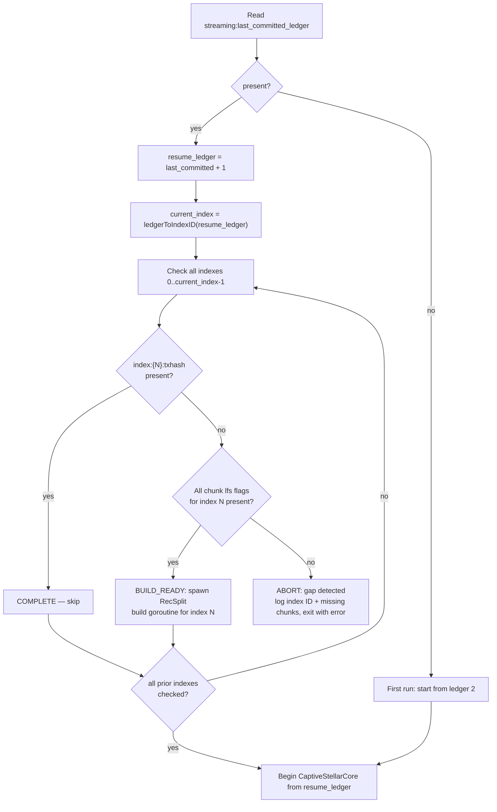
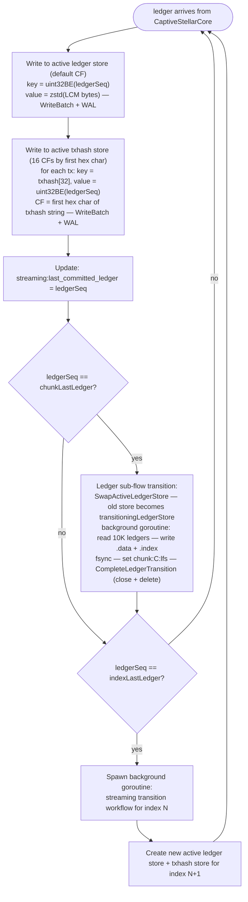
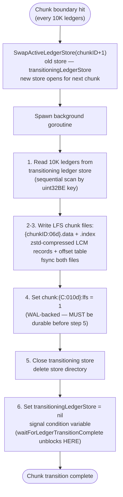
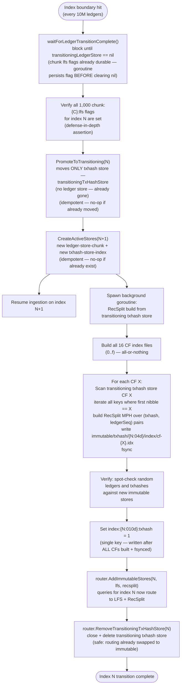
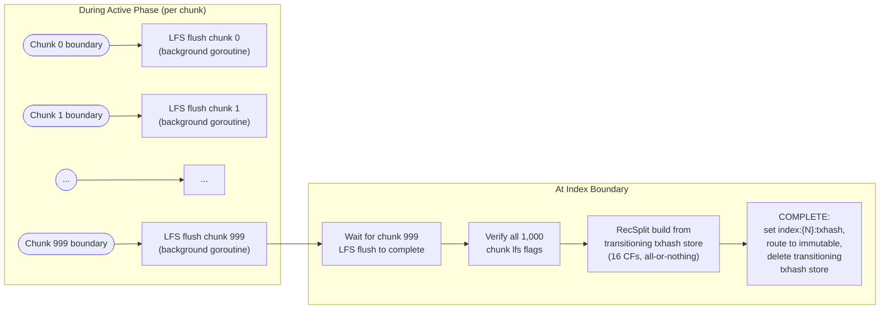

# Streaming Workflow and Transition

## Part 1 — Streaming Overview

### Overview

Streaming mode ingests live Stellar ledgers via CaptiveStellarCore, one ledger at a time, while serving queries. It writes to two separate active RocksDB stores per index (ledger + txhash) and triggers a background transition workflow at each 10M-ledger index boundary.

The process is a long-running daemon that exits only on fatal error.

---

### Design Principles

1. **One ledger per batch** — optimizes for low latency and fine-grained crash recovery.
2. **Checkpoint every ledger** — `streaming:last_committed_ledger` updated after every successful write.
3. **WAL enabled** — both active RocksDB stores (ledger and txhash) must have WAL on; crash recovery depends on it.
4. **Background LFS flush at chunk boundary** — while active, completed 10K-ledger chunks are flushed from the ledger store to LFS chunk files in a background goroutine.
5. **Transition in background at index boundary** — when index N completes (last ledger committed), the system waits for ALL in-flight chunk LFS flush goroutines to complete (not just the last chunk — if an earlier chunk's goroutine is still running, it waits for that too), then a goroutine handles the RecSplit txhash index build. Ingestion of index N+1 starts immediately.
6. **Gap detection at startup** — all indexes before the current streaming index must be complete or in a recoverable transition state. State is derived from key presence (see [Startup Validation](#startup-validation)).

---

### Active Store Architecture

Each streaming index has **two separate RocksDB instances** that operate as independent sub-flows with different transition cadences:

| Sub-flow | Store | Transition cadence | Max active | Max transitioning | Max total |
|----------|-------|--------------------|------------|-------------------|-----------|
| Ledger | `ledger-store-chunk-{chunkID:06d}/` | Every 10K ledgers (chunk boundary) | **1** | **1** | **2** |
| TxHash | `txhash-store-index-{indexID:04d}/` | Every 10M ledgers (index boundary) | **1** | **1** | **2** |

**Each sub-flow can have at most 1 active store and 1 transitioning store at any point in time.** At each chunk boundary, the active ledger store transitions (active -> transitioning -> LFS flush -> close + delete) while a new active ledger store opens for the next chunk. The txhash store spans the entire index and only transitions at the index boundary.

#### Ledger Store

Stores full ledger data for the current chunk. No column families — default CF only.

| Key | Value | Notes |
|-----|-------|-------|
| `uint32BE(ledgerSeq)` | `zstd(LedgerCloseMeta bytes)` | Big-endian key for lexicographic order |

Path: `<active_stores_base_dir>/ledger-store-chunk-{chunkID:06d}/`

WAL is **required** (never `DisableWAL`).

#### TxHash Store

Stores transaction hash to ledger sequence mappings for the entire index, sharded into 16 column families by the first hex character of the txhash (`0`-`f`).

| CF Name | Key | Value | Notes |
|---------|-----|-------|-------|
| `cf-0` through `cf-f` | `txhash[32]` | `uint32BE(ledgerSeq)` | 32-byte raw hash; 4-byte value |

CF routing: first hex character of the 64-char hash string (equivalently `txhash[0] >> 4` on raw bytes, values `0x0`-`0xf`).

Path: `<active_stores_base_dir>/txhash-store-index-{indexID:04d}/`

WAL is **required** (never `DisableWAL`).

---

### Startup Validation

Before ingestion begins, the service validates the meta store. State is derived from key presence — there are no stored state values. For each prior index, the system checks `index:{N}:txhash` and `chunk:{C}:lfs` keys to determine completeness.



**Gap detection logic**: Every index before the current streaming index must be either complete or build-ready:

- **`index:{N}:txhash` present**: COMPLETE — skip.
- **`index:{N}:txhash` absent, all `chunk:{C}:lfs` flags present**: BUILD_READY — spawn RecSplit build goroutine before starting ingestion. Handles a prior crash mid-RecSplit-build.
- **`index:{N}:txhash` absent, some `chunk:{C}:lfs` flags missing**: Gap error — abort with a message listing the offending index ID and missing chunk flags.

> **Operational continuity**: On crash, restart with the same command and config. Streaming detects mid-transition indexes and resumes automatically. Backfill scans chunk flags and resumes from incomplete chunks. No mode switch is ever needed to complete in-progress work.

---

### Main Ingestion Loop



**Per-ledger write detail**:
- Marshal LCM to binary -> zstd compress -> write to ledger store (default CF) with key = `uint32BE(ledgerSeq)`, in a single `WriteBatch` (WAL enabled)
- For each transaction in ledger: write `txhash[32] -> uint32BE(ledgerSeq)` to txhash store, routing to CF by first hex character of the txhash string (equivalently `txhash[0] >> 4` on raw bytes), in a single `WriteBatch` (WAL enabled)
- After both WriteBatches succeed: update `streaming:last_committed_ledger` in meta store

**Chunk boundary behavior** (every 10K ledgers — this is the ledger sub-flow transition):
- `SwapActiveLedgerStore(chunkID+1)` moves the current active ledger store to `transitioningLedgerStore` (stays open for reads); a new active ledger store opens for the next chunk
- A background goroutine reads the completed chunk's 10K ledgers from the transitioning ledger store
- Writes the LFS `.data` + `.index` chunk files; fsyncs both
- Sets `chunk:{C:010d}:lfs = "1"` in meta store (WAL-backed)
- Calls `CompleteLedgerTransition(chunkID)` — closes the transitioning ledger store, deletes its directory, sets `transitioningLedgerStore = nil`, and signals the condition variable

---

### Index Boundary Handling

When `ledgerSeq == indexLastLedger(currentIndex)` (e.g., ledger 10,000,001 for index 0):

1. Write last ledger to both active stores with WAL; update `streaming:last_committed_ledger`
2. `waitForLedgerTransitionComplete()` — block until ALL in-flight chunk LFS flush goroutines complete
3. Verify all 1,000 `chunk:{C}:lfs` flags are set (defense-in-depth assertion)
4. `PromoteToTransitioning(N)` — moves **only the txhash store** (all ledger stores already deleted at chunk boundaries)
5. Create new active stores for index N+1; resume ingestion immediately
6. Spawn background RecSplit build goroutine (see [Part 2 — Transition Workflow](#part-2--transition-workflow))

Physical operations (PromoteToTransitioning, CreateActiveStores) are idempotent — safe to repeat after a crash. During transition, ledger queries route to LFS; txhash queries route to the transitioning txhash store. See [08-query-routing.md](./08-query-routing.md).

---

### Checkpoint Timing

The streaming checkpoint is per-ledger:

```
After ledger L is committed to both active RocksDB stores (WriteBatch + WAL flush):
  Write: streaming:last_committed_ledger = L
```

On crash, resume from `last_committed_ledger + 1`. Re-ingested ledgers are idempotent (same key/value pairs overwrite existing entries).

> **INVARIANT — Checkpoint Write Ordering**: `streaming:last_committed_ledger` MUST be written to the meta store ONLY after both the ledger store WriteBatch and the txhash store WriteBatch have succeeded. Violating this order causes silent data loss on crash recovery — the checkpoint would advance past ledgers that were never persisted to one or both stores. This ordering, combined with the idempotency of re-inserting the same `ledgerSeq -> LCM` data on recovery, is the sole mechanism that provides cross-store consistency. No cross-store atomic transactions are needed.

| Mode | Checkpoint interval | Resume from |
|------|--------------------|-----------  |
| Backfill | per-chunk (10K ledgers) | first incomplete chunk |
| Streaming | per-ledger (1 ledger) | `last_committed_ledger + 1` |

LFS chunk flush checkpoints (separate from ledger checkpoints): `chunk:{C:010d}:lfs = "1"` after each chunk fsync during the active phase. These accumulate independently and are preserved across crashes — on resume, already-flushed chunks are skipped.

---

## Part 2 — Transition Workflow

The streaming transition workflow converts active RocksDB stores to immutable storage (LFS chunks + RecSplit index). The two sub-flows (ledger and txhash) transition at different cadences as described in [Part 1 — Active Store Architecture](#active-store-architecture). By the time the index boundary is reached, all 1,000 ledger chunks have already been individually transitioned to LFS during the active phase. The only work remaining at the index boundary is the txhash store's RecSplit build.

---

### Ledger Sub-flow Transition (Every 10K Ledgers)

#### Trigger Condition

Triggered in the streaming ingestion loop when a chunk boundary is crossed:
```go
ledgerSeq == chunkLastLedger(currentChunk)
```
(e.g., ledger 10,001 for chunk 0, ledger 20,001 for chunk 1, etc.)

#### Workflow

1. **Swap**: `SwapActiveLedgerStore(chunkID+1)` moves the current active ledger store to `transitioningLedgerStore`. It stays **open for reads** during the LFS flush. A new active ledger store opens for the next chunk.
2. **Background flush**: A goroutine runs the following steps **in this exact order**:
   1. Read 10K ledgers from the transitioning ledger store (sequential scan by `uint32BE` key)
   2. Write `.data` + `.index` files
   3. fsync both files
   4. Write `chunk:{C:010d}:lfs = "1"` to meta store (WAL-backed) — **MUST complete before step 5**
   5. Close the transitioning ledger store and delete its directory
   6. Set `transitioningLedgerStore = nil` and signal the condition variable — `waitForLedgerTransitionComplete()` unblocks HERE

**Critical ordering invariant**: The `lfs` flag is the durability checkpoint; the nil-signal is just a notification. The flag MUST be durable in the meta store before the store reference is cleared and the completion signal fires. If the goroutine clears the store reference before persisting the flag, `waitForLedgerTransitionComplete()` unblocks prematurely. A crash in this window would leave the flag absent, causing the chunk to be re-ingested on recovery even though the LFS files were already written.

#### Workflow Diagram



#### Query Routing During Ledger Transition

While the ledger sub-flow transition is in progress:
- The **transitioning ledger store** remains open and serves reads for ledgers in the transitioning chunk
- The **new active ledger store** serves reads for ledgers in the current chunk
- Once `CompleteLedgerTransition` completes and the LFS file exists, queries for that chunk route to LFS

#### LFS Chunk File Format

- `.data` file: contiguous compressed LCM records (variable-length)
- `.index` file: offset table, one `uint64` per ledger, enabling O(1) random access

**Flush/fsync**: Each chunk file pair is fsynced before setting the `lfs` flag. Partial writes are safe — the `chunk:{C}:lfs` flag is the sole indicator of completion. The flag must be persisted to the meta store BEFORE the transitioning store reference is cleared (see goroutine ordering above).

---

### TxHash Sub-flow Transition (Every 10M Ledgers)

#### Trigger Condition

Triggered in the streaming ingestion loop when an index boundary is crossed:
```go
ledgerSeq == indexLastLedger(currentIndex)
```
(e.g., ledger 10,000,001 for index 0, ledger 20,000,001 for index 1, etc.)

#### Index-Boundary Coordination: Wait for Lower-Cadence Sub-flows

At the index boundary, the system **must wait** for ALL in-flight ledger sub-flow transitions to complete before the txhash transition proceeds. The last chunk boundary triggers an LFS flush goroutine that may still be running; earlier chunks may also be in flight.

**The invariant**: All sub-flows with a lower cadence must complete before the higher-cadence transition proceeds.

**Steps before txhash promotion**:
1. `waitForLedgerTransitionComplete()` — block until `transitioningLedgerStore == nil`. The goroutine ordering invariant (fsync `lfs` flag -> close store -> set nil -> signal) guarantees all `lfs` flags are durable by the time this unblocks.
2. Verify all 1,000 `chunk:{C}:lfs` flags (defense-in-depth assertion)
3. Promote the txhash store and begin RecSplit

#### Workflow

1. `waitForLedgerTransitionComplete()` — block until all chunk LFS flushes complete
2. Verify all 1,000 `chunk:{C}:lfs` flags
3. `PromoteToTransitioning(N)` — moves only the txhash store (ledger stores already deleted)
4. Create new active stores for index N+1; resume ingestion immediately
5. Spawn background RecSplit build goroutine

#### Workflow Diagram



#### Query Routing During TxHash Transition

While index N is transitioning:
- **Ledger queries**: Served from LFS chunk files (all ledger stores already transitioned and deleted during the active phase)
- **TxHash queries**: Served from the **transitioning txhash store** (still open for reads)
- The immutable RecSplit index is not used for queries until `AddImmutableStores` completes

**Critical ordering**: `SET_COMPLETE` (meta store) -> `AddImmutableStores` (router swap) -> `RemoveTransitioningTxHashStore` (delete). Deletion always happens last, after routing is already pointed at immutable stores. There is no query gap.

---

---

### RecSplit Build from Transitioning TxHash Store

Unlike backfill (which reads raw flat files), the streaming transition reads directly from the **transitioning** txhash store. All 16 CF index files are built — the build is all-or-nothing per index. Each CF is processed independently:

1. Iterate all keys in transitioning txhash store CF `X` (the CF whose name matches the first hex character of the txhash; `key[0] >> 4 == X` in raw byte terms)
2. Build RecSplit minimal perfect hash over the matching `(txhash, ledgerSeq)` pairs
3. Write `immutable/txhash/{indexID:04d}/index/cf-{X}.idx`
4. fsync

After all 16 CFs are built and fsynced, a single `index:{N:010d}:txhash = "1"` key is written to the meta store. There is no per-CF incremental tracking — if the process crashes mid-build, all partial index files are deleted and the entire build reruns from scratch on resume.

**Empty CFs**: If a CF has zero matching transactions for its nibble (e.g., no txhashes in the entire index start with hex character `a`), the RecSplit build for that CF produces an empty index file (`cf-a.idx` with zero entries). An empty index is valid — lookups against it always return NOT_FOUND, which is correct since no transactions exist for that nibble in this index. The implementation must not treat an empty input set as an error.

The transitioning RocksDB store is read-only during RecSplit build (ingestion has moved to index N+1's store).

**Note**: The streaming transition does **not** produce raw txhash flat files. It builds RecSplit directly from RocksDB. This is the primary structural difference from the backfill transition.

---

### Verification Step

Before deleting the transitioning txhash store, the workflow spot-checks at least 1 ledger and 1 txhash per chunk (1,000 samples minimum). This runs inline in the transition goroutine (not tracked in the meta store).

1. Sample one random ledger from each chunk; read from LFS and verify contents.
2. Sample one random txhash from each chunk; look up in RecSplit and verify against LFS.

Per-chunk sampling guarantees that systematic per-chunk corruption is caught. 1,000 lookups complete in seconds.

If any mismatch: ABORT; do not delete transitioning txhash store; do not set `index:{N}:txhash`; log error.

---

### Relationship to Streaming Ingestion



---

### State Transitions in Meta Store

State is derived from key presence — there are no stored state values. The following shows the keys written at each phase.

#### During Active Phase (at each chunk boundary):

```
Chunk 0 completes (ledger 10,001):
  chunk:000000:lfs     ->  "1"   (set by background LFS flush goroutine
                                   BEFORE transitioningLedgerStore = nil)

Chunk 1 completes (ledger 20,001):
  chunk:000001:lfs     ->  "1"

  ... (each chunk transitions independently at its boundary) ...

Chunk 999 completes (ledger 10,000,001):
  chunk:000999:lfs     ->  "1"   (last chunk — flag durable before nil-signal
                                   unblocks waitForLedgerTransitionComplete)
```

#### At index boundary (index 0 -> index 1):

```
Index boundary hit (ledger 10,000,001):
  waitForLedgerTransitionComplete()     <- block until chunk 999's LFS flush done
  Verify all 1,000 chunk lfs flags      <- safety check

  PromoteToTransitioning(0)             <- move txhash store (idempotent)
  CreateActiveStores(1)                 <- create directories (idempotent)

  streaming:last_committed_ledger      ->  10,000,001

RecSplit build (from transitioning txhash store):
  Build all 16 CF index files
  fsync all

Verification passes, then:
  index:0000000000:txhash               ->  "1"   (single key — marks index 0 complete)
  router.AddImmutableStores(0, ...)                <- queries now route to LFS + RecSplit
  router.RemoveTransitioningTxHashStore(0)         <- transitioning txhash store deleted
```

The same pattern repeats for every subsequent index: chunk flags accumulate during ACTIVE, then a single RecSplit build + verify + cleanup sequence runs at the index boundary.

---

## Part 3 — Crash Recovery

### Crash During Ledger Sub-flow Transition (at chunk boundary)

If the daemon crashes during a background LFS flush goroutine:

1. The transitioning ledger store is gone; the active ledger store is intact via WAL recovery
2. The chunk's `chunk:{C}:lfs` flag is absent (goroutine enforces flag persistence BEFORE clearing nil — no window where the flag is missing but the signal already fired)
3. Recovery: re-ingest from `last_committed_ledger + 1`; the chunk boundary triggers a new LFS flush

### Crash During Index-Boundary Coordination

**SC1: Crash while waiting for last chunk's LFS flush at index boundary**

- State: chunk 999's `chunk:{C}:lfs` absent; `streaming:last_committed_ledger` = index boundary ledger
- Recovery: resume from `last_committed_ledger + 1`. Re-enter index boundary handling; `lfs` flag scan finds chunk 999 absent; re-trigger its LFS flush from WAL-recovered ledger store before proceeding with txhash transition.

**SC2: Crash after all lfs flags verified, before RecSplit completes**

- State: all 1,000 `chunk:{C}:lfs` flags = `"1"`, `index:{N}:txhash` absent. Physical operations may be partial.
- Recovery: startup triage derives BUILD_READY. Redo physical operations (idempotent no-ops). Spawn RecSplit goroutine.

### Crash During TxHash Sub-flow Transition (RecSplit Build)

If the daemon crashes while the RecSplit build goroutine is running:

1. On restart: all `chunk:{C}:lfs` flags already set during the active phase, `index:{N}:txhash` absent
2. Startup triage derives BUILD_READY state. The entire RecSplit build reruns from scratch — all partial index files are deleted, all 16 CFs rebuilt from the transitioning txhash store (intact via WAL)
3. After all CFs complete: verify -> set `index:{N}:txhash = "1"` -> swap routing -> delete transitioning txhash store

### Crash After Verify, Before Store Delete

- State: `index:{N}:txhash` present, transitioning txhash store still on disk (orphaned)
- Recovery: startup sees COMPLETE. Delete orphaned store; route to immutable.

---

## Part 4 — Query Availability

| Phase | getLedgerBySequence | getTransactionByHash |
|-------|--------------------|--------------------|
| Active | Active ledger RocksDB store (or transitioning ledger store during chunk transition, or LFS for already-transitioned chunks) | Active txhash RocksDB store |
| Transitioning | Immutable LFS chunk files (all ledger stores already transitioned during active phase) | Transitioning txhash RocksDB store (still open) |
| Complete | Immutable LFS store | Immutable RecSplit index |

Queries are never blocked. During the active phase, ledger queries route to the active or transitioning ledger store (or LFS for completed chunks). During transitioning, the transitioning txhash store remains open and queryable until the RecSplit build completes and the router swaps to immutable stores.

---

## Part 5 — Error Handling

| Error Type | Action |
|-----------|--------|
| CaptiveStellarCore unavailable | RETRY with backoff; log; ABORT after N retries |
| Ledger store write failure | ABORT — storage is corrupted or disk full |
| TxHash store write failure | ABORT — storage is corrupted or disk full |
| Meta store write failure | ABORT — cannot maintain checkpoint |
| Ledger store read failure during LFS write | ABORT chunk transition; do not set `chunk:{C}:lfs`; log; daemon restarts and resumes |
| LFS file write/fsync failure | ABORT chunk transition; do not set `chunk:{C}:lfs` |
| LFS flush failure with missing `lfs` flags (disk full, I/O error) | If an LFS flush fails and the `lfs` flag is not set for one or more chunks, the index boundary verification (`waitForLedgerTransitionComplete`) will detect the missing flags. The system MUST abort the index transition and exit with a fatal error — it must NOT proceed with a partial set of `lfs` flags. The operator must free disk space and restart, at which point the missing chunks' LFS flushes will be retried from the active ledger stores (recovered via RocksDB WAL replay). |
| Background LFS flush failure (general) | LOG error; do not set `chunk:{C}:lfs`; transition goroutine handles on retry at index boundary |
| RecSplit build failure | ABORT txhash transition; do not set `index:{N}:txhash` |
| Verification mismatch | ABORT; do NOT delete transitioning txhash store; do not set `index:{N}:txhash`; log; operator intervention required |
| Transitioning txhash store delete failure | LOG and continue; store will be cleaned up on next run |
| Transition goroutine failure | LOG error; ABORT daemon |

---

## Part 6 — getEvents Placeholder

> **Status**: Not yet designed. This section reserves space for future work.

When `getEvents` support is added, it will require:

- A **separate active events RocksDB store** — its own RocksDB instance, independent of the ledger store and txhash store
- Per-ledger event data written alongside existing ledger and txhash writes
- Background chunk-level flush to an immutable events index (same cadence as ledger sub-flow: per 10K ledgers, while active)
- An **events sub-flow transition** — likely at chunk cadence (10K ledgers), same as ledger sub-flow
- Each events transition: active events store -> transitioning -> events index build -> close + delete
- **Each sub-flow can have at most 1 active store and 1 transitioning store at any point in time.**
- At the index boundary, the same cadence-check invariant applies: all events sub-flow transitions (10K cadence) must complete before the txhash transition (10M cadence) proceeds
- Verification step extends to include events: spot-check random events against new index
- The transitioning txhash store is not deleted until ledger, events, and txhash sub-flows all complete
- Query availability: served from active events store during active/transitioning, from immutable events index once complete

---

## Part 7 — Related Documents

- [02-meta-store-design.md](./02-meta-store-design.md) — key schema (`streaming:last_committed_ledger`, chunk flags, index key)
- [03-backfill-workflow.md](./03-backfill-workflow.md) — contrast: backfill transition uses raw flat files, no RocksDB
- [07-crash-recovery.md](./07-crash-recovery.md) — streaming crash scenarios
- [08-query-routing.md](./08-query-routing.md) — routing during active and transitioning phases
- [11-checkpointing-and-transitions.md](./11-checkpointing-and-transitions.md) — index boundary math
