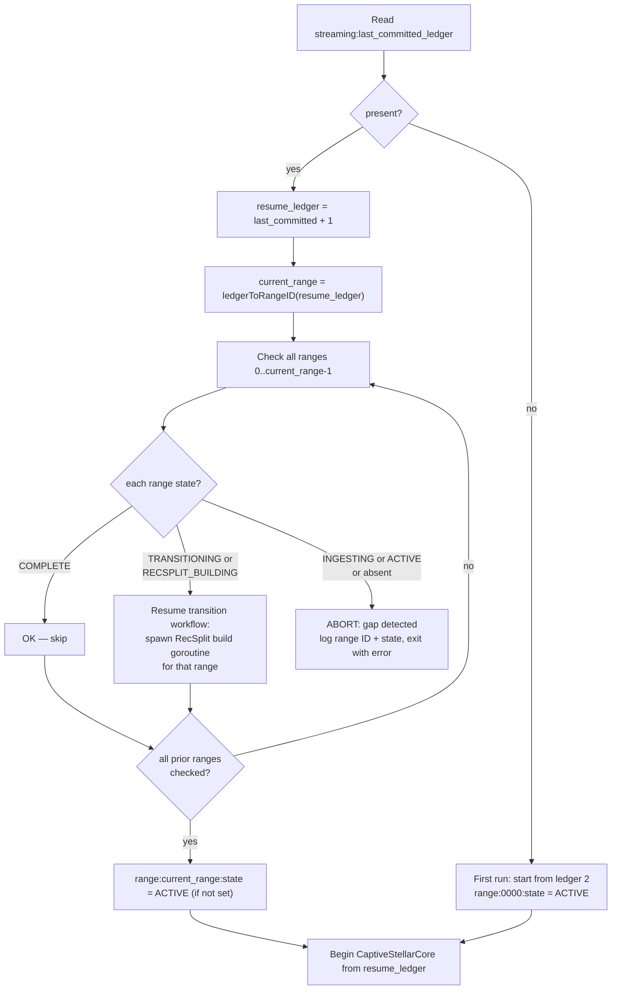
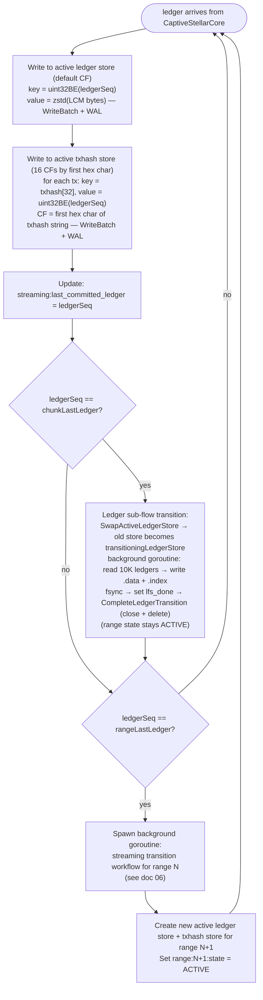

# Streaming Workflow

## Overview

Streaming mode ingests live Stellar ledgers via CaptiveStellarCore, one ledger at a time, while simultaneously serving queries. It writes to two separate active RocksDB stores for the current range (one ledger store, one txhash store), and automatically triggers a background transition workflow (see [06-streaming-transition-workflow.md](./06-streaming-transition-workflow.md)) when a 10M-ledger range boundary is crossed.

Streaming mode is a long-running daemon. It never exits unless there is a fatal error.

---

## Design Principles

1. **One ledger per batch** — optimizes for low latency and fine-grained crash recovery.
2. **Checkpoint every ledger** — `streaming:last_committed_ledger` updated after every successful write.
3. **WAL enabled** — both active RocksDB stores (ledger and txhash) must have WAL on; crash recovery depends on it.
4. **Background LFS flush at chunk boundary** — while ACTIVE, completed 10K-ledger chunks are flushed from the ledger store → LFS chunk files in a background goroutine. Range state stays `ACTIVE` throughout.
5. **Transition in background at range boundary** — when range N completes (last ledger committed), the system waits for ALL in-flight chunk LFS flush goroutines to complete (not just the last chunk — if an earlier chunk's goroutine is still running, it waits for that too), then a goroutine handles the RecSplit txhash index build. Ingestion of range N+1 starts immediately.
6. **Gap detection at startup** — all ranges before the current streaming range must be `COMPLETE` or in a recoverable transition state (`TRANSITIONING` or `RECSPLIT_BUILDING`).

---

## Active Store Architecture

Each streaming range has **two separate RocksDB instances** that operate as independent sub-flows with different transition cadences:

| Sub-flow | Store | Transition cadence | Max active | Max transitioning | Max total |
|----------|-------|--------------------|------------|-------------------|-----------|
| Ledger | `ledger-store-chunk-{chunkID:06d}/` | Every 10K ledgers (chunk boundary) | **1** | **1** | **2** |
| TxHash | `txhash-store-range-{rangeID:04d}/` | Every 10M ledgers (range boundary) | **1** | **1** | **2** |

**Each sub-flow can have at most 1 active store and 1 transitioning store at any point in time.** At each chunk boundary, the active ledger store transitions (active → transitioning → LFS flush → close + delete) while a new active ledger store opens for the next chunk. The txhash store spans the entire range and only transitions at the range boundary.

### Ledger Store

Stores full ledger data for the current chunk. No column families — default CF only.

| Key | Value | Notes |
|-----|-------|-------|
| `uint32BE(ledgerSeq)` | `zstd(LedgerCloseMeta bytes)` | Big-endian key for lexicographic order |

Path: `<active_stores_base_dir>/ledger-store-chunk-{chunkID:06d}/`

WAL is **required** (never `DisableWAL`).

### TxHash Store

Stores transaction hash → ledger sequence mappings for the entire range, sharded into 16 column families by the first hex character of the txhash (`0`–`f`).

| CF Name | Key | Value | Notes |
|---------|-----|-------|-------|
| `cf-0` through `cf-f` | `txhash[32]` | `uint32BE(ledgerSeq)` | 32-byte raw hash; 4-byte value |

CF routing: first hex character of the 64-char hash string (equivalently `txhash[0] >> 4` on raw bytes, values `0x0`–`0xf`).

Path: `<active_stores_base_dir>/txhash-store-range-{rangeID:04d}/`

WAL is **required** (never `DisableWAL`).

---

## Startup Validation

Before ingestion begins, the service validates the meta store:



**Gap detection invariant**: Every range before the current streaming range must be either `COMPLETE` or in a **recoverable transition state** (`TRANSITIONING` or `RECSPLIT_BUILDING`).

- **COMPLETE**: No action needed — the range is fully transitioned to immutable stores.
- **TRANSITIONING** or **RECSPLIT_BUILDING**: The system resumes the transition workflow for that range (spawns the RecSplit build goroutine or resumes it) before starting streaming ingestion for the current range. This handles the case where a previous streaming daemon crashed mid-transition.
- **INGESTING**, **ACTIVE**, or **absent**: This indicates a gap — the range was never fully ingested or its state is missing. The service aborts with a clear error message listing the offending range IDs and their states.

> **Operational continuity — crash recovery for operators**
>
> If the streaming daemon crashes, the operator restarts with the exact same configuration (including `--mode streaming`). The startup validation detects any prior ranges that were mid-transition and resumes them automatically. The operator does NOT need to switch back to `--mode backfill` to complete a transition that was in progress during streaming.
>
> Similarly, if backfill mode crashes, the operator restarts with the exact same command and configuration (including `--mode backfill`). The orchestrator scans chunk flags and resumes from the first incomplete chunk.

---

## Main Ingestion Loop



**Per-ledger write detail**:
- Marshal LCM to binary → zstd compress → write to ledger store (default CF) with key = `uint32BE(ledgerSeq)`, in a single `WriteBatch` (WAL enabled)
- For each transaction in ledger: write `txhash[32] → uint32BE(ledgerSeq)` to txhash store, routing to CF by first hex character of the txhash string (equivalently `txhash[0] >> 4` on raw bytes), in a single `WriteBatch` (WAL enabled)
- After both WriteBatches succeed: update `streaming:last_committed_ledger` in meta store

**Chunk boundary behavior** (every 10K ledgers, while ACTIVE — this is the ledger sub-flow transition):
- `SwapActiveLedgerStore(rangeID, chunkID+1)` moves the current active ledger store to `transitioningLedgerStore` (stays open for reads); a new active ledger store opens for the next chunk
- A background goroutine reads the completed chunk's 10K ledgers from the transitioning ledger store
- Writes the LFS `.data` + `.index` chunk files; fsyncs both
- Sets `range:N:chunk:C:lfs_done = "1"` in meta store (WAL-backed)
- Calls `CompleteLedgerTransition(chunkID)` — closes the transitioning ledger store, deletes its directory, sets `transitioningLedgerStore = nil`, and signals the condition variable
- The range state remains `ACTIVE` — each chunk transitions independently at its boundary

---

## Range Boundary Handling

When `ledgerSeq == rangeLastLedger(currentRange)` (e.g., ledger 10,000,001 for range 0):

1. Last ledger written to both active stores (ledger store + txhash store) with WAL
2. `streaming:last_committed_ledger` updated to boundary ledger
3. `waitForLedgerTransitionComplete()` — block until ALL in-flight chunk LFS flush goroutines complete (not just the last chunk — if an earlier chunk's goroutine is still running, it waits for that too; the last chunk boundary triggers a background LFS flush that may still be in progress, but so might an earlier chunk's)
4. Verify all 1,000 `lfs_done` flags for the range are set (safety check — all were set during ACTIVE at their individual chunk boundaries)
5. `range:N:state` set to `TRANSITIONING`
6. `PromoteToTransitioning(N)` — moves **only the txhash store** to `transitioningTxHashStore` (no ledger store involved — all ledger stores were already transitioned at their chunk boundaries and deleted)
7. Background goroutine spawned for RecSplit build from transitioning txhash store (see [06-streaming-transition-workflow.md](./06-streaming-transition-workflow.md))
8. New active ledger store + txhash store created for range N+1
9. `range:N+1:state` set to `ACTIVE`

> **Atomic WriteBatch**: Steps 5 and 9 MUST be written in a single atomic meta store WriteBatch (one WAL fsync). This ensures there is no intermediate state where one range has transitioned but the other has not. See [06-streaming-transition-workflow.md -- Atomic Range Boundary WriteBatch](./06-streaming-transition-workflow.md#atomic-range-boundary-writebatch).
10. Ingestion continues immediately with range N+1's first ledger

At the range boundary, all 1,000 ledger chunks have already been individually transitioned to LFS during the ACTIVE phase. The only remaining work is the txhash store's RecSplit index build, which runs in a background goroutine **concurrently** with ingestion of range N+1. During the TRANSITIONING state, ledger queries for range N are served from the LFS chunk files (already written), and txhash queries are served from the transitioning txhash store (still open for reads). See [08-query-routing.md](./08-query-routing.md).

---

## Checkpoint Timing

The streaming checkpoint is per-ledger:

```
After ledger L is committed to both active RocksDB stores (WriteBatch + WAL flush):
  Write: streaming:last_committed_ledger = L
```

On crash, resume from `last_committed_ledger + 1`. Re-ingested ledgers are idempotent (same key/value pairs overwrite existing entries).

> **INVARIANT — Checkpoint Write Ordering**: `streaming:last_committed_ledger` MUST be written to the meta store ONLY after both the ledger store WriteBatch and the txhash store WriteBatch have succeeded. Violating this order causes silent data loss on crash recovery — the checkpoint would advance past ledgers that were never persisted to one or both stores. This ordering, combined with the idempotency of re-inserting the same `ledgerSeq → LCM` data on recovery, is the sole mechanism that provides cross-store consistency. No cross-store atomic transactions are needed.

| Mode | Checkpoint interval | Resume from |
|------|--------------------|-----------  |
| Backfill | per-chunk (10K ledgers) | first incomplete chunk |
| Streaming | per-ledger (1 ledger) | `last_committed_ledger + 1` |

LFS chunk flush checkpoints (separate from ledger checkpoints): `range:N:chunk:C:lfs_done = "1"` after each chunk fsync during ACTIVE. These accumulate independently and are preserved across crashes — on resume, already-flushed chunks are skipped.

---

## Query Availability During Streaming

| Range State | getLedgerBySequence | getTransactionByHash |
|-------------|--------------------|--------------------|
| `ACTIVE` | Active ledger RocksDB store (or transitioning ledger store during chunk transition, or LFS for already-transitioned chunks) | Active txhash RocksDB store |
| `TRANSITIONING` | Immutable LFS chunk files (all ledger stores already transitioned during ACTIVE) | Transitioning txhash RocksDB store (still open) |
| `COMPLETE` | Immutable LFS store | Immutable RecSplit index |

Queries are never blocked. During ACTIVE, ledger queries route to the active or transitioning ledger store (or LFS for completed chunks). During TRANSITIONING, the transitioning txhash store remains open and queryable until the RecSplit build completes and the router swaps to immutable stores.

> **getEvents placeholder**: When `getEvents` support is added, it will require a **separate active events RocksDB store** for event data, with per-chunk flush to an immutable events index. The events store transitions at every chunk boundary (active → transitioning → events index build → close + delete; max 1 active + 1 transitioning at any time), same cadence as the ledger store. The txhash store transitions every 10M ledgers at range boundaries. Query routing for `getEvents` will follow the same ACTIVE→TRANSITIONING→COMPLETE pattern.

---

## getEvents Immutable Store — Placeholder

> **Status**: Not yet designed. This section reserves space for future work.

When `getEvents` support is added to the streaming workflow, it will require:

- A **separate active events RocksDB store** — its own RocksDB instance, independent of the ledger store and txhash store (rotation cadence TBD)
- Per-ledger event data written alongside existing ledger and txhash writes
- Background chunk-level flush to an immutable events index (same cadence as ledger sub-flow: per 10K ledgers, while ACTIVE)
- An events sub-flow transition in the streaming transition workflow (independent sub-flow at chunk cadence; at range boundary, all events sub-flow transitions must complete before the txhash transition proceeds)
- Query availability: served from active events store during ACTIVE/TRANSITIONING, from immutable events index once COMPLETE

---

## Error Handling

| Error Type | Action |
|-----------|--------|
| CaptiveStellarCore unavailable | RETRY with backoff; log; ABORT after N retries |
| Ledger store write failure | ABORT — storage is corrupted or disk full |
| TxHash store write failure | ABORT — storage is corrupted or disk full |
| Meta store write failure | ABORT — cannot maintain checkpoint |
| Background LFS flush failure | LOG error; do not set `lfs_done`; transition goroutine handles on retry at range boundary |
| Transition goroutine failure | LOG error; set range state to error; ABORT daemon |

---

## Related Documents

- [01-architecture-overview.md](./01-architecture-overview.md) — two-pipeline overview
- [02-meta-store-design.md](./02-meta-store-design.md) — `streaming:last_committed_ledger` key and `lfs_done` flags
- [06-streaming-transition-workflow.md](./06-streaming-transition-workflow.md) — active→immutable conversion
- [07-crash-recovery.md](./07-crash-recovery.md) — streaming crash scenarios
- [08-query-routing.md](./08-query-routing.md) — routing during TRANSITIONING state
- [11-checkpointing-and-transitions.md](./11-checkpointing-and-transitions.md) — range boundary math
