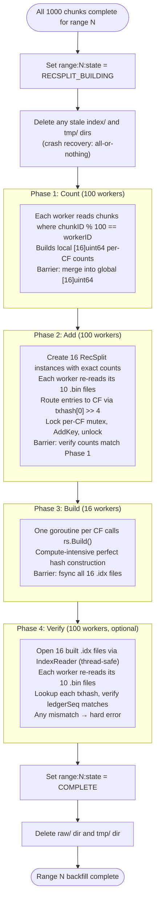
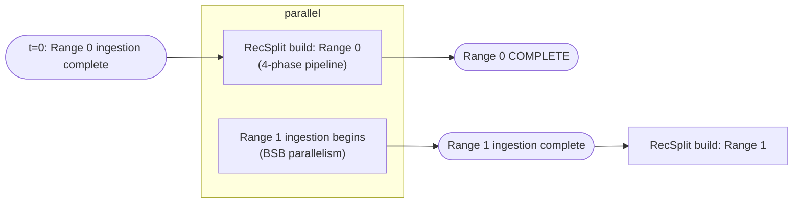

# Backfill Transition Workflow

## Overview

The backfill transition workflow builds the RecSplit minimal perfect hash index for a range after all 1,000 chunk sub-workflows (both `lfs_done` and `txhash_done`) are complete. It is triggered by the range orchestrator and blocks the orchestrator goroutine until complete.

The build uses a **4-phase parallel pipeline** with 100 worker goroutines for I/O-bound phases and 16 goroutines for the compute-bound build phase:

1. **Count** (100 workers) — count entries per CF across all `.bin` files
2. **Add** (100 workers) — add keys to 16 RecSplit instances with per-CF mutexes
3. **Build** (16 workers) — build perfect hash indexes in parallel
4. **Verify** (100 workers, optional) — verify all lookups match expected values

While RecSplit builds for range N, the orchestrator slot is freed and the next range (N+1) begins ingesting immediately. RecSplit for range N and ingestion of range N+1 run concurrently.

This workflow has **no analog in the streaming transition**. There is no active RocksDB store to tear down — the input is the raw txhash flat files written during chunk ingestion.

---

## Trigger Condition

```go
// Triggered when all 1000 chunks for rangeID satisfy:
//   meta: range:{rangeID:04d}:chunk:{chunkID:06d}:lfs_done == "1"
//   meta: range:{rangeID:04d}:chunk:{chunkID:06d}:txhash_done == "1"
// for ALL chunks in the range.
```

---

## Pre-RecSplit Barrier

After the trigger condition is satisfied, the orchestrator **MUST** enforce a synchronization barrier before launching the RecSplit pipeline:

1. **Wait for all BSB goroutines to fully exit** — call `WaitForAllBSBInstances()` (or equivalent join/WaitGroup). Merely observing that `allChunksDoneForRange()` returns true is insufficient; the BSB goroutines that *set* those flags may still be running teardown logic (flushing buffers, closing files, writing trailing bytes).
2. **Verify all file handles to raw txhash flat files are closed** — BSB instances must have released every file descriptor on `immutable/txhash/{rangeID:04d}/raw/*.bin` before proceeding. The raw txhash flat files must be in a **read-only, quiescent state** when RecSplit workers begin scanning them.
3. **Only then proceed** to set `range:N:state = RECSPLIT_BUILDING` and launch the 4-phase pipeline.

This barrier prevents a race condition where a stray BSB instance still executing teardown could write to (or hold an open fd on) a raw txhash flat file while a RecSplit worker is concurrently reading from it. Without the barrier, the worker could read a partially-written trailing entry (< 36 bytes) or encounter inconsistent data.

---

## Workflow Diagram



---

## RecSplit Index Construction

### Input

For each of the 1,000 chunks in the range, there is one raw txhash flat file:
```
immutable/txhash/{rangeID:04d}/raw/{chunkID:06d}.bin
```

Format: `[txhash[32] || ledgerSeq[4]]` repeated, 36 bytes per entry. File is NOT sorted.

### Sharding by First Hex Character

The ~3B transactions for a 10M-ledger range are sharded across 16 column family files based on the first hex character of the transaction hash string (`0`–`f`). In raw byte terms: `txhash[0] >> 4`, giving values `0x0`–`0xF` mapping to CF names `0`–`f`.

Each CF index file (`cf-{0..f}.idx`) is a self-contained RecSplit minimal perfect hash for the transactions in that CF.

### 4-Phase Build Algorithm

#### Phase 1: Count (100 goroutines)

Worker `i` reads chunks where `chunkID % 100 == i` (10 files each out of 1000 total). Modulo distribution ensures even CPU engagement — avoids early lightweight chunks clustering in one goroutine while late heavy chunks cluster in another.

Each worker builds a local `[16]uint64` array of per-CF counts. After the WaitGroup barrier, all 100 local arrays are merged into a global `[16]uint64`.

#### Phase 2: Add (100 goroutines)

16 RecSplit instances are created upfront (one per CF) using exact counts from Phase 1. Each instance gets its own tmp dir and output path. 16 `sync.Mutex` are created, one per CF.

100 workers launch with the same modulo assignment as Phase 1. Each worker re-reads its 10 `.bin` files; for each entry: determine CF via `txhash[0] >> 4`, lock the CF's mutex, call `AddKey(txhash, ledgerSeq)`, unlock. `AddKey` is fast (buffer copy), so contention with ~6 workers per CF on average is minimal.

After the WaitGroup barrier: verify per-CF added counts match Phase 1 counts (implicit count validation — any mismatch is a hard error).

#### Phase 3: Build (16 goroutines)

16 goroutines launch, one per CF. Each calls `rs.Build(ctx)` — the compute-intensive perfect hash construction. After the WaitGroup barrier: fsync all 16 `.idx` files. Overall wall time is determined by the slowest CF.

#### Phase 4: Verify (100 goroutines, optional)

Enabled by default (`verify_recsplit = true` in config). All 16 built `.idx` files are opened via `recsplit.OpenIndex()` + `recsplit.NewIndexReader()`. `IndexReader` is thread-safe and shared across goroutines.

100 workers launch with the same modulo assignment. Each re-reads its 10 `.bin` files; for each entry: determine CF, call `reader.Lookup(txhash)`, verify the returned `uint64` matches `ledgerSeq`. Any mismatch is collected and fails the flow.

When `verify_recsplit = false`, Phase 4 is skipped entirely.

### Empty CF Handling

If a CF has zero matching transactions for its nibble, no RecSplit instance is created for that CF. The `.idx` file is not written. This is handled by nil-guarding the RecSplit instance array — CFs with 0 entries are skipped in the Add, Build, and Verify phases.

This edge case is rare in practice (a 10M-ledger range typically has ~3B transactions with roughly uniform hash distribution).

### Query at Runtime

```
nibble = txhash[0] >> 4
idx = load_recsplit(immutable/txhash/{rangeID:04d}/index/cf-{nibble}.idx)
candidate_seq = idx.lookup(txhash)
// RecSplit may return false positives; caller must verify:
actual_lcm = getLedgerBySequence(candidate_seq)
if actual_lcm.contains(txhash): return candidate_seq
else: return NOT_FOUND
```

See [08-query-routing.md](./08-query-routing.md) for false-positive handling.

---

## Concurrency with Next Range



The orchestrator scheduler does not block range N+1 on range N's RecSplit completion. Range N+1 ingestion starts as soon as the range N orchestrator releases its slot (after ingestion finishes, before RecSplit finishes).

---

## State Transitions in Meta Store

```
Before trigger:
  range:0000:state                     →  "INGESTING"
  range:0000:chunk:000999:lfs_done     →  "1"   ← last chunk just completed
  range:0000:chunk:000999:txhash_done  →  "1"

Transition starts:
  range:0000:state                     →  "RECSPLIT_BUILDING"

4-phase pipeline runs (Count → Add → Build → Verify)

All phases complete:
  range:0000:state                     →  "COMPLETE"

Cleanup:
  immutable/txhash/0000/raw/*.bin  ← deleted
  immutable/txhash/0000/tmp/       ← deleted
```

---

## Crash Recovery

The RecSplit pipeline uses **all-or-nothing** crash recovery for backfill. Per-CF done flags are written during the build (for bookkeeping) but are not consulted on resume — the entire 4-phase flow reruns from scratch on crash.

If the process crashes while building RecSplit for range N:

1. On restart: read `range:N:state` — if `RECSPLIT_BUILDING`, resume
2. Delete all `.idx` files in `index/` dir, delete `tmp/` dir, and clear all 16 per-CF done flags via `ClearRecSplitCFFlags` (clean slate)
3. Rerun the entire 4-phase flow from Phase 1
4. Each CF's done flag is re-set after its index is built and fsynced

This is simpler than per-CF recovery and avoids complexity around partial state. The 4-phase pipeline is fast enough (minutes, not hours) that rerunning from scratch is acceptable. After completion, all 16 per-CF done flags exist as a permanent bookkeeping record.

Raw txhash flat files are **not deleted** until all 4 phases complete successfully and range state is set to COMPLETE. They remain as the RecSplit build input on resume.

---

## Output Files

After workflow completes for range N:

```
immutable/txhash/{N:04d}/
├── index/
│   ├── cf-0.idx
│   ├── cf-1.idx
│   ├── ...
│   └── cf-f.idx
└── raw/                 ← DELETED after all phases complete
```

---

## Error Handling

| Error | Action |
|-------|--------|
| Raw txhash file missing or corrupt | ABORT; operator re-runs; chunk txhash_done flags intact, chunk files NOT re-ingested unless re-run is triggered |
| RecSplit build OOM | ABORT; operator re-runs |
| fsync failure on CF index file | ABORT; all-or-nothing — full rerun on next attempt |
| Verify phase mismatch | ABORT; indicates data corruption — operator investigates |
| Meta store write failure | ABORT |

**Note**: If a raw txhash file is found corrupt and its `txhash_done` flag is set, the operator must manually clear the flag before re-running to force re-ingestion of that chunk.

---

## getEvents Immutable Store — Placeholder

> **Status**: Not yet designed. This section reserves space for future work.

When `getEvents` support is added to the backfill transition workflow, it will require:

- A Phase 3 step after RecSplit build completes: **events index build**
- Input: per-chunk events data files written during chunk ingestion (analogous to raw txhash flat files)
- Output: `immutable/events/{rangeID:04d}/index/` — events index files
- Meta store tracking: `range:{N}:events_index:state` and per-partition done flags
- Range state machine extends: `INGESTING → RECSPLIT_BUILDING → EVENTS_INDEX_BUILDING → COMPLETE`
- Crash recovery: same all-or-nothing pattern as RecSplit

The workflow diagram above will gain a Phase 3 branch after `SET_COMPLETE`. Raw events data files are NOT deleted until both RecSplit and events index builds are complete.

---

## Related Documents

- [03-backfill-workflow.md](./03-backfill-workflow.md) — how raw txhash files are written
- [02-meta-store-design.md](./02-meta-store-design.md) — RecSplit state keys
- [07-crash-recovery.md](./07-crash-recovery.md) — crash scenarios for RecSplit build
- [08-query-routing.md](./08-query-routing.md) — RecSplit false-positive handling
- [09-directory-structure.md](./09-directory-structure.md) — index file paths
