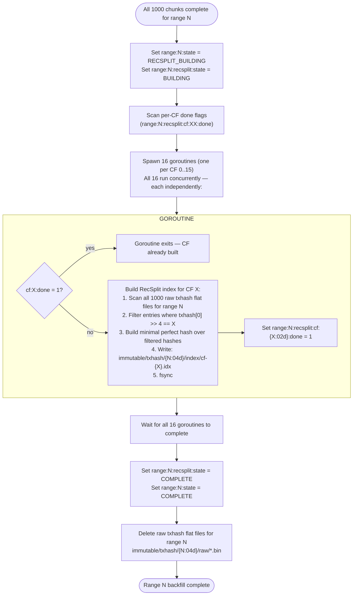
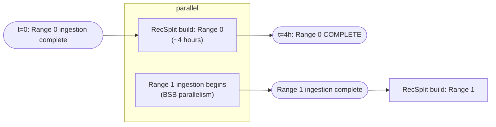

# Backfill Transition Workflow

## Overview

The backfill transition workflow builds the RecSplit minimal perfect hash index for a range after all 1,000 chunk sub-workflows (both `lfs_done` and `txhash_done`) are complete. It is triggered by the range orchestrator, blocks the orchestrator goroutine until complete, and takes approximately 4 hours per range.

All 16 CF index files are built **in parallel** — 16 goroutines run concurrently, one per CF (`0`–`f`). Each goroutine reads all 1,000 raw txhash flat files for the range, filters by its CF (first hex character of the txhash), builds its RecSplit index, fsyncs, and sets its done flag. The orchestrator waits for all 16 goroutines to complete before setting state to COMPLETE.

While RecSplit builds for range N, the orchestrator slot is freed and the next range (N+1) begins ingesting immediately. RecSplit for range N and ingestion of range N+1 run concurrently.

This workflow has **no analog in the streaming transition**. There is no active RocksDB store to tear down — the input is the raw txhash flat files written during chunk ingestion.

---

## Trigger Condition

```go
// Triggered when all 1000 chunks for rangeID satisfy:
//   meta: range:{rangeID:04d}:chunk:{chunkID:06d}:lfs_done == "1"
//   meta: range:{rangeID:04d}:chunk:{chunkID:06d}:txhash_done == "1"
// for ALL chunks in the range.
```

---

## Pre-RecSplit Barrier

After the trigger condition is satisfied, the orchestrator **MUST** enforce a synchronization barrier before spawning any RecSplit CF goroutines:

1. **Wait for all BSB goroutines to fully exit** — call `WaitForAllBSBInstances()` (or equivalent join/WaitGroup). Merely observing that `allChunksDoneForRange()` returns true is insufficient; the BSB goroutines that *set* those flags may still be running teardown logic (flushing buffers, closing files, writing trailing bytes).
2. **Verify all file handles to raw txhash flat files are closed** — BSB instances must have released every file descriptor on `immutable/txhash/{rangeID:04d}/raw/*.bin` before proceeding. The raw txhash flat files must be in a **read-only, quiescent state** when RecSplit goroutines begin scanning them.
3. **Only then proceed** to set `range:N:state = RECSPLIT_BUILDING` and spawn the 16 RecSplit CF goroutines.

This barrier prevents a race condition where a stray BSB instance still executing teardown could write to (or hold an open fd on) a raw txhash flat file while a RecSplit CF goroutine is concurrently reading from it. Without the barrier, the RecSplit goroutine could read a partially-written trailing entry (< 36 bytes) or encounter inconsistent data.

---

## Workflow Diagram



---

## RecSplit Index Construction

### Input

For each of the 1,000 chunks in the range, there is one raw txhash flat file:
```
immutable/txhash/{rangeID:04d}/raw/{chunkID:06d}.bin
```

Format: `[txhash[32] || ledgerSeq[4]]` repeated, 36 bytes per entry. File is NOT sorted.

### Sharding by First Hex Character

The ~3B transactions for a 10M-ledger range are sharded across 16 column family files based on the first hex character of the transaction hash string (`0`–`f`). In raw byte terms: `txhash[0] >> 4`, giving values `0x0`–`0xF` mapping to CF names `0`–`f`.

Each CF index file (`cf-{0..f}.idx`) is a self-contained RecSplit minimal perfect hash for the transactions in that CF.

### Build Algorithm per CF

16 goroutines run concurrently (one per CF, `0`–`f`). Each goroutine independently executes:

```
for each of 1000 raw chunk files:
    read all 36-byte entries
    if txhash[0] >> 4 == target_nibble:
        add (txhash, ledgerSeq) to CF's input set
build RecSplit MPH over all hashes in CF input set
serialize index to cf-{nibble}.idx
fsync
```

### Empty CF Handling

If a CF has zero matching transactions for its nibble — i.e., no txhash in the entire range has a first hex character matching that CF — the RecSplit build for that CF produces an **empty index file** (`cf-{X}.idx` with zero entries). The `recsplit:cf:{XX}:done` flag is set normally after the empty file is fsynced.

An empty index is valid:
- Lookups against it always return NOT_FOUND, which is correct since no transactions exist for that nibble in this range
- The implementation MUST NOT treat an empty input set as a build error or skip setting the done flag
- On resume after crash, an empty CF whose done flag is set is skipped like any other completed CF

This edge case is rare in practice (a 10M-ledger range typically has ~3B transactions with roughly uniform hash distribution), but must be handled correctly to avoid an infinite retry loop where the CF build "fails" on empty input, the done flag is never set, and the range can never reach COMPLETE.

### Query at Runtime

```
nibble = txhash[0] >> 4
idx = load_recsplit(immutable/txhash/{rangeID:04d}/index/cf-{nibble}.idx)
candidate_seq = idx.lookup(txhash)
// RecSplit may return false positives; caller must verify:
actual_lcm = getLedgerBySequence(candidate_seq)
if actual_lcm.contains(txhash): return candidate_seq
else: return NOT_FOUND
```

See [08-query-routing.md](./08-query-routing.md) for false-positive handling.

---

## Concurrency with Next Range



The orchestrator scheduler does not block range N+1 on range N's RecSplit completion. Range N+1 ingestion starts as soon as the range N orchestrator releases its slot (after ingestion finishes, before RecSplit finishes).

---

## State Transitions in Meta Store

```
Before trigger:
  range:0000:state                     →  "INGESTING"
  range:0000:chunk:000999:lfs_done     →  "1"   ← last chunk just completed
  range:0000:chunk:000999:txhash_done  →  "1"

Transition starts:
  range:0000:state                     →  "RECSPLIT_BUILDING"
  range:0000:recsplit:state            →  "BUILDING"

CF 0 built (goroutine 0 completes):
  range:0000:recsplit:cf:00:done       →  "1"

... (CFs 1–14, all goroutines run concurrently) ...

CF 15 built (goroutine 15 completes; all 16 done):
  range:0000:recsplit:cf:0f:done       →  "1"

All 16 goroutines complete:
  range:0000:recsplit:state            →  "COMPLETE"
  range:0000:state                     →  "COMPLETE"

Cleanup:
  immutable/txhash/0000/raw/*.bin  ← deleted
```

---

## Crash Recovery

If the process crashes while building RecSplit for range N:

1. On restart: read `range:N:state` — if `RECSPLIT_BUILDING`, resume
2. Read `range:N:recsplit:state` — if `BUILDING`, scan per-CF done flags
3. Spawn 16 goroutines (one per CF, running in parallel):
   - For each CF where `done == "1"`: goroutine exits immediately (CF already built)
   - For each CF where `done != "1"`: goroutine rebuilds the CF index from scratch
4. After all 16 goroutines complete, set `recsplit:state = COMPLETE` and `range:N:state = COMPLETE`

Per-CF granularity means at most 15/16th of the work is lost on crash. The goroutines for completed CFs exit immediately and do not re-read any raw files.

Raw txhash flat files are **not deleted** until all 16 CFs are built. They remain as the RecSplit build input on resume.

---

## Output Files

After workflow completes for range N:

```
immutable/txhash/{N:04d}/
├── index/
│   ├── cf-0.idx
│   ├── cf-1.idx
│   ├── ...
│   └── cf-f.idx
└── raw/                 ← DELETED after all CFs complete
```

---

## Error Handling

| Error | Action |
|-------|--------|
| Raw txhash file missing or corrupt | ABORT; do not set CF done; operator re-runs; chunk txhash_done flags intact, chunk files NOT re-ingested unless re-run is triggered |
| RecSplit build OOM | ABORT; operator re-runs with smaller CF batch if needed |
| fsync failure on CF index file | ABORT; do not set `cf:XX:done`; CF will be rebuilt on resume |
| Meta store write failure | ABORT |

**Note**: If a raw txhash file is found corrupt and its `txhash_done` flag is set, the operator must manually clear the flag before re-running to force re-ingestion of that chunk.

---

## getEvents Immutable Store — Placeholder

> **Status**: Not yet designed. This section reserves space for future work.

When `getEvents` support is added to the backfill transition workflow, it will require:

- A Phase 3 step after RecSplit build completes: **events index build**
- Input: per-chunk events data files written during chunk ingestion (analogous to raw txhash flat files)
- Output: `immutable/events/{rangeID:04d}/index/` — events index files
- Meta store tracking: `range:{N}:events_index:state` and per-partition done flags
- Range state machine extends: `INGESTING → RECSPLIT_BUILDING → EVENTS_INDEX_BUILDING → COMPLETE`
- Crash recovery: same per-unit granularity pattern as RecSplit CF tracking

The workflow diagram above will gain a Phase 3 branch after `SET_COMPLETE`. Raw events data files are NOT deleted until both RecSplit and events index builds are complete.

---

## Related Documents

- [03-backfill-workflow.md](./03-backfill-workflow.md) — how raw txhash files are written
- [02-meta-store-design.md](./02-meta-store-design.md) — RecSplit state keys
- [07-crash-recovery.md](./07-crash-recovery.md) — crash scenarios for RecSplit build
- [08-query-routing.md](./08-query-routing.md) — RecSplit false-positive handling
- [09-directory-structure.md](./09-directory-structure.md) — index file paths
