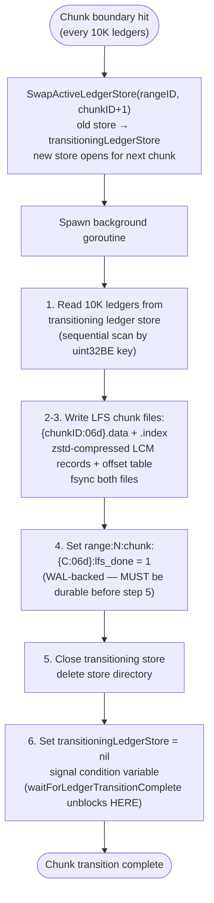
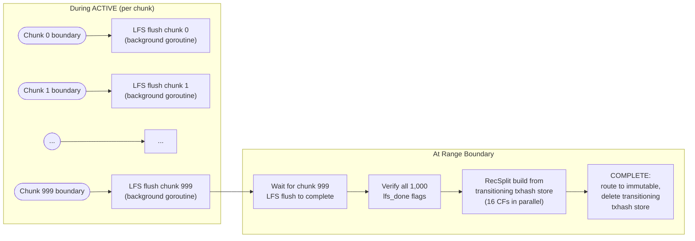

# Streaming Transition Workflow

## Overview

The streaming transition workflow converts active RocksDB stores to immutable storage (LFS chunks + RecSplit index). Unlike a single monolithic transition at the range boundary, the streaming pipeline uses **two independent sub-flows that transition at different cadences**:

| Sub-flow | Transition cadence | Trigger | Max active | Max transitioning | Max total |
|----------|-------------------|---------|------------|-------------------|-----------|
| Ledger | Every 10K ledgers (chunk boundary) | `ledgerSeq == chunkLastLedger(C)` | **1** | **1** | **2** |
| TxHash | Every 10M ledgers (range boundary) | `ledgerSeq == rangeLastLedger(N)` | **1** | **1** | **2** |
| Events (future) | Every 10K ledgers (chunk boundary, likely) | TBD | **1** | **1** | **2** |

**Each sub-flow can have at most 1 active store and 1 transitioning store at any point in time.**

By the time the range boundary is reached, all 1,000 ledger chunks have already been individually transitioned to LFS during the ACTIVE phase. The only work remaining at the range boundary is the txhash store's RecSplit build.

---

## Ledger Sub-flow Transition (Every 10K Ledgers)

### Trigger Condition

Triggered in the streaming ingestion loop when a chunk boundary is crossed:
```go
ledgerSeq == chunkLastLedger(currentChunk)
```
(e.g., ledger 10,001 for chunk 0, ledger 20,001 for chunk 1, etc.)

### Workflow

1. **Swap**: `SwapActiveLedgerStore(rangeID, chunkID+1)` moves the current active ledger store to `transitioningLedgerStore`. It stays **open for reads** during the LFS flush. A new active ledger store opens for the next chunk.
2. **Background flush**: A goroutine runs the following steps **in this exact order**:
   1. Read 10K ledgers from the transitioning ledger store (sequential scan by `uint32BE` key)
   2. Write `.data` + `.index` files
   3. fsync both files
   4. Write `lfs_done = "1"` to meta store (WAL-backed) — **MUST complete before step 5**
   5. Close the transitioning ledger store and delete its directory
   6. Set `transitioningLedgerStore = nil` and signal the condition variable — `waitForLedgerTransitionComplete()` unblocks HERE

**Critical ordering invariant**: The `lfs_done` flag is the durability checkpoint; the nil-signal is just a notification. The flag MUST be durable in the meta store before the store reference is cleared and the completion signal fires. If the goroutine clears the store reference before persisting the flag, `waitForLedgerTransitionComplete()` unblocks prematurely. A crash in this window would leave the flag absent, causing the chunk to be re-ingested on recovery even though the LFS files were already written.

### Workflow Diagram



### Query Routing During Ledger Transition

While the ledger sub-flow transition is in progress:
- The **transitioning ledger store** remains open and serves reads for ledgers in the transitioning chunk
- The **new active ledger store** serves reads for ledgers in the current chunk
- Once `CompleteLedgerTransition` completes and the LFS file exists, queries for that chunk route to LFS

### LFS Chunk File Format

- `.data` file: contiguous compressed LCM records (variable-length)
- `.index` file: offset table, one `uint64` per ledger, enabling O(1) random access

**Flush/fsync**: Each chunk file pair is fsynced before setting `lfs_done`. Partial writes are safe — the `lfs_done` flag is the sole indicator of completion. The flag must be persisted to the meta store BEFORE the transitioning store reference is cleared (see goroutine ordering above).

---

## TxHash Sub-flow Transition (Every 10M Ledgers)

### Trigger Condition

Triggered in the streaming ingestion loop when a range boundary is crossed:
```go
ledgerSeq == rangeLastLedger(currentRange)
```
(e.g., ledger 10,000,001 for range 0, ledger 20,000,001 for range 1, etc.)

### Range-Boundary Coordination: Wait for Lower-Cadence Sub-flows

At the range boundary, the system **must wait** for ALL in-flight ledger sub-flow transitions to complete before proceeding with the txhash transition. The last chunk boundary (chunk 999 of a range) triggers a ledger sub-flow transition that runs in a background goroutine, and any earlier in-flight chunks (e.g., chunk 998) may also still be completing. The range boundary is the very next ledger after the chunk 999 boundary, so there is a race: the LFS flush goroutine for chunk 999 may not have finished, and earlier chunk transitions may also still be in flight.

**The invariant**: At any transition cadence, all sub-flows with a LOWER cadence must have completed their last transition before the higher-cadence transition proceeds.

**Steps before txhash promotion**:
1. Call `waitForLedgerTransitionComplete()` — block until `transitioningLedgerStore == nil`, which indicates all in-flight chunk transitions have completed. Because the goroutine ordering invariant (fsync `lfs_done` flag → close store → set nil → signal) guarantees that each goroutine persists its `lfs_done` flag BEFORE setting nil, all flags for all chunks are guaranteed durable by the time the wait unblocks.
2. Verify all 1,000 `lfs_done` flags for the range are set (safety check — all guaranteed durable by the ordering invariant, but verified explicitly as a defense-in-depth assertion)
3. Only then promote the txhash store and begin RecSplit

### Workflow

At trigger:
1. `waitForLedgerTransitionComplete()` — ensure last chunk's ledger transition is done
2. Verify all 1,000 `lfs_done` flags for the range
3. `PromoteToTransitioning(N)` — moves **only the txhash store** to `transitioningTxHashStore` (no ledger store involved — all ledger stores were already transitioned at their chunk boundaries and deleted)
4. Create new active stores for range N+1 (new ledger store + new txhash store)
5. Atomic WriteBatch: set `range:N:state` to `TRANSITIONING` and `range:N+1:state` to `ACTIVE` in a single meta store WriteBatch (see below)
6. Ingestion of range N+1 starts immediately
7. Background goroutine spawned for RecSplit build from transitioning txhash store

### Atomic Range Boundary WriteBatch

At the range boundary, the meta store state transitions MUST be written in a single atomic WriteBatch:

```go
// Physical operations first (all idempotent):
PromoteToTransitioning(N)        // move txhash store — no-op if already moved
CreateActiveStores(N+1)          // create directories — no-op if already exist

// Then atomic state update:
batch := metaStore.NewWriteBatch()
batch.Put("range:{N:04d}:state", "TRANSITIONING")
batch.Put("range:{N+1:04d}:state", "ACTIVE")
batch.Write()  // single WAL fsync — atomic
```

Physical operations (file moves, directory creation) are idempotent — repeating them after a crash is safe. The WriteBatch ensures both range states transition atomically. A crash before the WriteBatch leaves both ranges in their previous states; a crash after leaves both in their new states. There is no intermediate state where one range has transitioned but the other has not.

### Workflow Diagram



```mermaid
flowchart TD
    RANGE_HIT(["Range boundary hit<br/>(every 10M ledgers)"]) --> WAIT["waitForLedgerTransitionComplete()<br/>block until transitioningLedgerStore == nil<br/>(lfs_done already durable — goroutine<br/>persists flag BEFORE clearing nil)"]
    WAIT --> VERIFY_LFS["Verify all 1,000 lfs_done flags<br/>for range N are set<br/>(defense-in-depth assertion)"]
    VERIFY_LFS --> PROMOTE["PromoteToTransitioning(N)<br/>moves ONLY txhash store →<br/>transitioningTxHashStore<br/>(no ledger store — already gone)<br/>(idempotent — no-op if already moved)"]
    PROMOTE --> NEW_STORES["CreateActiveStores(N+1)<br/>new ledger-store-chunk + new txhash-store-range<br/>(idempotent — no-op if already exist)"]
    NEW_STORES --> ATOMIC_BATCH["Atomic WriteBatch:<br/>range:N:state = TRANSITIONING<br/>range:N+1:state = ACTIVE<br/>(single WAL fsync)"]
    ATOMIC_BATCH --> RESUME["Resume ingestion on range N+1"]
    ATOMIC_BATCH --> BG_RS["Spawn background goroutine:<br/>RecSplit build from<br/>transitioning txhash store"]

    BG_RS --> SET_RS["range:N:recsplit:state = BUILDING"]
    SET_RS --> SPAWN_CFS["Spawn 16 goroutines (one per CF: 0..f)<br/>all goroutines run concurrently"]
    SPAWN_CFS --> CF_CHECK{cf:XX:done = 1?<br/>per goroutine}
    CF_CHECK -->|yes| CF_SKIP["Goroutine exits immediately<br/>(CF already built — crash resume)"]
    CF_CHECK -->|no| SCAN_CF["Scan transitioning txhash store CF X<br/>iterate all keys where first nibble == X<br/>build RecSplit MPH over (txhash, ledgerSeq) pairs<br/>write immutable/txhash/{N:04d}/index/cf-{X}.idx<br/>fsync"]
    SCAN_CF --> SET_CF["Set range:N:recsplit:cf:{X:02d}:done = 1"]
    SET_CF --> CF_SKIP
    CF_SKIP --> ALL_DONE{"All 16 goroutines<br/>complete?"}
    ALL_DONE -->|no| WAIT_CF["Wait"]
    ALL_DONE -->|yes| VERIFY["Verify: spot-check random<br/>ledgers and txhashes<br/>against new immutable stores"]
    VERIFY --> SET_COMPLETE["range:N:recsplit:state = COMPLETE<br/>range:N:state = COMPLETE<br/>(meta store written before router swap)"]
    SET_COMPLETE --> ADD_IMM["router.AddImmutableStores(N, lfs, recsplit)<br/>queries for range N now route<br/>to LFS + RecSplit"]
    ADD_IMM --> DELETE["router.RemoveTransitioningTxHashStore(N)<br/>close + delete transitioning txhash store<br/>(safe: routing already swapped to immutable)"]
    DELETE --> RANGE_DONE(["Range N transition complete"])
```

### Query Routing During TxHash Transition

While `range:N:state == "TRANSITIONING"`:
- **Ledger queries**: Served from LFS chunk files (all ledger stores already transitioned and deleted during ACTIVE)
- **TxHash queries**: Served from the **transitioning txhash store** (still open for reads)
- The immutable RecSplit index is not used for queries until `AddImmutableStores` completes

**Critical ordering**: `SET_COMPLETE` (meta store) → `AddImmutableStores` (router swap) → `RemoveTransitioningTxHashStore` (delete). Deletion always happens last, after routing is already pointed at immutable stores. There is no query gap.

---

## RecSplit Build from Transitioning TxHash Store

Unlike backfill (which reads raw flat files), the streaming transition reads directly from the **transitioning** txhash store. All 16 CF index files are built **in parallel** — 16 goroutines run concurrently, one per CF (`0`–`f`). Each goroutine independently:

1. Checks `recsplit:cf:{X:02d}:done` — if already `"1"`, exits immediately (crash resume)
2. Iterates all keys in transitioning txhash store CF `X` (the CF whose name matches the first hex character of the txhash; `key[0] >> 4 == X` in raw byte terms)
3. Builds RecSplit minimal perfect hash over the matching `(txhash, ledgerSeq)` pairs
4. Writes `immutable/txhash/{rangeID:04d}/index/cf-{X}.idx`
5. fsyncs
6. Sets `range:N:recsplit:cf:{X:02d}:done = 1` in meta store

The orchestrator waits for all 16 goroutines to complete before proceeding to verification.

**Empty CFs**: If a CF has zero matching transactions for its nibble (e.g., no txhashes in the entire range start with hex character `a`), the RecSplit build for that CF produces an empty index file (`cf-a.idx` with zero entries). The `cf:XX:done` flag is set normally. An empty index is valid — lookups against it always return NOT_FOUND, which is correct since no transactions exist for that nibble in this range. The implementation must not treat an empty input set as an error.

The transitioning RocksDB store is read-only during RecSplit build (ingestion has moved to range N+1's store).

**Note**: The streaming transition does **not** produce raw txhash flat files. It builds RecSplit directly from RocksDB. This is the primary structural difference from the backfill transition.

---

## Verification Step

Before deleting the transitioning txhash store, the workflow performs a spot-check. This verification runs inline in the transition goroutine (not tracked in the meta store).

1. **Minimum 1 ledger per chunk** (1,000 samples minimum for a 1,000-chunk range): sample at least one random ledger sequence number from each of the 1,000 chunks in range N. Read each from the LFS chunk file, verify contents match expected data.
2. **Minimum 1 txhash per chunk** (1,000 samples minimum): sample at least one random txhash from each of the 1,000 chunks in range N. Look up each in the RecSplit index, verify by fetching the ledger from LFS and confirming presence.

**Rationale**: 100 random samples out of ~3 billion transactions gives only 0.000003% coverage — far too sparse to catch systematic per-chunk corruption. With 1 sample per chunk (1,000 samples), every chunk is verified at least once, guaranteeing that per-chunk corruption is caught. 1,000 lookups complete in seconds, not minutes, so the cost is negligible.

If any mismatch is detected: ABORT; do not delete transitioning txhash store; log error; set range to error state.

---

## State Transitions in Meta Store

### During ACTIVE (at each chunk boundary):

```
Chunk 0 completes (ledger 10,001):
  range:0000:chunk:000000:lfs_done     →  "1"   (set by background LFS flush goroutine
                                                   BEFORE transitioningLedgerStore = nil)

Chunk 1 completes (ledger 20,001):
  range:0000:chunk:000001:lfs_done     →  "1"

  ... (each chunk transitions independently at its boundary) ...

Chunk 999 completes (ledger 10,000,001):
  range:0000:chunk:000999:lfs_done     →  "1"   (last chunk — flag durable before nil-signal
                                                   unblocks waitForLedgerTransitionComplete)
```

### At range boundary (range 0 → range 1):

```
Range boundary hit (ledger 10,000,001):
  waitForLedgerTransitionComplete()     ← block until chunk 999's LFS flush done
  Verify all 1,000 lfs_done flags       ← safety check

  PromoteToTransitioning(0)             ← move txhash store (idempotent)
  CreateActiveStores(1)                 ← create directories (idempotent)

  Atomic WriteBatch:
    range:0000:state                   →  "TRANSITIONING"  \
    range:0001:state                   →  "ACTIVE"         / single WAL fsync (atomic WriteBatch)

  streaming:last_committed_ledger      →  10,000,001

RecSplit build (from transitioning txhash store):
  range:0000:recsplit:state            →  "BUILDING"
  range:0000:recsplit:cf:00:done       →  "1"
  ...
  range:0000:recsplit:cf:0f:done       →  "1"

Verification passes, router swap, transitioning txhash store deleted:
  range:0000:recsplit:state            →  "COMPLETE"
  range:0000:state                     →  "COMPLETE"
  # router.AddImmutableStores(0, ...) called next — queries now route to LFS + RecSplit
  # router.RemoveTransitioningTxHashStore(0) called last — transitioning txhash store deleted
```

For contrast, range 5 (global chunks 005000–005999):
```
During ACTIVE:
  range:0005:chunk:005000:lfs_done     →  "1"   (set at chunk boundary during ACTIVE)
  ...
  range:0005:chunk:005999:lfs_done     →  "1"   (last chunk of range 5)

At range boundary (ledger 50,000,001):
  waitForLedgerTransitionComplete()
  Verify all 1,000 lfs_done flags
  PromoteToTransitioning(5)             ← idempotent
  CreateActiveStores(6)                 ← idempotent

  Atomic WriteBatch:
    range:0005:state                   →  "TRANSITIONING"  \
    range:0006:state                   →  "ACTIVE"         / single WAL fsync (atomic WriteBatch)

  streaming:last_committed_ledger      →  50,000,001

RecSplit:
  range:0005:recsplit:state            →  "BUILDING"
  range:0005:recsplit:cf:00:done       →  "1"
  ...
  range:0005:recsplit:cf:0f:done       →  "1"
  range:0005:recsplit:state            →  "COMPLETE"
  range:0005:state                     →  "COMPLETE"
  # router.AddImmutableStores(5, ...) → router.RemoveTransitioningTxHashStore(5)
```

---

## Crash Recovery

### Crash During Ledger Sub-flow Transition (at chunk boundary)

If the daemon crashes while the background LFS flush goroutine is running for a chunk:

1. On restart: the transitioning ledger store is gone (crash cleared it), but the active ledger store is intact via WAL recovery
2. `streaming:last_committed_ledger` tells us where we were
3. The chunk's `lfs_done` flag is absent (fsync didn't complete or flag wasn't set). Because the goroutine enforces `lfs_done` persistence BEFORE clearing `transitioningLedgerStore = nil`, a crash at any point before the flag is durable means the flag is absent — there is no window where the flag is missing but the nil-signal already fired.
4. Recovery: re-ingest from `last_committed_ledger + 1` — the chunk boundary will be hit again, triggering a new LFS flush

### Crash During Range-Boundary Coordination

**SC1: Crash while waiting for last chunk's LFS flush at range boundary**

The range boundary ledger has been committed to the txhash store, but the last chunk (999) LFS flush goroutine hasn't finished.

- State: `range:N:state = "ACTIVE"`, `transitioningLedgerStore != nil` (cleared by crash), chunk 999's `lfs_done` absent
- Recovery: resume streaming from `last_committed_ledger + 1`. Since the last committed ledger IS the range boundary ledger, the system re-enters range boundary handling. `waitForLedgerTransitionComplete` returns immediately (no transitioning store after crash). The `lfs_done` scan finds chunk 999 absent — recovery must re-trigger the chunk 999 LFS flush from the WAL-recovered ledger store before proceeding with the txhash transition.

**SC2: Crash after all lfs_done verified, before WriteBatch**

- State: all 1,000 `lfs_done` flags = `"1"`, `range:N:state = "ACTIVE"`, `range:N+1:state` absent, `streaming:last_committed_ledger` = range boundary ledger. Physical operations (PromoteToTransitioning, CreateActiveStores) may or may not have completed.
- Recovery: re-enter range boundary handling. `waitForLedgerTransitionComplete` returns immediately. `lfs_done` scan passes. Redo physical operations (idempotent no-ops if already done). Write the atomic WriteBatch (TRANSITIONING + ACTIVE). Spawn RecSplit goroutine — proceeds normally.

### Crash During TxHash Sub-flow Transition (RecSplit Build)

If the daemon crashes while the RecSplit build goroutine is running:

1. On restart: `range:N:state == "TRANSITIONING"`, all `lfs_done` flags already set during ACTIVE
2. Only RecSplit recovery needed — scan `recsplit:cf:XX:done` flags, skip completed CFs, rebuild missing CFs from the transitioning txhash store (intact via WAL)
3. After all CFs complete: verify → set COMPLETE → swap routing → delete transitioning txhash store

### Crash After Verify, Before Store Delete

- State: `range:N:state == "TRANSITIONING"`, all `lfs_done` and `recsplit:cf:XX:done` flags set
- Recovery: re-verify; delete transitioning txhash store; set COMPLETE

### Crash After COMPLETE, Store Still on Disk

- State: `range:N:state == "COMPLETE"`, transitioning txhash store still on disk (orphaned)
- Recovery: delete orphaned store on startup; route to immutable

**The transitioning txhash store is never deleted until all flags are set and verification passes.** Crash recovery is always safe.

---

## Relationship to Streaming Ingestion



---

## Error Handling

| Error | Action |
|-------|--------|
| Ledger store read failure during LFS write | ABORT chunk transition; do not set `lfs_done`; log; daemon restarts and resumes |
| LFS file write/fsync failure | ABORT chunk transition; do not set `lfs_done` |
| LFS flush failure with missing `lfs_done` flags (disk full, I/O error) | If an LFS flush fails and the `lfs_done` flag is not set for one or more chunks, the range boundary verification (`waitForLedgerTransitionComplete`) will detect the missing flags. The system MUST abort the range transition and exit with a fatal error — it must NOT proceed with a partial set of `lfs_done` flags. The operator must free disk space and restart, at which point the missing chunks' LFS flushes will be retried from the active ledger stores (recovered via RocksDB WAL replay). |
| RecSplit build failure | ABORT txhash transition; do not set `cf:XX:done` |
| Verification mismatch | ABORT; do NOT delete transitioning txhash store; log; operator intervention required |
| Transitioning txhash store delete failure | LOG and continue; store will be cleaned up on next run |

---

## getEvents Immutable Store — Placeholder

> **Status**: Not yet designed. This section reserves space for future work.

When `getEvents` support is added to the streaming transition workflow, it will add a third independent sub-flow:

- **Events sub-flow transition** — likely at chunk cadence (10K ledgers), same as ledger sub-flow
- Each events transition: active events store → transitioning → events index build → close + delete
- **Each sub-flow can have at most 1 active store and 1 transitioning store at any point in time.**
- Meta store tracking: `range:N:events_index:state` and per-chunk done flags
- At the range boundary, the same cadence-check invariant applies: all events sub-flow transitions (10K cadence) must complete before the txhash transition (10M cadence) proceeds
- Verification step extends to include events: spot-check random events against new index
- The transitioning txhash store is not deleted until ledger, events, and txhash sub-flows all complete

---

## Related Documents

- [04-streaming-workflow.md](./04-streaming-workflow.md) — trigger conditions, chunk boundary handling, range boundary handling
- [02-meta-store-design.md](./02-meta-store-design.md) — state keys written during transition
- [07-crash-recovery.md](./07-crash-recovery.md) — streaming transition crash scenarios (including range-boundary coordination crashes)
- [08-query-routing.md](./08-query-routing.md) — query routing during ACTIVE and TRANSITIONING states
- [05-backfill-transition-workflow.md](./05-backfill-transition-workflow.md) — contrast: backfill transition uses raw flat files, no RocksDB
