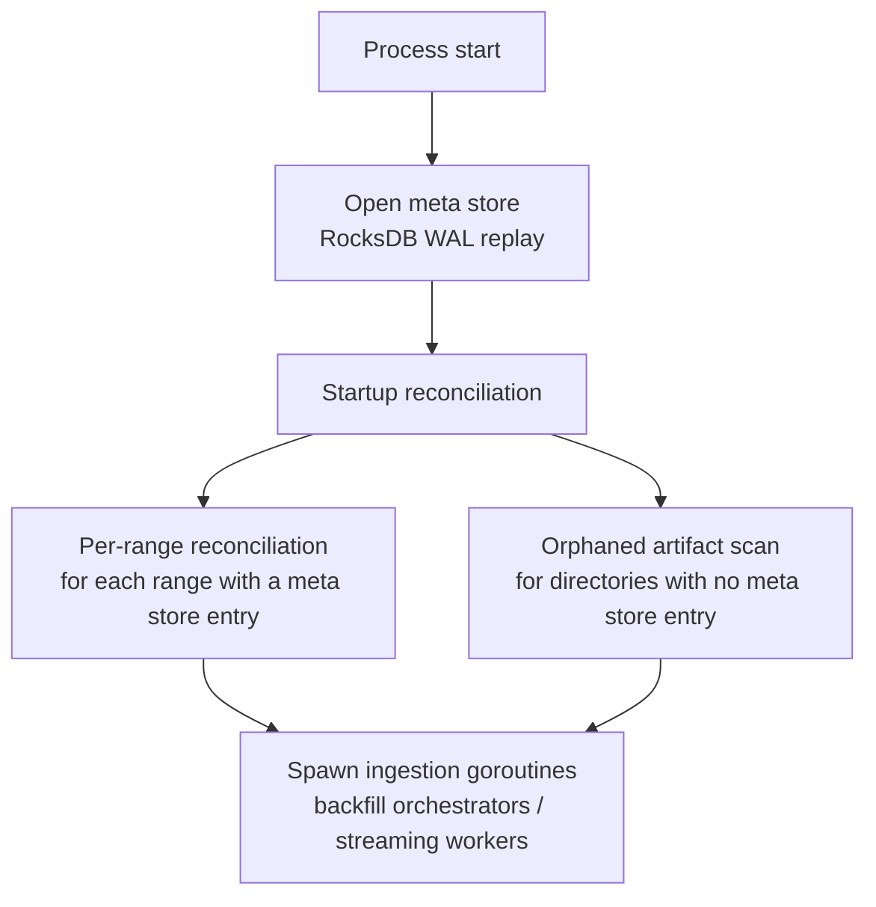
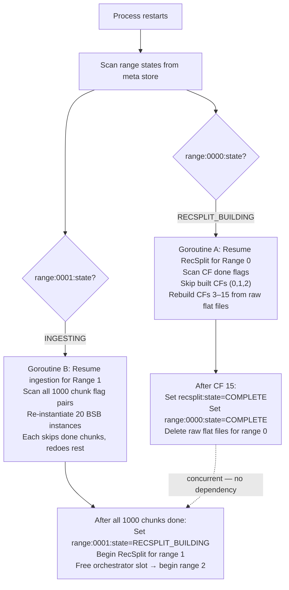
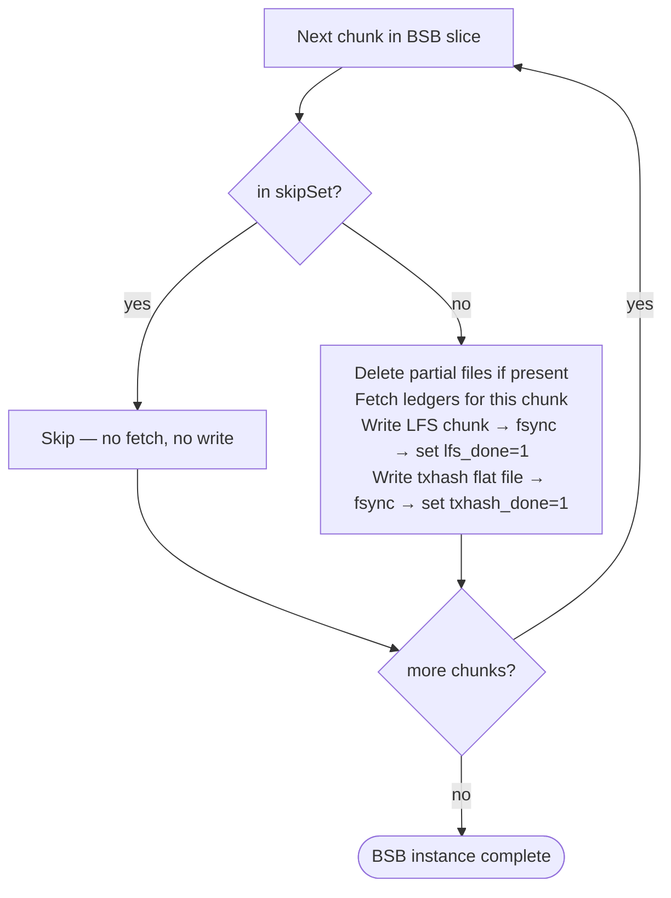
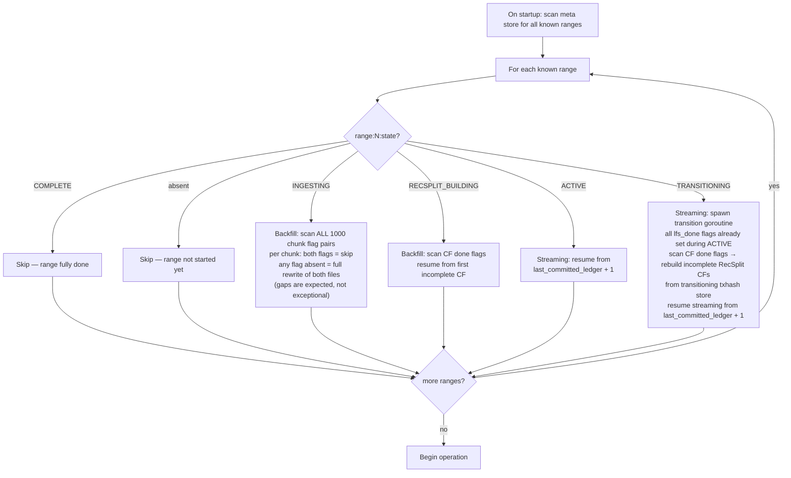

# Crash Recovery

## Overview

Crash recovery semantics differ between backfill and streaming modes. The meta store is the authoritative source for all recovery decisions. No in-memory state survives a crash; everything required for resume is persisted before the action it represents is taken.

---

## Glossary

| Term | Definition |
|------|-----------|
| **Range** | 10,000,000 ledgers. The unit of RecSplit index build and range state tracking. Range 0 = ledgers 2–10,000,001. |
| **Chunk** | 10,000 ledgers. One LFS file + one raw txhash flat file. The atomic unit of crash recovery in backfill. |
| **BSB instance** | One `BufferedStorageBackend` assigned to a contiguous slice of 500K ledgers (50 chunks) within a range. Default: 20 BSB instances per range. |
| **BSB parallelism** | All 20 BSB instances within a range run **concurrently**. Each independently fetches, decompresses, and writes its 50 chunks. This is the source of non-contiguous completion at crash time — different BSB instances make different amounts of progress before a crash. |
| **Chunk flags** | Two meta store keys per chunk: `lfs_done` and `txhash_done`. Set only after fsync of the respective file. Both must be `"1"` for a chunk to be skipped on resume. |
| **RecSplit CF** | One of 16 column family index files, sharded by the first hex character of the txhash string (`0`–`f`). Tracked with `recsplit:cf:{XX}:done` per CF. |

---

## Core Invariants

1. **Flags are written after fsync** — `lfs_done`, `txhash_done`, and `recsplit:cf:XX:done` are set in the meta store only after the corresponding file is fsynced to disk.
2. **Chunk flags are never deleted** — once set to `"1"`, they are permanent.
3. **Streaming checkpoint written after WriteBatch** — `streaming:last_committed_ledger` is updated only after the RocksDB WriteBatch (with WAL) succeeds.
4. **Active store never deleted until verification passes** — streaming transition: active store deletion is the last step, after all LFS chunks, RecSplit CFs, and spot-check verification complete.
5. **Partial chunk files are always safe to overwrite** — if either `lfs_done` or `txhash_done` is absent (or not `"1"`), both files are deleted and rewritten from scratch. There is no partial-rewrite path. The only way to skip a chunk is if **both** flags are `"1"`.
6. **Gaps are expected at crash time** — because all 20 BSB instances within a range run in parallel, completed chunks are NOT guaranteed to form a contiguous prefix. On resume, the process scans all 1,000 chunk flag pairs and redoes any chunk where either flag is missing, regardless of position.
7. **Meta store WAL is never disabled** — the meta store RocksDB instance always has WAL enabled. All writes to the meta store (chunk flags, range state, RecSplit CF done flags, streaming checkpoint) are durable only after the WAL entry is fsynced. A flag is not considered set until the WAL entry for that write has been persisted to disk. Disabling WAL for the meta store would break the flag-after-fsync invariant and make all chunk-level and range-level recovery untrustworthy.

---

## Startup Reconciliation

On every startup, before ingestion begins, the system performs a one-time reconciliation pass that compares on-disk artifacts against meta store state. This handles orphaned files and stores left behind by previous crashes — for example, a crash that set `range:N:state = "COMPLETE"` but died before deleting the transitioning txhash store, or a crash that left partial RocksDB store directories for a range that was never recorded in the meta store.

Startup reconciliation runs **after** the meta store is opened but **before** any ingestion goroutines (backfill orchestrators or streaming workers) are spawned. This ensures the data directory is in a clean, consistent state before work begins.

---

### Per-Range Reconciliation

For each range that has a meta store entry (`range:{N:04d}:state` is present), the reconciliation pass checks on-disk artifacts against the expected state:

| Range State | Reconciliation Action |
|------------|----------------------|
| **COMPLETE** | Delete any leftover raw txhash flat files (`immutable/txhash/{N:04d}/raw/`). Delete any orphaned transitioning store directories (`<active_stores_base_dir>/txhash-store-range-{N:04d}/`). These artifacts may persist if a previous run crashed after setting `COMPLETE` but before cleanup finished. The immutable LFS chunks and RecSplit index files are retained — they are the serving artifacts. |
| **TRANSITIONING** / **RECSPLIT_BUILDING** | Verify the transitioning txhash store exists on disk (for streaming `TRANSITIONING`) or that all raw txhash flat files exist (for backfill `RECSPLIT_BUILDING`). If the required input data is absent, this is an unrecoverable inconsistency — abort startup with a fatal error and log the missing artifacts. If present, no cleanup is needed; the normal resume path (described in the crash scenarios below) handles the rest. |
| **INGESTING** (backfill) | Normal resume: the chunk flag scan (Step 2 in the backfill resume algorithm) handles all cleanup. No special reconciliation action is needed beyond what the per-chunk rewrite logic already provides. |
| **ACTIVE** (streaming) | Normal resume: re-ingest from `streaming:last_committed_ledger + 1`. No special cleanup needed — the active stores are recovered via RocksDB WAL replay. |

---

### Orphaned Artifacts (No Meta Store Entry)

After per-range reconciliation, the system scans the data directory for store directories and file trees that have **no corresponding meta store entry**. These are artifacts from ranges that were never fully registered or whose meta store entries were lost:

- **RocksDB store directories** (`<active_stores_base_dir>/ledger-store-chunk-*`, `<active_stores_base_dir>/txhash-store-range-*`) with no matching range in `ACTIVE`, `TRANSITIONING`, or `INGESTING` state → delete the directory and all contents.
- **Raw txhash file directories** (`immutable/txhash/{N:04d}/raw/`) where `range:{N:04d}:state` is absent → delete the directory and all contents.
- **LFS chunk file directories** (`immutable/ledgers/chunks/{N:04d}/`) where `range:{N:04d}:state` is absent → delete the directory and all contents.
- **RecSplit index directories** (`immutable/txhash/{N:04d}/index/`) where `range:{N:04d}:state` is absent → delete the directory and all contents.

All cleanup actions are logged at **WARN** level so operators can audit what was removed. Each log entry includes the artifact path, the expected range, and the reason for deletion (e.g., "no meta store entry for range 0003; deleting orphaned raw txhash directory").

> **Safety note — meta store integrity assumption**: The orphaned artifact scan assumes the meta store is the authoritative source of truth. If the meta store itself is corrupted or truncated (e.g., due to disk failure affecting the meta store RocksDB), ranges that were previously COMPLETE may have no meta store entry, causing their immutable files to be incorrectly classified as orphaned and deleted. To mitigate this risk:
>
> 1. The reconciliation pass logs every deletion at WARN level with the full artifact path and reason — operators should review these logs on the first startup after any unexpected failure
> 2. If an unexpectedly large number of ranges are flagged as orphaned (e.g., more than 1), the system logs a FATAL error and aborts rather than proceeding with deletion: _"More than 1 orphaned range detected — possible meta store corruption. Aborting startup. Inspect the meta store and data directory manually before restarting."_
> 3. Operators experiencing meta store corruption should restore the meta store from backup or re-run backfill for the affected ranges rather than allowing reconciliation to delete immutable data

---

### Ordering



The reconciliation pass is **synchronous and blocking** — no ingestion work begins until it completes. This is acceptable because the pass is O(number of ranges) with lightweight filesystem checks, not O(ledgers). For a typical deployment with tens of ranges, the pass completes in under a second.

---

### Pseudo-Code

```go
func startupReconciliation(metaStore *MetaStore, dataDir string, cfg Config) error {
    // Phase 1: Per-range reconciliation
    // Scan meta store for all range entries
    for rangeID := range metaStore.AllRanges() {
        state := metaStore.Get(fmt.Sprintf("range:%04d:state", rangeID))

        switch state {
        case "COMPLETE":
            // Delete leftover raw txhash files (crash after COMPLETE but before cleanup)
            rawDir := filepath.Join(cfg.ImmutableTxHashBase, fmt.Sprintf("%04d", rangeID), "raw")
            if dirExists(rawDir) {
                log.Warnf("range %04d is COMPLETE but raw/ still exists; deleting %s", rangeID, rawDir)
                os.RemoveAll(rawDir)
            }
            // Delete orphaned transitioning txhash store
            txhashStore := filepath.Join(cfg.ActiveStoresBase, fmt.Sprintf("txhash-store-range-%04d", rangeID))
            if dirExists(txhashStore) {
                log.Warnf("range %04d is COMPLETE but transitioning store still exists; deleting %s", rangeID, txhashStore)
                os.RemoveAll(txhashStore)
            }

        case "TRANSITIONING", "RECSPLIT_BUILDING":
            // Verify required input data exists
            if state == "TRANSITIONING" {
                txhashStore := filepath.Join(cfg.ActiveStoresBase, fmt.Sprintf("txhash-store-range-%04d", rangeID))
                if !dirExists(txhashStore) {
                    return fmt.Errorf("FATAL: range %04d is %s but transitioning txhash store missing at %s",
                        rangeID, state, txhashStore)
                }
            }
            if state == "RECSPLIT_BUILDING" {
                rawDir := filepath.Join(cfg.ImmutableTxHashBase, fmt.Sprintf("%04d", rangeID), "raw")
                if !dirExists(rawDir) {
                    return fmt.Errorf("FATAL: range %04d is RECSPLIT_BUILDING but raw txhash dir missing at %s",
                        rangeID, rawDir)
                }
            }
            // No cleanup — normal resume path handles the rest

        case "INGESTING":
            // No special cleanup — chunk flag scan handles everything on resume

        case "ACTIVE":
            // No special cleanup — RocksDB WAL replay handles active store recovery
        }
    }

    // Phase 2: Orphaned artifact scan
    // Find directories on disk that have no meta store entry
    knownRanges := metaStore.AllRangeIDs() // set of rangeIDs with state entries

    // Scan active store directories
    for _, entry := range listDirs(cfg.ActiveStoresBase) {
        rangeID, ok := parseRangeFromStoreName(entry) // e.g., "txhash-store-range-0003" → 3
        if !ok {
            continue // not a recognized store directory
        }
        if !knownRanges.Contains(rangeID) && !isActiveOrTransitioning(metaStore, rangeID) {
            log.Warnf("orphaned active store %s (no meta store entry for range %04d); deleting", entry, rangeID)
            os.RemoveAll(filepath.Join(cfg.ActiveStoresBase, entry))
        }
    }

    // Scan immutable txhash directories (raw/ and index/)
    for _, entry := range listDirs(cfg.ImmutableTxHashBase) {
        rangeID, ok := parseRangeID(entry) // e.g., "0003" → 3
        if !ok {
            continue
        }
        if !knownRanges.Contains(rangeID) {
            log.Warnf("orphaned immutable txhash dir %s (no meta store entry for range %04d); deleting", entry, rangeID)
            os.RemoveAll(filepath.Join(cfg.ImmutableTxHashBase, entry))
        }
    }

    // Scan immutable ledger chunk directories
    for _, entry := range listDirs(filepath.Join(cfg.ImmutableLedgersBase, "chunks")) {
        rangeID, ok := parseRangeID(entry) // e.g., "0003" → 3
        if !ok {
            continue
        }
        if !knownRanges.Contains(rangeID) {
            log.Warnf("orphaned immutable ledger dir %s (no meta store entry for range %04d); deleting", entry, rangeID)
            os.RemoveAll(filepath.Join(cfg.ImmutableLedgersBase, "chunks", entry))
        }
    }

    return nil
}
```

---

### Concurrent Access Prevention

The meta store RocksDB instance enforces single-process access via the kernel-level `flock()` system call on a `LOCK` file in the database directory. This lock is:

- **Automatic**: acquired when the meta store is opened, released when it is closed
- **Kernel-managed**: released automatically on process exit, including `kill -9`, OOM kill, or segfault — no stale lock files are ever left behind
- **Cross-process**: any second process attempting to open the same meta store will fail immediately with a lock error

No custom file locking, PID files, or application-level lock management is required. The implementation should wrap the RocksDB lock error with a clear message: _"Another process is already using this data_dir. Only one ingestion process may operate on a data directory at a time."_

---

## Backfill Crash Scenarios

> All scenarios use `--start-ledger 2 --end-ledger 10,000,001` (range 0) with `num_bsb_instances_per_range=20` unless stated otherwise.
> BSB instance N handles chunks `(N×50)` through `(N×50)+49`.

---

### Simple: Early single-chunk crashes

#### Scenario B1: Crash Mid-Chunk During LFS Write

Process starts, BSB instance 0 begins writing chunk 0, crashes immediately.

```
Meta store at crash:
  range:0000:state                    = "INGESTING"
  range:0000:chunk:000000:lfs_done    = absent  ← crash during LFS write
  range:0000:chunk:000000:txhash_done = absent
  (all other chunks: absent)

On restart:
  Scan all 1000 chunk flag pairs for range 0.
  Chunk 0:    both flags absent → rewrite from scratch
    - Truncate/delete partial file 000000.data if it exists
    - Re-fetch ledgers 2–10,001 from BSB instance 0
    - Write LFS chunk, fsync, set lfs_done="1"
    - Write txhash flat file, fsync, set txhash_done="1"
  Chunks 1–999: absent → proceed as new writes

Cost: 1 chunk redone out of 1000.
```

#### Scenario B2: Crash After LFS Write, Before TxHash Write

```
Meta store at crash:
  range:0000:chunk:000000:lfs_done    = "1"    ← LFS already fsynced
  range:0000:chunk:000000:txhash_done = absent  ← crash before txhash write

On restart:
  Chunk 0: lfs_done="1" but txhash_done absent → full rewrite of both
    - Delete/truncate the existing LFS file (000000.data + 000000.index)
    - Re-fetch ledgers 2–10,001 from BSB
    - Write LFS chunk, fsync, set lfs_done="1"
    - Write txhash flat file, fsync, set txhash_done="1"

Note: if either lfs_done OR txhash_done is absent (or not "1"), both files are
rewritten from scratch. There is no partial-rewrite path — only skip (both flags
set) or full rewrite (any flag absent).
```

#### Scenario B3: Crash Mid-RecSplit Build

All 1000 chunks complete; RecSplit build starts; crashes partway through.

```
Meta store at crash:
  range:0000:state               = "RECSPLIT_BUILDING"
  range:0000:recsplit:state      = "BUILDING"
  range:0000:recsplit:cf:00:done = "1"
  range:0000:recsplit:cf:01:done = "1"
  range:0000:recsplit:cf:02:done = absent  ← crash building CF 2

On restart:
  range:0000:state = RECSPLIT_BUILDING → resume RecSplit
  Scan per-CF done flags:
    CFs 0, 1 → skip (index files on disk, flags set)
    CF 2–15  → rebuild from raw txhash flat files (still present on disk)

  On crash recovery, if a RecSplit CF done flag (range:{N:04d}:recsplit:cf:{XX}:done) is
  absent, the corresponding cf-{XX}.idx file MUST be deleted before rebuilding. Partial
  index files are never reused — they are always deleted and recreated from scratch.
  This prevents corrupted partial indexes from being extended rather than replaced.

  Example: cf-02.idx may exist on disk as a partial file (crash during write).
  The absent done flag for CF 02 triggers: delete cf-02.idx → rebuild from raw flat files
  → fsync → set recsplit:cf:02:done="1". The file is never opened for append or inspection.

Cost: 14 out of 16 CFs redone.
```

#### Scenario B4: Crash After All CFs Built, Before COMPLETE State Written

```
Meta store at crash:
  range:0000:recsplit:cf:0f:done = "1"       ← all 16 CFs done
  range:0000:recsplit:state      = "BUILDING" ← state update crashed
  range:0000:state               = "RECSPLIT_BUILDING"

On restart:
  Scan per-CF done flags: all 16 = "1"
  Infer: RecSplit complete despite state key not updated
  Set range:0000:recsplit:state = "COMPLETE"
  Set range:0000:state          = "COMPLETE"
  Proceed to cleanup (delete raw flat files)
```

---

### Medium: Parallel BSB instances, non-contiguous gaps

#### Scenario B5: Multiple BSB Instances In-Flight — Real Gaps Across Range

All 20 BSB instances start simultaneously on range 0. Each makes different progress before the crash. The result is non-contiguous completed chunks — gaps throughout the 1000-chunk space.

```
State at crash (each BSB instance at different progress):
  BSB instance 0  (chunks 0–49):    10 done (chunks 0–9 complete)
  BSB instance 1  (chunks 50–99):   2 done  (chunks 50–51 complete)
  BSB instance 2  (chunks 100–149): 0 done  (never started)
  BSB instance 3  (chunks 150–199): 50 done (all done — fastest instance)
  BSB instance 4  (chunks 200–249): 25 done (chunks 200–224 complete)
  BSB instance 5  (chunks 250–299): 0 done  (never started)
  ... (other instances: varying progress)
  BSB instance 19 (chunks 950–999): 25 done (chunks 950–974 complete)

Meta store at crash:
  range:0000:state = "INGESTING"

  Chunks 0–9:      lfs_done="1", txhash_done="1"  ← BSB 0: done
  Chunk  10:       lfs_done=absent, txhash_done=absent  ← BSB 0: partial
  Chunks 11–49:    absent  ← BSB 0: not yet reached
  Chunks 50–51:    lfs_done="1", txhash_done="1"  ← BSB 1: done
  Chunk  52:       lfs_done=absent (partial)        ← BSB 1: mid-write
  Chunks 53–99:    absent  ← BSB 1: not yet reached
  Chunks 100–149:  absent  ← BSB 2: never started
  Chunks 150–199:  lfs_done="1", txhash_done="1"  ← BSB 3: all done
  Chunks 200–224:  lfs_done="1", txhash_done="1"  ← BSB 4: done
  Chunk  225:      lfs_done="1", txhash_done=absent ← BSB 4: mid-write
  Chunks 226–249:  absent  ← BSB 4: not yet reached
  Chunks 250–299:  absent  ← BSB 5: never started
  ... (similar pattern for instances 6–18)
  Chunks 950–974:  lfs_done="1", txhash_done="1"  ← BSB 19: done
  Chunks 975–999:  absent  ← BSB 19: not yet reached

On restart:
  Step 1: Read range:0000:state = "INGESTING" → resume ingestion
  Step 2: Scan all 1000 chunk flag pairs independently:
            lfs_done="1" AND txhash_done="1" → SKIP
            any other combination              → full rewrite of both files

  Step 3: Re-instantiate all 20 BSB instances.
          Each BSB instance checks its own chunk slice and skips complete chunks.
          Gaps are filled — each BSB re-fetches only its missing chunks.

  Example decisions:
    Chunk 0–9:    skip (both flags set)
    Chunk 10:     full rewrite (BSB 0, ledgers 100,002–110,001)
    Chunks 11–49: full write   (BSB 0 continues)
    Chunks 50–51: skip
    Chunk 52:     full rewrite (BSB 1, ledgers 520,002–530,001)
    Chunks 53–99: full write   (BSB 1 continues)
    Chunks 100–149: full write (BSB 2, starts fresh)
    Chunks 150–199: skip (BSB 3 complete)
    Chunks 200–224: skip
    Chunk 225:    full rewrite — lfs_done="1" but txhash_done absent → redo both
    Chunks 226–249: full write
    ...and so on

Key: The O(1000) scan is always correct regardless of gap pattern.
     No assumption of contiguity is made.
```

#### Scenario B6: Mixed lfs_done/txhash_done States Across BSB Instances

Multiple BSB instances at different sub-chunk crash points — some have only lfs_done set, some have neither.

```
Meta store at crash (representative chunks):
  Chunk 0:    lfs_done="1", txhash_done="1"   → SKIP
  Chunk 1:    lfs_done="1", txhash_done=absent → full rewrite of both
  Chunk 50:   lfs_done=absent, txhash_done=absent → full rewrite
  Chunk 100:  lfs_done="1", txhash_done="1"   → SKIP
  Chunk 101:  lfs_done=absent, txhash_done=absent → full rewrite (partial LFS deleted)
  Chunk 150:  lfs_done="1", txhash_done=absent → full rewrite of both
  Chunk 200:  absent                           → full write (never started)

Per-chunk recovery rule (applied uniformly to all 1000 chunks):
  both flags = "1"    → SKIP
  any other state     → delete any partial files, full rewrite of both LFS and txhash

No special ordering is assumed. Each chunk is resolved independently.
```

---

### Complex: Two orchestrators + RecSplit in-flight simultaneously

#### Scenario B7: parallel_ranges=2, Range 0 in RECSPLIT_BUILDING, Range 1 Mid-Ingestion With Gaps

The most complex realistic crash. Two orchestrators run concurrently: range 0 finished ingestion and is building RecSplit asynchronously; range 1 has all 20 BSB instances in-flight with varied progress when the crash hits.

```
Setup:
  parallel_ranges=2, num_bsb_instances_per_range=20
  Range 0: ingestion complete, RecSplit started (RECSPLIT_BUILDING)
  Range 1: ingestion in progress (INGESTING), BSB instances at various stages

Meta store at crash:
  ── Range 0 ──
  range:0000:state               = "RECSPLIT_BUILDING"
  range:0000:recsplit:state      = "BUILDING"
  range:0000:recsplit:cf:00:done = "1"
  range:0000:recsplit:cf:01:done = "1"
  range:0000:recsplit:cf:02:done = absent  ← crash building CF 2
  (all 1000 chunk flags for range 0: lfs_done="1", txhash_done="1")

  ── Range 1 — BSB instances at crash ──
  range:0001:state = "INGESTING"

  BSB 0 for range 1 (chunks 1000–1049): 20 chunks done
    Chunks 1000–1019: lfs_done="1", txhash_done="1"
    Chunk  1020:      lfs_done="1", txhash_done=absent  ← mid-write
    Chunks 1021–1049: absent

  BSB 1 for range 1 (chunks 1050–1099): 0 chunks done
    Chunks 1050–1099: absent  ← never started

  BSB 2 for range 1 (chunks 1100–1149): 48 chunks done
    Chunks 1100–1147: lfs_done="1", txhash_done="1"
    Chunk  1148:      absent  ← mid-write
    Chunk  1149:      absent

  BSB 3 for range 1 (chunks 1150–1199): 50 chunks done (fully complete)
    Chunks 1150–1199: lfs_done="1", txhash_done="1"

  ... (BSB instances 4–19: similar mixed states)

  range:0002:state = absent  ← not started yet

Disk files at crash:
  immutable/txhash/0000/raw/000000.bin…000999.bin  ← all 1000 present
  immutable/txhash/0000/index/cf-0.idx              ← built
  immutable/txhash/0000/index/cf-1.idx              ← built
  (cf-2.idx through cf-f.idx: absent)

  immutable/ledgers/chunks/0001/: sparse files for completed chunks only
  immutable/txhash/0001/raw/:     sparse .bin files for completed chunks
                                  chunk 1020's .bin is partial (txhash_done absent)

On restart:
  Step 1: Scan all range states:
    range 0: RECSPLIT_BUILDING → resume RecSplit (independent goroutine)
    range 1: INGESTING         → resume ingestion (independent orchestrator)
    range 2+: absent           → queue

  Step 2: Resume range 0 RecSplit (goroutine A):
    Scan CF done flags: CFs 0, 1 → skip; CFs 2–15 → rebuild
    Read all 1000 raw flat files for range 0 (all on disk, intact)
    Build CFs 2–15 in parallel (16 goroutines, one per CF);
      goroutines for CFs 0 and 1 exit immediately (done flags set);
      goroutines for CFs 2–15 rebuild concurrently from raw flat files;
      set each CF's done flag after its goroutine fsyncs
    After all 16 goroutines complete:
      Set range:0000:recsplit:state = "COMPLETE"
      Set range:0000:state = "COMPLETE"
      Delete immutable/txhash/0000/raw/*.bin

  Step 3: Resume range 1 ingestion (goroutine B, concurrent with step 2):
    Re-instantiate 20 BSB instances for range 1
    Scan all 1000 chunk flag pairs (chunks 1000–1999):
      Chunks 1000–1019: skip (both flags set)
      Chunk  1020:      full rewrite (lfs_done="1" but txhash_done absent → redo both)
      Chunks 1021–1049: full write (BSB 0 resumes from chunk 1021)
      Chunks 1050–1099: full write (BSB 1 starts from scratch)
      Chunks 1100–1147: skip
      Chunk  1148:      full rewrite (BSB 2 resumes here)
      Chunk  1149:      full write
      Chunks 1150–1199: skip (BSB 3 was complete)
      ... (BSB instances 4–19: per-chunk decisions based on flags)
    All 20 BSB instances run in parallel again on resume

  Step 4: Range 1 ingestion completes → trigger RecSplit for range 1
    Set range:0001:state = "RECSPLIT_BUILDING"
    (Range 0 RecSplit may still be running — they are fully independent)

  Step 5: Free range 1 orchestrator slot → begin range 2

Key observations:
  1. Range 0 RecSplit and range 1 ingestion resume CONCURRENTLY.
     They share no state and do not block each other.
  2. Within range 1, all 20 BSB instances resume in parallel.
     Each checks its own chunk slice and skips already-done chunks.
     Non-contiguous gaps are handled by the flat per-chunk scan.
  3. Raw txhash flat files for range 0 survived intact — safe RecSplit input.
  4. Chunk 1020: lfs_done="1" but txhash_done absent → full rewrite of both files.

  5. BSB instance 3 (chunks 1150–1199: fully complete) does zero work on resume.
```

---

### Steady-State Overlap: RecSplit Building for Range N While Range N+1 Is Ingesting

This is not just a crash scenario — it is the **normal operating state** during backfill when `parallel_ranges=2`. Understanding this steady state is necessary to understand what any crash during it looks like and how recovery handles both goroutines independently.

#### The Normal Progression

When Range N's 1,000 chunks all finish (all `lfs_done` and `txhash_done` set), the orchestrator slot for Range N transitions to RecSplit building. Crucially, the orchestrator slot is **freed immediately** and Range N+1 begins ingesting in parallel. RecSplit for Range N takes approximately 4 hours; Range N+1 ingestion runs the entire time. At any moment during this window, a crash will find:

- Range N in state `RECSPLIT_BUILDING` — all 1,000 chunk flags set, some CF done flags set
- Range N+1 in state `INGESTING` — chunk flags in a non-contiguous partial state

The two are **completely independent**: different meta store key prefixes, different goroutines, different disk paths, different GCS traffic.

#### Meta Store During This Steady State

Using Range 0 (N=0) and Range 1 (N+1=1) as the canonical example:

```
Normal steady-state meta store (crash can arrive at any point in this state):

  ── Range 0 (RecSplit building) ──
  range:0000:state               = "RECSPLIT_BUILDING"
  range:0000:recsplit:state      = "BUILDING"
  range:0000:chunk:000000:lfs_done    = "1"  ┐
  range:0000:chunk:000000:txhash_done = "1"  │
  ...                                        │ All 1000 chunks complete
  range:0000:chunk:000999:lfs_done    = "1"  │ (required before RecSplit starts)
  range:0000:chunk:000999:txhash_done = "1"  ┘
  range:0000:recsplit:cf:00:done = "1"  ┐
  range:0000:recsplit:cf:01:done = "1"  │  Some CFs done, some absent
  range:0000:recsplit:cf:02:done = "1"  │  (crash can happen mid-CF build)
  range:0000:recsplit:cf:03:done = absent ← last written CF was 02
  ...
  range:0000:recsplit:cf:0f:done = absent

  ── Range 1 (ingesting, 20 BSB instances in-flight) ──
  range:0001:state = "INGESTING"

  range:0001:chunk:001000:lfs_done    = "1"  ┐
  range:0001:chunk:001000:txhash_done = "1"  │
  ...                                        │ Some chunks done (non-contiguous)
  range:0001:chunk:001234:lfs_done    = "1"  │
  range:0001:chunk:001234:txhash_done = absent ← crash mid-write
  ...
  range:0001:chunk:001500:lfs_done    = "1"  ← (BSB 10 already done this chunk)
  range:0001:chunk:001500:txhash_done = "1"
  range:0001:chunk:001800:lfs_done    = absent ← (BSB 16 not yet reached this chunk)
  ...

  range:0002:state = absent  ← not yet started
```

#### Disk Files During This Steady State

```
immutable/txhash/0000/raw/000000.bin … 000999.bin   ← all present (RecSplit input)
immutable/txhash/0000/index/cf-0.idx               ← built
immutable/txhash/0000/index/cf-1.idx               ← built
immutable/txhash/0000/index/cf-2.idx               ← built
immutable/txhash/0000/index/cf-3.idx … cf-f.idx    ← absent (not yet built)

immutable/ledgers/chunks/0001/: sparse — only chunks with lfs_done="1" are present
immutable/txhash/0001/raw/: sparse — only chunks with txhash_done="1" have .bin files
```

#### Recovery on Crash During This Steady State

On restart, both goroutines resume **independently and concurrently**:



**Recovery properties**:

1. Goroutine A (Range 0 RecSplit) reads only `range:0000:recsplit:cf:XX:done` flags and `immutable/txhash/0000/raw/` files. It does not touch any Range 1 state.
2. Goroutine B (Range 1 ingestion) reads only `range:0001:chunk:XXXXXX:*` flags and writes to `immutable/ledgers/chunks/0001/` and `immutable/txhash/0001/raw/`. It does not touch any Range 0 state.
3. If Range 0 RecSplit finishes before Range 1 ingestion, it cleans up Range 0 raw flat files and enters `COMPLETE`. Range 1 ingestion is unaffected.
4. If Range 1 ingestion finishes before Range 0 RecSplit, it triggers RecSplit for Range 1 and begins Range 2. At this point there are two RecSplit builds in progress simultaneously (Range 0 and Range 1); both are independent goroutines.
5. The meta store WAL ensures all CF done flags and range state transitions are durable. A crash mid-CF-build for Range 0 leaves partial CF index files on disk; the CF done flag being absent on resume correctly signals those files to be rebuilt.

---


This section specifies the exact algorithm used to resume backfill after a crash, including the chunk flag scan, BSB instance assignment, and `prepareRange` parameter derivation for each BSB instance.

---

### Step 1 — Range State Check

On startup, the orchestrator reads `range:{N:04d}:state` for every range in the requested ledger span.

| State | Action |
|-------|--------|
| absent | Range not yet started → create as new, set `INGESTING` |
| `INGESTING` | Resume ingestion: proceed to chunk scan (Step 2) |
| `RECSPLIT_BUILDING` | All chunks done; resume RecSplit CF build (skip to RecSplit resume) |
| `COMPLETE` | Skip entirely — no work |

---

### Step 2 — Chunk Flag Scan

For each range in `INGESTING` state, the orchestrator scans **all 1,000 chunk flag pairs** unconditionally. There is no early-exit: scanning stops only after reading all 1,000 pairs, because gaps are distributed non-contiguously.

```
for chunkID in range(rangeFirstChunk, rangeFirstChunk + 1000):
    lfs  = metaStore.get("range:{N:04d}:chunk:{chunkID:06d}:lfs_done")
    tx   = metaStore.get("range:{N:04d}:chunk:{chunkID:06d}:txhash_done")

    if lfs == "1" AND tx == "1":
        skipSet.add(chunkID)   // both done — skip entirely
    else:
        redoSet.add(chunkID)   // any flag absent → full rewrite of both files
```

**Sets produced**:

| Set | Meaning |
|-----|---------|
| `skipSet` | Chunk fully complete; BSB instance skips it entirely |
| `redoSet` | Full rewrite: delete any partial files, fetch ledgers, write both LFS and txhash |

---

### Step 3 — BSB Instance Assignment

BSB instance `K` (0-indexed) within an orchestrator always owns the same chunk slice:

```
instanceChunkStart(K) = rangeFirstChunk + K × chunksPerInstance
instanceChunkEnd(K)   = instanceChunkStart(K) + chunksPerInstance - 1

// with num_bsb_instances_per_range = 20, chunksPerInstance = 50
// rangeFirstChunk for range N = N × 1000
```

On resume, each BSB instance receives its per-chunk work lists by intersecting the full sets with its own chunk slice:

```
for K in 0..num_bsb_instances_per_range-1:
    sliceStart = rangeFirstChunk + K × chunksPerInstance
    sliceEnd   = sliceStart + chunksPerInstance - 1

    bsbSkip[K] = skipSet ∩ [sliceStart, sliceEnd]
    bsbRedo[K] = redoSet ∩ [sliceStart, sliceEnd]
```

Each BSB instance processes its slice independently and concurrently with all others.

---

### Step 4 — `prepareRange` Parameters

`BufferedStorageBackend.prepareRange` is called once per BSB instance before that instance begins fetching ledgers. It configures the BSB fetch window: which ledgers to fetch from GCS, how many to prefetch in parallel, and where to start.

#### Parameters

| Parameter | Type | Description |
|-----------|------|-------------|
| `startLedger` | `uint32` | First ledger the BSB instance must be able to serve |
| `endLedger` | `uint32` | Last ledger the BSB instance must be able to serve (inclusive) |

#### Case A — Fresh Start (no prior progress)

All 1,000 chunk flags are absent. The BSB fetch window spans the entire assigned slice.

```
startLedger = chunkFirstLedger(instanceChunkStart(K))
endLedger   = chunkLastLedger(instanceChunkEnd(K))
```

**Example: fresh ingestion of Range 0 (`num_bsb_instances_per_range=20`)**

```
Range 0 — 1,000 chunks, 10,000,000 ledgers (ledgers 2–10,000,001)
num_bsb_instances_per_range=20 → chunksPerInstance=50

BSB instance 0  → chunks 0–49   → ledgers 2–500,001
BSB instance 1  → chunks 50–99  → ledgers 500,002–1,000,001
BSB instance 2  → chunks 100–149 → ledgers 1,000,002–1,500,001
...
BSB instance 19 → chunks 950–999 → ledgers 9,500,002–10,000,001

prepareRange calls (all 20 issued concurrently at startup):

  BSB 0:  prepareRange(startLedger=2,          endLedger=500,001)
  BSB 1:  prepareRange(startLedger=500,002,    endLedger=1,000,001)
  BSB 2:  prepareRange(startLedger=1,000,002,  endLedger=1,500,001)
  BSB 3:  prepareRange(startLedger=1,500,002,  endLedger=2,000,001)
  BSB 4:  prepareRange(startLedger=2,000,002,  endLedger=2,500,001)
  BSB 5:  prepareRange(startLedger=2,500,002,  endLedger=3,000,001)
  ...
  BSB 19: prepareRange(startLedger=9,500,002,  endLedger=10,000,001)

Pattern:
  BSB K → startLedger = (K × 500,000) + 2
         → endLedger   = ((K+1) × 500,000) + 1
```

Each BSB instance immediately begins prefetching its 500,000-ledger window. All 20 run concurrently. Each writes 50 chunks in sequence within its own slice.

---

#### Case B — Resume After Crash (gaps present)

After a crash, the scan (Step 2) produces non-empty skip/redo sets. The BSB fetch window **shrinks** to cover only the work that remains.

The key difference from a fresh start: `startLedger` advances past completed chunks at the front of the slice, and `endLedger` retreats before completed chunks at the tail. The BSB is not asked to prepare for ledgers it will never be asked to serve.

```
workChunks = bsbRedo[K]

if workChunks is empty:
    // All chunks in this slice are in skipSet — BSB instance does nothing
    return  // no prepareRange call

firstWorkChunk = min(workChunks)
lastWorkChunk  = max(workChunks)

startLedger = chunkFirstLedger(firstWorkChunk)
endLedger   = chunkLastLedger(lastWorkChunk)
```

> **Note on gaps within the window**: `startLedger`→`endLedger` may span chunks that are in `skipSet` (already done). The BSB window covers them, but the BSB instance simply skips reading from the BSB for those chunks — it checks the per-chunk set membership before calling `GetLedger`. The BSB prefetches those ledgers but they are never consumed. This is acceptable: the alternative (multiple disjoint `prepareRange` calls per BSB instance) is not supported by the BSB API.

**Example: resume for Range 0, BSB instance 4 only**

```
BSB instance 4 owns: chunks 200–249, ledgers 2,000,002–2,500,001

Fresh start would have been:
  prepareRange(startLedger=2,000,002, endLedger=2,500,001)

After crash, scan result for BSB 4's slice:
  skipSet    ∩ [200,249] = {200,201,...,224}   ← 25 chunks fully done
  redoSet    ∩ [200,249] = {225,226,...,249}   ← chunk 225: lfs_done="1" but txhash absent → full rewrite; chunks 226–249: full rewrite

workChunks = {225, 226, ..., 249}
firstWorkChunk = 225
lastWorkChunk  = 249

Resume prepareRange:
  startLedger = chunkFirstLedger(225) = (225 × 10,000) + 2 = 2,250,002
  endLedger   = chunkLastLedger(249)  = (250 × 10,000) + 1 = 2,500,001

  prepareRange(startLedger=2,250,002, endLedger=2,500,001)

Comparison:
  Fresh start window:  ledgers 2,000,002 → 2,500,001  (500,000 ledgers)
  Resume window:       ledgers 2,250,002 → 2,500,001  (250,000 ledgers)
  Savings: 250,000 ledgers NOT fetched from GCS (chunks 200–224 already done)
```

**Example: fully-complete BSB instance (BSB 3)**

```
BSB instance 3 owns: chunks 150–199

After crash, scan result:
  skipSet ∩ [150,199] = {150,151,...,199}  ← all 50 chunks done

workChunks = {}  → no prepareRange call

BSB 3 exits immediately. Zero GCS traffic.
```

**Example: BSB instance that never started (BSB 2)**

```
BSB instance 2 owns: chunks 100–149

After crash, scan result:
  All flags absent → redoSet ∩ [100,149] = {100,...,149}

workChunks = {100,...,149}
firstWorkChunk=100, lastWorkChunk=149

Resume prepareRange (identical to fresh start):
  startLedger = chunkFirstLedger(100) = (100 × 10,000) + 2 = 1,000,002
  endLedger   = chunkLastLedger(149)  = (150 × 10,000) + 1 = 1,500,001

  prepareRange(1,000,002, 1,500,001)

No difference from fresh start — this BSB instance made no progress before the crash.
```

---

#### Case C — Fresh Start, `parallel_ranges=2` (Two Concurrent Orchestrators)

When `parallel_ranges=2`, two orchestrators run simultaneously. Orchestrator 0 owns Range 0; Orchestrator 1 owns Range 1. Each orchestrator independently issues 20 `prepareRange` calls for its 20 BSB instances. All 40 calls are issued concurrently at startup — there is no coordination between orchestrators.

**Ledger layout**:

| Range | Orchestrator | First Ledger | Last Ledger | Chunks |
|-------|-------------|-------------|------------|--------|
| 0 | 0 | 2 | 10,000,001 | 0–999 |
| 1 | 1 | 10,000,002 | 20,000,001 | 1000–1999 |

**Orchestrator 0 — Range 0 (BSB instances K=0..19)**:

```
Pattern: BSB K → startLedger = (K × 500,000) + 2
                 endLedger   = ((K+1) × 500,000) + 1

  BSB  0: prepareRange(startLedger=2,          endLedger=500,001)
  BSB  1: prepareRange(startLedger=500,002,    endLedger=1,000,001)
  BSB  2: prepareRange(startLedger=1,000,002,  endLedger=1,500,001)
  BSB  3: prepareRange(startLedger=1,500,002,  endLedger=2,000,001)
  BSB  4: prepareRange(startLedger=2,000,002,  endLedger=2,500,001)
  BSB  5: prepareRange(startLedger=2,500,002,  endLedger=3,000,001)
  BSB  6: prepareRange(startLedger=3,000,002,  endLedger=3,500,001)
  BSB  7: prepareRange(startLedger=3,500,002,  endLedger=4,000,001)
  BSB  8: prepareRange(startLedger=4,000,002,  endLedger=4,500,001)
  BSB  9: prepareRange(startLedger=4,500,002,  endLedger=5,000,001)
  BSB 10: prepareRange(startLedger=5,000,002,  endLedger=5,500,001)
  BSB 11: prepareRange(startLedger=5,500,002,  endLedger=6,000,001)
  BSB 12: prepareRange(startLedger=6,000,002,  endLedger=6,500,001)
  BSB 13: prepareRange(startLedger=6,500,002,  endLedger=7,000,001)
  BSB 14: prepareRange(startLedger=7,000,002,  endLedger=7,500,001)
  BSB 15: prepareRange(startLedger=7,500,002,  endLedger=8,000,001)
  BSB 16: prepareRange(startLedger=8,000,002,  endLedger=8,500,001)
  BSB 17: prepareRange(startLedger=8,500,002,  endLedger=9,000,001)
  BSB 18: prepareRange(startLedger=9,000,002,  endLedger=9,500,001)
  BSB 19: prepareRange(startLedger=9,500,002,  endLedger=10,000,001)
```

**Orchestrator 1 — Range 1 (BSB instances K=0..19)**:

```
Range 1 first ledger = 10,000,002
Pattern: BSB K → startLedger = 10,000,002 + (K × 500,000)
                 endLedger   = 10,000,002 + ((K+1) × 500,000) - 1

  BSB  0: prepareRange(startLedger=10,000,002, endLedger=10,500,001)
  BSB  1: prepareRange(startLedger=10,500,002, endLedger=11,000,001)
  BSB  2: prepareRange(startLedger=11,000,002, endLedger=11,500,001)
  BSB  3: prepareRange(startLedger=11,500,002, endLedger=12,000,001)
  BSB  4: prepareRange(startLedger=12,000,002, endLedger=12,500,001)
  BSB  5: prepareRange(startLedger=12,500,002, endLedger=13,000,001)
  BSB  6: prepareRange(startLedger=13,000,002, endLedger=13,500,001)
  BSB  7: prepareRange(startLedger=13,500,002, endLedger=14,000,001)
  BSB  8: prepareRange(startLedger=14,000,002, endLedger=14,500,001)
  BSB  9: prepareRange(startLedger=14,500,002, endLedger=15,000,001)
  BSB 10: prepareRange(startLedger=15,000,002, endLedger=15,500,001)
  BSB 11: prepareRange(startLedger=15,500,002, endLedger=16,000,001)
  BSB 12: prepareRange(startLedger=16,000,002, endLedger=16,500,001)
  BSB 13: prepareRange(startLedger=16,500,002, endLedger=17,000,001)
  BSB 14: prepareRange(startLedger=17,000,002, endLedger=17,500,001)
  BSB 15: prepareRange(startLedger=17,500,002, endLedger=18,000,001)
  BSB 16: prepareRange(startLedger=18,000,002, endLedger=18,500,001)
  BSB 17: prepareRange(startLedger=18,500,002, endLedger=19,000,001)
  BSB 18: prepareRange(startLedger=19,000,002, endLedger=19,500,001)
  BSB 19: prepareRange(startLedger=19,500,002, endLedger=20,000,001)
```

All 40 BSB instances (20 per orchestrator) run concurrently. Orchestrators share no state and do not block each other. Each writes to its own range's directory (range:0000 vs range:0001) and its own range-scoped meta store keys.

---

#### Case D — Resume After Crash, `parallel_ranges=2` (Two Orchestrators, Both Ranges Have Gaps)

After a crash during `parallel_ranges=2` ingestion, both ranges may have non-contiguous gap patterns. On restart, the orchestrator spawns two independent goroutines — one per in-progress range. Each goroutine scans its own 1,000 chunk flag pairs and independently computes the shrunken `prepareRange` window for each of its 20 BSB instances.

**Concrete crash state** (two orchestrators mid-flight when crash occurred):

```
Meta store at crash:
  range:0000:state = "INGESTING"
  range:0001:state = "INGESTING"

Range 0 chunk flags (selected):
  BSB 0 (chunks 0–49):    30 done — {0,...,29} in skipSet; chunk 30 in redoSet
  BSB 3 (chunks 150–199): all 50 done — {150,...,199} in skipSet
  BSB 7 (chunks 350–399): 10 done — {350,...,359} in skipSet; {360,...,399} in redoSet
  BSB 11 (chunks 550–599): lfs_done="1" on chunk 550 only — {550} in redoSet (lfs done, txhash absent → full rewrite); {551,...,599} in redoSet
  BSB 19 (chunks 950–999): 0 done — {950,...,999} in redoSet
  (all other BSBs: varies)

Range 1 chunk flags (selected):
  BSB 0 (chunks 1000–1049): 0 done — never started — {1000,...,1049} in redoSet
  BSB 5 (chunks 1250–1299): all 50 done — {1250,...,1299} in skipSet
  BSB 12 (chunks 1600–1649): 40 done — {1600,...,1639} in skipSet; {1640,...,1649} in redoSet
  BSB 19 (chunks 1950–1999): 5 done — {1950,...,1954} in skipSet; {1955,...,1999} in redoSet
  (all other BSBs: varies)
```

**Range 0 — Orchestrator 0, selected BSB resume `prepareRange` calls**:

```
BSB 0 (chunks 0–49):
  workChunks = {30,...,49}
  firstWorkChunk=30, lastWorkChunk=49
  startLedger = (30 × 10,000) + 2 = 300,002
  endLedger   = (50 × 10,000) + 1 = 500,001
  → prepareRange(300,002, 500,001)
    (vs. fresh: 2 → 500,001; saves 298,000 ledger prefetch)

BSB 3 (chunks 150–199):
  workChunks = {}  ← all 50 in skipSet
  → no prepareRange call; exits immediately

BSB 7 (chunks 350–399):
  workChunks = {360,...,399}
  firstWorkChunk=360, lastWorkChunk=399
  startLedger = (360 × 10,000) + 2 = 3,600,002
  endLedger   = (400 × 10,000) + 1 = 4,000,001
  → prepareRange(3,600,002, 4,000,001)
    (vs. fresh: 3,500,002 → 4,000,001; saves 100,000 ledger prefetch)

BSB 11 (chunks 550–599):
  workChunks = {550,...,599}  ← 550 is redoSet (lfs done, txhash absent → full rewrite), 551–599 also redoSet
  firstWorkChunk=550, lastWorkChunk=599
  startLedger = (550 × 10,000) + 2 = 5,500,002
  endLedger   = (600 × 10,000) + 1 = 6,000,001
  → prepareRange(5,500,002, 6,000,001)
    (identical to fresh — first chunk has work; no savings at start)
  Note: BSB 11 begins with chunk 550 → full rewrite of both LFS and txhash files.

BSB 19 (chunks 950–999):
  workChunks = {950,...,999}  ← all in redoSet (never started)
  → prepareRange(9,500,002, 10,000,001)
    (identical to fresh — no prior progress)
```

**Range 1 — Orchestrator 1, selected BSB resume `prepareRange` calls**:

```
BSB 0 (chunks 1000–1049):
  workChunks = {1000,...,1049}  ← all in redoSet (never started)
  firstWorkChunk=1000, lastWorkChunk=1049
  startLedger = (1000 × 10,000) + 2 = 10,000,002
  endLedger   = (1050 × 10,000) + 1 = 10,500,001
  → prepareRange(10,000,002, 10,500,001)
    (identical to fresh — no prior progress for Range 1 BSB 0)

BSB 5 (chunks 1250–1299):
  workChunks = {}  ← all 50 in skipSet
  → no prepareRange call; exits immediately

BSB 12 (chunks 1600–1649):
  workChunks = {1640,...,1649}
  firstWorkChunk=1640, lastWorkChunk=1649
  startLedger = (1640 × 10,000) + 2 = 16,400,002
  endLedger   = (1650 × 10,000) + 1 = 16,500,001
  → prepareRange(16,400,002, 16,500,001)
    (vs. fresh: 16,000,002 → 16,500,001; saves 400,000 ledger prefetch)

BSB 19 (chunks 1950–1999):
  workChunks = {1955,...,1999}
  firstWorkChunk=1955, lastWorkChunk=1999
  startLedger = (1955 × 10,000) + 2 = 19,550,002
  endLedger   = (2000 × 10,000) + 1 = 20,000,001
  → prepareRange(19,550,002, 20,000,001)
    (vs. fresh: 19,500,002 → 20,000,001; saves 50,000 ledger prefetch)
```

**Key observations for `parallel_ranges=2` resume**:

1. Orchestrators recover **completely independently** — no cross-range coordination.
2. Each orchestrator scans only its own range's 1,000 chunk flag pairs.
3. A BSB instance that finished all its chunks (e.g., Range 0 BSB 3, Range 1 BSB 5) issues no `prepareRange` call and exits immediately, freeing its GCS worker quota for sibling BSBs.
4. The total number of `prepareRange` calls on resume is at most 40, but in practice fewer — any fully-complete BSB instance in either range makes no call.
5. The meta store key namespace is strictly per-range (`range:0000:chunk:...` vs `range:0001:chunk:...`); no key is shared between orchestrators.


Once the BSB is prepared, each BSB instance iterates its chunk slice in order:



---

### Worked Example: Full Resume from Scenario B5

This section traces the complete resume path for Scenario B5 (20 BSB instances, non-contiguous gaps) through all 5 steps.

**Setup**: Range 0 (`ledgers 2–10,000,001`), `num_bsb_instances_per_range=20`. Crash occurred with BSB instances at different progress levels.

#### Chunk scan output (from Scenario B5 state)

```
skipSet:
  {0,1,...,9}       ← BSB 0: 10 done
  {50,51}           ← BSB 1: 2 done
  {150,...,199}     ← BSB 3: all 50 done
  {200,...,224}     ← BSB 4: 25 done
  {950,...,974}     ← BSB 19: 25 done

redoSet:
  {10,...,49}       ← BSB 0: 40 chunks to redo
  {52,...,99}       ← BSB 1: 48 chunks to redo (chunk 52 partial lfs → full redo)
  {100,...,149}     ← BSB 2: never started
  {225}             ← BSB 4: lfs_done="1" but txhash absent → full rewrite of both
  {226,...,249}     ← BSB 4: 24 chunks to redo
  {250,...,299}     ← BSB 5: never started
  ... (BSB instances 6–18: per their state)
  {975,...,999}     ← BSB 19: 25 chunks to redo
```

#### BSB instance prepareRange calls on resume

```
BSB 0 (slice 0–49):
  workChunks = {10,...,49}
  firstWorkChunk=10, lastWorkChunk=49
  startLedger = (10 × 10,000) + 2 = 100,002
  endLedger   = (50 × 10,000) + 1 = 500,001
  → prepareRange(100,002, 500,001)

BSB 1 (slice 50–99):
  workChunks = {52,...,99}   ← chunks 50,51 in skipSet
  firstWorkChunk=52, lastWorkChunk=99
  startLedger = (52 × 10,000) + 2 = 520,002
  endLedger   = (100 × 10,000) + 1 = 1,000,001
  → prepareRange(520,002, 1,000,001)

BSB 2 (slice 100–149):
  workChunks = {100,...,149}  ← all chunks to redo (never started)
  firstWorkChunk=100, lastWorkChunk=149
  startLedger = (100 × 10,000) + 2 = 1,000,002
  endLedger   = (150 × 10,000) + 1 = 1,500,001
  → prepareRange(1,000,002, 1,500,001)

BSB 3 (slice 150–199):
  workChunks = {} ← all 50 chunks in skipSet
  → no prepareRange call; BSB 3 exits immediately

BSB 4 (slice 200–249):
  workChunks = {225,...,249}  ← 225 in redoSet (lfs done, txhash absent → full rewrite), 226–249 in redoSet
  firstWorkChunk=225, lastWorkChunk=249
  startLedger = (225 × 10,000) + 2 = 2,250,002
  endLedger   = (250 × 10,000) + 1 = 2,500,001
  → prepareRange(2,250,002, 2,500,001)

BSB 5 (slice 250–299):
  workChunks = {250,...,299}  ← all chunks to redo (never started)
  → prepareRange(2,500,002, 3,000,001)

BSB 19 (slice 950–999):
  workChunks = {975,...,999}
  firstWorkChunk=975, lastWorkChunk=999
  startLedger = (975 × 10,000) + 2 = 9,750,002
  endLedger   = (1000 × 10,000) + 1 = 10,000,001
  → prepareRange(9,750,002, 10,000,001)
```

#### What each BSB instance does on its first chunk

```
BSB 0, first chunk = 10 (in redoSet):
  → delete partial file 000010.data if present
  → fetch ledgers 100,002–110,001 from GCS
  → write LFS chunk 000010.data + 000010.index → fsync
  → set range:0000:chunk:000010:lfs_done = "1"
  → write txhash 000010.bin → fsync
  → set range:0000:chunk:000010:txhash_done = "1"

BSB 4, first chunk = 225 (in redoSet — lfs_done="1" but txhash_done absent):
  → delete/truncate existing LFS file 000225.data + 000225.index
  → fetch ledgers 2,250,002–2,260,001 from GCS
  → write LFS chunk 000225.data + 000225.index → fsync
  → set range:0000:chunk:000225:lfs_done = "1"
  → write txhash 000225.bin → fsync
  → set range:0000:chunk:000225:txhash_done = "1"
  → next: chunk 226 (in redoSet) → full rewrite

BSB 3, first chunk = 150:
  → in skipSet → skip
  → next: chunk 151 → skip
  → ... all 50 chunks skipped → BSB 3 completes with zero GCS calls
```

#### Concurrency on resume

All 20 BSB instances run concurrently after the scan. Each operates independently on its slice. BSB 3 finishes near-instantly (all skips). BSBs 0, 1, 2, 5 have the most work. The range completes when **all** BSB instances report done. The orchestrator then triggers RecSplit for range 0.

---

### Recovery Cost Summary

| BSB Instance | Chunks in skipSet | Chunks with work | GCS ledgers re-fetched |
|--------------|------------------|-----------------|----------------------|
| BSB 0 | 10 | 40 | 400,000 |
| BSB 1 | 2 | 48 | ~480,000 |
| BSB 2 | 0 | 50 | 500,000 |
| BSB 3 | 50 | 0 | **0** |
| BSB 4 | 25 | 25 (all full rewrite, incl. chunk 225) | ~250,000 |
| BSB 5–18 | varies | varies | varies |
| BSB 19 | 25 | 25 | 250,000 |

**Key**: Completed BSB instances do zero GCS work on resume. The O(1000) chunk scan adds negligible overhead (1,000 RocksDB `Get` calls, typically <10ms).

---

## Streaming Crash Scenarios

### Scenario S1: Crash During Normal Ingestion

```
State at crash:
  streaming:last_committed_ledger = 14,999,001
  range:0001:state = "ACTIVE"
  Active ledger store and txhash store for range 1 intact (WAL-backed)

On restart:
  resume_ledger = 14,999,001 + 1 = 14,999,002
  Re-ingest ledgers 14,999,002 onward
  Ledgers already in both active stores via WAL replay: safe, writes are idempotent
```

### Scenario S2: Crash During Ledger Sub-flow Transition (at Chunk Boundary)

```
State at crash:
  range:0000:state                = "ACTIVE"
  range:0000:chunk:000050:lfs_done = "1"   ← chunks 0–50 transitioned at their chunk boundaries
  range:0000:chunk:000051:lfs_done = absent ← crash during chunk 51's LFS flush goroutine
  transitioningLedgerStore != nil (chunk 51's store still being flushed)
  streaming:last_committed_ledger = some ledger within chunk 52 (ingestion continues)

On restart:
  range 0: ACTIVE → resume streaming from last_committed_ledger + 1
  WAL recovery restores the active ledger store (current chunk) and the txhash store
  The transitioning ledger store for chunk 51 is gone (crash cleared it)
  Chunk 51's data is still in the WAL-recovered state from the active store at crash time
  → Re-trigger chunk 51's LFS flush: read from the re-opened store → write LFS → set lfs_done
  → Resume normal ingestion; future chunk boundaries trigger their own transitions
  Active txhash store is unaffected — it spans the entire range
```

### Scenario S3: Crash During TxHash Sub-flow Transition (RecSplit Build)

```
State at crash:
  range:0000:state               = "TRANSITIONING"
  (all 1000 lfs_done = "1" — set during ACTIVE at each chunk boundary)
  range:0000:recsplit:state      = "BUILDING"
  range:0000:recsplit:cf:00:done = "1"
  range:0000:recsplit:cf:01:done = absent

On restart:
  Transition goroutine: all lfs_done flags already set during ACTIVE → only RecSplit recovery needed
  Scan CF flags: CF 0 done, CFs 1–15 rebuild from transitioning txhash store (reading each CF by nibble)
  Transitioning txhash store for range 0 still on disk — not deleted until COMPLETE
```

### Scenario S4: Crash After Verification, Before Transitioning TxHash Store Deleted

```
State at crash:
  range:0000:state = "TRANSITIONING"
  (all lfs_done, all recsplit:cf:XX:done = "1")
  Transitioning txhash store still on disk (no ledger stores — all deleted at chunk boundaries)

On restart:
  All flags set → infer transition complete
  Re-run verification (spot-check)
  RemoveTransitioningTxHashStore — close + delete transitioning txhash store
  Set range:0000:state = "COMPLETE"
```

### Scenario S5: Crash After COMPLETE Written, Before Transitioning TxHash Store Deleted

```
  range:0000:state = "COMPLETE"
  Transitioning txhash store still on disk (orphaned)

On restart:
  state = COMPLETE → no transition needed
  Orphaned transitioning txhash store → safe to delete on startup
  Query routing uses immutable stores (LFS + RecSplit) for range 0
```

### Scenario SC1: Crash While Waiting for Last Chunk's LFS Flush at Range Boundary

This crash occurs in the narrow window at the range boundary where `waitForLedgerTransitionComplete()` is blocking, waiting for the last chunk's (chunk 999) LFS flush goroutine to finish.

```
State at crash:
  The range boundary ledger has been committed to the txhash store.
  The last chunk (999) LFS flush goroutine is running but hasn't finished.
  transitioningLedgerStore != nil (last chunk's store still transitioning)
  range:N:state = "ACTIVE" (not yet set to TRANSITIONING — crashed during the wait)
  range:N:chunk:000999:lfs_done = absent
  streaming:last_committed_ledger = rangeLastLedger(N)

On restart:
  range:N:state = "ACTIVE" → resume streaming from last_committed_ledger + 1
  last_committed_ledger IS the range boundary ledger, so:
    current_range = N+1 (computed from the resume ledger)
    range N: still ACTIVE with chunk 999's lfs_done absent
  Recovery must:
    1. Detect that range N is ACTIVE but all chunks except 999 have lfs_done set
    2. WAL recovery restores the active ledger store data for chunk 999
    3. Re-trigger chunk 999's LFS flush from the WAL-recovered store
    4. After chunk 999 flush completes and lfs_done is set, proceed with range boundary handling:
       waitForLedgerTransitionComplete (immediate — no transitioning store)
       Verify all 1,000 lfs_done flags → all set
       PromoteToTransitioning (txhash only, idempotent), CreateActiveStores(N+1) (idempotent)
       Atomic WriteBatch: range:N:state = TRANSITIONING + range:N+1:state = ACTIVE
       Spawn RecSplit goroutine
```

### Scenario SC2: Crash After All lfs_done Verified, Before WriteBatch

This crash occurs after `waitForLedgerTransitionComplete()` returns and all 1,000 `lfs_done` flags are verified, but before the atomic WriteBatch (which sets both `range:N:state = TRANSITIONING` and `range:N+1:state = ACTIVE`) is written. Physical operations (PromoteToTransitioning, CreateActiveStores) may or may not have completed.

```
State at crash:
  All 1000 lfs_done flags = "1" (verified — all set during ACTIVE at chunk boundaries)
  range:N:state = "ACTIVE" (WriteBatch not yet written)
  range:N+1:state = absent  (WriteBatch not yet written)
  streaming:last_committed_ledger = rangeLastLedger(N)
  No transitioning ledger store (all deleted at their chunk boundaries)
  Physical ops may be partial: txhash store may or may not be moved, N+1 dirs may or may not exist

On restart:
  Same as SC1 — re-enter range boundary handling
  waitForLedgerTransitionComplete: immediate (no transitioning store)
  lfs_done scan: all 1,000 flags present → proceed
  Redo physical ops (idempotent no-ops if already done):
    PromoteToTransitioning(N) — no-op if txhash store already moved
    CreateActiveStores(N+1) — no-op if directories already exist
  Atomic WriteBatch: range:N:state = TRANSITIONING + range:N+1:state = ACTIVE
  Spawn RecSplit goroutine
```

### Range Boundary Crash Recovery (Streaming)

Because physical operations are idempotent and meta store state transitions use a single atomic WriteBatch, range boundary recovery is straightforward:

| Crash Point | State on Restart | Recovery Action |
|------------|-----------------|----------------|
| Before physical ops | range:N = ACTIVE, range:N+1 absent | Re-enter range boundary handling from the top |
| After physical ops, before WriteBatch | range:N = ACTIVE, range:N+1 absent (files moved but states unchanged) | Redo physical ops (idempotent no-ops), then write the WriteBatch |
| After WriteBatch | range:N = TRANSITIONING, range:N+1 = ACTIVE | Resume: spawn RecSplit goroutine for range N, continue ingesting range N+1 |

The first two rows correspond to scenarios SC1 and SC2 above. The third row is the normal post-boundary state — no special recovery logic needed beyond the standard TRANSITIONING resume path (scenario SC3 below).

### Scenario SC3: Crash During RecSplit Build (All lfs_done Already Set During ACTIVE)

This is Scenario S3 restated to emphasize the correct model: there is no "Phase 1" to resume. All `lfs_done` flags were set during ACTIVE at their respective chunk boundaries. Recovery only needs to handle incomplete RecSplit CFs.

```
State at crash:
  range:N:state = "TRANSITIONING"
  All 1,000 lfs_done flags = "1" (set during ACTIVE — not at transition time)
  range:N:recsplit:state = "BUILDING"
  Some recsplit:cf:XX:done flags set, others absent

On restart:
  Transition goroutine: all lfs_done flags set → no LFS work needed
  Scan CF done flags:
    CFs with done="1" → skip (use existing .idx files)
    CFs with done=absent → delete partial .idx file (if any), rebuild from transitioning txhash store
  Continue RecSplit build → verify → COMPLETE → RemoveTransitioningTxHashStore
```

---

## Other Failure Scenarios and Recovery

The named scenarios above (B1–B7, S1–S5) cover the most common crash points. The sub-sections below enumerate the remaining failure windows that can occur within a single chunk's four-step completion sequence, at the INGESTING→RECSPLIT_BUILDING state boundary, within a single RecSplit CF build, and at the RECSPLIT_BUILDING→COMPLETE boundary.

> **Reminder — the four steps that complete a chunk (from `03-backfill-workflow.md`, Two-Level Write Lifecycle)**:
>
> 1. `fsync()` the LFS file (`YYYYYY.data` + `YYYYYY.index`) — durably write LFS data to disk
> 2. `lfs_done=1` written to meta store (WAL-backed)
> 3. `fsync()` the txhash flat file (`YYYYYY.bin`) — durably write txhash data to disk
> 4. `txhash_done=1` written to meta store (WAL-backed)
>
> A crash can occur in the gap between any two consecutive steps. The existing scenarios cover gaps 1↔2 (Scenario B1) and 2↔3 (Scenario B2). The gaps below are the remaining ones.

---

### OF1: Crash After txhash fsync, Before `txhash_done` Written

**Where in the sequence**: between step 3 and step 4 — the txhash flat file is fully on disk, but the meta store flag was not written before the crash.

**What it means**: Both the LFS file and the txhash flat file are complete and durable on disk. However, because `txhash_done` was never written to the meta store, the chunk is indistinguishable from scenario B2 (lfs_done set, txhash absent). The recovery rule is the same: if either flag is absent, redo **both** files from scratch. The meta store flag is the only authoritative record — the file's presence or completeness on disk is never consulted.

```
What happened on disk (before crash):
  YYYYYY.data  ← fully written and fsynced (LFS chunk, complete)
  YYYYYY.bin   ← fully written and fsynced (txhash flat file, complete)

Meta store at crash:
  range:0000:chunk:000012:lfs_done    = "1"   ← set after LFS fsync
  range:0000:chunk:000012:txhash_done = absent ← crash between txhash fsync and flag write

Recovery:
  On startup, the chunk scan reads:
    lfs_done="1", txhash_done=absent → chunk 12 is in redoSet (either flag absent → full rewrite)

  Recovery action:
    - Delete/truncate existing LFS file YYYYYY.data + YYYYYY.index
    - Re-fetch ledgers for chunk 12 from GCS (or BSB, on resume)
    - Write LFS chunk from scratch → fsync → set lfs_done="1"
    - Write txhash flat file YYYYYY.bin from scratch → fsync → set txhash_done="1"

  Result: chunk 12 is complete. Both files are rewritten deterministically from
  the ledger data. The re-written files are byte-for-byte identical to what was
  already on disk. One GCS re-fetch of 10,000 ledgers; negligible cost.
```

**Why this is safe**: Overwriting complete files with identical content is idempotent. The fsync-before-flag invariant means the flag is the ground truth, not the file. Even though both files were already correct on disk, the absent flag mandates a full rewrite — this is by design. Checking file completeness on disk would require reading and hashing the file, which is expensive and complex; trusting only the flag is simpler and equally correct.

---

### OF2: Crash After All 1,000 Chunks Complete, Before INGESTING→RECSPLIT_BUILDING State Transition

**Where in the sequence**: all 1,000 chunk flag pairs (lfs_done="1" and txhash_done="1") are set for every chunk in the range, but the process crashed before it could write `range:N:state = "RECSPLIT_BUILDING"` to the meta store.

**What it means**: All ingestion work is done. The raw txhash flat files for all 1,000 chunks exist on disk. But the range state key still says `"INGESTING"`. On restart, the system sees `INGESTING` and runs the full chunk scan — only to find all 1,000 chunks in the `skipSet`. It then detects that the range is fully complete and transitions to `RECSPLIT_BUILDING`.

```
What happened on disk (before crash):
  immutable/ledgers/chunks/0000/000000.data … 000999.data  ← all 1000 present
  immutable/txhash/0000/raw/000000.bin … 000999.bin        ← all 1000 present

Meta store at crash:
  range:0000:state                    = "INGESTING"   ← not yet updated
  range:0000:chunk:000000:lfs_done    = "1"  ┐
  range:0000:chunk:000000:txhash_done = "1"  │
  ...                                        │ All 1000 chunks: both flags = "1"
  range:0000:chunk:000999:lfs_done    = "1"  │
  range:0000:chunk:000999:txhash_done = "1"  ┘

Recovery:
  Step 1: Read range:0000:state = "INGESTING" → enter chunk scan path
  Step 2: Scan all 1000 chunk flag pairs:
            Every chunk has lfs_done="1" AND txhash_done="1" → all 1000 in skipSet
            redoSet = {}
  Step 3: skipSet covers all 1000 chunks → no BSB instances needed; no GCS traffic
  Step 4: Detect that ingestion is complete (workChunks = {} across all BSB instances)
  Step 5: Write range:0000:state = "RECSPLIT_BUILDING" → begin RecSplit build

Result: zero ledgers re-fetched; zero files rewritten.
Cost: 1000 meta store Get calls (~10ms) + one meta store Put.
```

**Why this scenario matters**: This crash window is narrow (it is a single meta store Put after the last BSB instance reports done), but it is architecturally possible. The recovery path through it is completely safe — the chunk scan is always run regardless, and a fully-populated skipSet is a valid outcome.

---

### OF3: Crash Mid-CF Write (Partway Through a Single RecSplit CF)

**Where in the sequence**: RecSplit is building CF `XX`. The process has written some but not all of the index entries into `cf-XX.idx` when the crash occurs. The `recsplit:cf:XX:done` flag was never set (it is set only after fsync of the complete CF file).

**What it means**: The existing scenario B3 shows a crash *between* two CFs (e.g., CF 1 complete, CF 2 absent). This scenario is the crash *within* a single CF — the CF file is partially written on disk.

```
Meta store at crash:
  range:0000:state               = "RECSPLIT_BUILDING"
  range:0000:recsplit:state      = "BUILDING"
  range:0000:recsplit:cf:00:done = "1"
  range:0000:recsplit:cf:01:done = "1"
  range:0000:recsplit:cf:02:done = absent  ← crash DURING CF 2 write
                                            (the file cf-02.idx is partially written)

Disk state:
  immutable/txhash/0000/index/cf-0.idx  ← complete
  immutable/txhash/0000/index/cf-1.idx  ← complete
  immutable/txhash/0000/index/cf-2.idx  ← PARTIAL — written partway through CF build

Recovery (identical to B3):
  Step 1: range:0000:state = "RECSPLIT_BUILDING" → resume RecSplit
  Step 2: Scan CF done flags:
            CF 0: done="1" → skip (use existing cf-0.idx)
            CF 1: done="1" → skip (use existing cf-1.idx)
            CF 2: done=absent → DELETE partial cf-2.idx, rebuild from scratch
            CFs 3–15: absent → build from scratch
  Step 3: Read all 1000 raw txhash flat files for range 0 (all still on disk)
  Step 4: Rebuild CFs 2–15 from the raw flat files, fsync each, set done flag

Note: the partial cf-2.idx is always deleted before rebuild. The done flag being absent
is the signal — the file's partial state on disk does not need to be inspected.
Cost: 14 CFs rebuilt. Same cost as if the crash occurred exactly between CF 1 and CF 2.
```

**Why this scenario matters**: The recovery is identical to B3, but the partial file on disk is a key detail. If the system tried to reuse a partially-written CF file, query results would be silently wrong (RecSplit false positive rate would skyrocket or queries would panic). The done flag being absent is the sole signal that the file must be discarded — the file is never trusted without its flag.

---

### OF4: Crash After `recsplit:state=COMPLETE`, Before `range:N:state=COMPLETE`

**Where in the sequence**: All 16 CF done flags are set, and the RecSplit-level state key (`range:0000:recsplit:state`) has been written to `"COMPLETE"`, but the range-level state key (`range:0000:state`) still says `"RECSPLIT_BUILDING"` when the crash occurs.

**What it means**: The existing scenario B4 covers the inverse — all 16 CF flags set but `recsplit:state` still says `"BUILDING"`. This scenario covers the two-key write window after `recsplit:state` is updated but before `range:state` catches up.

```
Meta store at crash:
  range:0000:state               = "RECSPLIT_BUILDING"  ← not yet updated
  range:0000:recsplit:state      = "COMPLETE"            ← written first
  range:0000:recsplit:cf:00:done = "1"  ┐
  range:0000:recsplit:cf:01:done = "1"  │
  ...                                   │ All 16 CFs done
  range:0000:recsplit:cf:0f:done = "1"  ┘

Disk state:
  immutable/txhash/0000/index/cf-0.idx … cf-f.idx  ← all 16 complete
  immutable/txhash/0000/raw/000000.bin … 000999.bin ← still present (not yet deleted)

Recovery:
  Step 1: range:0000:state = "RECSPLIT_BUILDING" → enter RecSplit resume path
  Step 2: Read recsplit:state = "COMPLETE"
            → all CFs already done; no CF scan needed
  Step 3: Write range:0000:state = "COMPLETE"
  Step 4: Delete immutable/txhash/0000/raw/*.bin (the raw flat files are now redundant)

Result: zero CF rebuilds. One meta store Put + raw file deletion.
The recsplit:state="COMPLETE" flag is the reliable signal that all CFs are built.
```

**Why this scenario matters**: Without explicitly handling `recsplit:state="COMPLETE"` + `range:state="RECSPLIT_BUILDING"`, a naive implementation might rescan all 16 CF flags and "discover" they are all done (which works, as in B4). But checking `recsplit:state` first is the correct shortcut — it means "all CFs are done, skip the per-CF scan entirely."

---

### OF5: Crash After RocksDB WriteBatch Commits, Before Streaming Checkpoint Written

**Where in the sequence** (streaming ACTIVE mode only): A batch of ledgers has been committed to both the active ledger store and active txhash store via a RocksDB `WriteBatch`. The batch is durable (WAL). But the process crashed before it could write `streaming:last_committed_ledger = N` to the meta store.

**What it means**: The active RocksDB stores have ledger data beyond what the checkpoint reflects. On restart, `last_committed_ledger` points behind the actual store contents.

```
What happened on disk (before crash):
  <active_stores_base_dir>/ledger-store-chunk-{chunkID:06d}/: contains ledgers up to 14,999,005
  <active_stores_base_dir>/txhash-store-range-0001/: contains txhashes for ledgers up to 14,999,005

Meta store at crash:
  streaming:last_committed_ledger = 14,999,001  ← not updated (crash before write)

Recovery:
  Step 1: Read streaming:last_committed_ledger = 14,999,001
  Step 2: Resume from ledger 14,999,002 (last_committed_ledger + 1)
  Step 3: Re-ingest ledgers 14,999,002–14,999,005

  RocksDB WriteBatch writes are idempotent:
    Re-ingesting ledger 14,999,002 writes the same key-value pairs that are already
    in the active store. RocksDB simply overwrites with the same data.
    No duplicates, no corruption.

  Step 4: After re-ingesting ledger 14,999,005:
    WriteBatch commits again (idempotent)
    streaming:last_committed_ledger = 14,999,005

Result: up to a small number of ledgers (one batch worth) are re-ingested
and re-written. This is safe because writes are deterministic — the same
ledger always produces the same key-value entries.
```

**Why this scenario matters**: The invariant from Core Invariant #3 — "Streaming checkpoint written after WriteBatch" — is described but no crash scenario demonstrates what happens when the invariant's write order is violated by a crash. The answer is safe re-ingestion from the checkpoint. The checkpoint lagging behind the store is intentional and safe; the checkpoint running ahead of the store is what would be catastrophic (and is prevented by write ordering).

---

### OF6: Crash Between Atomic WriteBatch and RecSplit Goroutine Starting Any Work

**Where in the sequence** (streaming TRANSITIONING only): The streaming range boundary was detected. All ledger sub-flow transitions completed during ACTIVE (all 1,000 `lfs_done` flags are set). The atomic WriteBatch wrote both `range:N:state = "TRANSITIONING"` and `range:N+1:state = "ACTIVE"` (physical operations — PromoteToTransitioning and CreateActiveStores — completed before the WriteBatch). The process crashed before the RecSplit goroutine wrote a single CF done flag or started any RecSplit work.

**What it means**: The state says `TRANSITIONING` (and range N+1 is `ACTIVE`), all `lfs_done` flags are set (from ACTIVE), but zero RecSplit work was done. No ledger stores exist (all deleted at their chunk boundaries during ACTIVE). Only the transitioning txhash store remains.

```
Meta store at crash:
  range:0001:state                    = "TRANSITIONING"  ← written by atomic WriteBatch
  range:0002:state                    = "ACTIVE"         ← written by same atomic WriteBatch
  range:0001:chunk:001000:lfs_done    = "1"   ┐
  range:0001:chunk:001001:lfs_done    = "1"   │ All 1000 lfs_done flags set
  ...                                         │ (set during ACTIVE at chunk boundaries)
  range:0001:chunk:001999:lfs_done    = "1"   ┘
  range:0001:recsplit:state           = absent
  streaming:last_committed_ledger     = 19,999,995

Disk state:
  <active_stores_base_dir>/txhash-store-range-0001/  ← transitioning txhash store, still intact
  (no ledger stores — all deleted at chunk boundaries during ACTIVE)
  immutable/ledgers/chunks/0001/     ← all 1000 LFS chunk files present (written during ACTIVE)
  immutable/txhash/0001/index/       ← empty (no CF files written yet)

Recovery:
  Step 1: range:0001:state = "TRANSITIONING" → spawn transition goroutine
  Step 2: All lfs_done flags are set → no LFS work needed
  Step 3: Build all 16 RecSplit CFs from transitioning txhash store
  Step 4: Verify → RemoveTransitioningTxHashStore → set range:0001:state = "COMPLETE"

Concurrently:
  Streaming resumes from last_committed_ledger + 1 = 19,999,996
  using the active stores for range:0002 (or whichever range the resume ledger falls in)
```

**Why this scenario matters**: The crash window between the atomic WriteBatch (which writes both TRANSITIONING and ACTIVE) and the first RecSplit work is real — the WriteBatch commits followed immediately by a crash is possible. The recovery path handles this correctly because all `lfs_done` flags were set during ACTIVE, so recovery only needs to build RecSplit from scratch. The transitioning txhash store is still on disk and provides all the data needed. Because the WriteBatch is atomic, range N+1 is guaranteed to be ACTIVE whenever range N is TRANSITIONING — there is no inconsistent intermediate state.

---

### OF7: Crash After `recsplit:state=COMPLETE`, Before `range:N:state=COMPLETE` (Streaming Transition)

**Where in the sequence** (streaming TRANSITIONING only): This is the streaming-mode analog of OF4. All 16 RecSplit CF files are built and flagged done. `recsplit:state` for the range was written to `"COMPLETE"`. But `range:N:state` still says `"TRANSITIONING"` when the crash occurs.

```
Meta store at crash:
  range:0001:state               = "TRANSITIONING"  ← not yet updated
  range:0001:recsplit:state      = "COMPLETE"        ← written
  range:0001:recsplit:cf:00:done = "1"  ┐
  ...                                   │ All 16 CFs done
  range:0001:recsplit:cf:0f:done = "1"  ┘
  (all 1000 lfs_done flags = "1" — set during ACTIVE at chunk boundaries)

Disk state:
  immutable/ledgers/chunks/0001/: all 1000 LFS chunk files present
  immutable/txhash/0001/index/cf-0.idx … cf-f.idx: all 16 present, complete
  <active_stores_base_dir>/txhash-store-range-0001/: transitioning txhash store still on disk (not yet deleted)
  (no ledger stores — all deleted at chunk boundaries during ACTIVE)

Recovery:
  Step 1: range:0001:state = "TRANSITIONING" → spawn transition goroutine
  Step 2: Goroutine reads recsplit:state = "COMPLETE"
            → all lfs_done set and RecSplit done; skip directly to verification
  Step 3: Re-run spot-check verification on immutable stores
  Step 4: RemoveTransitioningTxHashStore — close + delete transitioning txhash store
  Step 5: Set range:0001:state = "COMPLETE"

Query routing during recovery:
  While the transition goroutine is running steps 2–4 (re-verification + store delete),
  the transitioning txhash store is still on disk. Queries for range 1 txhash lookups
  continue to be served from the transitioning txhash store. Ledger queries for range 1
  are served from LFS (ledger stores were deleted at chunk boundaries during ACTIVE).
  Store deletion (step 4) is atomic at the filesystem level; queries in-flight at that
  instant are not affected because the store handle is closed only after all queries
  complete (graceful drain).
```

**Why this scenario matters**: Without handling `recsplit:state="COMPLETE"` + `range:state="TRANSITIONING"`, a naive recovery might rescan all CF flags and rebuild from scratch, which is unnecessary and expensive. Checking `recsplit:state` first short-circuits to verification immediately.

---

## Recovery Decision Tree



---

## getEvents Immutable Store — Placeholder

> **Status**: Not yet designed. This section reserves space for future work.

When `getEvents` is added, it will require:

- A new per-chunk completion flag (e.g., `events_done`) alongside `lfs_done` and `txhash_done`
- A new range-level index type for event lookups
- Additional crash scenarios: partial event writes, partial event index builds, mixed flag states
- Same fsync-before-flag invariant as the existing flags

Chunk skip rule extends naturally: a chunk is only skippable when **all** required flags (lfs_done, txhash_done, events_done) are set. See also [03-backfill-workflow.md](./03-backfill-workflow.md) and [05-backfill-transition-workflow.md](./05-backfill-transition-workflow.md) for the write-side placeholder.

---

## What Is Never Safe

| Operation | Why Unsafe |
|-----------|-----------|
| Setting `lfs_done` before fsync | Power loss → corrupt file with flag claiming completion |
| Setting `txhash_done` before fsync | Corrupt input to RecSplit build |
| Deleting active store before verification | Query outage if LFS or RecSplit is corrupt |
| Deleting raw txhash flat files before all CFs built | RecSplit cannot resume without input |
| Disabling WAL for streaming active store | Ledger/txhash data loss; checkpoint invariant broken |
| Disabling WAL for the meta store | Flag writes are not durable; chunk and range flags cannot be trusted on resume; entire crash recovery model breaks |
| Re-using a chunk file with no `lfs_done` flag | File may be partial; always truncate and rewrite |
| Assuming completed chunks are contiguous | BSB instances run in parallel; non-contiguous gaps are the norm |

---

## Related Documents

- [02-meta-store-design.md](./02-meta-store-design.md) — all state keys and their semantics
- [03-backfill-workflow.md](./03-backfill-workflow.md) — chunk sub-workflow, BSB parallelism, flush discipline
- [05-backfill-transition-workflow.md](./05-backfill-transition-workflow.md) — RecSplit crash recovery
- [06-streaming-transition-workflow.md](./06-streaming-transition-workflow.md) — streaming transition crash recovery
- [11-checkpointing-and-transitions.md](./11-checkpointing-and-transitions.md) — checkpoint math and resume formulas
