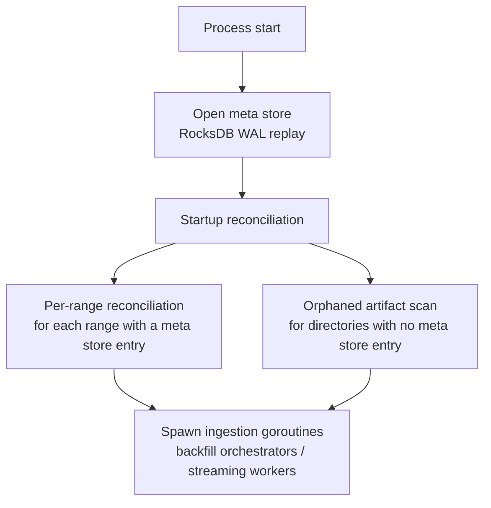
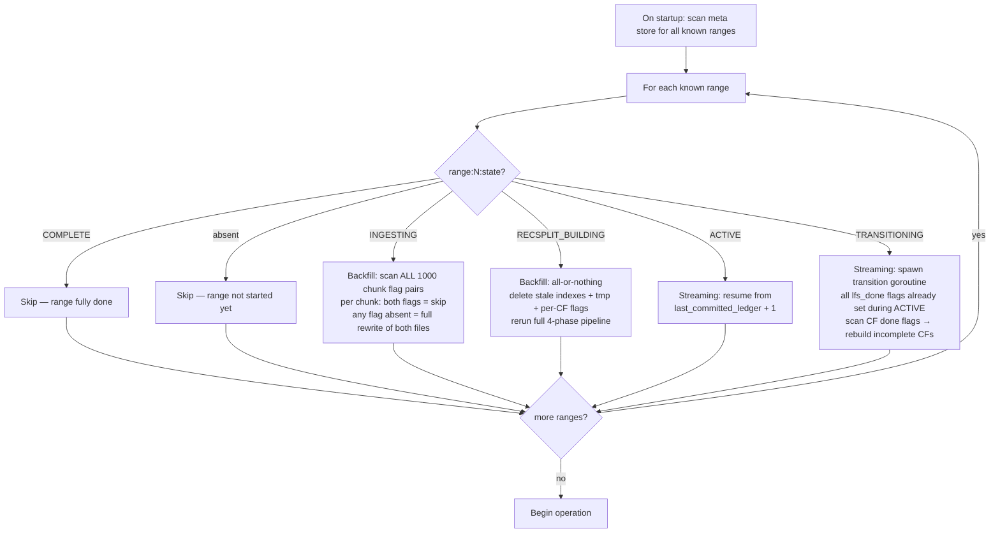

# Crash Recovery

## Overview

Crash recovery semantics differ between backfill and streaming modes. The meta store is the authoritative source for all recovery decisions. No in-memory state survives a crash; everything required for resume is persisted before the action it represents is taken.

---

## Glossary

| Term | Definition |
|------|-----------|
| **Range** | 10,000,000 ledgers. The unit of RecSplit index build and range state tracking. Range 0 = ledgers 2–10,000,001. |
| **Chunk** | 10,000 ledgers. One LFS file + one raw txhash flat file. The atomic unit of crash recovery in backfill. |
| **BSB instance** | One `BufferedStorageBackend` assigned to a contiguous slice of 500K ledgers (50 chunks) within a range. Default: 20 BSB instances per range. |
| **BSB parallelism** | All 20 BSB instances within a range run **concurrently**. Each independently fetches, decompresses, and writes its 50 chunks. This is the source of non-contiguous completion at crash time — different BSB instances make different amounts of progress before a crash. |
| **Chunk flags** | Two meta store keys per chunk: `lfs_done` and `txhash_done`. Set only after fsync of the respective file. Both must be `"1"` for a chunk to be skipped on resume. |
| **RecSplit CF** | One of 16 column family index files, sharded by the first hex character of the txhash string (`0`–`f`). Per-CF done flags (`recsplit:cf:{XX}:done`) are written by both backfill and streaming. Streaming uses them for incremental crash recovery. Backfill writes them as bookkeeping records but uses all-or-nothing recovery (flags are cleared and re-set on rerun). |

---

## Core Invariants

1. **Flags are written after fsync** — `lfs_done`, `txhash_done`, and `recsplit:cf:XX:done` are set in the meta store only after the corresponding file is fsynced to disk. Both backfill and streaming write per-CF done flags. Backfill additionally clears them (`ClearRecSplitCFFlags`) at the start of each all-or-nothing rerun.
2. **Chunk flags are never deleted** — once set to `"1"`, they are permanent.
3. **Streaming checkpoint written after WriteBatch** — `streaming:last_committed_ledger` is updated only after the RocksDB WriteBatch (with WAL) succeeds.
4. **Active store never deleted until verification passes** — streaming transition: active store deletion is the last step, after all LFS chunks, RecSplit CFs, and spot-check verification complete.
5. **Partial chunk files are always safe to overwrite** — if either `lfs_done` or `txhash_done` is absent (or not `"1"`), both files are deleted and rewritten from scratch. There is no partial-rewrite path. The only way to skip a chunk is if **both** flags are `"1"`.
6. **Gaps are expected at crash time** — because all 20 BSB instances within a range run in parallel, completed chunks are NOT guaranteed to form a contiguous prefix. On resume, the process scans all 1,000 chunk flag pairs and redoes any chunk where either flag is missing, regardless of position.
7. **Meta store WAL is never disabled** — the meta store RocksDB instance always has WAL enabled. All writes to the meta store (chunk flags, range state, RecSplit CF done flags, streaming checkpoint) are durable only after the WAL entry is fsynced. Disabling WAL for the meta store would break the flag-after-fsync invariant and make all chunk-level and range-level recovery untrustworthy.

---

## Startup Reconciliation

On every startup, before ingestion begins, the system performs a one-time reconciliation pass that compares on-disk artifacts against meta store state. This handles orphaned files and stores left behind by previous crashes.

Startup reconciliation runs **after** the meta store is opened but **before** any ingestion goroutines (backfill orchestrators or streaming workers) are spawned.

---

### Per-Range Reconciliation

For each range that has a meta store entry (`range:{N:04d}:state` is present), the reconciliation pass checks on-disk artifacts against the expected state:

| Range State | Reconciliation Action |
|------------|----------------------|
| **COMPLETE** | Delete any leftover raw txhash flat files (`immutable/txhash/{N:04d}/raw/`). Delete any orphaned transitioning store directories (`<active_stores_base_dir>/txhash-store-range-{N:04d}/`). These artifacts may persist if a previous run crashed after setting `COMPLETE` but before cleanup finished. |
| **TRANSITIONING** / **RECSPLIT_BUILDING** | Verify the transitioning txhash store exists on disk (for streaming `TRANSITIONING`) or that all raw txhash flat files exist (for backfill `RECSPLIT_BUILDING`). If the required input data is absent, abort startup with a fatal error. |
| **INGESTING** (backfill) | Normal resume: the chunk flag scan handles all cleanup. No special reconciliation action needed. |
| **ACTIVE** (streaming) | Normal resume: re-ingest from `streaming:last_committed_ledger + 1`. No special cleanup needed — active stores recovered via RocksDB WAL replay. |

---

### Orphaned Artifacts (No Meta Store Entry)

After per-range reconciliation, the system scans the data directory for store directories and file trees that have **no corresponding meta store entry**:

- **RocksDB store directories** with no matching range → delete
- **Raw txhash file directories** where range state is absent → delete
- **LFS chunk file directories** where range state is absent → delete
- **RecSplit index directories** where range state is absent → delete

All cleanup actions are logged at **WARN** level.

> **Safety note**: If an unexpectedly large number of ranges are flagged as orphaned (e.g., more than 1), the system logs a FATAL error and aborts rather than proceeding with deletion — possible meta store corruption.

---

### Ordering



The reconciliation pass is **synchronous and blocking**. For a typical deployment with tens of ranges, the pass completes in under a second.

---

### Concurrent Access Prevention

The meta store RocksDB instance enforces single-process access via the kernel-level `flock()` system call on a `LOCK` file in the database directory. This lock is:

- **Automatic**: acquired when the meta store is opened, released when it is closed
- **Kernel-managed**: released automatically on process exit, including `kill -9`, OOM kill, or segfault — no stale lock files
- **Cross-process**: any second process attempting to open the same meta store will fail immediately

---

## Backfill Crash Recovery

Backfill crash recovery follows from the three invariants described in [03-backfill-workflow.md](./03-backfill-workflow.md#crash-recovery):

1. **Key implies durable file** — flag set only after fsync
2. **Tasks are idempotent** — each task checks its own outputs and skips completed work
3. **Startup rebuilds the full task graph** — completed tasks are no-ops

All backfill crash scenarios — whether mid-chunk, between phases, at state boundaries, or with multiple concurrent ranges — are handled uniformly by these three properties. The system does not need to distinguish crash points; it simply re-evaluates the task graph and re-runs incomplete tasks.

### Per-Range State Check

On startup, the orchestrator reads `range:{N:04d}:state` for every range:

| State | Action |
|-------|--------|
| absent | Range not yet started → create as new, set `INGESTING` |
| `INGESTING` | Resume: scan all 1,000 chunk flag pairs, skip complete chunks, redo the rest |
| `RECSPLIT_BUILDING` | All-or-nothing: delete stale indexes + tmp + per-CF flags, rerun full 4-phase pipeline |
| `COMPLETE` | Skip entirely |

The per-range state key provides fast startup triage — immediately determines the resume action without scanning chunk flags for already-complete ranges.

### Chunk Flag Scan (INGESTING Ranges)

For each range in `INGESTING` state, all 1,000 chunk flag pairs are scanned unconditionally. No early-exit — gaps are non-contiguous.

```
for chunkID in range(rangeFirstChunk, rangeFirstChunk + 1000):
    lfs  = metaStore.get("range:{N}:chunk:{chunkID}:lfs_done")
    tx   = metaStore.get("range:{N}:chunk:{chunkID}:txhash_done")

    if lfs == "1" AND tx == "1":
        skipSet.add(chunkID)
    else:
        redoSet.add(chunkID)   // any flag absent → full rewrite of both files
```

Each BSB instance receives its per-chunk work lists by intersecting with its own chunk slice. BSB instances with all chunks in `skipSet` exit immediately with zero GCS traffic.

### Multi-Range Concurrent Recovery

When `parallel_ranges=2`, both ranges resume **independently and concurrently** — different meta store key prefixes, different goroutines, different disk paths, different GCS traffic. No cross-range coordination is needed.

---

## Streaming Crash Scenarios

### Scenario S1: Crash During Normal Ingestion

```
State at crash:
  streaming:last_committed_ledger = 14,999,001
  range:0001:state = "ACTIVE"
  Active ledger store and txhash store for range 1 intact (WAL-backed)

On restart:
  resume_ledger = 14,999,001 + 1 = 14,999,002
  Re-ingest ledgers 14,999,002 onward
  Ledgers already in both active stores via WAL replay: safe, writes are idempotent
```

### Scenario S2: Crash During Ledger Sub-flow Transition (at Chunk Boundary)

```
State at crash:
  range:0000:state                = "ACTIVE"
  range:0000:chunk:000050:lfs_done = "1"   ← chunks 0–50 transitioned at their chunk boundaries
  range:0000:chunk:000051:lfs_done = absent ← crash during chunk 51's LFS flush goroutine
  transitioningLedgerStore != nil (chunk 51's store still being flushed)
  streaming:last_committed_ledger = some ledger within chunk 52 (ingestion continues)

On restart:
  range 0: ACTIVE → resume streaming from last_committed_ledger + 1
  WAL recovery restores the active ledger store (current chunk) and the txhash store
  The transitioning ledger store for chunk 51 is gone (crash cleared it)
  Chunk 51's data is still in the WAL-recovered state from the active store at crash time
  → Re-trigger chunk 51's LFS flush: read from the re-opened store → write LFS → set lfs_done
  → Resume normal ingestion; future chunk boundaries trigger their own transitions
  Active txhash store is unaffected — it spans the entire range
```

### Scenario S3: Crash During TxHash Sub-flow Transition (RecSplit Build)

```
State at crash:
  range:0000:state               = "TRANSITIONING"
  (all 1000 lfs_done = "1" — set during ACTIVE at each chunk boundary)
  range:0000:recsplit:state      = "BUILDING"
  range:0000:recsplit:cf:00:done = "1"
  range:0000:recsplit:cf:01:done = absent

On restart:
  Transition goroutine: all lfs_done flags already set during ACTIVE → only RecSplit recovery needed
  Scan CF flags: CF 0 done, CFs 1–15 rebuild from transitioning txhash store (reading each CF by nibble)
  Transitioning txhash store for range 0 still on disk — not deleted until COMPLETE
```

### Scenario S4: Crash After Verification, Before Transitioning TxHash Store Deleted

```
State at crash:
  range:0000:state = "TRANSITIONING"
  (all lfs_done, all recsplit:cf:XX:done = "1")
  Transitioning txhash store still on disk (no ledger stores — all deleted at chunk boundaries)

On restart:
  All flags set → infer transition complete
  Re-run verification (spot-check)
  RemoveTransitioningTxHashStore — close + delete transitioning txhash store
  Set range:0000:state = "COMPLETE"
```

### Scenario S5: Crash After COMPLETE Written, Before Transitioning TxHash Store Deleted

```
  range:0000:state = "COMPLETE"
  Transitioning txhash store still on disk (orphaned)

On restart:
  state = COMPLETE → no transition needed
  Orphaned transitioning txhash store → safe to delete on startup
  Query routing uses immutable stores (LFS + RecSplit) for range 0
```

### Scenario SC1: Crash While Waiting for Last Chunk's LFS Flush at Range Boundary

```
State at crash:
  The range boundary ledger has been committed to the txhash store.
  The last chunk (999) LFS flush goroutine is running but hasn't finished.
  range:N:state = "ACTIVE" (not yet set to TRANSITIONING — crashed during the wait)
  range:N:chunk:000999:lfs_done = absent
  streaming:last_committed_ledger = rangeLastLedger(N)

On restart:
  range:N:state = "ACTIVE" → resume streaming from last_committed_ledger + 1
  Recovery must:
    1. Detect that range N is ACTIVE but all chunks except 999 have lfs_done set
    2. WAL recovery restores the active ledger store data for chunk 999
    3. Re-trigger chunk 999's LFS flush from the WAL-recovered store
    4. After chunk 999 flush completes and lfs_done is set, proceed with range boundary handling
```

### Scenario SC2: Crash After All lfs_done Verified, Before WriteBatch

```
State at crash:
  All 1000 lfs_done flags = "1" (verified)
  range:N:state = "ACTIVE" (WriteBatch not yet written)
  range:N+1:state = absent
  Physical ops may be partial: txhash store may or may not be moved

On restart:
  Same as SC1 — re-enter range boundary handling
  lfs_done scan: all 1,000 flags present → proceed
  Redo physical ops (idempotent no-ops if already done)
  Atomic WriteBatch: range:N:state = TRANSITIONING + range:N+1:state = ACTIVE
  Spawn RecSplit goroutine
```

### Range Boundary Crash Recovery (Streaming)

Because physical operations are idempotent and meta store state transitions use a single atomic WriteBatch, range boundary recovery is straightforward:

| Crash Point | State on Restart | Recovery Action |
|------------|-----------------|----------------|
| Before physical ops | range:N = ACTIVE, range:N+1 absent | Re-enter range boundary handling from the top |
| After physical ops, before WriteBatch | range:N = ACTIVE, range:N+1 absent (files moved but states unchanged) | Redo physical ops (idempotent no-ops), then write the WriteBatch |
| After WriteBatch | range:N = TRANSITIONING, range:N+1 = ACTIVE | Resume: spawn RecSplit goroutine for range N, continue ingesting range N+1 |

### Scenario SC3: Crash During RecSplit Build (Streaming — All lfs_done Already Set During ACTIVE)

```
State at crash:
  range:N:state = "TRANSITIONING"
  All 1,000 lfs_done flags = "1" (set during ACTIVE — not at transition time)
  range:N:recsplit:state = "BUILDING"
  Some recsplit:cf:XX:done flags set, others absent

On restart:
  Transition goroutine: all lfs_done flags set → no LFS work needed
  Scan CF done flags:
    CFs with done="1" → skip (use existing .idx files)
    CFs with done=absent → delete partial .idx file (if any), rebuild from transitioning txhash store
  Continue RecSplit build → verify → COMPLETE → RemoveTransitioningTxHashStore
```

---

## Recovery Decision Tree



---

## What Is Never Safe

| Operation | Why Unsafe |
|-----------|-----------|
| Setting `lfs_done` before fsync | Power loss → corrupt file with flag claiming completion |
| Setting `txhash_done` before fsync | Corrupt input to RecSplit build |
| Deleting active store before verification | Query outage if LFS or RecSplit is corrupt |
| Deleting raw txhash flat files before RecSplit completes | RecSplit cannot resume without input |
| Disabling WAL for streaming active store | Ledger/txhash data loss; checkpoint invariant broken |
| Disabling WAL for the meta store | Flag writes are not durable; entire crash recovery model breaks |
| Re-using a chunk file with no `lfs_done` flag | File may be partial; always truncate and rewrite |
| Assuming completed chunks are contiguous | BSB instances run in parallel; non-contiguous gaps are the norm |

---

## getEvents Immutable Store — Placeholder

> **Status**: Not yet designed.

When `getEvents` is added, it will require a new per-chunk completion flag (e.g., `events_done`), a new range-level index type, and the same fsync-before-flag invariant. Chunk skip rule extends: a chunk is only skippable when **all** required flags are set.

---

## Related Documents

- [02-meta-store-design.md](./02-meta-store-design.md) — all state keys and their semantics
- [03-backfill-workflow.md](./03-backfill-workflow.md) — backfill task graph, crash recovery invariants, RecSplit pipeline
- [06-streaming-transition-workflow.md](./06-streaming-transition-workflow.md) — streaming transition crash recovery
- [11-checkpointing-and-transitions.md](./11-checkpointing-and-transitions.md) — checkpoint math and resume formulas
