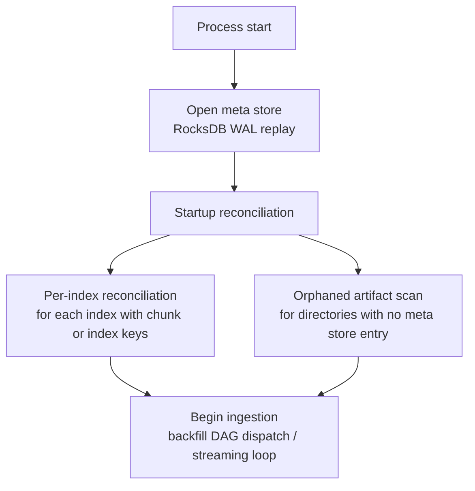
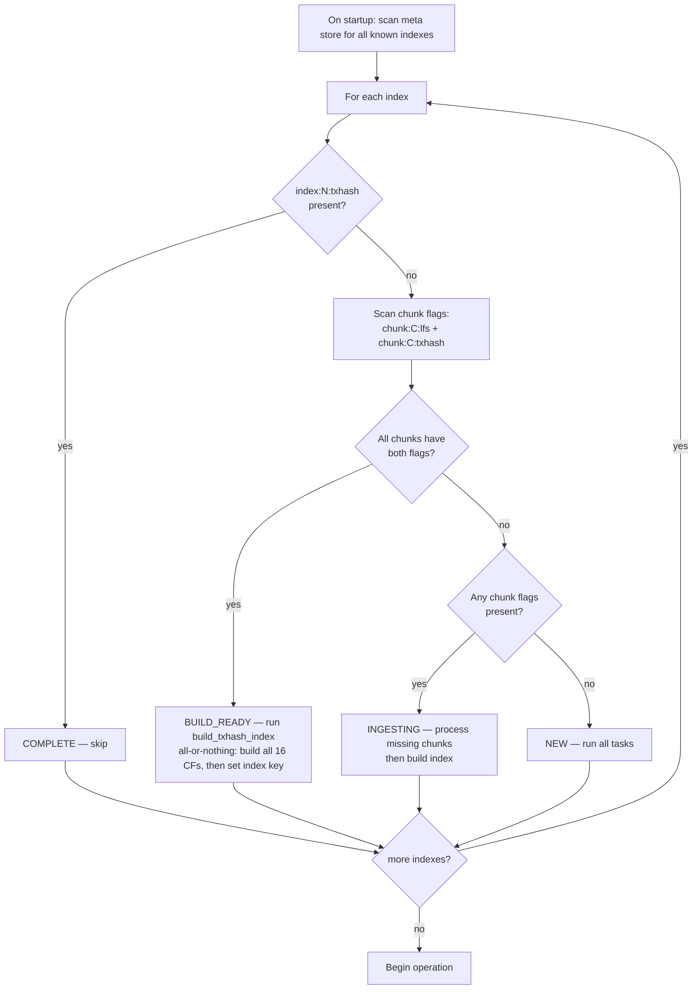

# Crash Recovery

## Overview

Crash recovery semantics differ between backfill and streaming modes. The meta store is the authoritative source for all recovery decisions. No in-memory state survives a crash; everything required for resume is persisted before the action it represents is taken.

---

## Glossary

| Term | Definition |
|------|-----------|
| **Index** | 10,000,000 ledgers. The unit of RecSplit index build. `index_id = chunk_id / chunks_per_txhash_index`. Index 0 = ledgers 2–10,000,001. |
| **Chunk** | 10,000 ledgers. One LFS file + one raw txhash flat file. The atomic unit of crash recovery in backfill. |
| **BSB instance** | One `BufferedStorageBackend` assigned to a contiguous slice of 500K ledgers (50 chunks) within an index. Default: 20 BSB instances per index. |
| **BSB parallelism** | All 20 BSB instances within an index run **concurrently**. Each independently fetches, decompresses, and writes its 50 chunks. This is the source of non-contiguous completion at crash time — different BSB instances make different amounts of progress before a crash. |
| **Chunk flags** | Two meta store keys per chunk: `chunk:{C:010d}:lfs` and `chunk:{C:010d}:txhash`. Set only after fsync of the respective file. Both must be `"1"` for a chunk to be skipped on resume. |
| **RecSplit CF** | One of 16 column family index files, sharded by the first hex character of the txhash string (`0`–`f`). A single `index:{N:010d}:txhash = "1"` key replaces the former 16 per-CF done flags. Written after all 16 CFs are built and fsynced. |

---

## Core Invariants

1. **Flags are written after fsync** — `chunk:{C}:lfs`, `chunk:{C}:txhash`, and `index:{N}:txhash` are set in the meta store only after the corresponding file(s) are fsynced to disk. The index key is a single flag written after all 16 CFs are built and fsynced.
2. **Chunk flags are never deleted** — once `chunk:{C}:lfs` or `chunk:{C}:txhash` is set to `"1"`, it is permanent.
3. **Streaming checkpoint written after WriteBatch** — `streaming:last_committed_ledger` is updated only after the RocksDB WriteBatch (with WAL) succeeds.
4. **Active store never deleted until verification passes** — streaming transition: active store deletion is the last step, after all LFS chunks, RecSplit CFs, and spot-check verification complete.
5. **Partial chunk files are always safe to overwrite** — if either `chunk:{C}:lfs` or `chunk:{C}:txhash` is absent (or not `"1"`), both files are deleted and rewritten from scratch. There is no partial-rewrite path. The only way to skip a chunk is if **both** flags are `"1"`.
6. **Gaps are expected at crash time** — because all 20 BSB instances within an index run in parallel, completed chunks are NOT guaranteed to form a contiguous prefix. On resume, the process scans all 1,000 chunk flag pairs and redoes any chunk where either flag is missing, regardless of position.
7. **Meta store WAL is never disabled** — the meta store RocksDB instance always has WAL enabled. All writes to the meta store (chunk flags, index completion key, streaming checkpoint) are durable only after the WAL entry is fsynced. Disabling WAL for the meta store would break the flag-after-fsync invariant and make all chunk-level and index-level recovery untrustworthy.

---

## Startup Reconciliation

On every startup, before ingestion begins, the system performs a one-time reconciliation pass that compares on-disk artifacts against meta store state. This handles orphaned files and stores left behind by previous crashes.

Startup reconciliation runs **after** the meta store is opened but **before** any ingestion begins (backfill DAG dispatch or streaming loop).

---

### Per-Index Reconciliation

For each index, the reconciliation pass derives state from key presence and checks on-disk artifacts:

| Key Presence | Reconciliation Action |
|------------|----------------------|
| `index:{N:010d}:txhash` **present** | Index complete. Delete any leftover raw txhash flat files (`immutable/txhash/{N:04d}/raw/`). Delete any orphaned transitioning store directories (`<active_stores_base_dir>/txhash-store-index-{N:04d}/`). These artifacts may persist if a previous run crashed after completion but before cleanup finished. |
| **No index key** but some `chunk:{C}:lfs` / `chunk:{C}:txhash` flags exist | Normal resume: chunk flag scan handles all cleanup. No special reconciliation action needed. |
| **No chunk flags at all** for an index | Not yet started — no cleanup needed. |

---

### Orphaned Artifacts (No Meta Store Entry)

After per-index reconciliation, the system scans the data directory for store directories and file trees that have **no corresponding meta store entry**:

- **RocksDB store directories** with no matching index → delete
- **Raw txhash file directories** where no chunk/index keys exist → delete
- **LFS chunk file directories** where no chunk/index keys exist → delete
- **RecSplit index directories** where no chunk/index keys exist → delete

All cleanup actions are logged at **WARN** level.

> **Safety note**: If an unexpectedly large number of indexes are flagged as orphaned (e.g., more than 1), the system logs a FATAL error and aborts rather than proceeding with deletion — possible meta store corruption.

---

### Ordering



The reconciliation pass is **synchronous and blocking**. For a typical deployment with tens of indexes, the pass completes in under a second.

---

### Concurrent Access Prevention

The meta store RocksDB instance enforces single-process access via the kernel-level `flock()` system call on a `LOCK` file in the database directory. This lock is:

- **Automatic**: acquired when the meta store is opened, released when it is closed
- **Kernel-managed**: released automatically on process exit, including `kill -9`, OOM kill, or segfault — no stale lock files
- **Cross-process**: any second process attempting to open the same meta store will fail immediately

---

## Backfill Crash Recovery

Backfill crash recovery follows from the three invariants described in [03-backfill-workflow.md](./03-backfill-workflow.md#crash-recovery):

1. **Key implies durable file** — flag set only after fsync
2. **Tasks are idempotent** — each task checks its own outputs and skips completed work
3. **Startup rebuilds the full task graph** — completed tasks are no-ops

All backfill crash scenarios — whether mid-chunk, between phases, at state boundaries, or with multiple concurrent indexes — are handled uniformly by these three properties. The system does not need to distinguish crash points; it simply re-evaluates the task graph and re-runs incomplete tasks.

### Per-Index State Check

On startup, the DAG scheduler derives state for every index from key presence — there is no stored state key:

| Key Presence | Action |
|---|---|
| `index:{N:010d}:txhash` present | COMPLETE — skip |
| All chunks have `chunk:{C}:lfs` + `chunk:{C}:txhash` flags, no index key | BUILD_READY — run build_txhash_index |
| Some chunks have both flags, some missing | INGESTING — process missing chunks, then build |
| No chunk flags | NEW — run all tasks |

The `index:{N}:txhash` key provides fast startup triage — immediately skips complete indexes without scanning chunk flags.

### Chunk Flag Scan (Incomplete Indexes)

For each index without an `index:{N}:txhash` key, all 1,000 chunk flag pairs are scanned unconditionally. No early-exit — gaps are non-contiguous.

```
for chunkID in chunksForIndex(indexID):
    lfs  = metaStore.has(f"chunk:{chunkID:06d}:lfs")
    tx   = metaStore.has(f"chunk:{chunkID:06d}:txhash")
    if lfs AND tx: skipSet.add(chunkID)
    else: redoSet.add(chunkID)
```

Each BSB instance receives its per-chunk work lists by intersecting with its own chunk slice. BSB instances with all chunks in `skipSet` exit immediately with zero GCS traffic.

### Multi-Index Concurrent Recovery

Indexes resume independently via the flat worker pool — different meta store key prefixes, different goroutines, different disk paths, different GCS traffic. No cross-index coordination is needed.

---

## Streaming Crash Scenarios

### Scenario S1: Crash During Normal Ingestion

```
State at crash:
  streaming:last_committed_ledger = 14,999,001
  Active ledger store and txhash store for index 1 intact (WAL-backed)

On restart:
  resume_ledger = 14,999,001 + 1 = 14,999,002
  Re-ingest ledgers 14,999,002 onward
  Ledgers already in both active stores via WAL replay: safe, writes are idempotent
```

### Scenario S2: Crash During Ledger Sub-flow Transition (at Chunk Boundary)

```
State at crash:
  chunk:000050:lfs = "1"   ← chunks 0–50 transitioned at their chunk boundaries
  chunk:000051:lfs = absent ← crash during chunk 51's LFS flush goroutine
  transitioningLedgerStore != nil (chunk 51's store still being flushed)
  streaming:last_committed_ledger = some ledger within chunk 52 (ingestion continues)

On restart:
  Resume streaming from last_committed_ledger + 1
  WAL recovery restores the active ledger store (current chunk) and the txhash store
  The transitioning ledger store for chunk 51 is gone (crash cleared it)
  Chunk 51's data is still in the WAL-recovered state from the active store at crash time
  → Re-trigger chunk 51's LFS flush: read from the re-opened store → write LFS → set chunk:000051:lfs
  → Resume normal ingestion; future chunk boundaries trigger their own transitions
  Active txhash store is unaffected — it spans the entire index
```

### Scenario S3: Crash During TxHash Sub-flow Transition (RecSplit Build)

```
State at crash:
  All 1000 chunk:{C}:lfs = "1" (set during streaming at each chunk boundary)
  All 1000 chunk:{C}:txhash = "1"
  index:0000000000:txhash = absent (build in progress, not yet complete)

On restart:
  All chunk flags set → only RecSplit recovery needed
  index:0000000000:txhash absent → rebuild all 16 CFs from scratch
  Delete any partial .idx files, rebuild from transitioning txhash store
  After all 16 CFs built and fsynced → write index:0000000000:txhash = "1"
  Transitioning txhash store for index 0 still on disk — not deleted until completion
```

### Scenario S4: Crash After Verification or COMPLETE, Before Transitioning TxHash Store Deleted

```
State at crash:
  index:0000000000:txhash = "1" (RecSplit complete)
  Transitioning txhash store still on disk (orphaned)

On restart:
  index:0000000000:txhash present → index complete
  Orphaned transitioning txhash store → safe to delete on startup
  Query routing uses immutable stores (LFS + RecSplit) for index 0
```

### Scenario SC1: Crash While Waiting for Last Chunk's LFS Flush at Index Boundary

```
State at crash:
  The index boundary ledger has been committed to the txhash store.
  The last chunk (999) LFS flush goroutine is running but hasn't finished.
  chunk:000999:lfs = absent
  streaming:last_committed_ledger = indexLastLedger(N)

On restart:
  Resume streaming from last_committed_ledger + 1
  Recovery must:
    1. Detect that all chunks except 999 have chunk:{C}:lfs set
    2. WAL recovery restores the active ledger store data for chunk 999
    3. Re-trigger chunk 999's LFS flush from the WAL-recovered store
    4. After chunk 999 flush completes and chunk:000999:lfs is set, proceed with index boundary handling
```

### Scenario SC2: Crash After All Chunk LFS Flags Verified, Before RecSplit

```
State at crash:
  All 1000 chunk:{C}:lfs flags = "1" (verified)
  index:N:txhash = absent
  Physical ops may be partial: txhash store may or may not be moved

On restart:
  Same as SC1 — re-enter index boundary handling
  chunk flag scan: all 1,000 lfs flags present → proceed
  Redo physical ops (idempotent no-ops if already done)
  Spawn RecSplit goroutine for index N
```

### Index Boundary Crash Recovery (Streaming)

Because physical operations are idempotent and state is derived from key presence, index boundary recovery is straightforward. SC1 and SC2 above cover the two concrete crash points. In all cases: all chunk flags present + `index:N:txhash` absent = redo physical ops (idempotent no-ops) + run RecSplit build. Once `index:N:txhash` = "1", the index is complete.

---

## Recovery Decision Tree



---

## What Is Never Safe

| Operation | Why Unsafe |
|-----------|-----------|
| Setting `chunk:{C}:lfs` before fsync | Power loss → corrupt file with flag claiming completion |
| Setting `chunk:{C}:txhash` before fsync | Corrupt input to RecSplit build |
| Deleting active store before verification | Query outage if LFS or RecSplit is corrupt |
| Deleting raw txhash flat files before RecSplit completes | RecSplit cannot resume without input |
| Disabling WAL for streaming active store | Ledger/txhash data loss; checkpoint invariant broken |
| Disabling WAL for the meta store | Flag writes are not durable; entire crash recovery model breaks |
| Re-using a chunk file with no `chunk:{C}:lfs` flag | File may be partial; always truncate and rewrite |
| Assuming completed chunks are contiguous | BSB instances run in parallel; non-contiguous gaps are the norm |

---

## getEvents Immutable Store — Placeholder

> **Status**: Not yet designed.

When `getEvents` is added, it will require a new per-chunk completion flag (e.g., `chunk:{C:010d}:events`), a new index-level completion key, and the same fsync-before-flag invariant. Chunk skip rule extends: a chunk is only skippable when **all** required flags are set.

---

## Related Documents

- [02-meta-store-design.md](./02-meta-store-design.md) — all state keys and their semantics
- [03-backfill-workflow.md](./03-backfill-workflow.md) — backfill task graph, crash recovery invariants, RecSplit pipeline
- [04-streaming-and-transition.md](./04-streaming-and-transition.md) — streaming transition crash recovery
- [11-checkpointing-and-transitions.md](./11-checkpointing-and-transitions.md) — checkpoint math and resume formulas
