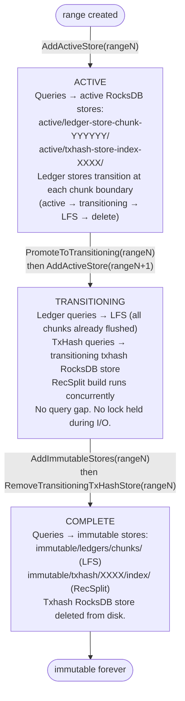
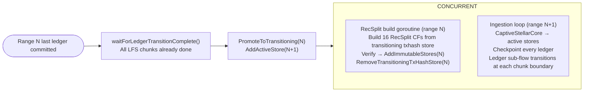
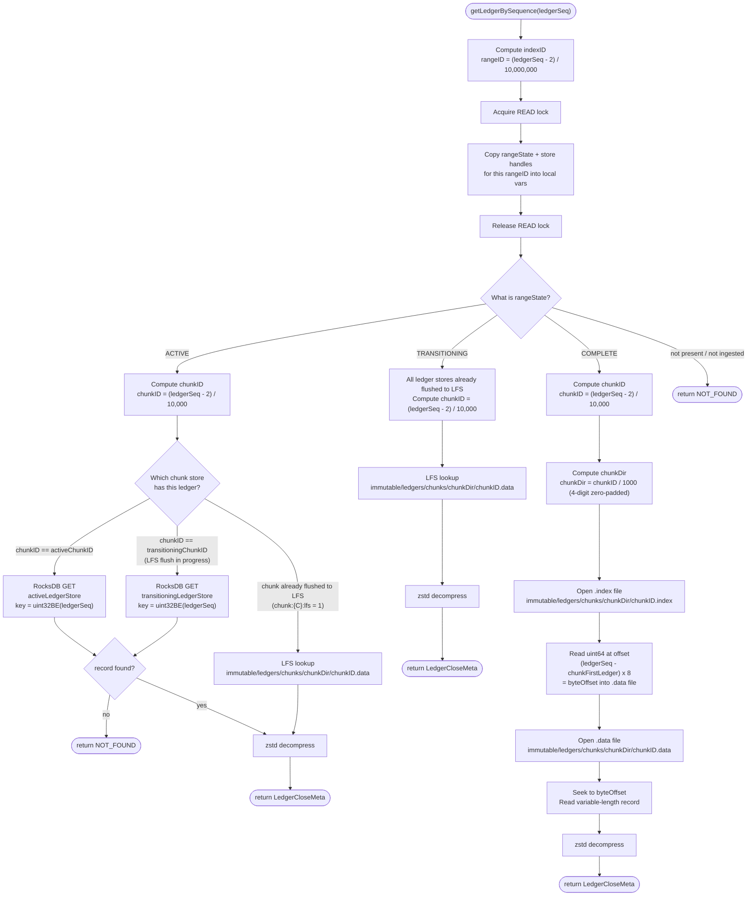
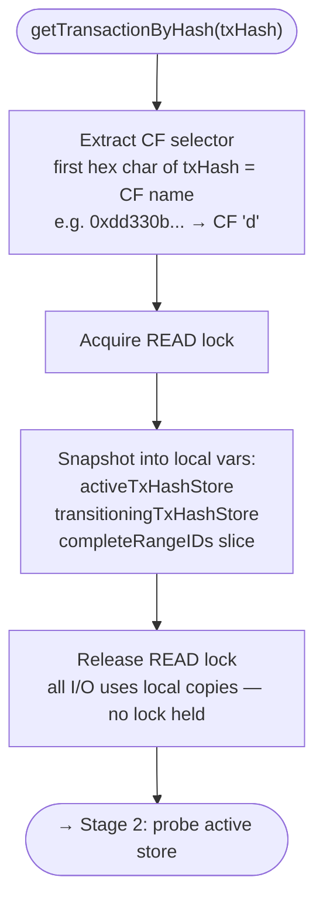
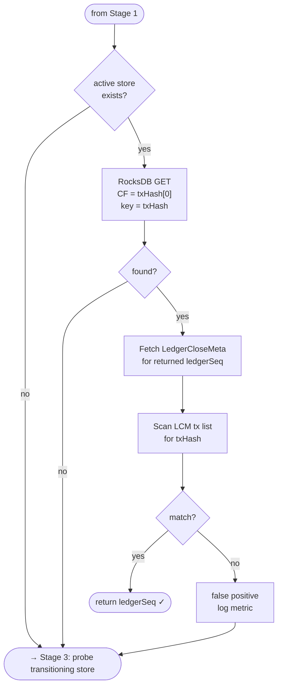
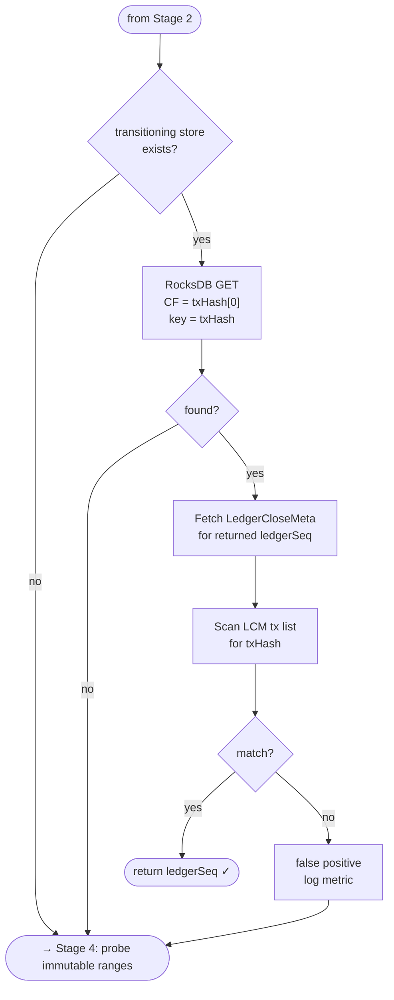
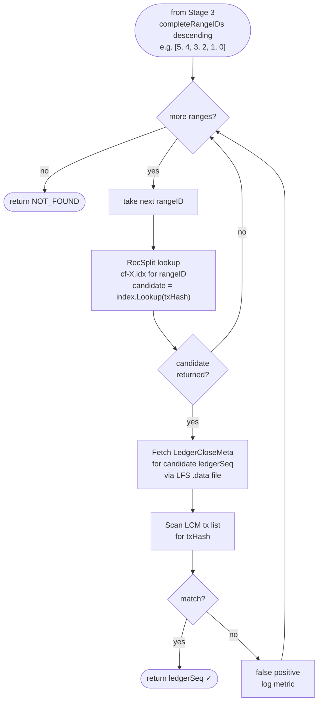

# Query Routing

## Overview

The QueryRouter dispatches `getLedgerBySequence` and `getTransactionByHash` requests to the correct store based on the index state derived from meta store keys. Queries are only served in streaming mode. Backfill mode serves only `getHealth` and `getStatus`.

**Key Responsibilities**:
- Calculate index ID from ledger sequence
- Derive index state from meta store keys (not filesystem)
- Route to the appropriate store (index state derived from chunk flags and index keys)
- Handle RecSplit false positives — verify transaction actually exists in returned ledger
- Maintain thread-safe handle registry; swap store references as ranges transition

---

## Store Lifecycle and Query Availability

| Index State | `getLedgerBySequence` | `getTransactionByHash` |
|-------------|----------------------|----------------------|
| `ACTIVE` | Active ledger store (or transitioning ledger store during chunk transition, or LFS for already-transitioned chunks) | Active txhash store (CF for nibble) |
| `TRANSITIONING` | LFS chunk files (all ledger stores already transitioned and deleted during ACTIVE) | Transitioning txhash store (still open) |
| `COMPLETE` | Immutable LFS store | Immutable RecSplit index |
| Not yet started | Not available — index not ingested | Not available |

These are operational states derived from key presence in the meta store (chunk flags and index keys), not stored state values. **Each sub-flow can have at most 1 active store and 1 transitioning store at any point in time.** The ledger sub-flow transitions at every chunk boundary (10K ledgers); the txhash sub-flow transitions at every index boundary (10M ledgers). By the time an index reaches `TRANSITIONING`, all ledger stores have been individually transitioned to LFS and deleted — only the txhash store remains open for reads.

---

## System State Example

To ground all routing examples, consider this concrete system state:

**Current State**: Streaming mode, `streaming:last_committed_ledger = 61,111,222`

**Meta Store State**:
```
streaming:last_committed_ledger = "61111222"
```

Indexes 0–5 are complete (`index:0000:txhashindex` through `index:0005:txhashindex` = "1"). Index 6 is active (no txhashindex key; chunk flags show incomplete).

**Store Layout**:

| Index | State | Ledger Store | TxHash Store |
|-------|-------|--------------|--------------|
| 0–5 | COMPLETE | LFS chunks in `immutable/ledgers/chunks/` | RecSplit indexes in `immutable/txhash/{indexID:04d}/index/` |
| 6 | ACTIVE | `<active_stores_base_dir>/ledger-store-chunk-006111/` | `<active_stores_base_dir>/txhash-store-index-0006/` (16 CFs) |

All examples in this document use this state.

---

## Ledger Store vs TxHash Store Cadence

The two active stores have **different transition frequencies**. This is the most important structural distinction in the QueryRouter.

| Dimension | Ledger Store | TxHash Store |
|-----------|-------------|--------------|
| Transition trigger | Chunk boundary (every 10K ledgers) | Range boundary (every 10M ledgers) |
| Frequency | ~1000× per range | ~1× per range |
| Path key | `chunkID` (e.g. `006111`) | `rangeID` (e.g. `0006`) |
| Path pattern | `ledger-store-chunk-{chunkID:06d}/` | `txhash-store-index-{rangeID:04d}/` |
| Router method (transition) | `SwapActiveLedgerStore` → `CompleteLedgerTransition` | `PromoteToTransitioning` → `RemoveTransitioningTxHashStore` |
| Promoted at range boundary? | No — all ledger stores already transitioned to LFS and deleted during ACTIVE at their chunk boundaries | Yes — `transitioningTxHashStore` = range's DB (via `PromoteToTransitioning`) |
| Struct field tracking | `activeChunkID`, `transitioningChunkID` | `activeRangeID`, `transitioningRangeID` |

**Concrete example at `last_committed_ledger = 61,111,222`**:
- `chunkID = (61111222 - 2) / 10_000 = 6111` → ledger store: `ledger-store-chunk-006111/`
- `rangeID = (61111222 - 2) / 10_000_000 = 6` → txhash store: `txhash-store-index-0006/`

These are completely independent values on different update cadences.

---

## QueryRouter Architecture

The QueryRouter is the central component that knows where all data lives. It maintains an in-memory registry of store handles and provides thread-safe access for query routing.

### QueryRouter Struct

> **Note**: The following Go code is **pseudocode** illustrating the design. It shows the intended API contract and concurrency model. Actual implementation may differ in details.

```go
// PSEUDOCODE — illustrative design, not compilable
// QueryRouter manages routing queries to the correct data stores.
// It maintains a registry of all active, transitioning, and immutable stores.
// Thread-safe: uses RWMutex for concurrent read access during lookups.
//
// CADENCE NOTE:
//   - The ledger store transitions at CHUNK boundaries (every 10K ledgers, ~1000x per range).
//     It is keyed by chunkID: ledger-store-chunk-{chunkID:06d}/
//     activeChunkID tracks the current 10K-ledger chunk being written.
//   - The txhash store transitions at RANGE boundaries (every 10M ledgers, ~1x per range).
//     It is keyed by rangeID: txhash-store-index-{rangeID:04d}/
//     activeRangeID tracks the current 10M-ledger range being written.
//   - These are independent values. At ledger 65,000,000:
//       chunkID = (65000000 - 2) / 10000       = 6499 → ledger-store-chunk-006499/
//       rangeID = (65000000 - 2) / 10000000    = 6    → txhash-store-index-0006/
type QueryRouter struct {
    mu sync.RWMutex

    // Active stores (currently ingesting) — at most one pair at a time.
    // The ledger store is swapped at every chunk boundary (~every 10K ledgers).
    // The txhash store is swapped only at range boundaries (~every 10M ledgers).
    activeLedgerStore *rocksdb.DB  // ledger-store-chunk-{activeChunkID:06d}/ (default CF only)
    activeTxHashStore *rocksdb.DB  // txhash-store-index-{activeRangeID:04d}/ (16 CFs, one per nibble)
    activeChunkID     uint32       // current chunk (10K-ledger granularity); updated by SwapActiveLedgerStore
    activeRangeID     uint32       // current range (10M-ledger granularity); updated by AddActiveStore

    // Transitioning stores — at most one per sub-flow at a time.
    // Ledger: transitioningLedgerStore holds the chunk currently being flushed to LFS
    // (set by SwapActiveLedgerStore at each chunk boundary; cleared by CompleteLedgerTransition).
    // TxHash: transitioningTxHashStore holds the range's txhash store during RecSplit build
    // (set by PromoteToTransitioning at range boundary; cleared by RemoveTransitioningTxHashStore).
    // Both remain open for reads until explicitly closed.
    transitioningLedgerStore *rocksdb.DB  // ledger-store-chunk-{transitioningChunkID:06d}/ (read-only, during LFS flush)
    transitioningTxHashStore *rocksdb.DB  // txhash-store-index-{transitioningRangeID:04d}/ (read-only, during RecSplit build)
    transitioningChunkID     uint32       // chunkID currently being flushed to LFS (set at chunk boundary)
    transitioningRangeID     uint32       // rangeID of the transitioning range (set at range boundary)

    // Immutable stores (COMPLETE ranges) — indexed by range ID
    immutableLedgerStores map[uint32]*LFSStore       // rangeID → LFS store handle
    immutableTxHashStores map[uint32]*RecSplitStore  // rangeID → RecSplit handle (16 CFs)

    // Ordered list of complete range IDs for search order (newest first).
    // e.g. [5, 4, 3, 2, 1, 0] — maintained in descending order by insertDescending.
    // getTransactionByHash searches this slice left-to-right (newest range probed first).
    completeRangeIDs []uint32

    // Meta store reference for startup initialization
    metaStore *MetaStore
}
```

### QueryRouter Initialization

On streaming mode startup, the router initializes its registry from the meta store. Index state is **derived** from chunk flags and index keys, not from a stored state key:

1. Scan index keys (`index:{indexID:04d}:txhashindex`) and chunk flags (`chunk:{chunkID:06d}:lfs`) from the meta store to derive each index's operational state (COMPLETE, ACTIVE, or TRANSITIONING)
2. For each `COMPLETE` index: open and cache RecSplit index handles for all 16 CFs + LFS store handle; insert indexID into `completeRangeIDs` using `insertDescending` so the slice stays sorted descending (newest first)
3. For each `ACTIVE` index: derive `chunkID` from `streaming:last_committed_ledger` to open the correct `ledger-store-chunk-{chunkID:06d}/`; open both RocksDB stores
4. For each `TRANSITIONING` index: open only the txhash RocksDB store (all ledger stores were already transitioned to LFS and deleted during ACTIVE)

> **`insertDescending` note**: Maintains `completeRangeIDs` as a sorted-descending slice. After inserting ranges 0, 1, 2, 3, 4, 5 (in any order), the result is `[5, 4, 3, 2, 1, 0]`. This ordering ensures `getTransactionByHash` probes newest ranges first — the most common access pattern for recent transactions.

```go
// PSEUDOCODE — startup initialization
func NewQueryRouter(metaStore *MetaStore, basePath string) (*QueryRouter, error) {
    qr := &QueryRouter{
        immutableLedgerStores: make(map[uint32]*LFSStore),
        immutableTxHashStores: make(map[uint32]*RecSplitStore),
        metaStore:             metaStore,
    }

    indexStates := metaStore.DeriveAllIndexStates()  // returns map[indexID]state (derived from chunk flags + index keys)

    // lastCommittedLedger is needed to derive chunkID for the ACTIVE range.
    lastCommittedLedger := metaStore.GetUint32("streaming:last_committed_ledger")

    for rangeID, state := range indexStates {
        switch state {
        case "COMPLETE":
            lfs := openLFSStore(basePath, rangeID)
            recsplit := openRecSplitStore(basePath, rangeID)  // loads all 16 CF indexes
            qr.immutableLedgerStores[rangeID] = lfs
            qr.immutableTxHashStores[rangeID] = recsplit
            // insertDescending maintains [N, N-1, ..., 1, 0] order for newest-first search
            qr.completeRangeIDs = insertDescending(qr.completeRangeIDs, rangeID)

        case "ACTIVE":
            // The ledger store path depends on the current chunkID, not rangeID.
            // Derive chunkID from last_committed_ledger:
            //   chunkID = (lastCommittedLedger - 2) / 10_000
            // e.g. last_committed_ledger=61,111,222 → chunkID=6111 → ledger-store-chunk-006111/
            chunkID := (lastCommittedLedger - 2) / 10_000
            qr.activeLedgerStore = openRocksDB(basePath, chunkPath(chunkID))
            qr.activeTxHashStore = openRocksDB(basePath, txHashPath(rangeID))
            qr.activeChunkID = chunkID
            qr.activeRangeID = rangeID

        case "TRANSITIONING":
            // By the time a range reaches TRANSITIONING, ALL ledger stores have been
            // individually transitioned to LFS and deleted during ACTIVE (at their chunk
            // boundaries via SwapActiveLedgerStore + CompleteLedgerTransition).
            // Only the txhash store remains open for reads during RecSplit build.
            // There is NO transitioning ledger store to open.
            qr.transitioningTxHashStore = openRocksDB(basePath, txHashPath(rangeID))
            qr.transitioningRangeID = rangeID
        }
    }
    return qr, nil
}
```

---

## Registry Update Interface

The streaming ingestion loop and transition goroutine call these methods as ranges progress through the `ACTIVE → TRANSITIONING → COMPLETE` lifecycle.

**Two distinct update triggers**:
- **Chunk boundary** (every 10K ledgers, ~1000× per range): Only the ledger store transitions. `SwapActiveLedgerStore` opens a new `ledger-store-chunk-{newChunkID:06d}/` and moves the old store to `transitioningLedgerStore` (it stays open for reads during LFS flush). A background goroutine flushes the chunk to LFS, then calls `CompleteLedgerTransition` to close and delete the transitioning store. The txhash store is unchanged.
- **Range boundary** (every 10M ledgers, ~1× per range): Only the txhash store transitions. By this point, all ledger stores have been individually transitioned at their chunk boundaries and deleted. `PromoteToTransitioning` moves only the txhash store to `transitioningTxHashStore`; `AddActiveStore` opens a new pair for range N+1.

### 1. SwapActiveLedgerStore

```go
// SwapActiveLedgerStore replaces the active ledger store at a chunk boundary.
// Called when: a chunk boundary is crossed (every 10K ledgers, ~1000 times per range).
// Effect: Old ledger store is MOVED to transitioningLedgerStore (stays open for reads
//         during background LFS flush). The new store becomes the active ledger store.
//         The txhash store is NOT touched — it spans the full range.
// IMPORTANT: The caller MUST ensure transitioningLedgerStore is nil before calling.
//            If a previous chunk's LFS flush hasn't completed yet, the caller must
//            wait (via waitForLedgerTransitionComplete) before swapping again.
// Locking: Acquires WRITE lock (brief — pointer swap only).
func (qr *QueryRouter) SwapActiveLedgerStore(newChunkID uint32, newDB *rocksdb.DB) {
    qr.mu.Lock()
    defer qr.mu.Unlock()

    // Move old active store to transitioning — it stays open for reads
    // while the background goroutine flushes it to LFS.
    qr.transitioningLedgerStore = qr.activeLedgerStore
    qr.transitioningChunkID = qr.activeChunkID

    // Install new active store
    qr.activeLedgerStore = newDB
    qr.activeChunkID = newChunkID
    // qr.activeTxHashStore and qr.activeRangeID are unchanged
}
```

**When called**: Immediately after the new `ledger-store-chunk-{newChunkID:06d}/` is opened and the first ledger of the new chunk is committed. The streaming ingestion loop calls this for every chunk boundary — approximately 1000 times per 10M-ledger range. The caller must ensure the previous transitioning ledger store has been fully flushed and deleted (via `CompleteLedgerTransition`) before calling again.

**Example at ledger 60,010,002** (first ledger of range 6, chunk 6000):
```
SwapActiveLedgerStore(6000, openRocksDB("ledger-store-chunk-006000/"))
```
Old store `ledger-store-chunk-005999/` is moved to `transitioningLedgerStore`; new store `ledger-store-chunk-006000/` becomes the active ledger store. A background goroutine flushes chunk 5999 to LFS, then calls `CompleteLedgerTransition(5999)` to close and delete the transitioning store.

### 2. CompleteLedgerTransition

```go
// CompleteLedgerTransition closes and deletes the transitioning ledger store after LFS flush.
// Called when: the background goroutine has finished flushing a chunk to LFS
//              (.data + .index written, fsync'd, chunk:{C}:lfs flag set in meta store).
// Effect: Transitioning ledger store is closed, its RocksDB directory is deleted,
//         and the transitioningLedgerStore pointer is set to nil.
// CRITICAL: This is the point at which the transitioning ledger RocksDB is DELETED from disk.
//           After this call, queries for ledgers in this chunk route to LFS.
// Locking: Acquires WRITE lock (brief — close + nil).
func (qr *QueryRouter) CompleteLedgerTransition(chunkID uint32) {
    qr.mu.Lock()
    defer qr.mu.Unlock()

    if qr.transitioningChunkID == chunkID && qr.transitioningLedgerStore != nil {
        qr.transitioningLedgerStore.Close()
        os.RemoveAll(ledgerStoreChunkPath(chunkID))
        qr.transitioningLedgerStore = nil
        qr.transitioningChunkID = 0
    }
    // Signal any goroutine waiting in waitForLedgerTransitionComplete()
    // (needed at range boundaries to ensure all LFS flushes are done)
}
```

**When called**: By the background LFS flush goroutine, after it has:
1. Read all 10K ledgers from the transitioning ledger store
2. Written `.data` + `.index` files to `immutable/ledgers/chunks/`
3. Fsync'd the output
4. Set `chunk:{chunkID:06d}:lfs = "1"` in the meta store

**Example**: After chunk 5999 is flushed to LFS:
```
CompleteLedgerTransition(5999)
```
Closes `ledger-store-chunk-005999/`, deletes the directory, sets `transitioningLedgerStore = nil`. Queries for ledgers in chunk 5999 now route to `immutable/ledgers/chunks/0005/005999.data`.

### 3. AddActiveStore

```go
// AddActiveStore registers new active stores for a range.
// Called when: a new range starts ingesting (range boundary crossed, new RocksDB pair opened).
// Takes both chunkID (first chunk of the new range) and rangeID (new range ID).
// Locking: Acquires WRITE lock (brief — pointer assignments only).
func (qr *QueryRouter) AddActiveStore(rangeID uint32, chunkID uint32, ledgerDB, txHashDB *rocksdb.DB) {
    qr.mu.Lock()
    defer qr.mu.Unlock()

    qr.activeLedgerStore = ledgerDB
    qr.activeTxHashStore = txHashDB
    qr.activeChunkID = chunkID
    qr.activeRangeID = rangeID
}
```

**When called**: At range boundary, immediately after `PromoteToTransitioning`. The new range's first chunk is chunk `rangeID * 1000` (e.g. range 6 → first chunk = 6000).

**Caller sequence at range boundary**:
1. `waitForLedgerTransitionComplete()` — ensure last chunk's LFS flush is done
2. `PromoteToTransitioning(rangeN)` — move range N's txhash store to transitioning (no ledger store involved — already transitioned and deleted)
3. `AddActiveStore(rangeN+1, firstChunkOfN+1, newLedgerDB, newTxHashDB)` — register new pair
4. Spawn background RecSplit build goroutine for range N

### 4. PromoteToTransitioning

```go
// PromoteToTransitioning moves ONLY the active txhash store to transitioning status.
// Called when: range boundary reached, AFTER waitForLedgerTransitionComplete() confirms
//              all ledger sub-flow transitions are done, BEFORE spawning the RecSplit goroutine.
// Effect: Active txhash store becomes transitioningTxHashStore; active txhash slot becomes nil.
//         The ledger store is NOT involved — all ledger stores were individually transitioned
//         to LFS and deleted at their chunk boundaries during ACTIVE.
//         Queries for the transitioning range's transactions continue to hit the same RocksDB txhash store.
// Locking: Acquires WRITE lock (brief — pointer swap only).
func (qr *QueryRouter) PromoteToTransitioning(rangeID uint32) {
    qr.mu.Lock()
    defer qr.mu.Unlock()

    // Move ONLY the txhash store to transitioning.
    // The ledger store is already gone — all chunks were individually transitioned
    // to LFS at their chunk boundaries and deleted via CompleteLedgerTransition.
    qr.transitioningTxHashStore = qr.activeTxHashStore
    qr.transitioningRangeID = rangeID

    // Clear active txhash slot (AddActiveStore will fill it for the new range)
    qr.activeTxHashStore = nil
    qr.activeRangeID = 0
    // NOTE: activeLedgerStore is already nil at this point — the last chunk's
    // CompleteLedgerTransition cleared it. activeChunkID is stale but harmless.
}
```

**When called**: At the range boundary, in this sequence:
1. `waitForLedgerTransitionComplete()` — block until `transitioningLedgerStore == nil`
2. Verify all 1,000 `chunk:{C}:lfs` flags are set (safety check — they were set during ACTIVE)
3. `PromoteToTransitioning(rangeN)` — move range N's txhash store to transitioning
4. `AddActiveStore(rangeN+1, firstChunkID, ...)` — register new pair for range N+1
5. Spawn background RecSplit build goroutine for range N

Queries for range N's transactions continue to route to the transitioning txhash RocksDB store without interruption. Queries for range N's ledgers route to LFS (all chunks already flushed).

**Example at range 5→6 boundary** (last ledger of range 5 = 60,000,001):
- All 1,000 ledger stores for range 5 (chunks 5000–5999) were individually transitioned to LFS and deleted during ACTIVE
- `PromoteToTransitioning(5)` moves only `txhash-store-index-0005/` to `transitioningTxHashStore`
- `AddActiveStore(6, 6000, ...)` opens new ledger + txhash stores for range 6

### 5. AddImmutableStores

```go
// AddImmutableStores registers immutable stores after transition completes.
// Called when: background RecSplit build goroutine has completed building the RecSplit index
//              AND spot-check verification has passed. All LFS chunks were already written
//              during ACTIVE at their individual chunk boundaries.
// Effect: Range moves from TRANSITIONING to COMPLETE in the router's in-memory state.
//         Queries for the range now route to LFS + RecSplit instead of RocksDB.
// Locking: Acquires WRITE lock (brief).
func (qr *QueryRouter) AddImmutableStores(rangeID uint32, lfs *LFSStore, recsplit *RecSplitStore) {
    qr.mu.Lock()
    defer qr.mu.Unlock()

    qr.immutableLedgerStores[rangeID] = lfs
    qr.immutableTxHashStores[rangeID] = recsplit

    // Insert in descending order for newest-first search
    qr.completeRangeIDs = insertDescending(qr.completeRangeIDs, rangeID)
}
```

**When called**: After the transition goroutine sets `index:{indexID:04d}:txhashindex = "1"` in the meta store (marking the index complete). `AddImmutableStores` and `RemoveTransitioningTxHashStore` are called in sequence (see ordering below).

### 6. RemoveTransitioningTxHashStore

```go
// RemoveTransitioningTxHashStore closes and deletes the transitioning txhash RocksDB store.
// Called when: AddImmutableStores has completed AND queries are now routed to immutable stores.
// CRITICAL: This is the point at which the transitioning txhash RocksDB store is DELETED from disk.
//           The ledger stores were already deleted individually by CompleteLedgerTransition
//           at each chunk boundary during ACTIVE — there is no ledger store to delete here.
// Locking: Acquires WRITE lock (brief).
func (qr *QueryRouter) RemoveTransitioningTxHashStore(rangeID uint32) {
    qr.mu.Lock()
    defer qr.mu.Unlock()

    if qr.transitioningRangeID == rangeID {
        qr.transitioningTxHashStore.Close()
        // Delete only the txhash RocksDB directory from disk.
        os.RemoveAll(txHashStorePath(rangeID))

        qr.transitioningTxHashStore = nil
        qr.transitioningRangeID = 0
    }
}
```

**When called**: Immediately after `AddImmutableStores`. The caller sequence in the RecSplit build goroutine:

```go
// RecSplit build goroutine — final steps (pseudocode)
verifyImmutableStores(rangeID)    // spot-check 100 ledgers + 100 txhashes
metaStore.Set(fmt.Sprintf("index:%04d:txhashindex", rangeID), "1")
router.AddImmutableStores(rangeID, lfs, recsplit)       // swap routing
router.RemoveTransitioningTxHashStore(rangeID)           // delete txhash RocksDB (safe: routing already swapped)
```

---

## State Transition Lifecycle Diagram

The following diagram shows how the router's internal state evolves as a range moves through the full lifecycle.



### Concurrent Timeline at Range Boundary



---

## Concurrency Model

| Operation | Lock Type | Blocking Behavior |
|-----------|-----------|-------------------|
| `getLedgerBySequence` | Read Lock | Non-blocking — concurrent reads allowed |
| `getTransactionByHash` | Read Lock (snapshot only) | Non-blocking — lock released before I/O |
| `SwapActiveLedgerStore` | Write Lock | Blocks all reads briefly (pointer swap); called every chunk boundary (~10K ledgers) |
| `CompleteLedgerTransition` | Write Lock | Blocks all reads briefly (close + nil); called every chunk boundary after LFS flush |
| `AddActiveStore` | Write Lock | Blocks all reads briefly (pointer assignments); called at range boundary (~10M ledgers) |
| `PromoteToTransitioning` | Write Lock | Blocks all reads briefly (pointer swap); called at range boundary |
| `AddImmutableStores` | Write Lock | Blocks all reads briefly (map insert); called at range boundary |
| `RemoveTransitioningTxHashStore` | Write Lock | Blocks all reads briefly (close + nil); called at range boundary |

**Key Insight**: `SwapActiveLedgerStore` and `CompleteLedgerTransition` fire at every chunk boundary (~every 10K ledgers, ~1000× per range) — but they hold the write lock only for pointer swaps or close+nil, typically sub-microsecond. The heavier range-boundary operations (`PromoteToTransitioning`, `AddActiveStore`) fire ~every 10M ledgers. The write lock is **never** held during disk I/O (the actual LFS flush and RecSplit build happen outside the lock). Queries experience negligible contention.

**getTransactionByHash locking pattern**: The read lock is acquired only to snapshot store references into local variables, then released. All disk I/O (RecSplit lookups, LFS reads, RocksDB reads) happens without holding any lock. This prevents one slow query from blocking registry updates.

---

## Locking Model

The `QueryRouter` uses a single `sync.RWMutex` to protect its in-memory store references.

### Two Lock Modes

| Mode | Acquired By | Behavior |
|------|-------------|----------|
| **Read lock** (`RLock` / `RUnlock`) | Query handlers (`getLedgerBySequence`, `getTransactionByHash`) | Multiple goroutines can hold it simultaneously. Used to safely read store pointers before any I/O. |
| **Write lock** (`Lock` / `Unlock`) | Registry update methods (`SwapActiveLedgerStore`, `CompleteLedgerTransition`, `AddActiveStore`, `PromoteToTransitioning`, `AddImmutableStores`, `RemoveTransitioningTxHashStore`) | Exclusive — blocks all readers. Held only for in-memory pointer/map assignments. **Never held during disk I/O.** |

### The Snapshot Pattern

Both query handlers follow the same two-phase structure:

**Phase 1 — Snapshot (lock held)**
```
acquire READ lock
copy store handles into local variables
release READ lock
```

**Phase 2 — I/O (no lock held)**
```
do all disk I/O using the local copies
return result
```

This means:
- The read lock is held for nanoseconds (a few pointer copies)
- All RocksDB reads, LFS file seeks, and RecSplit lookups happen **without holding any lock**
- A slow query cannot block a registry update, and a registry update cannot block in-flight queries

The store handles copied into local variables are safe to use after the lock is released: the registry update methods only swap the pointer in the registry (so future queries see the new store), but the old handle remains open until explicitly closed.

---

## getLedgerBySequence



---

## getTransactionByHash

The query runs in four sequential stages. Each stage is shown separately for clarity.

### Stage 1 — Setup (snapshot under lock)



### Stage 2 — Probe active store



### Stage 3 — Probe transitioning store



### Stage 4 — Probe immutable ranges (newest first)



### RecSplit False-Positive Handling

RecSplit is a minimal perfect hash function — it maps a known set of keys to indices, but it **does not return "not found"** for keys outside the set. Looking up a txhash that does not belong to a given range returns an arbitrary candidate ledger sequence.

**Protocol**:
1. Get `candidate_ledger = recsplit.Lookup(txHash)`
2. Fetch `LedgerCloseMeta` for `candidate_ledger` via `getLedgerBySequence`
3. Scan transaction list: check if any transaction hash equals `txHash`
4. If match: return `candidate_ledger`
5. If no match: this is a false positive — log metric, continue to next range

This is O(1) per range probe (RecSplit lookup + one ledger read + one LCM scan), not O(N) over all transactions.

**Three False Positive Scenarios**:

| Type | Description |
|------|-------------|
| `FALSE_POSITIVE_NORMAL` | Single RecSplit returns wrong ledger — txHash not found in that LCM |
| `FALSE_POSITIVE_COMPOUND` | Multiple RecSplits (different ranges) return wrong ledgers — none contain the txHash |
| `FALSE_POSITIVE_PARTIAL` | Some RecSplits wrong, one correct — wrong ones are skipped, correct one returns success |

---

## Range Enumeration for getTransactionByHash

The QueryRouter does not know a priori which range a txhash belongs to. It probes in this fixed order:

1. **Active store** (`ACTIVE` state) — most likely for recent transactions; direct RocksDB CF lookup
2. **Transitioning store** (`TRANSITIONING` state) — txhash RocksDB store still alive during RecSplit build
3. **Complete ranges** (`COMPLETE` state) — newest first via `completeRangeIDs` descending slice

**Optimization**: the router holds pre-loaded `RecSplitStore` handles (all 16 CF indexes per range), loaded at startup and cached forever. No file opens per query.

---

## Routing Matrix by Index State

| Index State | `getLedgerBySequence(N)` store | `getTransactionByHash` store |
|-------------|-------------------------------|------------------------------|
| `ACTIVE` | Active ledger store, transitioning ledger store (during chunk flush), or LFS (already-flushed chunks) | `<active_stores_base_dir>/txhash-store-index-{rangeID:04d}/` (CF for nibble) |
| `TRANSITIONING` | LFS chunks in `immutable/ledgers/chunks/` (all ledger stores already transitioned and deleted during ACTIVE) | `<active_stores_base_dir>/txhash-store-index-{rangeID:04d}/` (transitioning txhash store, CF for nibble) |
| `COMPLETE` | `immutable/ledgers/chunks/{XXXX}/{YYYYYY}.data` | `immutable/txhash/{rangeID:04d}/index/cf-{nibble}.idx` |

---

## Detailed Examples

### Example 1: getLedgerBySequence(5,000,000) — Immutable Range

**Request**: `getLedgerBySequence(5000000)`

**Routing**:
1. `rangeID = (5000000 - 2) / 10000000 = 0`
2. Index 0 state = `COMPLETE` (derived: `index:0000:txhashindex` = "1") → route to LFS
3. `chunkID = (5000000 - 2) / 10000 = 499`
4. `chunkDir = 499 / 1000 = 0` → path: `immutable/ledgers/chunks/0000/000499.data`
5. Seek via `.index` → decompress → return `LedgerCloseMeta`

**Response**: 200 OK

---

### Example 2: getLedgerBySequence(65,000,000) — Active Range

**Request**: `getLedgerBySequence(65000000)`

**Routing**:
1. `rangeID = (65000000 - 2) / 10000000 = 6`
2. Index 6 state = `ACTIVE` (derived: no txhashindex key, chunks incomplete) → route to active ledger store
3. `key = uint32BE(65000000)`
4. RocksDB get from `<active_stores_base_dir>/ledger-store-chunk-006111/` (default CF) → decompress → return

Ledger 65,000,000 has not been ingested yet (`last_committed_ledger = 61,111,222 < 65,000,000`).

**Response**: 404 Not Found

---

### Example 3: getLedgerBySequence(35,000,000) — Transitioning Range

**System state variation**: range 3 is `TRANSITIONING` (background RecSplit build goroutine is constructing the immutable txhash index).

**Request**: `getLedgerBySequence(35000000)`

**Routing**:
1. `rangeID = (35000000 - 2) / 10000000 = 3`
2. Index 3 state = `TRANSITIONING` (derived: all chunk `lfs` flags set, no txhashindex key) → route to LFS for ledger data
3. `chunkID = (35000000 - 2) / 10000 = 3499`
4. Chunk 3499 was flushed to LFS during the ACTIVE phase — at chunk boundary 3499→3500, `SwapActiveLedgerStore` moved the old store to `transitioningLedgerStore`, a background goroutine flushed it to LFS, then `CompleteLedgerTransition(3499)` closed and deleted it, setting `chunk:003499:lfs = "1"`. Route to LFS:
   - path: `immutable/ledgers/chunks/0003/003499.data`
   - Seek via `.index` → decompress → return `LedgerCloseMeta`

**Response**: 200 OK

By the time index 3 reaches `TRANSITIONING`, all 1,000 ledger stores have been individually transitioned to LFS and deleted. Only `txhash-store-index-0003/` remains open as `transitioningTxHashStore` during RecSplit build.

---

### Example 4: getTransactionByHash(0xabcd1234...) — Found in Immutable Range

**Request**: `getTransactionByHash(0xabcd1234...)`

**Execution**:
1. First hex char of `0xabcd1234...` = `'a'` → CF `a`
2. Snapshot store refs under read lock → release lock
3. **Active store (range 6)**: query CF `a` for `0xabcd1234...` → not found
4. **No transitioning store** (range 6 is ACTIVE; nothing transitioning)
5. **Immutable ranges (newest first: [5, 4, 3, 2, 1, 0])**:
   - Range 5: RecSplit `cf-a.idx` → not found
   - Range 4: RecSplit `cf-a.idx` → not found
   - Range 3: RecSplit `cf-a.idx` → **candidate ledgerSeq = 35,123,456**
     - Fetch LCM: `immutable/ledgers/chunks/0003/003512.data`
     - Decompress + scan transactions → **txHash 0xabcd1234... found!**
6. Return `35123456`

**Response**: 200 OK, `{"ledger_sequence": 35123456}`

---

### Example 5: getTransactionByHash(0xdead0000...) — Not Found (with False Positives)

**Request**: `getTransactionByHash(0xdead0000...)` (transaction does not exist)

**Execution**:
1. First hex char of `0xdead0000...` = `'d'` → CF `d`
2. **Active store (range 6)**: CF `d` → not found
3. **Immutable ranges (5 → 0)**:
   - Range 5: RecSplit `cf-d.idx` → **candidate ledgerSeq = 55,000,100** (FALSE_POSITIVE_NORMAL)
     - Fetch LCM from `immutable/ledgers/chunks/0005/005500.data`
     - Scan all transactions → `0xdead0000...` not found → **false positive, continue**
     - Log `false_positive_count++`
   - Range 4: not found
   - Range 3: RecSplit `cf-d.idx` → **candidate ledgerSeq = 38,500,200** (ANOTHER FALSE_POSITIVE_NORMAL)
     - Fetch LCM → scan transactions → not found → **false positive, continue**
   - Ranges 2, 1, 0: not found
4. All ranges exhausted → return NOT_FOUND

**Response**: 404 Not Found

**Performance impact**: This query took ~2× longer due to 2 false positives — each required one LFS fetch + LCM scan.

---

## Performance Characteristics

> See [15-query-performance.md](./15-query-performance.md) for detailed PoC measurements and full breakdown.

All store lookups are **sub-millisecond**. The dominant cost is LCM parsing (~16–17 ms for ledgers after sequence 40M with 300+ tx/ledger).

### Store Lookup Latencies

| Operation | Store | Latency |
|-----------|-------|---------|
| TxHash → LedgerSeq | Active/Transitioning RocksDB | ~400 μs |
| TxHash → LedgerSeq | Immutable RecSplit | ~100 μs |
| LedgerSeq → LCM | Active/Transitioning RocksDB | ~700 μs |
| LedgerSeq → LCM | Immutable LFS | ~500 μs |

### End-to-End Latencies

| Query | Total Latency | Breakdown |
|-------|--------------|-----------|
| `getLedgerBySequence` | ~15 ms | LCM fetch (<1 ms) + decompress (2 ms) + XDR decode (12–13 ms) |
| `getTransactionByHash` | ~17–18 ms | TxHash lookup (<0.5 ms) + LCM fetch (<1 ms) + decompress (2 ms) + XDR decode (12–13 ms) + tx extract (2 ms) |

**Worst case**: `getTransactionByHash` must search all N+1 ranges (active + all immutable) if the transaction is in the oldest immutable range or does not exist. A RecSplit false positive adds one wasted LCM fetch+parse (~17 ms) before retrying the next range.

---

## Caching Strategy

**RecSplit handle cache**: All `RecSplitStore` handles (16 CF indexes per range) are opened at startup for `COMPLETE` ranges and kept open in `immutableTxHashStores`. No file open/close per query. New handles added via `AddImmutableStores` as ranges complete.

**Meta store index state**: Not polled per query. The router's in-memory state is the authoritative source for routing decisions. It is updated only via the registry update methods. The meta store is the durable source of truth; the in-memory state is derived from it at startup and kept in sync by registry updates.

```go
// PSEUDOCODE — index state is maintained via registry methods, not polled
// The router NEVER queries meta store per request.
// Only registry update methods (called by ingestion + transition goroutines) mutate router state.
```

**LFS chunk files**: Not cached — OS page cache handles this. Each `getLedgerBySequence` call opens the `.data` and `.index` files, reads the needed bytes, and closes. The OS caches recently accessed pages.

---

## Error Handling

| Error | Action |
|-------|--------|
| LFS file not found for COMPLETE range | LOG ERROR; return NOT_FOUND; should not happen if transition was verified |
| RecSplit index not found for COMPLETE range | LOG ERROR; return NOT_FOUND |
| Active RocksDB unreachable | ABORT — data integrity cannot be guaranteed |
| Transitioning RocksDB unreachable | ABORT — crash recovery depends on these stores |
| RecSplit false positive | LOG metric (`false_positive_count++`); continue scanning |
| `ledgerSeq` in gap between ranges | Return NOT_FOUND (gap should not exist per gap detection invariant) |
| LCM decompression failure | LOG ERROR; return error (do not return partial data) |

---

## getEvents Immutable Store — Placeholder

> **Status**: Not yet designed. This section reserves space for future work.

When `getEvents` support is added, the QueryRouter will require:

- A new `getEvents(ledgerSeq, ...)` or `getEvents(txHash, ...)` routing path
- New store type in the routing matrix: `immutable/events/{rangeID:04d}/index/` for COMPLETE ranges, and a new active events store for ACTIVE/TRANSITIONING ranges
- Extension of the store lifecycle table (above) with a `getEvents` column
- Two new registry update methods: `AddActiveEventsStore` and `AddImmutableEventsStores`
- Extension of `QueryRouter` initialization: load events index handles for COMPLETE ranges
- Store swap callback: when range transitions to COMPLETE, swap events store reference too
- False-positive handling: if the events index uses a probabilistic structure, the same verify-then-return protocol applies

The existing routing infrastructure (index state derivation, store handle caching, `ACTIVE→TRANSITIONING→COMPLETE` swap) is designed to accommodate additional query types without restructuring the lock model.

---

## Related Documents

- [02-meta-store-design.md](./02-meta-store-design.md) — index and chunk keys read by query router at startup to derive state
- [03-backfill-workflow.md](./03-backfill-workflow.md#build_txhash_indexrange_id--range-cadence-10m-ledgers) — RecSplit index construction
- [04-streaming-and-transition.md](./04-streaming-and-transition.md) — gap detection, registry update call sites (`AddActiveStore`, `PromoteToTransitioning`, `AddImmutableStores`, `RemoveTransitioningTxHashStore`, `SwapActiveLedgerStore`, `CompleteLedgerTransition`)
- [07-crash-recovery.md](./07-crash-recovery.md) — router re-initializes from meta store on restart
- [11-checkpointing-and-transitions.md](./11-checkpointing-and-transitions.md) — `ledgerToChunkID` and `ledgerToRangeID` formulas
