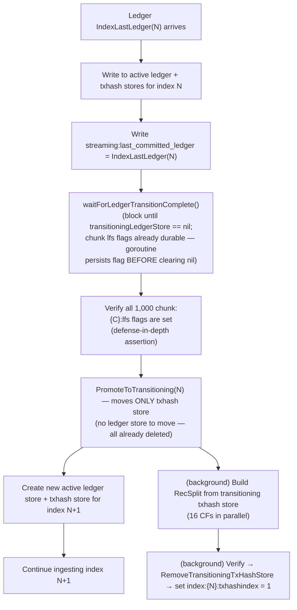
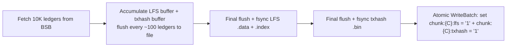

# Checkpointing and Transitions

## Overview

This document is the canonical reference for all boundary math: chunk boundaries, index boundaries, streaming checkpoint timing, transition triggers, and crash recovery resume formulas. It does not describe workflows in detail — cross-reference the workflow docs for that. It establishes the invariants that all implementations must satisfy.

---

## Key Constants

```go
const (
    FirstLedger      = 2             // Stellar genesis ledger (not 0 or 1)
    IndexSize        = 10_000_000    // Ledgers per index
    ChunkSize        = 10_000        // Ledgers per LFS chunk / raw txhash file
    chunks_per_index = IndexSize / ChunkSize  // 1000 chunks per index
)
```

---

## Index Boundary Formulas

```go
func ledgerToIndexID(ledgerSeq uint32) uint32 {
    return (ledgerSeq - FirstLedger) / IndexSize
}

func IndexFirstLedger(indexID uint32) uint32 {
    return (indexID * IndexSize) + FirstLedger
}

func IndexLastLedger(indexID uint32) uint32 {
    return ((indexID + 1) * IndexSize) + FirstLedger - 1
}
```

### Index Boundary Table

| Index ID | First Ledger | Last Ledger | Chunk IDs |
|---------|-------------|------------|-----------|
| 0 | 2 | 10,000,001 | 0–999 |
| 1 | 10,000,002 | 20,000,001 | 1000–1999 |
| 2 | 20,000,002 | 30,000,001 | 2000–2999 |
| 3 | 30,000,002 | 40,000,001 | 3000–3999 |
| N | (N×10M)+2 | ((N+1)×10M)+1 | N×1000–(N×1000)+999 |

**Invariant**: Index boundaries are **inclusive** on both ends. Ledger (N×10M)+1 is in index N-1; ledger (N×10M)+2 is in index N. No gaps, no overlaps.

---

## Chunk Boundary Formulas

```go
func ledgerToChunkID(ledgerSeq uint32) uint32 {
    return (ledgerSeq - FirstLedger) / ChunkSize
}

func chunkFirstLedger(chunkID uint32) uint32 {
    return (chunkID * ChunkSize) + FirstLedger
}

func chunkLastLedger(chunkID uint32) uint32 {
    return ((chunkID + 1) * ChunkSize) + FirstLedger - 1
}

func IndexID(chunkID uint32) uint32 {
    return chunkID / chunks_per_index  // chunkID / 1000
}
```

### Chunk Boundary Examples

| Chunk ID | First Ledger | Last Ledger | Index |
|---------|-------------|------------|-------|
| 0 | 2 | 10,001 | 0 |
| 1 | 10,002 | 20,001 | 0 |
| 999 | 9,990,002 | 10,000,001 | 0 |
| 1000 | 10,000,002 | 10,010,001 | 1 |
| 4999 | 49,990,002 | 50,000,001 | 4 |

**Invariant**: Chunk boundaries align exactly with index boundaries. Chunk 999 ends at ledger 10,000,001 (= index 0 last ledger). Chunk 1000 starts at ledger 10,000,002 (= index 1 first ledger).

### Detailed Chunk Enumeration (Index 0 and Index 5)

Each chunk contains exactly 10,000 ledgers. Both first and last ledger are **inclusive** — the chunk file stores all ledgers from first through last.

**Index 0** (chunks 0–999, ledgers 2–10,000,001):

| Chunk ID | First Ledger (inclusive) | Last Ledger (inclusive) | Ledger Count | File Path |
|---------|------------------------|----------------------|-------------|-----------|
| 0 | 2 | 10,001 | 10,000 | `immutable/ledgers/chunks/0000/000000.data` |
| 1 | 10,002 | 20,001 | 10,000 | `immutable/ledgers/chunks/0000/000001.data` |
| 998 | 9,980,002 | 9,990,001 | 10,000 | `immutable/ledgers/chunks/0000/000998.data` |
| 999 | 9,990,002 | 10,000,001 | 10,000 | `immutable/ledgers/chunks/0000/000999.data` |

- Chunk 0 starts at `FirstLedger` (2). Chunk 999 ends at `IndexLastLedger(0)` (10,000,001).
- Chunk 1 contains ledgers 10,002 through 20,001 inclusive — not 10,001 (that belongs to chunk 0).

**Index 5** (chunks 5000–5999, ledgers 50,000,002–60,000,001):

| Chunk ID | First Ledger (inclusive) | Last Ledger (inclusive) | Ledger Count | File Path |
|---------|------------------------|----------------------|-------------|-----------|
| 5000 | 50,000,002 | 50,010,001 | 10,000 | `immutable/ledgers/chunks/0005/005000.data` |
| 5001 | 50,010,002 | 50,020,001 | 10,000 | `immutable/ledgers/chunks/0005/005001.data` |
| 5998 | 59,980,002 | 59,990,001 | 10,000 | `immutable/ledgers/chunks/0005/005998.data` |
| 5999 | 59,990,002 | 60,000,001 | 10,000 | `immutable/ledgers/chunks/0005/005999.data` |

- Chunk 5000 starts at `IndexFirstLedger(5)` (50,000,002). Chunk 5999 ends at `IndexLastLedger(5)` (60,000,001).
- No gaps: chunk 4999 last ledger is 50,000,001, chunk 5000 first ledger is 50,000,002.

**Verification formula**: `chunkFirstLedger(C) = (C × 10,000) + 2` and `chunkLastLedger(C) = ((C+1) × 10,000) + 1`. For chunk 5001: first = (5001 × 10,000) + 2 = 50,010,002, last = (5002 × 10,000) + 1 = 50,020,001.

**Index formulas**:
- `index_id = chunk_id / chunks_per_index`
- `IndexFirstChunk(N) = N × chunks_per_index`
- `IndexLastChunk(N) = (N+1) × chunks_per_index - 1`

---

## BSB Instance Boundaries (Backfill)

BSB instances are concurrent workers, each assigned a contiguous sub-range of a 10M-ledger index. All instances start simultaneously and run in parallel.

```go
// With num_bsb_instances_per_index = 20:
bsbInstanceSize = IndexSize / 20 = 500_000  // ledgers per BSB instance
chunksPerInstance = bsbInstanceSize / ChunkSize = 50

// BSB instance B within index N starts at:
bsbFirstLedger(N, B) = IndexFirstLedger(N) + B*bsbInstanceSize
bsbLastLedger(N, B)  = IndexFirstLedger(N) + (B+1)*bsbInstanceSize - 1

// With num_bsb_instances_per_index = 10:
bsbInstanceSize = 1_000_000
chunksPerInstance = 100
```

**Invariant**: `bsbInstanceSize` is always an exact multiple of `ChunkSize`. Both valid values (10 and 20) satisfy this: 500K/10K = 50, 1M/10K = 100.

---

## Streaming Checkpoint Formula

In streaming mode, a checkpoint is written to the meta store after every ledger:

```go
// Written to meta store after every successful WriteBatch to the active ledger store + txhash store:
streaming:last_committed_ledger = ledgerSeq  // uint32 big-endian

// On crash recovery, resume from:
resume_ledger = last_committed_ledger + 1
```

**Checkpoint ledger sequence** (for context — NOT a modulo check; streaming checkpoints every single ledger):

The checkpoint key tracks the last ledger safely committed with WAL to both the ledger store and the txhash store. It is written atomically with the WriteBatch for that ledger. No periodic-only checkpointing in streaming mode — every ledger is a checkpoint.

**Crash re-ingest range**: After crash with `last_committed_ledger = L`, ledgers `[L+1, crash_point]` are re-ingested. These writes are idempotent (same input → same key/value in both active stores).

---

## Transition Trigger (Streaming)

```go
func shouldTriggerTransition(ledgerSeq uint32) bool {
    return ledgerSeq == IndexLastLedger(ledgerToIndexID(ledgerSeq))
}
```

Transitions trigger at: **10,000,001 / 20,000,001 / 30,000,001 / …**

Pattern: `((N+1) × 10,000,000) + 1` for index N.

---

## Ledger Sub-flow Transition at Chunk Boundaries (Streaming)

While a streaming index is in `ACTIVE` state, the ledger sub-flow transitions independently at every chunk boundary (every 10K ledgers). This is NOT a background optimization — it IS the ledger store's transition lifecycle.

**Each sub-flow can have at most 1 active store and 1 transitioning store at any point in time.**

| Sub-flow | Transition cadence | Max active | Max transitioning | Max total |
|----------|-------------------|------------|-------------------|-----------|
| Ledger | Every 10K ledgers (chunk boundary) | **1** | **1** | **2** |
| TxHash | Every 10M ledgers (index boundary) | **1** | **1** | **2** |

**When**: After ledger `chunkLastLedger(C)` is committed to the ledger store (i.e., every 10,000 ledgers):

1. `SwapActiveLedgerStore` moves the current active ledger store to `transitioningLedgerStore` (stays open for reads)
2. A new active ledger store opens for the next chunk
3. A background goroutine executes the following steps **in this exact order**:
   1. Read 10K ledgers from the transitioning ledger store
   2. Write `.data` + `.index` files
   3. fsync both files
   4. Write `chunk:{chunkID:06d}:lfs = "1"` to meta store (WAL-backed) — **MUST complete before step 5**
   5. Close the transitioning ledger store and delete its directory
   6. Set `transitioningLedgerStore = nil` and signal the condition variable — `waitForLedgerTransitionComplete()` unblocks HERE

**Critical ordering invariant**: The `lfs` flag is the durability checkpoint; the nil-signal is just a notification. The flag MUST be durable in the meta store before the store reference is cleared and the completion signal fires. If the goroutine clears the store reference before persisting the flag, `waitForLedgerTransitionComplete()` unblocks prematurely. A crash in this window would leave the flag absent, causing the chunk to be re-ingested on recovery even though the LFS files were already written.

**Index state stays `ACTIVE`** throughout — the ledger sub-flow transitions happen entirely within the ACTIVE phase. The txhash store is **not** transitioned during ACTIVE; the txhash sub-flow's RecSplit build only happens at the 10M-ledger index boundary.

**Result**: By the time the index boundary is reached, ALL 1,000 `chunk:{C}:lfs` flags are already set. There are no "remaining" chunks to flush at transition time — only the txhash store's RecSplit build remains.

**Key invariant**: `chunk:{C}:lfs` for streaming indexes is set during ACTIVE at each chunk boundary as the ledger sub-flow transitions. There is no deferred "Phase 1" flush at transition time. `chunk:{C}:txhash` is **never** written for streaming indexes — it is backfill-only.

---

### What Happens at Index Boundary (TxHash Sub-flow Transition)

At the index boundary (every 10M ledgers), all ledger sub-flow transitions have already completed during ACTIVE. The index boundary triggers only the txhash sub-flow transition:



**Key points**:
- The `waitForLedgerTransitionComplete()` call blocks until ALL in-flight chunk LFS flush goroutines have set `transitioningLedgerStore = nil`. Because each goroutine enforces `chunk:{C}:lfs` persistence BEFORE clearing the nil-signal (see goroutine ordering above), by the time `waitForLedgerTransitionComplete` unblocks, all `chunk:{C}:lfs` flags for chunks 0 through 999 are guaranteed durable in the meta store. It does not only wait for the last chunk — if an earlier chunk's goroutine (e.g., chunk 998) is still running when chunk 999's boundary is hit, this call waits for both. Without this, an index transition could proceed while an earlier chunk's data is in an undefined state.
- `PromoteToTransitioning` moves ONLY the txhash store — all ledger stores were individually transitioned and deleted at their chunk boundaries during ACTIVE.
- The transitioning txhash store remains open for queries until `RemoveTransitioningTxHashStore` deletes it after verification.
- The RecSplit build goroutine and the next-index ingestion run **concurrently**.

---

## Backfill Chunk Completion Checkpoints

Backfill has no per-ledger checkpoint. The checkpoint granularity is the **chunk** (10K ledgers). A chunk is considered complete only when both meta store flags are set:

```
chunk:{chunkID:06d}:lfs     = "1"  (written after fsync of .data + .index)
chunk:{chunkID:06d}:txhash  = "1"  (written after fsync of .bin)
```

**Why per-chunk (not per-BSB-instance)?** Because all 20 BSB instances run concurrently, completed chunks at crash time are non-contiguous — instance 3 may have finished all 50 of its chunks while instance 0 only completed 9. Per-instance tracking would be insufficient to represent this gap pattern. Per-chunk flags handle every completion state regardless of which instance completed them.

**Resume rule**: On restart, scan ALL 1,000 chunks for each non-COMPLETE index. Skip chunks where both flags = `"1"`. Rewrite from scratch any chunk with missing flags.

**Partial file safety**: If either `chunk:{C}:lfs` or `chunk:{C}:txhash` is absent (or not `"1"`), **both** files are deleted and rewritten from scratch. There is no partial-rewrite path — even if only one flag is missing, both the `.data`/`.index` and the `.bin` are discarded and re-fetched. The only way to skip a chunk is if **both** flags are `"1"`.

### Chunk Write Sequence



`chunk:{C}:lfs` and `chunk:{C}:txhash` are always written in this order. An implementation MUST set both atomically in a single meta store WriteBatch after both fsyncs complete. This is mandatory — writing the flags in separate operations risks a crash leaving one flag set and the other missing, which would cause the resume logic to discard and rewrite a chunk that was actually complete (wasting work) or, worse, to treat an incomplete chunk as done (corrupting query results).

---

## RecSplit Transition Trigger (Backfill)

```go
func allChunksDoneForIndex(indexID uint32, metaStore) bool {
    for chunkID in range [indexID*chunks_per_index, (indexID+1)*chunks_per_index) {
        if metaStore.Get(fmt.Sprintf("chunk:%06d:lfs", chunkID)) != "1" { return false }
        if metaStore.Get(fmt.Sprintf("chunk:%06d:txhash", chunkID)) != "1" { return false }
    }
    return true
}
```

When `allChunksDoneForIndex` returns true:
1. Begin building RecSplit index CFs 0–15 from raw txhash flat files (all-or-nothing)
2. After all 16 CFs are built and fsynced: set `index:{N:04d}:txhashindex = "1"`
3. Delete raw txhash flat files for index N (via `cleanup_txhash`)

**Async with next index**: When RecSplit starts for index N, the orchestrator slot is freed. The next index (N+1) begins ingestion immediately. RecSplit (~4 hours) runs concurrently with index N+1 ingestion.

---

## Complete Walk-Through: Index 0 (Backfill)

```
Ledger 2        → chunk 0 starts accumulating (lfs+txhash buffers)
Ledger 100      → flush buffer to disk (100-ledger cadence)
Ledger 10,001   → chunk 0 last ledger: flush + fsync → set chunk:000000:lfs + chunk:000000:txhash
Ledger 10,002   → chunk 1 starts
...
Ledger 10,000,001 → chunk 999 last ledger: flush + fsync → set chunk:000999:lfs + chunk:000999:txhash
                    allChunksDoneForIndex(0) = true
                    → trigger RecSplit build (async)
                    → worker slot freed: begin ingesting index 1
RecSplit builds (concurrent with index 1 ingestion)
All 16 CFs done → index:0000:txhashindex = "1"
                → delete immutable/txhash/0000/raw/*.bin
```

---

## Complete Walk-Through: Index 0 → Index 1 Transition (Streaming)

```
During ACTIVE (Index 0, ledger sub-flow transitions at each chunk boundary):
  Ledger 10,001 (= chunkLastLedger(0)):
    SwapActiveLedgerStore: move active → transitioningLedgerStore, open new active for chunk 1
    Background goroutine (steps in strict order):
      1. Read chunk 0 from transitioning store
      2-3. Write LFS .data + .index files → fsync both
      4. Set chunk:000000:lfs = "1" (WAL-backed, BEFORE clearing nil)
      5. Close + delete transitioning ledger store
      6. Set transitioningLedgerStore = nil → signal condition variable
  Ledger 20,001 (= chunkLastLedger(1)):
    Same lifecycle: swap → flush → fsync → chunk:{C}:lfs → close → nil-signal
  ... (each chunk boundary triggers an independent ledger sub-flow transition;
       at most 1 active + 1 transitioning ledger store exist at any time)
  Ledger 9,990,001 (= chunkLastLedger(998)):
    Same lifecycle: swap → flush → fsync → chunk:{C}:lfs → close → nil-signal
  Ledger 10,000,001 (= chunkLastLedger(999) = IndexLastLedger(0)):
    SwapActiveLedgerStore for chunk 999 → triggers ledger sub-flow transition
    (chunk 999's LFS flush goroutine is now running in background)

Index boundary handling (ledger 10,000,001 = IndexLastLedger(0)):
  1. Write ledger 10,000,001 to Index 0 active ledger store + txhash store
  2. Write streaming:last_committed_ledger = 10,000,001
  3. waitForLedgerTransitionComplete()
     → blocks until transitioningLedgerStore == nil (not just chunk 999 —
       if chunk 998's goroutine is still running, waits for it too)
     → by goroutine ordering invariant, all chunk lfs flags are already durable
       in the meta store by the time nil is set
  4. Verify all 1,000 chunk:{C}:lfs flags are set (defense-in-depth assertion)
  5. PromoteToTransitioning(0) — moves ONLY txhash store to transitioningTxHashStore
     (no ledger store to move — all 1,000 already transitioned and deleted)
  6. Create Index 1 ledger store + txhash store

Ledger 10,000,002:
  Written to Index 1 active ledger store + txhash store

RecSplit build goroutine (running concurrently with Index 1 ingestion):
  Build 16 RecSplit CFs from transitioning txhash store (read each CF by nibble)
  Spot-check verify LFS + RecSplit
  Set index:0000:txhashindex = "1"
  AddImmutableStores(0, lfsStore, recsplitStore)
  RemoveTransitioningTxHashStore(0) — close + delete transitioning txhash store

Queries during transition:
  Index 0 ledger queries: route to LFS (all ledger stores already deleted;
    LFS files written at each chunk boundary during ACTIVE)
  Index 0 txhash queries: route to transitioning txhash store (still open) until COMPLETE,
    then route to RecSplit index
  Index 1: route to active ledger store / txhash store
```

---

## Math Reference Card

| Formula | Expression |
|---------|-----------|
| Index of ledger L | `(L - 2) / 10,000,000` |
| First ledger of index N | `(N × 10,000,000) + 2` |
| Last ledger of index N | `((N+1) × 10,000,000) + 1` |
| Chunk of ledger L | `(L - 2) / 10,000` |
| First ledger of chunk C | `(C × 10,000) + 2` |
| Last ledger of chunk C | `((C+1) × 10,000) + 1` |
| Index of chunk C | `C / chunks_per_index` (= `C / 1000`) |
| First chunk of index N | `N × chunks_per_index` (= `N × 1000`) |
| Last chunk of index N | `(N+1) × chunks_per_index - 1` (= `(N × 1000) + 999`) |
| Streaming resume ledger | `last_committed_ledger + 1` |
| Transition triggers at | `((N+1) × 10,000,000) + 1` for index N |

---

## Store Lifecycle Contracts

The four store lifecycle operations below are the building blocks of all chunk and index transitions. Each has formal preconditions (must be true before calling), postconditions (guaranteed true after the call returns), and idempotency guarantees. Violating a precondition is a programming error and should panic.

---

### `SwapActiveLedgerStore(indexID, newChunkID)`

Moves the current active ledger store to transitioning and creates a new empty active ledger store for the next chunk. Called at every chunk boundary during streaming ACTIVE phase.

**Preconditions:**
1. An active ledger store exists for `indexID`
2. `transitioningLedgerStore == nil` — the previous chunk's LFS flush goroutine has completed and called `CompleteLedgerTransition`
3. The last ledger of the current chunk has been committed to the active ledger store

**Postconditions:**
1. The old active ledger store is now `transitioningLedgerStore` (open for reads by query router and by the background LFS flush goroutine)
2. A new empty active ledger store exists at `ledger-store-chunk-{newChunkID:06d}/`, ready for writes
3. A background LFS flush goroutine has been spawned for the old store

**Idempotency:** NOT idempotent. Calling twice without the intervening `CompleteLedgerTransition` violates precondition 2 and must panic.

**Crash safety:** If the process crashes after the new store is created but before the meta store is updated, the orphaned new store directory is cleaned up by startup reconciliation (no meta store entry → delete).

---

### `CompleteLedgerTransition(indexID, chunkID)`

Called by the background LFS flush goroutine after LFS files are fsynced and the `chunk:{C}:lfs` flag is set. Closes and deletes the transitioning ledger store.

**Preconditions:**
1. `transitioningLedgerStore != nil` — a transitioning ledger store exists
2. `chunk:{C}:lfs` flag for this chunk is set in the meta store (WAL-backed) — the LFS files are durable
3. The LFS `.data` and `.index` files for this chunk have been fsynced

**Postconditions:**
1. The transitioning ledger store is closed (all file handles released)
2. The transitioning ledger store directory (`ledger-store-chunk-{chunkID:06d}/`) is deleted from disk
3. `transitioningLedgerStore == nil` — unblocks `waitForLedgerTransitionComplete()` via condition variable

**Idempotency:** NOT idempotent. Calling twice violates precondition 1 (the store is already nil after the first call) and must panic.

**Crash safety:** If the process crashes after `chunk:{C}:lfs` is set but before the store directory is deleted, startup reconciliation detects the orphaned directory (active store exists but index is COMPLETE or chunk's `lfs` flag is already set) and deletes it.

---

### `PromoteToTransitioning(indexID)`

Promotes the active txhash store to transitioning at the index boundary. Called once per index, after all chunk transitions are verified complete. Part of the atomic index boundary WriteBatch sequence.

**Preconditions:**
1. All 1,000 `chunk:{C}:lfs` flags for this index are set in the meta store (verified by `waitForLedgerTransitionComplete()`)
2. An active txhash store exists for `indexID`
3. No transitioning txhash store currently exists (previous index's transition is fully complete)
4. `streaming:last_committed_ledger >= IndexLastLedger(indexID)` — the last ledger of the index has been committed

**Postconditions:**
1. The active txhash store is now the transitioning txhash store (open for reads by query router and RecSplit build goroutines)
2. The active txhash store slot is empty (ready for the new index's store)
3. No more writes will go to the transitioning store — it is frozen

**Idempotency:** Idempotent if the store is already in transitioning state (the physical operation is a no-op). This is required for crash recovery — the atomic WriteBatch at the index boundary may succeed but the process may crash before the RecSplit goroutine starts. On restart, `PromoteToTransitioning` is called again and must not fail.

**Crash safety:** The store directory is not moved or renamed — it stays at `txhash-store-index-{indexID:04d}/`. The "promotion" is purely a logical state change (in-memory pointer swap). If the process crashes after promotion, the store is found on disk during startup reconciliation with all `chunk:{C}:lfs` flags present but `index:{N}:txhashindex` absent (BUILD_READY state), and the transition resumes normally.

---

### `RemoveTransitioningTxHashStore(indexID)`

Closes and deletes the transitioning txhash store after RecSplit build and verification are complete. The last step in the streaming transition workflow.

**Preconditions:**
1. A transitioning txhash store exists for `indexID`
2. `index:{N}:txhashindex` is set in the meta store (all 16 CFs built and fsynced)
3. RecSplit verification has passed (spot-check: 1 ledger + 1 txhash per chunk minimum)
5. The query router has been updated to serve index N from immutable stores (LFS + RecSplit) via `AddImmutableStores(indexID)`

**Postconditions:**
1. The transitioning txhash store is closed (all file handles released)
2. The transitioning txhash store directory (`txhash-store-index-{indexID:04d}/`) is deleted from disk
3. No transitioning txhash store exists — the system is fully in steady state for index N

**Idempotency:** Idempotent if the store directory does not exist (deletion of a non-existent directory is a no-op). This is required for crash recovery — if the process crashes after deletion starts but before it completes (partial directory removal), the next startup's reconciliation pass deletes any remnants.

**Crash safety:** If the process crashes after `COMPLETE` is set but before the store is deleted, startup reconciliation detects the orphaned transitioning store (index is COMPLETE but store directory still exists) and deletes it. Queries are already routed to immutable stores, so the orphaned store is never accessed.

---

## Related Documents

- [02-meta-store-design.md](./02-meta-store-design.md) — state keys and enums that encode this math
- [03-backfill-workflow.md](./03-backfill-workflow.md) — backfill task graph and RecSplit build sequence
- [04-streaming-and-transition.md](./04-streaming-and-transition.md) — streaming checkpoint write path and transition goroutine detail
- [07-crash-recovery.md](./07-crash-recovery.md) — how these formulas drive recovery decisions
