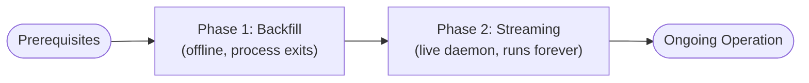
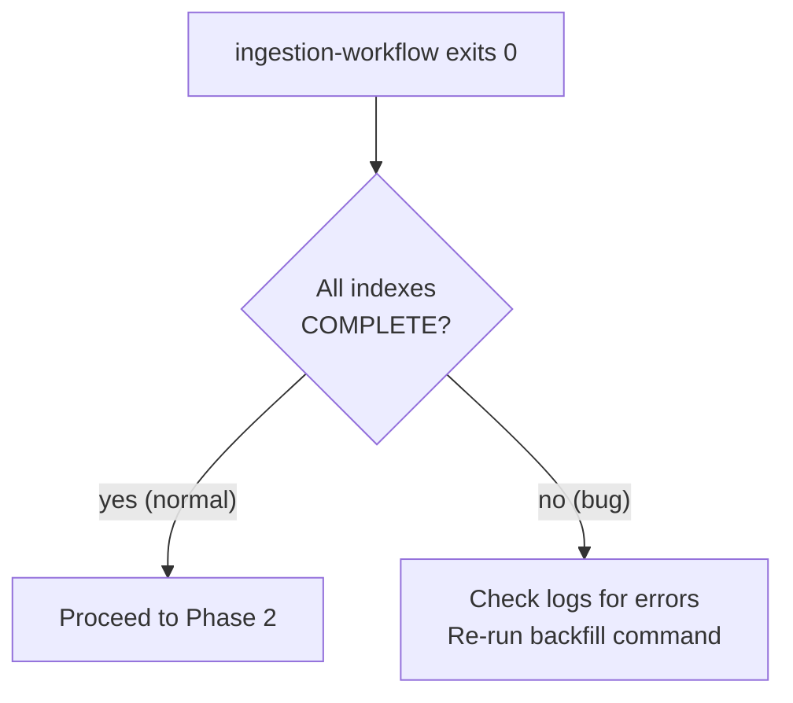

# Recommended Operator Approach

> **Audience**: Operators deploying the Stellar Full History RPC Service for the first time, or recovering from a crash.  
> **Goal**: Ingest full Stellar history (backfill), then switch to live streaming, with correct crash recovery at every step.

---

## Overview

The full deployment lifecycle has two sequential phases:



These phases are entirely separate. Backfill completes and **exits**. Streaming then starts from where backfill left off. There is no shared process — they use two separate config files.

---

## Prerequisites

### Hardware

See [12-metrics-and-sizing.md](./12-metrics-and-sizing.md) for full hardware requirements. Minimum:

| Resource | Minimum | Notes |
|----------|---------|-------|
| CPU | 32 cores | Flat worker pool (40 task slots) + RecSplit build threads |
| RAM | 128 GB | Dominated by RocksDB block cache during streaming |
| Disk — active stores (streaming) | SSD, ~1.7 TB per 10M-index | Fast write path for RocksDB |
| Disk — immutable stores | SSD, ~1.5 TB per 10M-index | Sequential writes during backfill; query reads afterward |
| Disk — meta store | SSD | Random reads/writes |
| Network | High bandwidth | GCS/S3 fetches: up to 40 concurrent process_chunk tasks |

### Software

1. **Build the binary** per [go-build skill / Makefile](../README.md):
   ```bash
   make build-workflow
   # produces bin/ingestion-workflow
   ```
   Delete the binary after confirming it runs (project convention prohibits committed binaries).

2. **Backfill data source** — exactly one of:
   - GCS/S3 bucket with Stellar ledger archives (`[backfill.bsb]`) — **recommended**
   - Local `stellar-core` binary + `captive-core.cfg` (`[backfill.captive_core]`)

3. **Streaming data source** — always `stellar-core`:
   - `stellar-core` binary + `captive-core.cfg` (`[streaming.captive_core]`)

4. **Data directory** — create the base directory before first run:
   ```bash
   mkdir -p /data/stellar-rpc
   ```
   The binary creates subdirectories automatically on first run.

---

## Phase 1: Backfill

### 1.1 Choose Which Indexes to Backfill

Decide the ledger range you want to ingest. Boundaries must be exact index boundaries:

| To ingest history through | Set `end_ledger` to |
|--------------------------|---------------------|
| Index 0 only (ledgers 2–10,000,001) | `10000001` |
| Indexes 0–2 (ledgers 2–30,000,001) | `30000001` |
| All currently-closed ledgers (e.g. ~50M) | `50000001` (adjust to last complete index) |

Always set `start_ledger = 2` to begin from genesis. Starting from a later index is valid but means streaming will refuse to start until all prior indexes are `COMPLETE`.

### 1.2 Create the Backfill Config

**BSB (GCS/S3) — recommended:**

```toml
# backfill.toml
[service]
data_dir = "/data/stellar-rpc"   # required
# http_port = 8080               # optional — defaults to 8080

[backfill]
start_ledger      = 2              # required — valid index starts: 2, 10000002, 20000002, …
end_ledger        = 30000001       # required — adjust to your desired end; valid index ends: 10000001, 20000001, …
# workers         = 40             # optional — defaults to 40; total concurrent task slots
# chunks_per_txhash_index = 1000          # optional — defaults to 1000

[backfill.bsb]
bucket_path   = "gs://stellar-ledgers/mainnet"   # required — your GCS or S3 bucket path
# buffer_size_override = 1000   # optional — BSB internal prefetch depth per instance
# buffer_size   = 1000           # optional — defaults to 1000
# num_workers   = 20             # optional — defaults to 20

[rocksdb]
block_cache_mb = 4096            # optional — defaults to 8192; 4096 is sufficient for backfill
```

**CaptiveStellarCore (no GCS access):**

```toml
# backfill.toml
[service]
data_dir = "/data/stellar-rpc"   # required
# http_port = 8080               # optional — defaults to 8080

[backfill]
start_ledger      = 2              # required
end_ledger        = 30000001       # required
workers           = 1              # optional — defaults to 2; use 1 here: each captive_core instance needs ~8GB RAM
# chunks_per_txhash_index = 1000          # optional — defaults to 1000

[backfill.captive_core]
binary_path = "/usr/local/bin/stellar-core"   # required
config_path = "/etc/stellar/captive-core.cfg" # required
```

> **Warning**: Do not combine `[backfill.bsb]` and `[backfill.captive_core]` — the binary will reject the config with a startup error.

### 1.3 Run Backfill

```bash
./bin/ingestion-workflow --config backfill.toml --mode backfill
```

This process:
- Ingests all ledgers from `start_ledger` to `end_ledger`, writing LFS chunk files and raw txhash flat files
- Writes chunk completion flags (`chunk:{C}:lfs`, `chunk:{C}:txhash`) to the meta store after every chunk fsync
- After all 1,000 chunks per index are done, starts RecSplit index build (~4 hours per index)
- While RecSplit builds for index N, ingestion of index N+1 runs concurrently
- Exits with code 0 only when all requested indexes are `COMPLETE` (all LFS chunks written + all 16 RecSplit CF index files built)

**Expected duration**: Varies by ledger count, network bandwidth, and CPU. RecSplit build is the long tail (~4h per index).

### 1.4 Handling Crashes During Backfill

If the process crashes or is killed at any point, **re-run the exact same command**:

```bash
./bin/ingestion-workflow --config backfill.toml --mode backfill
```

On restart, the process reads the meta store and:
- Skips any chunk where both `chunk:{C}:lfs = "1"` **and** `chunk:{C}:txhash = "1"`
- Redoes any incomplete chunk from scratch
- If all chunks are done but `index:{N}:txhash` is absent, reruns the full RecSplit build from scratch (all-or-nothing)

Non-contiguous completion (some chunks done, gaps in between) is **normal and expected** — 20 BSB instances run in parallel, so their progress diverges. See [07-crash-recovery.md](./07-crash-recovery.md#backfill-crash-recovery) and [02-meta-store-design.md](./02-meta-store-design.md#scenario-2-backfill--crash-mid-index-non-contiguous-state-resume) for details.

### 1.5 Monitor Backfill Progress

The process logs progress every minute. Look for lines like:

```
[2026-01-01T12:00:00Z] [INFO] index:0000 chunk:000045/001000 chunk:{C}:lfs=1 ingested 450000 ledgers
[2026-01-01T12:01:00Z] [INFO] index:0000 recsplit building phase=ADD ...
```

The HTTP endpoint is also available during backfill:
```bash
curl http://localhost:8080/health   # → {"status":"ok","mode":"backfill"}
curl http://localhost:8080/status   # → {"indexes":[{"id":0,"state":"INGESTING","chunks_done":45},...]}
```

### 1.6 Verify Backfill Completion

When the process exits 0, all requested indexes are in `COMPLETE` state. Verify via the status endpoint before the process exits (check the final log lines), or restart with the same command — it will immediately exit 0 if all indexes are already `COMPLETE`.



---

## Phase 2: Streaming

Streaming can only start after all indexes that precede the intended start point are `COMPLETE`. The process validates this at startup and refuses to start with a fatal error if any gap exists.

### 2.1 Create the Streaming Config

```toml
# streaming.toml
[service]
data_dir  = "/data/stellar-rpc"  # required — must be the same data_dir used during backfill
# http_port = 8080               # optional — defaults to 8080

# [streaming]
# start_ledger = <auto>          # optional — defaults to streaming:last_committed_ledger + 1
#                                #   (or first ledger after last COMPLETE index if no checkpoint)
#                                #   Override only if you need to force a specific resume point.

[streaming.captive_core]
binary_path = "/usr/local/bin/stellar-core"   # required
config_path = "/etc/stellar/captive-core.cfg" # required

[rocksdb]
block_cache_mb          = 8192   # optional — defaults to 8192; keep high for streaming query performance
# write_buffer_mb         = 64   # optional — defaults to 64
# max_write_buffer_number = 2    # optional — defaults to 2
```

> The `data_dir` must be the **same** directory used during backfill. The meta store and immutable stores created by backfill must be visible to the streaming process.

### 2.2 Start Streaming

```bash
./bin/ingestion-workflow --config streaming.toml --mode streaming
```

On startup, the process:
1. Validates that all prior indexes have `index:{N}:txhash` set in the meta store. Indexes where all chunk flags are set but the index key is absent are automatically resumed (RecSplit build). Indexes with incomplete chunk flags cause a fatal error — backfill must be run first.
2. Reads `streaming:last_committed_ledger` to determine where to resume (or starts from the first ledger after the last complete index if no checkpoint exists)
3. Creates new active RocksDB stores (`ledger-store-chunk-{chunkID:06d}/` + `txhash-store-index-{indexID:04d}/`) for the current live index
4. Begins ingesting ledgers from CaptiveStellarCore, one ledger per batch
5. After every ledger commit, updates `streaming:last_committed_ledger` in the meta store (WAL-backed)

This process runs **indefinitely** — it is a long-running daemon.

### 2.3 Query Endpoints

Once streaming is running, all endpoints are available:

```bash
curl http://localhost:8080/health
curl "http://localhost:8080/ledger/15000001"            # getLedgerBySequence
curl "http://localhost:8080/transaction/abcd1234..."    # getTransactionByHash
```

Query routing is index-aware: queries for completed indexes hit immutable LFS/RecSplit stores; queries for the live index hit the active RocksDB store. See [08-query-routing.md](./08-query-routing.md).

### 2.4 Automatic Streaming Transitions

When the streaming ingestion loop commits the last ledger of an index (e.g., ledger 10,000,001 for index 0), the process **automatically**:

1. Waits for the last chunk's ledger sub-flow transition to complete (`waitForLedgerTransitionComplete`)
2. Verifies all 1,000 `chunk:{C}:lfs` flags are set (safety check — they were set at each chunk boundary during ACTIVE)
3. Moves ONLY the txhash store to transitioning via `PromoteToTransitioning(N)` (ledger stores are already deleted)
4. Creates new active RocksDB stores for index N+1
5. Spawns a background goroutine to build RecSplit from the transitioning txhash store
6. Continues ingesting index N+1 immediately

The transition goroutine runs concurrently with ingestion. Queries for the transitioning index are served from LFS (ledger queries) and the transitioning txhash store (txhash queries) until the RecSplit build completes, verification passes, and `RemoveTransitioningTxHashStore` is called. **No operator action is needed** — transitions are fully automatic.

Expected transition duration: all LFS chunks are already written at their individual chunk boundaries during ACTIVE, so the only work at the index boundary is the RecSplit build (~4 hours per index).

### 2.5 Monitor Streaming

Log output during normal streaming:
```
[2026-01-01T12:00:00Z] [INFO] streaming ledger=15000001 index=0001 txhash_store_cf_keys=...
[2026-01-01T12:00:01Z] [INFO] ledger_transition:0001 chunk=001500 chunk:{C}:lfs=1
[2026-01-01T12:01:00Z] [INFO] recsplit_build:0000 cf=0a:done
```

Health endpoint always responds even during transition:
```bash
curl http://localhost:8080/health
# → {"status":"ok","mode":"streaming","last_committed_ledger":15000001}
```

---

## Phase 3: Crash Recovery

### Backfill Crash

Re-run the same command. No other action needed. See [§1.4](#14-handling-crashes-during-backfill).

### Streaming Crash

Restart the process with the same command:

```bash
./bin/ingestion-workflow --config streaming.toml --mode streaming
```

On restart:
- Reads `streaming:last_committed_ledger` from the meta store
- Resumes from `last_committed_ledger + 1`
- If a transition was in progress, re-spawns the transition goroutine and resumes from the last completed CF/chunk flag

The active RocksDB store is WAL-backed. Any ledgers committed before the crash are durably present. Ledgers after `last_committed_ledger` are simply re-ingested.

See [07-crash-recovery.md](./07-crash-recovery.md) for all crash scenarios and their recovery decision trees.

### Transition Goroutine Crash

The streaming daemon crash recovery handles this automatically — no separate procedure. On daemon restart, any index where all chunk flags are set but `index:{N}:txhash` is absent is resumed:
- All `chunk:{C}:lfs` flags were set during ACTIVE at their chunk boundaries — no LFS work remains
- RecSplit: all-or-nothing rebuild of all 16 CFs from scratch using the transitioning txhash store

The transitioning txhash store is **never deleted** until the RecSplit build completes and `index:{N}:txhash` is set. It is always safe to restart the daemon.

---

## Multi-Disk Layout (Optional)

For production, spread stores across separate SSD volumes to parallelize I/O. All stores benefit from SSD — meta store requires fast random I/O, active stores need write throughput, and immutable stores see heavy sequential writes during backfill and frequent reads during query serving.

```toml
# Can be included in both backfill.toml and streaming.toml — use the same paths in both
[service]
data_dir = "/data/stellar-rpc"      # required; acts as fallback base for any unset sub-paths

[meta_store]
# optional — defaults to {data_dir}/meta/rocksdb
path = "/ssd0/stellar-rpc/meta/rocksdb"

[active_stores]
# optional — base path where active RocksDB stores are created
# used in streaming mode only; ignored during backfill
# stores created here: ledger-store-chunk-{chunkID:06d}/ and txhash-store-index-{indexID:04d}/
base_path = "/ssd1/stellar-rpc/active-stores"

[immutable_stores]
# both optional — default to {data_dir}/immutable/ledgers and {data_dir}/immutable/txhash
ledgers_base = "/ssd2/stellar-rpc/immutable/ledgers"
txhash_base  = "/ssd3/stellar-rpc/immutable/txhash"
```

Use the same multi-disk paths in both `backfill.toml` and `streaming.toml` so the meta store and immutable stores are found correctly when switching modes.

---

## Quick Reference: Command Summary

```bash
# Step 1: Build
make build-workflow

# Step 2: Backfill (re-run on crash until exit 0)
./bin/ingestion-workflow --config backfill.toml --mode backfill

# Step 3: Stream (restart on crash, runs forever)
./bin/ingestion-workflow --config streaming.toml --mode streaming
```

---

## Checklist

### Before First Run
- [ ] Hardware meets requirements ([12-metrics-and-sizing.md](./12-metrics-and-sizing.md))
- [ ] Binary built and tested (`make build-workflow`)
- [ ] `data_dir` exists and has sufficient disk space
- [ ] `backfill.toml` has valid `start_ledger` / `end_ledger` (exact index boundaries)
- [ ] Exactly one of `[backfill.bsb]` or `[backfill.captive_core]` is present (not both)
- [ ] `streaming.toml` uses the same `data_dir` as `backfill.toml`

### Before Starting Streaming
- [ ] Backfill process exited 0
- [ ] Final backfill log confirms all requested indexes are `COMPLETE`
- [ ] `streaming.toml` created with `[streaming.captive_core]` section
- [ ] `stellar-core` binary is reachable at the configured `binary_path`

### After Crash Recovery
- [ ] Daemon restarted with same config file (no config changes)
- [ ] Health endpoint responds normally
- [ ] Ledger ingestion resumes (visible in logs within ~1 minute)

---

## Related Documents

| Document | What It Covers |
|----------|----------------|
| [03-backfill-workflow.md](./03-backfill-workflow.md) | BSB parallelism, flush discipline, chunk lifecycle, RecSplit build |
| [04-streaming-and-transition.md](./04-streaming-and-transition.md) | CaptiveStellarCore loop, per-ledger checkpoint, transition workflow |
| [07-crash-recovery.md](./07-crash-recovery.md) | Full crash scenario matrix and decision trees |
| [08-query-routing.md](./08-query-routing.md) | How queries are routed during ACTIVE/TRANSITIONING/COMPLETE |
| [09-directory-structure.md](./09-directory-structure.md) | On-disk layout, path formulas |
| [10-configuration.md](./10-configuration.md) | Full TOML reference, validation rules, all example configs |
| [12-metrics-and-sizing.md](./12-metrics-and-sizing.md) | Storage estimates, memory budgets, hardware requirements |
