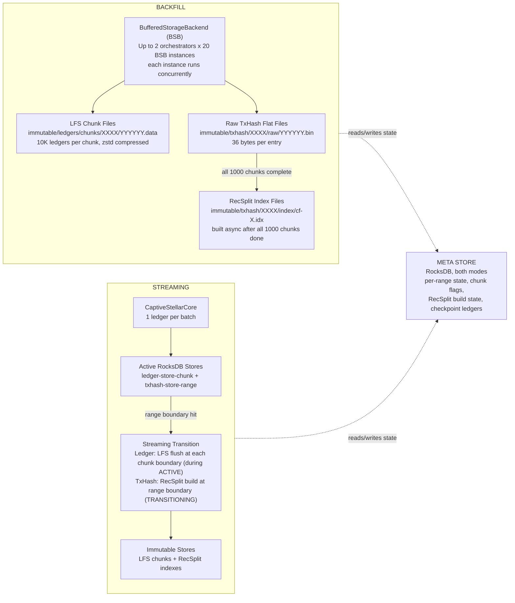
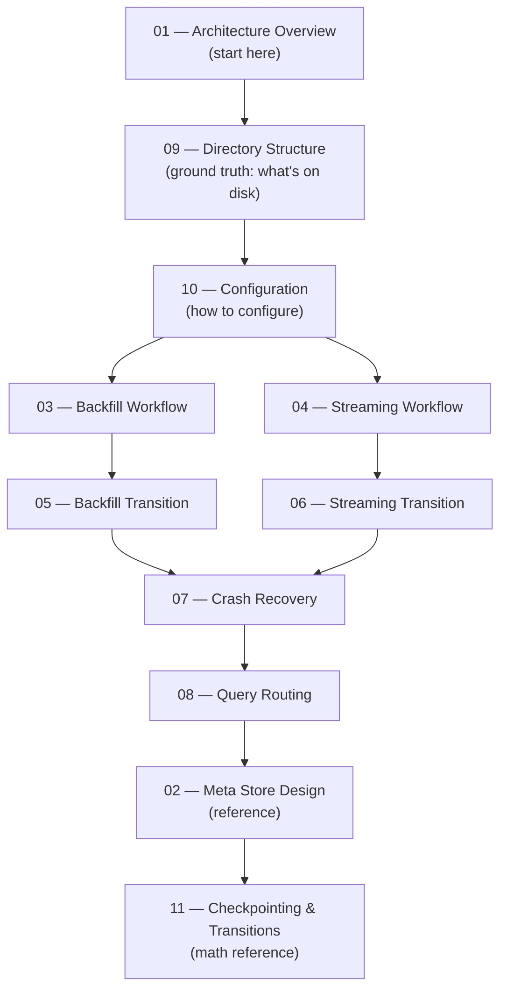

# Stellar Full History RPC Service — Design Docs v2

> **Status**: Complete redesign  
> **Purpose**: Authoritative design documentation for the redesigned ingestion pipeline

---

## What Changed from v1

> v1 design docs are tagged [`v8.0.0`](https://github.com/karthikiyer56/stellar-full-history-ingestion/tree/v8.0.0/design-docs) in `design-docs/`.

### The Fundamental Break

In v1, backfill and streaming were structurally similar pipelines — both wrote through RocksDB as an intermediate store, and both shared a unified transition workflow that converted RocksDB data into immutable files. The v2 redesign breaks this symmetry entirely. **Backfill and streaming are now completely different pipelines with different storage backends, different sub-flow cadences, and separate transition workflows that share no code or state.**

The single biggest driver of this change: RocksDB is the wrong tool for backfill. Backfill ingests tens of millions of ledgers sequentially with no concurrent reads — there is no need for a mutable, WAL-backed store. Writing directly to the final immutable format eliminates an entire class of storage overhead, crash recovery complexity, and disk amplification.

### Backfill Pipeline

The v2 backfill pipeline is a parallel bulk loader that writes directly to the immutable output format.

- **No RocksDB at all.** Neither the ledger store nor the txhash store uses RocksDB during backfill ingestion. Ledgers are written directly to LFS chunk files (`immutable/ledgers/chunks/XXXX/YYYYYY.data`), and transaction hashes are written directly to raw flat files (`immutable/txhash/XXXX/raw/YYYYYY.bin`, 36 bytes per entry). No WAL, no compaction, no intermediate mutable store.

- **BSB parallelism is explicit and structured.** Up to 2 orchestrators run concurrently, each driving up to 20 `BufferedStorageBackend` (BSB) instances. Each BSB instance fetches and processes ledger batches independently. v1 described parallelism vaguely; v2 defines the exact concurrency budget.

- **Ledger store and txhash store have different sub-flow cadences.** The ledger store sub-flow operates at chunk granularity (10K ledgers per chunk, 1,000 chunks per range). The txhash sub-flow collects raw flat files across all 1,000 chunks of a range, then triggers a single RecSplit index build for the whole range once all chunks are complete. These are independent workflows running at different granularities.

- **RecSplit index build is a separate async step.** After all 1,000 chunks of a range complete, a RecSplit build runs to produce the 16 per-CF index files. This build takes ~4 hours for a 10M-ledger range and runs concurrently with the next range's ingestion. In v1, index construction was interleaved with the transition workflow shared with streaming.

- **Flush discipline is explicit.** Backfill flushes every ~100 ledgers to cap RAM usage. v1 left this unspecified, which could cause unbounded memory accumulation under high-throughput ingestion.

- **Crash recovery is chunk-atomic.** A chunk is only considered complete when both `lfs_done` and `txhash_done` flags are set in the meta store after an fsync. On restart, any incomplete chunk is re-ingested from scratch. No WAL replay needed.

### Streaming Pipeline

The v2 streaming pipeline retains RocksDB as the active store (necessary for concurrent reads during live ingestion), but the transition workflow is now completely separate from backfill.

- **Active store cadence is split.** In v1, the ledger store and txhash store were treated as a unified pair. In v2 they have different transition cadences: the **ledger store** transitions at every chunk boundary (~every 10K ledgers, ~1,000 transitions per range via `SwapActiveLedgerStore` — active → transitioning → LFS flush → close + delete; max 1 active + 1 transitioning at any time), while the **txhash store** transitions only at range boundaries (~every 10M ledgers, ~1 transition per range via `PromoteToTransitioning`). These are independent sub-flows on independent RocksDB instances.

- **Streaming transition is a background goroutine, not a shared workflow.** The ledger sub-flow transitions independently at every chunk boundary during ACTIVE — `SwapActiveLedgerStore` moves the old store to transitioning, a background goroutine flushes it to LFS, then `CompleteLedgerTransition` closes and deletes it. By the range boundary, all LFS chunk files are already written. At the range boundary, the only remaining work is the txhash sub-flow: `PromoteToTransitioning` moves only the txhash store, and a background goroutine builds the RecSplit index. Ingestion of the next range proceeds concurrently on new active stores. There is no query gap — the transitioning txhash store remains open and queryable until `RemoveTransitioningTxHashStore` is called after verification.

- **`transitioning/` directory is eliminated.** v1 created a `transitioning/` directory on the filesystem during the transition phase. v2 tracks all transition state in the meta store only. The filesystem only ever contains the final immutable output.

- **`global:mode` meta key is eliminated.** v1 stored the current pipeline mode in the meta store. v2 determines mode from the `--mode` startup flag. The meta store contains only per-range and per-chunk state.

- **Streaming cannot start until all prior ranges are COMPLETE.** There is no partial handoff between backfill and streaming. The streaming process validates this invariant at startup and aborts if any range is in an incomplete state.

### Why This Design?

| Question | Answer |
|----------|--------|
| Why two completely separate pipelines? | Backfill is a bulk import job that exits; streaming is a live daemon that serves queries. Sharing code would force compromises that make each pipeline worse. |
| Why no RocksDB during backfill? | Backfill writes tens of millions of ledgers sequentially with zero concurrent reads. RocksDB's WAL, compaction, and write amplification are pure overhead when you can write directly to the final format. |
| Why 16 column families? | The txhash store shards by the first hex character of the transaction hash (the "nibble"). 16 CFs give uniform distribution, independent RecSplit builds per CF, and per-CF crash recovery granularity. |
| Why Range (10M) > Chunk (10K) > Flush (~100)? | Each level controls a different concern: ranges are the lifecycle unit (state machine, RecSplit build), chunks are the file I/O and crash recovery unit, flushes are the memory management unit during backfill. |
| Why separate ledger + txhash sub-flows in streaming? | They operate at different cadences — ledger stores transition every 10K ledgers (chunk boundary), txhash stores transition every 10M ledgers (range boundary). Independent sub-flows avoid blocking one on the other. |

---

## Glossary of Terms

> *Don't worry if some terms don't fully make sense here — they will once you follow the [recommended reading order](#recommended-reading-order). This glossary is a reference to come back to, not a prerequisite to memorize.*

### Data Hierarchy

| Term | Definition | Defined In |
|------|-----------|-----------|
| **Range** | 10M-ledger unit (contains 1,000 Chunks). The lifecycle and state machine boundary — RecSplit builds and range state transitions happen at this granularity. | [02-meta-store-design.md](./02-meta-store-design.md#range-state-enum) |
| **Chunk** | 10K-ledger unit (1,000 per Range). The atomic crash recovery and file I/O boundary — each chunk produces one LFS file and one raw txhash file (backfill). | [03-backfill-workflow.md](./03-backfill-workflow.md#chunk-sub-workflow) |
| **Flush** | ~100 ledgers. Memory management boundary during backfill — caps RAM by writing accumulated data to the current chunk's files. | [03-backfill-workflow.md](./03-backfill-workflow.md#chunk-sub-workflow) |

### Storage Components

| Term | Definition | Defined In |
|------|-----------|-----------|
| **LFS (Ledger File Store)** | Immutable chunk files storing zstd-compressed `LedgerCloseMeta` records. Path: `immutable/ledgers/chunks/XXXX/YYYYYY.data`. One file per Chunk, written during ingestion in both modes. | [09-directory-structure.md](./09-directory-structure.md#lfs-chunk-path-convention) |
| **RecSplit** | Minimal perfect hash (MPH) index for txhash → ledger lookups. 16 index files per Range (one per CF). Built once per Range after all Chunks complete. ~4 hours per Range. | [05-backfill-transition-workflow.md](./05-backfill-transition-workflow.md#recsplit-index-construction) |
| **MPH (Minimal Perfect Hash)** | The algorithm family that RecSplit implements. Maps every key to a unique slot with zero collisions and zero wasted space. | [05-backfill-transition-workflow.md](./05-backfill-transition-workflow.md#recsplit-index-construction) |
| **Raw TxHash Flat File** | Intermediate backfill-only file: 36 bytes per entry (`hash[32] + seq[4]`). Path: `immutable/txhash/XXXX/raw/YYYYYY.bin`. Consumed by RecSplit builder, then deleted. Never created during streaming. | [09-directory-structure.md](./09-directory-structure.md#raw-txhash-flat-file-path-convention) |
| **Active Store** | Mutable RocksDB instance used during streaming ingestion. Two separate instances per range: one for ledgers (default CF), one for txhashes (16 CFs). | [06-streaming-transition-workflow.md](./06-streaming-transition-workflow.md) |
| **Transitioning Store** | A promoted active store undergoing conversion to immutable format. Still open and queryable until conversion completes and verification passes. | [06-streaming-transition-workflow.md](./06-streaming-transition-workflow.md#txhash-sub-flow-transition-every-10m-ledgers) |
| **Meta Store** | Single RocksDB instance tracking all state for both modes: range state, chunk flags, RecSplit progress, streaming checkpoint. Source of truth for crash recovery. | [02-meta-store-design.md](./02-meta-store-design.md) |

### Concurrency and I/O

| Term | Definition | Defined In |
|------|-----------|-----------|
| **BSB (BufferedStorageBackend)** | GCS-backed ledger source used during backfill. Up to 20 instances run concurrently per range orchestrator, each processing 500K ledgers independently. | [03-backfill-workflow.md](./03-backfill-workflow.md#bsb-configuration) |
| **Range Orchestrator** | Top-level backfill goroutine managing one Range. Up to 2 run in parallel, each driving 20 BSB instances. | [03-backfill-workflow.md](./03-backfill-workflow.md#parallelism-model) |
| **CF (Column Family)** | RocksDB partition within the txhash store. 16 CFs per store, one per first hex character of the txhash (the nibble). Enables independent RecSplit builds and per-CF crash recovery. | [05-backfill-transition-workflow.md](./05-backfill-transition-workflow.md#sharding-by-first-hex-character) |
| **Nibble** | First hex character (0–f) of a transaction hash. Determines which CF the txhash is routed to. Equivalent to `txhash[0] >> 4` on raw bytes. | [05-backfill-transition-workflow.md](./05-backfill-transition-workflow.md#sharding-by-first-hex-character) |
| **WAL (Write-Ahead Log)** | RocksDB durability mechanism. Always enabled for the meta store (hard invariant). Ensures committed data survives crashes. | [02-meta-store-design.md](./02-meta-store-design.md#durability-guarantees) |
| **fsync** | OS call that forces data to durable storage. Every completion flag in the meta store is set only *after* the corresponding data file is fsynced. | [02-meta-store-design.md](./02-meta-store-design.md#durability-guarantees) |

### State Machine Flags

| Term | Definition | Defined In |
|------|-----------|-----------|
| **`lfs_done`** | Per-chunk flag set after LFS `.data` + `.index` files are fsynced. Used in both backfill and streaming (set at chunk boundaries during ACTIVE in streaming). | [02-meta-store-design.md](./02-meta-store-design.md#sub-workflow-2-chunk-completion-flags-backfill--streaming) |
| **`txhash_done`** | Per-chunk flag set after the raw txhash `.bin` file is fsynced. Backfill only — streaming writes txhashes directly to RocksDB. | [02-meta-store-design.md](./02-meta-store-design.md#sub-workflow-2-chunk-completion-flags-backfill--streaming) |
| **`cf:XX:done`** | Per-CF RecSplit completion flag (16 per Range, `XX` = `00`–`0f`). Written by both backfill and streaming after each CF index is built and fsynced. In streaming mode, enables per-CF crash recovery (skip completed CFs). In backfill mode, serves as a permanent bookkeeping record (all-or-nothing recovery clears and re-sets all flags on rerun). | [02-meta-store-design.md](./02-meta-store-design.md#sub-workflow-3-recsplit-build-state-backfill--streaming-transition) |

---

## Cadence Reference

### Backfill Cadences

| Event | Granularity | Frequency per Range | What Happens | Details |
|-------|------------|--------------------:|--------------|---------|
| Flush | ~100 ledgers | ~100,000 | RAM contents written to current chunk's LFS + txhash files | [03-backfill-workflow.md](./03-backfill-workflow.md#chunk-sub-workflow) |
| Chunk completion | 10K ledgers | 1,000 | `lfs_done` + `txhash_done` flags set after fsync; files are crash-safe | [03-backfill-workflow.md](./03-backfill-workflow.md#chunk-sub-workflow) |
| RecSplit build | 10M ledgers (full range) | 1 | 16 CF index files built from 1,000 raw txhash flat files (~4 hours) | [05-backfill-transition-workflow.md](./05-backfill-transition-workflow.md) |
| Range completion | 10M ledgers | 1 | `range:N:state = COMPLETE`; raw txhash files deleted | [02-meta-store-design.md](./02-meta-store-design.md#range-state-enum) |

### Streaming Cadences

| Event | Granularity | Frequency per Range | What Happens | Details |
|-------|------------|--------------------:|--------------|---------|
| Ledger commit | 1 ledger | 10,000,000 | Written to active RocksDB stores; `last_committed_ledger` updated | [04-streaming-workflow.md](./04-streaming-workflow.md) |
| Ledger sub-flow transition | 10K ledgers (chunk boundary) | 1,000 | Active ledger store → transitioning → LFS flush → close + delete; `lfs_done` set | [06-streaming-transition-workflow.md](./06-streaming-transition-workflow.md#ledger-sub-flow-transition-every-10k-ledgers) |
| TxHash sub-flow transition | 10M ledgers (range boundary) | 1 | Active txhash store promoted to transitioning; RecSplit build; store deleted after verification | [06-streaming-transition-workflow.md](./06-streaming-transition-workflow.md#txhash-sub-flow-transition-every-10m-ledgers) |

### Range State Machines (Side-by-Side)

| Phase | Backfill | Streaming |
|-------|----------|-----------|
| Ingesting | `INGESTING` — BSB instances writing LFS chunks + raw txhash flat files | `ACTIVE` — CaptiveStellarCore writing to RocksDB; ledger stores transitioning at chunk boundaries |
| Building indexes | `RECSPLIT_BUILDING` — RecSplit built from raw flat files; next range ingests concurrently | `TRANSITIONING` — all LFS chunks already written; RecSplit built from transitioning txhash store |
| Done | `COMPLETE` — LFS + RecSplit verified; raw files deleted | `COMPLETE` — LFS + RecSplit verified; transitioning txhash store deleted |

See [02-meta-store-design.md](./02-meta-store-design.md#range-state-enum) for the full state enum definitions and transition rules.

---

## System Overview



---

## Document Index

| # | Document | What It Covers |
|---|----------|----------------|
| 01 | [01-architecture-overview.md](./01-architecture-overview.md) | Two-pipeline architecture, store types, data flow diagrams |
| 02 | [02-meta-store-design.md](./02-meta-store-design.md) | Full key hierarchy, state enums, range ID formulas, scenario walkthroughs |
| 03 | [03-backfill-workflow.md](./03-backfill-workflow.md) | BSB parallelism, chunk sub-workflow, two-level flush/fsync lifecycle |
| 04 | [04-streaming-workflow.md](./04-streaming-workflow.md) | CaptiveStellarCore loop, checkpoint write, range boundary detection |
| 05 | [05-backfill-transition-workflow.md](./05-backfill-transition-workflow.md) | RecSplit build from raw txhash flat files, per-CF tracking, async overlap |
| 06 | [06-streaming-transition-workflow.md](./06-streaming-transition-workflow.md) | Active RocksDB → LFS + RecSplit, background goroutine, store deletion |
| 07 | [07-crash-recovery.md](./07-crash-recovery.md) | All crash scenarios for both modes, recovery decision tree |
| 08 | [08-query-routing.md](./08-query-routing.md) | getLedgerBySequence and getTransactionByHash routing logic |
| 09 | [09-directory-structure.md](./09-directory-structure.md) | Full file tree, path formulas, multi-disk config |
| 10 | [10-configuration.md](./10-configuration.md) | TOML reference, validation rules, example configs |
| 11 | [11-checkpointing-and-transitions.md](./11-checkpointing-and-transitions.md) | All boundary math, formulas, and transition trigger invariants |
| 12 | [12-metrics-and-sizing.md](./12-metrics-and-sizing.md) | Storage estimates, memory budgets, hardware requirements, structural constants |
| 13 | [13-recommended-operator-approach.md](./13-recommended-operator-approach.md) | Step-by-step operator runbook: backfill → streaming, crash recovery, multi-disk layout |
| 14 | [14-open-questions.md](./14-open-questions.md) | Unresolved design decisions: transition cadence, service identity, TX submission |
| 15 | [15-query-performance.md](./15-query-performance.md) | Query latency breakdown: store lookups, LCM parsing, end-to-end per endpoint |
| — | [FAQ.md](./FAQ.md) | Consolidated Q&A index |

---

## Recommended Reading Order



---

## Quick Reference

### Key Numbers

See [12-metrics-and-sizing.md](./12-metrics-and-sizing.md) for all structural constants, storage estimates, memory budgets, hardware requirements, and timing figures.

### API Endpoints

| Endpoint | Availability |
|----------|-------------|
| `getTransactionByHash(txHash)` | Streaming mode only |
| `getLedgerBySequence(ledgerSeq)` | Streaming mode only |
| `getHealth()` | Both modes |
| `getStatus()` | Both modes |

### Range Boundaries (First 5)

| Range | First Ledger | Last Ledger |
|-------|-------------|------------|
| 0 | 2 | 10,000,001 |
| 1 | 10,000,002 | 20,000,001 |
| 2 | 20,000,002 | 30,000,001 |
| 3 | 30,000,002 | 40,000,001 |
| 4 | 40,000,002 | 50,000,001 |

### Key Design Invariants

1. **No RocksDB during backfill ingestion** — write directly to LFS chunks + raw txhash flat files
2. **Flush every ~100 ledgers** — no unbounded RAM accumulation
3. **Chunk = atomic unit of crash recovery (backfill)** — both `lfs_done` and `txhash_done` must be set after fsync before a chunk is skippable
4. **RecSplit built at range granularity** — triggered once all 1,000 chunks for a range are complete
5. **RecSplit runs async with next range** — while RecSplit builds (~4h), the next range begins ingesting
6. **Backfill and streaming transitions are completely separate workflows**
7. **No `transitioning/` directory** — transition state lives in meta store
8. **No `global:mode` key** — mode determined by `--mode` startup flag
9. **No queries during backfill** — process exits when all requested ranges complete
10. **Streaming: no gaps allowed** — all prior ranges must be COMPLETE before streaming can start

---

## Operator Runbook (Summary)

See [13-recommended-operator-approach.md](./13-recommended-operator-approach.md) for the full step-by-step guide including prerequisites, crash recovery procedures, multi-disk layout, and a deployment checklist.

### First-time setup: ingest history then stream

```
# Step 1: Backfill all historical ranges
ingestion-workflow --config backfill.toml --mode backfill
# Re-run exact same command on failure until it exits 0

# Step 2: Switch to streaming
ingestion-workflow --config streaming.toml --mode streaming
# Long-running daemon; restart on crash
```

### Resuming after crash (backfill)

Re-run the exact same command. The process reads the meta store, skips completed chunks and ranges, and resumes from the first incomplete chunk.

### Resuming after crash (streaming)

Restart the process. It reads `streaming:last_committed_ledger` and resumes from `last_committed_ledger + 1`.
